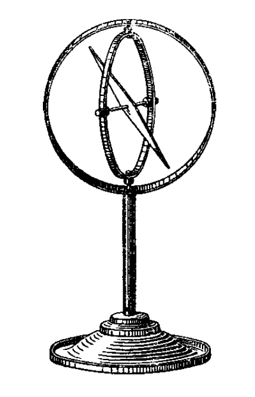
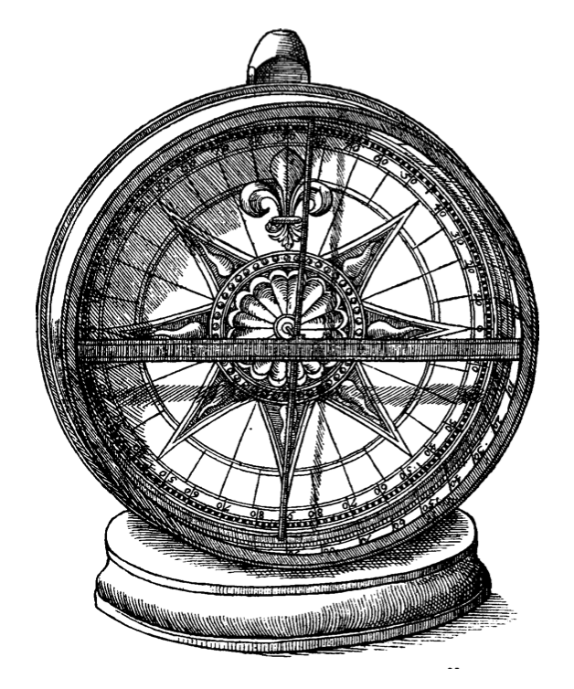
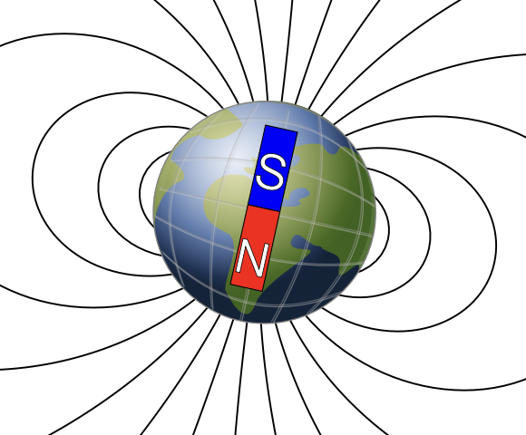
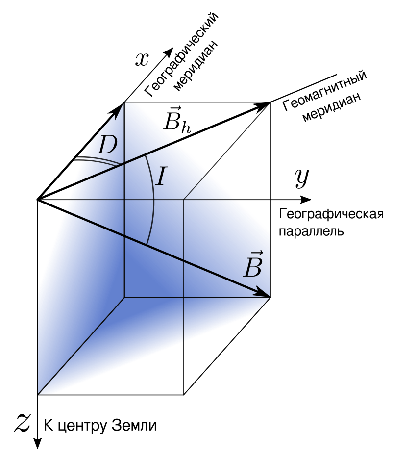
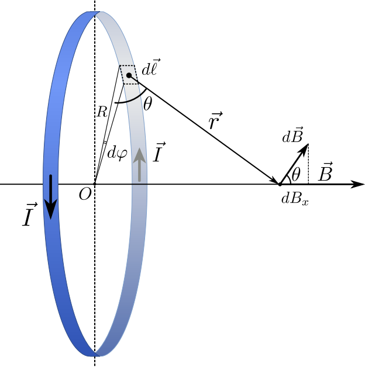
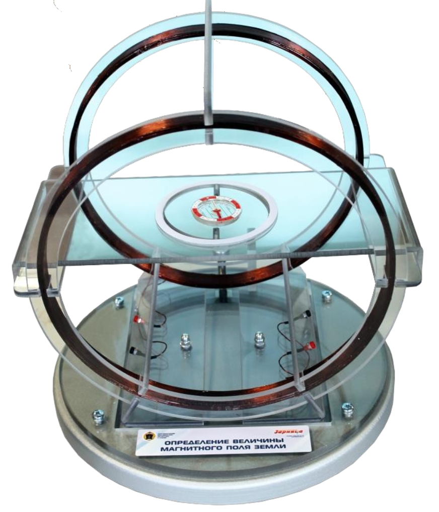

<head>
    
    
</head>

## [MainPage](../../index.md)/[Physics](../README.md)/Lab1.09

## Цель работы

1. Провести измерения направления суммарного магнитного поля, создаваемого Землей и системой катушек Гельмгольца.
2. Определить горизонтальную составляющую магнитного поля Земли.

## Введение

В 1600 г в своем шеститомном трактате «О магните, магнитных телах и большом магните — Земле» английский ученый Уильям Гильберт (William Gilbert) впервые предположил, что Земля является магнитом, ось которого не совпадает с осью ее вращения. В любой точке пространства, окружающего Землю, и на её поверхности обнаруживается действие магнитных сил. Подвешенная на нити или укрепленная на острие магнитная стрелка устанавливается в каждой точке вблизи земной поверхности определенным образом – приблизительно в направлении с севера на юг. Этот основной факт доказывает существование магнитного поля Земли.

В 1635 г. английский математик Генри Геллибранд (Henry Gellibrand), показал что поле земного магнита медленно меняет- ся, а знаменитый астроном и математик Эдмунд Галлей (Edmond Halley) провел первую в мире магнитную съемку океанов и со- здал в 1702 г. первые мировые магнитные карты. В 1835 г. Иоганн Карл Фридрих Гаусс (Johann Carl Friedrich Gauß) про- вел сферический гармонический анализ магнитного поля Земли. Также он создал первую в мире магнитную обсерваторию в Гет- тингене и изобрёл униполярный и бифилярный магнитометры.

Представление о направлении вектора индукции магнитного поля Земли в данной точке можно получить, укрепив магнитную стрелку так, чтобы она могла свободно вращаться и вокруг вер- тикальной, и вокруг горизонтальной оси. Это можно осуществить, например, с помощью так называемого карданова подвеса, пока- занного на Pис. 1, или же специального прибора - деклинометра (Рис. 2). Стрелка устанавливается при этом по направлению век- тора индукции магнитного поля Земли.

РИС. 1. Простейший магнитометр - намагниченная стрелка в кардановом подвесе

РИС. 2. Магнитометр-деклинометр XVII в.

Земное магнитное поле имеет такой вид, как будто земной шар представляет собой магнит с осью, направленной приблизи- тельно с севера на юг (см. рис. 3).

РИС. 3. Общий вид магнитного поля Земли

Земля обладает магнитным полем, которое приблизительно имеет такой вид, как будто земной шар представляет собой маг- нит с осью, направленной с севера на юг. Причем «южный» (𝑆) и «северный» (𝑁) полюса этого магнита располагаются вблизи се- верного и южного географических полюсов, соответственно (см. рис. 6). По данной причине стрелка магнитного компаса лишь примерно направлена на север. Ее направление отличается от истинного указания на север углом, называемым склонением. Бо- лее того, геомагнитное поле (особенно в приполярных областях) имеет существенную вертикальную составляющую, что приводит к тому что намагниченная игла, подвешенная в центре ее масс, в общем случае не принимает горизонтального (параллельного поверхности Земли) положения. Как правило, в северном полу- шарии ее 𝑁-полюс опускается вниз на угол, называемый накло- нением.

Для геомагнитного поля Земли определяют две пары полю- сов: геомагнитные и истинные магнитные полюса. Геомагнитные полюса (дипольные) - это точки пересечения земной поверхности осью магнитного диполя, гипотетически расположенного в центре Земли. В свою очередь, истинные магнитные полюса - это точки, в которых направление силовых линий магнитного поля перпен- дикулярно земной поверхности.

Согласно данным Международной модели главного магнитного поля Земли в 2020 году северный геомагнитный полюс находил- ся точке, лежащей на 80,7∘ северной широты и 72,7∘ западной долготы.

Более того, если положения географических полюсов посто- янны, то геомагнитное поле со временем изменяется. Его полюса дрейфуют, совершая перемещения по земной поверхности со ско- ростью в несколько десятков километров в год. Также меняется магнитный дипольный момент Земли (в настоящую геомагнит- ную эпоху он почти линейно уменьшается). Даже на протяжении одних суток магнитный полюс не стоит на месте, а совершает небольшие смещения вокруг некоторой средней точки. Причиной таких быстрых перемещений является Солнце. Потоки заряжен- ных частиц от него (солнечный ветер) входят в магнитосферу Земли и порождают в земной ионосфере электрические токи. Те, в свою очередь, порождают вторичные магнитные поля, которые возмущают геомагнитное поле.

## Элементы геомагнетизма

В настоящее время употребляются следующие определения:

- Истинные магнитные полюса Земли - точки на земной по- верхности, где магнитная стрелка располагается вертикально.
- Геомагнитные полюсы - точки пересечения магнитной оси Земли с ее поверхностью. Приблизительно можно считать, что Земля является однородно намагниченным шаром, магнитная ось которого составляет угол 10∘ с осью ее вращения.
- Геомагнитный меридиан - проекция силовой линии магнит- ного поля Земли на земную поверхность.
- Магнитный экватор - геометрическое место точек на земной поверхности, в которых магнитная стрелка располагается гори- зонтально. Магнитный экватор не совпадает с географическим экватором.
- Геомагнитная широта - угловое расстояние от геомагнитного экватора до рассматриваемой точки земной поверхности. Геомаг- нитная широта отсчитывается вдоль большого круга, проходяще- го через данную точку и геомагнитные полюсы.

Через магнитные полюса Земли можно провести линии боль- ших кругов - магнитные меридианы, перпендикулярно к ним ли- нию большого круга - магнитный экватор, и параллельно послед- нему, линии малых кругов - магнитные параллели. Таким обра- зом, каждой точке на Земле будут соответствовать не только географические, но и магнитные координаты.

Полное представление о величине магнитного поля Земли в данной точке можно получить, зная значения трех величин, назы- ваемых элементами земного магнетизма: значение горизонтальной составляющей индукции магнитного поля, значения магнитного склонения и наклонения.

РИС. 4. Элементы земного магнетизма

Магнитное склонение (на рис. 4 - 𝐷) - угол между географи- ческим и магнитным меридианами в точке земной поверхности. Магнитное склонение считается положительным, если северный конец магнитной стрелки отклонен к востоку от географического меридиана, и отрицательным - если к западу. Значение магнит- ного склонения указывается на магнитных картах и используется для определения истинного меридиана по показанию магнитного компаса. Для Санкт-Петербурга и Ленинградской области вели- чина магнитного склонения на данный момент равна +11∘12′ (во- сточное склонение). Магнитное наклонение (на рис. 4 - 𝐼) — угол между магнитной силовой линией и горизонтальной плоско- стью. На магнитных полюсах Земли, а также в районах крупных магнитных аномалий магнитное наклонение равно 90∘.

Для определения численного значения индукции магнитного поля в данной точке рассмотрим плоскость геомагнитного мери- диана данного места. Разложим вектор магнитной индукции, ле- жащий в этой плоскости, на две составляющие: горизонтальную 𝐵h и вертикальную 𝐵𝑣 (рис. 4а ). Зная угол наклонения 𝜃 и ве- личину одной из составляющих, мы можем легко вычислить вели- чину другой составляющей или самого вектора 𝐵. Если известна величина горизонтальной компоненты 𝐵h, то из прямоугольного треугольника можно найти вертикальную составляющую:

$$B_v=B_h\cdot tg(\theta).\qquad(1)$$

Также легко можно определить модуль вектора индукции магнит-
ного поля:

$$B=\sqrt{B_h^2+B_v^2}$$

Для определения горизонтальной составляющей индукции маг- нитного поля Земли можно рассмотреть суперпозицию какого- нибудь пробного магнитного поля, индукция которого в данной точке направлена горизонтально (например, поля системы ка- тушек Гельмгольца, см. далее), и горизонтальной составляющей магнитного поля Земли (рис. 5). Угол между направлением проб- ного поля 𝐵⃗𝑐 и земного магнитного поля 𝐵⃗h обозначим как 𝜙, а угол между направлением результирующего поля и земного маг- нитного поля - 𝛼. Рассматривая треугольник, составленный из этих трех векторов и используя теорему синусов, легко полу- чить:

$$\frac{\sin(\alpha)}{\sin(\varphi-\alpha)}=\frac{B_h}{B_c}\qquad(3)$$

РИС. 5. Проекции векторов магнитного полей Земли 𝐵⃗h и катушек Гельмгольца 𝐵⃗c вгоризонтальнойплоскости

Тогда, измерив значения углов 𝛼 и 𝜙, для каждого значения пробного магнитного поля 𝐵𝑐, можно построить линейную зави- симость:

$$B_c=B_h\cdot\frac{\sin(\alpha)}{\sin(\varphi-\alpha)}\qquad(4)$$

где угловой коэффициент - искомое значение горизонтальной со- ставляющей индукции магнитного поля Земли 𝐵h.

## Магнитное поле колец Гельмгольца

Катушками (кольцами) Гельмгольца называется система, со- стоящая из двух одинаковых тонких катушек (колец), располо- женных соосно на расстоянии, равном их радиусу. В простран- стве между катушками создается почти однородное магнитное по- ле, индукцию которого можно найти по формуле:

$$B=\mu_0(\frac{4}{5})^{\frac{3}{2}}\frac{In}{R}\qquad(5)$$

где 𝑛 – число витков в каждой катушке, 𝐼 – сила тока, 𝑅 –
средний радиус каждой катушки.

Получим формулу (5) магнитной индукции в центре колец Гельмгольца. Рассмотрим магнитное поле, создаваемое током, про- текающим по тонкому контуру, имеющему форму окружности ра- диуса 𝑅 (круговой ток).

РИС. 6. Магнитное поле на оси кольца с током

Найдем магнитную индукцию 𝐵 на оси кругового тока на рас- стоянии 𝑥 от центра контура (см. рис. 2). Элемент тока 𝑑l созда- ет в рассматриваемой точке согласно закону Био–Савара–Лапласа индукцию, модуль которой равен

$${\rm d}B=\frac{\mu_0}{4\pi}\frac{I{\rm d}l}{r^2}\qquad(6)$$

От всех элементов тока будет образовываться конус векторов 𝑑𝐵⃗. Из соображений осевой симметрии можно заключить, что результирующий вектор в точке будет направлен параллельно оси 𝑂𝑥 вправо. Это значит, что для нахождения модуля этого вектора необходимо сложить проекции векторов 𝑑𝐵⃗ на ось 𝑂𝑥:

$${\rm d}B_x={\rm d}B\cos\theta=\frac{\mu_0}{4\pi}\frac{I{\rm d}l}{r^2}\frac{R}{r}\qquad(7)$$

Интегрируя выражение (7) по всему токовому контуру и учи- √
тывая, что $r=\sqrt{x^2+R^2}$ и ${\rm d}l=R{\rm d}\varphi$, получим:

$$B(x)=\frac{\mu_0I}{2}\frac{R^2}{(x^2+R^2)^{\frac{3}{2}}}\qquad(8)$$

Формула (9) определяет величину магнитной индукции на оси одного кругового тока. Рассмотрим далее систему из двух коль- цевых проводников одинакового радиуса 𝑅, центры которых рас- положены на оси 𝑂𝑥 на расстоянии 𝑅 друг от друга, а плоскости в которых лежат токи параллельны между собой. Поместим на- чало координат на равном удалении от плоскостей колец. Если токи в каждом кольце одинаково направлены и равны по вели- чине, то индукция магнитного поля в начале координат будет в два раза больше индукции поля одного кольца, рассчитанного на расстоянии 𝑥 = 𝑅2 от его плоскости. В реальной ситуации, та-кую систему колец использовать сложно, так как величина тока, необходимая для получения даже небольших полей будет слиш- ком велика. Поэтому для создания однородных поля используют катушки с большим числом витков, которое обозначим 𝑛. Тогда результирующее поле в начале координат будет равно

$$B_c=\frac{\mu_0InR^2}{((\frac{R}{2})^{2}+R^2)^{\frac{3}{2}}}\qquad(9)$$

## Лабораторная установка

Лабораторная установка (рис. 7) включает в себя последо- вательно соединенные кольца Гельмгольца с компасом в цен- тральной части, источник питания со встроенным амперметром и токоограничивающее сопротивление. Кольца Гельмгольца смон- тированы на устойчивом основании и расположены параллельно друг другу.

РИС. 7. Параметры установки: 𝑅 = 0,15 м – радиус катушек; n = 100 – число витков в каждой из катушек

## Порядок проведения измерений

1. Перед проведением измерений убедитесь, кольца Гельмголь- ца расположены на достаточном удалении от источника питания и других приборов (в т.ч. мобильных телефонов и ноутбуков), которые могут иметь собственные электромагнитные поля.
2. Не включая источник питания, соберите лабораторную уста- новку, соединив прилагающимися проводами все ее элементы. Проверьте, что ток будет протекать по обеим катушкам в од- ном и том же направлении.
3. Ориентируйте основание колец на рабочем столе таким обра- зом, чтобы вектор магнитного поля катушек составлял с направ- лением магнитной стрелки компаса максимально тупой 􏰁 160∘ угол. Для определения направления магнитного поля катушек об- ратите внимание на полярность их подключения к источнику и используйте правило правой руки.
4. Отъюстируйте положение компаса в горизонтальной плоско- сти. Его стрелка должна свободно вращаться вокруг вертикаль- ной оси, не касаясь своими концами внутренней поверхности корпуса.
5. Запишите в протокол значение угла, который образован плос- костью магнитного меридиана (в ней расположена стрелка ком- паса) и направлением оси катушек - это угол 𝜙 на рис. 5.
6. Перед включением источника установите регулятор силы тока на его лицевой панели в крайнее левое положение. Включите источник.
7. Плавно увеличивая силу тока в цепи, добейтесь отклонения стрелки компаса от ее исходного положения на угол 𝛼 = 10∘.
Аккуратно постукивая по основанию на котором расположен ком- пас, убедитесь что положение стрелки является стационарным и устойчивым. Запишите значение угла 𝛼 и соответствующую ему силу тока в катушках в рабочую таблицу протокола (см. Прило- жение).
8. Верните регулятор силы тока на источнике в исходное (нуле- вое) положение и повторите настройку на угол 𝛼1 еще дважды, записывая в таблицу соответствующие величины сил тока.
9. Проведите аналогичные измерения во всем доступном диапа- зоне значений угла 𝛼 < 𝜙, с шагом 􏰀𝛼 = 10∘, а именно 𝛼 = 20∘, 𝛼 = 30∘ и т.д. В области малых углов отклонения (примерно 3 до 60∘) может быть удобным подключение дополнительного то- коограничивающего сопротивления, которое расположено внутри источника тока: для этого необходимо нажать кнопку 𝑅ВН на лицевой панели источника.
10. Завершив измерения, верните регулятор силы тока в нуле- вое (крайнее левое) положение, выключите источник. Получите подпись инженера зала на протоколе с результатами прямых из- мерений.

## Обработка результатов измерений

1. По результатам прямых измерений из Табл. 1 рассчитайте ве- личины средней силы тока в катушках ⟨𝐼⟩ для каждого значения угла 𝛼𝑖. По формуле (5) найдите величины магнитного поля ка- тушек Гельмгольца 𝐵𝑐 для всего набора значений силы тока. Ре- зультаты расчетов внесите в рабочую таблицу.
2. Найдите значения параметров 𝛾 = sin(𝛼𝑖) для всех углов отклонения стрелки. Постройте график зависимости 𝐵𝑐 = 𝐵𝑐 (𝛾𝑖). Правила построения графиков изложены в методическом пособии «Обработка экспериментальных данных». Проанализируйте вид по- лученной зависимости.
3. Числовое значение углового коэффициента графика зависимо- сти 𝐵𝑐 = 𝐵𝑐 (𝛾𝑖) равно величине магнитного поля Земли. Найдите это значение и оцените его погрешность с помощью метода наи- меньших квадратов (МНК). Основы данного метода также при- ведены в методическом пособии «Обработка экспериментальных данных».
4. Полученное значение индукции магнитного поля Земли с обя- зательным указанием доверительного интервала приведите в п.12 «Окончательные результаты» вашего отчета по лабораторной ра- боте.
5. Проведите сравнение результата ваших измерений и расчетов с табличным значением. В отчете необходимо явное указание на источник из которого была получена информация о табличном значении.

## Приложение