<head>
    
    
</head>

## [MainPage](../index.md)/[Physics](README.md)/Lecture

# Lecture

## Lecture №1 Вводная лекция 介绍性讲座

### 介绍

- **物理课程中的教育活动类型**
  - 讲座
  - 研讨会（练习课）
  - 实验室工作
  - 考试（中级认证）
- **评分标准**
  - 实验室工作：5*5=25 分
  - 练习：13+12=25 分
    - 课后小测：15 分
    - 课堂积极性 10 分
  - КР：2*10=20 分
  - 最终考试：30 分（10 分及格）
  总分：100 分
  +3 额外分数
- [课程系统](https://study.physics.itmo.ru)
- 完成实验室工作的顺序
  - 实验室工作指南
  - 实验室线上测试
  - 预约实验时间
  - 测量数据
  - 写报告
  - 报告答辩
- **实验室工作表**
  - 见 [目录](\README.md)
- **第一学期学习计划**
  - 介绍性讲座
  - 牛顿力学中的空间与时间
  - 质点运动学
  - 牛顿动力学基础
  - 经典力学中的能量
  - 角力矩与天体力学要素
  - 绝对刚体运动的动力学
  - 液体和气体的力学
  - 振荡与波（3 讲）
  - 狭义相对论基础（3 讲）

### 正文

- 现代物理学的任务和原则
  - 任务：研究所有自然现象背后的物质最普遍的运动形式；建立这些运动的规律及其相互之间的普遍联系。所有的物质无一例外地遵守这些法则。物理学研究的物质运动形式称为物理过程或物理现象。
  - 原则
    - 追求客观
    - 单一对照
    - 结合经验（实验）和理论认知方法
    - 验证（反驳）理论的可行性
    - 物理的语言是数学
- 物理量的尺度，物理量单位系统
  - 原子核尺度 $\sim10^{-14}-10^{-13} m$
  - 原子与分子尺度 $\sim 10^{-10}-10^{-6} m$
  - 太阳到海王星的距离 $\sim 10^9$
  - 银河系尺度 $\sim 10^5-10^6$ 光年
  - 宇宙尺寸 $\sim 10^{27} m$
- 物理学中的实验方法
  - 模型化：科学将自然形式化位具有有限复杂度的简化模型进行研究
  - 需要统一的测量语言-单位制来进行实验
  - 在实验和观察的基础上构建模型并做出预测，并且改进模型，得到新的预测等
  
    
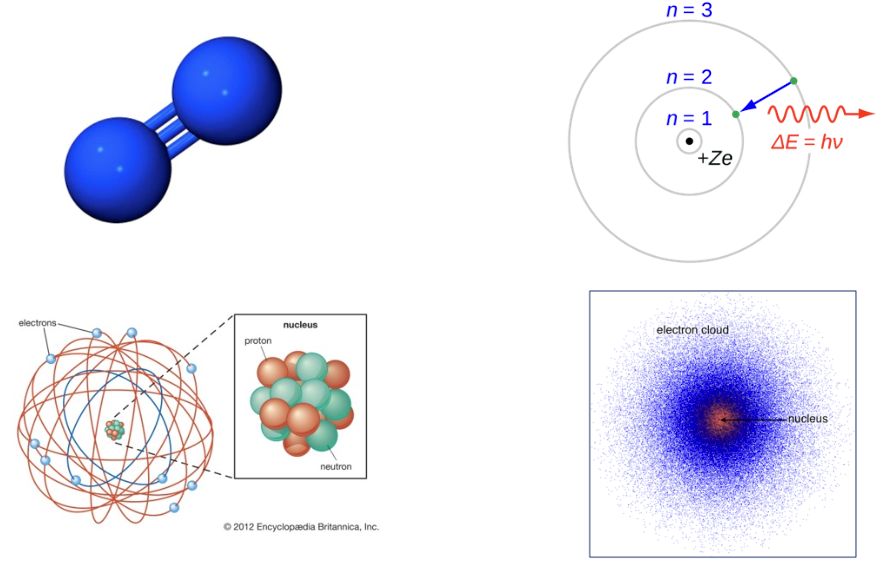

    
原子结构理论的发展

- 物理概念的定义
- 物理量及其测量方法
  - 基本物理量

    名称|符号
    ---|---
    长度|$l$
    质量|$m$
    电流强度|$I$
    热力学温度|$\theta$
    物质的量|$N$
    发光强度|$J$

  - 国际单位制
    
    
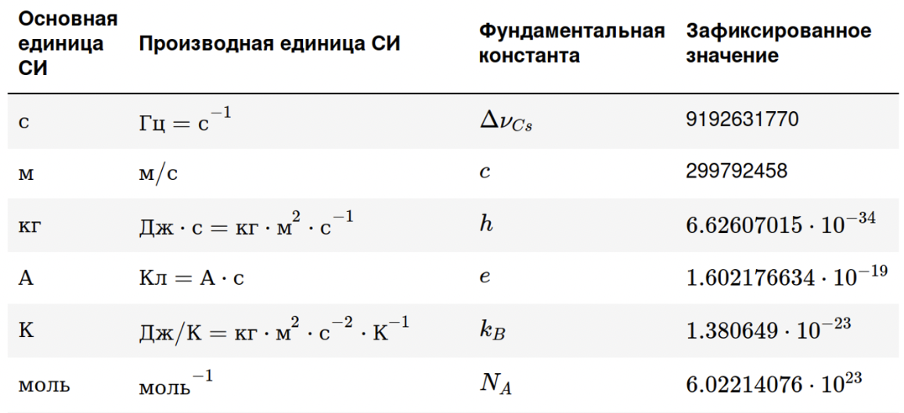

  - 测量方法
    
    
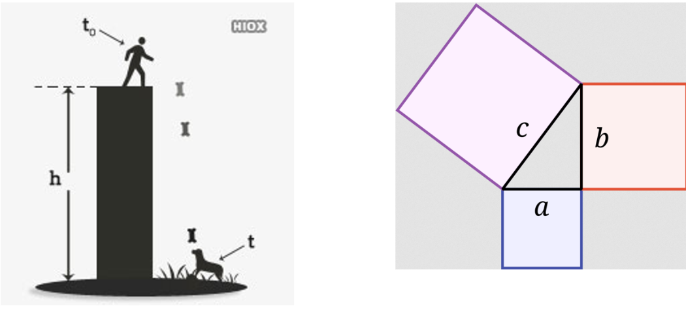

  - 物体的机械运动
    - 力学研究的主题是研究物体的机械运动以及物体之间的相关相互作用。
    - 在机械运动下，了解物体或其部分在空间中的相对位置随时间的变化

## Lecture №2 Кинематика материальной точки 质点的运动学

- 质点
  - 物体作为物理学的研究对象，具有大小，形状，质量和内部结构。如果在所研究的过程中，物体的大小，形状和内部结构不起作用，或者所起的作用不显著，以至于可以忽略不计时，就可以将物体看作一个只具有质量而没有大小和形状的理想物体，称为质点
- 机械运动（Механическое двмжение）
  - 广义上的运动是一般的任何变化。
  - 最简单的运动形式是机械运动，它包括随着时间的推移改变物体或其部分相对于彼此的位置。
  - 运动具有绝对性，自然界的一切物体都永恒的处在运动中
- 绝对弹性物体
  - 绝对刚体 (ATT) 是在给定问题的条件下可以忽略其变形（但不是尺寸）的对象。
- 参考系（Система отчёта-CO）：要描述一个物体的运动，必须选择另一个物体或几 个彼此间相对静止的物体群作参考，这个被选作参考的物体或物体群，称为参考系
  - 笛卡尔坐标系
   
    
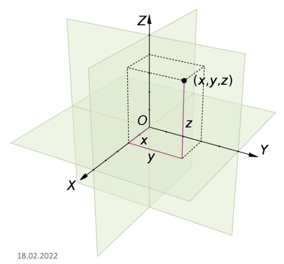

    OX - обсцисса  
    OY - ордтната  
    OZ - аппликата  

    - 左手系右手系

  

    - 笛卡尔坐标系中向量的坐标表示

    
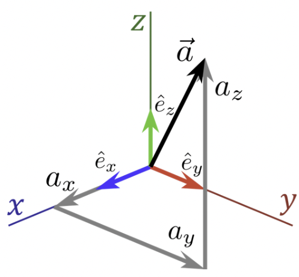

    $$\vec{a}=(a_x,a_y,a_z)$$

    $$\vec{a}=a_x\hat{e}_x+a_y+\hat{e}_y+a_z\hat{e}_z$$

    - 平面笛卡尔坐标系

      
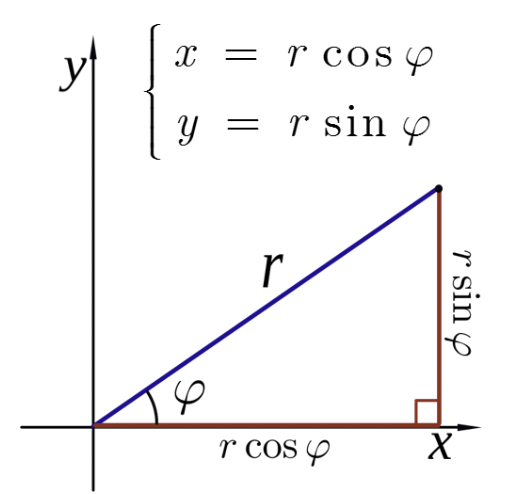

    - 柱形立体笛卡尔坐标系

       

       $$\begin{cases}
        x=\rho\cos\varphi\\
        y=\rho\sin\varphi\\
        z=z
       \end{cases}$$

    - 球形笛卡尔坐标系

      
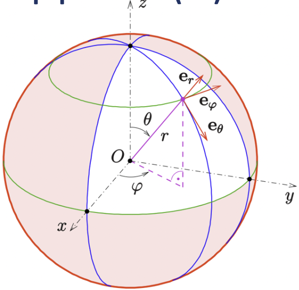

      $$\begin{cases}
        x=r\sin\theta\cos\varphi\\
        y=r\sin\theta\sin\varphi\\
        z=\cos\theta
      \end{cases}$$

- 向量
  - 向量乘法
    - 点乘法
    - 叉乘法
    - 混合乘法
  - 向量求模

- 位置矢量（Радиус-вектор）：
  - 定义：通常把由坐标原点 指向质点所在位置的有向线段定义为质点的位置矢量，简称位矢或矢径,用矢量 $\vec{r}$ 表示

    
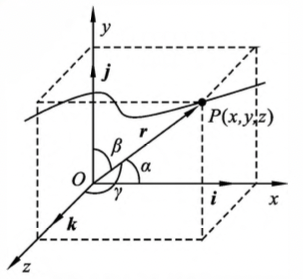

    $$\vec{r}=x\vec{i}+y\vec{j}+z\vec{k}$$

  - 大小：

    $$r=|\vec{r}|=\sqrt{x^2+y^2+z^2}$$

  - 方向：由其方向余弦确定

    $$\cos\alpha=\frac{x}{r},\cos\beta=\frac{y}{r},\cos\gamma=\frac{z}{r}$$

    其中：$\alpha,\beta,\gamma$ 分别是位矢 $\vec{r}$ 和各个坐标轴之间的夹角

- 运动方程：当指点运动时，位矢 $\vec{r}$ 和坐标 $x,y,z$ 都是关于时间 $t$ 的函数，一般表示为：

  $$\vec{r}=\vec{r}(t)=x(t)\vec{i}+y(t)\vec{j}+z(t)\vec{k}$$

  或者

  $$\begin{cases}
    x=x(t)\\
    y=y(t)\\
    z=z(t)\\
  \end{cases}$$

- 位移
  
  
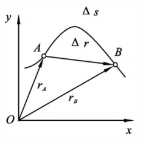

  
图1-2 质点的位移

  假设质点在如 图1-2 所示的任一曲线上运动，在 $t$ 时刻，质点 位于 $A$ 点，其位置矢量为 $\vec{r_A}$；在 $t+\Delta t$ 时刻，质点运动到 $B$ 点，其位置矢量为 $\vec{r_B}$。在时间 $\Delta t$ 内，质点的位置变化可用从 $A$ 到 $B$ 的有向线段 $\Delta\vec{r}$ 来表示，$\Delta\vec{r}$ 称为质点的位移矢量，简称位移，即

  $$\Delta\vec{r}=\vec{r_B}-\vec{r_A}$$

  - 单位：位置矢量和位移的单位都是米,用符号m 表示

- 速度

  
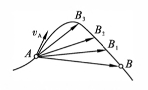

  
图1-3 质点的速度矢量

  - 平均速度
    当质点在 $\Delta t$ 时间内完成了位移 $\Delta\vec{r}$ 时，为了表示运动在这段时间内的快慢程度，把质点的位移与相应的时间房的比值，称为质点在这段时间 $\Delta t$ 内的平均速度

    $$\overline{v}=\frac{\Delta\vec{r}}{\Delta t}$$

    平均速度是矢量，其方向与位移方向相同
  - 瞬时速度
    当 $\Delta t$ 趋于零时平均速度的极限值，称为瞬时速度，简称速度

    $$\vec{v}=\lim_{\Delta t\rightarrow0}\frac{\Delta\vec{r}}{\Delta t}=\frac{ {\rm d}\vec{r}}{ {\rm d}t}$$

    速度是位置矢量对时刻 $t$ 的一阶导数。在一般情况下，速度是 $t$ 的函数，具有瞬时性，可精确地描述质点运动的快慢程度
  - 速率
    速度是矢量，其大小称为速率，其方向沿位移的极限方向
  - 单位：速度的单位是 米/秒，用符号 $m\cdot s^{-1}$ 表示
- 加速度

  
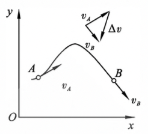

  
图1-4 质点的加速度矢量

  - 平均加速度
    加速度是描述质点速度(速度数值和速度方向)变化的物理量，如 图1-4 所示。质点在时刻 $t$ 位于 $A$ 点，其速度为 $v_A$；在时刻 $t+\Delta t$ 位于 $B$ 点，其速度为 $v_B$ 则在 $\Delta t$ 时间内速度的增量为 $\Delta v=v_B-v_A$，将该速度增量与所经历的时间之比定义为在此时间内的平均加速度，是矢量

    $$\overline{a}=\frac{\Delta v}{\Delta t}$$

  - 瞬时加速度
    当 $\Delta t\rightarrow0$ 时，$\overline{a}$ 趋近于一极限值，称为质点的瞬时加速度，简称加速度，用 $\vec{a}$ 表示

    $$\vec{a}=\lim_{\Delta t\rightarrow0}\frac{\Delta\vec{v}}{\Delta t}=\frac{ {\rm d}v}{ {\rm d}t}=\frac{ {\rm d}^2\vec{r}}{ {\rm d}t^2}$$

    可见，加速度是速度对时间的一阶导数，或位置矢量对时间的二阶导数。在一般情况下，它也是时间 $t$ 的函数，具有瞬时性。加速度又具有矢量性，其方向沿速度增量的极限方向。由图1-4可知，加速度总是指向运动曲线凹的一侧
  
- 运动叠加原理：在研究一个复杂的运动时，可以通 过对几个简单运动的讨论来完成,从而使研究工作大为简化
  若质点的运动轨迹位于同一平面内，则这种运动称为平面曲线运动。一个平面曲线 运动可看作是两个简单直线运动的合成。平面曲线运动的运动方程在直角坐标 系中可写成

  $$\vec{r}=x(t)\vec{i}+y(t)\vec{j}$$

- 抛体运动

  现应用运动叠加原理来分析竖直平面内的抛体运动（以斜上抛为例）

  一质点在地球表面附近以初速度 $r_0$ 沿斜上方抛出，取抛出点为原点 $O$，水平方向为 $x$ 轴，竖直方向为 $y$ 轴，设 $v_0$ 与 $x$ 轴正方向的夹角为 $\alpha$ ，则 $v_0$ 的水平和竖直分量分别为

  $$v_{0x}=v_0\cos\alpha,\qquad v_{0y}=v_0\sin\alpha$$

  略去空气阻力和风等各种影响，则质点的运动可看成水平方向初速度为 $v_0\cos\alpha$ 的匀速直线运动和竖直方向初速度为 $v_0\sin\alpha$ 的竖直上抛运动的合成，如 图1-5 所示

  
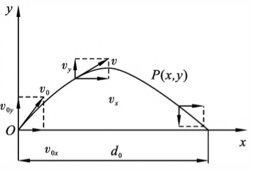

  
图1-5 斜上抛运动

   在任意时刻，速度分量分别为

   $$v_x=v_{0x}=v_0\cos\alpha$$

   $$v_y=v_{0y}-gt=v_0\sin\alpha-gt$$

   运动方程为

   $$x=v_0\sin\alpha t\qquad y=v_0\sin\alpha t-\frac{1}{2}gt^2$$

   消去参数 t，可得抛体的轨道方程为

   $$y=x\tan\alpha-\frac{g}{2v_0^2\cos^2\alpha}x^2$$

   它表明在略去空气阻力的情况下，抛体在空间所经历的路径为一抛物线。如果空气阻力 较大则不能忽略，则物体所经历的路径为一不对称的曲线，实际射程要比在真空中的射程小得多

- 圆周运动

  - 角位置：如 图1-6 所示，有一质点在平面内作半径为 $r$ 的圆周运动，某时刻质点位于圆周上的点 $A$ ，由平面极坐标可知其坐标为 $(r,\theta)$。对圆周运动来说，$r$ 为常量，故描述质点在圆周上位置仅需一个变量 $\theta$ 称为角位置。它是时间的函数 $\theta=\theta(t)$

  - 角速度：角坐标 $\theta(t)$ 随时间的变化率，即 ${\rm d}\theta/{\rm d}t$，称为角速度(或称角频率)，用符号 $\omega$ 表示，则有

    $$\omega=\frac{ {\rm d}\theta}{ {\rm d}t}$$

    通常用弧度(rad)来度量 $\theta$，所以角速度 $\omega$ 的单位名称为弧度每秒，符号为 ${\rm rad}\cdot s^{-1}$

  
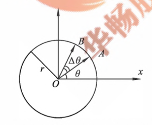

  
图1-6 质点在平面上做圆周运动的位置

  若在时间 $\Delta t$ 内，质点由图上的 $A$ 点运动到 $B$ 点，所经历的圆弧则为 $\Delta s=r\Delta\theta$ 为 $\Delta t$ 时间内，径矢 $\vec{r}$ 所转过的角度。当 $\Delta t\rightarrow$ 时，$\Delta s/\Delta t$ 的极限值为：

  $$\lim_{\Delta t\rightarrow0}\frac{\Delta s}{\Delta t}=r\lim_{\Delta t\rightarrow0}\frac{\Delta\theta}{\Delta t}$$

  即

  $$\frac{ {\rm d}s}{ {\rm d}t}=r\frac{ {\rm d}\theta}{\rm d t}$$

  而 ${\rm d}s/{\rm d}t$ 曲为质点在点 $A$ 的速率，用 $v$ 表示，${\rm d}\theta/{\rm d}t$ 则为质点在点 $A$ 的角速度 $\omega$，故有

  $$v=r\omega$$

  该式表明了质点做圆周运动时，速率和角速度之间的关系

  
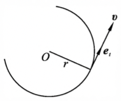

  
图 1-7 切向单位矢量

  如 图1-7 所示，质点在圆周上 $A$ 点的速度为 $\vec{v}$，$\vec{v}$ 的方向与 $A$ 点的切线方向相同，大小为 $v$，在 $A$ 点的切线方向去一单位矢量 $e_\tau$，称为切向单位矢量，于是 $A$ 点的速度 $v$

    $$\vec{v}=v\vec{e_\tau}$$

    一般来说，质点作圆周运动时，不仅速度方向要发生变化，而且速度的大小也会改变。由上式可得加速度为

    $$\vec{a}=\frac{ {\rm d}\vec{v}}{ {\rm d}t}=\frac{ {\rm d}v}{ {\rm d}t}\vec{e_\tau}+v\frac{ {\rm d}\vec{e_\tau}}{ {\rm d}t}$$

  - 切向加速度
    其中，$\frac{ {\rm d}v}{ {\rm d}t}e_\tau$ 是由速度大小发生变化而引起的，其方向为 $\vec{e_\tau}$ 的方向，即与速度 $\vec{v}$ 的方向相同，称为切向加速度，用 $\vec{a_\tau}$ 表示，有

    $$\vec{a_\tau}=\frac{ {\rm d}v}{ {\rm d}t}\vec{e-\tau},\qquad|\vec{e_\tau}|=\frac{ {\rm d}v}{ {\rm d}t}$$
  - 法相加速度
    其中，$\frac{ {\rm d}e_\tau}{ {\rm d}t}$ 是由于切向单位矢量的方向随时间变化引起的，称为法相加速度

    
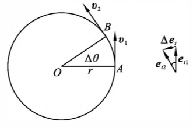

    
图 1-8 切向单位矢量随时间变化率

    设在时刻 $t$，质点位于圆周上 $A$ 点，其速度为 $v_1$；在时刻 $t+\Delta t$，质点位于 $B$ 点，速度为 $v_2$。在时间间隔 $\Delta t$ 内，径矢 $\vec{r}$ 转过的角度为 $\Delta\theta$，速度增量为 $\Delta v=v_2-v_1$ 而在这段时 间内，切向单位矢量的增量为 $\Delta e_\tau=e_{\tau2}-e_{\tau1}$。由于切向单位矢量的值为 $1$，因而由 图1-8 可以知道 $\|\Delta e_\tau\|=\Delta\theta\times1=\Delta\theta$ 当 $\Delta t\rightarrow0$ 时，$\Delta\theta\rightarrow0$，这时 $\Delta e_\tau$ 的方向趋于与 $e_\tau$ 垂直，即趋于与 $\vec{v}$ 垂直，也即趋于指向圆心。如果取沿径矢而指向圆心的单位矢量为 $e_n$，这个单位矢量又称法向单位矢量，那么在 $\Delta\rightarrow0$ 时，$\Delta e_\tau/\Delta t$ 的极限值为

    $$\lim_{\Delta t\rightarrow0}\frac{\Delta \vec{e_\tau}}{\Delta t}=\frac{ {\rm d}\vec{e_\tau}}{ {\rm d}t}=\frac{ {\rm d}\theta}{ {\rm d}t}\vec{e_n}$$

    由此可以看到，式中的第二项的方向总是指向圆心的，故称为法向加速度，用 $\vec{a_n}$ 表示，即

    $$\vec{a_n}=v\frac{ {\rm d}\theta}{ {\rm d}t}\vec{e_n}$$

    考虑 $\omega={\rm d}\theta/{\rm d}t,v=\omega r$，故上式为：

    $$\vec{a_n}=\omega^2\vec{e_n}=\frac{v^2}{r}\vec{e_n},\qquad|\vec{e_n}|=\frac{v^2}{r}$$

    质点作一般圆周运动时的加速度表示为：

    $$\vec{a}=\vec{a_\tau}+\vec{e_n}=\frac{ {\rm d}v}{ {\rm d}t}\vec{e-\tau}+\frac{v^2}{r}\vec{e_n}$$

## Lecture №3 Динамика 动力学

- 四大基本力
  - 引力：引力指存在于任何两个物质质点之间的吸引力，它的规律首先由牛顿发现，称之为引力定律，即：任何两个质点都相互吸引，这引力的大小与它们的质量的乘积成正比，和它们的距离的平方成反比

    $$F=\frac{Gm_1m_2}{r^2}$$

    其中：
    - $m_1,m_2$ 为两个质点的质量
    - $r$ 为两质点之间的距离
    - $G$ 为引力常量，在国际单位制中的值为 $G=6.67\times10^{-11}N\cdot m^2/kg^2$
  - 电磁力：电磁力指带电的粒子或带电的宏观物体间的作用力。两个静止的带电粒子之间的作用力由一个类似于引力定律的库仑定律支配着。即：两个静止的点电荷相斥或相吸，这斥力或吸力的大小与两个点电荷的电量和的乘积成正比，而与两电荷的距离的平方成反比

    $$F=\frac{kq_1q_2}{r^2}$$

    其中：
    - $q_1,q_2$ 为两个点电荷的电量
    - $r$ 为两个点电荷之间的距离
    - $k$ 为比例系数，在国际单位制中它的值为 $k=9\times10^9 N\cdot m^2/C^2$
    > 相互接触的物体之间的弹力、摩擦力、流体阻力、表面张力以及气体压力、浮力、黏结力等都是相互靠近的原子或分子之间的作用力的宏观表现，因而从本质上说也是电磁力
  - 弱相互作用力：弱力也是各种粒子之间的一种相互作用，但仅在粒子间的某些反应（如 β 衰变）中才显示出它的重要性。弱力是以 $W^+$，$W^-$，$Z^0$ 等叫做中间玻色子的粒子作为传递媒介的。它的力程比强力还要短，而且力很弱。两个相邻的质子之间的弱力大约仅有 $10^{-2}N$
  - 强相互作用力：我们知道，在绝大多数原子核内有不止一个质子。质子间的电磁力是排斥力，但事实上核的各个部分并没有自动飞离，这说明在质子之间还存在一种比电磁力还要强的自然力，正是这种力把原子核内的质子及中子紧紧地束缚在一起。这种存在于质子、中子、介子等强子之间的作用力称为强力
    强力是夸克所带的“色荷”之间的作用力——色力——的表现，色力是以胶子作为传递媒介的
> 重力与重量的区别：重力是地球作用在物体上的力，重量是物体作用在支撑物或悬架上的力。这意味着它们将有不同的作用点：重力作用于物体的质心，重量作用于物体的支撑点

- 牛顿运动定律
  - 牛顿第一定律
    - 描述：任何物体都保持静止或匀速直线运动状态，除非它受到其他物体的作用而被迫改变 这种状态为止
    - 概念：
      1. 任何物体都具有保持其原来(静止或匀速直线)运动状态的性质,这种性质称为 惯性，故该定律又称惯性定律
      2. 要改变物体的运动状态，一定要有其他物体对它产生作用，这种物体间的相互作 用称为力。在自然界中存在许多种作用力，但按其基本性质,这些力可归于四大类，即万 有引力、电磁力、强力和弱力
      3. 惯性定律是关于物体运动的描述，而任何一个关于物体运动的描述都包含一个参照系。惯性定律本身定义了一个参照系，即存在着某些参照系，相对于它们，一个物体 的运动如果不受到任何外力的影响，将静止或沿直线作匀速运动,这些参照系称为惯性参照系
  - 牛顿第二定律
    - 描述：物体受到外力作用时，所获得的加速度大小与合外力大小成正比，与物体的质量成 反比;加速度的方向与合外力的方向相同
    - 公式：
     
      $$\vec{F}=m\vec{a}\qquad(2-1)$$

    - 概念：
      1. 物体的加速度与外力是瞬时、正比、同向的关系
      2. 在相同外力的作用下，物体加速度的大小与其质量成反比，这意味着质量大的物体要改变其速度比较难，即它的惯性大；质量小的物体要改变其速度比较容易，即它的惯性小。因此，质量是物体惯性大小的量度，故又称为惯性质量
      3. 力的独立作用原理。即几个力同时作用于物体所产生的加速度等于各个力分别 作用时所产生加速度的叠加，式 $(2-1)$ 中的 $F$ 应理解成合外力，即 $\sum_i F_i$
     牛顿第二定律是矢量式，在具体演算时，通常采用分量式。另外，牛顿第二定律只有在惯性系中才成立
  - 牛顿第三定律
    - 描述：两个物体彼此之间的作用力 $\vec{F}$ 和反作用力 $\vec{F'}$，沿同一直线，大小相等，方向相反，分别作用在两个物体上
    - 公式：
     
      $$\vec{F}=-\vec{F'}$$

    - 概念
      1. 作用力与反作用力是矛盾的两个方面，它们互以对方为自己存在的条件，同时产 生，同时消灭，任何一方都不能孤立地存在
      2. 作用力和反作用力分别作用在两个物体上，因此它们不能相互抵消
- 动量定理
- 动能定理
- 变质量物体的运动

- Уравнение Мещерского
  - 变质量体力学中的基本方程

    $$M(t)\frac{ {\rm d}v}{ {\rm d}t}=u_1(t)\frac{ {\rm d}m_1}{ {\rm d}t}-u_2\frac{ {\rm d}m_2}{ {\rm d}t}+F$$

    其中
    - $M(t)$ 是质点在任意时间 $t$ 时的质量
    - $v$ 是变质量点的运动速度
    - $F$ 来自外部环境的力
    - $u_1(t)=v_1-v$ 是连接粒子的相对速度
    - $u_2(t)=v_2-v$ 是分离粒子的相对速度
    - $\frac{ {\rm d}m}{ {\rm d}t}$ 是附着粒子总质量的变化率
- Формула Циолковского
  - 火箭助推过程中的速度方程

    $$V=I\cdot\ln(\frac{M_1}{M_2})$$

    其中
    - $V$ 火箭的最终速度
    - $I$ 火箭发动机的比冲（发动机推力与第二燃料质量小号的比率）
    - $M_1$ 火箭的初始质量（有效载荷+火箭质量+燃料质量）
    - $M_2$ 火箭的最终质量（有效载荷+火箭质量）

    $$\frac{V}{V_1}=\ln(1+\frac{M_2}{M_1})$$

    其中：
    - $V$ 火箭最终速度
    - $V_1$ 逃逸元件相对于火箭的速度
    - $M_1$ 火箭初始质量
    - $M_2$ 火箭最终质量
- 惠更斯-施泰纳定理
  - 定义：物体绕任意固定轴的转动惯量 $J$ 等于该物体绕平行于它的轴的转动惯量之和，即通过物体的质心的转动惯量 $J_C$，与物体质量与转轴之间距离 $d$ 的平方的乘积之和

    $$J=J_C+md^2$$

    其中：
    - $J_C$ 是关于通过物体质心的轴的已知惯性矩
    - $J$ 所需的关于平行轴的转动惯量
    - $m$ 物体质量
    - $d$ 转轴与物体质心轴之间的距离

  - 证明：由转动惯量定义式：

    $$J_C=\sum^n_{i=1}m_i(r_i)^2$$

    $$J=\sum^n_{i=1}m_i(r'_i)^2$$

    其中：
    - $r$ 是物体在以质心为原点的坐标系中的点的半径矢量
    - $r'$ 是新坐标系中原点经过新轴的点的半径矢量

    $$r_i'=r_i+d$$

    $$J=\sum$$

    $$J=\sum^n_{i=1}m_i(r_i)^2+2\sum^n_{i=1}r_id+\sum^n_{i=1}m_i(d)^2$$

    $$r_C=\frac{\sum_im_ir_i}{\sum_im_i}$$

    $$J=\sum^n_{i=1}m_i(r_i)^2+d^2\sum^n_{i=1}m_1$$

    $$J=J_C+md^2$$

## Lecture №4 Механическая работа и энергия 机械功和能量

- 功
  - 定义：作用在物体上的力在位移方向的分量与物体位移大小的乘积
  - 恒力做功
    - 设 $\theta$ 为力与位移 $\Delta \vec{r}$ 的夹角，则力在位移方向的分量为 $F\cos\theta$。所以，力对质点所做的功为：

      
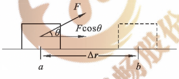

      
图4-1 恒力的功

      $$W=(F\cos\theta)|\Delta \vec{r}|=F|\Delta\vec{r}|\cos\theta$$

      $$\vec{W}=\vec{F}\cdot\Delta\vec{r}$$

      功是标量，但有正负之分。当 $0 <\theta<90°$ 时，$W>0$,力 $F$ 的功为正；当 $9=90°$ 时，$W=0$，力 $F$ 的功为零；当 $90°<\theta<180°$ 时，$W<0$，力 $F$ 的功为负，此时，也可以说物体克服力 $\vec{F}$ 做功
  - 变力做功
    - 如 图2-3 所示。设质点在仅与质点位置有关的变力 $F$ 作用下由 $a$ 点沿曲线运动到 $b$ 点，将曲线 $ab$ 微分，计算每一个微元的功，再求积分，便可以近似地得到便利做功的公式为：

      $$W=\int^b_a\vec{F}\cdot{\rm d}\vec{r}$$

  - 合力做功
    - 如果物体同时收到几个力的作用，则合理的功等于各分离功的代数和

      $$W=W_1+W_2+\cdots+W_n=\sum_iW_i$$
- 功率
  - 定义：单位时间内力做的功
  - 平均功率：设在时间 $\Delta t$ 内完成功 $\Delta W$，则在这段时间内的平均功率定义为：

    $$\overline{P}=\frac{\Delta W}{\Delta t}$$
  - 瞬时功率：当 $\Delta t\rightarrow0$ 时，则得到某时刻的瞬时功率为：

    $$P=\lim_{\Delta t\rightarrow0}\frac{\Delta W}{\Delta t}=\frac{ {\rm d}W}{ {\rm d}t}$$

    如果力 $\vec{F}$ 作用在物体上使它获得速度 $\vec{v}$，则瞬时功率为：

    $$P=\frac{\vec{F}\cdot{\rm d}\vec{r}}{ {\rm d}t}=\vec{F}\cdot\vec{v}$$

  - 单位：在国际单位制中，功率的单位是 $J\cdot S^{-1}$，称为瓦特，符号为 $W$，量纲为 $ML^2T^{-3}$

- 动能定理
  - 一个质量为 $m$ 的质点在合外力 $\vec{F}$ 的作用下运动时，将不断改变其速度。设质点在点 $a$ 和点 $b$ 的速率分别为 $\vec{v_1}$ 和 $\vec{v_2}$，且在任一小段位移 ${\rm d}r$ 上的合力 $F$ 与 ${\rm d}r$ 之间的夹角为 $\theta$。则质点在此微小位移内合外力所做的功为：
   
    $${\rm d}W=\vec{F}\cdot{\rm d}\vec{r}=F\cos\theta {\rm d}r$$

    由牛顿第二定律及切向加速度，有

    $$F\cos\theta=ma_{\tau}=m\frac{ {\rm d}v}{ {\rm d}t}$$

    所以元功为：

    $${\rm d}W=m\frac{ {\rm d}v}{ {\rm d}t}{\rm d}r=mv{\rm d}v$$

    于是质点从 $a$ 点移动到 $b$ 点这个过程中，合外力做的总功为：

    $$W=\int^b_a{\rm d}W=\int^{v_2}_{v_1}mv{\rm d}v$$

    $$W=\frac{1}{2}mv^2_2-\frac{1}{2}mv_1^2$$

    该式表明合外力对质点做功的结果，使这个量获得了增量。而 $\frac{1}{2}mv^2$ 是与质点的运动状态有关的量，称为质点的动能，用 $E_k$ 表示，即

    $$E_k=\frac{1}{2}mv^2$$

    即

    $$W=E_{k2}-E_{k1}=\Delta E_k$$

- 势能
  - 保守力：这种力对物体做的功不仅与物体的初、末位置有关，而且与路径有 关，如摩擦力等
  - 非保守力：这种力对物体做的功只取决于初、末位置,而与运动物体的路径无关，如重力、弹性力等
- 重力
  - 重力做功

    
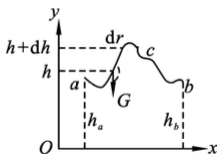

    
图4-2 重力做功

    设质量为 $m$ 的物体在重力作用下，在地面附近运动，从 $a$ 点沿某一曲线路径 $acb$ 到达 $b$ 点，如 图2-5 所示。$a$ 点和 $b$ 点对 选取的参考平面来说高度分别为 $h_a$ 和 $h_b$。在曲线上任取一位移元 ${\rm d}\vec{r}$，重力 $\vec{P}$ 所做的功为

    $${\rm d}W=\vec{P}\cdot{\rm d}\vec{r}=mg\cos\alpha{\rm d}s$$

    其中：
    - $\alpha$ 为 $\vec{P}$ 与 ${\rm d}\vec{r}$ 的夹角

    又因 ${\rm d}h={\rm d}s\cos(\pi-\alpha)=-{\rm d}s\cos\alpha$ 是物体在位移元 ${\rm d}r$ 内上升的高度，故

    $${\rm d}W=-mg{\rm d}h$$

    $$W=\int^{h_b}_{h_a}-mg{\rm d}h=-(mgh_b-mgh_a)$$

    可见，重力做功只与运动物体的始末位置有关，而与运动物体的路径无关，因此，重力是保守力
  - 重力势能
    若令 $h_a=h$，$h_b=0$，则 $b$ 点所在的平面为零势面，此时的重力做功等于 $mgh$，表示在相对高度 $h$ 处重力的做功本领具有能量的性质。所以通常把物体所受的重力和高度的乘积, 称为物体与地球所组成的系统的重力势能，简称物体的重力势能，常用 $E_p$表示，即

    $$E_p=mgh$$

    因此重力做功可以用重力势能表示为

    $$W=-(E_{pb}-E_{pa})=-\Delta E_p$$

- 弹性力
  - 弹性力做功

    
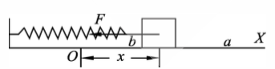

    
图4-3 弹性力的功

    设有一轻质弹簧，一端固定，另一端连接一物体。当物体在光滑的水平面内沿弹簧方向做直线运动时，弹簧发生形变，同时，弹性力作用于物体上。取运动方向为 $X$ 轴，物体的平衡位置为坐标原点，在运动中物体的某一位置 $x$ 处，根据胡克定律，在弹性 限度内，作用于物体上的弹性力为：

    $$F=-kx$$

    设物体由初始位置 $a$（坐标为 $x_a$）运动到 $b$（坐标为 $x_b$），如 图2-6 所示。在此过程中弹性力是变力，其所做的功为：

    $$W=\int^b_a-kx{\rm d}x=\frac{1}{2}kx_a^2-\frac{1}{2}kx_b$$

    可见，弹性力的功仅与物体初末位置有关，与物体经过的路径无关，所以，弹性力是保守力。
  - 弹性势能
    为了确定物体的弹性势能必须取定弹性势能的零点。通常取弹簧无形变时物体的位置为弹性势能的零点，这样物体在任意位置 $x$ 的弹性势能为：

    $$E_p=\frac{1}{2}kx^2$$

    若用 $E_{pa}$ 和 $E_{pb}$ 分别表示物体在位置 $a$ 和 $b$ 时的弹性势能，则弹性力做功可改写为：

    $$W=E_{pa}-E_{pb}=-\Delta E_p$$

    可见，弹性力的功等于弹性势能增量的负值
- 功能原理

  质点的动能定理可推广到由若干个物体所组成的系统（质点系），将动能定理运用到质点系中的每一个质点上，可以得到

  $$W=E_k-E_{k0}$$

  其中：
  - $E_k=\sum_i E_{ki}$ 表示系统内各质点的末态总动能
  - $E_{k0}=\sum_i E_{k0i}$ 表示系统内各质点的初态总动能
  - $W$ 表示作用于系统内各物体上的所有力所做功的代数和

  对于系统来说，$W$ 包括一切外力和一切内力的功。内力中又包含有保守力和非保守力。为直观起见，可将上式写成：

  $$W_{外}+W_{保内}+W_{非保内}=E_k-E_{k0}$$

  保守内力做功等于系统势能增量的负值，即

  $$W_{保内}=-(E_p-E_{p0})$$

  $$W_外+W_{非保内}=E-E_0$$

  其中
  - $E=E_p+E_k$ 称为机械能

  上式表明：所有外力和非保守内力做功的总和，等于系统机械能的增量。这个结论称为功能原理
- 机械能守恒定律
  当外力和非保守内力不做功或做功的总利为零，即 $W_{外}+W_{非保内}=0$，系统的机械能保持不变

  $$E=E_p+E_k=Const$$

  在满足机械能守恒的条件下，质点系内的动能和势能可以通过保守内力做功相互转换的，且转换的量值一定相等，即动能的增加量必等于势能的减小量，或势能的增加量必等于动能的减小量

- 能量守恒定律：
  能量不会消失，也不会创生，它只能从一种形式转换成另一种形式
  如果系统内除了保守内力外，还有摩擦力等非保守内力做功，那么系统的机械能将 不再守恒。但在系统机械能减少或增加的同时，必然有等值的其他式的能量增加或减少，系统的机械能和其他形式能量的总和仍然恒定
- 动量
  定义：质点的质量 $m$ 和其速度 $\vec{v}$ 的乘积

  $$\vec{p}=m\vec{v}$$

  动量 $\vec{p}$ 的方向与速度 $\vec{v}$ 的方向相同，其大小为 $mv$，在国际单位制中，动量的单位符号为 $kg\cdot m\cdot s^{-1}$，量纲式为 $MLT^{-1}$

  牛顿把第二定律表述为：“作用在质点上的外力等于质点的动量随时间变化率”，其数学表达式为：

  $$\vec{F}=\frac{ {\rm d}\vec{p}}{ {\rm d}t}=\frac{ {\rm d}(mv)}{ {\rm d}t}$$

  在经典力学范围内，给定质点的质量是不变的，因此，上式可写成 $F=m\frac{ {\rm d}\vec{v}}{ {\rm d}t}=m\vec{a}$，此即牛顿第二定律
- 冲量
  一般来说，作用在质点上的力是时间的函数，即 $F=F(t)$。因此，在时间间隔 $\Delta t=t_2-t_1$ 内，力对时间的累积作用为：

  $$I=\int^{t_2}_{t_1}\vec{F}(t) {\rm d}t=\vec{p_2}-\vec{p_1}=m\vec{v_2}-m\vec{v_1}$$

  其中：
  - $\vec{v_1}$ 和 $\vec{p_1}$ 是质点在时刻 $t_1$ 的速度和动量
  - $\vec{v_2}$ 和 $\vec{p_2}$ 是质点在时刻 $t_2$ 的速度和动量

  这种累积作用称为力的冲量，用符号 $I$ 表示，国际单位制为 $N\cdot s$，为矢量，其方向不一定与动量的方向相同，而与动量增加的方向相同

- 冲力：在实际应用中，力 $F$ 与时间 $t$ 的关系往往很复杂，很难找到它们之间的函数关系式，如打击、碰撞等过程，物体之间的作用时间短、力的变化快，峰值大，这样的力常称为冲力。这种力的冲量常用平均冲力与作用时间的乘积来求得，即
  
  $$\vec{I}=\int^{t_2}_{t_1}\vec{F}{\rm d}t=\overline{F}(t_2-t_1)$$

  $$\overline{F}=\frac{\int^{t_2}_{t_1}\vec{F {\rm d}t}}{t_2-t_1}$$
  
- 动量定理：在给定时间间隔内，外力作用在质点上的冲量，等于质点在此时间内的动量的增量

- 质点系的动量定理
  如 图2-8 所示，在系统内有两个质点1和2，它们的质量分别为 $m_1$ 和 $m_2$。设作用在质点上的外力分别为 $\vec{F}_1$ 和 $\vec{F}_2$，而两质点相互作用的内力分别为 $\vec{F}_{12}$ 和 $\vec{F}_{21}$。根据质点的动量定理，在 $\Delta t=t_2-t_1$ 时间内，两质点所受力的冲量和动量增量分别为：

  $$\int^{t_1}_{t_2}(\vec{F}_1+\vec{F}_{12}){\rm d}t=m_1\vec{v}_1-m_1\vec{v}_{10}$$

  $$\int^{t_1}_{t_2}(\vec{F}_2+\vec{F}_{21}){\rm d}t=m_2\vec{v}_2-m_2\vec{v}_{20}$$

  
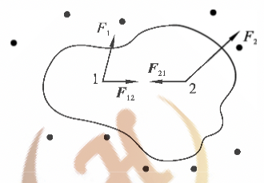

  
图4-4 质点系的内力和外力

  上式表明，作用于两质点组成系统的合外力的冲量等于系统内质点动量之和的增量，即系统的动量增量。

  如果系统内含有 $n$ 个质点，则动量定理可表示为：

  $$\int^{t_2}_{t_1}(\sum_i\vec{F_i}){\rm d}t=\sum_i m_i\vec{v}_i-\sum_i m_i\vec{v}_{i0}$$

  或

  $$\vec{I}=\vec{p}-\vec{p}_0$$

  其中：
  - $\vec{I}$ 为合外力的冲量
  - $\vec{p}$ 与 $\vec{p_0}$ 分别为末态和初态总动量

  上式表明，作用于系统的合外力的冲量等于系统动量的增量

- 动量守恒定律：当系统所受合外力为零时，系统的总动量的增量为零，即系统的总动量保持不变

## Lecture №5 Момент импульса материальной точки 质点的角矩

- 刚体的运动
  - 平动
    - 定义：刚体内部任何一条给定的直线，在运动中方向始终不变，这种运动称为平动
    - 特点：刚体做平动时内部各 质点的位移、速度和加速度都相等，因此，其内部任一质点的运动，都可代表整个刚体的 平动
  - 转动
    - 定义：刚体内各质点都绕同一直线做圆周运动，这种运动称为转动，这一直线称为转轴。如果转轴固定不动就称为定轴转动
    - 刚体做定轴转动时，刚体内各点都绕定轴做圆周运动
    - 转动平面
      - 在刚体上任取一垂直于转轴的平面称为转动平面，圆周运动的平面都垂直于转轴
    - 如 图3-1 所示。$O$为 转轴与某一转动平面的交点，$P$ 为转动平面上的一个质点，它绕 $O$ 做圆周运动，每一时刻具有一定的角速度和角加速度，在一定时间内具有一定的角位移；刚体内其他质点在各自的转动平面内做圆周运动，而且具有与 $P$ 点相同的角速度、角加速度和角位移
  - 刚体运动的叠加与分解：刚体的一般运动比较复杂,往往可以看成是平动和转动的叠加，在研究中，我们可以将刚体复杂的运动进行分解
- 转动定律
  - 转动惯性：当刚体所受的合外力矩等于零时，刚体将保持原来的转动状态不变。这反映了任何转动着的刚体具有惯性；当它所受的合外力矩不为零时，将会获得角加速度
  - 力矩
    - 定义：设刚体所受的外力 $\boldsymbol{F}$ 在转动平面内，转轴和转动平面的交点为 $O$，$\boldsymbol{r}$ 为 $O$ 到力的作用点 $P$ 的矢径，则力矩定义为：

      $$\boldsymbol{M}=\boldsymbol{r}\times\boldsymbol{F}$$

      可见力矩是矢量，方向沿着转轴，指向由右手螺旋法则确定：由矢径方向经小于 $180°$ 的 $\varphi$ 角转到力的方向时，螺旋前进的方向就是力矩的方向，其大小为

      $$M=rF\sin\varphi$$

      其中：
      - $\varphi$ 为 $r$ 和 $F$ 间的夹角
    - 单位：$m\cdot N$
    - 量纲：$ML^2T^2$

    
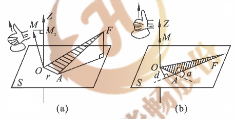

    
图5-1 力矩

  
    如果外力不在转动平面内，则必须将外力 $\boldsymbol{F}$ 分解成平行于转轴的分力 $\boldsymbol{F_{//}}$ 和在转动平面内的分力 $\boldsymbol{F_\perp}$ 其中，只有 $\boldsymbol{F_\perp}$ 才有可能改变刚体的定轴转动状态。这时力矩定义式中的 $\boldsymbol{F}$ 应理解为上述的 $\boldsymbol{F_\perp}$ 分力

    若刚体在定轴转动中同时受到几个力的作用，它们的力矩分别为 $\boldsymbol{M_1},\boldsymbol{M_2},\cdots,\boldsymbol{M_n}$ 则合力矩为：

    $$\boldsymbol{M}=\boldsymbol{M_1}+\boldsymbol{M_2}+\cdots+\boldsymbol{M_n}=\sum_i\boldsymbol{M_i}$$

  - 转动惯量
    - 定义：转动惯量等于刚体中每个质元的质量与该质元到转轴的距离平方的乘积之和

      $$J=\sum_i\Delta m_ir_i^2=\Delta m_1r_1^2+\Delta m_2r_2^2+\cdots+\Delta m_nr_n^2$$

      如果刚体的质量连续分布，则上式的求和可用积分代替，即

      $$J=\int_{(m)}r^2{\rm d}m$$
    - 几种常见几何体的转动惯量

    
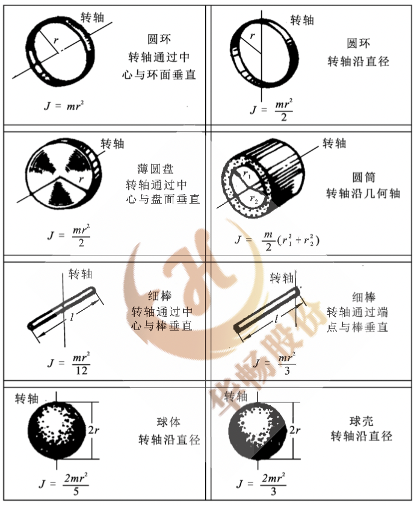

    
图5-3 质点在平面上做圆周运动的位置

  - 转动定律

    
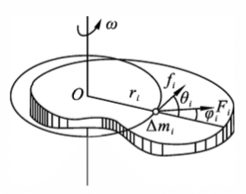

    
图5-2 转动定律的推导

    - 如 图5-2 所示，表示一个绕定轴 $Oz$ 转动的刚体，其上任一质元 $P$，质量为 $\Delta m_i$，离转轴的距离 $r_i$，它所受的外力为 $\boldsymbol{F_i}$，内力为 $\boldsymbol{f_i}$。为讨论简单起见，假设 $\boldsymbol{F_i}$ 和 $\boldsymbol{f_i}$ 都在 $P$ 点的转动平面内，它们于矢径的夹角分别为 $\varphi_i$ 和 $\theta_i$ 根据牛顿第二定律，$P$ 质元的切向运动方程为

      $$F_i\sin\varphi_i+f_i\sin\theta_i=\Delta m_ia_{i\tau}=\Delta m_ir_i\beta$$

      其中：
      - $a_{i\tau}$ 和 $\beta$ 分别为 $\Delta m_i$ 的切向加速度和刚体的角加速度
       
      上式两边同时乘以 $r_i$ 得

      $$r_iF_i\sin\varphi_i+r_if_i\sin\theta_i=\Delta m_ir_i^2\beta$$

      上式左边第一项为作用于 $P$ 质元的外力矩，第二项为作用于质元的内力矩。对刚体的所有质元，都可写出上式的形式，将这些式子相加，则有

      $$\sum_ir_iF_i\sin\varphi_i+\sum_ir_if_i\sin\theta_i=(\sum_i\Delta m_ir_i^2)\beta$$

      考虑到内力中每一对作用力与反作用力的力矩之和为零，故有 $\sum_ir_if_i\sin\theta_i=0$，从而上式中，第一项为刚体所受的外力矩的量值 $M$，并且 $J=\sum_i\Delta m_ir_i^2$，为刚体对此转轴的转动惯量，则该式化为

      $$M=J\beta$$

      称为刚体定轴转动的转动定律，是刚体定轴转动的基本运动方程。表明了刚体所受的对于某一固定转轴的合外力矩等于刚体对此转轴的转动惯量与刚体在此合外力矩作用下所获得的角加速度的乘积
      
  - 力矩的功
      如 图3-5 所示，刚体在垂直于转轴 $Oz$ 的外力 $\boldsymbol{F}$ 的作用下转动。力 $\boldsymbol{F}$ 的作用点 $P$ 到转轴的距离为 $r$（相应的矢径为 $\boldsymbol{r}$），经过 ${\rm d}t$ 时间后，刚体转过一微小角度 ${\rm d}\theta$ 点的位移为 ${\rm d}\boldsymbol{r}$ 则力 $\boldsymbol{F}$ 在这段位移上所做的功为：

      $${\rm d}\boldsymbol{W}=\boldsymbol{F}\cdot{\rm d}\boldsymbol{r}=F\cos\alpha{\rm d}s=f\cos(\frac{\pi}{2}-\varphi)r{\rm d}\theta=Fr\sin\varphi{\rm d}\theta$$

      其中：
      - $\varphi$ 为 $\boldsymbol{r}$ 和 $\boldsymbol{F}$ 之间的夹角
      - $Fr\sin\varphi$ 是作用于 $P$ 点的力 $\boldsymbol{F}$ 对转轴的力矩 $\boldsymbol{M}$ 的大小

      则上式化为

      $${\rm d}W=M{\rm d}\theta$$

      上式表明，力所做的元功等于力矩 $M$ 与角位移 ${\rm d}\theta$ 的乘积，也把它称为力矩的功。与力的功类似，力矩的功反映了力矩的空间累积效应

      当刚体在力矩的作用下转过 $\Delta\theta$ 角时，力矩对刚体所做的功为：

      $$W=\int{\rm d}W=\int^\theta_0 M{\rm d}\theta$$

      若力矩为常力矩，则力矩所做的功为：

      $$W=M\Delta\theta$$

      通过以上推导可看出，力矩做功的本质是力所做的功，即力做功的另一种表达形式

    - 力矩的功率
      按功率定义,也可得到力矩的瞬时功率：

      $$P=\frac{ {\rm d}W}{ {\rm d}t}=M\frac{ {\rm d}\theta}{ {\rm d}t}=M\omega$$

      即力矩的功率等于力矩与角速度的乘积
  - 刚体定轴转动的动能
    设某时刻刚体的角速度为 $\omega$，则到转轴的垂直距离为 $r_i$ 的质量为 $\Delta m_i$ 的质元的速度为 $v_i=r_i\omega$，从而该质元的动能为 $\Delta m_iv_i^2/2$。这样整个刚体的转动动能为：

    $$E_k=\sum_i\frac{1}{2}\Delta m_ir_i^2\omega^2=\frac{1}{2}(\sum_i\Delta m_ir_i^2)\omega^2=\frac{1}{2}J\omega^2$$

    上式表明，刚体的转动动能等于刚体的转动惯量与其角速度平方的乘积的一半。它是描述刚体定轴转动的一个物理量
  - 刚体定轴转动的动能定理
    设在合外力矩 $M$ 的作用下，刚体绕定轴转动的角速度由 $\omega_1$ 变为 $\omega_2$，在这个过程中，当刚体转过微小角位移 ${\rm d}\theta$ 时，合外力矩所做的功为：

    $${\rm d}W=M{\rm d}\theta$$

    又由转动定律：

    $$M=J\beta=J\frac{ {\rm d}\omega}{ {\rm d}t}=J\frac{ {\rm d}\omega}{ {\rm d}\theta}\cdot\frac{ {\rm d}\theta}{ {\rm d}t}=J\omega {\rm d}\omega$$

    则合外力矩的元功为：

    $${\rm d}W=J\omega\frac{ {\rm d}\omega}{ {\rm d}\theta}\cdot{\rm d}\theta=J\omega{\rm d}\omega$$

    从而在整个过程中合外力矩对刚体所做的功为：

    $$W=\int{\rm d}W=\int^{\omega_2}_{\omega_1}J\omega{\rm d}\omega=\frac{1}{2}\omega_2^2-\frac{1}{2}J\omega_1^2$$

    上式表明，合外力矩对刚体所做的功等于刚体转动动能的增量，如果合外力矩做正功，则刚体转动动能增加；如果合外力矩做负功，则刚体转动动能减小
  - 刚体的重力势能
    刚体所受的重力可看作是作用于刚体重心上的，当选刚体和地球组成的系统时，刚体的重力势能为：

    $$E_p=mgh_c$$

    决定于刚体的质量以及重心 $C$ 距离势能零点的高度 $h_c$

    引入刚体重力势能后，对包括有刚体的系统，从刚体的转动动能定理，可以得到刚体定轴转动的功能原理；如果只有保守内力做可得该系统的机械能守恒定律
  - 角动量
    根据转动定律，刚体做定轴转动时
      
    $$M=J\beta=J\frac{ {\rm d}\omega}{ {\rm d}t}=\frac{ {\rm d}(J\omega)}{ {\rm d}t}$$

    令 $L=J\omega$，则

    $$M=\frac{ {\rm d}L}{ {\rm d}t}$$

    其中
    - $L$ 是刚体的转动惯量与角速度的乘积，与是描述刚体转动状态的一个物理量，称为刚体对转轴的角动量或动量矩

    上式表明作用于物体上的合外力矩等于刚体的角动量对时间的变化率，是转动定律的另一种表达形式

    $M=J\beta$ 只是在转动惯量保持不变时才成立，如物体在转动过程中转动惯量发生了变化，可以使用 $M=\frac{ {\rm d}L}{ {\rm d}t}$
  - 冲量矩
    $M=\frac{ {\rm d}L}{ {\rm d}t}$ 可改写为

    $$M{\rm d}t={\rm d}L$$

    该式为角动量定理的微分形式，其中：
    - 合外力矩与合外力矩的作用时间的乘积称为刚体所受的冲量矩，与冲量相类似,反映了合外力矩在作用过程中的时间累积效应
  
    设刚体绕定轴转动过程中，在时刻 $t_1$ 的角速度为 $\omega_1$，在时刻 $t_2$ 的角速度为 $\omega_2$，将 $M=\frac{ {\rm d}L}{ {\rm d}t} $从时刻 $t_1$ 到 $t_2$ 进行积分，即

    $$\int^{t_2}_{t_1}M{\rm d}t=\int^{\omega_2}_{\omega_1}{\rm d}(J\omega)=J\omega_2-J\omega_1$$

    该式为角动量定理的积分形式，其中：$\int^{t_2}_{t_1}M{\rm d}t$ 是 $M$ 到 $L$ 时间内刚体所受的冲量矩

  - 角动量定理：作用于刚体上的冲量矩，等于刚体在作用时间内角动量的增量
  - 质点的角动量
    设某质点离轴的距离为 $r$，它在垂直于轴的平面内作圆周运动，角速度为 $\omega$，则其角动量的大小为：

    $$L=J\omega=mr^2\omega=rmv$$

    即质点的角动量数值等于质点的动量大小与动量矢量与转轴垂直距离的乘积
  - 角动量守恒定律
    如果刚体所受的合外力矩 $M=0$，则

    $$J\omega=Const$$

    即：刚体做定轴转动时，如果所受的合外力矩为零(或不受外力矩作用)，则刚体的角动量就保持不变，该结论同样适用于在定轴转动中由若干转动物体所组成的系统

## Lecture №6 Динамика АТТ 质点系统运动学

## Lecture №7 Неинерциальные системы 非惯性参考系统和陀螺仪的运动

## Lecture №8 Основы теории упругости 弹性理论的基础

- 弹性介质：产生弹性形变的介质叫弹性介质
  - 各向同性介质：沿不同方向测定的物理性质均相同的弹性介质
  - 各向异性介质：沿不同方向测定的物理性质不同的弹性介质
  - 均匀介质：弹性性质不仅与测定方向无关，而且与坐标无关的弹性介质
  - 层状介质：性质表现出成层性的介质，其中每一层是均匀介质，不同介质层的分界处称为界面，两个界面之间的间隔称为该层的厚度
  - 连续介质：当层状介质的层数无限增加，每层的厚度无限减小，这种层状介质就过渡为连续介质
  - 单相介质：只考虑单一相态的介质
  - 双相介质：由两种相态组成的介质，如由固相和液相组成的介质
- 应力
  - 定义：弹性体受理后产生的恢复原来形状的内力称内应力，简称为应力，与外力抗衡，阻止弹性体的形变

    对于一个均匀的各向同性的弹性圆柱体，设作用于 $x$ 面上的法向应力为 $N$
    - 若外力 $f$ 在 $s$ 面上均匀分布，则应力 $Pn=F/S$
    - 若外力 $f$ 在 $s$ 面上非均匀分布，则取微分 $\Delta S、\Delta f$，则应力的定义为 $\lim(\frac{\Delta F}{\Delta S})$
    即单位横截面上所产生的内聚力
  - 应力的分解
    - 法相应力（正应力）：垂直于单元面积的应力
    - 切向应力（剪切应力）：相切单元面积的应力
- 应变
  - 定义：弹性体受应力的作用，产生的体积和形状的变化称为应变
  - 正应变：只发生体积变化而不发生形状变化的应变
  - 切应变：只发生形状变化而不发生体积变化的应变
- 完全弹性体：应力与应变成正比关系的物体
- 胡克定律
  - 表述：固体材料受力之后，材料中的应力与应变（单位变形量）之间成线性关系

    $$F=kx$$

    其中：
    - $F$ - 外力
    - $k$ - 弹性系数
    - $x$ - 形变量
- 弹性模量
  - 杨氏模量（$E$）
    - 定义：表示膨胀或压缩情况下应力与应变的关系，又叫压缩模量，即物体受涨缩力时应力与应变之比
    - 概念：固体介质对拉伸力的阻力越大，杨氏弹性模量越大，物体越不易变形；反之杨氏弹性模量越小，物体越容易变形
- 泊松比（$s$）
  - 定义：在拉伸变形中，物体的身长总是伴随着垂直方向的收缩，所以把介质横向应变与纵向应变的比称为泊松比
  - 概念：固体介质越坚硬，在同样作用力下，横向应变越小，泊松比越小；反之越大
- 体变模量（K）
  - 定义：设一物体，收到静水柱压力 $p$ 的作用，只产生体积形变，$\Delta V/V$ 其中 $V$ 是物体原体积 $\Delta V$ 是物体体积变化量，这种情况下的应力与应变的比称为体变模量，表示物体的抗压性质

## Lecture №9 Основы гидродинамики 流体力学基础

- 流体静力学
  - 静止流体内任一点的压强：在流体内任一点做一个假想平面，由于平面一侧的流体作用于另一侧流体的力垂直 于该平面，因而力的方向取决于假想平面的方向
  - 在流体力学中，用压强来描述流体中 各部分的相互作用，以 $p$ 表示。压强是作用于流体单位面积上垂直力的大小，即

  $$p=\lim_{\Delta S\rightarrow 0}\frac{\Delta F}{\Delta S}$$

  - 静止流体内两点的压强差：
    
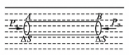

    
图4-1 同一水平面上各点的压强

    - 如图 4-1 所示，在静止流体中同一水平面上任取两点 $A、B$ ，并设该两点的压强为 $P_A, P_B$ - 在流体内取一水平柱形流体，两底面分别包含 $A、B$ 两点，且其面积 $\Delta S$ 足够 小，以致可以认为上的压力处处相同。因为柱形流体处于平衡状态，所以有

      $$p_A\Delta S-p_B\Delta S=0$$

      即  

      $$p_A=p_B$$  
      上式表明：**在流体中同以水平线上两点的压强相等**

      
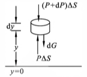

      
图4-2 流体内质元受力分析

    - 如图 4-2 所示，在坐标 $y$ 处取一厚度为 ${\rm d}y$ 的薄圆盘状体积元，且其上下两面面积均为 $\Delta S$ 设流体在 $y$ 处的压力为 $p$，在 $y + {\rm d}y$ 处的压力为 $p+{\rm d}p$ ，流体的密度为 $\rho$

      由图 4-2 可知，体积元受上下流体的作用力，还受到重力 ${\rm d}P = pg\Delta S{\rm d}y$。因为体积元处于平衡状态，故在竖直方向上受力为零，从而有:

      $$(p+{\rm d}p)\Delta S+\rho g\Delta S{\rm d}y=p\Delta S$$

      于是得

      $$\frac{ {\rm d}p}{ {\rm d}y}=-\rho g$$

      设 $p_1$ 为高度 $y_1$ 处的压强，$p_2$ 房高度丸处的压强，则由式 (4-4) 可得:

      $$p_2-p_1=-\int^{y_2}_{y_1}\rho g{\rm d}y$$

      对于液体而言，因其具有不可压缩性，故 $\rho$ 为常数。如果高度差 $h=y_2-y_1$ 不是很大，$g$ 值也可看作常数，所以积分式 $(4-5)$ 可写成:

      $$p_2-p_1=-\rho g(y_2-y_1)=-\rho gh$$

      式 (4-6) 表明，在静止流体中同一竖直线上两点的压强差为 $\rho gh$，且位置高处压强小。如果两点不在同一竖直线上，这一结论依然成立
      如果液体表面同大气接触，且液面处的大气压强为 $p_0$，则由式 (4-6) 可知在液面下 $h$ 深处的压强是

      $$p=p_0+\rho gh$$

  - 帕斯卡定律
    - 如图 4-3 所示,若将自由活塞 A 下压，则相当于使液体上表面处的压强 $p_0$ 值增加。根据式 (4-7)，液体中各处的压强 $p$ 也将随 $p_0$ 以相同的数值增加。即，对密闭流体任一部分所加的压力必然要等值地沿流体传向各处,这一结论称为帕斯卡定律

      

      
图4-3 帕斯卡定律

  - 阿基米德定律
    - 如图 4-4 所示，若一物体浸没在流体中，物体必然受到流体的作用力。设流体密度为 $\rho$，浸没物体为一柱形物，则作用于柱形物上、下底面的力分别为

      $$F_2=(p_0+\rho gh_2)\Delta S$$

      $$F_1=(p_0+\rho gh_1)\Delta S$$

      其中，$h_2、h_1$ 为柱形物上、下底面在液面下的深度，$\Delta S$ 是上、下底面面积。流体作用于物体的合力向上，数值为

      $$F=F_1-F_2=\rho g(h_1-h_2)\Delta S=\rho gV_排$$

      式中，$V_排$ 是物体的体积，也是物体排开流体的体积，而 $\rho gV_排$ 则是物体所排开流体的重 量。上式表明，当一物体全部或部分地浸入流体中时，物体所受到的向上的浮力，等于它所排开的流体的重量。这一结论称为阿基米德定律，它对任何形状的物体都适用

      
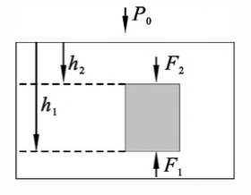

      
图4-4 阿基米德定律

- 理想流体
  - 定义：在一定条件下，忽略流体的压缩性和黏滞性。不可压缩和完全没有黏滞性的流体称为理想流体
  - 性质：理想流体流动时，各流层之间没有切向内摩擦力。此时流体作用于器壁的力与器壁 垂直,流体各部分之间的作用力和它们之间的截面垂直，力的方向决定于所取截面的方向。流体内的压强仍是位置的函数
  - 稳定流动：如果在每一点流体的速度都不随时间而变，则流体的这种流动称为稳定流动
    - 流线：假设在稳定流动的流体中，流体质元在 $A、B、C$ 三点分别具有恒定的速度 $v_A、v_B、v_C$，如图 4-5 所示。当流体质元以速度经过 $A$ 点后，又循序地以 $v_B$ 的速度经过 $B$ 点， 以 $v_C$ 的速度经过 $C$ 点。即凡经过 $A$ 点的流体质元都必然走 $ABC$ 这样一曲线路径，我们 称这一曲线为流线
    
    
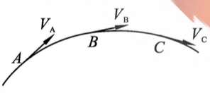

    
图4-5 流线

    - 流管：可以任选一束流线，它们所围成的管状空间称为流管
      - 如图4-6所示。由于流线不可 能相交，因而没有任何流体质元可以穿入或穿出流管。流管犹如真实的管道一样。我们 可以将流动的流体划分成许多相邻的流管，研究每一流管中流体的运动状态，即可以知 道全部流体的运动情况。因此，以后要研究的是理想流体在一流管中的稳定流动

      
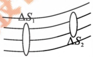

      
图4-6 流管

      
  - 连续性方程
    - 如图4-6所示，过流管中任意两点分别做垂直于流管的截面 $\Delta S_1$ 和 $\Delta S_2$，设流经每一截面上各点的流体质元的速度都相同，并令 $v_1$ 和 $v_2$ 分别为 在 $\Delta S_1$ 和 $\Delta S_2$ 处流体速率。 对于理想流体，在 $\Delta t$ 时间间隔内，通过截面 $\Delta S_1$ 的流体的体积应等于通过 $\Delta S_2$ 截面的流体的体积，即
    
    $$v_1\Delta t\Delta S_1=v_2\Delta t\Delta S_2$$

    因此有

    $$v_1\Delta S_1=v_2\Delta S_2$$

    这个关系式对任何垂直于流管的截面都是正确的，一般可写为

    $$v\Delta S=Const$$

    $v\Delta S$ 常称为通过管口的单位时间的流量，单位为 $m^3\cdot s_{-1}$ 式 (4-10) 称为理想流体的连续性方程。它表明在同一流管中，流体流经任一截面的流量相等，或者说流速与流管的横截面积成反比
  - 伯努利方程
    
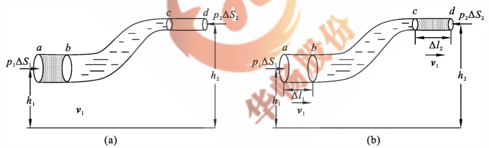

    
图4-7 伯努利方程

    - 如图 4-7 所示 的一个细流管，理想流体自左向右流动。考虑 $ac$ 这一段流体系统，即如图 4-7(a) 所示的 $\Delta S_1$ 与 $\Delta S_2$ 之间的流体。经过 $\Delta t$ 时间后，这段流体流到[见图4-7(b)]的 $bd$ 之间的位置。实际上，经过 $\Delta t$ 时间后，截面 $\Delta S_1$ 前进了 $\Delta l_1$ 距离，截面 $\Delta S_2$ 前进了 $\Delta l_2$ 距离。当 $\Delta t\rightarrow0$ 时，$\Delta l_1\rightarrow0,\Delta l_2\rightarrow0$,则可以认为在这样微小距离内，$v_1$ 和作用于 $\Delta S_1$ 上的压力 $p_1$ 是不变的；$v_2$ 和作用于 $\Delta S_2$ 上的压力 $p_2$ 是不变的。同时，设 $\Delta S_1$ 和 $\Delta S_2$ 的面积都未变，而且作用于它们上面的压力是均匀的
    - 流管中的流体在由如位置流到位置的过程中，系统内力对系统不做净功，只有外力对系统做净功。外力对系统所做的净功为

      $$W=p_1\Delta S_1\Delta l_1-p_2\Delta S_2l_2$$

      对于理想流体，$\Delta S_1\Delta l_1=\Delta S_2\Delta l_2=\Delta V"$ 是 $ab$ 之间或 $cd$ 之间流体的体积。令 $m$ 表示 $\Delta V$ 体积中流体的质量，则 $\Delta V=m/\rho$，$\rho$ 为流体的密度。理想流体各处密度相等，于是，外力做的净功为

      $$W=(p_1-p_2)\frac{m}{\rho}$$

      在此过程中机械能增量为

      $$\Delta E=(\frac{1}{2}mv_2^2+mgh_2)-(\frac{1}{2}mv_1^2+mgh_1)$$

      根据功能原理，式 (4-12) 与式 (4-13) 相等，故

      $$(p_1-p_2)\frac{m}{\rho}=(\frac{1}{2}mv_2^2+mgh_2)-(\frac{1}{2}mv_1^2+mgh_1)$$

      整理得

      $$p_1+\frac{1}{2}\rho v_1^2+\rho gh_1=p_2+\frac{1}{2}\rho v_2^2+\rho gh_2$$

      式 (4-14) 代表了流管中任意一条流线上的任意两点的压力、速度和高度的关系，其普遍形式为

      $$p+\frac{1}{2}\rho v_2^2+\rho gh=Const$$

      $$\frac{p}{\rho g}+\frac{v^2}{2g}+h=Const$$

      这就是伯努利方程，它适用于理想流体的稳定流动，其中
      - $p+\rho gh$ 称为静压强
      - $\frac{1}{2}\rho v^2$ 称为动压强
      - $\frac{p}{\rho g}$ 压力头
      - $\frac{v^2}{2g}$ 速度头
      - $h$ 水头
- 粘滞流体
  - 粘滞定律：当流体流过固体表面时，靠近固体表面的一层流体附着于固体表面而不动，其它流 层由于层与层之间存在着内摩擦力，因此各层流速不同，离固体表面越远的流层，流速越大
    - 图4-8 K圆形管道纵切面上流速分布情形，靠近管轴处流速最大，在管壁处流速 最小
  
    
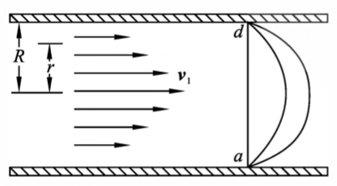

    
图4-8 流速的分布

    - 图 4-9 为平面层流的情形

    
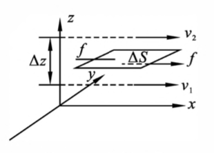

    
图4-9 速度梯度

    
  - 速度梯度：在 $z$ 轴上取相距为 $M$ 的两相邻流层，流速分别为 $v_1$ 与 $v_2$，有

    $$\frac{ {\rm d}v}{ {\rm d}z}=\lim_{\Delta z\rightarrow0}\frac{v_2-v_1}{\Delta z}=\lim_{\Delta z\rightarrow0}\frac{\Delta v}{\Delta z}$$

    其中 $\frac{ {\rm d}v}{ {\rm d}z}$ 称为 $z$ 处的速度梯度。实验证明，在Z处两流层间的内摩擦力与流体的流动层的面积 $\Delta S$ 成正比，与速度梯度成正比，即

    $$F=\eta\Delta S\frac{ {\rm d}v}{ {\rm d}z}$$

    比例系数 $\eta$ 称为流体的粘滞系数，它只决定于流体本身的性质，是流体黏滞性大小的量度。在国际单位制中，粘滞系数的单位是 $Pa\cdot s$。式 $(4-17)$称为流体的粘滞定律
    - 满足上式的流体称为牛顿液，不满足上式的流体称为非牛顿液
  - 泊肃叶公式
    - 如图 4-8 所示，可知黏滞性流体在圆形管中流动时，速度在通过管中心轴的纵截面上的分布为抛物线型。如果管长为 $l$，管的半长为 $R$，管子两端的压强分别为 $p_1$ 和 $p_2$，则可以证明管子中距管轴心为 $r$ 处的流体速度是：
      
      $$v=\frac{p_1-p_2}{4\eta l}(R^2-r^2)$$

      单位时间内的流量为

      $$Q=\frac{\pi R^4}{8\eta l}(p_1-p_2)$$

      上式称为泊肃叶公式。它表明，当黏滞性流体流经一圆管后，其流量与管子两端的压强 差成正比，和管的半径的四次方成正比，而和管长及粘滞系数成反比

  - 对伯努利方程的修正
    在推导伯努利方程时，我们忽略了内摩擦力的作用。若考虑到由于内摩擦力做功引起能量的损耗，伯努利方程应该加以修正。修正后的伯努利方程为：

      $$p_1+\frac{1}{2}\rho v_1^2+\rho gh_1=p_2+\frac{1}{2}\rho v_2^2+\rho gh_2+w$$

      式中，$w$ 是与流体黏滞性有关的修正项，称为沿程能量损失
      对于粗细均匀的水平流管，$v_1 =v_2, h_1 =h_2$，则由上式可得：

      $$w=p_1-p_2$$

      再应用泊肃叶公式可得:

      $$w=\frac{8\eta l}{\pi R^4}Q$$

      以流量 $Q$ 与流管横截面积 $\pi R^4$ 之比称为平均流速，用 $v$ 表示，即 $v=\frac{Q}{\pi R^4}$，于是

      $$w=\frac{8\eta l}{R^2}\overline{v}$$

      上式表明，对于均匀水平流管，$w$ 与平均流速 $\overline{v}$ 成正比。在 $\overline{v}$ 一定时，$w$ 与 $\eta l$ 成正比，与 $R^2$ 成反比。这是因为，粘滞系数越大，管越长，粘滞力做功越大;；管径小，在平均流速相同的条件下，速度梯度越大，粘滞力越大，从而粘滞力做功就越大
  - 斯托克斯公式
    - 粘滞阻力：当物体在黏滞性流体中运动时，要受流体的内摩擦阻力作用。这种由于流体的黏滞性而直接产生的阻力叫粘滞阻力  
      当物体运动速度不大，且物体的形状是比较适宜的流 线型时，它仅受到粘滞阻力的作用
    - 斯托克斯定律：实验证明，若物体相对于流体的速度较小时，它所受 到的粘滞阻力 $F$ 与物体相对于流体的运动速度、流体的粘滞系数 $\eta$ 及物体的线度 $l$ 成正 比。这一规律称为斯托克斯定律
      上述定律中的比例系数随物体的形状而定，对于球形 物体来说，其线度以半径 $r$ 表示，其比例系数为 $6\pi$ 即球形物体在黏滞性流体中运动时，所受的粘滞阻力为：

        $$F=6\pi\eta rv$$

        上述称为斯托克斯公式
- 流体测量
  - 流动流体中的压强测量
  - 流量测量
  - 流速测量
  - 粘度测量

## Lecture №10 Колебания (I) 振动（一）

- 简谐振动
  - 定义：如果振动可以用时间的余弦函数或正弦函数来描述，就称为简谐振动
  - 弹簧振子

    
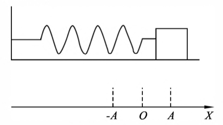

    
图5-1 弹簧振子

    - 如图 5-1 所示，一个劲度系数为 $k$ 的轻质弹簧(质量可忽略不计)，一端固定，另一端 系一质量为 $m$ 的物体，置于光滑的水平面上。$O$ 点为弹簧自然伸长时物体的位置，称为平衡位置
    - 以 $O$ 点为原点，水平向右为正方向建立 $x$ 轴。在弹性限度内向右拉动物体后放开。忽略一切阻力，物体将在弹力作用下，在平衡位置附近来回振动。这一包含弹簧 和物体的振动系统就叫弹簧振子
  - 振动方程
    - 在振动过程中，物体所受的弹力 $F$ 的大小和方向都在改变。由胡克定律可知

      $$F=-kx$$

      可见，弹力 $F$ 的大小与物体的位移 $x$ 成正比。式中的负号表示弹力的方向总是与位移的 方向相反。根据牛顿第二定律 $F=ma$，物体的加速度 $a$ 为

      $$a=\frac{F}{m}=-\frac{k}{m}x$$

      由 $a=\frac{ {\rm d}^2x}{ {\rm d}t^2}$ 上式可写成

      $$\frac{ {\rm d}^2x}{ {\rm d}t^2}=-(\frac{k}{m})x$$

      令 $\omega^2=k/m$则有

      $$\frac{ {\rm d}^2x}{ {\rm d}t^2}=-\omega^2x$$

      上式为简谐振动的微分方程，求解可得

      $$x=A\cos{(\omega t+\varphi)}$$

      这一关系式称为简谐振动的振动方程。式中
      - $A$ 为最大位移的绝对值，称为振幅；
      - $\omega$ 称为圆频率；
      - $(\omega+\varphi)$ 称为相位；$\varphi$是零时刻的相位，称为初相位

      式 (5-1) 对时间分别求一阶、二阶导数,可分别得到简谐振动中物体的速度 $v$ 和加速度 $a$ 为

      $$v=\frac{ {\rm d}x}{ {\rm d}t}=-A\omega\sin{(\omega t+\varphi)}$$

      $$a=\frac{ {\rm d}v}{ {\rm d}t}=\frac{ {\rm d}^2x}{ {\rm d}t^2}=-A\omega^2\cos{(\omega t+\varphi)}$$

    - 简谐运动的能量守恒定律
      对简谐振动，其动能

      $$E_k=\frac{1}{2}mv^2=\frac{1}{2}mA^2\omega^2\sin^2{\omega t+\varphi}$$

      其势能

      $$E_p=\frac{1}{2}kx^2=\frac{1}{2}kA^2\cos^2{(\omega t+\varphi)}$$
      
      其总能量

      $$E=E_k+E_p=\frac{1}{2}mA^2\omega^2\sin^2{(\omega t+\varphi)}+\frac{1}{2}kA^2\cos^2{(\omega t+\varphi)}$$

      考虑到 $\omega^2=\frac{k}{m}$

      $$E=\frac{1}{2}mA^2\omega^2=\frac{1}{2}kA^2$$

      可见,在简谐振动中，动能和势能可相互转化，但总能量保持不变。振幅是反映振动能量 大小的物理量
  - 固有周期：振动物体完成一次全振动所需要的时间称为周期，用 $T$ 表示
  - 固有频率：物体在一秒内完成全振动的次数称为频率，用 $\nu$ 表示。频率的单位是赫兹(Hz)
    - 周期和频率是反映振动快慢 的物理量
    - 对简谐振动，其振动方程为

      $$x=A\cos{(\omega t+\varphi)}=A\cos{[\omega(t+T)+\varphi]}$$

      由振动方程可知，物体完成一次全振动，其相位变化量为 $2\pi$。即有

      $$\omega T=2\pi$$

      $$T=\frac{2\pi}{\omega}$$

      $$\nu=\frac{1}{T}=\frac{\omega}{2\pi}$$

      $$\omega=2\pi \nu=\frac{2\pi}{T}$$

      对弹簧振子，有 $\omega^2=\frac{k}{m}$ 则

      $$\omega=\sqrt{\frac{k}{m}},\nu=\frac{1}{2\pi}\sqrt{\frac{k}{m}},T=2\pi\sqrt{\frac{m}{k}}$$

      可见，弹簧振子的周期和频率只与振子本身有关，把这种只由振子本身结构决定的周期 和频率称为振子的固有周期和固有频率
  - 描述
    - 振幅：振幅是振动物体离开平衡位置的最大位移的绝对值。它反映了振动幅度的大小
      - 在简谐运动的表达式中，因为余弦或正弦函数的绝对值不能大于 1,所以，物体的振动范 围为 $+A$ 与 $-A$ 之间。振幅通常由初始条件决定

        把初始条件 $t=0,x =x_0,v=v_0$ 代入式(5-1) 和式 (5-2) 可得：

        $$x_0=A\cos{\varphi}$$

        $$v_0=-A\omega\sin{\varphi}$$

        对上两式求解可得：

        $$A=\sqrt{x_0^2+(\frac{v_0}{\omega})^2}\tan{\varphi}=-\frac{v_0}{\omega x_0}$$
    - 圆频率 $\omega$：圆频率是单位时间内相位的改变量，它的大小反映了振子振动频率的大小
      对弹簧振子，圆频率的大小取决于振子的质量和劲度系数它们之间的关系式为：

      $$\omega=\sqrt{\frac{k}{m}}$$

    - 相位
      - 初相：在 $t=0$ 时,相位为 $\varphi$，称为初相
      - 相位差：两个振动在同一时刻的相位之差或同一振动在不同时刻的相位之差

        $$x_1=A_1\cos{(\omega t+\varphi_1)}$$

        $$x_2=A_2\cos{(\omega t+\varphi_2)}$$

        $$\Delta\varphi=(\omega t+\varphi_2)-(\omega t+\varphi_1)=\varphi_2-\varphi_1$$

        即两个同频率的简谐运动在任意时刻的相位差是恒定的。且始终等于它们的初始相位差，说明：

        1. $\Delta \varphi>0$ 质点2的振动超前质点1的振动
        2. $\Delta \varphi$ 质点2的振动落后质点1的振动
        3. $\Delta \varphi=\pm2k\pi,k\in Z$ 同相
        4. $\Delta \varphi=\pm(2k+1)\pi,k\in Z$ 反相
  - 旋转矢量

    
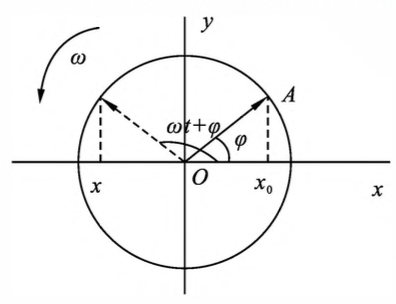

    
图5-2 旋转矢量

    - 定义：当一矢量 $\vec A$ 绕其一端点。以角速度 $\omega$ 逆时针方向旋转时，把 $\vec A$ 称为旋转矢量。另一端点在 $x$ 轴上的投影点上将作简谐振动
    - 公式：

      $$x=A\cos(\omega t+\varphi)$$

      其中：
      - $A$ 是旋转矢量的大小，等于振幅
      - $\varphi$ 是 0 时刻旋转矢量 $\vec A$ 与 $x$ 轴的夹角，为初相位
      - $\omega$ 为圆频率
      - $x$ 为 $t$ 时刻质点的位置
  - 振动曲线

    
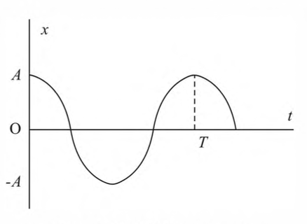

    
图5-3 振动曲线

    - 定义：谐振动中 $x$ 和 $t$ 的关系曲线叫振动曲线，由公式可知，简谐振动的振动曲线是余弦曲线
  - 振动合成
    - 同频率同振动方向的简谐振动的合成：两个同频率、同振动方向的简谐振动的合振动也是简谐振动

## Lecture №11 Колебания (II) 振动 (II)

- 阻尼振动
  - 当物体以不太大的速度在黏滞性介质中运动时，所受到的阻力 $f$ 与速度大小 $v$ 成正比，即
    
    $$f=-Cv$$

    式中，$C$ 为一与物体的大小、形状和介质的性质有关的常数，称为阻力系数。负号表示阻力与物体速度的方向相反。由牛顿第二定律可得到弹簧振子作阻尼振动的振动方程为：

    $$x=Ae^{-\beta t}\cos{(\omega t+\varphi)}$$

    式中：$\beta=C/2m$，称为阻尼系数; $\omega=\sqrt{\omega_0^2-\beta^2},\omega_0$ 是弹簧振子的固有频率
  - 临界阻尼状态：
    - 当 $\beta^2>\omega_0^2$ 时，$\omega$ 无解，此时，振动从开始的最大位移缓慢地回 到平衡位置，不再作往返运动
    - 当 $\beta^2=\omega_0^2$ 时，物体从最大位移处回到平衡位置的时间最短
- 受迫振动：
  - 定义：在实际的振动中，阻尼总是客观存在的。要使振动持续下去，必须对系统施加一周期性的外力。这种系统在周期性外力作用下所发生的振动，称为受迫振动
  - 实例：一弹簧振子受到的阻力 $f=-Cv$，周期性外力 $F=H\cos pt$ (其中，$H$ 是力幅，$p$ 是驱动力的圆频率)。则由牛顿第二定律有：

    $$-kv-Cv+H\cos pt=ma$$

    即

    $$m\frac{ {\rm d}^2x}{ {\rm d}t^2}+C\frac{ {\rm d}x}{ {\rm d}t}+kx=H\cos pt$$

    解得

    $$x=A_0e^{-\beta t}\cos(\omega t+\varphi_0)+A\cos(pt+\varphi)$$

    可见，受迫振动是由阻尼振动 $x=Ae^{-\beta t}\cos{(\omega t+\varphi_0)}$ 和简谐振动 $A\cos(pt+\varphi)$ 合成的

    经过一段时间后，阻尼振动就衰减到可以忽略不计。受迫振动就达到稳定状态。这时有

    $$x=A\cos(pt+\varphi)$$

    可见，受迫振动的频率为驱动力的频率。式中：

    $$A=\frac{H}{m\sqrt{(\omega_0^2-p^2)^2+4\beta^2p^2}}$$
- 共振：当驱动力的频率 $p$ 接近于振子固有频率 $\omega_0$ 的某一数值时，振幅 $A$ 具有最大值，这种现象称为共振

## Lecture №12 Волновые процессы (I) 波（一）

- 波概念
  - 横波：横波的振动方向和传播方向相垂直，如绳子上的波。横波在传播的过程中，不同质 元的位移也不同。把具有正位移的质元所构成的包络称为波峰，把具有负位移的质元所 构成的包络称为波谷。
  - 纵波：纵波的振动方向和传播方向相一致，如弹簧沿轴向传播的波。纵波在传播的过程 中，不同质元的位移也不同。有些位置的质元相互靠近称为波密，有些位置的质元相互
疏远称为波疏。

  
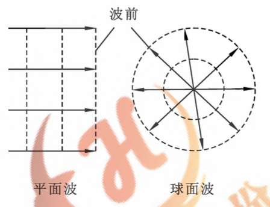

  
图5-6 波线波面波前

  - 波线：波源在弹性媒质中振动时，振动将向各个方向传播。沿着波的传播方向画出一些带 箭头的射线，称为波线
  - 平面波
    - 波在传播过程中，媒质中的各点虫在平衡位置附近作振动，波传播的是相位。把振 动相位相同的各点构成的面称为同相面或波面。把波源最初振动状态传到的各点所构 成的面称为波阵面或波前。
    - 波前是平面的称为平面波。波前是球面的称为球面波。
  - 惠更斯原理：波到达的每一点都可看成是发射子波的子波源，新的波阵面就是这些子波波阵面的包迹。把这一结论称为惠更斯原理
- 描述波的物理量
  - 波长：在同一波线上，两个相邻的、相位差为 $2\pi$ 的振动质点间的距离称为波长，用 $\lambda$ 表示，单位：$m$

    
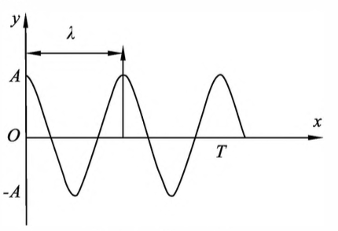

    
图5-1 弹簧振子

  - 周期：波前进一个波长的距离所需的时间称为周期。用 $T$ 表示。其数值等于波源振动的周期。
  - 频率：是周期的倒数。用 $\nu$ 表示。即

    $$\nu=\frac{1}{T}$$
  - 波速：单位时间内波传播的距离称为波速。用 $v$ 表示。

    $$v=\frac{\lambda}{T}=\lambda\nu$$

## Lecture №13 Волновые процессы (II) 波 (II)

- 平面简谐波
  - 定义：若在平面波的传播过程中，波源作简谐振动，波所经历的所有质元都按余弦规律振 动，则此平面波称为平面简谐波
  - 波动方程：设有一平面简谐波沿 $x$ 轴正方向传播，振动方向为 $y$轴方向。波速 为 $v$，波长为 $\lambda$
    - 从空间上考虑
      1. 振源在原点 $O$ 处，振源的振动方程为：

          $$y_0=A\cos{(\omega t+\varphi)}$$

          则在 $A$ 位置，质点的振动相位比 $O$ 点落后 $2\pi$  
      2. 在任意位置 $x$，质点的振动相位比 $O$ 点落后 $\Delta \Phi=2\pi x/\lambda$，则可得到 $x$ 位置的振动方程为:

          $$y=A\cos(\omega t-2\pi\frac{x}{\lambda}+\varphi)$$

    - 从时间上考虑
      1. 振源的振动传到 $x$ 位置所需要的时间为 $\Delta t=x/v$，则 $x$ 位置的振动方程为:

          $$y=A\cos[\omega(t-\frac{x}{v})+\varphi]$$

    - 当振动沿 $x$ 轴负向传播时，$x$ 点的相位超前于原点的相位为 $2\pi x/\lambda$，$x$ 点的时间超前于原点的时间为 $x/v$。则波动方程为:

      $$y=A\cos(\omega t+2\pi\frac{x}{\lambda}+\varphi)$$

      $$y=A\cos[\omega(t+\frac{x}{v}+\varphi)]$$

  - 波的叠加
    - 叠加原理：
      - 两列波相遇后再分开，其传播情况与未相遇时相同，互不干扰
      - 在相遇区域内，任一点的振动为两列波所引起的合振动
  - 波的干涉
    - 定义：两列同频率、同振动方向、且具有恒定相位差的波源，称为**相干波源**。相干波源发出的波称为**相干波**。相干波在同一均匀媒质中传播时，相互叠加，使有些点的振动始终加强(振幅增大)，有些点的振动始终减弱(振幅减小)，这一现象称为**波的干涉**

  
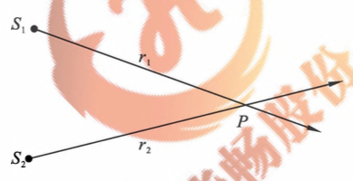

  
图5-8 波的干涉

    - 如图 5-8 所示，波源 $s_1$ 在 $P$ 点引起的振动方程为:

      $$y_1=A_1\cos(\omega t-2\pi\frac{r_1}{\lambda}+\varphi_1)$$

      波源 $S_2$ 在 $P$ 点引起的振动方程为:  

      $$y_2=A_2\cos(\omega t-2\pi\frac{r_2}{\lambda}+\varphi_2)$$

      则 $P$ 点的合振动为:  

      $$y=y_1+y_2=A\cos(\omega t+\varphi)$$

      其中，  

      $$A=\sqrt{A_1^2+A_2^2+2A_1A_2\cos\Delta\varphi}$$

      式中，$\Delta\varphi=-2\pi(r_1-r_2)/\lambda+\varphi_@-\varphi_1$ 为两波源分别在 $P$ 点引起的振动的相位差

      由此可见：
      - 当 $\Delta\varphi=2\pi$ 时，$A=A_1+A_2$，$P$ 点为振动加强点  
      - 当 $\Delta\varphi=(2k+1)\pi$ 时，$A=\|A_1-A_2\|$，$P$ 点为振动减弱点

      把 $\Delta r=r_2-r_1$ 称为波程差。由波程差引起的相位差为

      $$\Delta\phi=2\pi\frac{\Delta r}{\lambda}$$

- 波的能量
  - 波动与振动的能量：波动过程中质元的振动能量与弹簧振子的振动能量有所不同。对弹簧振子， 在振动过程中，系统的能量是守恒的。振动的动能是振动物体在平衡位置附近运动的动 能，振动的势能是弹簧形变的势能;而对处于波动中的质元,其能量是不守恒的。质元的 动能是质元在平衡位置附近运动的动能，质元的势能是质元本身因发生形变而具有的势能
  - 公式：设有一密度为 $\rho$ 的细长棒沿 $X$ 轴放置，如图 5-9 所示。当一平面简谐纵波在棒中沿 $X$ 轴正方向传播时，棒中的每一质元都要在平衡位置附近作振动，且质元本身要受到压 缩或拉伸发生形变。在棒上取一长度为 $k$ 的微元。若细棒的横截面积为 $S$，则微元的 体积 ${\rm d}V = 5drr$，质量 ${\rm d}m =p{\rm d}V$。质元的振动动能为
  
    $${\rm d}W_k=\frac{1}{2}{\rm d}mu^2$$

    式中，机为质元振动的速度大小，由波动方程 $y=A\cos\omega(t-\frac{x}{v})$ 可得：

    $$u=\frac{ {\rm d}y}{ {\rm d}t}=-A\omega\sin\omega(t-\frac{x}{v})$$

    $${\rm d}W_k=\frac{1}{2}(\rho{\rm d}V)A^2\omega^2\sin^2\omega(t-\frac{x}{v})$$

    可以证明，质元因发生形变而具有的势能 ${\rm d}W_p$ 在任一时刻都和动能 ${\rm d}W_k$ 相等，即：

    $${\rm d}W_p={\rm d}W_k=\frac{1}{2}(\rho{\rm d}V)A^2\omega^2\sin^2\omega(t-\frac{x}{v})$$

    质元的总能量：

    $${\rm d}W={\rm d}W_k+{\rm d}W_p=\rho{\rm d}VA^2\omega^2\sin^2\omega(t-\frac{x}{v})$$

    可见，在波的传播过程中，质元的机械能不守恒。质无在平衡位置的能量最大，在最大位 移处的能量最小。质元在由最大位移处回到乘衡位置的过程中，总是从前面的质元接受能量;而在由平衡位置运动到最大位移处的过程中，总是向后面的质元传递能量。所以， 波是传递能量的一种方式
  - 能量密度：把单位体积内具有的能量称为能量密度，用 $\omega_e$ 表示：
  
    $$\omega_e=\frac{ {\rm d}W}{ {\rm d}V}=\rho A^2\omega^2\sin^2\omega(t-\frac{x}{v})$$

    可见,能量密度是随时间变化的。在一个周期内求平均可得平均能量密度为

    $$\overline{\omega}_e=\frac{1}{2}\rho A^2\omega^2$$
  - 能流：单位时间内通过某一面积的能量称为通过该面积的能流。用 $P$ 表示。如果有一个平面 $S$ 垂直于波的传播方向，若波速为 $v$，则单位时间内的平均能流为
  
    $$\overline{P}=vS\overline{\omega}_e=\frac{1}{2}vS\rho A^2\omega^2$$

  - 能流密度：把通过垂直于波的传播方向的单位面积的能流称为能流密度，用 $I$ 表示：
 
    $$\overline{I}=\frac{\overline{P}}{S}=v\overline{\omega}_e=\frac{1}{2}v\rho A^2\omega^2$$

## Lecture №14 Основы СТО (I) 狭义相对论基本原理（一）

- 经典力学的相对性原理
  - 在牛顿力学的范围内，研究同一质点在两个惯性系中的坐标、速度和加速度的对应 关系。取两个参考系 $S$ 和 $S'$，它们的对应坐标轴都是平行的，$S'$ 相对于 $S$ 系以速度诺沿 $Ox$ 轴的正向运动。当时间 $t =0$ 时,两坐标系的原点重合，如图 13-1 所示

    
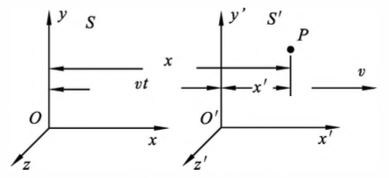

    
图13-1 伽利略变换式

    由经典力学可知，时刻t 的质点在两个参考系中的坐标有如下对应关系：

    $$\begin{cases}
      x'=x-vt\\
      y'=y\\
      z'=z
    \end{cases}$$

    若沿 $x$ 轴放置一细棒，此棒在两坐标系中的 $x$ 轴和 $x'$ 轴上的坐标分别为

    $$x_1=x'_1+vt\quad x_2=x'_2+vt$$

    $$x_2-x_1=x'_2-x'_1$$

  - 伽利略变换式
    由经典力学可知，空间的量度是绝对的，在两个惯性参考系中，测量一个物体的长度，所得的量值是相等的，不随进行量度的参考系而变化  

    此外,经典力学认为，时间的量度也是绝对的。一事件在 $S'$ 系中时间的量度和 $S$ 系中时间的量度相同，即 $t'=t$：

    $$\begin{cases}
      x'=x-vt\\
      y'=y\\
      z'=z\\
      t'=t
    \end{cases}
    \begin{cases}
      x=x'+vt\\
      y=y'\\
      z=z'\\
      t=t'
    \end{cases}$$

  这些变换式就是**伽利略坐标变换式**

  把上式的前三项对时间求一阶导数，就得经典力学中的速度变换式，即：

  $$\begin{cases}
    v'_x=v_x-v\\
    v'_y=v_y\\
    v'_z=v_z
  \end{cases}$$

  把经典力学中的速度变换式对时间求一阶导数，可得：

  $$\begin{cases}
    a'_x=a_x-a\\
    a'_y=a_y\\
    a'_z=a_z
  \end{cases}$$

  该式表明，在两个惯性系中，质点的加速度是相同的  
  绝对时空观认为，空间只是物质运动的“场所”，是永恒不变、绝对静止的。因此，空间的量度就与参考系无关，是绝对不变的。此外，绝对时空观还认为时间也是与物质的 运动无关，在永恒的、均匀地流逝着，因此，对于不同的参考系应当用同一的时间来讨论问题

  实践表明，**绝对时空观在物体或参考系的速度远小于光速时是高度精确的**，因此经 典力学依然适用于低速运动的宏观客体
- 狭义相对论基本原理
  - 相对性原理：在所有的惯性系中，一切物理定律的形式是相同的。这样，描述物理现象的物理定律对所有惯性系都应取相同的数学形式。不论在哪个惯性系中做实验, 都不能确定该惯性系的绝对运动。也就是说，对运动的描述只具有相对的意义，绝对静止的参照系是不存在的
  - 光速不变原理：在所有惯性系中，真空中的光速具有相同的数值 $c$，它不依赖于惯性系之间的运动，也与光源、观察者的运动无关
- 洛伦兹变换

  
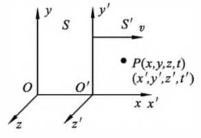

  
图13-2 洛伦兹变换式

  - 洛伦兹坐标变换式：设有一静止的惯性系 $S$，另一惯性系 $S'$ 沿着 $Ox$ 轴以速度 $v$ 相对于 $S$ 系运动，如图 13-2 所示。有两个观察者，一个静止在 $S$ 系中，另一个静止于 $S'$ 系中，且 $t=0$ 时两坐标系的原点重合。由狭义相对论的基本原理可得空间任意点在两个惯性系中的时空变换式为：

    $$\begin{cases}
      x'=\frac{x-vt}{\sqrt{1-\beta^2}}=\gamma(x-vt)\\
      y'=y\\
      z'=z\\
      t'=\frac{t-\frac{vx}{c^2}}{\sqrt{1-\beta^2}}=\gamma(t-\frac{vx}{c^2})
    \end{cases}$$

    其中：$\beta=\frac{v}{c}$，$\gamma=\frac{1}{\sqrt{1-\beta^2}}$，$c$ 是光速
  - 逆变换

    $$\begin{cases}
      x=\frac{x'+vt}{\sqrt{1-\beta^2}}=\gamma(x'+vt)\\
      y=y'\\
      z=z'\\
      t=\frac{t'+\frac{vx'}{c^2}}{\sqrt{1-\beta^2}}=\gamma(t'+\frac{vx'}{c^2})
    \end{cases}$$

  可见，在洛仑兹变换中，时间都依赖于空间的坐标，这与伽利略变换不同  
  - 洛伦兹速度变换式
- 狭义相对论的基本结论
  - 同时的相对性：在牛顿力学中，时间是绝对的。两事件在惯性系 $S$ 中观察是同时的，在另一惯性系 $S'$ 中观察也是同时的。但是根据狭义相对论，这两个事件在一个惯性系中观察是同时的，而在另一惯性系中观察就不是同时的了，即同时的相对性

    设在 $S$ 系中 $A(x_1,t_1)]、B(x_2,t_2)$ 两点同时发生两件事情，在 $S'$ 系中的观察者认为，这两件事情发生的时空为 $A(x_1,t_1)、B(x_2,t_2)$，由洛仑兹变换式可得在 $S'$ 系中这两件事情发生的时间间隔为：

    $$t'_2-t'_1=\frac{\frac{v}{c^2}(x_2-x_1)}{\sqrt{1-\frac{v^2}{c^2}}}$$

    这表明“同时”具有相对意义，与参考系的选取有关
  - 长度的收缩：在伽利略变换中，两点之间的距离或物体的长度是不随参考系变换的。但在洛仑兹 变换中就不同了
    设一细棒静止于 $S'$ 系中，$S’$ 观察者同时测得棒的两端点坐标分别为为 $x'_1$ 和 $s'_2$, 即棒长 $l'=x'_2-x'_1$，而 $S$ 系中的观察者认为棒是运动的，并测得其长度为 $l=x_2-x_1$ 由洛仑兹变换式可得：

    $$l=l'\sqrt{1-\frac{v^2}{c^2}}$$

    这说明，从 $S$ 系中测量静止于 $S'$ 系中的棒长度要缩短一些。这种长度的收缩只出现在沿着运动的方向，称为洛仑兹收缩
  - 时间的延缓：如同长度不是绝对的那样，时间间隔也不是绝对的。设在 $S'$ 系中坐标 $x'$ 处，有一时钟记录该处发生两件事的时间间隔为 $\Delta t=t_2-t_1$ 为由洛仑兹变换式可得：

    $$\Delta t=\frac{\Delta t'}{\sqrt{1-\frac{v^2}{c^2}}}$$

    这就是说，$S$ 系中的钟记录 $S'$ 系中某一地点发生的两件事的时间间隔，比 $S'$ 系的钟 所记录的该两件事的时间间隔要长。由于 $S'$ 系相对于 $S$ 系是运动的，所以可以说，运动 的钟走慢了
  - 质量与速度的关系：在相对论中，物体的质量随物体的运动状态变化。设物体相对于观察者静止质量为 $m_0$，相对于观察者运动的质量为 $m$，理论分析表明，这两个质量间的关系为：

    $$m=\frac{m_0}{\sqrt{1-\frac{v^2}{c^2}}}$$

    此式称为相对论质量公式。对于 $m_0\ne 0$ 的物体，当 $v=c$ 时，将有 $m\rightarrow\infty$，这是不可能的，因此，不能把物体的速度加速到光速
  - 质量与能量的关系：狭义相对论提出，粒子的总能量由下式确定:

    $$E=mc^2=\frac{m_0c^2}{\sqrt{1-\frac{v^2}{c^2}}}$$

    此式称为质能关系式。可见粒子的能量大小也取决于粒子相对于观察者的运动  
    如果粒子相对于观察者的速度为零，则总能量为：

    $$E_0=m_0c^2$$

    若一个系统的质量发生变化，这时能量必有相应的变化，并且有：

    $$\Delta E=\Delta mc^2$$

    反之亦然，即系统的能量发生变化时，必然有相应的质量变化。综合考虑粒子的总能量 $E$、静能量 $E_0$ 和动能 $E_k$ 间的关系，有：

    $$mc^2=E_k+m_0c^2$$
  - 动量与能量的关系：在相对论中，静质量为 $m_0$、运动速度为 $v$ 的物体的总能量和动量分别为

    $$E=mc^2=\frac{m_0c^2}{\sqrt{1-\frac{v^2}{c^2}}}$$

    $$p=mv=\frac{m_0v}{\sqrt{1-\frac{v^2}{c^2}}}$$

    从以上两式中消去速度 $v$，有

    $$E^2=E_0^2+p^2c^2=m_0^2c^4+p^2c^2$$

    对于 $m_0=0$ 的光子，$E=pc=mc^2$。又光子的能量可写成 $E-h\nu$，所以光子的动量为：

    $$p=\frac{h\nu}{c}=\frac{h}{\lambda}$$

    光子的质量为：

    $$m=\frac{E}{c^2}=\frac{h\nu}{c^2}$$

    Powered by
    <a href="https://html5up.net">HTML</a>, 
    <a href="https://markdown.com.cn/">markdown</a>, 
    <a href="https://www.latex-project.org/">LaTeX</a>
     
    Copyright © 2022 | 
    <a href="https://tolia-gh.github.io">Tolia</a>
     
    All Rights Reserved.
     

