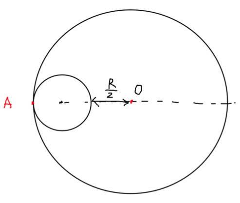
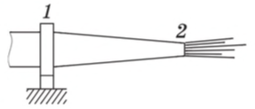
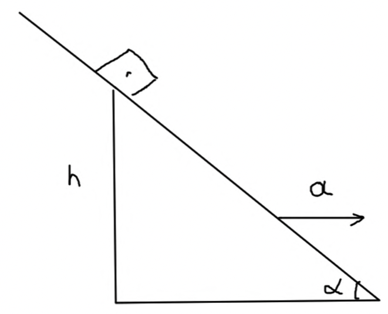

<head>
    
    
</head>

## [主页](../index.md)/[物理](README.md)/Practice

# Practice

## 1.399

Стержень движется равномерно в продольном направ­лении мимо двух меток $A$ и $B$, расположенных на расстоянии $\Delta x$ друг от друга. Сначала в момент $t_1$ напротив метки $A$ ока­зался передний конец стержня. Затем напротив метки $B$ в мо­менты $t_2$ и $t_3$ оказались соответственно передний и задний кон­цы стержня. Найти его собственную длину.

## 1.284

рис. 1

Однородный диск радиуса $R$ имеет круг­лый вырез (рис. 1). Масса оставшейся (заштри­хованной) части диска равна $m$. Найти момент инерции такого диска относительно оси, перпен­дикулярной плоскости диска и проходящей:
- а) через точку $O$;
- б) через его центр масс.

## 1.383

рис. 2

Сечение ствола гидромонито­ ра (рис. 2) меняется от $S_1=50\ см^2$ до $S_2=5.0\ см^2$. Найти модуль и на­правление горизонтальной силы, воз­никающей в креплении ствола (сече­ние $1$), если скорость струи на выходе $v_0=25\ м/с$. Вязкостью пренебречь.

## 4)

рис. 3

Тело находится в покое на вершине наклонной плоскости. За какое время тело соскользнет с плоскости, если плоскость в момент времени $t_0=0$ начнет двигаться вправо в горизонтальном направлении с ускорением $а=1\ м/с^2$? Высота плоскости $h=1м$, угол наклона к горизонту $\alpha=30\degree$, коэффициент трения между телом и плоскостью $\mu=0.6$.

## 5)

Частица массы m находится в одномерном силовом поле, где ее потенциальная энергия зависит от координаты следующим образом $U=\frac{a}{x^{\frac{3}{2}}}-\frac{b}{x^{\frac{1}{2}}}$. Найти период малых колебаний (выполняется Закон Гука ${\rm d}F=-k\cdot{\rm d}x$ - сила возвращающая тело в **положение равновесия**).

## 6)

Над шоссе висит источник звуковых сигналов с частотой $v=2.3\ кГц$ . К нему со скоростью $54\ км/ч$ приближается мотоциклист, ветер дует противоположно его движению со скоростью $u=5\ м/с$. Считая скорость звука $340\ м/с$, найти частоту сигнала, воспринимаемую мотоциклистом.