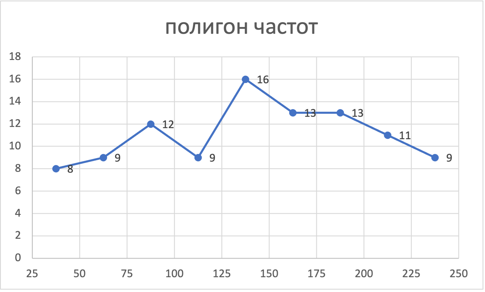

# Состав домашних заданий

## Домашнее задание No1 (теория вероятностей) Вариант 24

1. Рябушко Индивидуальные задания по высшей математике. В 4 ч. Ч.4 Операционное исчисление. Элементы теории устойчивости. Теория вероятностей. Математическая статистика: ИДЗ 18-1 (6 задач), ИДЗ 18-2 (4 задачи) по своему номеру в журнале.
2. Курс теории вероятностей, Чистяков В.П. Главы 2-6 по 5 любых задач из каждой главы (всего 25 задач)

Срок сдачи – 8-9 неделя.

### ИДЗ-18.1

1.24. Сколько перестановок можно сделать из букв слова «ракета», чтобы все они начинались с буквы «р»? (Ответ: 60.)

Первая всегда «р», переставляем только последние $5$ букв  
Получается $A_5^5=5!=120$ вариантов.  
Но у нас две буквы «р» одинаковы, поэтому на вариантов надо в $2$ раза меньше.

$$N=\frac{5!}{2}=60$$

2.24. Мальчик забыл две последние цифры номера телефона одноклассника и набрал их наугад, помня только, что эти цифры нечетны и различны. Найти вероятность того, что номер набран правильно. (Ответ: 0,05.)

$$P=\frac{N}{\Omega}=\frac{1}{A_5^2}=\frac{1}{20}=0.05$$

3.24. В ящике 50 % деталей, изготовленных на заводе №1, 20 % – на заводе №2 и 30 % – на заводе №3. Наугад взято три детали. Найти вероятность того, что:  

$$\begin{cases}
    p_1=0.5\\
    p_2=0.2\\
    p_3=0.3\\
\end{cases}$$

а) все три детали – с завода №1; 

$$P=p_1^3=0.5^3=0.125$$

б) две детали – с завода №1; 

$$P=p_1^2p_2+p_1^2p_3=0.5\times 0.5\times 0.2 + 0.5\times 0.5\times 0.3 = 0.5^3 = 0.125$$

в) все три детали – с разных заводов. 

$$P=p_1p_2p_3=0.5\times 0.2\times 0.3 = 0.03$$

(Ответ: а) 0,125; б) 0,125; в) 0,03.)

4.24. В состав блока входит 6 радиоламп первого типа и 10 второго. Гарантийный срок обычно выдерживает 80 % радиоламп первого типа и 90 % второго типа. Найти вероятность того, что: 

событие $A$ - «случайно выбранная радиолампа выдержит гарантийный срок»;

гипотеза $H_1$ - «выбранная радиолампа в блоке 1-ого типа»

гипотеза $H_2$ - «выбранная радиолампа в блоке 2-ого типа»

$$P(H_1)=\frac{6}{16}=0.375$$

$$P(H_2)=\frac{10}{16}=0.625$$

$$P(A\lvert H_1) = 0.8$$

$$P(A\lvert H_2) = 0.9$$

а) наугад взятая радиолампа выдержит гарантийный срок; 

$$P=P(H_1)\times P(A\lvert H_1) + P(H_2)\times P(A\lvert H_2) = 0.8625$$

б) радиолампа, выдержавшая гарантийный срок, первого типа. 

$$P(H_1\lvert A)=\frac{P(H_1)P(A\lvert H_1)}{P(A)}=\frac{\frac{6}{15}\times 0.8}{\frac{6}{15}\times 0.8 + \frac{10}{16}\times0.9}=\frac{0.375\times0.8}{0.8625}=0.3478$$

(Ответ: а) 0,8625; б) 0,3478.)

5.24. Вероятность поражения цели каждым из семи выстрелов равна 0,8. Найти вероятность поражения цели:

$$n=7, p=0.8$$

а) двумя выстрелами; 

$$P(X=2)=C_7^2\times0.8^2\times0.2^5\approx0.0032$$

б) хотя бы одним выстрелом; 

$$P(X\ge 1)=1-P(X=0)=1-C_7^0\times0.8^0\times0.2^7\approx0.999987$$

в) не менее чем тремя выстрелами. 

$$P(X\ge3)=1-C_7^0\times0.8^0\times0.2^7-C_7^1\times0.8^1\times0.2^6-C_7^2\times0.8^2\times0.2^5=1-0.0000128-0.0003584-0.0043008\approx0.9953$$

(Ответ: а) 0,0043; б) 0,99998; в) 0,9953.)

6.24. Вероятность того, что изделие – высшего качества, равна 0,5. Найти вероятность того, что из 400 изделий число изделий высшего качества составит от 194 до 208. (Ответ: 0,5138.)

Формула теоремы Муавра-Лапласа:

$$P_n(k_1; k_2)\approx\Phi(\frac{k_2-np}{\sqrt{npq}})-\Phi(\frac{k_1-np}{\sqrt{npq}})$$

где

$$\Phi(x)=\frac{2}{\sqrt{2\pi}}\int_0^xe^{-\frac{t^2}{2}} {\rm d}t$$

У нас:
- $n=400$
- $k_1=194$
- $k_2=208$
- $p=q=0.5$

Поэтому

$$P_{400}(194;208)\approx\Phi(\frac{208-400\times0.5}{\sqrt{400\times0.5^2}})-\Phi(\frac{194-400\times0.5}{\sqrt{400\times0.5^2}})=\Phi(0.8)-\Phi(-0.6)\approx0.28814+0.22575=0.51389$$

### ИДЗ-18.2

1.24. Вероятности поражения цели каждым из трех стрелков равны соответственно 0,7; 0,8; 0,6; СВ Х – число поражений цели при условии, что каждый из стрелков сделал по одному выстрелу. (Ответ: M (X) = 2,1, D (X) = 0,61.)

$$p_1=0.7,p_2=0.8,p_3=0.6$$

$$q_1=1-p_1=0.3,q_2=1-p_2=0.2,q_3=1-p_3=0.4$$

при $X=0$

$$\widetilde{p_0}=q_1 q_2 q_3=0.024$$

при $X=1$

$$\widetilde{p_1}=p_1 q_2 q_3+q_1 p_2 p_3+q_1 q_2 p_3=0.188$$

при $X=2$

$$\widetilde{p_2}=p_1 p_2 q_3+p_1 q_2 p_3+q_1 p_2 p_3=0.452$$

при $X=3$

$$\widetilde{p_3}=p_1p_2p_3=0.336$$

$x_1$ | 0 | 1 | 2 | 3 | sum
---|---|---|---|---|---
$\widetilde{p_i}$      | 0.024 | 0.188 | 0.452 | 0.336 | 1 
$x_1\widetilde{p_i}$   | 0     | 0.188 | 0.904 | 1.008 | 2.1
$x_i^2\widetilde{p_i}$ | 0     | 0.188 | 1.808 | 3.024 | 5.02

$$M(x)=\sum x_i\widetilde{p_i} = 2.1$$

$$D(x)=M(X^2)-M(M(X)^2)=\sum x_i^2\widetilde{p_i}-M(X)^2=5.02-4.41=0.61$$

2.24. 

$$F(x)=\begin{cases}
    0\quad при\ x\lt 0\\
    \frac{1}{6}x\quad при\ 0\le x\le 6\\
    1\quad при\ x\gt 6\\
\end{cases}$$

(Ответ: $M(x) = 3, D(x) = 3, P(2≤x≤5) = 0,5$.)

$$f(x)=F'(x)=\begin{cases}
    0\quad при\ x\lt 0\\
    \frac{1}{6}\quad при\ 0\le x\le 6\\
    1\quad при\ x\gt 6\\
\end{cases}$$

$$\begin{split}
    M(x)&=\int_{-\infty}^\infty xf(x) {\rm d}x\\
    &=\int_0^6\frac{1}{6}x {\rm d}x\\
    &=\frac{1}{6}\int_0^6x {\rm d}x\\
    &=\frac{1}{6}\cdot\frac{1}{2}x^2\Big\rvert_0^6\\
    &=\frac{1}{6}\times18=3
\end{split}$$

$$\begin{split}
    D(x)&=\int_{-\infty}^\infty x^2f(x) {\rm d}x-M(x)^2\\
    &=\int_0^6\frac{1}{6}x^2 {\rm d}x-3^2\\
    &=\frac{1}{6}\int_0^6x^2 {\rm d}x-9\\
    &=\frac{1}{6}\cdot\frac{1}{3}x^3\Big\rvert_0^6-9\\
    &=12-9=3
\end{split}$$

$$P(2\le X\le5)=F(5)-F(2)=\frac{5}{6}-\frac{2}{6}=\frac{1}{2}$$

3.24. Найти дисперсию и среднее квадратичное отклонение СВ Х, распределенной равномерно в интервале (2; 10). (Ответ: D(X) = 5,33 , σ(X) = 2,31 .)

равномерное распределение

$$f(x)=\begin{cases}
    0\qquad при\ x\lt a\ или\ x\gt b\\
    \frac{1}{b-a}\qquad при\ a\le x\le b\\
\end{cases}$$

$$M(x)=\frac{a+b}{2}$$

$$M(x)=\frac{(b-a)^2}{12}$$

У нас $a=2,b=10$, Поэтому:

$$M(x)=\frac{2+10}{2}=6$$

$$D(x)=\frac{(10-2)^2}{12}=\frac{8^2}{12}=\frac{64}{12}\approx5.33$$

$$\sigma(x)=\sqrt{D(x)}\approx\sqrt{5.33}\approx2.31$$

4.24. Среднее значение скорости ветра у земли в данном пункте равно 16 м/ч. Оценить вероятность того, что в этом пункте скорость ветра не будет превышать 80 м/ч. (Ответ: не менее 0,8.)

Неравенство Маркова

$$P(X\ge A)\le\frac{M(X)}{A}$$

У нас $A=80, M(X)=16$, Поэтому:

$$P(X\ge80)\le\frac{M(X)}{80}=\frac{16}{80}=\frac{1}{5}$$

$$P(X\le80)\ge1-\frac{1}{5}=\frac{4}{5}=0.8$$

## Домашнее задание No2 (Математическая статистика) Вариант 24

Рябушко Индивидуальные задания по высшей математике. В 4 ч. Ч.4 Операционное исчисление. Элементы теории устойчивости. Теория вероятностей. Математическая статистика
ИДЗ-19.1, ИДЗ-19.2
Вариант тот же: номер в журнале. Срок сдачи – 14-15 неделя.

### ИДЗ-19.1

|   |   |   |   |   |   |   |   |   |   |
---|---|---|---|---|---|---|---|---|---
76 | 28 | 151 | 91 | 60 | 204 | 177 | 102 | 128 | 217
120 | 66 | 207 | 126 | 124 | 152 | 27 | 221 | 131 | 51
241 | 77 | 250 | 134 | 123 | 147 | 184 | 195 | 47 | 160
159 | 74 | 169 | 178 | 79 | 129 | 250 | 223 | 182 | 96
135 | 199 | 56 | 25 | 82 | 116 | 44 | 229 | 145 | 203
88 | 209 | 146 | 224 | 239 | 103 | 201 | 245 | 130 | 163
71 | 165 | 176 | 194 | 78 | 154 | 99 | 78 | 127 | 69
171 | 173 | 31 | 181 | 117 | 84 | 73 | 161 | 240 | 149
247 | 107 | 140 | 53 | 205 | 155 | 29 | 132 | 185 | 179
180 | 128 | 42 | 114 | 93 | 191 | 174 | 210 | 133 | 226

В результате эксперимента получены данные, записанные в виде статистического ряда. Требуется:
- а) записать значения результатов эксперимента в виде вариационного ряда;  
  
  |   |   |   |   |   |   |   |   |   |   |
  ---|---|---|---|---|---|---|---|---|---
   25 | 27 | 28 | 29 | 31 | 42 | 44 | 47 | 51 | 53
  56 | 60 | 66 | 69 | 71 | 73 | 74 | 76 | 77 | 78
  78 | 79 | 82 | 84 | 88 | 91 | 93 | 96 | 99 | 102
  103 | 107 | 114 | 116 | 117 | 120 | 123 | 124 | 126 | 127
  128 | 128 | 129 | 130 | 131 | 132 | 133 | 134 | 135 | 140
  145 | 146 | 147 | 149 | 151 | 152 | 154 | 155 | 159 | 160
  161 | 163 | 165 | 169 | 171 | 173 | 174 | 176 | 177 | 178
  179 | 180 | 181 | 182 | 184 | 185 | 191 | 194 | 195 | 199
  201 | 203 | 204 | 205 | 207 | 209 | 210 | 217 | 221 | 223
  224 | 226 | 229 | 239 | 240 | 241 | 245 | 247 | 250 | 250

- б) найти размах варьирования и разбить его на 9 интервалов;  
  
  - размах варьирования: $\omega = x_{max}-x_{min}=250-25=225$  
  - разбить на 9 интервалов:  
    По фориуле $h=\omega / l$, где $l$ – число интервалов  
    вычисляем длину частичного интервала $h=225/9=25$

    Номер частичноuо интервала $l_i$ | Границы интервала $x_i-x_{i+1}$ | Середина интервала $x'_i=(x_i+x_{i+1})/2$ | Частота интервала $n_i$ | Относительная частота $W_i=n_i/n$ | Плотность относительной частоты $W_i/h$
    ---|---|---|---|---|---|---
    1 | [25-50) | 37.5 | 8 | 0.08 | 0.0032
    2 | [50-75) | 62.5 | 9 | 0.09 | 0.0036
    3 | [75-100)| 87.5 | 12| 0.12 | 0.0048
    4 |[100-125)| 112.5| 9 | 0.09 | 0.0036
    5 |[125-150)| 137.5| 16| 0.16 | 0.0064
    6 |[150-175)| 162.5| 13| 0.13 | 0.0052
    7 |[175-200)| 187.5| 13| 0.13 | 0.0052
    8 |[200-225)| 212.5| 11| 0.11 | 0.0044
    9 |[225-250]| 237.5| 9 | 0.09 | 0.0036
    $\sum_i$ | - | - | 100 | 1 | -

- в) построить полигон частот, гистограмму относительных частот и график эмпирической функции распределения;

  

  
  
  
  
- г) найти числовые характеристики выборки $\overline{x}$, $D_B$;  
  | m_i | Границы интервала $ x_i; x_{i+1}$ | Середина интервала $x'_i$ | Частота интервала $n_i$ | $n_ix'_i$ | $(x'_i)^2$ | $n_i(x'_i)^2$ |
  |---|---|---|---|---|---|---|
  | 1 | [25-50)  | 37.5  | 8 | 300   | 1406.25    | 11250 |
  | 2 | [50-75)  | 62.5  | 9 | 562.5 | 3906.25    | 35156.25|
  | 3 | [75-100) | 87.5  | 12| 1050  | 7656.25    | 91875   |
  | 4 | [100-125)| 112.5 | 9 | 1012.5| 12656.25   | 113906.25     |
  | 5 | [125-150)| 137.5 | 16| 2200  | 18906.25   | 302500  |
  | 6 | [150-175)| 162.5 | 13| 2112.5| 26406.25   | 343281.25     |
  | 7 | [175-200)| 187.5 | 13| 2437.5| 35156.25   | 457031.25     |
  | 8 | [200-225)| 212.5 | 11| 2337.5| 45156.25   | 496718.75     |
  | 9 | [225-250]| 237.5 | 9 | 2137.5| 56406.25   | 507656.25     |
  | $\sum_i$ |   |       |100| 14150 | 207656.25  | 2359375 |

  - $\overline{x}=\frac{1}{n}\sum_{i=1}^kx'_i\cdot n_i=141.5$
  - $D_B=\frac{1}{n}\sum_{i=1}^k(x'_i)^2n_i-\overline{x}^2=23593.75-20022.25=3571.25$
  - $\sigma_B=\sqrt{D_B}\approx59.7599$
  - $\widetilde{D}_B=\frac{n}{n-1}\cdot D_B\approx3607.32$
  - $\widetilde{\sigma_B}=\sqrt{\widetilde{D}_B}\approx60.06$

- д) приняв в качестве нулевой гипотезу Н0: генеральная совокупность, из которой извлечена выборка, имеет нормальное распределение, проверить ее, пользуясь критерием Пирсона при уровне значимости $\alpha = 0.025$;

  | $i$ | $x_i$ | $x_{i+1}$ | $x_i-\overline{x}$ | $x_{i+1}+\overline{x}$ | $z_i=(x_i-\overline{x})/\sigma_B$ | $z_{i+1}=(x_{i+1}-\overline{x})/\sigma_B$ |
  |---|---|---|---|---|---|---|
  | 1 | 25 | 50 | - | -91.5 | - | -1.53 |
  | 2 | 50 | 75 | -91.5 | -66.5 | -1.53 | -1.11 |
  | 3 | 75 | 100 | -66.5 | -41.5 | -1.11 | -0.69 |
  | 4 | 100 | 125 | -41.5 | -16.5 | -0.69 | -0.28 |
  | 5 | 125 | 150 | -16.5 | 8.5 | -0.28 | 0.14 |
  | 6 | 150 | 175 | 8.5 | 33.5 | 0.14 | 0.56 |
  | 7 | 175 | 200 | 33.5 | 58.5 | 0.56 | 0.98 |
  | 8 | 200 | 225 | 58.5 | 83.5 | 0.98 | 1.40 |
  | 9 | 225 | 250 | 83.5 | - | 1.40 | - |

  | i | $z_i$ | $z_{i+1}$ | $\Phi(z_i)$ | $\Phi(z_{i+1})$ | $P_i=\Phi(z_{i+1}-\Phi(z_i))$ | $n_i=100\cdot P_i$ |
  |---|---|---|---|---|---|---|
  | 1 | - | -1.53 | -0.5 | -0.437 | 0.063 | 6.3 |
  | 2 | -1.53 | -1.11 | -0.437 | -0.3438 | 0.0932 | 9.32 |
  | 3 | -1.11 | -0.69 | -0.3438 | -0.2549 | 0.0889 | 8.89 |
  | 4 | -0.69 | -0.28 | -0.2549 | -0.1103 | 0.1446 | 14.46 |
  | 5 | -0.28 | 0.14 | -0.1103 | 0.0557 | 0.166 | 16.6 |
  | 6 | 0.14 | 0.56 | 0.0557 | 0.2123 | 0.1566 | 15.66 |
  | 7 | 0.56 | 0.98 | 0.2123 | 0.3365 | 0.1242 | 12.42 |
  | 8 | 0.98 | 1.40 | 0.3365 | 0.4192 | 0.0827 | 8.27 |
  | 9 | 1.40 | - | 0.4192 | 0.5 | 0.0808 | 8.08 |
  | $\sum_i$ |  |  |  |  | 1 | 100 |

  | $i$ | $n_i$ | $n'_i$ | $n_i-n'_i$ | $(n_i-n'_i)^2$ | $\frac{(n_i-n'_i)^2}{n'_i}$ | $n_i^2$ | $\frac{n_i^2}{n'_i}$ |
  |---|---|---|---|---|---|---|---|
  | 1 | 8 | 6.3 | 1.7 | 2.89 | 0.458730159 | 64 | 10.15873016 |
  | 2 | 9 | 9.32 | -0.32 | 0.1024 | 0.010987124 | 81 | 8.690987124 |
  | 3 | 12 | 8.89 | 3.11 | 9.6721 | 1.087975253 | 144 | 16.19797525 |
  | 4 | 9 | 14.46 | -5.46 | 29.8116 | 2.061659751 | 81 | 5.601659751 |
  | 5 | 16 | 16.6 | -0.6 | 0.36 | 0.021686747 | 256 | 15.42168675 |
  | 6 | 13 | 15.66 | -2.66 | 7.0756 | 0.451826309 | 169 | 10.79182631 |
  | 7 | 13 | 12.42 | 0.58 | 0.3364 | 0.027085346 | 169 | 13.60708535 |
  | 8 | 11 | 8.27 | 2.73 | 7.4529 | 0.901197098 | 121 | 14.6311971 |
  | 9 | 9 | 8.08 | 0.92 | 0.8464 | 0.104752475 | 81 | 10.02475248 |
  | $\sum_i$ | 100 | 100 |  |  | 5.125900263 |  | 105.1259003 |

  - $\chi_{набл}^2=\frac{1}{n}\sum_{i=1}^kn_i^2-n\approx5.1259$
  - Контроль: $105.1259-100=5.1259$
  - $k=l-3=9-3=6$
  - $\chi_{кр}^2=14.4$ при $\alpha = 0.025$, и при количестве степеней свободы: $k=6$
  - Так как $\chi_{кр}^2\gt \chi_{набл}^2$, то гипотеза принимается.
  
- е) найти доверительные интервалы для математического ожидания и среднего квадратичного отклонения при надежности $\gamma = 0.9$.
  - Математическое ожидание покрывается доверительным интервалом:  
    
    $$(\overline{x}-\frac{\widetilde{\sigma_B}}{\sqrt{n}}t_\gamma;\overline{x}+\frac{\widetilde{\sigma_B}}{\sqrt{n}}t_\gamma)$$  

    Так как $\gamma = 0,9$, то $t_\gamma = 1.65$, при $\overline{x} = 141.5$, $\widetilde{\sigma_B}=60.06$, $n=100$  
    Тогда доверительный интервал: $(131.59;151.41)$
  - Доверительный интервал для среднеквадратичного отклонения находится по формуле:

    $$(\widetilde{\sigma_B}(1-q);\widetilde{\sigma_B}(1+q))$$

    $q=0.143$ при $n = 100$ и $\gamma = 0.95$  
    Тогда доверительный интервал: $(51.47;68.65)$
  

### ИДЗ-19.2

$X/Y$ | 1470 | 1540 | 1610 | 1680 | 1750 | 1820 | 1890 | 1960 | $m_x$
---|---|---|---|---|---|---|---|---|---|--
210 | 3 | 2 | 3 | – | – | – | – | – | 8
220 | - | 1 | 4 | 5 | - | - | - | - | 10
230 | - | - | 7 | 13| 8 | - | - | - | 28
240 | - | - | - | - | 9 | 6 | 6 | - | 21
250 | - | - | - | - | - | 7 | 8 | 3 | 18
260 | - | - | - | - | - | 4 | 6 | 5 | 15
$m_y$ | 5 | 5 | 12 | 22 | 20 | 12 | 11 | 13 | 100

Дана таблица распределения 100 заводов по производственным средствам $X$ (тыс. ден. ед.) и по суточной выработке $Y$ (т). Известно, что между $X$ и $Y$ существует линейная корреляционная зависимость. Требуется:

- а) найти уравнение прямой регрессии $y$ на $x$;

  | j | 1 | 2 | 3 | 4 | 5 | 6 | 7 | 8 | 9 | 10 | 11 | 12 | 13 |
  |---|---|---|---|---|---|---|---|---|---|---|---|---|---|
  | i | $X/Y$ | 1470 | 1540 | 1610 | 1680 | 1750 | 1820 | 1890 | 1960 | $m_{x_i}$ | $m_{x_i}x_i$ | $\sum_{j=1}^km_{y_j}y_j$ | $x_i^2m_{x_i}$ | $x_i\sum_{j=1}^km_{ij}y_j$ |
  | 1 | 210 | 3 | 2 | 3 | 0 | 0 | 0 | 0 | 0 | 8 | 1680 | 12320 | 352800 | 2587200 |
  | 2 | 220 | 0 | 1 | 4 | 5 | 0 | 0 | 0 | 0 | 10 | 2200 | 16380 | 484000 | 3603600 |
  | 3 | 230 | 0 | 0 | 7 | 13 | 8 | 0 | 0 | 0 | 28 | 6440 | 47110 | 1481200 | 10835300 |
  | 4 | 240 | 0 | 0 | 0 | 0 | 9 | 6 | 6 | 0 | 21 | 5040 | 38010 | 1209600 | 9122400 |
  | 5 | 250 | 0 | 0 | 0 | 0 | 0 | 7 | 8 | 3 | 18 | 4500 | 33740 | 1125000 | 8435000 |
  | 6 | 260 | 0 | 0 | 0 | 0 | 0 | 4 | 6 | 5 | 15 | 3900 | 28420 | 1014000 | 7389200 |
  | 7 | $m_{y_j}$ | 3 | 3 | 14 | 18 | 17 | 17 | 20 | 8 | 100 | 23760 | 175980 | 5666600 | 41972700 |
  | 8 | $m_{y_j}y_j$ | 4410 | 4620 | 22540 | 30240 | 29750 | 30940 | 37800 | 15680 | 175980 |  |  |  |  |
  | 9 | $\sum_{i=1}^mm_{ij}x_i$ | 630 | 640 | 3120 | 4090 | 4000 | 4230 | 5000 | 2050 | 23760 |  |  |  |  |
  | 10 | $y_j^2m_{ij}$ | 6482700 | 7114800 | 36289400 | 50803200 | 52062500 | 56310800 | 71442000 | 30732800 | 311238200 |  |  |  |  |
  | 11 | $y_j\sum_{i=1}^mm_{ij}x_i$ | 926100 | 985600 | 5023200 | 6871200 | 7000000 | 7698600 | 9450000 | 4018000 | 41972700 |

- б) построить уравнение эмпирической линии регрессии и
случайные точки выборки $(X, Y)$.

