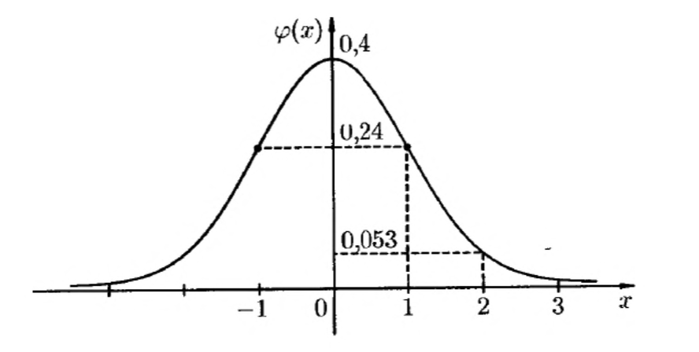
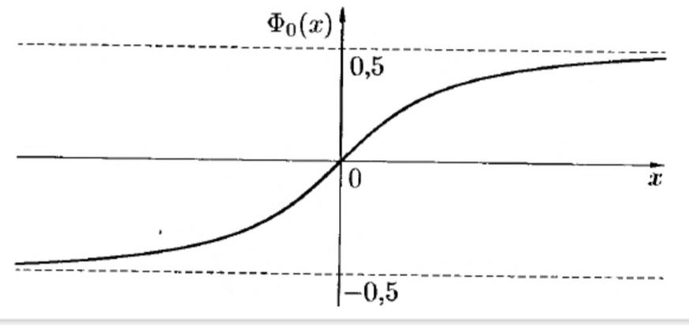
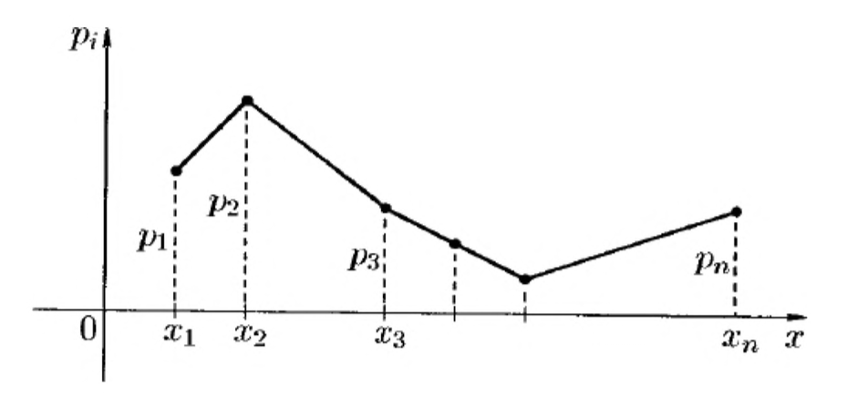
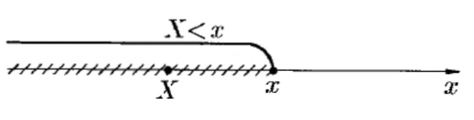

<head>
    
    
</head>

## [MainPage](../index.md)/[Probability Theory](README.md)/Lecture

## Lecture 1

### Основные понятия и определения

**Теория вероятностей** — это математическая дисциплина, в рамках которой моделируют и изучают такие события в повседневной жизни, науке и технике, которые носят случайный характер.

В теории вероятностей первичным понятием является произвольное множество. Элементы $\omega$ этого множества называют **элементарными событиями**, а само множество $\Omega$ называют **пространством элементарных событий**.

Для описания каждой реальной задачи пространство $\Omega$ выбирается наиболее подходящим образом. Пусть, например, опыт состоит в подбрасывании один раз правильной шестигранной игральной кости. Наблюдаемый результат — число очков на верхней грани. Пространство элементарных событий $\Omega$ в этом случае равно множеству $\{1, 2, 3, 4, 5, 6\}$, а элементарные события — цифры от одной до шести.

Пространство $\Omega$ может быть **дискретным** или **непрерывным**. Дискретные пространства подразделяются на конечные и счетные — эквивалентные множеству натуральных чисел.

Если пространство $\Omega$ дискретно, то **случайным событием** может быть любое подмножество пространства элементарных событий. События обозначают прописными буквами латинского алфавита: $A, B, C, ..., Z$ . Говорят, что событие A произошло (наступило, реализовалось), если результатом опыта явился элементарный исход, принадлежащий $A$.

### Основные понятия и определения

Событие, совпадающее с пустым множеством $\varnothing$ , называется невозможным событием, а событие, совпадающее со всем множеством $\Omega$, — достоверным событием. Невозможное событие не происходит ни в одном опыте, а достоверное — осуществляется всегда.

Если пространство $\Omega$ непрерывно, то событиями являются не любые его подмножества, а только те, которые принадлежат $\sigma$ - алгебре событий, т. е. семейству подмножеств, замкнутому относительно основных операций над множествами. Для того, чтобы задать $\sigma$ - алгебру событий, надо предварительно определить основные операции и отношения между событиями. Поскольку любое событие отождествляется с некоторым множеством, то над событиями можно совершать те же операции, что и над множествами.

Множества, состоящие из одинаковых элементов, называют равными.

Если каждый элемент множества $A$ является также элементом множества $B$ , то пишут $A \subset B$ и говорят, что $A$ есть подмножество $B$ или $A$ включено в $B$ или $A$ внутри $B$ .

### Основные понятия и определения

С помощью логических символов определение включения одного множества в другое записывается следующим образом:

$$A \subset B \Leftrightarrow \forall x(x \in A \rightarrow x \in B) \Leftrightarrow (x \in A \Rightarrow x \in B).$$

Если $A$ и $B$ — события и $A \subset B$ , то говорят, что **из события** $A$ **следует событие** $B$ . Иначе говоря, событие B происходит всякий раз, как происходит событие $A$ . В примере с игральной костью из события «число выпавших очков будет кратно 5 » следует событие «число выпавших очков будет нечетно», так как $\{5\} \subset \{1, 3, 5\}$.

**Суммой двух событий** $A$ и $B$ называется событие $A + B$, являющееся объедине- нием $A \cup B$. Событие $A + B$ состоит в том, что произошло по крайней мере одно из событий A или B.

**Произведением событий** $A$ и $B$ называется событие AB, равное пересечению $A \cap B$. Событие $AB$ происходит тогда и только тогда, когда происходит и $A$ и $B$.

Если множества не имеют общих элементов, то их называют непересекающимися, а соответствующие события –– несовместными. Для двух множеств $A$ и $B$ в этом случае $AB = \varnothing$ . Например, события «выпадет чётное число очков» и «выпадет нечётное число очков» несовместны, так как множества $A = \{2, 4, 6\}$ и $B = \{1, 3, 5\}$ не пересекаются. 

### Основные понятия и определения

События $A_1, A_2,... , A_n$ образуют **полную группу**, если они попарно несовместны, а в сумме дают достоверное событие. Например, указанные выше события $A = \{2, 4, 6\}$ и $B = \{1, 3, 5\}$ образуют полную группу.

Разностью двух множеств $A$ и $B$ называют множество $A \setminus B$ , состоящее из тех элементов, которые входят в $A$ , но не входят в $B$ :

$$A \setminus B = \{x \in \Omega |x \in A \cap x ƒ\in B\}$$

Разности множеств соответствует **разность событий**. Это новое событие, состоящее в том, что A происходит, а B не происходит. Например, если $A = \{1, 2, 3, 4\}$ — множество очков меньших пяти, $B = \{2, 4, 6\}$ — множество чётных очков, то $A \ B = \{1, 3\}$. Если рассматривается разность между пространством элементарных событий и некоторым множеством $A$ , то разность $\Omega \setminus A$ называется **дополнением множества** $A$ и обозначается $\overline{A}$ . Событие $\overline{A}$ называют событием **противоположным** $A$ . Это событие,состоящее в том, что $A$ не происходит. Так, событием противоположным событию $A = \{1, 2, 3, 4\}$ будет событие выпадение числа очков больших или равных пяти .

### Строгие определения

**Определение $\sigma$ -алгебры.** Семейство подмножеств $S$ пространства $\Omega $ называют $\sigma$ -алгеброй, если выполняются следующие условия:
-  пустое множество $\varnothing$ и само пространство $\Omega $ входят в $S$ ;
-  данное семейство замкнуто относительно теоретико- множественных операций, включая счетные объединения и пересечения множеств из $S$ .

**Определение события.**

Событием называют некоторое подмножество пространства элемен- тарных событий $\Omega $ , принадлежащее $\sigma$ - алгебре пространства $\Omega $ .

### Свойства операций над событиями

Операции над событиями обладают следующими свойствами:
- $A+B = B+A\ A\cdot B = B\cdot A$ (переместительное)
- $(A+B)\cdot C = A\cdot C + B\cdot C, A\cdot B + C=(A+C)\cdot(B+C)$ (распределительное)
- $(A+B)+C=A+(B+C), (A\cdot B)\cdot C=A\cdot(B\cdot C)$ (сочетательное)
- $A+A=A, A\cdot A = A$
- $A+\Omega = \Omega, A\cdot \Omega=A$
- $A+\overline{A}=\Omega, A\cdot\overline{A}=\varnothing$
- $\overline{\varnothing}=\Omega,\overline{\Omega}=\varnothing,\overline{\overline{A}}=A$
- $A-B=A\cdot\overline{B}$
- $\overline{A+B}=\overline{A}\cdot\overline{B}, \overline{A\cdot B}=\overline{A}+\overline{B}$ (закон Де Моргана)

### Вероятность. Аксиомы теории вероятностей.

Вероятностью называется числовая функция $P : F \rightarrow R$, заданная на $\sigma$-алгебре событий $F$ , которая должна удовлетворять трем аксиомам:
1) $P(A) \ge 0$ для любого $A \in F$ (неотрицательность $P$); 
2) $P(\Omega ) = 1$ (нормированность $P$);
3) $P(A + B) = P(A) + P(B)$ для любых $A, B \in F , AB = \varnothing$ (аддитивность $P$): для несовместных событий вероятность суммы событий равна сумме их вероятностей.

Тройку $\{\Omega , S, P \}$, где $S$ есть $\sigma$ -алгебра подмножеств пространства элементарных событий $\Omega $ , $P$ — числовая функция, удовлетворяющая трем аксиомам, называют **вероятностным пространством** случайного опыта, а неотрицательную, нормированную и аддитивную вероятностную функцию $P (A), A \in S, A \subset \Omega $ — **распределением вероятностей**.

Аксиоматическая теория вероятностей в ее современном виде была создана русским математиком А. Н. Колмогоровым в 1933 году.

### Основные теоремы и следствия теории вероятностей

**Теорема (о монотонности распределения вероятностей)**.

Если из события $A$ следует событие $B$ , то справедлива формула: 

$$P (A) \le P (B)$$

**Доказательство**.
Так как $A \subset B$ , то событие B представимо в виде

$$B = B\Omega  = B(A +\overline{A}) = BA + B\overline{A}= A + B\overline{A}$$

Отсюда, используя аксиому сложения, получим $P (B) = P (A) + P (B\overline{A})$ .
Так как в силу аксиомы 1 справедливо неравенство $P (B\overline{A}) \ge 0$ , то из предшествующего равенства следует доказательство теоремы.

### Основные теоремы и следствия теории вероятностей

**Теорема (о вероятности противоположного события)**.

Вероятность противоположного события вычисляется по формуле: 

$$P (\overline{A}) = 1 − P (A)$$

**Доказательство**. Из равенства $A + A ^- = \Omega $ и аксиомы сложения следует $P (A) + P (A^-) = P (\Omega )$ . В силу аксиомы нормированности $P (\Omega ) = 1$ , так что из предшествующего равенства получаем доказываемую формулу.

Отсюда, учитывая, что невозможное и достоверное события взаимно противоположны, т. е. справедливо равенство $\varnothing + \Omega  = \Omega $ , выводится утвер- ждение $P (\varnothing) = 0$: «**вероятность невозможного события равна нулю**».

Для любого события $A$ истинны соотношения $\varnothing \subset A \subset \Omega $. Отсюда,
учитывая монотонность распределения вероятностей, следуют неравенства $0 \le P (A) \le 1$ , утверждающие, что **вероятность любого события всегда лежит между нулем и единицей.**

### Основные теоремы и следствия теории вероятностей

**Теорема (о вероятности суммы совместных событий)**.

Для любых двух событий верна формула сложения вероятностей:

$$P (A \cup B) = P (A) + P (B) − P (AB)$$

**Доказательство**. Представим событие $A \cup B$ в виде $A \cup B = A + B\overline{A}$, а
событие $B$ в виде $B = B\overline{A}+BA$ . События в правых частях данных равенств несовместны, поэтому по аксиоме сложения получим: 

$$P(A\cup B)=P(A)+P(B\overline{A}), P(B)=P(B\overline{A})+P(BA)$$

Отсюда следует доказываемая формула сложения вероятностей.
Из формулы сложения вероятностей по индукции выводится общая формула вероятности суммы любого конечного числа событий. В частности, формула вычисления вероятности суммы трех событий имеет вид

$$P (A \cup B \cup C) = P (A) + P (B) + P (C) − P (AB) − P (AC) − P (BC) + P (ABC)$$

### Классическая схема вычисления вероятностей

Пусть пространство элементарных событий $\Omega$  конечно, состоит из $n$ равновероятных исходов, вероятность каждого исхода равна $1/n$ и, следовательно, сумма вероятностей всех исходов равна единице. Определим вероятность каждого события $A \subset \Omega $ как сумму вероятностей тех исходов, которые входят в это подмножество. Все аксиомы теории вероятностей выполняются при такой схеме задания вероятностей событий, и, соответственно, выполняются все выводы, которые следуют из аксиом. Данную конечную схему вычисления вероятностей называют классической, а вероятность любого события $A \subset \Omega $ находят по формуле классической вероятности:

$$P(A)=\frac{N(A)}{N(\Omega)}$$

где буквой $N$ обозначено число элементов в множестве.

Таким образом, вероятность любого случайного события в классической схеме равна отношению числа исходов, благоприятствующих появлению этого события, к общему числу элементарных исходов.

При решении многих задач с использованием классической схемы часто оказываются полезными различные комбинаторные формулы.

### Декартово произведение множеств и правило умножения

Пусть заданы два множества $A$ и $B$ с произвольным числом элементов любой природы в каждом множестве. Образуем новое множество по правилу: $D = \{(a, b)|a \in A, b \in B\}$. Это новое множество называется **прямым или декартовым произведением множеств** $A$ и $B$ и обозначается $D = A \times B$ . Элементы прямого произведения представляют собой упорядоченные пары, причём две упорядоченные пары равны только в том случае, когда у них равны первые элементы и равны вторые элементы.

**Пример**. Имея множества $A = \{1; 2\}$ и $B = \{\alpha; \beta\}$ , можно образовать декартовы произведения следующего вида:

$$D_1=A\times B=\{(1,\alpha);(1,\beta); (2,\alpha);(2,\beta)\}$$

$$D_1=A\times B=\{(\alpha,1);(\alpha,2); (\beta,1);(\beta,2)\}$$

Как видно из примера, декартово произведение не обладает свойством коммутативности. Свойство коммутативности выполняется только для равных между собой множеств.

### Декартово произведение множеств и правило умножения

Если дана система множеств $A_1, A_2,... , A_n$ , то элементами декартова произведения являются упорядоченные наборы ($a_1, a_2,... , a_n$) , т. е.:

$$A_1 \times A_2 \times ··· \times A_n = {(a_1, a_2, ... , a_n)|a_1 \in A_1, a_2 \in A_2, ..., a_n \in A_n}$$

В том случае, когда сомножители декартова произведения являются конечными множествами, можно непосредственно подсчитать, что число упорядоченных наборов ($a_1, a_2, ..., a_n$) в декартовом произведении равно произведению чисел элементов в каждом из множеств, т. е. справедлива формула:

$$N (A_1 \times A_2 \times ··· \times A_n) = N (A_1) · N (A_2)\quad N(A_n)$$

Данная формула является основной в комбинаторном анализе и обычно называется **принципом или правилом умножения**.

В частности, в рассмотренном ранее примере исходных множеств всего два и каждое содержит по два элемента, так что в декартовом произведении содержится четыре элемента.

### Правило умножения и правило сложения

**Правило умножения**. Если из некоторого конечного множества первый элемент $a_1$ можно выбрать $n_1$ способами, а второй элемент $a_2$ можно выбрать $n_2$ способами, то оба элемента $(a_1, a_2)$ в указанном порядке можно выбрать $n_1 · n_2$ способами.

**Правило сложения**. Если из некоторого конечного множества первый элемент $a_1$ можно выбрать $n_1$ способами, а второй элемент $a_2$ можно выбрать $n_2$ способами, то хотя бы один из этих элементов ($a_1$ или $a_2$) можно выбрать $n_1 + n_2$ способами.

Правила умножения и сложения справедливы для любого конечного числа (два и более) выбираемых элементов.

### Размещения и перестановки

Пусть имеется некоторое множество из $n$ элементов. Каждое его упорядоченное подмножество, состоящее из $k$ элементов, называется **размещением из** $n$ **элементов по** $k$ . Согласно определению, одно размещение отличается от другого либо составом элементов, либо их порядком.

Число размещений находится по правилу умножения в виде

$$A_n^k=n\cdot(n-1)\cdot(n-2)\cdot...\cdot(n-k+1)$$

или

$$A_n^k=\frac{n!}{(n-k)!}$$

В частном случае $k = n$ размещения называют **перестановками**. Одна перестановка отличается от другой только порядком расположения элементов, а число всевозможных перестановок в конечном множестве из $n$ элементов вычисляется по следующей формуле:

$$P_n=A_n^n=n!$$

### Размещения с повторениями

Пусть некоторый опыт состоит в случайном выборе $k$ элементов из множества, содержащего n элементов. Выбор организован таким образом, что каждый выбранный элемент возвращается обратно, так что при следующем выборе может быть взят как новый элемент, так и прежний. В дальнейшем отобранные элементы упорядочиваются либо в порядке поступления, либо по указанному в решаемой задаче правилу. Полученное таким образом соединение называют **размещением с повторениями**. Одно размещение с повторениями может отличаться от другого элементами, их порядком и количеством повторений элементов. Число всех размещений из $n$ элементов по $k$ с повторениями обозначается $\overline{A_n^k}$ и находится по следующей формуле:

$$\overline{A_n^k}=n^k$$

При выводе данной формулы использовался комбинаторный принцип умножения $k$ множеств, каждое из которых содержит $n$ элементов.

### Сочетания

Любое подмножество из $k$ элементов некоторого множества из $n$ элементов называют **сочетанием из** $n$ **по** $k$ . Одно сочетание отличается от другого хотя бы одним элементом. Число сочетаний находят по формулам:

$$C_n^k=\frac{A_n^k}{k!}=\frac{n(n-1)(n-2)\cdots(n-k+1)}{k!}=\frac{n!}{k!(n-k)!}$$

Действительно, любое подмножество, содержащее $k$ элементов множества из $n$ элементов, может быть упорядочено $k!$ способами. Таким образом, общее число размещений $A_n^k$  больше общего числа соответствующих сочетаний $C_n^k$ в $k!$ раз, т. е.

$$A_n^k=k!\cdot C_n^k$$

Разделив формулы для числа размещений на $k!$, получим формулу вычисления количества сочетаний.

Для чисел $C_n^k$ , называемых также **биномиальными коэффициентами**, справедливы следующие тождества:

$C_n^k=C_n^{n-k}$ - (свойство симметрии),
$C_{n+1}=C_n^k+C_n^{k-1}$ - (рекуррентное соотношение),
$C_n^0+C_n^1+C_n^2+\cdots+C_n^n=2^n$ - (следствие биномиальной формулы Ньютона).

### Сочетания с повторениями

В данной схеме случайный выбор $k$ элементов из множества, содержащего $n$ элементов, организован таким образом, что каждый выбранный элемент возвращается обратно, так что при каждом следующем выборе может быть взят как новый элемент, так и любой ранее выбранный. Полученное таким образом соединение называют **сочетанием с повторениями**. Одно сочетание с повторениями отличается от другого хотя бы одним элементом или числом повторений элемента. Число всех сочетаний с повторениями из $n$ элементов по $k$ обозначается $\overline{C_n^k}$ и находится по следующей формуле:

$$\overline{C_n^k}=C_{c+k-1}^k$$

Действительно, в соответствии со схемой с возвращением и упорядочиванием, используя правило умножения, получим, что число упорядоченных соединений длиной $k$ равно $n(n + 1)(n + 2) \cdots (n + k − 1)$ . Разделив данное число на k! и домножив числитель и знаменатель полученной дроби на $(n − 1)!$ , найдем число сочетаний с повторениями в указанном выше виде

$$\overline{C_n^k}=\frac{(n-1)!\cdot n(n+1)(n+2)\cdots(n+k-1)}{k!\cdot(n-1)!}=\frac{(n+k-1)!}{k!\cdot(n-1)!=C_{n+k-1}^k}$$

### Перестановки с повторениями

В схеме упорядоченных разбиений множество, содержащее n элементов, разбивается на k упорядоченных подмножеств так, что первое подмножество содержит $n_1$ элементов первого типа, второе — $n_2$ элементов второго типа и т. д., а последнее — $n_k$ элементов $k$ -того типа, причем $n_1 + n_2 + \cdots + n_k = n$. Каждое такое разбиение образует соединение из $n$ элементов, которое называют **перестановкой с повторениями**. Число всех перестановок с повторениями называется **полиноминальным коэффициентом**, обозначается $P_n(n_1, n_2, \cdots , n_k)$ и вычисляется по следующей формуле:

$$P_n(n_1, n_2, \cdots , n_k)=\frac{n!}{n_1!\cdot n_2!\cdot...\cdot n_k!}$$

Действительно, в соответствии со схемой разбиения множества на упорядоченную конечную систему подмножеств и, используя правило умножения, получим, что число таких соединений длиной $n$ находится с помощью следующих преобразований:

$$P_n(n_1, n_2, \cdots, n_k)=C_n^{n_1}\cdot C_{n-n_1}^{n_2}\cdot C_{n-n_1-n_2}^{n_3}\cdot...\cdot C_{n_k}^{n_k}\\
=\frac{n!}{n_1!(n-n_1)!}\cdot\frac{(n-1)!}{n_2!(n-n_1-n_2)!}\cdot...\cdot\frac{n_k!}{0!\cdot n_k!}=\frac{n!}{n_1!\cdot n_2\cdot...\cdot n_k!}$$

### Геометрическая схема вычисления вероятности

Формула классической вероятности следующим образом обобщается на случай непрерывных пространств элементарных исходов. Рассмотрим в качестве $\sigma$ -алгебры $S$ систему измеримых подмножеств пространства $\Omega$  . Пусть условия опыта таковы, что вероятность попадания в произвольное измеримое подмножество пропорциональна мере этого подмножества и не зависит от его местоположения в пространстве $\Omega$  . Данный опыт можно интерпретировать как бросание случайной точки на пространство $\Omega$. При этих условиях вероятность появления любого события $A$ из $S$ вычисляется по так называемой **формуле геометрической вероятности**:

$$P(A)=\frac{\mu(A)}{\mu(\Omega)}$$

где буквой $\mu$ обозначена мера множества (длина, площадь или объем ).

Геометрическая вероятность события $A$ из $S$ удовлетворяет всем аксиомам теории вероятностей, что позволяет применять к ней утверждения и теоремы, доказанные в рамках аксиоматики Колмогорова.

### Условная вероятность

Пусть $A$ и $B$ - два события, рассматриваемые в данном оппыте. Наступление одоного события (скажем, $A$) может влиять на вощможность наступления другого ($B$). Для характеристики зависимости одних событий от других вводится понятие условной вероятность.

**Условной вероятностью события** $B$ при условии реализации события $A$ называется отношение вероятности произведения событий $A$ и $B$ к вероятности события $A$, т.е.

$$P_A(B)=\frac{P(AB)}{P(A)}, P(A)\ne0$$

Другие обозначение: 

$$P(B\lvert A)=\frac{P(A\cdot B)}{P(A)}$$

Вероятность $P(B)$, в отличие от условной, называется безусловной вероятность.

### Вероятность произведения двух событий

Вероятность произведения двух событий равна произведению безусловной вероятности одного из них на условную вероятность другого, при условии, что первое событие произошло:

$$P(AB)=P(A)\cdot P_A(B)=P(B)\cdot P_B(A);P(A)>0, P(B)>0$$

**Доказательство**. Данные формулы непосредственно следуют из определения условной вероятности.

Применяя правило умножения индуктивно получают **формулу умножения вероятностей для системы событий** в следующем виде:

$$P(A_1A_2\cdots A_n)=P(A_1)\cdot P_{A_1}(A_2)\cdot P_{A_1A_2}(A_3)\cdots P_{A_1A_2\cdots A_n-1}(A_n)$$

### Независимость событий

События $A$ и $B$ называются независимыми, если вероятность произведения данных событий равна произведению их вероятностей:

$$P(AB)=A(A)\cdot P(B)$$

Для двух независимых событий условная вероятность каждого из событий равна безусловной вероятности, что вытекает из следующих соотношений:

$$P_A(B)=\frac{P(AB)}{P(A)}=\frac{P(A)\cdot P(B)}{P(A)}=P(B),P(A)\ne0$$

$$P_B(A)=\frac{P(AB)}{P(B)}=\frac{P(A)\cdot P(B)}{P(B)}=P(A),P(B)\ne0$$

Таким образом, для независимых событий появление одного из событий никак не влияет на вероятность появления другого.
Иногда именно равенство $PA(B) = P (B)$ берут за исходное определение независимости события $B$ от события $A$ . Однако, мы будем использовать более симметричное определение независимости, рассмотренное А.Н. Колмогоровым.

**Пример**. Проводится опыт, состоящий в двукратном подбрасывании симметричной монеты. В этом случае пространство элементарных событий состоит из четырех исходов: $\Omega  = \{ ГГ, ГР, РГ, РР \}$. Рассмотрим событие $A = \{ ГГ, ГР \}$ «выпадение «герба» при первом подбрасывании монеты» и событие $B = { ГГ, РГ }$ — «выпадение «герба» при втором подбрасывании». Тогда произведение событий $AB = \{ ГГ \}$ — выпадение герба при первом и втором подбрасывании монеты. По классической схеме вычисления вероятностей $P(A)=P(B)=1/2, P(AB)=1/4$. События $A$ и $B$ независимы, поскольку выполняется условие $P (AB) = P (A) \cdot P (B)$.

**Для двух независимых событий формула вероятности произведения событий имеет вид**:

$$P(AB)=P(A)\cdot P(B)$$

### Независимость системы событий

Система из n событий называется независимой, если для любой ее подсистемы из $k \le n$ событий справедливы следующие формулы :

$$P(A_1A_2\cdots A_k)=P(A_1)\cdot P(A_2)\cdot ...\cdot P(A_k)$$

Из независимости системы событий непосредственно из опре- деления следует попарная независимость событий. Обратное утверждение неверно

Для системы из n независимых событий формула вероятности произведения событий выводится по индукции и имеет вид:

$$P(A_1A_2\cdots A_n)=P(A_1)\cdot P(A_2)\cdot ...\cdot P(A_n)$$

### Формула полной вероятности

Одним из следствий совместного применения теорем сложения и умножения вероятностей являются формулы полной вероятности и Байеса. Напомним, что события $A_1, A_2, ..., A_n$ образуют полную группу, если $A_i\cdot A_j=\varnothing, i\ne j, \sum_{i=1}^nA_i=\Omega$. Систему таких событий называют также разбиением.

**Теорема**. Пусть события $H_1, H_2, ..., H_n$. образуют полную группу. Тогда для любого, наблюдаемого в опыте, события А имеет место формула полной вероятности.

$$P(A)=\sum_{i=1}^nP(H_i)\cdot P(A\lvert H_i)$$

### Формула полной вероятности

**Доказательство**:
Так как $H_1+H_2+... +H_n = \Omega$, то в силу свойств операций над событиями 

$$A = A \cdot \Omega = A \cdot (H_1 + H_2 + ... + H_n) =A \cdot H_1 + A \cdot H_2 + ... + A\cdot H_n$$

Из того, что $H_i\cdot H_j=\varnothing$, следует, что $(A\cdot H_i)\cdot(A\cdot H_j)=\varnothing, i\ne j$ т. е. события $A\cdot H_i$ и $A\cdot H_j$ также несовместны. Тогда по тео]>еме сложения вероятностей $P(A) = P(A\cdot H_1) + P(A \cdot Н_2) + ... + P(A\cdot H_n)$ т.е. $P(A) = \sum_{i=1}^n P(A\cdot H_i)$. По теореме умножения вероятностей $P(A \cdot H_i)=P(H_i)\cdot P(A\lvert H_i)$, откуда и следует формула полной вероятности.

В формуле полной вероятности события $H_1, H_2, ..., H_n$ обычно называют гипотезами} они исчерпывают все возможные предположения (гипотезы) относительно исходов как бы первого этапа опыта, событие $A$ — один из возможных исходов второго этапа.

### Формула Байеса

Следствием формулы полной вероятности является формула Байеса или теорема гипотез. Она позволяет переоценить вероятности гипотез $H_i$, принятых до опыта и называемых априорными («а priori», доопытные, лат.) по результатам уже проведенного опыта, т. е. найти условные вероятности $P(H_i\lvert A)$, которые называют апостериорными («а posteriori», послеопытные).

**Теорема**. Пусть события $H_1, H_2, ..., H_n$ образуют полную группу событий. Тогда условная вероятность события $H_k(k = 1,n)$ при условии, что событие $A$ произошло, задается формулой

$$P(H_k\lvert A)=\frac{P(H_k)\cdot P(A\lvert H_k)}{P(A)}$$

где $P(A) = P(H_1)\cdot P(A\lvert H_1)+ ... + P(H_n)\cdot P(A\lvert H_n)$ — формула полной вероятности

**Доказательство**:
Применив формулы условной вероятности и умножения вероятностей, имеем

$$P(H_k\lvert A)=\frac{P(H_k\cdot A)}{P(A)}=\frac{P(H_k)\cdot P(A\lvert H_k)}{P(A)}$$

где $P(A)$ — формула полной вероятности

## Lecture 2 СЛУЧАЙНЫЕ ВЕЛИЧИНЫ

### Независимые испытания. Схема Бернулли.

С понятием «независимых событий» связано понятие «независи­
мых испытаний (опытов)».

Несколько опытов называются независимыми, если их исходы
представляют собой независимые события (независимые в совокупно­
сти).

Последовательность $n$ независимых испытаний, в каждом из кото­рых может произойти некоторое событие $A$ (его называют **успехом**) с вероятностью $P(A) = p$ или противоположное ему событие $A$ (его на­ зывают неудачей) с вероятностью $P(\overline{A}) = q = 1 - p)$, называется **схемой Бернулли**.

Например, при стрельбе по мишени: событие $A$ попадание
(успех), событие $\overline{A}$ — промах (неудача); при обследовании п изделий на предмет годности: событие $A$ — деталь годная (успех), событие $A$ деталь бракованная (неудача) и т. д.

В каждом таком опыте ПЭС состоит только из двух элементар­ ных событий, т. е. $\Omega = {\omega_0,\omega_1}$, где $\omega_0$ — неудача, $\omega_1$ успех, при этом $A = {\omega_1}, \overline{A} — {\omega_0}$. Вероятности этих событий обозначают че­ рез р и q соответственно ($p + q = 1$). Множество элементарных исхо­ дов для п опытов состоит из $2^n$ элементов. Например, прп $n = 3$, т. е. опыт повторяется 3 раза, $\Omega=\big\{\frac{\overline{A},\overline{A},\overline{A}}{\omega_0};\frac{A,A,\overline{A}}{\omega_1};\frac{\overline{A},A,\overline{A}}{\omega_2};\frac{\overline{A},A,A}{\omega_3};\frac{A,\overline{A},\overline{A}}{\omega_4};\frac{A,\overline{A},A}{\omega_5};\frac{\overline{A},\overline{A},A}{\omega_6};\frac{A,A,A}{\omega_7}$. Вероятность каждого элемен­тарного события определяется однозначно. По теореме умножения ве­роятность события, скажем $\omega_6=(\overline{A},\overline{A},A)$, равна $q\cdot q\cdot p=pq^2$, события $\omega_7 - p\cdot p\cdot p=p^3q^0$ и т. д.

Часто успеху сопоставляют число 1, неудаче — число 0. Элемен­ тарным событием для п опытов будет последовательность из п нулей и единиц. Тройка чисел $(0,0,0)$ означает, что во всех трех опытах со­бытие А не наступило; тройка чисел $(0,1,0)$ означает, что событие $A$ наступило во 2-м опыте, а в 1-м и 3-м — не наступило.

### Формула Бернулли.

Простейшая задача, относящаяся к схеме Бернулли, состоит в
определении вероятности того, что в п независимых испытаниях собы­тие $A$ наступит $m$ раз ($0\le m\le n$). Обозначается искомая вероятность так: $P_n(m)$ или $P_{n,m}$ или $P(\mu_n=m)$, где $\mu_n$ — число появления события $A$ в серии из $n$ опытов.

Например, при бросании игральной кости 3 раза $P_3(2)$ означает вероятность того, что в 3-х опытах событие $А$ — выпадение цифры
4 произойдет 2 раза. Очевидно,

$$P_3(2)=p^2q+p^2q+p^2q=\Big[\{(A,A,\overline{A});(A,\overline{A},A);(\overline{A},A,A)\}\Big]=3p^2q=3\cdot(\frac{1}{6})^2\cdot\frac{5}{6}=\frac{5}{72}=0.069$$

**Теорема** Если производится $n$ независимых испытаний, в каждом из которых вероятность появления события $A$ равна $p$, а вероятность его непоявления равна $q = 1 — p$, то вероятность того, что событие $A$ произойдет т раз определяется **формулой Бернулли**

$$P_n(m)=C_n^m\cdot p^m\cdot q^{n-m}, m=0,1,2,\cdots,n$$

**Доказательство:**
Вероятность одного сложного события, состоящего в том, что со­бытие $A$ в $n$ независимых опытах появится т раз в первых т опы­тах и не появится $(n-m)$ раз в остальных опытах (это событие $\underbrace{A\cdot A\cdot A\cdot A\cdot ... \cdot A}_{m\ раз}\cdot\underbrace{\overline{A}\cdot \overline{A}\cdot \overline{A}\cdot \overline{A}\cdot ... \cdot \overline{A}}_{(n-m)\ раз}$ по теореме умножения вероятностей равна $p^mq^{n-m}$. Вероятность появления события А снова т раз, но в другом порядке (например, $\overline{A}\cdot\underbrace{A\cdot A\cdot ...\cdot A}_{m\ раз}\overline{A}\cdot\overline{A}\cdot ...\cdot\overline{A}$ или $A\overline{A}A\overline{A}\cdot...\cdot A\overline{A}$ и т. д.) будет той же самой, т. е. $p^mq^{n-m}$ 

Число таких сложных событий — в $n$ опытах т раз встречается со­ бытие А в различном порядке — равно числу сочетаний из п по т. е. $C_n^m$. Так как все эти сложные события несовместны, то по теореме сло­ жения вероятностей искомая вероятностъ равна сумме вероятностей всех возможных сложных событий, т. е.

$$P_n(m)=\underbrace{p^mq^{n-m}+\cdots+p^mq^{n-m}}_{C_n^m слагаеиых}=C_n^mp^mq^{n-m}\quad m=0,1,\cdots,n$$

Можно заметить, что вероятности $P_n(m), m=0,1,\cdots, n$ являются коэффициентами при хт в разложении $(q+px)^n$ по формуле бинома Ньютона:

$$(q+px)^n=q^n+C^1_nq^{n-1}px+C_n^2q^{n-2}p^2x^2+\cdots+C_n^mq^{n-m}p^mx^m+\cdots+p^nx^n$$

Поэтому совокупность вероятностей $P_n(m)$ называют **биномиальным законом распределения вероятностен** (см. п. 2.7), а функцию $\varphi(x)=(q+px)^n$ — **производящей функцией** для последовательности неза­висимых опытов.

### Полиномиальное распределение

Если в каждом из независимых испытаний вероятности наступле­ ния события $A$ **разные**, то вероятность того, что событие $A$ наступит $m$ раз в $n$ опытах, равна коэффициенту при $m$-й степени многочлена $\varphi_n(z)=(q_1+p_1z)(q_2+p^2z)\cdot...\cdot(q_n+p^nz)$, где $\varphi_n(z)$ — производящая функция.

Если в серии из $n$ независимых опытов, в каждом из которых может произойти одно и только одно из $k$ событий $A_1,A-2,\cdots A_k$ соответ­ствующими вероятностями $p_1,p_2,\cdots p_k$ то вероятность того, что в этих опытах событие $A_1$ появится $M_1$ раз, событие $A_2 - m_2$ раз, $...$ событие $A_k - m_k$ раз, равна

$$P_n(m_1,m_2,\cdots m_k)=\frac{n!}{m_1!m_2!\cdots m_k!}p_1^{m_1}p_2^P{m_2}\cdots p_k^{m_k}$$

где $m_1+m_2+\cdots+m_k=n$. Вероятности (1.33) называются полиноми­ альным распределением.

### Теорема Пуассона

**Теорема** Если число испытаний неограничено увеличивается
$(n\to \infty)$ и вертятность $p$ наступления события $A$ в каждом испытании неограничено уменьшается $(p \to 0)$, но так, что их произведение $np$ является постоянной величиной ($np = a = const$), то вероятность $P_n(m)$ удовлетворяет предельному равенству

$$\lim_{n\to\infty}P_n(m)=\frac{a^m e^{-a}}{m!}$$

Это выражение называется ассимптотической формулой Пуассона.

**Доказательство**:

Преобразуем формулу Бернулли с учетом того, что $p=\frac{a}{n}$:

$$\begin{split}
    P_n(m)=\frac{n!}{m!(n-m)!}\cdot(\frac{a}{n})^m\cdot(1-\frac{a}{n}^{n-m})=\\
    \frac{n(n-1)(n-2)\cdots(n-(m-1))}{m!}\cdot\frac{a^m}{n^m}\cdot(1-\frac{a}{n})^n\cdot(1-\frac{a}{n})^{-m}\\
    =\frac{a^m}{m!}\cdot\frac{n}{n}\cdot\frac{n-1}{n}\cdot\frac{n-2}{n}\cdot...\cdot\frac{n-(m-1)}{n}\cdot(1-\frac{a}{n})^n\cdot(1-\frac{a}{n})^{-m}\\
    =\frac{a^m}{m!}\cdot1\cdot(1-\frac{1}{n})\cdot(1-\frac{2}{n})\cdot...\cdot(1-\frac{m-1}{n})\cdot(1-\frac{a}{n})^n\cdot(1-\frac{a}{n})^{-m}\\
\end{split}
$$

Переходя к пределу при $n\to \infty$, получим $\lim_{n\to\infty}P_n(m)=\frac{a^me^{-a}}{m!}$ ($\lim_{n\to\infty}(1-\frac{a}{n})^n=e^{-a}$ согласно второму замечательному пределу)

Из предельного равенства теоремы Пуассона при больших $n$ и малых $p$ вытекает приближенная формула Пуассона:

$$P_n(m)\approx\frac{a^me^{-a}}{m!}, a=np, m=0,1,2\cdots$$

Формула применяется, когда вероятность успеха крайне мала, т. е. сам по себе успех является редким событием. Её обычно используют, когда $n\ge 50$ а $np \le 10$

Формула Пуассона находит применение **в теории массового обслуживания**.

### Математическая модель простейшего потока событий

Формулу Пуассона можно считать математической моделью про­стейшего потока событий.

**Потоком событий** называют последовательность событий, насту­ пающих в случайные моменты времени (например, поток посетителей в парикмахерской, поток вызовов на телефонной станции, поток отказов элементов, поток обслуженных абонентов и т.п.).

Поток событий, обладающий свойствами стационарности, ординар­ ности и отсутствия последствия называется **простейшим (пуассоновским) потоком**.

Свойство **стационарности** означает, что вероятность появления к событий на участке времени длины $\tau$ зависит только от его длины (т. е. не зависит от начала его отсчета). Следовательно, **среднее число событий, появляющихся в единицу времени,** так называемая **интен­ сивность** $\lambda$ потока, есть величина постоянная: $\lambda(t)=\lambda$.

Свойство ординарности означает, что событие появляется не груп­ пами, а поодиночке. Другими словами, вероятность появления более одного события на малый участок времени $\Delta t$ пренебрежительно мала по сравнению с вероятностью появления только одного события (на­пример, поток катеров, подходящих к причалу, ординарен).

Свойство **отсутствия последствия** означает, что вероятность по­ явления $k$ событий на любом участке времени длины $\tau$ не зависит от того, сколько событий появилось на любом другом не пересекающимся с ним участком (говорят: «будущее» потока не зависит от «прошлого», например, поток людей, входящих в супермаркет).

Можно доказать, что вероятность появления $m$ событий простей­
шего потока за время продолжительностью $t$ определяется формулой Пуассона

$$P_t(m)=p_m=\frac{(\lambda t)^m\cdot e^{-\lambda t}}{m!}$$

В тех случаях, когда число испытаний $n$ велико, а вероятность $p$ не близка к нулю ($p\ne 0 p\ne 1$), для вычисления биномиальных вероятностей используют теоремы Муавра-Лапласа. Приведем только их формулировки в силу сложности доказательства.

### Локальная теорема Муавра-Лапласа

**Теорема Локальная теорема Муавра-Лапласа** Если вероят- ность р наступления события $A$ в каждом испытании постоянна и отлична от нуля и единицы, а число независимых испытаний достаточно велико, то вероятность $P_n(m)$ может быть вычислена по приближенной формуле

$$P_n(m)\approx\frac{1}{\sqrt{npq}}\cdot\frac{1}{\sqrt{2\pi}}e^{-\frac{x^2}{2}}$$

где $x=\frac{m-np}{\sqrt{npq}}$

Равенство тем точнее, чем больше $n$.

### Функция Гаусса

Выражение

$$\frac{1}{\sqrt{2\pi}}e^{-\frac{x^2}{2}}=\varphi(x)$$

называется **функцией Гаусса**, а ее график — **кривой вероятностей**

### Интегральная теорема Муавра-Лаплоса

В тех случаях, когда требуется вычислить вероятность того, что
в п независимых испытаниях событие $A$ появится не менее $k_1$ раз, но не более $k_2$ раз, т. е. $P_n(k_1\le m\le k_2)$ или $P_n(k_1;k_2)$, используют инте­ гральную теорему Муавра—Лапласа (является частным случаем более общей теоремы — центральной предельной теоремы).

**Теорема (Интегральная теорема Муавра-Лапласа)** Если ве­
роятность р наступления события А в каждом испытании постоянна и
отлична от нуля и единицы, то вероятность $P_n(k_1\le m\le k_2)$ может быть найдена по приближенной формуле

$$P_n(k_1\le m\le k_2)\approx\frac{1}{\sqrt{2\pi}}\int_{x_1}^{x_2}e^{-\frac{x^2}{2}}{ \rm d} x$$

где 
- $x_1=\frac{k_1-np}{\sqrt{npq}}$
- $x_2=\frac{k_2-np}{\sqrt{npq}}$

Равенство тем точнее, чем больше $n$.

### Нормированная функция Лапласа

для упрощения вычислений, вводят специальную функцию

$$\Phi_0(x)=\frac{1}{2\pi}\int_0^xe^{-\frac{t^2}{2}}{ \rm d}t$$

называемую нормированной **функцией Лапласа**.

### Функция Лапласа

Наряду с нормированной функцией Лапласа используют функцию

$$\Phi(x)=\frac{1}{\sqrt{2\pi}}\int_{-\infty}^xe^{-\frac{t^2}{2}}{ \rm d}t$$

называемую также **функцией Лапласа**. Для нее справедливо равенство $\Phi(-x)+\Phi(x)=1$; она связана с функцией $\Phi_0(x)$ формулой

$$\Phi(x)=0.5+\Phi_0(x)$$

Приближенную формулу для вычисления вероятности $P_n(k_1\le m\le k_2)$ можно записать в виде 

$$P_n(k_1\le m\le k_2) = \Phi(x_2)-\Phi(x_1)=\Phi(x_2)-\Phi(x_1)$$

Где
- $x_1=\frac{k_1-np}{\sqrt{npq}}$
- $x_2=\frac{k_2-np}{\sqrt{npq}}$

### Случайная величина

Под **случайной величиной** понимаю! величину, которая в результатк опыта принимает то или иное значение, причем неизвестно заранее, какое именно.

Примерами с. в. могут служить: 
1) $X$ число очковч появляющихся при бросании игральной кости; 
2) $Y$ — число выстрелов до первого попадания в цель; 
3) $Z$ — время безотказной работы прибора и т.п.

(рост человека, курс доллара, количество бракованных деталей в пар­тии, температура воздуха, выигрыш игрока, координата точки при слу­чайном выборе ее на $[0; 1]$, прибыль фирмы, ...).

Случайная величина, принимающая конечное или счетное множе­ ство значений, называется дискретной (сокращенно: д. с. в.).

Если же множество возможных значений с. в. несчетно, то такая величина называется непрерывной (сокращенно: н.с. в.).

### Строгое определение

Случайной величиной $X$ называется числовая функция, опреде­ ленная на пространстве элементарных событий $\Omega$, которая каждому элементарному событию w ставит в соответствие число $X(\Omega)$, т.е. 

$$X=X(\omega), \omega\in\Omega (или\ X=f(\omega))$$

**Пример**. Опыт состоит в бросании монеты 2 раза. На ПЭС $\Omega=\{\omega_1,\omega_2,\omega_3,\omega_4\}$, где $\omega_1=ГГ, \omega_2=ГР, \omega_3=РГ, \omega_4=РР$, можно рассмотреть с. в. $X$ — число появлений герба. С. в. $X$ является функ­ цией от элементарного события $\omega_i$: $X(\omega_1)=2, X(\omega_2)=1, X(\omega_3)=1,X(\omega_4)=0$; $X$ - д. с. в. со значениями $x_1=0,x_2=1,x_3=2$.

Отметим, что если множество 12 конечно или счетно, то случай­ ной величиной является любая функция, определенная на $\Omega$. В общем случае функция $X (\omega)$ должна быть такова, чтобы для любых $x\in R$ событие $A=\{\omega: X(\omega) < x\}$ принадлежало $\sigma$-алгебре множеств $S$ и, значит, для любого такого события была определена вероятность $P(A)=P(X<x)$

Закон распределения случайной величины

Для полного описания с. в. недостаточно лишь знания ее возмож­ ных значений; необходимо еще знать вероятности этих значений.

Любое правило (таблица, функция, график), позволяющее нахо­ дить вероятности произвольных событий $A\subseteq S$ ($S$ — $\sigma$-алгебра собы­тий пространства $\Omega$). в частности, указывающее вероятности отдель­ ных значений случайной величины или множества этих значений, на­зывается **законом распределения случайной величины** (или просто: **рас­пределением**). Про с. в. говорят, что «она подчиняется данному закону распределения»:

Пусть $Х$ — д.с.в., которая принимает значения $x_1,x_2,x_3,\cdots,x_n,\cdots$ (множество этих значений конечно или счетно) с некоторой вероят­ностью $p_i$ где $i = 1,2,3,\cdots,n,\cdots$ **Закон распределения** д. с. в. удобно задавать с помощью формулы $p_i = P\{X = x_i,\}, i = 1,2,3,...,n,..$ определяющей вероятность того, что в результате опыта с. в. $X$ примет значение $x_i$. Для д. с. в. $X$ закон распределения может быть задан в виде таблицы, распределения:

 Множ. |  - | - | - | - | -
---|---|---|---|---|---
$X$ | $x_1$ | $x_2$ | ... | $x_n$ | ...
$P$ | $p_1$ | $p_2$ | ... | $p_n$ | ...

где первая строка содержит все возможные значения (обычно в порядке возрастания) с. в., а вторая — их вероятности. Такую таблицу называ­ют **рядом распределения**.

Так как события $\{X = x_1\}$, $\{X = x_2\} ...$ несовместны и образуют полную группу, то сумма их вероятностей равна единице т. е. $\sum_{i}p_i=1$

### Многоугольник (полигон) распределения

Закон распределения д. с. в. можно задать **графически**, если на оси абсцисс отложить возможные значения с. в., а на оси ординат — вероят­ности этих значений. Ломаную, соединяющую последовательно точки $(x_1,p_1),(x_2,p_2),\cdots$ называют **многоугольником** (или полигоном) распределения (см. рис. 17). 

### Дискретная случайная величина

Случайная величина $X$ **дискретна**, если существует конечное или счетное множество чисел $x_1,x_2,\cdots$ таких, что $P\{X = x_i\} p_i > О (i = 1,2,...)$ и $p_i + p_2 + p_3 + ... = 1$.

Определим математические операции над дискретными с. в.

**Суммой (разностью, произведением)** д. с. в. $X$, принимающей зна­чения $x_i$ с вероятностями $p_i = P\{X = x_i\}, i = 1,2,..., n$ и д. с. в. $Y$, при­ нимающей значения $y_j$ с вероятностями $p_j = P\{Y = y_j\}, j = 1,2,...,m$, называется д. с. в. $Z = X + Y (Z = X - Y, Z = X \cdot У)$, принимающая
значения $z_{ij}=x_i+y_j (z_{ij}=x_i-y_j,z_{ij}=x_i\cdot y_j)$  с вероятностями $p_{ij}=P\{X=x_i, Y=y_j\}$ = для всех указанных значений $i$ и $j$. В случае совпадения некоторых сумм $x_i+y_j$ (разностей $x_i-y_j$, произведений $x_iy_j$) соответствующие вероятности складываются.

### Дискретная случайная величина

Произведение д. с. в. на число с называется д. с. в. с $X$, принимающая значения $cx_i$, с вероятностями $p_i=P\{x=x_i\}$.

Две д.с.в. $X$ и $Y$ называются **независимыми**, если события $\{X=x_i\}=A-i$ и $\{Y=y_j\}=B_j$ независимы для любых $i=1,2,\cdots, n; j=1,2,\cdots, m$ т.е. 

$$P\{X=x_i; Y=y_j\}=P\{X=x_i\}\cdot P\{Y=y_j\}$$

В противном случае с. в. называются зависимыми. Несколько с. в. на­ зываются взаимно независимыми, если закон распределения любой из них не зависит от того, какие возможные значения приняли остальные величины.

### Функция распределения случайной величины

Очевидно, ряд распределения с. в. может быть построен только для д. с. в.; для н. с. в. нельзя даже перечислить все ее возможные значения.

Для характеристики поведения н. с. в. целесообразно использовать вероятность события $\{X < x\}$ (а не $\{X = x\}$), где $x$ — некоторое дей­ ствительное число. С точки зрения практики нас мало интересует собы­ тие, состоящее, например, в том, что лампочка проработает ровно 900 часов, т. е. $X = 900$. Более важным является событие вида $\{X < 900\}$ (или $\{X > 900\}$). Такое событие имеет ненулевую вероятность; при из­ менении х вероятность события $\{X < x\}$ в общем случае будет менять­ся. Следовательно, вероятность $Р\{ X < x\}$ является функцией от $x$.

Универсальным способом задания закона распределения вероятно­ стей, пригодным как для дискретных, так и для непрерывных случай­ных величин, является ее функция распределения, обозначаемая $F_X(x)$ (или просто $F(x)$, без индекса, если ясно, о какой с. в. идет речь).

Функцией распределения с. в. $X$ называется функция $F(x)$, которая для любого числа х Е R равна вероятности события $\{X < x\}$.

Таким образом, по определению

$$F(x)=P\{X<x\}$$

т.е.

$$F(x)=P\{\omega: X(\omega)<x\}$$

Функцию $F(x)$ называют также **интегральной функцией распределения**. Геометрически равенство можно истолковать так: $F(x)$ есть вероятность того, что с. в. $X$ примет значение, которое изображается на числовой оси точкой, лежащей  $x$ .т, т. е. случайная точка $X$ попадет в интервал $(-\infty, x)$

### Свойства функции распределения

Функция распределения обладает следующими свойствами:

1. $F(x)$ ограничена, т. е.
   $$0\le F(x)\le 1$$
2. $F(x)$ — неубывающая функция на $R$, т.е. если $x_1 > x_2$, то
   $$F(x_2)\ge F(x_1)$$
3. $F(x)$ обращает в ноль на минус бесконечности и равна единице в плюс: бесконечности, т. е.
   $$F(-\infty)=0\qquad F(+\infty)=1$$
4. Вероятность попадания с. в. $X$ в промежуток $[а, b)$ равна прираще­ нию ее функции распределения на этом промежутке, т. е.
   $$P\{a\le X < b\}=F(b)-F(a)$$
5. $F(x)$ непрерывна слева, т. е.
   $$\lim_{x\to x_0-0}F(x)=F(x_0)$$

### Непрерывная случайная величина

С помощью функции распределения можно вычислить вероятность события $\{X \ge x\}$:

$$P\{X\ge x\}=1-F(x)$$

Можно дать **более точное определение н. с. в.**

Случайную величину $X$ называют **непрерывной**, если ее функция распределения непрерывна в любой точке и дифференцируема всюду, кроме, может быть, отдельных точек.

для н. с. в. справедливы равенства

$$P\{a\le x<b\}=P\{a<x<b\}=P\{a\le x\le b\}=P\{X\in(x,b]\}$$

### Функция распределения дискретной случайной величины

Функция распределения д. с. в. имеет вид

$$F(x)=\sum_{x_i<x}p_i$$

Здесь суммирование ведется по всем $i$, для которых $x_i<x$.

### Плотность распределения вероятностей

**Плотностью распределения вероятностей** (**плотностью распреде­ ления, плотностью вероятностей** или просто **плотностью**) непрерыв­ ной случайной величины X называется производная ее функции рас­пределения.

Обозначается плотность распределения н.с. в. $X$ через $f_X(x)$ (или $p_X(x)$) или просто $f(x)$ (или $p(x)$), если ясно о какой с. в. идет речь.

Таким образом, по определению

$$f(x)=F'(x)$$

Функцию $f(x)$ называют также **дифференциальной функцией распреде­ ления**; она является одной из форм закона распределения случайной величины, существует только для непрерывных случайных величин.

Установим вероятностный смысл плотности распределения. Из определения производной следует

$$f(x)=\lim_{\Delta x\to 0}\frac{\Delta F(x)}{\Delta x}=\lim_{\Delta x\to 0}\frac{F(x+\Delta x-F(x))}{\Delta x}$$

Но согласно формуле $P\{a\le X<b\}=F(b)-F(a)$

$$F(x+\Delta x)-F(x)=P\{x\le X<x+\Delta x\}$$

Отношение $\frac{x\le X<x+\Delta x}{\Delta x}$ представляет собой среднюю вероятность, которая приходится на единицу длины участка $[x,x+\Delta x]$, т.е. среднюю плотность распределения вероятности. Тогда

$$f(x)=\lim_{\Delta x\to 0}\frac{P\{x\le X< x+\Delta x\}}{\Delta x}$$

т. е. плотность распределения есть предел отношения вероятности по­ падания с.в.в промежуток $[x;x+\Delta  x)$ к длине $\Delta x$ этого промежутка, когда $\Delta x$ стремится к нулю.

Из равенства следует, что

$$P\{x\le X<x+\Delta x\}\approx f(x)\Delta x$$

То есть **плотность вероятности определяется как функция** $f(x)$, удо­влетворяющая условию $P\{x \le X < x + { \rm d} x\} \approx f(x) { \rm d}x$; выражение $f(x) { \rm d}x$ называется элементом вероятности.

Отметим, что плотность $f(x)$ аналогична таким понятиям, как плотность распределения масс на оси абсцисс или плотность тока в
теории электричества.

### Свойства плотности распределения

Плотность распределения обладает следующими свойствами:
1. $f(x)$ неотрицательная, т.е.
   $$f(x)\ge 0$$
2. Вероятность попадания н.с. в. в промежуток [а; Ь\ равна определенному интегралу от ее плотности в пределах от $а$ до b, т. е. ь
Р{а^Х ^b}= I f(x)dx. а
Функция распределения н. с. в. может быть выражена через ее плотность вероятности по формуле
х
J fit) di.
—оо
3.
4.
Условие нормировки: несобственный интеграл от плотности веро­ ятности н.с. в. в бесконечных пределах равен единице, т. е.