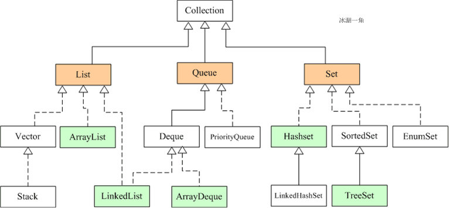
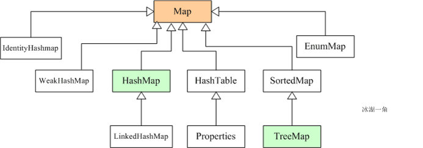

1. [Обощенные и параметризованные типы. Создание параметризованных классов.](#1-обощенные-и-параметризованные-типы-создание-параметризованных-классов)  
  泛型和参数化类型。创建参数化类。
2. [Работа с параметризованными методами. Ограничение типа сверху или снизу.](#2-работа-с-параметризованными-методами-ограничение-типа-сверху-или-снизу)  
  使用参数化方法。 类型约束高于或低于。
3. Класс Number. Классы-оболочки. Автоупаковка и автораспаковка.
4. [Коллекции. Виды коллекций. Интерфейсы Set, List, Queue и их особенности.](#4-коллекции-виды-коллекций-интерфейсы-set-list-queue-и-их-особенности)  
  集合。 集合类型。 Set、List、Queue 接口及其特性。
5. Обход элементов коллекции. Интерфейсы Iterable, Iterator и ListIterator
6. Сортировка элементов коллекций. Интерфейсы Comparable и Comparator.
7. [Интерфейсы Set и SortedSet, их реализации. Классы HashSet и TreeSet.](#7-интерфейсы-set-и-sortedset-их-реализации-классы-hashset-и-treeset)  
  Set 和 SortedSet 接口，它们的实现。 HashSet 和 TreeSet 类。
8. Интерфейс List и его реализации. Классоы ArrayList и LinkedList.
9.  Интерфейсы Map и SortedMap, их реализации. Классы HashMap и TreeMap.
10. [Интерфейсы Queue и Deque. Классы PriorityQueue и ArrayDeque.](#10-интерфейсы-queue-и-deque-классы-priorityqueue-и-arraydeque)  
  队列和双端队列接口。 PriorityQueue 和 ArrayDeque 类。
11. Классы Collections и Arrays, методы для работы с коллекциями и массивами.
12. Регулярные выражения, Классы Pattern и Matcher.
13. [Байтовые потоки ввода-вывода. Классы InputStream, OutputStream и их потомки.](#13-байтовые-потоки-ввода-вывода-классы-inputstream-outputstream-и-их-потомки)  
  字节 I/O 流。 类 InputStream、OutputStream 及其后代。
14. Символьные потоки ввода-вывода. Классы Reader, Writer и их потомки.
15. Новый пакет ввода-вывода. Буферы и каналы. Класс FileChannel.
16. [Работа с файлами в Java. Интерфейс Path. Классы File, Files, Paths.](#16-работа-с-файлами-в-java-интерфейс-path-классы-file-files-paths)  
  在 Java 中处理文件，Path 接口。 File 类，Files 类，Paths 类
17. Сериализация объектов. Интерфейс Serializable. Модификатор transient.
18. Многопоточные программы. Класс Thread и интерфейс Runnable. Состояния потока.
19. Многопоточные программы. Интерфейсы Executor, ExecutorService, Callable, Future
20. Класс Executors. Пулы потоков. Фреймворк fork/join.
21. Гонки. Синхронизация потоков. Модификатор synchronized.
22. Порядок выполнения и ограничение "happens-before". Модификатор volatile.
23. Взаимодействие потоков. Методы wait(), notify().
24. Интерфейсы Lock, ReadWriteLock, Condition.
25. Атомарный доступ к переменным. Пакет java.util.concurrent.atomic.
26. Потокобезопасные коллекции. Synchronized- и Concurrent-коллекции.
27. Шаблоны проектирования. Структурные шаблоны.
28. Шаблоны проектирования. Порождающие шаблоны.
29. Шаблоны проектирования. Поведенческие шаблоны.
30. Провайдеры служб.
31. Взаимодействие с базами данных. Протокол JDBC. Основные элементы.
32. Создание соединения с базой данных. Класс DriverManager. Интерфейс DataSource.
33. Создание запросов. Интерфейсы Statement, PreparedStatement, CallableStatement.
34. Обработка результатов запроса. Интерфейсы ResultSet и RowSet.
35. Безопасное хранение паролей.
36. Интернационализация. Локализация. Хранение локализованных ресурсов.
37. Форматирование локализованных числовых данных, текста, даты и времени.
38. Пакет java.time. Классы для представления даты и времени.
39. Функциональные интерфейсы и λ-выражения. Пакет java.util.function.
40. Рекурсия и ее использование.
41. Конвейерная обработка данных. Пакет java.util.stream.
42. Библиотеки графического интерфейса. Особенности и различия.
43. Компоненты графического интерфейса. Классы Component, JComponent, Node.
44. Контейнеры. Классы Container, JPanel, Parent, Region, Scene.
45. Размещение компонентов в контейнерах. Менеджеры компоновки.
46. Контейнеры верхнего уровня. Классы JFrame, SwingUtilities, Stage, Application.
47. Обработка событий графического интерфейса. События и слушатели.
48. Новые функции Java 9 и последующих версий.
49. Сетевое взаимодействие. Основные протоколы, их сходства и отличия.
50. Протокол TCP. Классы Socket и ServerSocket.
51. Протокол TCP. Классы SocketChannel и ServerSocketChannel.
52. Протокол UDP. Классы DatagramSocket и DatagramPacket.
53. Протокол UDP. Класс DatagramChannel.
54. Неблокирующий сетевой обмен. Селекторы.

#### 1. Обощенные и параметризованные типы. Создание параметризованных классов.

泛型，即“参数化类型”，泛型是一种特殊的类型。在定义类、接口或方法时声明类型参数（例如 `<T>`），到使用时再决定其具体的类型 `T`

常用范型标记符名称
- E - Element（在集合中使用，因为集合中存放的是元素）或 Exception
- T - Type（Java 类）
- K - Key（键）
- V - Value（值）
- N - Number（数值类型）
- ? - 表示不确定的 java 类型

范型类：在类定义的时候并不会设置类中的属性或方法中的参数的具体类型，而是在类使用时再进行定义

一个简单的单元范型类创建如下：
```Java
class MyClasst<T>{// 此处可以在 ‘<>’ 中任意设置标识符号，常用 T 表示 Java 类，具体由外部决定
    private T var;// 成员变量 var 的类型由之前的 T 指定
    public T getVar(){// 返回值的类型也由 T 指定
        return var;  
    }  
    public void setVar(T var){// 方法 setVar 的参数类型也由 T 指定
        this.var = var;  
    }
}  
public class Main{  
    public static void main(String args[]){  
        MyClass<String> myObject = new Point<String>();
        // 由此确定对象 myObject 中所有由标识符 T 声明的变量、方法及参数的类型均为 String 类
        myObject.setVar("it");// 设置字符串 var
        System.out.println(myObject.getVar());// 取得字符串 var
    }  
}
```

#### 2. Работа с параметризованными методами. Ограничение типа сверху или снизу.

<!--
可参考链接：https://blog.csdn.net/caihuangshi/article/details/51278793
-->

#### 4. Коллекции. Виды коллекций. Интерфейсы Set, List, Queue и их особенности.

集合（Collection）可以看作是一种容器，用来存储对象信息

集合与数组的区别：
1. 数组长度不可变化而且无法保存具有映射关系的数据；集合类用于保存数量不确定的数据，以及保存具有映射关系的数据
2. 数组元素既可以是基本类型的值，也可以是对象；集合只能保存对象

- `Java.util.Set` 接口继承于 `Collection` 接口，`Set` 集合是一种不允许重复元素的无序的集合

- `Java.util.List` 接口继承于 `Collection` 接口，`List` 集合是一种允许重复元素的有序的集合

- `Java.util.Queue` 接口继承于 `Collection` 接口，`Queue` 集合是一种基于队列的集合；



#### 7. Интерфейсы Set и SortedSet, их реализации. Классы HashSet и TreeSet.


#### 9. Интерфейсы Map и SortedMap, их реализации. Классы HashMap и TreeMap.



<!--
可参考链接：https://chasing987.github.io/2020/12/13/Java%E9%9B%86%E5%90%88%E6%A1%86%E6%9E%B6%20list-set-map%20/
-->

#### 10. Интерфейсы Queue и Deque. Классы PriorityQueue и ArrayDeque.

#### 13. Байтовые потоки ввода-вывода. Классы InputStream, OutputStream и их потомки.

#### 16. Работа с файлами в Java. Интерфейс Path. Классы File, Files, Paths.