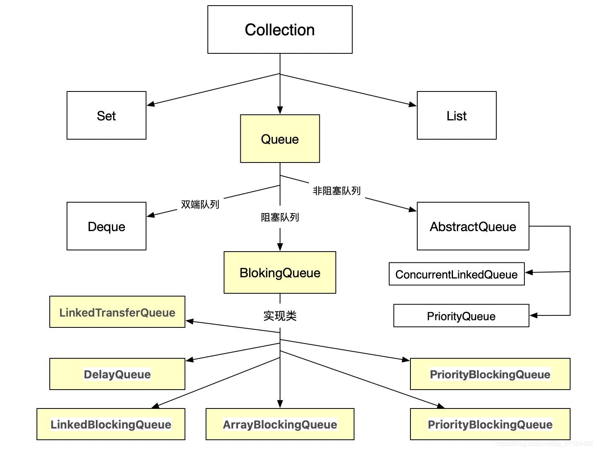
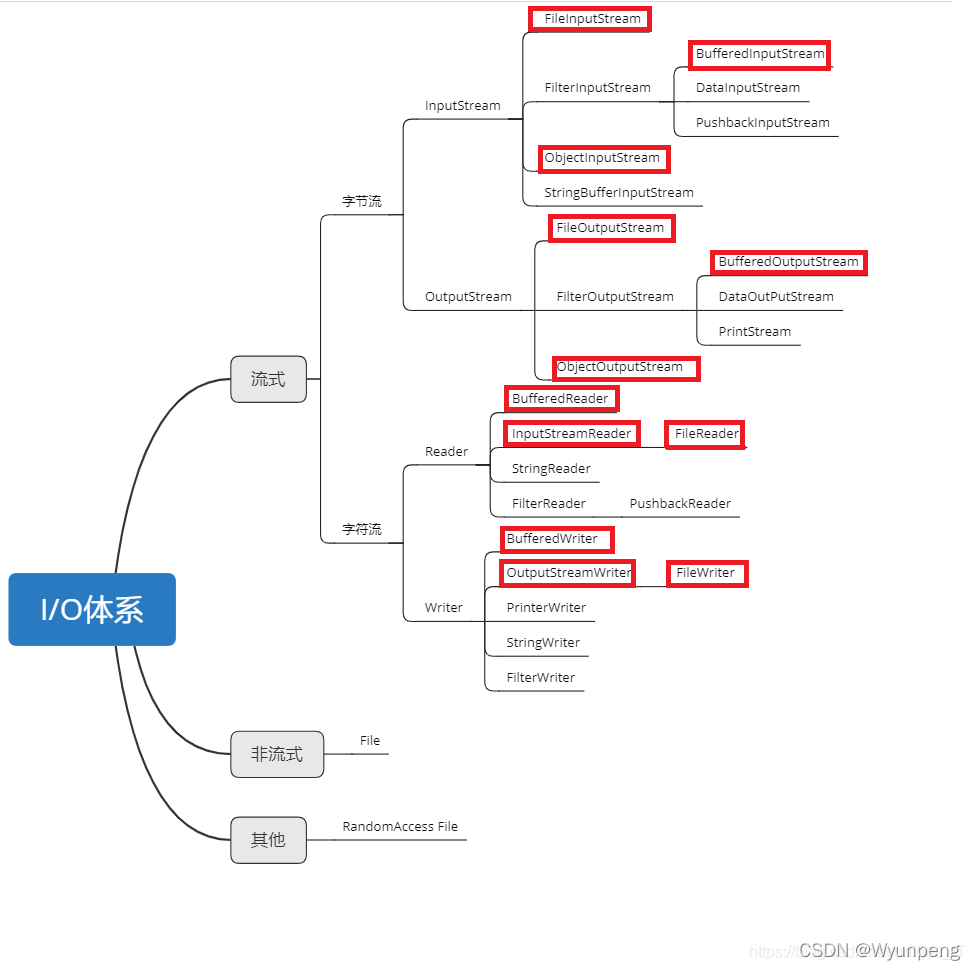
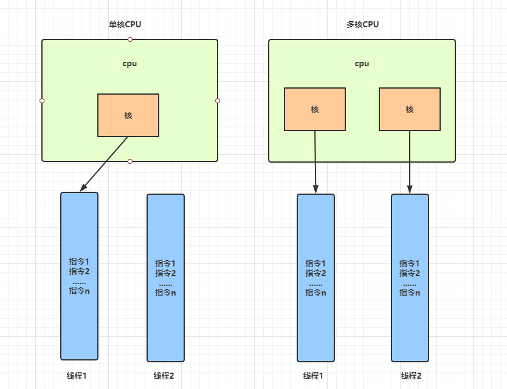

## [MainPage](../index.md)/[Programm](README.md)/Exam

1. [Обощенные и параметризованные типы. Создание параметризованных классов.](#1-обощенные-и-параметризованные-типы-создание-параметризованных-классов)  
  泛型和参数化类型。创建参数化类。
2. [Работа с параметризованными методами. Ограничение типа сверху или снизу.](#2-работа-с-параметризованными-методами-ограничение-типа-сверху-или-снизу)  
  使用参数化方法。 类型约束高于或低于。
3. Класс Number. Классы-оболочки. Автоупаковка и автораспаковка.
4. [Коллекции. Виды коллекций. Интерфейсы Set, List, Queue и их особенности.](#4-коллекции-виды-коллекций-интерфейсы-set-list-queue-и-их-особенности)  
  集合。 集合类型。 Set、List、Queue 接口及其特性。
5. Обход элементов коллекции. Интерфейсы Iterable, Iterator и ListIterator
6. Сортировка элементов коллекций. Интерфейсы Comparable и Comparator.
7. [Интерфейсы Set и SortedSet, их реализации. Классы HashSet и TreeSet.](#7-интерфейсы-set-и-sortedset-их-реализации-классы-hashset-и-treeset)  
  Set 和 SortedSet 接口，它们的实现。 HashSet 和 TreeSet 类。
8. Интерфейс List и его реализации. Классоы ArrayList и LinkedList.
9.  Интерфейсы Map и SortedMap, их реализации. Классы HashMap и TreeMap.
10. [Интерфейсы Queue и Deque. Классы PriorityQueue и ArrayDeque.](#10-интерфейсы-queue-и-deque-классы-priorityqueue-и-arraydeque)  
  队列和双端队列接口。 PriorityQueue 和 ArrayDeque 类。
11. Классы Collections и Arrays, методы для работы с коллекциями и массивами.
12. Регулярные выражения, Классы Pattern и Matcher.
13. [Байтовые потоки ввода-вывода. Классы InputStream, OutputStream и их потомки.](#13-байтовые-потоки-ввода-вывода-классы-inputstream-outputstream-и-их-потомки)  
  字节 I/O 流。 类 InputStream、OutputStream 及其后代。
14. Символьные потоки ввода-вывода. Классы Reader, Writer и их потомки.
15. Новый пакет ввода-вывода. Буферы и каналы. Класс FileChannel.
16. [Работа с файлами в Java. Интерфейс Path. Классы File, Files, Paths.](#16-работа-с-файлами-в-java-интерфейс-path-классы-file-files-paths)  
  在 Java 中处理文件，Path 接口。 File 类，Files 类，Paths 类
17. Сериализация объектов. Интерфейс Serializable. Модификатор transient.
18. Многопоточные программы. Класс Thread и интерфейс Runnable. Состояния потока.
19. [Многопоточные программы. Интерфейсы Executor, ExecutorService, Callable, Future](#19-многопоточные-программы-интерфейсы-executor-executorservice-callable-future)
  多线程程序。 接口 Executor、ExecutorService、Callable、Future
20. Класс Executors. Пулы потоков. Фреймворк fork/join.
21. Гонки. Синхронизация потоков. Модификатор synchronized.
22. [Порядок выполнения и ограничение "happens-before". Модификатор volatile.](#22-порядок-выполнения-и-ограничение-happens-before-модификатор-volatile)
  执行顺序和“happens-before”约束。 “volatile”修饰符
23. Взаимодействие потоков. Методы wait(), notify().
24. Интерфейсы Lock, ReadWriteLock, Condition.
25. [Атомарный доступ к переменным. Пакет java.util.concurrent.atomic.](#25-атомарный-доступ-к-переменным-пакет-javautilconcurrentatomic)
  对变量的原子访问。 包 java.util.concurrent.atomic。
26. Потокобезопасные коллекции. Synchronized- и Concurrent-коллекции.
27. Шаблоны проектирования. Структурные шаблоны.
28. Шаблоны проектирования. Порождающие шаблоны.
  设计模式。 生成模板。
29. Шаблоны проектирования. Поведенческие шаблоны.
30. Провайдеры служб.
31. Взаимодействие с базами данных. Протокол JDBC. Основные элементы.
  数据库交互。 JDBC 协议。 主要元素。
32. Создание соединения с базой данных. Класс DriverManager. Интерфейс DataSource.
33. Создание запросов. Интерфейсы Statement, PreparedStatement, CallableStatement.
34. Обработка результатов запроса. Интерфейсы ResultSet и RowSet.
  处理查询结果。 ResultSet 和 RowSet 接口。
35. Безопасное хранение паролей.
36. Интернационализация. Локализация. Хранение локализованных ресурсов.
37. Форматирование локализованных числовых данных, текста, даты и времени.
  格式化本地化的数字数据、文本、日期和时间。
38. Пакет java.time. Классы для представления даты и времени.
39. Функциональные интерфейсы и λ-выражения. Пакет java.util.function.
40. Рекурсия и ее использование.
  递归及其使用。
41. Конвейерная обработка данных. Пакет java.util.stream.
42. Библиотеки графического интерфейса. Особенности и различия.
43. Компоненты графического интерфейса. Классы Component, JComponent, Node.
  图形用户界面组件。 类组件，JComponent，节点。
44. Контейнеры. Классы Container, JPanel, Parent, Region, Scene.
45. Размещение компонентов в контейнерах. Менеджеры компоновки.
46. Контейнеры верхнего уровня. Классы JFrame, SwingUtilities, Stage, Application.
  顶级容器。 类 JFrame、SwingUtilities、Stage、Application。
47. Обработка событий графического интерфейса. События и слушатели.
48. Новые функции Java 9 и последующих версий.
49. Сетевое взаимодействие. Основные протоколы, их сходства и отличия.
  网络互动。 基本协议，它们的异同。
50. Протокол TCP. Классы Socket и ServerSocket.
51. Протокол TCP. Классы SocketChannel и ServerSocketChannel.
52. Протокол UDP. Классы DatagramSocket и DatagramPacket.
  UDP协议。 DatagramSocket 和 DatagramPacket 类。
53. Протокол UDP. Класс DatagramChannel.
54. Неблокирующий сетевой обмен. Селекторы.

#### 1. Обощенные и параметризованные типы. Создание параметризованных классов.

泛型，即“参数化类型”，泛型是一种特殊的类型。在定义类、接口或方法时声明类型参数（例如 `<T>`），到使用时再决定其具体的类型 `T`

常用范型标记符名称
- `E` - Element（在集合中使用，因为集合中存放的是元素）或 Exception
- `T` - Type（Java 类）
- `K` - Key（键）
- `V` - Value（值）
- `N` - Number（数值类型）
- `?` - 表示不确定的 java 类型

范型类：在类定义的时候并不会设置类中的属性或方法中的参数的具体类型，而是在类使用时再进行定义

一个简单的单元范型类创建如下：
```Java
class MyClasst<T>{// 此处可以在 ‘<>’ 中任意设置标识符号，常用 T 表示 Java 类，具体由外部决定
    private T var;// 成员变量 var 的类型由之前的 T 指定
    public T getVar(){// 返回值的类型也由 T 指定
        return var;  
    }  
    public void setVar(T var){// 方法 setVar 的参数类型也由 T 指定
        this.var = var;  
    }
}  
public class Main{  
    public static void main(String args[]){  
        MyClass<String> myObject = new Point<String>();
        // 由此确定对象 myObject 中所有由标识符 T 声明的变量、方法及参数的类型均为 String 类
        myObject.setVar("it");// 设置字符串 var
        System.out.println(myObject.getVar());// 取得字符串 var
    }  
}
```

#### 2. Работа с параметризованными методами. Ограничение типа сверху или снизу.

<!--
可参考链接：https://blog.csdn.net/caihuangshi/article/details/51278793
-->

#### 4. Коллекции. Виды коллекций. Интерфейсы Set, List, Queue и их особенности.

集合（Collection）可以看作是一种容器，用来存储对象信息。一个集合表示一组对象，称为它的元素。一些集合允许重复元素，而另一些则不允许。有些是有序的，有些是无序的。JDK 不提供此接口的任何直接实现：但提供更具体的子接口的实现，例如 `Set` 和 `List`。此接口通常用于传递集合并在需要最大通用性的地方操作它们

集合与数组的区别：
1. 数组长度不可变化而且无法保存具有映射关系的数据；集合类用于保存数量不确定的数据，以及保存具有映射关系的数据
2. 数组元素既可以是基本类型的值，也可以是对象；集合只能保存对象

- `Java.util.Set` 接口继承于 `Collection` 接口，`Set` 集合是一种不允许重复元素的无序的集合

- `Java.util.List` 接口继承于 `Collection` 接口，`List` 集合是一种允许重复元素的有序的集合

- `Java.util.Queue` 接口继承于 `Collection` 接口，`Queue` 集合是一种基于队列的集合；

Collection 常用接口方法：

修饰符和类型 | 方法名 | 描述
---|---|---
`boolean`|`add(E e)`|添加元素 `e`
`boolean`|`addAll(Collection<? extends E> c)`|将制定集合 `c` 中的所有元素添加到此集合
`void`|`clear()`|清除此集合中的所有元素
`boolean`|`contains(Object o)`|判断集合是否包含指定对象 `o`
`boolean`|`containsAll(Collection<?> c)`|判断集合是否包含指定集合 `c` 中的所有元素
`boolean`|`equals(Object o)`|判断集合与指定对象 `o` 是否相等
`int`|`hashCode()`|返回集合的哈希值
`boolean`|`isEmpty`|判断集合是否不包含任何元素
`Iterator<E>`|`iterator()`|返回集合元素的迭代器
`boolean`|`remove(Object o)`|移除集合中的元素 `o`
`boolean`|`removeAll(Collection<?> c)`|移除集合中所有包含于集合 `c` 的元素
`int`|`size()`|返回此集合中的元素数量
`Object[]`|`toArray()`|返回一个包含此集合所有元素的数组


#### 7. Интерфейсы Set и SortedSet, их реализации. Классы HashSet и TreeSet.

Java `Set` 接口继承于 `Collection` 接口，其方法基本与 `Collection` 接口中的方法一致

- `Set` 接口
  - 所存储的元素不可重复
  - 所存储的元素无序
  - 可以包含最多 1 个 `null`元素

- `SortedSet` 接口
  - 在 Set 集合的基础上提供了对元素的排序
  - 元素使用自然顺序或 `Comparator` 提供的顺序进行排序
  - 插入 SortedSet 的所有元素都必须实现 `Comparable` 接口（或者接受指定的 `Comparator`），并且所有这些元素都必须是可比较的，即 `e1.compareTo(e2)` 或 `comparator.compare(e1,e2)` 不得抛出 `ClassCastException`

- `HashSet` 类
  `HashSet` 类是 `Set` 接口的实现，按哈希算法存储集合中的元素，具有很好的存取和查找性能。底层数据结构是哈希表 （`HashMap`）

  特点：
  - 不能保证元素的排列顺序，即排列顺序可能与添加顺序不同，排列顺序也可能发生变化
  - `HashSet` 不是同步的
  - 集合元素值可以为 `null`

  存储机制：当向 `HashSet` 集合中存入一个元素时，`HashSet` 会调用该对象的 `hashCode` 方法来得到该对象的 `hashCode` 值，然后根据该 `hashCode` 值决定该对象在 `HashSet` 中的存储位置。如果有两个元素通过 `equals` 方法比较 `true`，但它们的 `hashCode` 方法返回的值不相等，`HashSet` 将会把它们存储在不同位置，依然可以添加成功。

  `HashSet`集合判断两个元素的标准是两个对象通过 `equals` 方法比较相等，并且两个对象的 `hashCode` 方法返回值也相等。

  通过重写 `hashCode` 方法和 `equals` 方法来判断两个元素是否相等，如果相等则覆盖原来的元素，以此来确保元素的唯一性

- `LinkedHashSet` 类

  继承于 `HashSet` 类，同样根据元素的 `hashCode` 值来决定元素的存储位置，但它同时使用链表维护元素的次序，使得元素看起来是以插入的顺序保存的，也就是说当遍历集合 `LinkedHashSet` 集合里的元素时，集合将会按元素的添加顺序来访问集合里的元素

- `TreeSet` 类
  `TreeSet` 类是 `SortedSet` 接口的实现，`TreeSet` 可以确保集合元素处于排序状态。

  存储机制：`TreeSet` 内部实现的是红黑树，默认整形排序为从小到大

  与 `HashSet` 集合相比，`TreeSet` 额外提供了一些方法：

  修饰符和类型 | 方法名 | 描述
  ---|---|---
  `Comparator`|`comparator()`|如果 `TreeSet` 采用了自定义的顺序，则该方法返回自定义排序所使用的`Comparator`，如果 `TreeSet` 采用自然排序，则返回 `null`
  `Object`|`first()`|返回集合中的第一个元素
  `Object`|`last()`|返回集合中的最后一个元素
  `Object`|`loewer(Object o)`|返回指定元素 `o` 之前的元素
  `Object`|`higher(Object o)`|返回指定元素 `o` 之后的元素
  `SortedSet`|`subSet(Object fromElement, Object toElement)`|返回此Set的子集合，含头不含尾
  `SortedSet`|`headSet(Object toElement)`|返回此集合中小于元素 `toElement` 的元素组成的子集
  `SortedSet`|`tailSet(Object fromElement)`|返回此集合中大于元素 `fromElement` 的元素组成的子集

<!--
参考链接：
https://blog.csdn.net/mashaokang1314/article/details/83721792?spm=1001.2101.3001.6661.1&utm_medium=distribute.pc_relevant_t0.none-task-blog-2%7Edefault%7ECTRLIST%7ERate-1-83721792-blog-120220136.t0_layer_searchtargeting_sa&depth_1-utm_source=distribute.pc_relevant_t0.none-task-blog-2%7Edefault%7ECTRLIST%7ERate-1-83721792-blog-120220136.t0_layer_searchtargeting_sa&utm_relevant_index=1

https://docs.oracle.com/javase/10/docs/api/java/util/HashSet.html#HashSet--
-->

#### 9. Интерфейсы Map и SortedMap, их реализации. Классы HashMap и TreeMap.


<!--
可参考链接：https://chasing987.github.io/2020/12/13/Java%E9%9B%86%E5%90%88%E6%A1%86%E6%9E%B6%20list-set-map%20/
-->

#### 10. Интерфейсы Queue и Deque. Классы PriorityQueue и ArrayDeque.


- `Queue` 接口
  队列是一种特殊的线性表，一般遵循先入先出、后入后出的基本原则，只允许在表的前端进行删除操作，而在表的后端进行插入操作。但 Java 中的一些队列但是java的某些队列运行在任何地方插入删除

  基本方法：

  修饰符和类型 | 方法名 | 描述
  ---|---|---
  `boolean`|`add(E e)`|如果可以在不违反容量限制的情况下将指定元素插入此队列，则在成功时返回 `true`，当没有可用空间时抛出 `IllegalStateException`
  `E`|`element()`|检索但不删除此队列的头部。
  `boolean`|`offer(E e)`|如果可以在不违反容量限制的情况下将指定元素插入此队列
  `E`|`peek()`|检索但不删除此队列的头部，如果此队列为空，则返回 `null`
  `E`|`poll()`|检索并删除此队列的头部，如果此队列为空，则返回 `null`
  `E`|`remove()`|检索并删除此队列的头部

  分类

  - 阻塞队列
    - 入列(添加元素)时，如果元素数量超过队列总数，会进行等待（阻塞），待队列的中的元素出列后，元素数量未超过队列总数时，就会解除阻塞状态，进而可以继续入列；
    - 出列(删除元素)时，如果队列为空的情况下，也会进行等待（阻塞），待队列有值的时候即会解除阻塞状态，进而继续出列；
     
    阻塞队列的好处是可以防止队列容器溢出；只要满了就会进行阻塞等待；也就不存在溢出的情况；  
    只要是阻塞队列，都是线程安全的；
  - 非阻塞队列
    不管出列还是入列，都不会进行阻塞
    - 入列时，如果元素数量超过队列总数，则会抛出异常，
    - 出列时，如果队列为空，则取出空值；
    阻塞和非阻塞队列在使用上的最大区别就是阻塞队列提供了以下2个方法：
    - 出队阻塞方法 ： `take()`
    - 入队阻塞方法 ： `put()`
    --- 
  - 有界队列：有界限，大小长度受限制
  - 无界队列：无界限，超过界限时会动态扩容
   
    --- 
  - 单向队列：每个元素中除了元素本身之外，还存储一个指针，这个指针指向下一个元素
  - 双向队列：除了元素本身之外，还有两个指针，一个指针指向前一个元素的地址，另一个指针指向后一个元素的地址
- `Deque` 接口
  继承自 `Queue` 接口，是一种双端队列，支持两端元素的插入和移除，接受有界队列与无界队列

  与 `Queue` 方法的比较：

  `Queue` 方法 | `Deque` 方法
  ---|---
  `add(E e)`|`addLast(E e)`
  `offer(E e)`|`offerLast(E e)`
  `remove()`|`removeFirst()`
  `poll()`|`pollFirst()`
  `element()`|`getFirst()`
  `peek()`|`peekFirst()`
  `push(E e)`|`addFirst(E e)`
  `pop`|`removeFirst()`

- `PriorityQueue` 类
  基于优先级堆继承 `AbstractQueue` 类的队列类

  特点：
  - 无界，没有容量限制，会根据需要增长以支持使用
  - 元素根据自然顺序或在队列构造时提供的 `Comparator` 进行排序
  - 不允许 `null` 元素
  - 不允许不可比较的对象作为队列元素（否则抛出 `ClassCastException`）
  - 不是线程安全的；在没有外部同步的情况下，不支持多线程并发访问
- `ArrayDeque` 类
  基于可调整大小的数组实现 `Deque` 接口的双向队列类

  特点：
  - 无界，没有容量限制，会根据需要增长以支持使用
  - 不是线程安全的；在没有外部同步的情况下，不支持多线程并发访问
  - 不允许 `null` 元素

#### 13. Байтовые потоки ввода-вывода. Классы InputStream, OutputStream и их потомки.



- IO：Java 的 io 是实现输入和输出的基础，可以方便的实现数据的输入和输出操作。

- 流：在 Java 中，不同的输入/输出源（键盘，文件，网络连接等）抽象表述为“流”(Stream)
流是一种有顺序的，有起点和终点的字节集合，是对数据传输的总称或抽象。即数据在两个设备间的传输成为流，流的本质是数据传输。通过流的形式允许 Java 程序使用相同的方式来访问不同的输入/输出源
  分类：
  - 按流向：输入流、输出流
  - 按数据类型：
    - 字节流：一次读取 1 byte，适用于各种文本，图片，音频视频等数据
    - 字符流：一次读取 1 字符，即 2 bytes，主要适用于普通文本文件
- `InputStream` 类
  `java.io.InputStream` 抽象类是表示字节输入流的所有类的超类（父类），可以读取字节信息到内存中。它定义了字节输入流的基本共性功能方法

  基本方法

  修饰符和类型 | 方法名 | 描述
  ---|---|---
  `int`|`available()`|返回此输入流中可读取（或跳过）的字节数的估计值，而不会被下一次调用此输入流的方法阻塞
  `void`|`close()`|关闭此输入流并释放与该流关联的所有系统资源
  `void`|`mark(int readlimit)`|标记此输入流中的当前位置
  `boolean`|`markSupported()`|测试此输入流是否支持 `markand reset` 方法
  `abstract int`|`read()`|从输入流中读取数据的下一个字节
  `int`|`read(byte[] b)`|从输入流中读取一些字节并将它们存储到缓冲区数组 `b` 中
  `int`|`read(byte[] b, int off, int len)`|从数入流中读取最多 len 个字节，存储到缓冲区数组 `b` 的 `off` 位及之后（从 `b[off]` 到 `b[off+len-1]`）
  `byte[]`|`readAllBytes()`|从输入流中读取所有剩余字节
  `int`|`readNBytes(byte[] b, int off, int len)`|从输入流中读取指定的 `len` 个字节到给定的字节数组中
  `void`|`reset()`|将此流重新定位到 mark上次在此输入流上调用该方法时的位置
  `long`|`skip()`|跳过并丢弃 `n` 个此输入流中的数据字节
  `long`|`transferTo()`|从此输入流中读取所有字节，并按照读取顺序将字节写入给定的输出流

- `OutputStream` 类
  `java.io.OutPutStream` 抽象类是表示字节输出流的所有类的超类（父类），将指定的字节信息写出到某个接收器；它定义了字节输出流的基本共性功能方法

  基本方法

  修饰符和类型 | 方法名 | 描述
  ---|---|---
  `void`|`close()`|关闭此输出流并释放与此流关联的所有系统资源
  `void`|`flush()`|刷新此输出流并强制写出所有缓冲的输出字节
  `void`|`write(byte[] b)`|将 `b.length` 个字节从指定字节数组写入输出流
  `void`|`write(byte b, int off, int len)`|从 `b[off]` 字节作为第一个写入的字节开始，将 `len` 个字节从指定字节数组写入输出流
  `abstract void`|`write(int b)`|将参数 `b` 的低八位比特作为字节写入输出流


<!--
参考链接：
https://blog.csdn.net/Wyunpeng/article/details/12285087813
-->

#### 16. Работа с файлами в Java. Интерфейс Path. Классы File, Files, Paths.

- `java.nio.file.Path` 接口
  `Path` 表示分层路径，由一系列目录和文件名元素组成，由特殊的分隔符或定界符分隔，开头可以用一个由系统文件决定的根部件开始，尾部也可以以一个文件名结束。可用于定位文件或目录的位置并访问

  分类：
  - 绝对路径：以根部件开始的路径
  - 相对路径：不以根部件开始的路径
  
  创建实体类：
  ```Java
  File file = new File("C:/Directory/FileName");
  Path path1 = file.toPath();
  //利用 File 类的 toPath 方法获取对象 file 的 Path 类路径
  Path path2 = Paths.get(file.getPath());
  //利用 Paths 类的静态方法 get 通过字符串获得对象 file 的 Path 类路径
  ```

  基本方法

  修饰符和类型 | 方法名 | 描述
  ---|---|---
  `boolean`|`endsWith(Path p)`|测试此路径是否以给定路径 `p` 结束
  `default boolean`|`endsWith(String s)`|将字符串 `s` 转为 `Path` 路径 `p`，然后按照 `endsWith(Path p)` 的方式执行
  `boolean`|`startsWith(Path p)`|测试此路径是否以给定路径 `p` 开始
  `default boolean`|`startsWith(String s)`|将字符串 `s` 转为 `Path` 路径 `p`，然后按照 `startsWith(Path p)` 的方式执行
  `Path`|`getName()`|将此路径的名称元素作为 `Path` 对象返回
  `int`|`getNameCount()`|返回路径中名称元素的数量
  `Path`|`getFileName()`|将此路径表示的文件或目录的名称作为 `Path` 对象返回
  `Path`|`getRoot()`|将此路径的根组件作为 `Path` 对象返回
  `Path`|`getParent()`|将此路径的根组件作为 `Path` 对象返回
  `boolean`|`isAbsolute()`|判断这条路径是否是绝对的
  `default File`|`toFile()`|	返回此路径表示的 `File` 对象
  `String`|`toString()`|返回此路径的字符串表示形式

- `java.nio.file.Paths` 类
  继承自 `Object` 类，只由静态方法构成，可以将路径字符串或 `URI` 转换为 `Path` 类对象
  
  基本方法

  修饰符和类型 | 方法名 | 描述
  ---|---|---
  `static Path`|`get(String first, String... more)`|将一个或多个路径字符串连接形成的字符串序列转换为 `Path` 对象
  `static Path`|`get(URI uri)`|将给定的 URI 转换为Path对象

- `java.io.File` 类
  文件和目录路径名的抽象表示

  此类的实例可能表示也可能不表示实际的文件系统对象，例如文件或目录。如果它确实表示这样的对象，则该对象驻留在一个分区中。分区是文件系统的特定于操作系统的存储部分。单个存储设备（例如物理磁盘驱动器、闪存、CD-ROM）可能包含多个分区。该对象（如果有）将驻留在此路径名的绝对形式的某个祖先 命名的分区上

  文件系统可以限制指定用户对实际文件系统对象的某些操作（例如读取、写入和执行）。这些限制统称为访问权限

  `File` 类的实例不可变，一旦创建，`File` 类的对象所代表的抽象路径名就永远不会改变

  基本字段

  修饰符和类型 | 字段名 | 描述
  ---|---|---
  `static String`|`pathSeparator`|系统相关的路径分隔符
  `static char`|`pathSeparatorChar`|系统相关的路径分隔符字符
  `static String`|`separator`|系统相关的默认名称分隔符
  `static char`|`separatorChar`|系统相关的默认名称分隔符字符

  构造函数

  字段名 | 描述
  ---|---
  `File​(File parent, String child)`|从父抽象路径名和子路径名字符串创建一个新 `File` 实例
  `File​(String pathname)`|将给定的路径名​​字符串转换为抽象路径名来创建一个新 `File` 实例
  `File​(String parent, String child)`|从父路径名字符串和子路径名字符串创建一个新 `File` 实例
  `File​(URI uri)`|将给定的URI 转换为抽象路径名来创建一个新 `File` 实例

  基本方法

  修饰符和类型 | 方法名 | 描述
  ---|---|---
  `boolean`|`canRead()`|测试应用程序是否可以读取此抽象路径名表示的文件
  `boolean`|`canWrite()`|测试应用程序是否可以修改此抽象路径名表示的文件
  `boolean`|`canExecute()`|测试应用程序是否可以执行此抽象路径名表示的文件
  `boolean`|`createNewFile()`|当且仅当具有此名称的文件尚不存在时，创建以此抽象路径名命名的新的空文件
  `boolean`|`delete()`|删除此抽象路径名表示的文件或目录
  `boolean`|`exists()`|测试此抽象路径名表示的文件或目录是否存在
  `boolean`|`isDirectory()`|测试此抽象路径名表示的文件是否为目录
  `boolean`|`mkdir()`|创建由此抽象路径名命名的目录
  `boolean`|`	mkdirs()`|创建由此抽象路径名命名的目录，包括任何必要但不存在的父目录
  
- `java.nio.file.Files` 类
  此类仅包含对文件、目录或其他类型文件进行操作的静态方法，在大多数情况下，此处定义的方法将委托给关联的文件系统提供者来执行文件操作

#### 19. Многопоточные программы. Интерфейсы Executor, ExecutorService, Callable, Future

- 多线程程序
  - 进程：当一个程序被运行，就开启了一个进程
  - 线程：一个进程内可分为多个线程。一个线程就是一个指令流，cpu调度的最小单位，由cpu一条一条执行指令
  - 并行：单核cpu运行多线程时，时间片进行很快的切换。线程轮流执行cp
  - 并发：多核cpu运行 多线程时，真正的在同一时刻运行
    
  - 多任务执行：实际上就是让 CPU 对多个任务轮流交替执行，充分利用 CPU 资源，提高效率，例如有语文、数学、英语3门作业要做，每个作业需要 30 分钟。我们把这3门作业看成是 3 个任务，可以做 1 分钟语文作业，再做1分钟数学作业，再做 1 分钟英语作业
  - 多任务实现方式
    - 多进程模式
      ```
      ┌──────────┐ ┌──────────┐ ┌──────────┐  
      │Process   │ │Process   │ │Process   │  
      │┌────────┐│ │┌────────┐│ │┌────────┐│  
      ││ Thread ││ ││ Thread ││ ││ Thread ││  
      │└────────┘│ │└────────┘│ │└────────┘│  
      └──────────┘ └──────────┘ └──────────┘  
      ```
      优点
      - 多进程稳定性比多线程高，因为在多进程的情况下，一个进程崩溃不会影响其他进程
      缺点：
      - 创建进程比创建线程开销大
      - 进程间通信比线程间通信要慢
    - 多线程模式
      ```
      ┌────────────────────┐
      │Process             │
      │┌────────┐┌────────┐│
      ││ Thread ││ Thread ││
      │└────────┘└────────┘│
      │┌────────┐┌────────┐│
      ││ Thread ││ Thread ││
      │└────────┘└────────┘│
      └────────────────────┘
      ```
      特点：
      - 线程间通信就是读写同一个变量，所以线程间通信比进程间快
      - 多线程经常需要读写共享数据，并且需要同步
    - 多进程多线程复合模式（最复杂）
      ```
      ┌──────────┐┌──────────┐┌──────────┐
      │Process   ││Process   ││Process   │
      │┌────────┐││┌────────┐││┌────────┐│
      ││ Thread ││││ Thread ││││ Thread ││
      │└────────┘││└────────┘││└────────┘│
      │┌────────┐││┌────────┐││┌────────┐│
      ││ Thread ││││ Thread ││││ Thread ││
      │└────────┘││└────────┘││└────────┘│
      └──────────┘└──────────┘└──────────┘
      ```
  - 多线程实现
    - 实例化 `Thread` 类，然后调用其 `start()` 方法
      ```Java
      public class Main {
          public static void main(String[] args) {
              Thread t = new Thread();
              t.start(); // 启动新线程
          }
      }
      ```
      但是这个线程启动后实际上什么也不做就会立刻结束
    - 从 `Thread` 派生一个自定义类，然后覆写 `run()` 方法：
      ```Java
      public class Main {
          public static void main(String[] args) {
              Thread t = new MyThread();
              t.start(); // 启动新线程
          }
      }

      class MyThread extends Thread {
          @Override
          public void run() {
              System.out.println("start new thread!");
          }
      }
      ```
    - 创建Thread实例时，传入一个实现了 `Runnable` 接口的类的实例：
      ```Java
      public class Main {
          public static void main(String[] args) {
              Thread t = new Thread(new MyRunnable());
              t.start(); // 启动新线程
          }
      }

      class MyRunnable implements Runnable {
          @Override
          public void run() {
              System.out.println("start new thread!");
          }
      }
      ```
      使用 `Lambda` 可进一步简写为：
      ```Java
      public class Main {
          public static void main(String[] args) {
              Thread t = new Thread(() -> {
                  System.out.println("start new thread!");
              });
              t.start(); // 启动新线程
          }
      }
      ```
      优点：
      - Java 不允许多继承，因此实现了 `Runnable` 接口的类可以再继承其他类
  - 线程池
  由于创建和销毁线程需要操作系统资源，如果可以复用一组线程，那么我们就可以把很多小任务让一组线程来执行，而不是一个任务对应一个新线程。这种能接收大量小任务并进行分发处理的就是线程池。

  线程池内部维护了若干个线程，没有任务的时候，这些线程都处于等待状态。如果有新任务，就分配一个空闲线程执行。如果所有线程都处于忙碌状态，新任务要么放入队列等待，要么增加一个新线程进行处理

  Java 标准库提供了 `Executor` 框架来管理使用线程池：
  - `Executor` 接口：是一个简单的接口，它包含一个 `execute()` 方法用于启动由 `Runnable` 对象指定的任务
    ```Java
    Executor executor = anExecutor();
    executor.execute(new RunnableTask1());
    executor.execute(new RunnableTask2());
    ```
  - `ExecutorService` 接口是 `Executor` 的一个子接口，增加了管理线程生命周期的功能。  
    它还包括一个 `submit()` 方法，类似于 `execute()` 但更通用。`submit()` 方法的重载版本可以采用 `Runnable` 或 `Callable` 对象  
    
  - `ScheduledExecutorService` 又是 `ExecutorService` 的子接口。它添加了允许您在代码中安排任务的功能
  Java 标准库还提供了几个实现类来创建线程池：
  - `FixedThreadPool`：线程数固定的线程池；
  - `CachedThreadPool`：线程数根据任务动态调整的线程池；
  - `SingleThreadExecutor`：仅单线程执行的线程池。
  而创建这些线程池的方法都被封装到 `Executors` 这个类中：
  ```Java
  // 创建一个固定线程数为 4 的线程池
  ExecutorService es = Executors.newFixedThreadPool(4);
  ```
  线程池在程序结束的时候要关闭：
  - 使用 `shutdown()` 方法会等待正在执行的任务先完成，然后再关闭。
  - 使用 `shutdownNow()` 方法会立刻停止正在执行的任务并关闭
  - 使用 `awaitTermination()` 方法则会等待指定的时间让线程池关闭
- `Callable` 接口
  与 `Runnable` 类似，只是不同于 `Runnable` 接口中的 `void run()` 方法，`Callable` 接口中的 `V call()` 方法具有返回值。因此，如果我们将一个 `Callable` 对象传递给该 `submit()` 方法，它将返回一个 `Future` 对象。而该对象可用于获取 `Callable` 返回值并对 `Callable` 和 `Runnable` 任务执行结果进行取消 `cancel()`、查询是否完成 `isDone()`、获取结果 `get()`

#### 22. Порядок выполнения и ограничение "happens-before". Модификатор volatile.

- 多线程可见性：
  指当一个线程修改了共享变量的值，其它线程能够适时得知这个修改  

  在单线程环境中，如果在程序前面修改了某个变量的值，后面的程序一定会读取到那个变量的新值。这看起来很自然，然而当变量的写操作和读操作在不同的线程中时，情况却并非如此

  问题原因：
  
  假设有两个线程 A、B 分别在两个不同的 CPU 上运行，它们共享同一个变量 X。如果线程 A 对 X 进行修改后，并没有将 X 更新后的结果同步到主内存，则变量 X 的修改对 B 线程是不可见的。所以 CPU 与内存之间的高速缓存就是导致线程可见性问题的一个原因，而 Java 虚拟机规范定义了自己的内存模型 JMM(Java Memory Model) 来屏蔽掉不同硬件和操作系统的内存模型差异，以实现让 Java 程序在各种平台下都能达到一致的内存访问结果

  解决方法：
  - Happens-Before 原则
    为解决多线程可见性的问题，JMM定义了 Happens-Before 原则：对于两个操作 A 和 B，这两个操作可以在不同的线程中执行。如果 A Happens-Before B，那么可以保证，当 A 操作执行完后，A 操作的执行结果对 B 操作是可见的
    Happens-Before 的规则包括：
    - 程序顺序规则：在一个线程内部，按照程序代码的书写顺序，书写在前面的代码操作 Happens-Before 书写在后面的代码操作
    - 锁定规则：对锁M解锁之前的所有操作 Happens-Before 对锁M加锁之后的所有操作
    - volatile变量规则：对一个 volatile 变量的写操作及这个写操作之前的所有操作 Happens-Before 对这个变量的读操作及这个读操作之后的所有操作
    - 线程启动规则：Thread对象的 start 方法及书写在 start 方法前面的代码操作 Happens-Before 此线程的每一个动作
    - 线程结束规则：线程中的任何操作都 Happens-Before 其它线程检测到该线程已经结束
    - 中断规则：一个线程在另一个线程上调用 interrupt,Happens-Before 被中断线程检测到interrupt被调用
    - 终结器规则：一个对象的构造函数执行结束 Happens-Before 它的 finalize() 方法的开始
    - 传递性规则：如果操作 A Happens-Before B，B Happens-Before C，那么可以得出操作 A Happens-Before C

#### 25. Атомарный доступ к переменным. Пакет java.util.concurrent.atomic.

- 原子性操作
  即不可分割的，不可中断的操作，其本身是线程安全的。例如赋值操作 `i = 1;`

  而对于非原子操作，例如
  ```Java
  `n = n + 1`
  ```
  实际上对应了三条原子操作：
  ```
  LOAD n
  ADD 1
  STORE n
  ```
  这种非原子操作是不安全的，例如设 `n` 的值为 `100`，如果两个线程同时执行 `n = n + 1`，得到的结果很可能不是 `102`，而是 `101`，这是因为
  ```
  ┌───────┐    ┌───────┐
  │Thread1│    │Thread2│
  └───┬───┘    └───┬───┘
      │            │
      │LOAD (100)  │
      │            │LOAD (100)
      │            │ADD 1
      │            │STORE (101)
      │ADD 1       │
      │STORE (101) │
      ▼            ▼
  ```
  如果 线程1 在执行 `LOAD` 后被操作系统中断，此刻如果 线程2 被调度执行，它执行 `LOAD` 后获取的值仍然是 `100`，最终结果被两个线程的 `STORE` 写入后变成了 `101`，而不是期待的 `102`

  因此多线程模型下，要保证逻辑正确，对共享变量进行读写时，必须保证一组指令以原子方式执行：即某一个线程执行时，其他线程必须等待。对此除了对代码块用 `synchronized` 关键字进行加锁以外，我们还可以使用 `java.util.concurrent.atomic` 包提供的各种原子性的方法来进行操作
- `java.util.concurrent.atomic` 包
  JDK6 以后，新增加了这个包，其中包含了各种原子类，例如 `AtomicInteger` 类就提供了各种如自增，自减等方法，而这些方法都是原子性的，也就是线程安全的，即同一个时间，只有一个线程可以调用这个方法

#### 28. Шаблоны проектирования. Порождающие шаблоны.

#### 31. Взаимодействие с базами данных. Протокол JDBC. Основные элементы.

#### 34. Обработка результатов запроса. Интерфейсы ResultSet и RowSet.
  处理查询结果。 ResultSet 和 RowSet 接口。