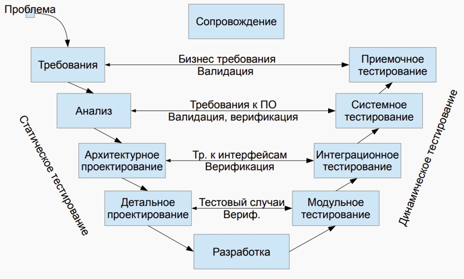
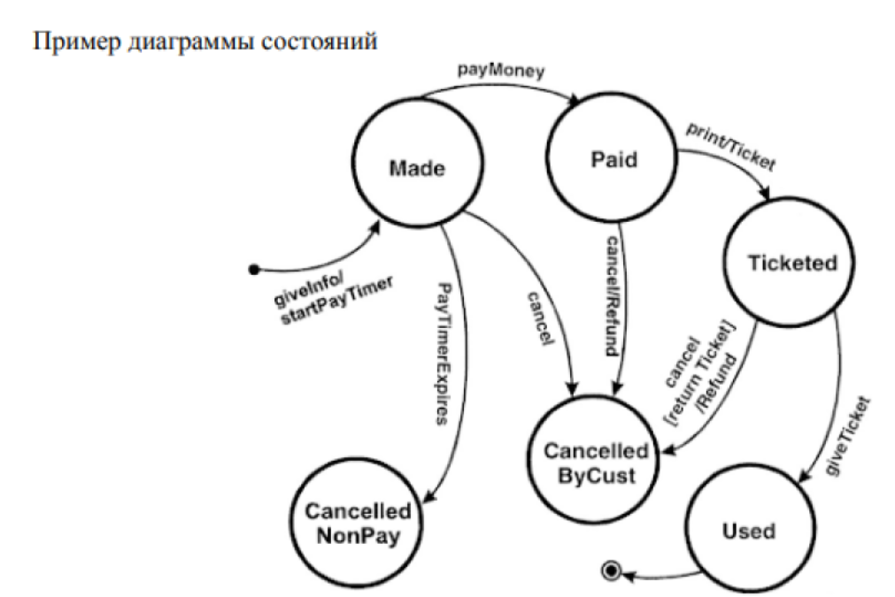
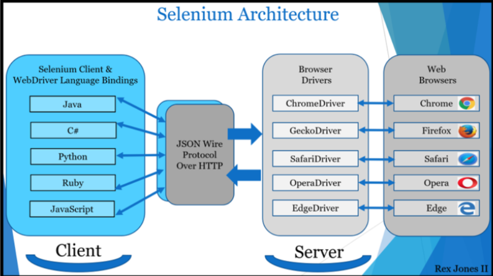
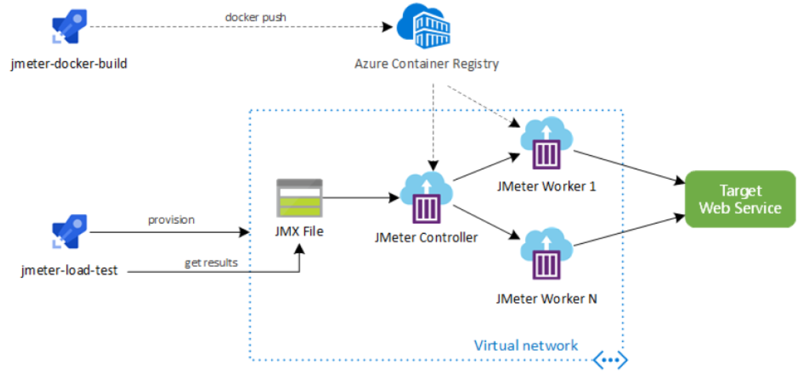

## [MainPage](../index.md)/[Rubiesh](README.md)/Rubiesh

# Exam Тестировано ПО (2013/2014)

- [Exam Тестировано ПО (2013/2014)](#exam-тестировано-по-20132014)
    - [1. Понятие тестирования ПО. Основные определения.  软件测试的概念。基本定义。](#1-понятие-тестирования-по-основные-определения--软件测试的概念基本定义)
    - [2. Цели и принципы тестирования (ISTQB).  测试的目标和原则（ISTQB）。](#2-цели-и-принципы-тестирования-istqb--测试的目标和原则istqb)
    - [3. Основная цель тестирования. Уровень доверия, корректное поведение, реальное окружение.   测试的主要目标。信任水平、正确行为、真实环境。](#3-основная-цель-тестирования-уровень-доверия-корректное-поведение-реальное-окружение---测试的主要目标信任水平正确行为真实环境)
    - [4. Тестирование и качество. Уровни восприятия тестирования в компании.  测试与质量。公司内对测试的认知层次。](#4-тестирование-и-качество-уровни-восприятия-тестирования-в-компании--测试与质量公司内对测试的认知层次)
    - [5. Участники тестирования, их роль, квалификация и обязанности.  测试参与者，他们的角色、资质和职责。](#5-участники-тестирования-их-роль-квалификация-и-обязанности--测试参与者他们的角色资质和职责)
    - [6. Мониторинг прогресса и контроль тестирования (ISTQB)  测试进度监控与控制（ISTQB）。](#6-мониторинг-прогресса-и-контроль-тестирования-istqb--测试进度监控与控制istqb)
    - [7. Модульное тестирование. Понятие модуля. Драйверы и заглушки.  单元测试。模块的概念。驱动程序和桩。](#7-модульное-тестирование-понятие-модуля-драйверы-и-заглушки--单元测试模块的概念驱动程序和桩)
    - [8. V-образная модель. Статическое и динамическое тестирование.  V模型。静态测试与动态测试。](#8-v-образная-модель-статическое-и-динамическое-тестирование--v模型静态测试与动态测试)
    - [9. Валидация и верификация. Тестирование методом "чёрного" и "белого" ящика.  验证与确认。黑盒测试与白盒测试。](#9-валидация-и-верификация-тестирование-методом-чёрного-и-белого-ящика--验证与确认黑盒测试与白盒测试)
    - [10. Тестовый случай, тестовый сценарий и тестовое покрытие.  测试用例、测试场景与测试覆盖率。](#10-тестовый-случай-тестовый-сценарий-и-тестовое-покрытие--测试用例测试场景与测试覆盖率)
    - [11. Полное тестовое покрытие. Оценка объема и времени полного покрытия.  完全测试覆盖率。覆盖范围和时间的估计。](#11-полное-тестовое-покрытие-оценка-объема-и-времени-полного-покрытия--完全测试覆盖率覆盖范围和时间的估计)
    - [12. Повторяемость тестового сценария. Автоматизированное тестирование. Регрессионное тестирование.  测试场景的可重复性。自动化测试。回归测试。](#12-повторяемость-тестового-сценария-автоматизированное-тестирование-регрессионное-тестирование--测试场景的可重复性自动化测试回归测试)
    - [13. Цели и задачи интеграционного тестирования. Алгоритм интеграционного тестирования. Стратегии интеграции.  集成测试的目标和任务。集成测试算法。集成策略。](#13-цели-и-задачи-интеграционного-тестирования-алгоритм-интеграционного-тестирования-стратегии-интеграции--集成测试的目标和任务集成测试算法集成策略)
    - [14. Тестирование системы целиком - системное тестирование.  14. 整个系统的测试——系统测试。](#14-тестирование-системы-целиком---системное-тестирование--14-整个系统的测试系统测试)
    - [15. Тестирование возможностей, стабильности, отказоустойчивости, совместимости.  功能、稳定性、容错性和兼容性测试。](#15-тестирование-возможностей-стабильности-отказоустойчивости-совместимости--功能稳定性容错性和兼容性测试)
    - [16. Тестирование производительности - CARAT.  性能测试——CARAT。](#16-тестирование-производительности---carat--性能测试carat)
    - [17. Альфа и Бета тестирование. Приемочное тестирование.  Alpha 和 Beta 测试。验收测试。](#17-альфа-и-бета-тестирование-приемочное-тестирование--alpha-和-beta-测试验收测试)
    - [18. Статическое тестирование. Рецензия, технические анализ, сквозной контроль.  静态测试。审查、技术分析、全流程控制。](#18-статическое-тестирование-рецензия-технические-анализ-сквозной-контроль--静态测试审查技术分析全流程控制)
    - [19. Статическое тестирование. Инспекции.  静态测试。检查。](#19-статическое-тестирование-инспекции--静态测试检查)
    - [20. Статическое тестирование. Статический анализ кода.  静态测试。代码静态分析。](#20-статическое-тестирование-статический-анализ-кода--静态测试代码静态分析)
    - [21. Выбор тестового покрытия с помощью анализа эквивалентности. Анализ граничных значений.  通过等价类分析选择测试覆盖率。边界值分析。](#21-выбор-тестового-покрытия-с-помощью-анализа-эквивалентности-анализ-граничных-значений--通过等价类分析选择测试覆盖率边界值分析)
    - [22. Выбор тестового покрытия с помощью таблицы решений.  通过决策表选择测试覆盖率。](#22-выбор-тестового-покрытия-с-помощью-таблицы-решений--通过决策表选择测试覆盖率)
    - [23. Выбор тестового покрытия с помощью диаграммы состояний и таблицы переходов.  通过状态图和转换表选择测试覆盖率。](#23-выбор-тестового-покрытия-с-помощью-диаграммы-состояний-и-таблицы-переходов--通过状态图和转换表选择测试覆盖率)
    - [24. Выбор тестового покрытия с помощью функционального тестирования.  通过功能测试选择测试覆盖率。](#24-выбор-тестового-покрытия-с-помощью-функционального-тестирования--通过功能测试选择测试覆盖率)
    - [25. Библиотека JUnit. Класс junit.framework.Assert.  JUnit库。junit.framework.Assert类。](#25-библиотека-junit-класс-junitframeworkassert--junit库junitframeworkassert类)
    - [26. Библиотека JUnit. Основные аннотации для исполнения тестов.  JUnit库。执行测试的主要注解。](#26-библиотека-junit-основные-аннотации-для-исполнения-тестов--junit库执行测试的主要注解)
    - [27. Библиотека JUnit. Дополнительные возможности, запуск с параметрами.  JUnit库。附加功能，带参数执行。](#27-библиотека-junit-дополнительные-возможности-запуск-с-параметрами--junit库附加功能带参数执行)
    - [28. Анализ эквивалентности с использованием JUnit.  使用JUnit进行等价类分析。](#28-анализ-эквивалентности-с-использованием-junit--使用junit进行等价类分析)
    - [29. Тестирование алгоритмов с использованием JUnit.  使用JUnit进行算法测试。](#29-тестирование-алгоритмов-с-использованием-junit--使用junit进行算法测试)
    - [30. Модульное тестирование доменной модели с использованием JUnit.  使用JUnit对领域模型进行单元测试。](#30-модульное-тестирование-доменной-модели-с-использованием-junit--使用junit对领域模型进行单元测试)
    - [31. Система Selenium. Архитектура, основные команды написания сценариев.  Selenium系统。架构与编写脚本的主要命令。](#31-система-selenium-архитектура-основные-команды-написания-сценариев--selenium系统架构与编写脚本的主要命令)
    - [32. Система Selenium. Assertion \& Verification. Команды.  Selenium系统。断言与验证。命令。](#32-система-selenium-assertion--verification-команды--selenium系统断言与验证命令)
    - [33. Система Selenium. Команды wait\*\*.  Selenium系统。等待命令\*\*。](#33-система-selenium-команды-wait--selenium系统等待命令)
    - [34. Система Selenium. Selenium RC, WebDriver, Grid.  Selenium系统。Selenium RC、WebDriver和Grid。](#34-система-selenium-selenium-rc-webdriver-grid--selenium系统selenium-rcwebdriver和grid)
    - [35. Язык XPath. Основные конструкции, оси.  XPath语言。主要结构与轴。](#35-язык-xpath-основные-конструкции-оси--xpath语言主要结构与轴)
    - [36. Язык XPath. Системные функции.  XPath语言。系统函数。](#36-язык-xpath-системные-функции--xpath语言系统函数)
    - [37. Язык XPath. Функции с множествами.  XPath语言。集合函数。](#37-язык-xpath-функции-с-множествами--xpath语言集合函数)
    - [38. Язык XPath. Строковые, логические и числовые функции.  XPath语言。字符串、逻辑和数字函数。](#38-язык-xpath-строковые-логические-и-числовые-функции--xpath语言字符串逻辑和数字函数)
    - [39. Apache JMeter. Архитектура, Элементы тестового плана. Последовательность выполнения.  Apache JMeter。架构、测试计划元素。执行顺序。](#39-apache-jmeter-архитектура-элементы-тестового-плана-последовательность-выполнения--apache-jmeter架构测试计划元素执行顺序)
    - [40. Apache Jmeter. Дополнительные возможности. Распределенное тестирование.  Apache JMeter。附加功能。分布式测试。](#40-apache-jmeter-дополнительные-возможности-распределенное-тестирование--apache-jmeter附加功能分布式测试)
    - [41\*. Область деятельности тестирования безопасности. Риски безопасности. Цифровые активы (digital assets). Методы доступа и обеспечения безопасности. Политики безопасности  安全测试的范围。安全风险。数字资产。访问和安全方法。安全政策](#41-область-деятельности-тестирования-безопасности-риски-безопасности-цифровые-активы-digital-assets-методы-доступа-и-обеспечения-безопасности-политики-безопасности--安全测试的范围安全风险数字资产访问和安全方法安全政策)
    - [42\*. Тестирование безопасности. Практически используемые методы. Безопасный код. Основные подходы. Common Weakness Enumeration 安全测试。使用的实用方法。安全代码。基本方法。常见弱点枚举](#42-тестирование-безопасности-практически-используемые-методы-безопасный-код-основные-подходы-common-weakness-enumeration-安全测试使用的实用方法安全代码基本方法常见弱点枚举)
    - [43\*. Fuzzy testing (Фаззинг). Типы фаззинга  模糊测试（Fuzzing）。模糊测试的类型](#43-fuzzy-testing-фаззинг-типы-фаззинга--模糊测试fuzzing模糊测试的类型)
    - [44\*. Penetration Testing. Тестирование на проникновение. Dynamic Application Security Testing (DAST) Tools](#44-penetration-testing-тестирование-на-проникновение-dynamic-application-security-testing-dast-tools)
    - [45\*. Организация тестов безопасности в циклах и типах разработки. Тестирование общих механизмов безопасности.  按开发周期和类型组织安全测试。测试常见的安全机制。](#45-организация-тестов-безопасности-в-циклах-и-типах-разработки-тестирование-общих-механизмов-безопасности--按开发周期和类型组织安全测试测试常见的安全机制)


### 1. Понятие тестирования ПО. Основные определения. <br> 软件测试的概念。基本定义。

Тестирование программного обеспечения - проверка соответствия между реальным и ожидаемым поведением программы, осуществляемая на конечном наборе тестов, выбранном определенным образом.  
软件测试是检查程序的实际行为与预期行为是否一致的过程，这通过特定方式选择的一组测试来实现。

В более широком смысле, тестирование - это одна из техник контроля качества, включающая в себя активности по планированию работ (Test Management), проектированию тестов (Test Design), выполнению тестирования (Test Execution) и анализу полученных результатов (Test Analysis).  
在更广泛的意义上，测试是一种质量控制技术，涵盖了测试管理（Test Management）、测试设计（Test Design）、测试执行（Test Execution）和测试结果分析（Test Analysis）等活动。

Верификация (Verification) - это процесс оценки системы или её компонентов с целью определения удовлетворяют ли результаты текущего этапа разработки условиям, сформированным в начале этого этапа. Т.е. выполняются ли наши цели, сроки, задачи по разработке проекта, определенные в начале текущей фазы.  
验证（Verification）是评估系统或其组件的过程，目的是确定当前开发阶段的结果是否符合该阶段开始时设定的条件。换句话说，是否实现了在当前阶段初期设定的目标、时间和开发任务。

Валидация (Validation) - это определение соответствия разрабатываемого ПО ожиданиям и потребностям пользователя, требованиям к системе.  
确认（Validation）是确定开发中的软件是否符合用户的期望和需求以及系统的要求。

- **Mistake** - ошибка, просчет человека  
  Mistake（错误）— 人为的失误或计算错误。
- **Fault** - дефект, изъян в коде, образовавшийся в результате Mistake 
  Fault（缺陷）— 代码中由于错误（Mistake）而产生的缺陷或瑕疵。
- **Failure** - неисправность, отказ, сбой. Внешнее проявление Fault. Когда программа натыкается на Fault и выдает неверный результат  
  Failure（故障）— 失效、拒绝或错误。是缺陷（Fault）的外在表现，当程序遇到缺陷时，会产生错误的结果。
- **Error** - невозможность выполнить задачу вследствие отказа Failure. Отказ может быть вызван внешними силами  
  Error（错误）— 由于故障（Failure）导致无法执行任务。故障可能是由外部力量引发的。

Тестовый случай - Input-Processing-Output. Должен быть повторяемым.  
测试用例 — 输入-处理-输出。必须是可重复的。

- Входные значения - данные или управляющие последовательности.  
  输入值 — 数据或控制序列。
- Выполнение (предусловия, условия выполнения, постусловия)  
  执行（前提条件、执行条件、后置条件）。
- Ожидаемый результат:  
  预期结果：
  - выходные данные или изменения состояния, или другие последствия  
    输出数据或状态变化，或其他后果。
  - должен быть определен до запуска 
    在运行之前必须确定。

Тестовый сценарий - набор тестовых случаев  
测试场景 — 一组测试用例。

### 2. Цели и принципы тестирования (ISTQB). <br> 测试的目标和原则（ISTQB）。

Цели тестирования: 测试目标：
- Обнаружение дефектов  
  发现缺陷
- Повышение уверенности в уровне качества  
  提高对质量水平的信心 
- Предоставление информации для принятия решений  
  为决策提供信息
- Предотвращение дефектов  
  预防缺陷

Принципы тестирования:  
测试原则：

1. **Тестирование демонстрирует наличие дефектов (их отсутствие показать нельзя)**  
   **测试表明缺陷的存在（无法证明它们不存在）**
   Тестирование может показать наличие дефектов в программе, но не доказать их отсутствие. Тем не менее, важно составлять тест-кейсы, которые будут находить как можно больше багов. Таким образом, при должном тестовом покрытии, тестирование позволяет снизить вероятность наличия дефектов в программном обеспечении. В то же время, даже если дефекты не были найдены в процессе тестирования, нельзя утверждать, что их нет.  
   测试可以表明程序中存在缺陷，但不能证明它们不存在。尽管如此，制定能够发现尽可能多缺陷的测试用例仍然非常重要。通过适当的测试覆盖，测试能够减少软件中存在缺陷的可能性。同时，即使在测试过程中未发现缺陷，也不能断言它们不存在。
2. **Исчерпывающее тестирование недостижимо (полное тестовое покрытия недостичь)**  
   **穷尽测试是无法实现的（无法实现完全测试覆盖率）**  
   Невозможно провести исчерпывающее тестирование, которое бы покрывало все комбинации пользовательского ввода и состояний системы, за исключениям совсем уж примитивных случаев. Вместо этого необходимо использовать анализ рисков и расстановку приоритетов, что позволит более эффективно распределять усилия по обеспечению качества ПО.  
   无法进行覆盖所有用户输入组合和系统状态的穷尽测试，除非是在极为简单的情况下。因此，需要使用风险分析和优先级排序，从而更有效地分配保证软件质量的工作。
3. **Раннее тестирование (чем раньше тем лучше)**  
   尽早进行测试（越早越好）  
   Тестирование должно начинаться как можно раньше в жизненном цикле разработки программного обеспечения, и его усилия должны быть сконцентрированы на определенных целях.  
   测试应尽早在软件开发生命周期的初期开始，并且其工作应集中于特定目标。
4. **Скопление дефектов (несколько модулей содержат основную массу ошибок)**  
   **缺陷聚集（少数模块包含大部分错误）**
   Есть сложные куски программы. Дефекты в основном в них. Модули сами по себе сложные, поэтому все баги в них Разные модули системы могут содержать разное количество дефектов   
  - то есть, плотность скопления дефектов в разных элементах программы может отличаться. Усилия по тестированию должны распределяться пропорционально фактической плотности дефектов. В основном, большую часть критических дефектов находят в ограниченном количестве модулей. Это проявление принципа Парето: 80% проблем содержатся в 20% модулей.  
   系统的不同模块可能包含不同数量的缺陷，即程序各个元素中缺陷的聚集密度可能不同。测试工作应根据缺陷的实际密度进行分配。通常，绝大多数关键性缺陷集中在少数模块中。这是帕累托原则的体现：80%的问题集中在20%的模块中。
5. **Парадокс пестицида (если часто проводить правки, то тесты со временем ломаются и их нужно чинить)** (жуки привыкают к пестициду) Прогоняя одни и те же тесты вновь и вновь, Вы столкнетесь с тем, что они находят все меньше новых ошибок.  
   **杀虫剂悖论（频繁修复后，测试会逐渐失效，需要修复测试）**
   Поскольку система эволюционирует, многие из ранее найденных дефектов исправляют и старые тест-кейсы больше не срабатывают. Чтобы преодолеть этот парадокс, необходимо периодически вносить изменения в используемые наборы тестов, рецензировать и корректировать их с тем, чтобы они отвечали новому состоянию системы и позволяли находить как можно большее количество дефектов.  
   反复运行相同的测试会发现越来越少的新错误。随着系统的进化，许多早期发现的缺陷会被修复，旧的测试用例将失去作用。为了克服这一悖论，需要定期修改测试集，审查和调整它们，以适应系统的新状态，并发现尽可能多的缺陷。
6. **Тестирование зависит от контекста**  
   测试依赖于上下文  
   (если речь о больничном софте, то нужно лучше тестировать. Также тесты не должны быть сложнее, чем реальные кейсы, то есть проверяем на реальных данных).  
   （如果我们谈论的是医院软件，那么我们需要更好地测试。而且，测试不应该比真实案例更复杂，即我们检查真实数据）。  
   Выбор методологии, техники и типа тестирования будет напрямую зависеть от природы самой программы. Например, программное обеспечение для медицинских нужд требует гораздо более строгой и тщательной проверки, чем, скажем, компьютерная игра. Из тех же соображений, сайт с большой посещаемостью должен пройти через серьезное тестирование производительности, чтобы показать возможность работы в условиях высокой нагрузки.  
   测试方法、技术和类型的选择将直接依赖于程序的性质。例如，医疗需求的软件比电脑游戏需要更加严格和详细的测试。出于同样的考虑，高访问量的网站必须经过严格的性能测试，以证明它能够在高负载条件下正常运行。
7. **Заблуждение об отсутствии ошибок.**  
   无错误的误解 Обнаружение и исправление дефектов не помогут, если созданная система не подходит пользователю и не удовлетворяет его ожиданиям и потребностям.  
   即使发现并修复了缺陷，若开发的系统不适合用户，也无法满足用户的期望和需求，依然无济于事。

### 3. Основная цель тестирования. Уровень доверия, корректное поведение, реальное окружение. <br>  测试的主要目标。信任水平、正确行为、真实环境。

Основная цель тестирования - увеличение приемлемого уровня пользовательского доверия в том, что программа функционирует корректно во всех необходимых обстоятельствах  
测试的主要目标是提高用户对程序在所有必要环境下正常运行的信任水平。

- Уровень доверия  
  信任水平
- Корректное поведение 
- Необходимые обстоятельства - требование реального окружения

- Уровень доверия  
  信任水平
  - Наглядность  
    可见性
  - Уровень остаточного обнаружения дефектов  
    残余缺陷检测水平
    - Число дефектов обнаруженных тестом или набором тестов  
      通过测试或测试集发现的缺陷数量
    - Число дефектов обнаруженных в заданное время  
      在特定时间内发现的缺陷数量  
    Пример: Меньше 10-ти критических дефектов найдено за последние 7 дней.  
    示例：在过去7天内发现的关键性缺陷少于10个。

  - Требования к надежности  
    可靠性要求
    - Сложно показать без испытаний, то есть работающего ПО  
      在没有测试的情况下很难展示，即需要工作中的软件  
    Пример: Среднее время между отказами не должно быть меньше 5000 часов.  
    示例：平均故障间隔时间不得少于5000小时。 

- Корректное поведение  
  正确行为
  Для определения корректного поведения необходимо определение:  
  要确定正确的行为，需要以下定义：
  - Из требований  
    来自需求  
  - Из спецификаций  
    来自规范  
  - Зависит от уровня тестирования  
    取决于测试的层次 
- Реальное окружение   
  真实环境
  Реальное окружение включает в себя:  
  真实环境包括：
  - Реалистичное количество данных - таких же, как в целевой системе  
    与目标系统相同的现实数据量 
    Например: В университете 5000 студентов, небольшой рост.  
    例如：某大学有5000名学生，人数略有增长。
    Поэтому необходим тест на 5000, 6000, 7000 студентов, но не на 10000!   
    因此需要针对5000、6000、7000名学生进行测试，但不需要10000名学生的测试！
  - Реалистичный набор, комбинация входных данных  
    现实的输入数据集和组合 

### 4. Тестирование и качество. Уровни восприятия тестирования в компании. <br> 测试与质量。公司内对测试的认知层次。

**Уровень 0 - тестирование == отладка**  
**0级 - 测试等同于调试**
1. Не отличает некорректное поведение и ошибки в программе  
   无法区分程序中的不正确行为和错误
2. Не учитывает требования надежности и безопасности  
   不考虑可靠性和安全性要求

**Уровень 1 - предназначение   
  - показать корректность ПО**  
**1级 - 目的是展示软件的正确性**
Как правило, на данном уровне нет формальных правил написания тестов  
通常，在此级别没有正式的测试编写规则

**Уровень 2 - Демонстрация ошибок**  
2级 - 演示错误

На данном уровне может происходить конфликт разработчиков и тестировщиков  
在此级别，开发人员和测试人员之间可能会发生冲突

**Уровень 3 - Тестирование может показать наличие ошибок**  
**3级 - 测试可以显示错误的存在**
1. Используя ПО мы подвержены рискам  
   使用软件时，我们面临风险 
2. Риск - последствия незначительные  
   风险 - 后果不严重
1. Риск - последствия катастрофические  
   风险 - 后果灾难性的
2. Тестировщики и разработчики совместно снижают риски  
   测试人员和开发人员共同降低风险

**Уровень 4 - Тестирование - это возможный способ оценки качества программного обеспечения в терминах найденных дефектов&& 
**4级 - 测试是一种通过发现缺陷来评估软件质量的方式**

Способы оценивания качества:  
质量评估方法：

- Разработка стандартов  
  制定标准
- Обучение  
  培训
- Анализ дефектов  
  缺陷分析

### 5. Участники тестирования, их роль, квалификация и обязанности. <br> 测试参与者，他们的角色、资质和职责。

- Проектирование тестов. Основываясь на сценарии, словесное описание тестов.  
  测试设计。基于场景，口头描述测试。
  - На основании формальных критериев  
    基于正式标准 
  - На основании знаний предметной области, опыта и экспертизы  
    基于领域知识、经验和专业知识 
- Автоматизация тестов - программист то бишь.  
  测试自动化 - 也就是程序员。
  - Знание средств, скриптов  
    熟悉工具和脚本 
- Исполнение тестов. Ручками исполняет, может делать любой.  
  测试执行。手动执行，任何人都能做。
  - Нет специальных требований квалификации  
    没有特殊资格要求 
- Анализ результатов. Просто анализирует полученные результаты.  
  结果分析。只是分析获得的结果。
  - Знания предметной области  
    需要领域知识 
Роли:  
角色：
- Test manager - определение объёмов тестирования, стратегии, списания  
  测试经理 - 确定测试范围、策略、计划
- Test designer - анализ системы, определение тестовых случаев, обзор тестового покрытия  
  测试设计师 - 系统分析、定义测试用例、测试覆盖范围审查
- Test engineer - вся грязная работа. Создание тестов, прогон тестов, заполнение отчетов об ошибках.  
  测试工程师 - 所有繁琐的工作。创建测试、执行测试、填写错误报告。

### 6. Мониторинг прогресса и контроль тестирования (ISTQB) <br> 测试进度监控与控制（ISTQB）。

**Целью мониторинга тестирования** - является обзор процесса тестирования и предоставление результата заинтересованным лицам.  
测试监控的目的是审查测试过程，并向相关人员提供结果。

Информация отслеживается вручную или автоматически и может быть использована для измерения критериев выхода, таких как покрытие.  
信息可以手动或自动跟踪，并用于衡量退出标准，如覆盖率。

Метрики также могут быть использованы для оценки прогресса тестирования по сравнению с запланированным расписанием и бюджетом.  
度量标准也可用于评估测试进度与计划进度和预算的比较。

Метриками могут являться тестовое покрытие, количество пройденных тестов, количество найденных дефектов и т.д.  
度量标准可以包括测试覆盖率、通过的测试数量、发现的缺陷数量等。

**Контроль тестирования** описывает любые направляющие или корректирующие действия, принятые как результат по полученной и собранной информации и значениям метрик в результате мониторинга.  
测试控制描述了基于通过监控获得的信息和度量值所采取的任何指导或纠正措施。

Контроль тестирования может затрагивать любые действия по тестированию, а также воздействовать на другие действия и задачи жизненного цикла ПО.  
测试控制可以涉及任何测试活动，并影响软件生命周期中的其他活动和任务。

Такими действиями могут быть правильная приоритизация усилий тестирования, привлечение большего количества ресурсов на тестирование, уменьшение объема предстоящего релиза и т.д.  
此类措施可能包括正确的测试优先级、增加测试资源、减少即将发布的版本规模等。

### 7. Модульное тестирование. Понятие модуля. Драйверы и заглушки. <br> 单元测试。模块的概念。驱动程序和桩。

**Модульное тестирован** - это процесс в программировании, позволяющий проверить модули исходного кода программы.  
单元测试是编程中的一个过程，用于验证程序源代码的模块。

**Цель модульного тестирования** - изолировать отдельные части программы и показать их работоспособность.  
单元测试的目标是将程序的各个部分隔离开来，并展示它们的可操作性。

В ходе модульного тестирования решаются задачи:  
在单元测试过程中解决以下问题：
- Поощрение изменений - позволяет программистам проводить рефакторинг, будучи уверенными, что модуль по-прежнему работает корректно  
  鼓励变更 - 让程序员在进行重构时确信模块仍然正常工作。
- Упрощение интеграции - устранить сомнения по поводу отдельных модулей и может быть использовано для подхода к тестированию “снизу вверх”  
  简化集成 - 消除对单个模块的疑虑，并可用于“自下而上”的测试方法。
- Документирование кода - тесты можно рассматривать как “живой документ”  
  代码文档化 - 测试可以被视为“活文档”。
- Отделение интерфейса от реализации  
  接口与实现的分离。

**Понятие модуль (модуль программы)** - компонент минимального размера, который может быть независимо протестирован в ходе верификации программной системы  
模块（程序模块）的概念 - 是程序系统验证过程中可以独立测试的最小组件。

Модуль может быть одним из:  
模块可以是以下之一：

- Модуль - это часть программного кода, выполняющая одну функцию с точки зрения функциональных требований  
  模块 - 从功能需求的角度看，它是执行单个功能的代码部分。
- Модуль - это программный модуль, т.е. Минимальный компилируемый элемент программной системы  
  模块 - 是程序系统的最小可编译元素。
- Модуль - это задача в списке задач проекта (с точки зрения его менеджера).  
  模块 - 是项目任务列表中的任务（从项目经理的角度看）。
- Модуль - это один класс или их множество с единым интерфейсом.  
  模块 - 是具有统一接口的一个类或多个类。

**Заглушка** - часть программы, которая симулирует обмен данными с тестируемым компонентом, выполняет имитацию рабочей системы.  
桩 - 是程序的一部分，用于模拟与被测试组件的数据交换，并模仿实际系统的工作。

- Эмулирует поведение подчиненной программы  
  模拟从属程序的行为 
  - Подпрограмма, функция, процедура  
    子程序、函数、过程 
  - Аппаратное прерывание, передача данных  
    硬件中断、数据传输 
- Интерфейс совпадает, внутренность нет  
  接口相同，内部不同
  - Предопределенные ответы для заданных аргументов, исключения  
    为给定参数和异常预定义响应 
  - Постоянная генерация прерываний  
    持续生成中断 
- Используются вместо реальной программы  
  代替实际程序使用
  - Компилируется и линкуется  
    可编译并链接 
- Простая  
  简单
  - Нельзя тестировать заглушку!  
    不能测试桩！ 
- Обычно 1 строка кода  
  通常为一行代码
- Возможна дополнительная логика  
  可以有额外的逻辑
  - 50 раз возвращать 42, на 51  - IndexOutOfBounds  
    返回42 50次，第51次抛出 IndexOutOfBounds 异常 
- Может читать значения из текстового файла  
  可以从文本文件读取值
- Возможна настройка драйвером перед выполнением  
  执行前可以通过驱动程序进行配置

**Драйвер** - определенный модуль теста, который управляет тестируемым нами элементов.  
驱动程序 - 是特定的测试模块，用于控制我们正在测试的元素。
- Эмулирует вызывающий модуль  
  模拟调用模块
- Обычно уже более сложная программа  
  通常是更复杂的程序
  - Устанавливает окружение  
    设置环境 
  - Подготавливает входные данные  
    准备输入数据 
- Дополнительно может:  
  此外，驱动程序可以：
  - Запускать серию тестов  
    运行一系列测试 
  - Настраивать заглушки  
    配置桩  
  - Формировать журнал результатов  
    生成结果日志 

### 8. V-образная модель. Статическое и динамическое тестирование. <br> V模型。静态测试与动态测试。

**V-образная модель** - описывает подход к разработке приложений, при котором тестирование ведется параллельно с разработкой на каждом из её этапов.  
**V 形模型** - 描述了一种应用程序开发方法，其中测试与每个阶段的开发并行进行。



**Преимущества V-модели:**  
V模型的优点：
- Тестировщики начинают работу на ранних этапах разработки → некоторые дефекты будут обнаружены раньше   
  测试人员在开发早期就开始工作 → 某些缺陷可以更早发现。
- Тестирование включено в каждый этап жизненного цикла  
  测试被纳入生命周期的每个阶段。
- Заранее пишутся тестовые планы и сценарии → все готово при старте динамического тестирования  
  提前编写测试计划和场景 → 动态测试开始时一切都已准备就绪。

**Недостатки V-модели:**  
V模型的缺点：
- К старту проекта все команды должны быть сформированы - большое стартовое вложение  
  项目开始时所有团队都必须组建完毕 → 启动投资大。
- Очень большое количество документации и работы с ней (особенно, если требования начинают меняться)  
  文档量大且需要大量处理文档（特别是在需求开始变更时）。

**Статическое тестирование:**  
静态测试：
- Не включает выполнения кода  
  不包括代码执行。
- Ручное, автоматизированное  
  手动或自动化。
- Неформальное, сквозной контроль, инспекция 
  非正式、贯穿控制、检查。

**Динамическое тестирование:**  
动态测试：
- Запуск модулей, групп модулей, всей системы  
  运行模块、模块组或整个系统。
- После появления первого кода (а иногда перед!)
  在代码出现后（有时在之前！）

### 9. Валидация и верификация. Тестирование методом "чёрного" и "белого" ящика. <br> 验证与确认。黑盒测试与白盒测试。

**Верификация** - это проверка на соответствие правилам.  
确认是对符合规则的检查。  
Правила оформляются в виде документа. То есть, должен быть документ с требованиями к документации.  
规则以文件形式呈现。也就是说，必须有文件来规定文档的要求。  
Если документация соответствует требованиям этого документа, то она прошла верификацию.  
如果文档符合这些要求，那么它通过了确认。

**Валидация** - это проверка правильности выводов.   
验证是对结论正确性的检查。  
То есть, должен быть свод знаний, в котором описано, как получить описание конструкции на основе данных об объекте.  
也就是说，必须有知识体系来描述如何根据对象的数据获取结构描述。  
Проверка правильности применения этих выводов - есть валидация.  
验证是检查这些结论应用的正确性。  
В том числе это проверка описания на непротиворечивость, полноту и понятность.

**Методы “черного ящика”**  
黑盒测试方法：
Метод тестирования при котором не используется знания о внутреннем устройстве тестируемого объекта  
测试方法不使用关于被测试对象内部结构的知识
- Спецификации, требования, дизайн  
  基于规范、需求、设计。
- Запуск и сравнение результатов с эталоном  
  运行并将结果与标准进行比较。

**Методы “белого ящика”**  
白盒测试方法：
Тестирование кода на предмет логики работы программы и корректности её работы.  
测试代码的逻辑及其工作的正确性。
Тестирование позволяет проверить внутреннюю структуру программы.  
这种测试方法可以检查程序的内部结构。  
Исходя из этой стратегии тестировщик получает тестовые данные путем анализа логики работы программы.  
根据这种策略，测试人员通过分析程序的逻辑获得测试数据。
- Переходы, утверждения, условия  
  转移、语句、条件。
- Анализ путей, структуры  
  路径、结构分析。

Валидация → черный ящик  
验证 → 黑盒测试

Верификация → белый ящик  
确认 → 白盒测试

### 10. Тестовый случай, тестовый сценарий и тестовое покрытие. <br> 测试用例、测试场景与测试覆盖率。

**Тестовый случай (Input → Processing → Output)**  
测试用例 (输入→处理→输出)  

Имеет: 具备以下要素：
- Входные значения. Данные или управляющие воздействия  
  输入值：数据或控制输入
- Предусловия, условия выполнения, постусловия  
  前置条件，执行条件，后置条件
- Ожидаемый результат  
  预期结果：
  - Выходные данные и состояния, изменения в них, и другие последствия теста  
    输出数据和状态的变化，以及测试的其他结果 
  - Определен до запуска теста  
    在测试启动前确定 

Характеристики:  
特点：  
- Повторяемый, автоматизируемый  
  可重复，可自动化  
- Учитывает состояния (если есть)  
  考虑状态（如果存在）  
  - Переходы между состояниями  
    状态间的转换：  
    - Правильные: Корректный результат  
      正确的：正确结果  
    - Неправильный: Корректные сообщения об ошибках  
      错误的：正确的错误信息   

**Тестовый сценарий** - это последовательность тестовых случаев.  
测试场景是测试用例的序列。  
Показывает типичное использование системы.  
显示系统的典型使用情况。  
Также должен обрабатывать не только корректное поведение, но и вариант ошибки, вроде НЕВЕРНОГО pin кода и блокировать карточку после 3-х раз.  
还应处理错误情况，比如错误的PIN码，并在三次输入错误后锁定卡片。

Свойством является определение корректного поведения в:  
特性是在以下方面定义正确行为：
- Требованиях (системное, приемочное тестирование)   
  需求（系统测试，验收测试）
- Архитектуре (интеграционное тестирование)   
  架构（集成测试）
- Проектных документах (модульное тестирование)   
  设计文档（单元测试）

Тестовое покрытие - это одна из метрик оценки качества тестирования, представляющая собой плотность покрытия тестами требований либо исполняемого кода.  
测试覆盖率是评估测试质量的指标之一，表示需求或可执行代码的测试覆盖密度。

Полное покрытие к сожалению невозможно :( Выбор может производиться с помощью следующих методов:  
遗憾的是，完全覆盖是不可能的。

- Эквивалентное разбиение (партиции эквивалентности)   
  等价类划分
- Таблица решений (альтернатива)   
  决策表（备选方案）
- Таблица переходов  
  状态转移表
- Сценарии использования  
  使用场景

### 11. Полное тестовое покрытие. Оценка объема и времени полного покрытия. <br> 完全测试覆盖率。覆盖范围和时间的估计。

Полное тестовое покрытие недостижимо, поэтому тестовое покрытие выбирается с помощью определенных методик:   
完全的测试覆盖率是无法实现的，因此通过特定方法选择测试覆盖率：

- Эквивалентное разбиение (партиции эквивалентности)   
  等价类划分（等价分区）  
  Этот метод предполагает деление входных данных на классы эквивалентности, где поведение системы предполагается одинаковым.  
  这种方法假定将输入数据划分为等价类，在这些类中系统的行为应相同。
- Таблица решений (альтернатива) 
  决策表（替代方案）  
  Представляет собой таблицу, в которой записаны различные комбинации условий и соответствующие действия системы.  
  这是一种记录各种条件组合及系统相应行为的表格。
- Таблица переходов  
  状态转换表  
  Модель тестирования, где тестируются переходы между различными состояниями системы на основе заданных условий.  
  该模型测试系统在给定条件下的状态间转换。
- Сценарии использования  
  使用场景  
  Это типичное или наиболее вероятное использование системы, проверяющее корректность её работы при определенных сценариях.  
  这是检查系统在特定场景下正确性的一种方法，通常是系统的典型或最可能的使用方式。

Необходимо балансировать между количеством тестов, стоимостью и скоростью разработки.  
需要平衡测试数量、成本和开发速度。  
- Чем больше тестов - тем меньше дефектов, но зависимость не линейная  
  测试越多，缺陷越少，但这种关系不是线性的。
- С каждым новым тестом обнаруживается все меньше ошибок.  
  随着新测试的增加，发现的错误会越来越少。
- Однако возрастает стоимость и время разработки.  
  然而，成本和开发时间会增加。

### 12. Повторяемость тестового сценария. Автоматизированное тестирование. Регрессионное тестирование. <br> 测试场景的可重复性。自动化测试。回归测试。

**Повторяемость** - все написанные тесты всегда будут выполняться однообразно.  
重复性 - 所有编写的测试将始终以相同的方式执行。

**Автоматическое тестирование** - тестирование с помощью программных средств, аналогично ручному тестированию.   
自动化测试 - 使用软件工具进行测试，与手动测试相似。
- Регрессионное тестирование  
  回归测试
- Повторение тестового сценария  
  重复测试场景
- Приемочное тестирование  
  验收测试
- Сокращение ручного труда  
  减少人工工作
- Проверка одного приложения в разных окружения  
  在不同环境中检查一个应用程序

**Регрессионное тестирование** - собирательное название для всех видов тестирования программного обеспечения, направленных на обнаружение ошибок в уже протестированных участках исходного кода.  
回归测试 - 是针对软件的所有测试类型的统称，旨在发现已经测试过的源代码部分中的错误。  
Такие ошибки - когда после внесения изменений в программу перестает работать то, что должно было продолжать работать - называют регрессионными ошибками.  
这些错误是指在对程序进行更改后，原本应继续工作的部分停止工作，这种错误称为回归错误。  
Регрессионные тесты удобно автоматизировать и запускать после каждого изменения/добавления участка кода, проверяя, что не сломалось ничего из ранее работающего.  
回归测试可以方便地自动化，并在每次更改/添加代码段后运行，以检查以前正常工作的部分是否仍然正常。

**Задачи регрессионного тестирования:**  
回归测试的任务：
- Проверка и утверждение исправления ошибки  
  检查和确认错误的修复 
- Тестирование последствия исправлений, так как внесенные исправления могут привести к ошибкам  
  测试修复的后果，因为所做的修复可能会引入新的错误
- Гарантировать функциональную преемственность и совместимость  
  确保功能的延续性和兼容性
- Уменьшение стоимости и сокращения времени выполнения тестов  
  降低成本并缩短测试执行时间

### 13. Цели и задачи интеграционного тестирования. Алгоритм интеграционного тестирования. Стратегии интеграции. <br> 集成测试的目标和任务。集成测试算法。集成策略。

Интеграционное тестирование - вид тестирования, при котором на соответствие требований проверяется интеграция модулей, их взаимодействие между собой, а также интеграция подсистем в одну общую систему.  
集成测试 - 一种测试类型，检查模块的集成及其相互之间的交互，以及子系统集成到一个整体系统中的符合性。 
- Проверяет интерфейсы и взаимодействие модулей (компонент) или систем  
  检查模块（组件）或系统的接口和交互
  - Вызовы API, сообщения между ОО компонентами  
    API调用、对象组件之间的消息 
  - Баз Данных, пользовательских графических интерфейс   
    数据库、用户图形界面 
  - Интерфейсы взаимодействия (сетевые, аппаратные, локальные …)   
    交互接口（网络接口、硬件接口、本地接口……） 
  - Инфраструктурные  
    基础设施接口 
- Может проводиться когда два компонента разработаны (спроектированы)  
  可在两个组件开发（设计）完成时进行
  - Остальные добавляются по готовности  
    其他组件根据准备情况添加 
  
**Стратегии интеграции**  
集成策略

- Больше объем интеграции - больше сложность  
  更多的集成量 - 更多的复杂性
- Для каждого интерфейса должен быть разработан короткий тест план  
  每个接口都应制定简短的测试计划
- Выбор в зависимости от архитектуры ПО  
  根据软件架构进行选择
- Последовательность имеет значение  
  顺序很重要
- Можно тестировать нефункциональные характеристики  
  可以测试非功能特性

**Алгоритмы интеграции:**  
集成算法：

- **Сверху вниз** - вначале тестируются все высокоуровневые модули и постепенно один за другим добавляются низкоуровневые. Все модули более низкого уровня стимулируются заглушками с аналогичной функциональностью, затем по мере готовности они заменяются реальными активными компонентами.  
  自上而下 - 首先测试所有高层模块，然后逐步添加低层模块。所有低层模块使用功能相似的桩进行刺激，然后在准备好后用实际的活跃组件替换。
- **Снизу вверх** - Все низкоуровневые модули, процедуры или функции собираются воедино и затем тестируются. После чего собирается следующий уровень модулей для проведения интеграционного тестирования. Данный подход считается полезным, если все или практически все модули, разрабатываемого уровня, готовы. Также данный подход помогает определить по результатам тестирования уровень готовности приложения  
  自下而上 - 所有低层模块、过程或函数被组合在一起，然后进行测试。之后收集下一个模块层次进行集成测试。这种方法被认为有用，如果所有或几乎所有正在开发的模块都已准备好。此外，该方法还根据测试结果帮助确定应用程序的准备水平。
- **Большой взрыв** - Все или практически все разработанные модули собираются в виде законченной системы или ее основной части и затем проводится интеграционное тестирование. Такой подход очень хорош для сохранения времени. Однако если тест кейсы и их результаты записаны не верно, то сам процесс интеграции сильно осложнится, что станет преградой для команды тестирования при достижении основной цели интеграционного тестирования.  
  这种方法非常适合节省时间。但是如果测试用例及其结果记录不正确，则集成过程会变得非常复杂，这将阻碍测试团队达到集成测试的主要目标。
  Перед запуском обязательно молиться!!!  
  在启动之前务必祈祷！！！
- **Ядро** - при данном тестировании сначала создаются жизненно необходимые модули, а потом уже идет апгрейд их. Например, экран + клавиатура + мышь - работают с минимальным функционалом. Можно добавить цвет на экран, подсветку для клавиатуры и т.п.  
  核心 - 在此测试中，首先创建必要的模块，然后进行升级。例如，显示器 + 键盘 + 鼠标 - 以最小功能运行。可以在显示器上添加颜色、为键盘增加照明等。
- **Функциональная** - по одной функции. Сценарий проверяет совокупность действий. Например, пользователь заходит на почтовый сайт, листает письма, просматривает новые, пишет и отправляет письмо, выходит с сайта. Такие сценарии могут быть очень сложными и иметь множество вариаций, поэтому данный вид тестирования выполняется обычно в самом конце и считается очень дорогим.  
  功能性 - 逐个功能进行。场景检查一系列操作。例如，用户登录邮箱网站，翻阅邮件，查看新邮件，撰写并发送邮件，然后退出网站。这些场景可能非常复杂且有许多变体，因此这种类型的测试通常在最后进行，并被认为是非常昂贵的。

### 14. Тестирование системы целиком - системное тестирование. <br> 14. 整个系统的测试——系统测试。

**Системное тестирование ПО** - это тестирование ПО, выполняемое на полной, интегрированной системе, с целью проверки соответствия системы исходным требованиям.  
软件系统测试 - 在完整集成系统上进行的软件测试，目的是检查系统是否符合初始要求。  
Системное тестирование относится к методам тестирования черного ящика, и, тем самым, не требует знаний о внутреннем устройстве системы.  
系统测试属于黑盒测试方法，因此不需要对系统内部结构的了解。

**Задача:** проверка как функциональность системы с точки зрения пользователя, так и нефункциональные характеристики.  
任务： 从用户的角度检查系统的功能性以及非功能性特征。

При этом выявляются дефекты, такие как неверное использование ресурсов системы, непредусмотренные комбинации данных пользовательского уровня, несовместимость с окружением, непредусмотренные сценарии использования, отсутствующая или неверная функциональность, неудобство использования и т.д.   
此过程中识别出缺陷，例如系统资源的错误使用、用户级数据的未预见组合、与环境的不兼容、未预见的使用场景、缺失或错误的功能、使用不便等。  
Для минимизации рисков, связанных с особенностями поведения системы в той или иной среде, во время тестирования рекомендуется использовать окружение максимально приближенное к тому, на которое будет установлен продукт после выдачи.  
为最小化与系统在特定环境中的行为特性相关的风险，建议在测试期间使用尽可能接近于产品发布后将要安装的环境。

Включает несколько фаз:  
包括几个阶段：

- Системное тестирование - выполняется внутри организации-разработчика  
  系统测试 - 在开发组织内部进行
- Альфа и Бета тестирование - выполняется пользователем под контролем разработчика  
  阿尔法和贝塔测试 - 在开发者的控制下由用户进行
- Приемочное тестирование - выполняется пользователем. Платить за это продукт или нет.  
  验收测试 - 由用户进行。是否为该产品付款。

### 15. Тестирование возможностей, стабильности, отказоустойчивости, совместимости. <br> 功能、稳定性、容错性和兼容性测试。

Относится к нефункциональному тестированию.  
属于非功能性测试。

**Тестирование возможностей** - минимальная нагрузка, состоящая из корректных и реальных данных, проверка возможностей и функционала системы  
能力测试 - 最小负载，由正确的实际数据组成，检查系统的能力和功能。

**Тестирование стабильности** - добавляем нагрузку, данные все ещё корректные.  
稳定性测试 - 增加负载，数据仍然是正确的。  
Проверяем как система работает в более-менее реальных условиях  
检查系统在比较真实的条件下如何工作。

**Тестирование отказоустойчивости** - пытаемся все сломать к чертям. Некорректные данные, большая нагрузка, сбои питания, восстановление после отказа и т.д.  
容错测试 - 尝试将一切都搞砸。不正确的数据、大负载、断电、故障恢复等。

**Тестирование совместимости** - запуск с различными версиями библиотек, на различном окружении. Смотрим как система со всем этим работает.  
兼容性测试 - 使用不同版本的库，在不同环境下运行。观察系统如何处理这一切。

### 16. Тестирование производительности - CARAT. <br> 性能测试——CARAT。

CARAT - подход к нагрузочному тестированию  
CARAT - 负载测试的一种方法

- **Capacity** (Нефункциональные возможности) - максимальное количество(пользователей, записей в БД, файлов, КБ, ГГц), поддерживаемое системой одновременно, не нарушая других требований производительности.   
  容量（非功能性能力） - 系统可以同时支持的最大数量（用户、数据库中的记录、文件、KB、GHz），而不违反其他性能要求。
- **Accuracy** (Точность) - корректность алгоритмов и результатов  
  准确性（精确度） - 算法和结果的正确性
- **Responce Time** (Время ответа) - время ответа сервиса при разных видах нагрузки  
  响应时间（响应时间） - 服务在不同负载下的响应时间
- **Availability** (Готовность) - способность сервиса обслуживать клиента   
  可用性（可用性） - 服务为客户提供服务的能力
  - Коэф. Готовности =  (MTBF - MTTR) / MTBF  
    可用性系数 = (MTBF - MTTR) / MTBF  
  - MTBF - среднее время между сбоями  
    MTBF - 故障间隔平均时间 
  - MTTR - среднее время восстановления  
    MTTR - 平均恢复时间 
- **Throughput** (Пропускная способность) - количество операций в секунду, которое  
  吞吐量（吞吐量） - 每秒操作的数量

### 17. Альфа и Бета тестирование. Приемочное тестирование. <br> Alpha 和 Beta 测试。验收测试。

Альфа и бета-тестирование являются частью системного тестирование. Проводятся пользователями.  
阿尔法和贝塔测试是系统测试的一部分。由用户进行。

**Альфа-тестирование** - имитация реальной работы с системой штатными разработчиками, либо реальная работа с системой потенциальными пользователями/заказчиком.   
阿尔法测试 - 由常规开发人员模拟与系统的实际工作，或者由潜在用户/客户与系统的实际工作。
- Может проводиться до окончания системного тестирования  
  可以在系统测试结束之前进行。
- Ранние отзывы пользователей об использовании системы в рабочем окружении  
  用户对在工作环境中使用系统的早期反馈。 
  
Бета-тестирование - в некоторых случаях выполняется распространение предварительной версии (в случае проприетарного программного обеспечения иногда с ограничениями по функциональности или времени работы) для некоторой большей группы лиц с тем, чтобы убедиться, что продукт содержит достаточно мало ошибок.  
贝塔测试 - 在某些情况下，将预发布版本（在专有软件的情况下，功能或运行时间可能有限制）分发给更大群体，以确保产品包含的错误足够少。  
Иногда бета-тестирование выполняется для того, чтобы получить обратную связь о продукте от его будущих пользователей.  
有时，贝塔测试是为了从未来的用户那里获得对产品的反馈。
- Могут быть ошибки  
  可能存在错误。
- Может быть не реализован весь функционал  
  可能并未实现所有功能。
- Ранние отзывы для разработчиков  
  开发人员的早期反馈。
- Превью для пользователей  
  用户预览。

Приемочное тестирование - формальный процесс тестирования, который проверяет соответствие системы требованиям и проводится с целью: определения удовлетворяет ли система приемочным критериям; вынесения решения заказчиком или другим уполномоченным лицом принимается приложение или нет.  
验收测试 - 一种正式的测试过程，用于检查系统是否符合要求，其目的在于：确定系统是否满足验收标准；由客户或其他授权人员决定是否接受该应用程序。


### 18. Статическое тестирование. Рецензия, технические анализ, сквозной контроль. <br> 静态测试。审查、技术分析、全流程控制。

**Статическое тестирование** - анализ артефактов разработки программного обеспечения, таких как требования или программный код, проводимый без исполнения этих программных артефактов.  
静态测试 - 对软件开发工件（如需求或程序代码）进行分析，而无需执行这些程序工件。  
В процессе статического тестирования, программные продукты рассматриваются оцениваться вручную, проводятся ревью или с помощью набора инструментов, сам код при это не запускается.  
在静态测试过程中，软件产品被手动审查和评估，可以进行评审或使用一组工具，而不运行代码。  
Проводится перед динамическим тестированием и соответственно ошибки найденные на этом этапе обходятся нам дешевле.  
在动态测试之前进行，因此在此阶段发现的错误成本较低。

**Рецензирование (Review)** - оценка состояния продукта или проекта с целью установления расхождений с запланированными результатами и для выдвижения предложений по совершенствованию.   
评审 - 评估产品或项目的状态，以确定与计划结果的差异，并提出改进建议。
- Основное предназначение - поиск дефектов  
  主要目的 - 查找缺陷。
- Дополнительная цель - улучшение процесса  
  额外目标 - 改进过程。
- Подготовка - формальная подготовка  
  准备 - 正式准备。
- Ведущий - подготовленный модератор  
  负责人 - 经过培训的负责人。
- Рекомендованный размер группы: 3-6  
  推荐团队规模：3-6人。
- Формальная процедура - всегда  
  正式程序 - 始终。
- Объем материалов - небольшой  
  材料范围 - 不大。
- Сбор метрик - всегда  
  收集指标 - 始终。
- Выходные данные - список дефектов, результаты метрик, формальный отчет   
  输出 - 缺陷列表、指标结果、正式报告。
  
**Технический анализ** - проверка продукта на соответствие и практическую пригодность.  
技术分析 - 检查产品的合规性和实用性。 
- Основное предназначение - поиск дефектов  
  主要目的 - 查找缺陷。
- Дополнительная цель - принятие решений  
  附加目标 - 做出决策。
- Подготовка - популяризация  
  准备 - 宣传。
- Ведущий - в зависимости от обстоятельств  
  主持人 - 根据情况而定。
- Рекомендованный размер группы: >3  
  推荐的团队规模：>3人。
- Формальная процедура - иногда  
  正式程序 - 有时。
- Объем материалов - от среднего до большого  
  材料的数量 - 从中等到大。
- Сбор метрик - иногда  
  收集指标 - 有时。
- Выходные данные - формальный отчет  
  输出 - 正式报告。

Сквозной контроль - представляет собой один из видов формального пересмотра артефактов методом “мозгового штурма”, который может проводиться на любом этапе разработки.  
横向控制 - 一种正式审查工件的方式，通过“头脑风暴”方法，可以在开发的任何阶段进行。  
Это дружественная встреча разработчиков, тщательно спланированная, с ясно определенными целями, повесткой дня, продолжительностью и составом участников.   
这是开发人员之间的友好会议，经过精心计划，明确的目标、议程、持续时间和参与者组成。
- Основное предназначение - поиск дефектов  
  主要目的 - 查找缺陷。
- Дополнительная цель - обмен опытом  
  附加目标 - 经验交流。
- Подготовка - обычно нет  
  准备 - 通常没有。
- Ведущий - автор  
  主持人 - 作者。
- Рекомендованный размер группы: 2-7  
  推荐的团队规模：2-7人。
- Формальная процедура - обычно нет  
  正式程序 - 通常没有。
- Объем материалов - небольшой  
  材料的数量 - 少量。
- Сбор метрик - обычно нет  
  收集指标 - 通常没有。
- Выходные данные - неформальный отчет  
  输出 - 非正式报告。

### 19. Статическое тестирование. Инспекции. <br> 静态测试。检查。

**Статическое тестирование** - анализ артефактов разработки программного обеспечения, таких как требования или программный код, проводимый без исполнения этих программных артефактов. В процессе статического тестирования, программные продукты рассматриваются оцениваться вручную, проводятся ревью или с помощью набора инструментов, сам код при это не запускается. Проводится перед динамическим тестированием и соответственно ошибки найденные на этом этапе обходятся нам дешевле.  
**静态测试(Статическое тестирование)** 是在不执行软件开发工件（例如需求或程序代码）的情况下进行的分析。在静态测试过程中，软件产品被手动评估、审查或使用一组工具，但代码本身并不运行。它是在动态测试之前进行的，因此，在此阶段发现的错误成本较低。

**Инспекция ПО** - это статическая проверка соответствия программы заданным спецификациями, проводится путем анализа различных представлений результатов проектирования (документации, требований, спецификаций, схем или исходного кода программы) на процессах ЖЦ.  
**软件检查(Инспекция ПО)** 是对程序是否符合给定规范的静态检查；它是通过分析生命周期过程中设计结果的各种表示（文档、需求、规范、图表或程序源代码）来进行的。

Четко определенные шаги:   
明确定义的步骤：
- Вход - постановка проблемы/цели  
  **输入(Вход)** - 问题/目标陈述 
  - Входные критерии - определяются перед началом (проверяются ведущим)   
    输入标准 - 开始前确定 
- Планирование - определение сессий (проводимых тестов)  
  **规划(Планирование)** - 定义会话（要执行的测试）
  - Определение объемов (зависит от артефакта, проводится с учетом check rate’a - сколько один человек может проверить за время инспекции)   
    体量的确定（取决于工件，考虑到检查率 - 一个人在检查过程中可以检查多少） 
  - Отбор инспекторов   
    检验员的选拔  
  - Сбор метрик (цена изменений, время на проверку и т.д.)  
    指标收集（变更成本、检查时间等） 
  - Разрабатывание расписания  
    进度制定  
- Обзор  
  概述
  - Обучение инспекторов  
    检验员培训   
  - Назначение ролей   
    角色分配 
  - Распространение материалов  
    材料分配 

Шаги 4-7 являются одной сессией и могут повторяться  
步骤 4-7 为一个会话，可以重复
  
- Подготовка  
  准备工作
  - Учет времени (отмечается начало, используется check rate)    
    时间追踪（开头有标记，使用检查率）
  - Выделение проблем (с фокусом на основные), их классификация и подсчет  
    问题识别（聚焦主要问题）、分类和计算  
- Обсуждение  
  讨论
  - Сбор и протоколирование результатов подготовки   
    培训结果收集和记录  
  - Решение по артефакту: принят/на переработку/отклонен и др.  
    关于工件的决定：接受/处理/拒绝等 
- Переработка - может осуществляться автором/редактором/другим работниками  
  修改 ——可以由作者/编辑/其他员工进行
- Выработка рекомендаций  
  制定建议  
- Выход  
  输出
  - Инспекция не может завершиться, пока не удовлетворены выходные критерии   
    满足输出标准后，检查才能完成 
  - Согласование документов всеми инспекторами  
    所有检查员的文件协调 

Роли инспекторов могут быть выбраны из следующих:  
可以从以下角色中选择检查员角色
- Чек-лист — инспектор проверят по нему  
  Check list - 检查员将检查它  
- Документы — инспектор проверяет целостность между несколькими документами  
  文档 - 检查器检查多个文档之间的一致性  
- Фокус — поиск выделенных проблем   
  焦点 - 查找突出显示的问题 
- Перспектива — представить роль и будущее пользователя   
  视角——想象用户的角色和未来
- Процедура — инспектор следует особой процедуре (.)   
  程序 - 检查员遵循特定程序
- Сценарий — следование заданному сценарию (более специфично, чем предыдущий)   
  场景 - 遵循给定场景（比前一个更具体）  
- Стандарт — проверка на соответствие стандартам   
  标准 - 检查是否符合标准
- Точка зрения — инспектирует с точки зрения, например, пользователя  
  观点 - 从例如用户的角度进行检查

### 20. Статическое тестирование. Статический анализ кода. <br> 静态测试。代码静态分析。

Цель статического тестирования - нахождение дефектов в коде или моделях ПО.  
静态测试的目标 - 找到代码或软件模型中的缺陷。

Фактически статический анализ - это исследование ПО с помощью специальных инструментов без его запуска, при динамическом тестировании ПО требуется запуск кода.  
实际上，静态分析是使用专门工具对软件进行研究，而不运行软件；而在动态测试中需要运行代码。

Статический анализ выявляет дефекты, которые сложно найти при динамическом тестировании.  
静态分析能够识别在动态测试中难以发现的缺陷。

Преимущества статического анализа:  
静态分析的优点：
- Ранее обнаружение дефектов до исполнения тестов   
  在执行测试之前尽早发现缺陷。
- Ранее предупреждение о подозрительных аспектах в коде или дизайне с помощью вычисления метрик, таких как коэффициент сложности   
  通过计算指标（如复杂度系数）提前警告代码或设计中的可疑方面。
- Определение дефектов, которые сложно обнаружить с помощью динамического тестирования   
  确定通过动态测试难以发现的缺陷。
- Определение зависимостей и нарушений целостности в моделях ПО, например ссылок.  
  确定软件模型中的依赖关系和完整性违规，例如引用。  
- Улучшение пригодности к сопровождению кода и дизайна   
  提高代码和设计的可维护性。
- Предотвращение дефектов путем усвоения уроков, полученных во время разработки  
  通过吸取开发过程中的经验教训来防止缺陷的产生。

### 21. Выбор тестового покрытия с помощью анализа эквивалентности. Анализ граничных значений. <br> 通过等价类分析选择测试覆盖率。边界值分析。

**Тестовое покрытие** - это одна из метрик оценки качества тестирования, представляющая собой плотность покрытия тестами требований либо исполняемого кода.  
测试覆盖率 - 这是评估测试质量的指标之一，表示测试对需求或可执行代码的覆盖密度。  
Полное тестовое покрытие недостижимо из-за большого (возможно бесконечного) количество значений, которые могут быть поданы на вход.  
由于可能存在大量（甚至无穷多）可以输入的值，因此完全测试覆盖率是无法实现的。

Требуется выбирать для тестирования специфические значения / комбинации, которые определяет в итоге конечный набор тестов -> тестовое покрытие.  
需要选择特定的值/组合进行测试，从而最终确定一个有限的测试集 -> 测试覆盖率。  
Один из способов - эквивалентное разбиение + анализ граничных значений.    
其中一种方法是等价划分 + 边界值分析。

**Эквивалентное разбиение** - если вывод системы одинаковый, то входящие значения - в одной эквивалентной области.  
等价划分 - 如果系统的输出相同，则输入值属于同一等价区间。  
Определяет партиции эквивалентности: наборы значений, для которых поведение системы определено как одинаковое (с точки зрения требований например)   
定义等价划分：一组值，其系统行为被定义为相同（例如，从需求的角度来看）。  
В каждой партиции проверяется только одно значение (может быть выбрано произвольно).  
在每个划分中仅检查一个值（可以任意选择）。 
Также применяется вместе с анализом граничных значений.  
它还与边界值分析一起使用。


Недостаток: мы можем сказать, что два значения принадлежат к одной партиции, а на самом деле система возьмет и поведет себя по-разному, но мы это не проверим - упущенный баг.  
缺点：我们可能会说两个值属于同一划分，但实际上系统可能会表现出不同的行为，而我们无法验证这一点 - 这就是漏掉的缺陷。Так что тестировать одно значение - не самый хороший вариант. Если тесты автоматизированы, выполняются быстро и наборы значений конечен - лучше протестировать все.  
所以测试一个值并不是最好的选择。如果测试是自动化的、执行快速且值集是有限的，最好测试所有值。

**Анализ граничных значений** - определение партиций эквивалентности включает в себя определение граничных значений партиции. Это могут быть конкретные значения или бесконечные (обычно не учитываются).  
边界值分析 - 确定等价划分包括确定划分的边界值。这些可以是特定值或无穷大值（通常不考虑）。

Базовы подход (протестировать на границах, на приграничных значениях и на каком-нибудь значении из области)   
基本方法（在边界值、临近边界值和区间内的某个值上进行测试）。

Недостатки: не всегда легко определить границы (легко: int значения, нелегко: номер телефонов), спецификация не всегда описывает граничные значения, длину поля.  
缺点：并非总是容易确定边界（易于确定：int 值，难以确定：电话号码），而且规范并不总是描述边界值和字段长度。

### 22. Выбор тестового покрытия с помощью таблицы решений. <br> 通过决策表选择测试覆盖率。

**Тестовое покрытие** - это одна из метрик оценки качества тестирования, представляющая собой плотность покрытия тестами требований либо исполняемого кода.  
测试覆盖率 - 这是评估测试质量的指标之一，表示测试对需求或可执行代码的覆盖密度。  
Полное тестовое покрытие недостижимо из-за большого (возможно бесконечного) количество значений, которые могут быть поданы на вход.  
由于可能存在大量（甚至无穷多）可以输入的值，因此完全测试覆盖率是无法实现的。

Одним из способов определения какие комбинации значений надо проверить - таблица решений.  
确定需要检查哪些值组合的方法之一是决策表。  
Можно сказать: один из вариантов составления тест-кейсов. Состоит из (input) Условия и (output) Действия - берутся из требований, по факту - реакция системы.  
可以说，这是制定测试用例的一种选择。它由（输入）条件和（输出）动作组成，源自需求，实际上是系统的反应。

Таблица помогает определить минимальное количество тестов, покрывающее все возможные варианты комбинаций исходных условий. Используется в системах со сложной логикой, представляет собой описание конечного автомата.  
此表有助于确定覆盖所有可能的输入条件组合的最小测试数量。它用于具有复杂逻辑的系统，描述了有限状态机。

Пример проверки поля “Пароль”. Т - true, F - False, - можно не проверять, V - ок, X - не ок  
“密码”字段检查示例。T - 真，F - 假，- 可不检查，V - 可以，X - 不可以

| Условия                         |   |   |   |   |   |
|:-------------------------------:|---|---|---|---|---|
| Состоит из 12 и больше символов | T | F | T | F | T |
| Содержит буквы и цифры          | T | T | F | F | T |
| Не совпадает с предыдущим       | T | — | — | — | F |
| **Деиствия**                       |   |   |   |   |   |
| Пароль действительный           | V | X | X | X | X |

Упрощение (сокращение количества комбинаций) произошло за счет того, что условие “не совпадает с предыдущим” можно не проверять, если одно из предшествующих условий false.  
简化（减少组合数量）是因为如果先前的条件之一为假，则可以不检查条件“与前一个不匹配”。

### 23. Выбор тестового покрытия с помощью диаграммы состояний и таблицы переходов. <br> 通过状态图和转换表选择测试覆盖率。

**Тестовое покрытие** - это одна из метрик оценки качества тестирования, представляющая собой плотность покрытия тестами требований либо исполняемого кода.  
测试覆盖率 - 这是评估测试质量的指标之一，表示测试对需求或可执行代码的覆盖密度。  
Полное тестовое покрытие недостижимо из-за большого (возможно бесконечного) количество значений, которые могут быть поданы на вход.  
由于可能存在大量（甚至无穷多）可以输入的值，因此完全测试覆盖率是无法实现的。

Одним из способов определения какие комбинации значений надо проверить - таблица переходов. Описывает смену состояний системы. Определены все события, которые возникают во время работы приложения, и как приложение реагирует на эти события.  
确定需要检查哪些值组合的方法之一是状态转移表。它描述了系统状态的变化。定义了在应用程序运行期间发生的所有事件，以及应用程序如何对这些事件做出反应。

Пример диаграммы состояний  
状态图示例



Ноды - состояния, над стрелками - события (то что заставляет систему сменить состояние) / действия (было инициировано сменой состояния). По идее диаграмма не закончена, так как не все состояния имеют пути до точки выхода.  
节点 - 状态，箭头上方 - 事件（使系统改变状态的原因）/ 动作（由状态变化引发）。实际上，图表并不完整，因为并非所有状态都有通往出口的路径。

По полученной диаграмме состояний можно составить таблицу переходов.  
根据得到的状态图，可以构建转移表。

Таблица переходов состоит из четырех столбцов:  
转移表由四列组成：

| Текущее состояние | Событие          | Действие        | Следующее состояние |
|-------------------|------------------|-----------------|---------------------|
| null              | giveinfo         | startPay Timer  | Made                |
| null              | pay Money        | —               | null                |
| null              | print            | —               | null                |
| null              | giveTicket       |                 | null                |
| null              | cancel           |                 | null                |
| null              | PayTimerExpires  | 1               | null                |

... Продолжение таблицы ...
... 表格继续 ..

Для заполнения таблицы переходов берутся все состояния и все события / действия, далее применяется декартово произведение (сочетание каждого с каждым).  
填充转移表时，获取所有状态和所有事件/动作，然后应用笛卡尔积（每个与每个的组合）  
Каждая пара состояние + событие / действие - одна строка в таблицы.  
每对状态 + 事件/动作都是表中的一行。  
Если такое событие / действие для данного состояния невозможно, в следующее состояние вносится текущее состояние (в примере так, но вообще это не совсем корректно) или “Неопределенно” (так корректнее).  
如果对于该状态，事件/动作是不可行的，则在下一个状态中输入当前状态（在示例中如此，但这并不完全正确），或者“未定义”（这样更正确）。

Можно ограничиться тестирование валидных комбинаций (переход в состояние определен), но если есть время - стоит покрыть тестами и невалидные (переход в “Неопределенно”) кейс - негативное тестирование.  
可以限制测试有效组合（状态转移已定义），但如果有时间，值得测试无效组合（转移到“未定义”状态）- 负面测试。

### 24. Выбор тестового покрытия с помощью функционального тестирования. <br> 通过功能测试选择测试覆盖率。

Функциональное тестирование проводится на основе сценариев использования системы, соответственно проверяются функции системы, начиная с интерфейса пользователя.  
功能测试是在系统使用场景的基础上进行的，因此从用户界面开始检查系统的功能。  
Какой-то устоявшийся функционал может автоматизироваться, при добавлении нового функционала он изначально проверяется вручную, далее может быть также автоматизирован.    
某些成熟的功能可以实现自动化，当添加新功能时，首先手动检查，然后也可以自动化。

Например:   
例如：
У нас есть список, по которому можно делать поиск. И на это у нас есть автоматизированные тесты. Тут программист решил сделать ещё фильтрацию по тегам.  
我们有一个可以搜索的列表，并且为此有自动化测试。在这里，程序员决定添加基于标签的过滤功能。

Сначала он проверяет в ручную, что фильтрация происходит, а уже после пишет автоматизированные тесты, чтобы удостовериться в своей правоте.  
他首先手动检查过滤功能是否正常，然后再编写自动化测试以确保其正确性。

Одной из программ для функционального тестирования web-сайтов является Selenium  
用于网站功能测试的程序之一是 Selenium。

### 25. Библиотека JUnit. Класс junit.framework.Assert. <br> JUnit库。junit.framework.Assert类。

**JUnit** - это open-source фреймворк (где-то пишут что библиотека) для модульного тестирования. Последняя версия является 5  
JUnit是一个开源框架（有些地方称为库）用于单元测试。最新版本是5。

**Возможности JUnit:**  
JUnit的功能：

- Тесты отмечаются с помощью аннотации `@Test` (есть расширения типа `@ParametrizedTest`)   
  测试通过注解`@Test`标记（还有扩展类型如`@ParametrizedTest`）。
- Набор методов для проверки утверждений - `junit.framework.Assert`  
  一组用于检查断言的方法 - `junit.framework.Assert`。
- Аннотации для маркировки действия до / после выполнения теста (`@Before` / `@BeforeEach` и `@After` `@AfterEach`)   
  用于标记测试执行前后操作的注解（`@Before` / `@BeforeEach和@After` / `@AfterEach`）。 
- Вывод результатов, журнал тестов, UI  
  输出结果、测试日志、用户界面。
- Отключение конкретных тестов (`@Disabled` или `@Ignore`)   
  禁用特定测试（`@Disabled`或`@Ignore`）。
- Запуск тестов с разными типами параметров  
  使用不同参数类型运行测试。
- Тэги / фильтрация / группировка тестов для выполнения  
  标签/过滤/分组测试以执行。

Класс `junit.framework.Assert` - предоставляет методы для тестирования и сравнения объектов. Например, через `assertEquals(1, getNum())` можно проверить что значение переданное совпадает с запланированным результатом.  
类`junit.framework.Assert`提供用于测试和比较对象的方法。例如，通过`assertEquals(1, getNum())`可以检查传递的值是否与预期结果匹配。

- `assertTrue` и `assertFalse` - проверят на boolean значения  
  `assertTrue`和`assertFalse` - 检查布尔值。  
- `assertNull` - проверка значения на null и т.д.  
  `assertNull` - 检查值是否为null等。

- `fail()` - фейлит тест. Например, если мы ещё не придумали тест, а нужно чтобы он как-то выполнился.  
  fail() - 使测试失败。例如，如果我们还没有想出测试，但需要它以某种方式执行。

Пример шаблона для теста:  
测试的示例模板： 

```java
@Test
public void checkSomething() {
    assertAll(
        () -> assertEquals(1, getNum()),
        () -> assertTrue(true)
    );
}
```

`assertAll` - нужен для того, чтобы выполнились все ассерты, даже если один из них фейланется.  
`assertAll` - 用于确保所有断言都执行，即使其中一个失败。

### 26. Библиотека JUnit. Основные аннотации для исполнения тестов. <br> JUnit库。执行测试的主要注解。

**JUnit** - это open-source фреймворк (где-то пишут что библиотека) для модульного тестирования. Последняя версия является 5  
JUnit是一个开源框架（有些地方称为库）用于单元测试。最新版本是5。

**Возможности JUnit:**  
JUnit的功能：

- Тесты отмечаются с помощью аннотации `@Test` (есть расширения типа `@ParametrizedTest`)   
  测试通过注解`@Test`标记（还有扩展类型如`@ParametrizedTest`）。
- Набор методов для проверки утверждений - `junit.framework.Assert`  
  一组用于检查断言的方法 - `junit.framework.Assert`。
- Аннотации для маркировки действия до / после выполнения теста (`@Before` / `@BeforeEach` и `@After` `@AfterEach`)   
  用于标记测试执行前后操作的注解（`@Before` / `@BeforeEach和@After` / `@AfterEach`）。 
- Вывод результатов, журнал тестов, UI  
  输出结果、测试日志、用户界面。
- Отключение конкретных тестов (`@Disabled` или `@Ignore`)   
  禁用特定测试（`@Disabled`或`@Ignore`）。
- Запуск тестов с разными типами параметров  
  使用不同参数类型运行测试。
- Тэги / фильтрация / группировка тестов для выполнения  
  标签/过滤/分组测试以执行。

### 27. Библиотека JUnit. Дополнительные возможности, запуск с параметрами. <br> JUnit库。附加功能，带参数执行。

**JUnit** - это open-source фреймворк (где-то пишут что библиотека) для модульного тестирования. Последняя версия является 5  
JUnit是一个开源框架（有些地方称为库）用于单元测试。最新版本是5。

**Возможности JUnit:**  
JUnit的功能：

- Тесты отмечаются с помощью аннотации `@Test` (есть расширения типа `@ParametrizedTest`)   
  测试通过注解`@Test`标记（还有扩展类型如`@ParametrizedTest`）。
- Набор методов для проверки утверждений - `junit.framework.Assert`  
  一组用于检查断言的方法 - `junit.framework.Assert`。
- Аннотации для маркировки действия до / после выполнения теста (`@Before` / `@BeforeEach` и `@After` `@AfterEach`)   
  用于标记测试执行前后操作的注解（`@Before` / `@BeforeEach和@After` / `@AfterEach`）。 
- Вывод результатов, журнал тестов, UI  
  输出结果、测试日志、用户界面。
- Отключение конкретных тестов (`@Disabled` или `@Ignore`)   
  禁用特定测试（`@Disabled`或`@Ignore`）。
- Запуск тестов с разными типами параметров  
  使用不同参数类型运行测试。
- Тэги / фильтрация / группировка тестов для выполнения  
  标签/过滤/分组测试以执行。

Дополнительные возможности:  
附加功能：

Например, аннотации `@Test` можно задать дополнительные параметры. Указать класс исключения `@Test(expected = NullPointerException.class)` и тестировать метод на исключения.  
例如，`@Test`注解可以设置额外的参数。指定异常类`@Test(expected = NullPointerException.class)`并对方法进行异常测试。

Указать таймаут: `@Test(timeout = 1)` значит тест будет завален, если выполняется больше 1 мс  
指定超时：@Test(timeout = 1)意味着如果测试执行超过1毫秒，则测试将失败。

Также можно группировать тесты, это делается с помощью классов. Каждый `класс = 1` группа. Чтобы сделать подгруппу, создается класс внутри другого класса.  
还可以对测试进行分组，这通过类来实现。每个`class = 1`组。要创建子组，可以在另一个类内部创建类。

Параметризованные тесты  
参数化测试

Значит тест будет у нас с определенными входными параметрами, они могут быть считаны например из CSV файла или перечислены в коде вручную.  
这意味着我们的测试将具有特定的输入参数，这些参数可以从CSV文件读取或在代码中手动列出。

```java
@ParametrizedTest 
@ValueSource(ints = {1, 2, 3, 4}) - где ints - указывается тип 
public void test(int arg){
    ...
}
```

### 28. Анализ эквивалентности с использованием JUnit. <br> 使用JUnit进行等价类分析。

Анализ эквивалентности: вместо тестирования всех возможных значений определяются группы входных параметров, которые одинаково влияют на систему. В каждой группе выделяются граничные значения, для которых составляются тестовые сценарии.  
等价类分析： 与其测试所有可能的值，不如确定对系统产生相同影响的输入参数组。在每组中，识别边界值，并为这些值编写测试场景。

Поскольку для каждой группы граничных значений результат воздействия на систему будет схожий, можно использовать параметризованные тесты.  
由于每组边界值对系统的影响结果相似，因此可以使用参数化测试。

Но все равно JUnit не предоставляет возможности выполнить анализ эквивалентности на входных значениях, это задача уже разработчика тестов.  
但JUnit仍然不提供在输入值上执行等价类分析的功能，这是测试开发者的任务。

```java
@ParametrezideTest 
@ValuesSource(ints = {-1, 0, 1, Integer.MAX_VALUE}) 
void test (int num) { 
    assertTrue(Alg.checkIsNegative(num));
}
```

### 29. Тестирование алгоритмов с использованием JUnit. <br> 使用JUnit进行算法测试。

**JUnit** - это open-source фреймворк (где-то пишут что библиотека) для модульного тестирования. Последняя версия является 5  
JUnit是一个开源框架（有些地方称为库）用于单元测试。最新版本是5。

**Возможности JUnit:**  
JUnit的功能：

- Тесты отмечаются с помощью аннотации `@Test` (есть расширения типа `@ParametrizedTest`)   
  测试通过注解`@Test`标记（还有扩展类型如`@ParametrizedTest`）。
- Набор методов для проверки утверждений - `junit.framework.Assert`  
  一组用于检查断言的方法 - `junit.framework.Assert`。
- Аннотации для маркировки действия до / после выполнения теста (`@Before` / `@BeforeEach` и `@After` `@AfterEach`)   
  用于标记测试执行前后操作的注解（`@Before` / `@BeforeEach和@After` / `@AfterEach`）。 
- Вывод результатов, журнал тестов, UI  
  输出结果、测试日志、用户界面。
- Отключение конкретных тестов (`@Disabled` или `@Ignore`)   
  禁用特定测试（`@Disabled`或`@Ignore`）。
- Запуск тестов с разными типами параметров  
  使用不同参数类型运行测试。
- Тэги / фильтрация / группировка тестов для выполнения  
  标签/过滤/分组测试以执行。

Для тестирования алгоритмов удобнее всего использовать @ParametrizedTest проверяя пары входных и выходных значений. Ещё в этом случае удобно считывать данные из файла, что не изменять код, а только подавать значения (методом черного ящика) `@CSVFileSource(files = “file.csv”)`  
要测试算法，最方便的是通过检查输入和输出值对来使用@ParametrizedTest。同样在这种情况下，可以很方便地从文件中读取数据，而无需更改代码，而仅提供值（使用黑盒方法）`@CSVFileSource(files = “file.csv”)`  

Для тестирования алгоритма в изоляции от зависимостей, можно применять заглушки. Их можно реализовать средствами языка, однако удобнее использовать специальные библиотеки, облегчающие их написание, например Mockito.  
要独立于依赖项来测试算法，可以使用存根。它们可以使用语言来实现，但使用特殊的库更方便，使它们更容易编写，例如 Mockito。

```java
@ParametrizedTest 
@ValueSource(ints = 0) 
public void test (int result) {
    Student student = Mockito.mock(Student.class) 
    Mockito.when(student.getDolgs()).thenReturn(result); 
    assertEquals(“Обучается”, ISU.getStatus(student)) 
}
```

### 30. Модульное тестирование доменной модели с использованием JUnit. <br> 使用JUnit对领域模型进行单元测试。

Задача модульного тестирования является проверка работоспособности модуля, изолированного от других модулей. Так как в доменной модели модули обычно связаны во время исполнения, целесообразно использовать заглушки, для реализации которых служит библиотека Mockito  
单元测试的任务是验证模块的功能，模块应与其他模块隔离。由于在领域模型中，模块在执行时通常是相互关联的，因此使用存根是合理的，Mockito库可用于实现这些存根。

В остальном тестирование модуля доменной модели с точки зрения написания кода не очень отличается от тестирования алгоритма - если результаты работы модуля хорошо описываются таблицей решений или парами входных и выходных значений, целесообразно использовать параметризованные тесты.  
除此之外，从代码编写的角度来看，领域模型模块的测试与算法测试并没有太大区别——如果模块的工作结果可以很好地用决策表或输入和输出值对来描述，那么使用参数化测试是合理的。

Помимо этого, часто целесообразно не создавать инстанции тестируемого модуля в каждом отдельном тесте, а тестировать одну инстанцию, которая инициализируется в методе с аннотацией `@BeforeAll` и деинициализируется в методе с аннотацией `@АfterAll`  
此外，通常不必在每个单独的测试中创建被测试模块的实例，而是可以测试一个实例，该实例在带有注解@BeforeAll的方法中初始化，并在带有注解@AfterAll的方法中反初始化。

Часто доменная модель предполагает обработку пользовательских (или стандартных) исключений. Для этого в JUnit существует метод `assertThrows`, который принимает ссылку на класс исключения и анонимную функцию или инстанцию `Executable`. И возвращает полученное исключение, параметры которого можно проверять в дальнейшем.  
领域模型通常需要处理用户（或标准）异常。为此，JUnit提供了`assertThrows`方法，该方法接受异常类的引用和匿名函数或`Executable`实例，并返回捕获到的异常，后续可以检查该异常的参数。

```java
@Test
void throwsOnInvalidPhoneNumber() {
    ContactBook contactBook = Mockito.mock(ContactBook.class);
    Mockito.when(contactBook.getNumberByName("Mom")).thenReturn("abcdefg");
    Phone phone = new Phone(contactBook);
    Exception exception = assertThrows(IllegalCharacterInNumberException.class, () -> {
        phone.call("Mom”);
    });
    String expectedMessage = "Illegal character 'a', the phone number should contain only digits, or ’+’ characters";
    String actualMessage = exception.getMessage();
    assertTrue(actualMessage.contains(expectedMessage));
}
```

### 31. Система Selenium. Архитектура, основные команды написания сценариев. <br> Selenium系统。架构与编写脚本的主要命令。

Система Selenium - набор средств автоматизации   
Selenium系统 - 一套自动化工具
- IDE
- WebDriver   
- Grid 

Предназначен для тестирования web-приложений. Является кроссбраузерным (использует драйвера браузеров, чтобы с ними взаимодействовать. Обычно для корректной работы ещё нужно, чтобы версия вашего браузера совпадала с версией драйвера иначе будет ошибка при попытке запуска).  
用于测试Web应用程序。它是跨浏览器的（使用浏览器驱动程序与浏览器进行交互。通常，为了正确工作，您的浏览器版本必须与驱动程序版本相匹配，否则在启动时会出现错误）。

Позволяет разрабатывать сценарии на многих языках:  
允许在多种语言上开发脚本：
- Python   
- Java   
- Php   
- C#
Встроенные конструкции assert и механизм логирования ошибок.  
内置的assert语句和错误日志记录机制。



**Selenium Grid** - позволяет запускать тесты на разных машинах в разных браузерах да и к тому же параллельно. В нем присутствует HUB и NODE.  
Selenium Grid - 允许在不同的机器上以并行方式在不同的浏览器中运行测试。它包含HUB和NODE。

**HUB** - это центральная точка, которая принимает запросы и направляет их к NODE. Так скажем командный пункт. В GRID может быть ТОЛЬКО ОДИН хаб.  
HUB - 这是一个中心点，接收请求并将其转发到NODE。可以说它是指挥中心。在GRID中只能有一个HUB。

**NODE** - selenium инстанс, который запускает команды, из HUB’a. Они могут запускаться на разных операционных системах с разными браузерами.  
NODE - 是一个Selenium实例，它从HUB执行命令。它们可以在不同操作系统上使用不同浏览器运行。

**Selenium WebDriver** - это программная библиотека для управления браузерами.  
Selenium WebDriver - 是一个用于控制浏览器的程序库。

WebDriver представляет собой семейство драйверов для различных браузеров плюс набор клиентских библиотек для этих драйверов на разных языках программирования.  
WebDriver是针对不同浏览器的一组驱动程序及其在不同编程语言中的客户端库。

HTTP клиент шлет запрос к веб драйверу, он превращает их в веб сокетные и шлет браузеру. Браузер это дело обрабатывает  
HTTP客户端向WebDriver发送请求，WebDriver将其转换为WebSocket请求并发送给浏览器。浏览器处理该请求。

**Selenium IDE** - расширение для браузера. Позволяет тречить состояние тестов.
Записывать действия.  
Selenium IDE - 是一个浏览器扩展。它允许跟踪测试的状态。可以录制操作。

Основные команды:  
基本命令：
- click clickAndWait - для нажатия на кликабельные объекты (ссылки, кнопки)  
  click clickAndWait - 用于点击可点击对象（链接、按钮）   
- type - ввод значений  输入值
- select - выбор значений из списка 从列表中选择值  
- open - открытия определенной страницы 打开特定页面  
- assert
- wait - ожидание события 等待事件
- verify - проверка 验证

### 32. Система Selenium. Assertion & Verification. Команды. <br> Selenium系统。断言与验证。命令。

Система Selenium - набор средств автоматизации   
Selenium系统 - 一套自动化工具
- IDE
- WebDriver   
- Grid 

Предназначен для тестирования web-приложений. Является кроссбраузерным (использует драйвера браузеров, чтобы с ними взаимодействовать. Обычно для корректной работы ещё нужно, чтобы версия вашего браузера совпадала с версией драйвера иначе будет ошибка при попытке запуска).  
用于测试Web应用程序。它是跨浏览器的（使用浏览器驱动程序与浏览器进行交互。通常，为了正确工作，您的浏览器版本必须与驱动程序版本相匹配，否则在启动时会出现错误）。

Позволяет разрабатывать сценарии на многих языках:  
允许在多种语言上开发脚本：
- Python   
- Java   
- Php   
- C#
Встроенные конструкции assert и механизм логирования ошибок.  
内置的assert语句和错误日志记录机制。

**Assertion and Verification:**
Эти команды используются для проверки содержимого элемента интерфейса. Можно проверить текст страницы, присутствие элемента, наличие его атрибутов.  
这些命令用于检查界面元素的内容。可以检查页面文本、元素的存在性及其属性的存在性。
Если падает Verification -  тест ПРОДОЛЖАЕТСЯ  
如果验证失败 - 测试继续
Если падает Assertion - тест ФЕЙЛИТСЯ  
如果断言失败 - 测试失败

**Команды Verification:**
- verifyTextPerent   
- verifyTittle   
- verifyElementPresent   
- verifyValue

**Команды Assertion (те же самые):**
- assertTextPerent   
- assertTittle   
- assertElementPresent   
- assertValue

### 33. Система Selenium. Команды wait**. <br> Selenium系统。等待命令**。

Система Selenium - набор средств автоматизации   
Selenium系统 - 一套自动化工具
- IDE
- WebDriver   
- Grid 

Предназначен для тестирования web-приложений. Является кроссбраузерным (использует драйвера браузеров, чтобы с ними взаимодействовать. Обычно для корректной работы ещё нужно, чтобы версия вашего браузера совпадала с версией драйвера иначе будет ошибка при попытке запуска).  
用于测试Web应用程序。它是跨浏览器的（使用浏览器驱动程序与浏览器进行交互。通常，为了正确工作，您的浏览器版本必须与驱动程序版本相匹配，否则在启动时会出现错误）。

Позволяет разрабатывать сценарии на многих языках:  
允许在多种语言上开发脚本：
- Python   
- Java   
- Php   
- C#
Встроенные конструкции assert и механизм логирования ошибок.  
内置的assert语句和错误日志记录机制。

**Команды wait:**
- waitForPageLoad(timeout) - загрузка страницы ошибка по таймауту   
- waitForAlert   
- waitForTable - полная загрузка таблицы   
- waitForTittle - загрузка заголовка

### 34. Система Selenium. Selenium RC, WebDriver, Grid. <br> Selenium系统。Selenium RC、WebDriver和Grid。

Selenium - это инструмент для автоматизированного управления браузерами. Наиболее популярной областью применения Selenium является автоматизация тестирования веб-приложений.  
Selenium是用于自动化浏览器控制的工具。其最常见的用途是自动化测试Web应用程序。

Selenium WebDriver   
  - это программная библиотека для управления браузерами. Часто употребляется также более короткое название WebDriver. Иногда говорят, что это «драйвер браузера», но на самом деле это целое семейство драйверов для различных браузеров, а также набор клиентских библиотек на разных языках, позволяющих работать с этими драйверами.  
Selenium WebDriver是用于控制浏览器的程序库。通常简称为WebDriver。它实际上是用于不同浏览器的一组驱动程序，同时也包括允许不同编程语言与这些驱动程序交互的客户端库。

Selenium RC   
  - это предыдущая версия библиотеки для управления браузерами.  
Selenium RC是Selenium的上一代浏览器控制库。

Аббревиатура RC в названии этого продукта расшифровывается как Remote Control, то есть это средство для «удалённого» управления браузером. Эта версия с функциональной точки зрения значительно уступает WebDriver. Сейчас она находится в законсервированном состоянии, не развивается и баги не исправляются. Всем, кто сталкивается с ограничениями Selenium RC, предлагается переходить на использование WebDriver  
RC是Remote Control的缩写，意指“远程控制”浏览器。这一版本在功能上远不如WebDriver。目前，Selenium RC已停止开发和维护，bug不再修复。遇到Selenium RC限制的用户建议迁移到WebDriver。

Selenium Grid   
  - это кластер, состоящий из нескольких Selenium-серверов. Он предназначен для организации распределённой сети, позволяющей параллельно запускать много браузеров на большом количестве машин. Одна из задач Selenium Grid заключается в том, чтобы «подбирать» подходящий узел, когда во время старта браузера указываются требования к нему   
  - тип браузера, версия, операционная система, архитектура процессора и ряд других атрибутов.  
Selenium Grid是一个由多个Selenium服务器组成的集群。它用于组织分布式网络，能够在多台机器上并行运行多个浏览器。Selenium Grid的任务之一是根据启动时的浏览器要求（浏览器类型、版本、操作系统、处理器架构等属性）选择合适的节点。  
Ранее Selenium Grid был самостоятельным продуктом. Сейчас физически продукт один   
  - Selenium Server, но у него есть несколько режимов запуска: он может работать как самостоятельный сервер, как коммутатор кластера, либо как узел кластера, это определяется параметрами запуска.  
早期，Selenium Grid是独立产品。现在，它与Selenium Server合并成为单一产品，但有多种运行模式：它可以作为独立服务器、集群交换机或集群节点，具体取决于启动参数。

Selenium IDE - плагин к браузеру Firefox (и не только - прим. Автора т.к. есть для Chrome), который может записывать действия пользователя, воспроизводить их, а также генерировать код для WebDriver или Selenium RC. В котором выполняются те же самые действия. В общем, это «Selenium-рекордер».  
Selenium IDE是Firefox浏览器的插件（现也支持Chrome等浏览器）。它可以记录用户的操作、回放操作，并生成用于WebDriver或Selenium RC的代码，执行相同的操作。总的来说，它是“自动化测试记录器”。  


### 35. Язык XPath. Основные конструкции, оси. <br> XPath语言。主要结构与轴。

XPath - это язык запросов к элементам XML-документа.  
XPath 是用于查询XML文档元素的语言。

Основные конструкции:  
主要语法结构：

| Выражение | Результат                                                                                 |
|-----------|-------------------------------------------------------------------------------------------|
| div       | Выбирает все узлы с именем "div"                                                          |
| /         | Выбирает от корневого узла                                                                |
| //        | Выбирает узлы от текущего узла, соответствующего выбору, независимо от их местонахождения |
| .         | Выбирает текущий узел                                                                     |
| ..        | Выбирает родителя текущего узла                                                           |
| @         | Выбирает атрибуты                                                                         |

- `/` -- разделитель пути; первый элемент определяет путь от корня (`/div` -- множество div'ов на первом уровне от корня).  
  `/`是路径分隔符；第一个元素表示从根路径开始 (`/div` 表示从根元素的第一级div集合) 
- `//` -- определяет относительный путь (`//div` -- все div'ы в документе).  
  `//` 表示相对路径 (`//div` 表示文档中的所有div元素)。
- `[]` -- определяет предикат выборки, внутри можно использовать пути, функции и прочее.  
  `[]` 用于定义选择的谓词，内部可以使用路径、函数等。 
- `|` -- union множеств элементов, возвращённых Xpath (`/div | //span`)   
  `|` 用于合并由XPath查询返回的元素集合 (`/div | //span`) 

ОСИ - это базы языка XPath. Для некоторых осей существуют сокращенные обозначения.  
轴 - XPath语言的基础。某些轴有简写形式。 

- `child:`: - Содержит множество элементов-потомков (элементов, расположенных на один уровень ниже).  
  `child::` 表示子元素集合（位于当前元素的下一级）。  
- `parent::` - содержит элемент-предок на один уровень назад. Это можно заменить на `..`  
  `parent::` 表示上一级的父元素，可以用 .. 来替代。  
- `self::` - содержит текущий элемент. Это обращение можно заменить на `.`  
  `self::` 表示当前元素，可以用 . 来替代。  
- `following::` - содержит множество элементов, расположенных ниже текущего элемента по дереву  
  `following::` 表示在当前元素树下方的所有后续元素集合。

Системные функции:  
系统函数
  
- `document(object, node-set?)` - возвращает документ, указанный в параметре object  
  `document(object, node-set?)` 返回参数object指定的文档。
- `format-number(number, string, string?)` - формирует число согласно образцу, указанному во втором параметре, третий параметр указывает именованный формат числа, который должен быть учтен  
  `format-number(number, string, string?)` 根据第二个参数中的格式化模式格式化数字，第三个参数指定格式化数字时要考虑的命名格式。
  
- `generate-id(node-set?)` - Возвращает строку, являющуюся уникальным идентификатором  
  `generate-id(node-set?)` 返回表示唯一标识符的字符串。

### 36. Язык XPath. Системные функции. <br> XPath语言。系统函数。

XPath - это язык запросов к элементам XML-документа.  
XPath 是用于查询XML文档元素的语言。

Основные конструкции:  
主要语法结构：

| Выражение | Результат                                                                                 |
|-----------|-------------------------------------------------------------------------------------------|
| div       | Выбирает все узлы с именем "div"                                                          |
| /         | Выбирает от корневого узла                                                                |
| //        | Выбирает узлы от текущего узла, соответствующего выбору, независимо от их местонахождения |
| .         | Выбирает текущий узел                                                                     |
| ..        | Выбирает родителя текущего узла                                                           |
| @         | Выбирает атрибуты                                                                         |

- `/` -- разделитель пути; первый элемент определяет путь от корня (`/div` -- множество div'ов на первом уровне от корня).  
  `/`是路径分隔符；第一个元素表示从根路径开始 (`/div` 表示从根元素的第一级div集合) 
- `//` -- определяет относительный путь (`//div` -- все div'ы в документе).  
  `//` 表示相对路径 (`//div` 表示文档中的所有div元素)。
- `[]` -- определяет предикат выборки, внутри можно использовать пути, функции и прочее.  
  `[]` 用于定义选择的谓词，内部可以使用路径、函数等。 
- `|` -- union множеств элементов, возвращённых Xpath (`/div | //span`)   
  `|` 用于合并由XPath查询返回的元素集合 (`/div | //span`)

ОСИ - это базы языка XPath. Для некоторых осей существуют сокращенные обозначения.  
轴 - XPath语言的基础。某些轴有简写形式。 

- `child:`: - Содержит множество элементов-потомков (элементов, расположенных на один уровень ниже).  
  `child::` 表示子元素集合（位于当前元素的下一级）。  
- `parent::` - содержит элемент-предок на один уровень назад. Это можно заменить на `..`  
  `parent::` 表示上一级的父元素，可以用 .. 来替代。  
- `self::` - содержит текущий элемент. Это обращение можно заменить на `.`  
  `self::` 表示当前元素，可以用 . 来替代。  
- `following::` - содержит множество элементов, расположенных ниже текущего элемента по дереву  
  `following::` 表示在当前元素树下方的所有后续元素集合。

Системные функции:  
系统函数
  
- `document(object, node-set?)` - возвращает документ, указанный в параметре object  
  `document(object, node-set?)` 返回参数object指定的文档。
- `format-number(number, string, string?)` - формирует число согласно образцу, указанному во втором параметре, третий параметр указывает именованный формат числа, который должен быть учтен  
  `format-number(number, string, string?)` 根据第二个参数中的格式化模式格式化数字，第三个参数指定格式化数字时要考虑的命名格式。
  
- `generate-id(node-set?)` - Возвращает строку, являющуюся уникальным идентификатором  
  `generate-id(node-set?)` 返回表示唯一标识符的字符串。

### 37. Язык XPath. Функции с множествами. <br> XPath语言。集合函数。

- Функции с множествами   
  - count()   
  - position()   
  - text()   
  - last()   
- Строковые   
  - string-lenght()   
  - matches()   
  - contains()   
  - start-with()   
- Логические   
  - true()   
  - false()   
  - not()   
  - boolean()   
- Числовые   
  - sum()   
  - round()   
  - number()   
  - ceiling()   
  - floor()

### 38. Язык XPath. Строковые, логические и числовые функции. <br> XPath语言。字符串、逻辑和数字函数。

- Функции с множествами   
  - count()   
  - position()   
  - text()   
  - last()   
- Строковые   
  - string-lenght()   
  - matches()   
  - contains()   
  - start-with()   
- Логические   
  - true()   
  - false()   
  - not()   
  - boolean()   
- Числовые   
  - sum()   
  - round()   
  - number()   
  - ceiling()   
  - floor()

### 39. Apache JMeter. Архитектура, Элементы тестового плана. Последовательность выполнения. <br> Apache JMeter。架构、测试计划元素。执行顺序。

Архитектура  
架构



Тестовый план: 测试计划  
Тестовый план является основным модулем организации тестирования в JMeter и определяет все элементы тестирования, которые необходимо выполнить. Он состоит из нескольких элементов, каждый из которых отвечает за свою функцию.
测试计划是JMeter中组织测试的核心单元，定义了所有需要执行的测试元素。它由多个元素构成，每个元素负责不同的功能。

- Thread Group 线程组
  - Описывает пул пользователей для выполнения теста  
    描述运行测试的用户池 
  - Количество, возрастание и пр…  
    数量、增加等... 
- Семплеры 采样器
  - Формируют запросы, генерируют результаты   
    创建查询并生成结果 
  - Большой набор встроенных протоколов (TCP, HTTP, FTP …)  
    大量内置协议（TCP、HTTP、FTP...） 
- Логические контроллеры 逻辑控制器
  - Определяют порядок вызова семплеров  
    确定调用采样器的顺序   
  - Конструкции управления (if, loop, …)   
    控制结构（if、循环……）  
  - Управление потоком  
    流量控制
- Слушатели 监听器
  - Получают ответы   
    接受响应 
  - Осуществляют доп операции с результатами: просмотр, запись, чтение  
    对响应执行附加操作：查看、记录、读取   
  - Не обрабатывают данные (в командной строке)  
    不处理数据（在命令行上） 
- Таймеры 定时器
  - Задержки между запросами  
    请求之间的延迟 
  - Постоянные, в соответствии с законами  
    依法永久 
- Assertion 断言
  - Проверяют результат  
    检查结果 
- Элементы конфигурации 配置项
  - Сохраняют предустановленные значения для семплеров  
    保存采样器的预设值
- Препроцессоры 预处理器
  - Изменяют семплеры в их контексте (HTML Link Parser)  
    在其上下文中修改采样器（HTML 链接解析器）
- Постпроцессоры
  - Применяются ко всем семплерам в одном контексте  
    适用于同一上下文中的所有采样器 

Порядок выполнения
1. Конфигурационные элементы  
   配置要素
2. Препроцессоры (Pre-Processors)  
   预处理器
3. Таймеры (Timers)  
   定时器
4. Семплеры (Sampler)  
   采样器
5. Постпроцессоры (Post-Processors)  
   后处理器
6. Assertions  
   断言

### 40. Apache Jmeter. Дополнительные возможности. Распределенное тестирование. <br> Apache JMeter。附加功能。分布式测试。

Дополнительные возможности:  
附加功能：
- Автоматическая генерация CSV-файла  
  自动生成CSV文件
- Ограничение полосы пропуска  
  带宽限制 
  - Статическое (CPS), динамическое (error rate)  
    静态 (CPS)，动态 (错误率)
- IP Spoofing - замена src_ip, для разделения клиентов  
  IP欺骗 - 更换源IP，以区分客户端
  - Проверка балансировщиков нагрузок  
    负载均衡器测试    
- Поддержка теста TPC-C  
  支持TPC-C测试
  - Стандартный тест на OLTP нагрузку  
    OLTP负载的标准测试 
- Генерация HTML документов с подробным анализом тестов.  
  生成包含详细测试分析的HTML文档。

Распределенное тестирование:  
分布式测试：
Один компьютер не всегда может эмулировать необходимую в тестовых целях нагрузку, в связи с чем возникает необходимость генерации тестовой нагрузки с нескольких узлов.  
一台计算机无法总是模拟测试所需的负载，因此需要通过多个节点生成测试负载。

Для этого необходимо:  
为此需要：
- Запустить JMeter - сервер на всех машинах, которые будут генерировать тестовые запросы  
  在所有将生成测试请求的机器上启动JMeter服务器
- Отредактировать файл jmeter.properties на JMeter клиенте, который будет запускать тесты. В свойстве remote_hosts необходимо перечислить все хосты Jmeter-серверами  
  在将执行测试的JMeter客户端上编辑jmeter.properties文件。在remote_hosts属性中列出所有JMeter服务器主机  
- Запустить тест на клиенте  
  在客户端启动测试

ВНИМАНИЕ! При ответах на вопросы 21-40 обязательно использование примера (ов).  
注意！回答21-40题时，需要举例。

### 41\*. Область деятельности тестирования безопасности. Риски безопасности. Цифровые активы (digital assets). Методы доступа и обеспечения безопасности. Политики безопасности <br> 安全测试的范围。安全风险。数字资产。访问和安全方法。安全政策

Область деятельности:  
领域活动：
  
- Фокус - безопасность функциональности, определенной:  
  重点 – 具体功能的安全性：
  - Спецификациями и требованиями  
    通过规范和要求定义 
  - Сценариями использования и моделями   
    使用场景和模型   
  - Анализом рисков  
    风险分析 
- Дополнительно внимание уделяется  
  额外关注：   
  - Политики и процедуры безопасности  
    安全政策和程序 
  - Поведению взломщика/атакующего  
    黑客/攻击者的行为  
  - Известным уязвимостями и дефектам безопасности  
    已知的漏洞和安全缺陷 

Риски безопасности - отдельная группа рисков в разработке и эксплуатации ПО:  
安全风险 - 软件开发和操作中的独立风险组：
- Опасность нарушения конфиденциальности, целостности или доступности информации или информационных систем.  
  涉及信息或信息系统的机密性、完整性或可用性受到威胁。  
- Экспозиция риска = функция от вероятности наступления и величины ущерба   
  风险暴露 = 发生概率和损失程度的函数
- Стандартные методы работы с рисками: Оценка (assessment), контроль и управление риском.  
  处理风险的标准方法：评估、控制和风险管理。

Цифровые активы   
数字资产
- информация и физические объекты   
  信息和实物
- Данные пользователей и бизнес-планы   
  用户数据和商业计划
- Разработанное ПО, документация, модели, диаграммы  
  开发的软件、文档、模型、图表
- Документы, процессы, торговые секреты  
  文件、流程和商业机密  
- Налоговая и финансовая информация  
  税务和财务信息 
- Презентации и обучающие курсы  
  演示和培训课程 
- Сообщения и Emails  
  消息和电子邮件
- Информация о работниках  
  员工信息
- Прототипы устройств  
  设备原型
- Возможность оказывать услуги  
  提供服务的能力
- Репутация компании и доверие пользователей  
  公司的声誉和用户信任

Типичные методы доступа:  
典型访问方法：
- Внутрикорпоративный LAN и WiFi  
  公司内部局域网和WiFi
- VPN из публичных сетей   
  通过公共网络的VPN
- Физическая передача объектов (DVD, USB,..)  
  实物传输（DVD、USB等）
- Почта и мессенджеры  
  邮件和即时通讯工具

Обеспечение безопасности:  
安全保障：
- Шифрование (криптостойкость, алгоритмы)  
  加密（密码强度、算法）
- Аутентификация и токены (сертификаты и политики паролей)  
  认证和令牌（证书和密码策略）
- Авторизация и права доступа  
  授权和访问权限

Политики безопасности  
安全政策
- устанавливаются административно.  
  通过管理方式确定。

Примеры: 示例：  
- Приемлемое использование, минимальный уровень доступа, управление аккаунтами пользователей  
  可接受的使用、最低访问级别、用户账户管理
- Классификация информации (публичная, ДСП, секретная, частная, …)  
  信息分类（公开、内部、机密、私人等）
- Безопасность серверов и мобильных устройств, физический доступ   
  服务器和移动设备安全，物理访问
- Реакция на инциденты, мониторинг безопасности  
  事故响应和安全监控
- Защита от «закладок», тесты безопасности  
  防止“后门”，安全测试

### 42\*. Тестирование безопасности. Практически используемые методы. Безопасный код. Основные подходы. Common Weakness Enumeration 安全测试。使用的实用方法。安全代码。基本方法。常见弱点枚举

Как и тестирование в целом, не может найти все дефекты (уязвимости) безопасности  
安全测试与整体测试一样，无法发现所有缺陷（安全漏洞） 
- Зависит от ЖЦ разработки и использования  
  依赖于开发和使用的生命周期   
- Практически используются несколько подходов:  
  实际上使用了几种方法：
  - Статические анализаторы безопасного кода  
    静态安全代码分析器 
  - Фаззинг (Fuzz testing)   
    模糊测试（Fuzz testing） 
  - Тестирование на проникновение (Penetration testing)   
    渗透测试（Penetration testing） 

Безопасный код  
安全编码 
- куча стандартов, зависят от языка программирования и базового API  
  有很多标准，依赖于编程语言和基础API
- SEI CERT Coding Standards (C++, Java,...)  
  SEI CERT 编码标准（C++、Java等）
- OWASP Secure Coding Practices Quick Reference Guide  
  OWASP 安全编码实践快速参考指南  
- Microsoft secure coding practices  
  微软安全编码实践

Статические анализаторы и статическое тестирование позволяют найти основные дефекты   
静态分析器和静态测试可以找到主要缺陷
- OWASP toolset  
  OWASP 工具集
- Find Security Bugs (java)  
  查找安全漏洞（Java）
- …

**CERT Top 10 Secure Coding Practices:**  
CERT十大安全编码实践：
- Проверяйте все входные значения  
  检查所有输入值
- Следуйте всем предупреждениям компилятора   
  遵循所有编译器警告
- Проектируйте и устанавливайте  политики безопасности  
  设计和制定安全策略
- Keep it simple!  
  保持简单！
- Запрещайте доступ если явно не разрешено  
  除非明确允许，否则禁止访问  
- Реализуйте принцип минимальных доступных привилегий  
  实现最小权限原则
- Очищайте данные отправленные к другим системам/модулям  
  清理发送到其他系统/模块的数据
- Практикуйте многоуровневую защиту  
  实施多层防护
- Проверяйте качество при помощи тестирования  
  通过测试验证质量
- Реализуйте стандарты безопасного кодирования  
  执行安全编码标准

**Common Weakness Enumeration**  
常见弱点枚举（CWE）   
- поддерживается сообществом разработчиков и содержит списки типичных уязвимостей с примерами и советами как их избежать  
  由开发者社区支持，包含常见漏洞的列表及其示例和避免建议
- CWE Top 25 Most Dangerous Software Errors  
  CWE 25种最危险的软件错误
- OWASP Top 10 document  
  OWASP十大文档
- CWE Weaknesses in Software Written in C++  
  CWE 在 C++ 编写的软件中的弱点
- CWE Weaknesses in Software Written in Java  
  CWE 在 Java 编写的软件中的弱点

Общая база, уязвимости отсортированы по системам, языкам программирования  
总库，漏洞按系统和编程语言排序

### 43\*. Fuzzy testing (Фаззинг). Типы фаззинга <br> 模糊测试（Fuzzing）。模糊测试的类型

Нечеткое тестирование.  
模糊测试

**Фаззинг** - это метод автоматического тестирования программного обеспечения, который заключается в предоставлении некорректных, неожиданных или случайных данных в программу и ее функции.  
模糊测试是自动化软件测试的一种方法，它通过向程序及其函数提供不正确、意外或随机的数据来进行测试。  
В процессе тестирования отслеживается поведение программы, например, чтобы она не выбрасывала исключений, не пыталась завершиться с ошибкой или не возникло утечки памяти.  
在测试过程中，跟踪程序行为，例如确保它不会抛出异常、不会尝试以错误结束或不会出现内存泄漏。
- Одна из форм анализа уязвимостей  
  这是一种漏洞分析方法   
- Запускает программу на множестве аномальных (зачастую случайных) входных данных   
  在大量异常（通常是随机的）输入数据上运行程序
- Цель — не дать атакующему воспользоваться эксплойтом в результате сбоя  
  目标是防止攻击者利用崩溃导致的漏洞
- Автоматически сгенерировать случайные тестовые случаи   
  自动生成随机测试用例
- Мониторинг приложение для поиска ошибок  
  监控应用程序以查找错误

Типы:   
模糊测试类型：
- Dumb Fuzzing — изменение (mutating) существующих тестов или данных для создания новых тестовых данных   
  简单模糊测试——通过修改现有测试或数据来创建新的测试数据
  - 工具：Taof, GPF, ProxyFuzz, Peach Fuzzer   
- Smart Fuzzing — определение новых тестов на основе моделей входных данных   
  智能模糊测试——基于输入数据模型定义新的测试
  - 工具：SPIKE, Sulley, Mu 4000, Codenomicon, Peach Fuzzer   
- Evolutionary — генерирование тестов на основе ответов от программ   
  进化模糊测试——基于程序响应生成测试
  - 工具：Autodafe, EFS, AFL

### 44\*. Penetration Testing. Тестирование на проникновение. Dynamic Application Security Testing (DAST) Tools

Penetration testing (тестирование на проникновение) - метод оценки безопасности компьютерных систем или сетей средствами моделирования атаки злоумышленника.   
渗透测试 - 一种评估计算机系统或网络安全的方法，通过模拟攻击者的攻击来进行测试。 
- В общем случае ничем не отличается от хакинга, что незаконно   
  一般来说，这与黑客攻击没有区别，属于非法行为。
- Существуют турниры и разборы в сети   
  网络上有比赛和分析。
- Обычно этому не обучают, специалистами являются “фрилансеры”   
  通常没有专门的培训，专家往往是“自由职业者”。
- Для проведения такого тестирования требуется заключения полноценного договора с группой “тестеров”  
  进行此类测试需要与“测试人员”团队签署正式合同。

Примером могут служить:  例如：
Auth, ddos, password steal и т.д.

DAST Tools - это средства для динамического тестирования безопасности приложения.  
DAST工具 - 用于动态应用程序安全测试的工具。  
Они выполняют автоматическое сканирование, которое имитирует вредоносные внешние атаки с попытками эксплуатации распространенных уязвимостей.  
它们执行自动扫描，模拟恶意的外部攻击，试图利用常见漏洞。  
Их задача - обнаружить незапланированные результаты раньше, чем это сделает злоумышленник.  
它们的任务是尽早发现未预期的结果，防止攻击者利用这些结果。  
Чтобы обнаружить уязвимости, средства DAST проверяют все токи доступа по HTTP, а также моделируют случайные действия и работу пользователей.  
为了发现漏洞，DAST工具会检查所有HTTP访问令牌，并模拟随机行为和用户操作。

Незаконно это использовать не для себя. Иначе только с письменного разрешения!  
如果不是为了自己使用，则是非法的！否则，必须获得书面许可！

ПО:
- ManageEngine Vulnerability Manager Plus  
  ManageEngine 漏洞管理器专业版 
- Paessler PRTG   
- Rapid7 Nexpose

Примеры:  
示例：

- Межсайтовый скриптинг,  
  跨站脚本攻击
- SQL-инъекции,  
  SQL注入
- инъекции команд,  
  命令注入
- обход пути и небезопасная конфигурация сервера.  
  路径绕过和不安全的服务器配置

### 45\*. Организация тестов безопасности в циклах и типах разработки. Тестирование общих механизмов безопасности. <br> 按开发周期和类型组织安全测试。测试常见的安全机制。

**Организация тестов безопасности в цикле разработки**  
在开发周期中组织安全测试

- Планирование: цель - определение сферы тестирования в соответствии с рисками   
  计划：目标是根据风险确定测试范围
- Анализ и проектирование: определение угроз и рисков на базе аудита требований и известных уязвимостей   
  分析与设计：根据需求审计和已知漏洞确定威胁和风险
- Реализация и выполнение тестов (с учетом перспективы внутренних и внешних пользователей, взломщиков и т.д.)    
  实施与执行测试（考虑内部和外部用户、黑客等的观点） 
- Отчеты по результатам   
  结果报告 
- Интеграция тестов в процесс разработки  
  将测试集成到开发过程中

**Особенности при последовательной разработке:**  
顺序开发的特点：

- Раннее определение рисков и требований к безопасности  
  及早识别安全风险和要求
- Требования безопасности могут меняться, но не отражаться в требованиях  
  安全要求可能会改变，但不会反映在需求中
- Обычно выполняются в конце проекта  
  通常在项目结束时执行
- Сложность исправления найденных проблем  
  修复发现问题的复杂性

**Особенности при итеративной или инкрементальной разработке:**  
迭代或增量开发的特点：
- Потребности в тестах безопасности возникают во время проекта (например во время спринта)  
  在项目过程中（例如，在冲刺期间）出现安全测试的需求
- Возможно изменение (включая полное) подходов  
  可能会更改（包括完全更改）方法
- Тесты могут проводиться в течении всего проекта  
  测试可以在整个项目过程中进行
- Стратегия на избегание риска может не сработать за один релизный цикл  
  避免风险的策略可能在一个发布周期内无法奏效

**Тестирование общих механизмов:**  
对通用机制的测试：
- System Hardening (“закалка”) - удаление всего лишнего, добавление ПО безопасности  
  系统加固：删除多余内容，添加安全软件   
  - Тесты могут проводить аудит системы и прикладного ПО (пароли по умолчанию, лишняя конфигурация, известные дыры в библиотеках…)   
    测试可以审计系统和应用软件（默认密码、多余配置、库中的已知漏洞等） 
- Аутентификация и Авторизация - наиболее часто ломаемый модуль  
  身份验证与授权：最常被攻破的模块  
  - Тестирование брутфорс паролей, фильтры на ввод (XSS, injection), доступность URL  
    暴力破解密码测试、输入过滤（XSS、注入）、URL的可用性 
  
- Шифрование  
  加密
  - Тесты на дизайн, разработанный код, конфигурацию  
    针对设计、开发的代码和配置的测试 
- Брандмауэры и Зоны  
  防火墙和区域
  - Тесты могут сканировать порты, отсылать битые пакет, dos, ddos, фрагментация  
    测试可以扫描端口、发送损坏的数据包、进行DDoS攻击、进行分片 
- Средства обнаружения взлома  
  入侵检测系统
  - Различное инвазивное изменение данных и сообщений  
    对数据和消息进行各种侵入性修改
- Средства обнаружения вредоносного ПО  
  恶意软件检测工具
  - Нет смысла в реальных вирусах - “Eicar” (anti-malware test fil)  
    实际病毒没有意义——“Eicar”（反恶意软件测试文件）
- Обфускация данных  
  数据混淆
  - Реверс инженеринг, брутфорс (например unXOR)  
    逆向工程、暴力破解（例如unXOR） 