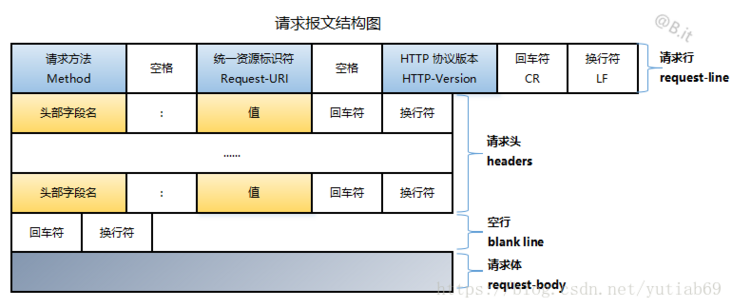
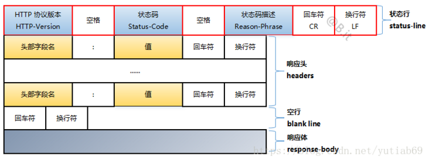
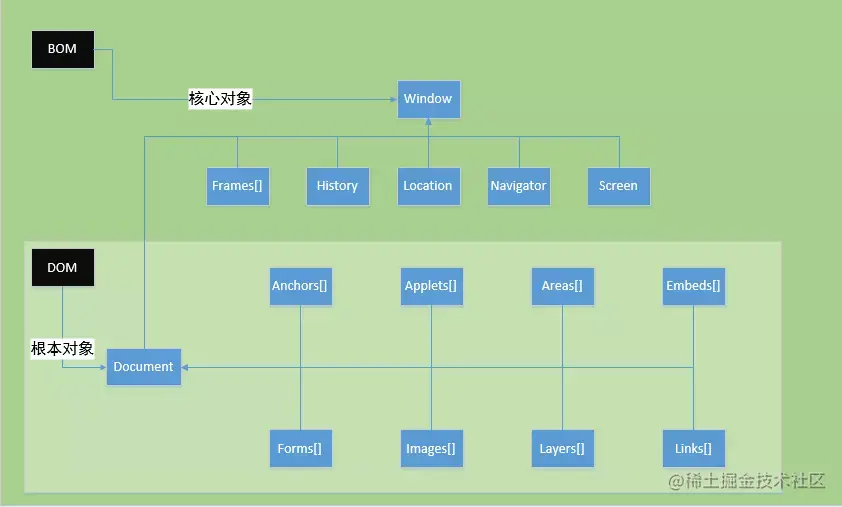
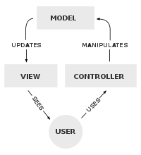

# Рубежка №1

## Билет 1

- LESS / SASS / SCSS. Особенности, отличия, поддержка браузерами
  - Особнность: 
    - Sass — динамический язык стилей. Он имеет больше функций, чем css (такие как переменные, вложенность, вычисление, микширование (Mixin), наследование, обработка цвета, функции и т. д.), его легче читать.  
    Sass 是一种动态样式语言。比css比多出好些功能(如变量、嵌套、运算,混入(Mixin)、继承、颜色处理，函数等)，更容易阅读 
    - Синтаксис Sass очень неинтуитивен и не может быть совместим с синтаксисом CSS, поэтому синтаксис Sass был улучшен, и Sass 3 стал Scss (Sassy CSS).  
    Sass的语法很不直观，不能与CSS语法兼容，因此Sass语法进行了改良，Sass 3就变成了Scss(Sassy CSS)。 
    - SCSS (Sassy CSS) — это расширение синтаксиса CSS. Это означает, что каждый допустимый CSS также является допустимым оператором SCSS, совместимым с исходным синтаксисом, за исключением того, что исходный отступ заменен на {}  
    SCSS(Sassy CSS)是CSS语法的扩展。这意味着每一个有效的CSS也是一个有效的SCSS语句，与原来的语法兼容，只是用{}取代了原来的缩进 
    - Less также является динамическим языком стилей. CSS наделен динамическими функциями языка, такими как переменные, наследование, операции и функции. Less может работать как на стороне клиента (с поддержкой IE 6+, Webkit, Firefox), так и на стороне сервера (с Node.js).  
    Less也是一种动态样式语言。对CSS赋予了动态语言的特性，如变量，继承，运算， 函数。Less 既可以在客户端上运行 (支持IE 6+, Webkit, Firefox)，也可在服务端运行 (借助 Node.js)。
    - Браузеры могут не поддерживать их таблицы стилей, нужно преобразует в CSS при помощи транслятора  
      浏览器可能不支持他们的样式表，你需要使用编译器转换成 CSS 
- Отчличия:
  1. Среда компиляции отличается 编译环境不一样  
    Sass обрабатывается на стороне сервера, а Less необходимо преобразовать в CSS для обработки в браузере.  
    Sass是在服务端处理的，而Less是需要转为CSS到浏览器处理
  2. Знак переменных разный 变量符不一样  
    Less - `@`  
    Scss - `$`
  3. Выходные настройки разные 输出设置不一样
    В Less нет выходных настроек, а в Scss есть 4 варианта: `nested`, `compact`, `compressed`, `expanded`  
    Less 没有输出设置，而 Scss 有 4 个选项：`nested`, `compact`, `compressed`, `expanded` 
  4. Условные операторы 条件语句
    В Sass есть `if{}else{}`, `for{}`, а в Less нет.
  5. библиотека инструментов отличается 工具库不同

- Java SE, Java EE, Java ME. Платформа Java EE, понятие контейнера и компонента
  - JavaSE может разрабатывать и развертывать приложения Java для использования в настольных, серверных, встроенных средах и средах реального времени. Это основа EE и ME, а также конкретная реализация jdk, jvm и собственной коллекции API.  
    JavaSE 可以开发和部署在桌面、服务器、嵌入式环境和实时环境中使用的 Java 应用程序。是EE，和ME的基础，是 jdk，jvm 以及自带的 api 合集的具体实现
  - JavaEE на самом деле представляет собой набор спецификаций, разработанных на основе JavaSE (например, как инкапсулировать классы, какой метод использовать для обработки запросов веб-страниц и т. д.)  
    JavaEE，其实是基于 JavaSE 发展而来的一套规范（比如类怎么封装，网页的请求要用什么方法处理等等）
  - JavaME представляет собой набор спецификаций API-интерфейса, разработанных специально для встраиваемых устройств (таких как мобильные телефоны, КПК, ТВ-приставки, принтеры и т. д.)  
    JavaME 是一套运行专门为嵌入式设备（例如手机、PDA、电视机顶盒和打印机等）设计的api接口规范
  - Контейнер - среда работы комронента. Он управляет жизнь и взаимодействие компонент  
    容器——组件的环境。 它管理组件的生命和交互
  - Компонента - выполняет задание. Они не может взаимодействовать без контейнера  
    组件 - 执行任务。 没有容器就无法交互

  - Структура HTTP запроса, передающего логин и пароль пользователя

    
    
    логин и пароль пользователя в URL(login и password)  
    `POST /index.html?username=username&password=password HTTP/1.1`

## Билет 2

  - ECMAScript - особенности, типы данных, инструкции.
    - это встраиваемый расширяемый не имеющий средств i/o язык программирования, используемый в качестве основы для построения других скриптовых языков  
      它是一种可嵌入、可扩展的 I/O 编程语言，用作构建其他脚本语言的基础
    - типы данных
      - примитивные: `Number`, `String`, `Boolean`, `Null`, `Undefined`
      - составные: `Object`, `List`, `Reference`
    - 15 инструкции: Блок, переменное, выражение, цикл, исключение и так далее. В ES6 есть Класс  
      15 条指令。 块、变量、表达式、循环、异常等等。 ES6 还有一个类
  - Правила трансляции JSP.
    - Обычные html и текст или `<%=expression%>` будет в out.print()
    - `<%java code%>` в `_jspService()` и наконец вызовываться `service()`
    - `<%! Field/Method Declaration %>` переводят в поля или метод servlet
    - `<%@ %>` управляет процесс трансляции

  - Написать код HTML-страницы, отправляющей номер вопроса и выбранный вариант ответа (латинская буква от "A" до "F") после получения некоего текста.  
    编写一个 HTML 页面，在收到一些文本后发送问题编号和所选答案（从“A”到“F”的拉丁字母）。
    ```html
    <body>
    <script>
    function send(){
    	let answer = document.getElementById("answer").value;
    	let pattern = /^(A|B|C|D|E|F)$/g
    	if(pattern.test(answer)){
    		let form = document.getElementById("form");
    		let data = new FormData(form)
    		let request = new XMLHttpRequest();
    		request.open("POST","url");
    		request.send()
    	}
    }
    </script>
    <form id = "form" method = "post" action = "url" onsubmit = "send()">
    	<input type = "text" id = "answer">
    	<button type = "submit" onclick="send()">submit</button>
    </form>
    <body>
    ```

## Билет 3

  - методы HTTP
    `get`, `post`, `delete`, `head`, `put`, `options`

  - жизненный цикл servlet
    1. Загрузка класса 加载类
    2. Создать экземплар 实例化
    3. вызов `init()`
    4. вызов `service()`
    5. вызов `destroy()`

  - написать на JS функцию, которая на странице заменяет все тестовые поля ввода на кнопки 
    用 JS 编写一个函数，用页面上的按钮替换所有测试输入字段
    ```javascript
    function replaceAllTextInputs(){
        Array.from(document.querySelectorAll("input[type=text], textarea"))
            .forEach(input => {
                let button = 		document.createElement('button').setAttribute("value",input.value);
                input.replaceWith(button);
            });
    }
    ```
  
## Билет 4

  - коды состояния HTTP HTTP 状态码
    - 1 - informational
    - 2 - success
    - 3 - redirection
    - 4 - client error
    - 5 - server error

  - Фильтры запросов. Реализация пред и пост обработки запросов  
    请求过滤器。请求前后处理的实现
    - Изменяем его url-pattern. Если в него клиент то пост, если в него servlet то пред

  - написать css правило, которое повернёт все картинки в форме с id=sampleForm на 90 градусов по часовой стрелке  
    编写一个 css 规则，将 id=sampleForm 形式的所有图像顺时针旋转 90 度
    ```css
    #sampleForm img{
    ​    transform: rotate(90deg)
    }
    ```

## Билет 5

  - Структура Html-документа
    ```html
    <!DOCTYPE html> <!--заявление о документе-->
    <html>

        <head>
            <meta charset="utf-8">
            <!--заголовок, содержит метаинформацию о документе-->
        </head>

        <body>
        ​    <!--тело документа, содержит все содержимое видимой страницы-->
        </body>
    
    </html>
    ```
    
  - Servlet - особенности, отличия от CGI/ FastCGI
    - CGI
      - 当用户访问我们的 Web 应用时，会发起一个 HTTP 请求。最终 Web 服务器接收到这个请求
      - Web 服务器创建一个新的 CGI 进程。在这个进程中，将 HTTP 请求数据已一定格式解析出来，并通过标准输入和环境变量传入到 URL 指定的 CGI 程序（PHP 应用 `$_SERVER`） 
      - Web 应用程序处理完成后将返回数据写入到标准输出中，Web 服务器进程则从标准输出流中读取到响应，并采用 HTTP 协议返回给用户响应
    - FastCGI
      - FastCGI 允许应用服务进程复用同一个监听端口，多线程并行处理请求
      - FastCGI 进程管理器启动时会创建一个 主（Master） 进程和多个 CGI 解释器进程（Worker 进程），然后等待 Web 服务器的连接。
      - Web 服务器接收 HTTP 请求后，将 CGI 报文通过 套接字（UNIX 或 TCP Socket）进行通信，将环境变量和请求数据写入标准输入,转发到 CGI 解释器进程。
      - CGI 解释器进程完成处理后将标准输出和错误信息从同一连接返回给 Web 服务器。
      - CGI 解释器进程等待下一个 HTTP 请求的到来。
    - Servlet только занимает один процесс с могими потоками чтобы контролировать запросы. А CGI один запрос, один процесс.Eсли в FastCGI , так, как вы сами напишете
      - 特性：
        - Servlet 具备 Java 的平台无关性
        - 高效，每次调用 Servlet 时并不是新启用一个进程，而是在一个 Web 服务器的进程中共享和分离线程
      - 原理
        - 首先，由客户端发起请求。
        - 然后，Servlet 容器接收到客户端的请求，解析请求协议和数据，如果 servlet 程序还没有被加载，就会执行加载过程并调用 service() 方法，否则直接调用 service() 方法。
        - 最后，如果关闭Servlet容器时，这个时候，Servlet 容器就会根据契约，调用 destroy() 方法，该方法一般都用来编写一些释放资源的逻辑
  
  - Написать CSS правило, которое будет обводить все картинки в классе news в рамку при наведении мышю  
    编写一个 CSS 规则，在悬停时将新闻类中的所有图像框在一个框架中
    ```css
    .news img:hover{
    ​	  border:5px solid black;
    }
    ```
  
## Билет 6

  - Super agent

    - Superagent is a powerful and well-readable lightweight ajax API, a library about HTTP, Easy to learn and use  
      Superagent 是一个强大且易读的轻量级 ajax API，一个关于 HTTP 的库，易于学习和使用

      ```javascript
      var superagent = require('superagent');

      superagent
          .post('/api')
          .send({
              'key': 'value'
          })
          .set('header_key', 'header_value')
          .end(function(err, res) {
              if (err) {
                  //产生错误执行语句
              } else {
                  //执行语句
              }
          })
      ```

  - Шаблоны проектирования, архитектурные, для чего нужны, разница 设计模式、架构、它们的用途、区别  
    - проектирования - повторная архитектурная контрукция как решение типовой проблемы  
      设计模式——重新架构设计作为一个常见问题的解决方案 
    - архитекрурные: Более высокий уровень. Дело обычно с целыми компонентами или модуль. Описывают структуру всей системы или приложения
      架构——更高的级别。 这种情况通常是描述整个系统或应用程序的组件或模块

  - Jquery ajax запрос на сервлет, ответ от сервлета - объект json, вывести на страницу firstname, lastname, img_url
    ```javascript
    $.ajax({
      ​	url: "url of servlet"
      ​	data: {img_url: 'img_url',lastname:'lastname',firstname:'firstname'}
      ​	dataType: "json"
    })
    ```

## Билет 7

  - DOM и BOM
    - DOM（document object model） 是文档对象模型，处理网页内容的方法和接口，是针对 XML 的基于树的API。描述了处理网页内容的方法和接口，是HTML和XML的API，DOM把整个页面规划成由节点层级构成的文档

      
    - BOM（browser object model） 是浏览器对象模型，提供与浏览器交互的方法和接口，例如跳转到另一个页面、前进、后退、获取屏幕的大小之类的参数等

      

  - Управление сессией. HttpSession.
    - Session：在计算机中，尤其是在网络应用中，称为“会话控制”。Session对象存储特定用户会话所需的属性及配置信息。这样，当用户在应用程序的 Web 页之间跳转时，存储在Session对象中的变量将不会丢失，而是在整个用户会话中一直存在下去。当用户请求来自应用程序的 Web页时，如果该用户还没有会话，则Web服务器将自动创建一个 Session对象。当会话过期或被放弃后，服务器将终止该会话
    - Создание: 
      1. 对于 php: 首先使用`session_start()`函数，PHP 从 session 仓库中加载已经存储的 session 变量，当执行PHP脚本时，通过使用`session_register()`函数注册 session 变量，当 PHP 脚本执行结束时，未被销毁的 session 变量会被自动保存在本地一定路径下的 session 库中，这个路径可以通过 php.ini 文件中的session.save_path 指定，下次浏览网页时可以加载使用
      2. 对于 Jsp: 若当前页面为浏览器（客户端）访问 web 应用的第一个资源页面且 Jsp的 Page 指定的 Session 属性的值为 true
      3. 对于 Servlet: 若当前 Servlet 为浏览器（客户端）访问 web 应用的第一个资源时，使用 `request.getSession()` 或 `request.getSession(true)` 创建
    - Получение: Получить из Cookie
    - Destroy: `session.invalidate()` или в элементе <session-timeout> определяет время жизни
  - Написать JS-функцию, которая запрещает вводить любые символы, кроме цифр и букв латинского алфавита 
    ```javascript
    function fixValue(){
    ​    if (this.value.match(*/[ ^ a-z0-9]/ig*) !== null)
            ​this.value = '';
    }  

    function setValidation(){      
    ​    let inputs = document.querySelectorAll('input[type=text], input[type=email], input[type=password], textarea');  
    ​    Array.from(inputs).forEach( 
            ​input => {     
    ​            input.addEventListener('input', fixValue)
    ​       } 
    ​    );
    }
    ```

## Билет 8

  - CSS : назначение, правила, приоритеты
    - Cascading Style Sheets (CSS) is a style sheet language used for describing the presentation of a document written in a markup language such as HTML or XML.

    ```css
    Selector {
        key : value
    }
    ```

    - приоритеты
      - 继承性（Inheritance）：CSS 的继承特性指的是应用在一个标签上的那些 CSS 属性（Attributes）被传到其子标签上
      1. 最近的祖先样式比其他祖先样式优先级高
        ```html
        <!-- 类名为 son 的 div 的 color 为 blue -->
        <div style="color: red">
            <div style="color: blue">
                <div class="son"></div>
            </div>
        </div>
        ```
      2. 标签直接拥有的属性比从祖先那里继承来的属性优先级高
        ```html
        <!-- 类名为 son 的 div 的 color 为 blue -->
        <div style="color: red">
            <div class="son" style="color: blue"></div>
        </div>
        ```
      3. 优先级关系：内联样式 > ID 选择器 > 类选择器 = 属性选择器 = 伪类选择器 > 标签选择器 = 伪元素选择器  
        inline style > ID selector > class selector = attribute selector = pseudo class selector > tag selector = pseudo element selector
      4. 计算选择符中 ID 选择器的个数（a），计算选择符中类选择器、属性选择器以及伪类选择器的个数之和（b），计算选择符中标签选择器和伪元素选择器的个数之和（c）。按 a、b、c 的顺序依次比较大小，大的则优先级高，相等则比较下一个。若最后两个的选择符中 a、b、c 都相等，则按照"就近原则"来判断
      5. 属性后插有 `!important` 的属性拥有最高优先级。若同时插有 `!important`，则再利用规则 3、4 判断优先级

  - MVC : назначение, элементы, примеры реализации

    
    - MVC 是软件工程中的一种软件架构模式，把软件系统分为三个基本部分：模型（Model）、视图（View）和控制器（Controller）
      - 模型（Model） - 程序员编写程序应有的功能（实现算法等等）、数据库专家进行数据管理和数据库设计(可以实现具体的功能)
      - 视图（View） - 界面设计人员进行图形界面设计
      - 控制器（Controller）- 负责转发请求，对请求进行处理
    - JavaScript 范例
      ```javascript
      /** 模拟 Model, View, Controller */
      var M = {}, V = {}, C = {};

      /** Model 负责存放资料 */
      M.data = "hello world";

      /** View 负责将资料输出给用户 */
      V.render = (M) => { alert(M.data); }

      /** Controller 作为连接 M 和 V 的桥梁 */
      C.handleOnload = () => { V.render(M); }

      /** 在网页读取的时候呼叫 Controller */
      window.onload = C.handleOnload;
      ``` 
    - Основная цель применения этой концепции состоит в отделении [бизнес-логики](https://ru.wikipedia.org/wiki/Бизнес-логика) (*модели*) от её визуализации.За счёт такого повышается возможность [повторного использования кода](https://ru.wikipedia.org/wiki/Повторное_использование_кода).  
      应用这个概念的主要目的是将业务逻辑（模型）与其可视化分离，因此增加了代码重用的可能性。

  - Реализовать функцию на JavaScript, которая будет закрывать текущее окно, если в нем открыт [https://www.google.ru](https://www.google.ru/) ([Возможный ответ](http://pastebin.com/72gLeMH7))
    实现一个 JavaScript 函数，如果 [https://www.google.ru](https://www.google.ru/) 在其中打开，该函数将关闭当前窗口
    ```javascript
    // Реализовать функцию на JavaScript, которая будет закрывать текущее окно, если в нем открыт https://www.google.ru
 
    function close(){
        let isGoogle = documet.URL.match(/^https?:\/\/(www\.)?google\.com(\/.*)?$/ig);
        if (isGoogle)
        window.close();     
    }
    ```

## Билет 9

  - AJAX и DHTML - описание, сходства и различия

    - DHTML: Css, JS, Dom, HTML. Динамичеки изменяет страницу при операции позователя 
      在调用者操作时动态更改页面
    - AJAX: `XmlHttpRequest()`. Отправить запрос в север, и потом динамически изменять страницу на основе ответа.
      向服务器发送请求，然后根据响应动态更改页面。
    - Все могут динамичеки изменять страницу 
      都可以动态改变页面
    - DHTML все операции совершенны в клиенте.  AJAX взаймодействует с сервером  
      DHTML 的所有操作都在客户端完成，而 AJAX 需要与服务器交互

  - Какие проблемы возникают при параллельной  обработке запросов в JSP, как этого можно избежать?  
    JSP 并行处理请求会出现什么问题，如何避免？ 
    Может быть конфликты. Непредсказуемые процесс программы и результаты. Можем делать асихронно или `savebuy()`.  
    可能会有冲突。 不可预测的程序过程和结果。 我们可以异步（asynchronously）或 `savebuy()` 来完成
  - Написать js функцию, которая заменяет содержимое с именем класса "nyan" на изображение по ссылке:  
    编写一个 js 函数，将类名“nyan”的内容替换为链接处的图片：http://www.example.com/nyancat.gif ([Возможный ответ](http://pastebin.com/HFiFU850))
    ```javascript
    // Написать js функцию, которая заменяет содержимое <div> с именем класса "nyan"  
    // на изображение по ссылке: http://www.example.com/nyancat.gif   

    function replaceWithNyan(){    
        let img = document.createElement('img');  
        img.src = 'http://www.example.com/nyancat.gif';   
        Array.from(document.querySelectorAll('.nyan')).forEach(   
            div => {       
                div.innerHTML = '';       
                div.appendChild(img);     
            }      
        );     
    }
    ```
## Билет 10

  - Rest и RPC

    - REST будет использовать все методы HTTP, а RPC только будет использовать Get и  Post  
      REST 将使用所有 HTTP 方法，而 RPC 将仅使用 Get 和 Post
    - Rest - подход к архитектуре сетевых протоколов, обеспечивающих доступ к ресурсам
      一种提供资源访问的网络协议架构方法 
    - RPC - подход, основенный на вызове удаленных процедур  
      基于远程过程调用的方法

  - RequestDispatcher

    - Полученны из контекста(абсолютная путь) или request(абсолютная или относительная)  
      从上下文（绝对路径）或请求（绝对或相对）获取
    - dispatch the request to another resource with `forward()`;  
      使用 `forward()` 将请求分派到另一个资源

  - Правило css, меняющее цвет фона на желтый, если ссылка посещена и не лежит в классе "news" ([Возможный ответ](http://pastebin.com/Y9Crhmaq))
    ```css
    not(.news)>a:visited {
        color: yellow;
    }
    ```

## Билет 11

  - javascript, особенности, что для чего и тд
    - javascript is a script language based on objects and events, it defines the behaviors of websites
    - 解释型语言（interpreted language），边运行边解释
    - 基于对象
    - 弱类型的
    - 动态的
    - 跨平台的（仅需浏览器支持，无需通过 web 服务器）

  - JSP actions

    - XML-элемент, позволяющие управлять поведением сервлет  
      用于控制 servlet 行为的 XML 元素  
      `<jsp : action attribute = "value"/>`

  - php скрипт, который достаёт из get запроса имя и фамилию и приветствует пользователя, выводя html страницу ([Возможный ответ](http://pastebin.com/pWbJWbM5))
    ```php
    <?php     
    $name = $_GET['name'];     
    echo 'Hello ' . ($name?$name:'noname');
    ?>
    ```

## Билет 12:

  - структура протокола http, характеристики  http协议结构、特点
    - 结构
     
      
      

      Сообщение(запрос и ответ, они все состоят из стартовой строки, заголовка и тело) и соединение. И каждый запрос имеет свой TCP соединение.  
      消息（请求和响应，它们都由起始行、标题和正文组成）和连接。 每个请求都有自己的 TCP 连接。
    - 特点
      - 支持客户/服务器模式
      - 简单快速：客户向服务器请求服务时，只需传送请求方法和路径，因而 HTTP 服务器的程序规模小，通信速度很快
      - 灵活：HTTP允许传输任意类型的数据对象。正在传输的类型由 Content-Type 加以标记
      - 无连接：无连接的含义是限制每次连接只处理一个请求。服务器处理完客户的请求，并收到客户的应答后，即断开连接。采用这种方式可以节省传输时间
      - 无状态：HTTP协议是无状态协议。无状态是指协议对于事务处理没有记忆能力。缺少状态意味着如果后续处理需要前面的信息，则它必须重传，这样可能导致每次连接传送的数据量增大。另一方面，在服务器不需要先前信息时它的应答就较快

  - жизненный цикл jsp

    - Трансляция в сервлет
    - компиляция сервлета
    - загразка класса сервлета
    - создать экземпляра сервлета
    - вызов jspinit()
    - вызов jspService()
    - вызов jspDestroy

  - написать на php класс ([Возможный ответ](http://pastebin.com/qy4x8CTa))
    ```php
    class User{
        private $userName;
        private $age;

        function __constuctor($userName, $age){
        ​    $this->userName = $userName;
        ​    $this->age = $age;
        }

        function whois(){
        ​    return 'Name: ' . $this->userName . '\nAge: ' . $this->age;
        }
    }
    ```

## Билет 13

- AJAX 是一种在无需重新加载整个网页的情况下，能够更新部分网页的技术
  - 优点
    - 能在不刷新整个页面的前提下与服务器通信维护数据。这使得Web应用程序更为迅捷地响应用户交互，并避免了在网络上发送那些没有改变的信息，减少用户等待时间
    - AJAX 使用异步方式与服务器通信，不需要打断用户的操作，具有更加迅速的响应能力。优化了 Browser 和S erver 之间的沟通，减少不必要的数据传输、时间及降低网络上数据流量
    - AJAX 可以把以前一些服务器负担的工作转嫁到客户端，利用客户端闲置的能力来处理，减轻服务器和带宽的负担，提升站点性能
    - AJAX 使 WEB 中的界面与应用分离（也可以说是数据与呈现分离），有利于分工合作、减少非技术人员对页面的修改造成的WEB应用程序错误、提高效率、也更加适用于现在的发布系统
  - 缺点：
    - 在动态更新页面的情况下，用户无法回到前一个页面状态
    - AJAX 暴露了浏览器与服务器交互的细节
    - 对搜索引擎的支持比较弱。如果使用不当，AJAX 会增大网络数据的流量，从而降低整个系统的性能
    - 破坏程序的异常处理机制
    - AJAX 不能很好支持移动设备

  - Экономия трафика, уменшение нагрузка на сервер, ускорение реакции интерфейса
  - усложение проекта, требуется javascript, отсутствие интеграции со стандартными инструментами браузера

- Директива page: назначение, особенности, атрибуты
  - JSP страница может послать сообщение соответствующему контейнеру с указаниями действий, которые необходимо провести. Эти сообщения называются директивами.  
  JSP 页面可以向适当的容器发送一条消息，其中包含有关操作的说明。 这些消息称为指令
  - Все директивы начинаются с <%@, затем следует название директивы и один или несколько атрибутов со значениями, и заканчиваются %>. Форму записи директив можно изобразить следующим образом:  
    所有指令均以 <%@ 开头，后跟指令名称和一个或多个属性值，并以 %> 结尾。指令的形式可以表示如下：
  - `<%@ directive attribute = "value" %>`
  - 页面指令选项
    - import	使一个JAVA导入声明被插入到最终页面文件。
    - contentType	规定了生成内容的类型。当生成非HTML内容或者当前字符集并非默认字符集时使用。
    - errorPage	处理HTTP请求时，如果出现异常则显示该错误提示信息页面。
    - isErrorPage	如果设置为TRUE，则表示当前文件是一个错误提示页面。
    - isThreadSafe	表示最终生成的servlet是否具有线程安全性。

- Написать конфигурацию сервлета (org.xxx.MyServlet) с помощью аннотации. Сервлет должен принимать все запросы от файлов .html .xhtml  
  使用注释编写 servlet 配置 (org.xxx.MyServlet)。 servlet 必须接受来自 .html .xhtml 文件的所有请求
  ```java
  @WebServlet(name = "org.xxx.MyServlet", value = "/servlet")
  ```

## Билет 14

  - структура http запроса

    
    

  - типы данных php

    `interger`, `float`, `double`, `boolean`, `string`, `NULL`

  - сервлет перенаправляющий все запросы на страницу google  
    将所有请求重定向到谷歌页面的 servlet（[Возможный ответ](http://pastebin.com/EnTVLpNG)）
    ```java
    class ToGoogleServlet extends HttpServlet{
    ​    public void service(HttpServletRequest request, HttpServletResponse response) throws IOException, ServletException{
            ​response.sendRedirect("http://google.com;")
    ​    }
    }
    ```

## Билет 15

  - Php, особенности и запуск
    - PHP is a open-soursce general-perpose scripting language, suitable for web development, and can be embedded in HTML, often used ny developers to write dynamic page.
    - characteristics
      - OOP
      - type-weak language
      - Cross-platform, run on web server
      - simple gramma
    - runing
      - Scanning: convert php code to language tokens
      - Parsing: convert tokens to meaningful expression
      - Compilation: compile expretion to opcodes
      - Execution: execute opcodes in order, to realize php funxtions

  - Long Polling vs WebSockets

    Long polling is much more resource intensive on servers whereas WebSockets have an extremely lightweight footprint on servers. Long polling also requires many hops between servers and device
    长轮询在服务器上占用的资源要多得多，而 WebSockets 在服务器上的占用空间非常小。 长轮询还需要在服务器和设备之间进行多次跳转

  - Написать JSP страницу, которая будет возвращать количество сессий, обратившихся к ней за последние 60 секунд и формировать вывод в HTML 
    编写一个 JSP 页面，该页面将返回在过去 60 秒内访问它的会话数并以 HTML 格式生成输出

    в jsp

    ```jsp
    <%Enumeration e = session.getAttributeNames();
        int count = 0;
        while(e.hasMoreElements()) {
            count = count+1;
            e.nextElement();
        }
        response.getWriter().println(e);
    %>
    ```

    в xml

    ```xml
      <session-config>
        <session-timeout>60</session-timeout>
      </session-config>
    ```

## Билет 16:

  - элементы JSP  
    `<%-- omment --%>` `<%@ directive %>` `<%! decl%>` `<% code %>` `<%= expression%>`
  - CGI - обработка запроса, преимущества и недостатки  
    - Вызов программ на севере использователем. Каждый запрос обрабатывается одельным процессом СGI-прогораммы  
    用户调用服务器上的程序。 每个请求都由一个单独的 CGI 程序进程处理
    - Преимущества: программы могут быть написаы на множестве языков  
      优点：可以用多种语言编写程序  
      исключены конфликты при параллельной обработке   ​нескольких запросов  
      消除了并行处理多个请求时的冲突
    - Недостатки: Высокие расходы. Слабое разделение уровня представления и бизнес-логики 
      缺点：成本高。 表示层和业务逻辑之间的弱分离

  - Написать сервлет, который принимает из http запроса параметр name и выводит его. Если параметр не обнаружен то вывести Anonymous user  
    编写一个从 http 请求中获取名称参数并将其输出的 servlet。 如果未找到该参数，则显示匿名用户 ([Возможный ответ](http://pastebin.com/tHgjJSLz))
    ```java
    import java.io.PrintWriter;
    import java.io.IOException;
    import javax.servlet.ServletException;
    import javax.servlet.http.HttpServlet;
    import javax.servlet.http.HttpServletRequest;
    import javax.servlet.http.HttpServleResponse;
    
    
    class HelloServlet extends HttpServlet{
        public void service(HttpServletRequest request, HttpServletResponse response) throws IOException, ServletException{
            response.setContentType("text/html; charset=UTF-8");
    
            String name = request.getParameter("name");
            PrintWriter out = response.getWriter();
    
            name = name==null?"Anonymous user":name;
            out.println("<h1>Hello " + name + "</h1>");
            out.close();
        }
    }
    ```

## Билет 17:

  - FastCGI. Плюсы, минусы, отличия от CGI
    - Безопасность, высокая стабильность, быстрее 
      安全、高稳定、更快  
    - Не может работать долго, иначе север его убирает.  
      它不能长时间工作，否则服务器将其删除。
    - Все запросы могут обрабатываться одним процессом 
      所有请求都可以由一个进程处理
  - Суперглобальные массивы в PHP (SuperGlobal massive)  
    Предопределённые массивы, имеющие глобальную область видимости  PHP 中的超全局数组 (SuperGlobal massive)
    - `$_GLOBALS` - массив всех глобальных переменных 所有全局变量的数组
    - `$_SERVER` - параметры, которые ОС передаёт серверу при его запуске 操作系统启动时传递给服务器的参数
    - `$_ENV` - переменные среды ОС 操作系统环境变量
      `$_POST, $_GET, $_COOKIE, $_REQUEST, $_FILE, $_SESSION`
  - Страница JSP, проверяющая есть ли /какой-то параметр/ в запросе и если нету - выводящая сообщение об ошибке 
    检查请求中是否有/some parameter/的JSP页面，如果没有，则显示错误消息 ([Возможный ответ](http://pastebin.com/9yVFXZku))
    ```java
    <%-- Страница JSP, проверяющая есть ли /какой-то параметр/ в запросе и если нету - выводящая сообщение об ошибке  --%>
 
    <%@ page contentType="text/html; charset=UTF-8" language="java"%>
    <%= request.getParameter("parameterName")==null?"400 - your did not set parameter":request.getParameter("parameterName")  %>
    ```

## Билет 18

  - ООП в PHP

    Как java в PHP тоже есть класс. Наследование тоже не запрещено. Могут решить проблемы при создании экземплар.
    和java一样，PHP也有一个类。 继承也不被禁止。 可以解决创建实例时的问题。

    ```php
    <?php
    class phpClass {
      var $var1;
      var $var2 = "constant string";
      
      function myfunc ($arg1, $arg2) {
        [..]
      }
      [..]
    }
    ?>
    ```

  - Предопределенные переменные JSP

    Суперглобальные массивы в PHP (SuperGlobal massive)

  - Код фильтра запросов, запрещающий доступ к приложению неавторизированным пользователям(у неавт пол в запросе отсутствует заголовок x-application-user)  
    拒绝未经授权用户访问应用程序的请求过滤器代码（请求中的非授权字段没有 x-application-user 标头）  ([Возможный ответ](http://pastebin.com/qTuT55Fg))
    ```java
    import java.io.*;
    import javax.servlet.*;
    import javax.servlet.http.*;
    
    // Код фильтра запросов, запрещающий доступ к приложению неавторизированным
    // пользователям(у неавт пол в запросе отсутствует заголовок x-application-user)
    
    class AuthFilter extends ServletFilter{
            public void init(FilterConfig config){}
    
            public void doFilter(ServletRequest request, ServletResponse response, FilterChain chain) throws IOException{
                    String auth = request.getHeader("x-application-user");
                    if (auth == null || auth.equals("")){
                            PrintWriter out = response.getWriter();
                            response.setContentType("text/html; charset=UTF-8");
                            out.println("WTF?! You are not authorized");
                    }else{
                            chain.doFilter(request, response);
                    }
    
            }
    
            public void destroy(){}
    }
    ```

## Билет 19

  - Конфигурация PHP-интеррпретатора, способы интеграции PHP-интеррпретатора с веб-сервером

    -   интеграции PHP-интеррпретатора и веб-сервер являются средой PHP. 

  - ServletContext - особенности, для чего нужен

    -  контейнер, где сохраняет все данные в одном севере. Он общое пространство для всех клиенте
    -  Получения глобальные параметры. Читения файла ресурсов проектов. Переводить запрос

  - Код jsp-страницы показывающий содержимое корзины юзера. Содержимое корзины - коллекциия объектов класса ShoppingItem который содержит имя, стоимость и количество заказанного товара - хранится в отдельном managed bean. ([Возможный ответ](http://pastebin.com/pBA7f4Zt))
    ```html
    <%@ import="my.package.ShoppingItem" %>
    <%@ import="java.util.Collection" %>
    <%@ contentType="text/html;charset=UTF-8" language="java"%>
    <jsp:useBean id="managed" class="my.package.ManagedBean" scope="session">
    <html>
    <head>
            <meta charset="utf-8">
    </head>
    <body>
    <table>
            <tr>
                    <th>name</th>
                    <th>price</th>
                    <th>count</th>
            </tr>
    <% Collection<ShoppingItem> basket = mananged.getBasket();
            for (ShoppingItem position: basket){ %>
                    <tr>
                            <td><%= position.getName() %></td>
                            <td><%= position.getPrice() %></td>
                            <td><%= position.getCount() %></td>
                    </tr>
            <%}%>
    </table>
    </body>
    ```

## Билет 20

  - HTML формы

    - cбор ввод разных видов использователя
      text, checkbox, radio, button, password
      `action = "url"` - куда отправитьs

  - конфигурация сервлетов. файл web.xml servlet 配置
    ```xml
    <servlet>
      ​	<servlet-name>name</servlet-name>
      ​	<servlet-class>classname</servlet-class> 
    </servlet>

    <servlet-mapping>
      ​	<servlet-name>name</servlet-name>
      ​	<url-pattern>/url</url-pattern>
    </servlet-mapping>
    ```

  - написать css правило, которое при клике на ссылку добавляет ей подчеркивание, всем кроме ссылок в теге h1  
    写一个 css 规则，当点击一个链接时，给它添加一个下划线，除了 h1 标签中的链接 ([Возможный ответ](http://pastebin.com/Y9Crhmaq))
    ```
    not(h1) a:active {
      text-decoration: underline;
    }
    ```

## Билет 21

  - jQuery.
    - Библиотека Javascript, чтобы легче использовать javascript 
  - Архитектуры model 1 и model 2.
    - model 1: клиент отправляет запросы jsp или сервлет. И потом то jsp (или сервлет) завершает все задания
    - model 2: обычно при MVC. Задания завершены нескольких jsp( или сервлетов)
  - Написать php скрипт, формирующий форму для ввода логина и пароля и отправляющий запрос сервису authorize.php с помощью UserAgent. Если пользователь корректный, то скрипт должен редиректить на страницу pagename.php.

## Билет 22

  - Экмаскрипт, преимущества 6й и 7й версии
    - Можно писать класс
    - Новые операции, например, функция с ->(похож на lambda в java), которые упрощают прогромирование
  - ГоФ паттерны. Что такое? Основные виды, примеры
    - Повторимая архитектурная конструкция, которая решает какую-то проблема.
    - Порождающие: builder, factory, одиночка
      Структурная: bridge, proxy, adapter, decorator
      Поведенческие: command, iterator, observer
  - Написать html страницу и сервлет, возвращающий странице количество активных сессий

## Билет 23

- обработка http с помощью servlet
  - При помощи HttpServletRequest получить запрос и делать обработку. И ответ сохраняется в HttpServletResponse  
    使用 HttpServletRequest 接收请求并进行处理。 并且响应存储在 HttpServletResponse
- многоуровневая архитектура приложения 分层应用架构
  - Presentatio: самый верхний уровень. Что мы видим
  - logic: Между другими двумя.Получать запрос, читать данные из data, делать обработку, отправить результат клиенту  
  - data:Сохранение данных
- с помощью jquery посчитать количество div с классом lecture содержащие «де-факто»  
  使用 jquery 计算包含“事实上”的讲座类的 div 数量

## Билет 24

  - ECMAScript, типы данных, особенности, инструкции
    - это встраиваемый расширяемый не имеющий средств [ввода-вывода](https://ru.wikipedia.org/wiki/Ввод-вывод) язык программирования,  для построения других скриптовых языков
    - примитивные: Number,String,Boolean, Null, Undefined  
      составные: Object, List, Reference
    - Блок, переменное, выражение, цикл, исключение и так далее. В ES6 есть Класс
  - цикл жизни jsp
    - Трансляция в сервлет
    - компиляция сервлета
    - загразка класса сервлета
    - создать экземпляра сервлета
    - вызов jspInit()
    - вызов jspService()
    - вызов jspDestroy()
  
  - html форма отправляющая номер вопроса и выбор от a до f  
    提交问题编号和从 a 到 f 的选择的 html 表单
    ```html
    <body>
        <script>
            function send(){
              let form = document.getElementById("form");
              let data = new FormData(form)
              let request = new XMLHttpRequest();
              request.open("POST","url");
              request.send()
            }
        </script>

        <form id = "form" method = "post" action = "url" onsubmit = send()>
            <input type = radio value = "a" name = "choice">a<br>
            <input type = radio value = "b" name = "choice">b<br>
            <input type = radio value = "c" name = "choice">c<br>
            <input type = radio value = "d" name = "choice">d<br>
            <input type = radio value = "e" name = "choice">e<br>
            <input type = radio value = "f" name = "choice">f<br>
        </form>
    <body>
    ```

# Рубежка №2

Это, надеюсь, сборник билетов по 2-ому рубежу 2022 по вебу. Оно обязательно заполнится…
Нумерация взята по выданным билетам, а в скобочках указан номер билета согласно этому доку.

Если вы не кидали свой билет, то докиньте. Если помните номер, тоже сообщите. Всем спасибо!

P.S. Документ в процессе редакции, попозже наведу красоту

## Билет ? (НОВЫЙ!)

## Билет 1
- Фазы jsf: Invoke Application и Render Response	
- Способы задания конфигурации в Spring	 
- Написать исходный код CDI бина, реализующего паттерн «команда» (Command Pattern)	

## Билет 2
- Принципы IoC и CDI. Реализация в Java EE	
- Архитектура Vue.js (компоненты, экземпляры, директивы)	
- JSF страница, динамически подгружаемая и выводящая новостную ленту с новостями формата: автор, заголовок, дата, иллюстрация, аннотация и полный текст(показывается при нажатии на соответствующую строчку)	

## Билет 3	
- Реализация шаблона MVC в JSF	
- Основные аннотации Java EE CDI	
- Написать React компонент формирующий таблицу пользователей, данные приходят в props	 

## Билет 4	
- Spring  Web MVC: View Resolvers	 
- Angular: ключевые особенности, отличия от AngularJS	 
- Написать веб-приложение на JSF (xhtml + CDI-бин) со списком студентов и бин, который будет реализовывать логику отчисления студентов. Напротив каждого имени студента должна быть кнопка "отчислить". Обновление должно производиться при помощи AJAX	 

## Билет 5	

- Профили и платформы Java EE	
- Типы DI в Spring	
- Интерфейс на React, формирующий две страницы с разными URL: Главную (/home) и Новости (/news). Переход между страницами должен осуществляться посредством гиперссылок.	

## Билет 6	

- Структура JSF приложения	
- Spring MVC: особенности, интеграция в Spring	
- Написать CDI Bean калькулятор, поддерживающий 4 базовые операции для целых чисел	

## Билет 7	

- Spring MVC: обработка запросов, DispatcherServlet	 
- Single Page Application(SPA): преимущества, недостатки	
- Интерфейс JSF (xhtml страница + CDI), реализующий ввод паспортных данных (серия, номер, день, место)	

## Билет 8	

- Технология RMI. Использование RMI в Java EE	 
- Управление состоянием в React. Flux & Redux	 
- Привести фрагмент кода управляемого бина, увеличивающего на 1 значение, отображаемое на кнопке при каждом клике по ней:	 
```
<h:commandButton actionListener = "#(myBean.increment)" value = "0"/>
```	 

## Билет 9	

- JNDI. JNDI в Java EE. Способы взаимодействия с JNDI. Их преимущества и недостатки.	
- React. Особенности. Архитектура	 
- Сделать бин который показывает время в минутах со старта сервера	

## Билет 10	 

- Платформы Java. Сходства и различия.  
- Двухфазные и трехфазные конструкторы в Spring и Java EE   
- Написать страницу JSF, которая бы выводила сначала 10 простых чисел, а затем с помощью Ajax запроса ещё 10.   

## Билет 11   

- Java EE CDI Beans стереотипы  
- Разметка страницы в React- приложениях. JSX   
- JSF Manager Bean, после инициализации HTTP-сессии формирующий коллекцию с  8
  содержимым таблицы Н_УЧЕБНЫЕ_ПЛАНЫ. Для доступа к БД необходимо использовать  
  JDBC-ресурс jdbc/OrbisPool.  

## Билет 12

- Location Transparency в Java EE  
- Spring MVC часть представления  
- Написать managed bean и задать ему scope такой же как у бина otherBean  

## Билет 13

- Валидаторы в JSF. Создание, назначение и тд.  
- Реализация контроллера в Spring Web MVC   
- Vue.js простейший чат бот, который на любое сообщение отвечает «сам дурак»  

## Билет 14

- Фаза формирования представления   
- Spring framework. Отличия от Java EE  
- RestController, который реализует перевод градусов Цельсия в Фаренгейты и обратно   

## Билет 15

- Java EE CDI Beans прерывание жизненного цикла (Interception)  
- Компоненты React. State & props. "Умные" и "Глупые" компоненты  
- Написать JSF страницу и многострочным полем, в которое можно вводить только стройные символы латинице.  

## Билет 16

## Билет 17

- Angular компонент, который позволяет поделиться чем-то в VK, Twitter, Facebook (API для соцсетей можно описать текстом)  

## Билет 18  
- Построение интерфейсов на JSF. Иерархия компонентов JSF.  
- Java EE CDI Beans: принципы инъекции бинов.  
- Приложение на Angular, реализующее форму для заполнения бланка на отчисление по собственному желанию. Форма должна принимать на вход имя пользователя и дату, и формировать заполненный бланк заявления (на клиентской стороне)  

## Билет 19  

- Managed Beans что это, применение, вызов из jsp/xhtml  
- Архитектура и состав Spring MVC  
- Написать на Angular интерфейс, который проверяет если ли в куки sessionid и если нет, отправляет пользователя на аутентификацию по логину и паролю  

## Билет 20  

- Контекст управляемых бинов. Конфигурация контекста бина  
- Шаблоны MVVM и MVP. Сходства и отличия от MVC  
- Компонент для React, формирующий строку с автодополнением. Массив значений для автодополнения должен получаться с сервера посредством запроса к REST API  

## Билет 21  

- REST в спринге: методы и аргументы  
- Навигация в React. React Router  
- Реализовать бронь авиабилетов на jsf  

## Билет 22  

- Класс FacesServlet - назначение, особенности конфигурации  
- Vue.js - ключевые особенности, преимущества и недостатки  
- REST - контроллер на Spring Web MVC, предоставляющий CRUD-интерфейс к таблице со списком покемонов  

## Билет 23  

- Конвертеры JSF, создание и назначение  
- Реализация model в Spring web MVC  
- Написать на vue.js интерфейс для навигации по текстовому документу, представленному в виде большой строки, должны быть реализованы переходы на следующую и предыдущую страницу  

## Билет 24  

- CDI Beans  
- Angular DI  
- JSF страничка с данными из бина  

## Билет 25  

- Шаблоны и представление в Angular  
- Dependency Lookup Spring  
- Конфигурация, чтобы JSF обрабатывал все запросы приходящие с .xhtml и со всех URL, начинающихся с /faces/  

## Билет 26  

- Process validations phase, Update module values phase  
- Жизненный цикл Spring-приложения  
- интерфейс на Angular, который выводит интерактивные часы с обновление каждую секунду  

## Билет 27  

- Реализация Ajax в jsp  
- CDI beans: контекст (Bean Scope)  
- Интерфейс реализации логин+пароль на React. На стороне сервера- Rest API

