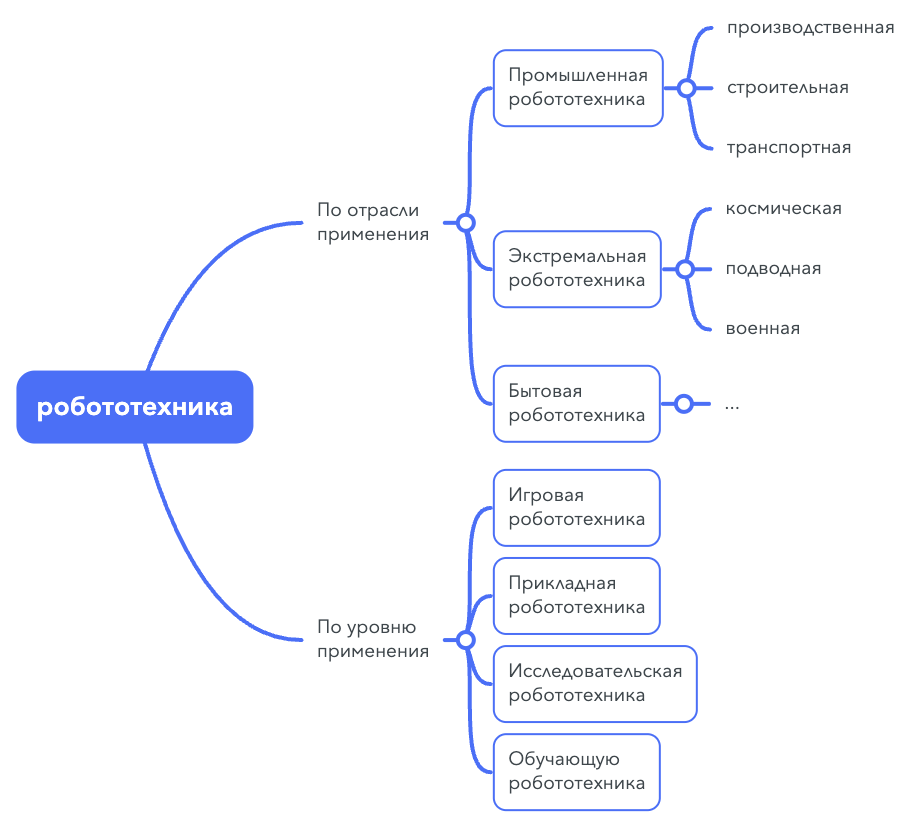
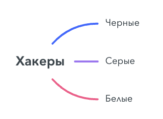

## [MainPage](../index.md)/[Rusian Language](README.md)/Homework 2

## Каталог

- [HomeWork Main](#homework-main)
  - [1 Эссе "Электронная книга или бумажная - что выбрать?"](#1-эссе-электронная-книга-или-бумажная---что-выбрать)
    - [Текст: Книга 21 века](#текст-книга-21-века)
  - [2 Описание операционных систем](#2-описание-операционных-систем)
    - [Текст: Операционные системы](#текст-операционные-системы)
  - [3 Классификация видов информации. Классификация ЭВМ.](#3-классификация-видов-информации-классификация-эвм)
    - [текст и перевод](#текст-и-перевод)
  - [4 Классификация типов темперамента](#4-классификация-типов-темперамента)
    - [текст видео](#текст-видео)
  - [5 Классификация направлений робототехники и их функции](#5-классификация-направлений-робототехники-и-их-функции)
    - [текст и перевод](#текст-и-перевод-1)
  - [6 Хакеры](#6-хакеры)
  - [7 Устная тема 1](#7-устная-тема-1)
  - [8 Эссе "Польза и вред хакерства"](#8-эссе-польза-и-вред-хакерства)
  - [9 Хакерство  (2)](#9-хакерство--2)
  - [10 Выражение роли и значения процесса/предмета](#10-выражение-роли-и-значения-процессапредмета)
  - [11 Что имеет значение в вашей жизни?](#11-что-имеет-значение-в-вашей-жизни)
  - [12 Текстовые маркеры](#12-текстовые-маркеры)
  - [13 Применение объекта.](#13-применение-объекта)
  - [14 Применение предмета](#14-применение-предмета)
  - [15 Виртуальная реальность](#15-виртуальная-реальность)
  - [16 Функциональные модели предложений (составление сообщений)](#16-функциональные-модели-предложений-составление-сообщений)
    - [1](#1)
    - [2](#2)
    - [3](#3)
    - [4](#4)
    - [5](#5)
    - [6](#6)
    - [7](#7)
    - [8](#8)
    - [9](#9)
- [HomeWork Dop](#homework-dop)
  - [HomeWork 1](#homework-1)
  - [HomeWork 2](#homework-2)
  - [HomeWork 3](#homework-3)
  - [HomeWork 4](#homework-4)
  - [HomeWork 5](#homework-5)
  - [HomeWork 6](#homework-6)
  - [HomeWork 7](#homework-7)
  - [HomeWork 8](#homework-8)
  - [HomeWork 9](#homework-9)
  - [HomeWork 10](#homework-10)
  - [HomeWork 11](#homework-11)
  - [HomeWork 12](#homework-12)
    - [3 Пишите, от каких глаголов образованы данные существительные. Скажите, что делают/делали эти люди?](#3-пишите-от-каких-глаголов-образованы-данные-существительные-скажите-что-делаютделали-эти-люди)
    - [4 Соедините синонимы.](#4-соедините-синонимы)
    - [5a Соедините антонимы.](#5a-соедините-антонимы)
    - [5b Дополните предложения, используя антонимы из задания 5а.](#5b-дополните-предложения-используя-антонимы-из-задания-5а)
    - [Подберите существительные к прилагательным.](#подберите-существительные-к-прилагательным)

# HomeWork Main

## 1 Эссе "Электронная книга или бумажная - что выбрать?"

Задание: Прочтите текст. На основе прочитанного напишите эссе. Ваш текст
должен содержать:
- формулировку проблемы, которую поднимает автор текста
- аргументы “за” и “против” (минимум - по 2)
- формулировку вашей позиции по отношению к данной проблеме
Эссе должно состоять из 4 частей. Текст должен содержать средства
связи предложений друг с другом (текстовые маркеры).

После появления компьютеров слова и графики можно хранить в электронных устройствах.  Так что у нас есть еще способ чтения — используя электронных устройств читать электронных книг.  В наше время, когда почти у каждого есть свой компьютер, больше и больше людей выбирают читать  электронные книги.  Заменят ли электронные книги традиционные книги?

Традиционные книги обычно хранят текстовую и графическую информацию на материальных носителях, таких как бумага или древесная стружка.  Эти носители имеют ограниченную емкость для хранения. Для хранения большого объема текста и графики требуется большое количество бумаги, дерева и других материалов.  Поэтому традиционные книги неудобно носить с собой.

Кроме того, традиционные книги неудобно извлекать.  Когда большое количество книг хранится вместе, нам трудно найти ту, которую мы хотим читать.

Поэтому по сравнению с традиционными книгами, электронные книги намного удобнее.  Электронные книги хранятся на электронных устройствах в виде файлов.  Электронное устройство размером с журнал, способное хранить миллионы электронных книг.  Кроме того, благодаря популярности Интернета мы можем скачивать и читать бесконечное количество книг через Интернет. 

Что еще более важно, поскольку электронные книги хранятся в электронном виде, нет необходимости потреблять бумагу и деревья.  Поэтому популярность электронных книг также имеет большое значение для защиты окружающей среды.

Хотя электронные книги удобны, но и есть недостатки.  Во-первых, для использования электронных устройств требуется электричество, без электричества нельзя читать электронные книги. Во-вторых, длительное использование экрана монитора вредно для зрения.  Более того, электронные книги не имеют аромата бумажных книг, и электронные книги не нуждаются в перелистывании страниц, как бумажные книги, поэтому при чтении электронных книг нет ощущения чтения традиционных бумажных книг.

Несмотря на эти недостатки электронных книг, я больше склоняюсь к чтению электронных книг.  Во-первых, портативность электронных книг, на мой взгляд, очень важна.Когда я учился в школе, мне приходилось каждый день нести в школу тяжелую сумку, и мне нужно было носить несколько книг по каждому предмету. Это тяжелое бремя. Но теперь мне нужно только носить с собой планшетный компьютер, чтобы удовлетворить все потребности курса, и я также могу использовать электронную ручку, чтобы делать отметки в книге.  И благодаря популярности облачных хранилищ мои книги и отметки никогда не будут потеряны.

И с развитием технологии отображения появился новый тип дисплея.  Такой дисплей сам не излучает свет, а использует магнитную силу, чтобы притягивать чернила к экрану для отображения контента.  Поэтому экран выглядит как бумажная книга.  А поскольку сам экран не излучает свет, такой экран потребляет меньше энергии.Если экран не обновляет отображаемое содержимое, то такой экран почти не потребляет энергии.  Поэтому нам больше не нужно беспокоиться об энергопотреблении и повреждении зрения.

Подводя итог, на мой взгляд, замена традиционных книг электронными будет тенденцией в будущем.

### Текст: Книга 21 века

В 20 веке в мир пришёл Компьютер. Уже в самом начале «компьютерной эры», когда ЭВМ ещё не были персональными, поскольку имелись только в крупных научно-исследовательских институтах, начались разговоры о том, что ещё немного – и бумага вообще не будет нужной. Любые тексты и рисунки – от деловых писем до художественных книг – станут набирать на клавиатуре, хранить и передавать в электронном виде и читать прямо с экрана монитора. И только в случае крайней необходимости фрагменты такой «электронной книги» будут распечатывать на принтере.

Тогда это была лишь идея, но сегодня она превращается в реальность. Во многих странах персональная ЭВМ стала привычным бытовым устройством. Но может ли она полностью вытеснить привычную нам бумажную книгу, заменив её по всем параметрам?

Конечно, электронная книга обладает несомненными преимуществами. Современные дисплеи обеспечивают высокое качество изображения и позволяют сопровождать электронный текст не только иллюстрациями, но и звуком, и видеофрагментами. Это даёт возможность «увидеть» персонажей книги, которых до сих пор мы рисовали себе в своём воображении. Но вот совпала ли наша «картинка» с той, что предлагает компьютер, не лишает ли нас прочитанное живительной силы нашего воображения?

Электронная книга обеспечивает нам удобный поиск нужной информации. Вам не придётся долго разыскивать желаемую страницу или нужную цитату – машина сделает это за вас. Благодаря технологиям гипертекста и поиска по ключевым словам достаточно одного нажатия на кнопку мыши, чтобы найти нужную главу, получить объяснение выделенного в тексте термина. Кроме того, компьютер с лёгкостью запомнит весь путь, «пройденный» вами при чтении учебника или справочника, и позволит повторить его как вперёд, так и назад.

И, наконец, электронная книга способна хранить несколько сотен книжных томов в небольшом объёме. Наличие такой книги экономит наше время: не надо идти в библиотеку. Целая библиотека всегда находится с вами!

Немаловажно и то, что снижение доли бумажных изданий позволит сохранить леса от вырубки.

Однако у электронной книги есть и недостатки. Например, без помощи электричества вы не сможете ею воспользоваться. Кроме того, читать с экрана монитора вредно для зрения. Разрешение экрана большинства электронных книг явно недостаточно для комфортного чтения. Кое-что из названного поправимо. К примеру, современные «компьютеры на ладони» оснащены жидкокристаллическими экранами с высоким разрешением и аккумуляторами, которых хватает на несколько часов непрерывной работы. Поэтому их вполне можно, как и обычную книгу, брать с собой в дорогу. Вот только из-за высоких цен их ещё долго многие люди не смогут покупать.

Ну, и, конечно, ни одна электронная книга не способна передать запах новенькой, недавно опубликованной книги или те ощущения, которые мы испытываем, в сотый раз беря в руки старые, зачитанные до дыр, с детства знакомые книги. Щелчки компьютерной мыши никогда не заменят шелест переворачиваемых страниц. Невозможно отнять у нас потребность иногда посидеть в уютном кресле с любимой книгой в руках!

## 2 Описание операционных систем

Учебник "Информатика" с. 82 № 5 текст "Операционные системы".
Прочитайте текст, и, используя модели выражения определения, причины, характеристики, состава и функции предмета, опишите операционные системы (ОС), указанные в тексте:
- состав ОС MS DOS: [ссылка](https://classroom.google.com/c/MjI4MTI5OTc3Nzg1/m/NTYxMDQxMTc1MzQ5/details)
   ОС MS DOS состоит из блока начальной загрузки, модули расширения базовой системы ввода-вывода (Io.sys), модули обработки прерываний (MSDOS. sys), командного процессора, утилитов MS DOS.
- функции компонентов ОС MS DOS: [ссылка](https://classroom.google.com/c/MjI4MTI5OTc3Nzg1/a/NTU3OTI1MTczMTU4/details)
  Каждый копонент ОС MS DOS выполняет определённую часть функций, возложенных на ОС:

  - Единственная функция Блока начальной загрузки которой заключается в считывании с диска в оперативную память двух других частей DOS — модуля расширения базовой системы ввода-вывода и модуля обработки прерываний.
  - Модуль обработки прерываний реализует основные высокоуровневые услуги DOS
  - Утилиты DOS выполняют действия обслуживающего характера, например разметку дискет, проверку дисков и т. д.
- определение ОС Windows: [ссылка](https://classroom.google.com/c/MjI4MTI5OTc3Nzg1/a/MzU0NzkxMjk5NDc2/details)
  ОС Windows представляет собой универсальную высокопроизводительную многозадачную 32-разрядную ОС с графическим интерфейсом и расширенными сетевыми возможностями.
  
- классификацию ОС семейства Windows:  [ссылка](https://classroom.google.com/c/NTkzNjEwOTE3Mzgy/m/NTkzNjEyMTAwNzUx/details)
  ОС семейства Windows делится на Windows 95, Windows 98, Windows NT, Windows 2000, Windows XP, Windows 2003, Windows Vista, Windows CE, Windows Mobile.
- сравнительную характеристику систем семейства Windows: [ссылка](https://classroom.google.com/c/NTkzNjEwOTE3Mzgy/m/NTkzNjExNTAzMDQy/details)
  - Различие между Windows 98 и Windows 95 состоит в том, что браузер Internet Explorer более тесно интегрирован в состав операционной системы.
  - По сравнению с совместимость с Windows 95, совместимость с новыми аппаратными средствами компьютера Windows 98 лучше.
  - Windows XP отличается от Windows 2000 чем, что уровень надёжности более высокий, система управления более простая, графический интерфейс пользователя лучше.
  - Windows 2003 и Windows XP похожи по характеристиками
-  характеристику  ОС, указанных в тексте: [ссылка](https://classroom.google.com/c/MjI4MTI5OTc3Nzg1/m/NDgxNTEwOTA3NTY1/details)
   - Windows 95 характеризуется универсальностью, высокопроизводительностью, многозадачностью.
   - Windows 98 отличается простотой использования
   - Windows NT обладает надёжностью, экономичностью и безопасностью.
   - Windows ХР характеризует надёжности и простота системы управления 
   - Windows CE отличает высокопроизводительность и компактность
- функции ОС, указанных в тексте: [ссылка](https://classroom.google.com/c/MjI4MTI5OTc3Nzg1/a/NTU3OTI1MTczMTU4/details)
  - ОС Windows выполняет обмены информации между программами, разработки текстовой, графической, звуковой и видео информации
  - Windows NT предоставляет пользователям модули, отвечающие за многозадачность, надёжность, многопроцессорную поддержку, секретность, защиту данных и многое другое.
- причины популярности ОС Unix: [ссылка](https://classroom.google.com/c/MjI4MTI5OTc3Nzg1/m/MzU0NzkxMjk5MDAy/details)
  - Простота для понимания, изменения и переноса на другие платформы обусловливает популярности ОС Unix
  - Способность выполнения большое количество различных функций вызывает популярности ОС Unix
  - Способность обслуживать запросы большого количества пользователей объясняет популярности ОС Unix
  - Наличие стандартов порождает популярности ОС Unix
  - Простой, но мощный модульный пользовательский интерфейс приводит к популярности ОС Unix
  - Использование единой, легко обслуживаемой иерархической системы является причиной популярности ОС Unix
  - популярности ОС Unix является результатом большого количества приложении

### Текст: Операционные системы

Операционная система MS DOS (Microsoft Disk Operating System) — самая распространённая ОС на 16-разрядных компьютерах. Она состоит из следующих основных модулей:

- блок начальной загрузки (Boot Record);
- модуль расширения базовой системы ввода-вывода (Io.sys);
- модуль обработки прерываний (MSDOS. sys);
- командный процессор (Command.com); 
- утилиты MS DOS.

Каждый из указанных модулей выполня-
ет определённую часть функций, возложенных на ОС.

Блок начальной загрузки (или просто загрузчик) — очень короткая программа, единственная функция которой заключается в считывании с диска в оперативную память двух других частей DOS — модуля расширения базовой системы ввода-вывода и модуля обработки прерываний.

Модуль расширения базовой системы ввода-вывода даёт возможность использовать дополнительные драйверы, обслуживающие новые внешние устройства, а также драйверы для нестандартного обслуживания внешних устройств.

Модуль обработки прерываний реализует основные высокоуровневые услуги DOS, поэтому его и называют основным.
Командный процессор DOS обрабатывает команды, вводимые пользователем.

Утилиты DOS — это программы, поставляемые вместе с операционной системой в виде отдельных файлов. Они выполняют действия обслуживающего характера, например разметку дискет, проверку дисков и т. д.

Долгое время эта операционная система была установлена на подавляющем большинстве персональных компьютеров. Начиная с 1996 года MS DOS была постепенно вытеснена ОС Windows — 32-разрядной многозначной и многопоточной операционной системой с графическим интерфейсом и расширенными сетевым и возможностями.

Операционные системы Windows. Windows 95 представляет собой универсальную высокопроизводительную многозадачную 32-разрядную ОС с графическим интерфейсом и расширенными сетевыми возможностями. Windows 95 — интегрированная среда, обеспечивающая эффективный обмен информацией между отдельными программами и предоставляющая пользователю широкие возможности работы с мультимедиа, обработки текстовой, графической, звуковой и видеоинформации. Интегрированность подразумевает также совместное использование ресурсов компьютера всеми программами.

Эта операционная система обеспечивает работу пользователя в сети, предоставляя ему встроенные средства поддержки для обмена файлами и средства по их защите, возможность совместного использования принтеров, факсов и других общих ресурсов. Windows 95 позволяет отправлять сообщения электронной почтой, факсимильной связью, поддерживает удалённый доступ.

Windows 98 отличается от Windows 95 тем, что в состав операционной системы более тесно интегрирован браузер Internet Explorer. Кроме этого, в ней улучшена совместимость с новыми аппаратными средствами компьютера, она одинаково удобна для использования как на настольных, так и на портативных компьютерах.

Windows NT (NT — от англ. New Techology) — 32-разрядная ОС со встроенной сетевой поддержкой и развитыми многопользовательскими средствами. Она предоставляет пользователям модули, отвечающие за многозадачность, надёжность, многопроцессорную поддержку, секретность, защиту данных и многое другое. Эта операционная система очень удобна для пользователей, работающих в рамках локальной сети, для коллективных пользователей, особенно для групп, работающих над большими проектами и обменивающихся данными.

Семейство Windows 2000 — операционная система нового поколения для делового использования на самых разнообразных компьютерах — от портативных до серверов. Эта ОС является одной из лучших для ведения коммерческой деятельности в Интернете. Она объединяет простоту использования Windows 98 с надёжностью, экономичностью и безопасностью, характерными для Windows NT.

Windows ХР является продолжением развития ОС Windows 2000. Данная ОС в основном ориентирована на клиентские ПК. Её основными отличиями являются более высокий уровень надёжности, более простая система управления, улучшенный графический интерфейс пользователя.

Windows 2003 — серверная ОС нового поколения, являющаяся развитием Windows 2000 и обладающая и теми же характеристиками, что и Windows ХР, и специфическими особенностями, характерными для ОС, предназначенных для управления локальными и мобильными вычислительными сетями.

Windows Vista — сетевая ОС нового поколения. В настоящее время поддерживается только с пакетами обновления.

Windows CЕ — компактная высокопроизводительная операционная система для мобильных вычислительных устройств, таких как карманные компьютеры, цифровые информационные пейджеры, сотовые телефоны, мультимедийные и развлекательные приставки, включая DVD-проигрыватели, и устройства целевого доступа в Интернет. Windows СЕ позволяет устройствам различных категорий «говорить» и обмениваться информацией друг с другом, связываться с корпоративными носителями и с Интернетом, пользоваться электронной почтой.

Windows Mobile — ОС нового поколения, предназначенная для применения в мобильных вычислительных устройствах и обладающая рядом улучшенных характеристик.

Операционная система Unix — многозадачная операционная система, способная обеспечить одновременную работу большого количества пользователей. Ядро ОС Unix написано на языке высокого уровня С и имеет только около 10 % кода на ассемблере, что позволяет переносить ОС Unix на другие аппаратные платформы и достаточно легко вносить в неё серьёзные изменения и дополнения. Последнее, с одной стороны, расширяет возможности системы, делает её мощнее и надёжнее, с другой — ведёт к появлению различий между существующими версиями. Сейчас существуют десятки операционных систем, которые можно объединить под общим названием Unix. Основными факторами, обеспечивающими популярность Unix, являются следующие:

1. Код системы написан на языке высокого уровня С, что сделало её простой для понимания, изменения и переноса на другие платформы. При этом Unix является одной из наиболее открытых систем.
2. Unix — многозадачная многопользовательская система. Один мощный сервер может обслуживать запросы большого количества пользователей. При этом необходимо администрирование только одной системы. Кроме того, система способна выполнять большое количество различных функций, в частности работать как вычислительный сервер, сервер базы данных, сетевой сервер, поддерживающий важнейшие сервисы сети, и т. д.
3. Наличие стандартов. Несмотря на разнообразие версий Unix, основой всего семейства являются принципиально одинаковая архитектура и ряд стандартных интерфейсов. Для администратора переход на другую версию системы не составит большого труда, а для пользователей он может и вовсе оказаться незаметным.
4. Простой, но мощный модульный пользовательский интерфейс. Имея в своём распоряжении набор утилит, каждая из которых решает узкую специализированную задачу, можно конструировать из них сложные комплексы.
5. Использование единой, легко обслуживаемой иерархической системы. Файловая система Unix не только обеспечивает доступ к данным, хранящимся на диске, но и позволяет через унифицированный интерфейс файловой системы осуществлять доступ к терминалам, принтерам, сети и т. п.
6. Большое количество приложений, в том числе свободно распространяемых, начиная от простейших текстовых редакторов и заканчивая мощными системами управления базами данных.

Операционная система Linux. Начало созданию системы Linux положено в 1991 году финским студентом Линусом Торвальдсом. В сентябре 1991 года он распространил по Интернету первый протокол своей операционной системы и призвал откликнуться на его работу всех, кому она нравится или нет. С этого момента многие программисты стали поддерживать Linux, добавляя драйверы устройств, разрабатывая различные приложения и др. Атмосфера работы энтузиастов над полезным проектом, а также свободное распространение и использование исходных текстов стали основой феномена Linux. В настоящее время Linux — система очень мощная и при этом бесплатная.

## 3 Классификация видов информации. Классификация ЭВМ.

1) Учебник "Информатика" с. 48-51: прочитайте текст "Виды и формы представления информации", найдите и выпишите предложения со значением классификации.

   - **Всё многообразие окружающей нас информации можно классифицировать по различным признакам.**
   - **Информацию, создаваемую и используемую человеком, по общественному назначению можно разбить на три вида: личная, массовая и специальная.**
   - **В зависимости от типа носителя различают следующие виды информации: документальную,  акустическую (речевую), телекоммуникационную**

   ### текст и перевод
  
   [Click Here to jump](Texts.md#виды-и-формы-предстапления-информации-в-информационных-системах)

2) Прослушайте аудио и запишите классификацию ЭВМ по принципу действия.
   
   - **В зависимости от переработки информации, ЭВМ можно разделить на аналоговые и дискретные (или цифровые)**

   тема один, четыре. виды и формы представления информации в информационных системах. 

   На ЭВМ, можно перерабатывать информацию как в непрерывной, так и в дискретной форме. Для переработки непрерывной информации служит аналоговые ЭВМ, а для дискретной информации дискретные или как их чаще называют цифровые. Аналоговые компьютеры являются специализированными и производит вычисление путем постоянного изменения параметров своих внутренних компонентов, ну, например, индуктивности, емкости, сопротивления. электрическая схема аналогового компьютера, аналогично условием решаемой задачи.  
   在计算机上，信息可以以连续和离散的形式处理。 模拟计算机用于处理连续信息，而离散计算机，或者更通常称为数字计算机，用于处理离散信息。 模拟计算机是专门的，通过不断改变其内部元件的参数来进行计算，例如电感、电容、电阻。 模拟计算机的电路，类似于正在解决的问题的情况。

   Главным достоинством аналоговых машин, является высокая скорость работы, однако они имеют серьезные недостатки. Во первых, сравнительно малая точность вычислений, на точность вычислений влияют помехи, колебания напряжения, источников питания. Во-вторых, так как эти машины предназначены для решения задачи определенного типа, то для решения других задач необходимо изменять схему или применять иную машину.  
   模拟机的主要优点是速度快，但它们也有严重的缺点。 首先，计算精度相对较低，计算精度受干扰、电压波动、电源等影响。 其次，由于这些机器是为解决某一类问题而设计的，为了解决其他问题，有必要改变方案或使用不同的机器。

   Цифровые машины работают на основе по разрядного счета. Их точность в принципе не ограничена, так как конструкция цифровой ЭВМ может быть рассчитана на обработку чисел любой разряды. Кроме того, цифровые машины универсальные. Они могут решать практически любые математические задачи.  
   数字机器在位计数的基础上工作。 原则上，它们的准确性不受限制，因为数字计算机的设计可以设计为处理任何数字的数字。 另外，数字机是通用的。 他们几乎可以解决任何数学问题。

   В настоящее время, рост быстродействия универсальных цифровых компьютеров сделал преимущество аналоговых компьютеров менее существенными. универсальные компьютеры интенсивно их вытесняют.  
   目前，通用数字计算机速度的增长已经使模拟计算机的优势不那么明显了。 大型计算机正在密集地更换它们。

## 4 Классификация типов темперамента

Просмотрите видео, составьте классификацию типов темперамента и дайте характеристику каждого типа (вспомните модели предложений со значением свойства). К какому типу относитесь вы?

**В зависимости от темпераментов, все люди делятся на четыре группы: холерик, сангвиник, флегматик и меланхолик.**

**Холерика характеризуется высоким уровнем активности, энергетичностью действий, сильными и ярко-выраженными эмоциональными переживаниями.**

**Сангвиник отличается высоким уровнем исследовательской активности**

**Флегматик обладает мало-эмоциональностью, малообщительностью, малоподвижностью.**

**Меланхолик имеет легкую возбудимость, малообщительность, неуверенность в себе, и характеризуется сниженным уровнем двигательной и речевой активности, повышенной эмоциональностью, ранимостью, склонен к глубоким внутренним переживаниям.**

### текст видео

Почти 2500 лет назад, знаменитый врач Гиппократ сформулировал первую классификацию человеческого темперамента. Он разделил всех людей по темпераменту на четыре группы: холерик, тип легко возбудимый эмоциональный общительный. 

Холерика отличает высокий уровень активности, энергетичность действий, сильная и ярко, выраженные эмоциональные переживания. холерик несдержан, вспыльчив конфликтной ситуации

сангвиник - тип спокойной устойчивый из хорошо развитым вниманием и работоспособностью. у сангильников максимально высок уровень исследовательской активности. Эти люди подвижны общительные, быстро отзываются на события, легко переживают неудачи и неприятности.

Флегматик - тип малоэмоциональной, малообщительный, малоподвижный. с хорошо развитым вниманием и работоспособностью. он не длителен, спокоен, ровен. с трудом изменяет привычки и навыки, преобладает постоянство чувств и настроение.

Меланхолик - тип легко возбудимый, малообщительный, неуверенный в себе характеризуется сниженным уровнем двигательной и речевой активности, повышенной эмоциональностью, ранимостью, склонен к глубоким внутренним переживаниям. меланхоликом в наибольшей степени свойственны различные проявления творческих процессов.

## 5 Классификация направлений робототехники и их функции

Учебник "РЯ в проф.деятельности" с. 58 - 60 (также есть на листе, который вы получили на занятии  10.03): прочитать текст и:
- составить графическую схему классификации направлений робототехники
  
  [ссылка здесь](https://mm.tt/map/2643796105?t=69vJDH0SsU)
- составить предложения со значением функции направлений робототехники
  - **Роботы могут без помощи человека варить металл, штамповать, собирать по частям готовые продукты.**
  - **Строительная робототехника выполняет строительство и разрушение различных объектов.**
  - **Робот-медик Bloodhound предназначен для оказания помощи раненым, к которым не могут приблизиться врачи из-за сильного огня противника.**
  - **Робота, создан в 2004 году, способен проникать и доставлять в труднодоступные зоны средства наблюдения и разведки, а также осматривать подозрительные объекты и в случае необходимости осуществлять их транспортировку до места назначения или разминирования.**
  - **Игровая робототехника направлена на выработку интереса у детей к программированию и инженерным наукам и навыков поведения в типичных жизненных и опасных ситуациях для взрослых.**

### текст и перевод

[Click Here to jump](Texts.md#робототехника-принципы-классификации)

## 6 Хакеры

Учебник  ["Русский язык как иностранный: профессиональная сфера общения"](https://classroom.google.com/c/NTkzNjEwOTE3Mzgy/m/NTk5ODQyNjY2MTA1/details)
1. Найдите значение слов к [текстам 30 и 31](Texts.md#30-хакеры-1) на с. 60 и 61. Прочитайте [тексты 30 и 31](Texts.md#30-хакеры-1) и просмотрите видео.  Найдите ответы на вопросы и запишите их:

   - определение хакера
     **Хакерами называют людей, виртуозно владеющих компьютерными технологиями, программистов-профессионалов, специалистов по взлому компьютерных сетей и операционных систем.**
   - классификацию хакеров
     
     Хакеры делятся на 3 группы: Черные, Серые и Белые
   - кратко опишите каждый тип
     - **Черные хакеры используют свои знания в корыстных или явно деструктивных целях, они незаконно взламывают сеть**
     - **Серые хакеры в основном соблюдают закон, и их действия, как правило, не наносят серьезного ущерба сети.**
     - **Белые хакеры обычно относятся к специалистам по сетевой безопасности, которые занимаются обнаружением и устранением уязвимостей безопасности.**
   - термины области хакерства и их определения
     термины | определения
     ---|---
     скрипт кидди или скрипт дети | это новички в сфере взлома, использующие уже ранее написаны кем-то инструменты автоматизации взлома, или готовые программы под конкретную уязвимость
     кардеры | специфически подвид черных хакеров, которые специализируются на краже свет с банковских карт любыми методами.
     хактивисты | люди взламывают еще что-то за идею.
     военные хакеры | могут стоять на военной службе и заниматься взломом систем безопасности с целью разведки или диверсий в интересах одной страны против другой
     социальные хакеры | люди, специализирующиеся на взломе через использования других людей, в данном случае информационной технологии их вспомогательной косты

2. Сформулируйте ваше отношение к хакерству, используя [модели выражения своего мнения](https://classroom.google.com/c/NTkzNjEwOTE3Mzgy/m/NTk5ODQyNTQ1MDkw/details):

   - **На мой взгляд, мы должны решительно противостоять действиям черных хакеров. Потому что их поведение ставит под угрозу безопасность сети и личную конфиденциальность.**  
     **Однако за поведение серых хакеров, поскольку их вторжения в сеть, как правило, не представляют угрозы, их не нужно строго наказывать, но мы не поддерживаем этот тип вторжений в сеть.**  
     **И в конце, я очень поддерживаю хакеров в белой шляпе, они привержены поддержанию сетевой безопасности и защите нашей личной конфиденциальности.**

## 7 Устная тема 1

Подготовьте пересказ текста "[Классификация программного обеспечения](Texts.md#классификации-программного-обеспечения-пк)" (уч. "Информатика" с. 68).

## 8 Эссе "Польза и вред хакерства"

На основе информации, которую вы узнали о хакерстве, напишите эссе на тему "Польза и вред хакерства". Структура эссе и языковые средства, необходимые для его написания, находятся в прикреплённом файле. Минимальный объём текста - 250 слов.

**Считается, что Хакер — это человек, владеющий компьютерными сетевыми технологиями. Но как известно, Все технологии имеют две стороны. Если технологию можно использовать надлежащим образом, то она принесет пользу обществу и обеспечит удобство в нашей жизни. А если технологию используют ненадлежащим образом, то это нанесет вред обществу. Это зависит от людей, которые используют технологию.**

**Известно, что хакеры делятся на хорошие и плохие хакеры, т.е хакеры в белой и чёрной шляпе.**

**Хакерами в белой шляпе называют людей, которые которые используют компьютерные сетевые технологии для обеспечения сетевой безопасности. Они работают над поиском и устранением угроз и уязвимостей в сети, поддерживая сетевую безопасность. Их присутствие выгодно для сетевой среды**

**В отличие от хакеров в белой шляпе, Хакеры в черной шляпе нанесут вред сетевому окружению. Они могут использовать сетевые уязвимости для кражи данных о конфиденциальности пользователей, таких как номера мобильных телефонов, адреса и другие данные, которые могут угрожать безопасности пользователей, или запускать атаки на веб-сайты, парализуя сетевые службы и причиняя большой вред обществу.**

**Мы, студенты, каждый день изучаем различные технологии. Мы должны понимать, зачем мы изучаем эти технологии. Мы должны использовать технологии, которые мы изучаем, на благо общества, а не во вред обществу.**

## 9 Хакерство  (2)

С. 62 - 66: прочитайте  [тексты 31 - 34](./Texts.md#30-хакеры-1), найдите значения незнакомых слов, выполните задания:

слова | значение
---|---
вторгаться в (во что?) | 闯入（什么？）
рассылка | 时事通讯
спам | 垃圾邮件
перехват данных | 数据拦截
резервное копирование | 备份
расшифровать | 解码
протокол передачи гипертекста | 超文本传输​​协议
браузер | 浏览器
обновление | 更新
восстановить | 恢复
декодер | 解码器
произвольные коды | 任意代码
изъян | 缺陷
относительно (простой) | 相对（简单）
забитые (парковки) | 堵塞（停车场）
подложный | 错误的
экзотический | 异国情调
чревато | 充满
конец света | 世界末日
существенно | 显著地
речь пока не идет (о чем?) | 没有谈话（关于什么？）
переквалифицироваться (в кого?) | 再培训（对谁？）
кустарная разработка | 手工开发
"мозговой штурм" | “头脑风暴”
софтверный отдел | 软件部
объединяться в группы по интересам | 加入兴趣小组
доводить до товарного вида | 商业化
не уступать (в чем?) | 不要放弃（什么？

- 63-64, 65, 66 - ответы на вопросы (устно, будем обсуждать на занятии)

  **Притекстовые задания:**
  1. Прочитайте текст. Объясните значение незнакомых слов.
  2. Дайте определения терминов из рамки, используя различные формулировки.
  3. Определите тему текста. Озаглавьте его.
  4. Сравните темы текстов No 30 и 31.
  5. Напишите план текста (номинативный, тезисный, цитатный).
  6. Какие варианты мнений (о хакерах) даются в тексте? Каково
  отношение автора к хакерам?
  7. Сколько способов «взлома» описывает автор? Знаете ли вы о других способах?
  8. Сколько способов защиты описывает автор? Знаете ли вы другие способы?

  **Притекстовые задания:**
  1. Прочитайте текст, объясните значение новых слов.
  2. В каком стиле написан текст?
  3. Как вы понимаете сочетание «относительно простой»?
  4. Как вы поняли, что означает «мы» в третьем абзаце?
  5. Что означает в 4 абзаце «проявить фантазию»? Что значит «всего лишь»?
  6. Что означает в 5 абзаце «уровень (безопастности) не намного выше»?
  7. Определите тему текста. Озаглавьте его.
  8. В чем заключается проблема ситуации? Каковы пути её решения? Предложите (предположите) свои способы решения проблемы. 
  9. Оцените деятельность хакеров в данной ситуации.
  
  **Притекстовые задания:**
  1. Прочитайте текст, объясните значение новых слов.
  2. Каково отношение к хакингу в текстах 33 и 34? Докажите свою точку зрения.

- с. 64 - задание после текста 31:  Напишите инструкцию (используя императивы глаголов) по защите от хакеров (5 предложений).
  - **установите самые последние обновления операционной системы и прикладных программ**
  - **придумайте сложный пароль из букв, цифр и специальных символов.**
  - **установите программу-брандмауэр, блокирующую поступление нежелательной информации из Интернета.**
  - **регулярно обновляйте антивирусные программы и их антивирусные базы.**
  - **периодически выполните резервное копирование важных данных, чтобы в случае чего их можно было восстановить.**

## 10 Выражение роли и значения процесса/предмета

1. Уч. "Основной курс" с. 193 № 48, 49:  найдите предложения со значением роли и значения процесса (предмета, явления).
   48 Прочитайте предложения со значением оценки процесса (см. таблицу 9). Укажите значение распространителей моделей (процесс, вид деятельности человека, отрасль промышленности, установка).
   1. **Процесс растворения**(процесс) имеет важное значение в физиологических процессах и **практической деятельности человека**(вид деятельности человека).
   2. **Испарение**(процесс) имеет огромное значение **в технике**(установка).
   3. **Электролиз**(процесс) играет важную роль в **металлургической промышленности**(отрасль промышленности).
   4. **Испарение**(процесс) играет важную роль в процессе образования климата.
   5. Испарение играет важную роль **в паровых машинах, в двигателях внутреннего сгорания**(установка).
   6. Гидролиз (реакция обменного разложения между различными веществами и водой) является очень существенным процессом в **химической промышленности**(отрасль промышленност).
   7. **Диффузионные процессы**(процесс) важны для насыщения изделий алюминием, которое повышает их жароупорность (до 1100 °С) и сопротивляемость атмосферной коррозии.

   49 Прочитайте фрагменты текстов о процессах. Укажите предложения со значением оценки процесса.
   1. Испарение в естественных условиях является единственной формой передачи влаги с океанов и суши в атмосферу и основной составляющей круговорота воды на земном шаре. **Испарение играет также важную роль в тепловом балансе морей и атмосферы и является поэтому одним из важнейших климатообразующих факторов.**
   2. **Испарение имеет важное значение в технике.** Оно используется прежде всего при очистке веществ или при разделении жидких смесей перегонкой.
   3. **Испарение играет важную роль в паровых машинах, в двигателях внутреннего сгорания.** **Оно лежит в основе карбюрации**, т. е. смешивания паров топлива (например, бензина) с воздухом для получения горючей рабочей смеси. Эта смесь образуется в результате испарения мелких капелек жидкого топлива, получающихся разбрызгиванием.
2. Составьте 3 предложения о значении мер защиты информации. Используйте разные модели.
   1. Хакерство лежит в основе защиты информации.
   2. Программа-брандмауэр играет большую роль в защите информации.
   3. Резервное копировоние важно для защиты информации.

## 11 Что имеет значение в вашей жизни?
Напишите сообщение о значении различных предметов/явлени/ценностей в вашей жизни. Используйте разные модели предложений:
- ЧТО имеет КАКОЕ ЗНАЧЕНИЕ.
- ЧТО играет КАКУЮ РОЛЬ
- ЧТО (не)важно (важен/важна/важны) для меня
- ЧТО лежит в основе моей жизни
- ЧТО составляет основу моей жизни
- ЧТО стоит на КАКОМ МЕСТЕ в моей жизни.

Объясните ваше мнение. 

[Материалы](https://classroom.google.com/c/NTkzNjEwOTE3Mzgy/m/NjAzODUzNDgyMjA4/detai)

Объём сообщения - минимум 10 предложений.

- Учёба имеет важное значение в моей жизни.
- Музыка играет неотъемлемую роль в моей жизни.
- Друзья важны для меня.
- Семья лежит в основе моей жизни.
- Прогромирование стоит на главном месте в моей жизни.
- Пианино имеет больншое значение для музыканта.
- Конпьютер играет базовую роль в програмировании.
- Математика лежит в основе програмировании.
- Русский язык составляет основу обучения.
- Граматика стоит на главном месте в русском языке.

## 12 Текстовые маркеры

Повторите значения текстовых маркеров [здесь](https://classroom.google.com/c/NTkzNjEwOTE3Mzgy/m/NTkzNjA4OTI1NDAy/details) и выполните [задание по ссылке](https://wordwall.net/ru/resource/8233604).

## 13 Применение объекта.

1. Просмотрите [видео](https://classroom.google.com/c/NTkzNjEwOTE3Mzgy/m/NjA1Mzk4NzYxOTY0/details) и опишите 5 случаев необычного применения обычных вещей: 
   - Коробку для iphone можно использовать для хранения сливочного масла.
      
   - Винные бочки можно использовать как сырье для изготовления столов и стульев.
      
   - Ложку можно использовать как дверную ручку.
      
   - барабан можно использовать как абажур
      
   - Лодки можно использовать как материалы для изготовления кроватей
      
2. Учебник [Научный стиль речи](https://classroom.google.com/c/NTkzNjEwOTE3Mzgy/m/NjA1NzE0MzY0ODU4/details)  с. 152 № 3, 4, с. 154 - 155  № 7,  текст "Применение алюминия"  и аудио к нему, ответить на вопросы после текста.  
   
   **3 Напишите предложения, используя глаголы без частицы -ся.**

   Модель: 
   Электрическая энергия широко применяется на транспорте.  
   Электрическую энергию широко применяют на транспорте.
   1. Серная кислота широко применяется в металлургии для получения цветных металлов.  
      Серную кислоту широко применяют в металлургии для получения цветных металлов.  
   2. Азотная кислота применяется для изготовления киноплёнки.  
      Азотную кислоту применяют для изготовления киноплёнки.
   3. На гидроэлектростанциях ис­пользуется энергия падающей воды.  
      На гидроэлектростанциях ис­пользуют энергию падающей воды.
   4. Ртуть используется для изготовления термометров и других приборов.  
      Ртуть используют для изготовления термометров и других приборов. 
   5. Жидкий воздух используют главным образом для получения из него кислорода, азота и благородных газов.

   **4 Ответьте на вопросы, используя информацию в скобках и предлож­ ные сочетания в качестве (чего), как (что).**
   1. Как используется нефть? (Нефть — топливо; цённое сырьё для химической промышленности.)  
      Нефть используется как топливо.  
      Нефть используется как в качестве топлива.
   2. Как используется медь? (Медь — материал для изготовления электрйческих проводбв.)
      Медь используется как материал для изготовления электрйческих проводбв.
   3. Как испбльзуют природный газ? (Природный газ — сырьё для произвбдства синтетических материалов, топливо.)
      Природный газ испбльзуют как сырьё для произвбдства синтетических материалов и топливо.
   4. Как испбльзуют графит? (Графит — замедлйтель нейтронов в ядерных реакторах )
      Графит испбльзуют как замедлйтель нейтронов в ядерных реакторах.
   5. Как испбльзуют водород? (Водорбд — восстановитель при получении металлов.)
      Водорбд испбльзуют как восстановитель при получении металлов.
   6. Как используется ртуть? (Ртуть — катализатор при по­лучении многих органйческих соединений.)
      Ртуть используется как катализатор при по­лучении многих органйческих соединений.

   Прочитайте текст ["Применение алюминия"](./Texts.md#применение-алюминия) и ответьте на вопросы.
   1. Благодаря каким свойствам алюминий широко применяется в технике?  
      Алюминий широко применяется в технике благодаря лёгкости, прочности, высокой электропроводности и устойчивости к действию воды, воздуха и органических соединений.
   2. В виде чего главным образом используют алюминий?  
      В виде сплавов
   3. Где применяется алюминий в виде сплавов?  
      В авиационной и автомобильной промышленности, в ракетной технике и в производстве посуды.
   4. Где используется алюминий в виде чистого металла?  
      Для изготовле­ния химической аппаратуры и электрических проводов.
   5. Благодаря каким свойствам алюминий используется для изго­товления электрических проводов?  
      Благодаря высокой электропроводности
   6. Благодаря каким свойствам алюминий используется для изго­товления химической аппаратуры?  
      Благодаря устойчивости к действию воды, воздуха и органических соединений.
   7. Для чего применяют алюминий в металлургии?  
      Для получения некоторых металлов.
   8. Какое место занимает алюминий по практическому примене­нию среди металлов?  
      По практическому применению алюминий занимает второе место после железа.

## 14 Применение предмета

1. Выберите одну из схем и составьте сообщение о применении данного объекта: https://jamboard.google.com/d/14wQyS-LkPT4HD0tJeuyI8vHBYfAfH3XfsM0ChL4SHmU/edit?usp=sharing

   Резины широко применяют в нашей жизни благодаря тому, что у них разные свойств.

   За счёт низкой водопроницаемости резины применяется в производстве обуви и перчаток.

   Из-зо устойчивости к действию агрессивных сред резины используют как сырбё изготовления шин.

   Благодаря эластичностью резины используется для изготовления мячей.

   Кроме этого, резины ещё применяют в производстве шлангов, труб и обмоток за счёт хороших электроизоляционных свойств.

2. Выполните задание по ссылке: https://www.liveworksheets.com/cb1965987vv  Ответы отправлять в этом ресурсе на почту nvkondrashova@mail.ru

## 15 Виртуальная реальность

Учебник "Сборник текстов по информатике" https://classroom.google.com/c/NTkzNjEwOTE3Mzgy/m/NTk5ODQyNjY2MTA1/details  с. 94 - 102 тексты "ИКУССТВЕННЫЕ РЕАЛЬНОСТИ", "ЦЕЛИТЕЛЬНАЯ ВИРТУАЛЬНАЯ РЕАЛЬНОСТЬ", "Виртуальная реальность против страха": найти информацию о виртуальной реальности: 

- определение
  - Виртуальная реальность – искусственно созданный мир со своими законами и объектами.
- характеристику
  - Отчасти это так, однако учёные посчитали, что виртуальной реальности найдётся место и в настоящей жизни с учётом её особенности обрабатывать очень большие объемы данных и делать «видимыми» результаты научных исследований.
- классификацию
  - Существует два основных тип виртуальной реальности: сценическая и экранная
- минимальный состав "набора" атрибутов (необходимых предметов) виртуальной реальности
  - Сложилось мнение, что шлем плюс перчатки – это необходимые и достаточные атрибуты виртуальной реальности, с помощью которой можно «войти» в искусственные миры, созданные с помощью компьютера.
- спсособы создания ("использовать модель "виртуальная реальность создаётся/виртуальную реальность можно создать путём/методом+2", "с помощью +2")
   - виртуальная реальность создаётся с помощью компьютера
- функции
  - Виртуальная реальность может показывать информацию визуально
- применение
  - виртуальная реальность широко применяется в разработке проектов новых сооружений, медицинском исследовании человеческого организма, моделировании интерьера квартир и другие области
- роль (значение) в медицине
  - виртуальная реальность будет играть важную роль в будущее.
- ваше мнение о виртуальной реальности: ваше отноршение к её использованию в быту и в технике и уверенность / неуверенность в её популярности в будущем.
  - Помоему, виртуальная реальность будет широко применяется в будущем жизни и и принесут удобства в нашу жизнь.

## 16 Функциональные модели предложений (составление сообщений)

Составьте краткие сообщения на [основе информации](https://jamboard.google.com/d/1aeWNAdHouO1Me4ArkWJlrms8jGTp6HQb5hSHo3UjDho/edit?usp=sharing)

Внимание! Слайд 1: предложения со значением  характеристики и определения!

### 1
Информация обладает разными свойствами. Она характируется ценностью, актуальностью, достоверностью, полнотой, объективностью и доступностью.  
Во-первых, ценность - это максимально возможная польза для достижения цели.  
Во-вторых, актуальностью является соответствие текущему моменту времени.  
В-третих, достоверность представляет собой истинность представлений об источнике информации
В-четвёртых, полнотой называют степень подробностей представлений об объекте.  
Кроме того, под объективностью понимают отображение внешнего мира независимо от наблюдателя
Наконец, под доступностью понимается способность потребителя к восприятию информации.  

### 2
Знания делятся на семантические, синтаксические, прагматические, декларативные, процедурные, экстенональные, интенсиональные, функциональные, технологичные, методологичные и клпссификационные по природе.  
Знания разделяются на индутивные, здравый смысл, вненаучные и научные. И среди научных выделяют теоретичные и эмпирические по источникам  
А по местонахождению знания можно разделить на личностные и формализованные.  
Ещё по глубине знания делят на поверхностные и глубинные  

### 3
Умные город представляет собой единую информационную поатформу из различных функциокальных модулей и опционально разных групп пользователей, который состоит из активных граждан, умного транспорта, умных зданий, улучшения экологической ситуации, бизнес-партнеров, умных систем жизнеобеспечения, умной энергетики и социональных, медицинских услуг и безопасности.

### 4
Программное обеспечение предназначно для того, чтобы обеспечивать работоспособность ЭВМ, расшмрять ресурсы вычислительной системы и повашать эффективность её использовать и облегчать взаимодействсе пользователя с ЭВМ и повышать производительность его труда.

### 5
Рост населения обусловливает рост городов и рост производства
Рост городов вызывает бытовые отходы
Бытовые отходы и промышленные отходы порождает загрязнение окружающей среды
Развитие техники объясняет рост производства
И рост производства приводит к промышленным отходам

### 6

Бактерия игарает и положительную и отрицательную роль в нашей жизни.

С одной стороны, с помощью бактерий полкчаютя многие продукты питания(куфир, сыр, йогурт, простоквашу и спирты)
С другой стороны, бактерии являются возбудителями многих болезней животных и человека(чума, холера, воспаление лёгких и др.)

### 7

Животное отличается от человека.  
Во-первых, животные используют только естественные орудия, а человек может изготавливать орудия труда и использоавать их как средство производства материальныз благ.  
Во-вторых, поветение животных подчинено инстинктам, а человек осуществляет сознательную целенаправленную творческую деятельность.  
В-тредих, Животные обладают высокоразвитым мозгом и не умеют говорить, а человек обладает высокоразвитым мозгом, мышлением и речью.

### 8 

Вода широко применяется в химической промышленности, в ЦБК(не знаю что это такое), в энертике, в городском хозяйстве.
Ещё вода используется для производства пищевых продуктов, для орошения в с.х и для выплавки металла
Кроме того, воду применяют как транспортные средства.

### 9

пустая страница

# HomeWork Dop

## HomeWork 1

**Разделитесь на пары (студент А, студент Б). Прочитайте вашу инструкцию и проведите беседу. Время подготовки к заданию - 3 минуты.**

**Студент А**
Вы пришли на приём к психологу.  
Вы испытываете тревожность и эмоциональный дискомфорт, так как постоянно откладываете ваши дела. Подробно объясните психологу, что вас беспокоит, попросите совета.

> Здравствуйте, я студент университета, изучаю программирование. У меня проблема с прокрастинацией, и она меня очень беспокоит.
>
>У меня много лабораторной работы. Но эти работы обычно сложны, и я вообще не понимаю, как начинать. Но когда я думаю, что в будущем еще времени и возможностей, может быть, когда другие люди сделать, я могу спросить их, как они это делали. Чем больше я откладываю, тем больше я не могу закончить в конце, и вызывая беспокойство
>
>Меня давно мучает эта проблема, и я хочу знать, как решить такую ​​​​проблему

**Студент Б**
Вы психолог.
Квам обратился пациент, который испытывает проблемы с прокрастинацией. Выслушайте его, задайте ему вопросы (уточните, когда именно и при выполнении каких дел это происходит). Посоветуйте пациенту, как бороться сданной проблемой.

>Здравствуйте, я узнал вашу проблему, и я вас очень понимаю. На самом деле это распространенное явление. Есть довольно много студентов, у которых такие же проблемы, как и у вас.
>
>Ваша проблема в том, что, когда столкнувшись с сложной работой, вы не смочь начинать. На самом деле решить эту проблему не трудно.
>
>Во-первых, вам нужно сделать первый шаг. Первый шаг часто бывает самым трудным, но как только вы сделаете первый шаг, вы обнаружите, что следующие шаги уже не так уж сложны. По этой причине я предлагаю вам составить подробный план перед началом работы, разделить сложную работу на простые части, а затем спланировать время выполнения каждой части. Таким образом, когда вы начинаете, вы беретесь не за очень сложную работу, а за небольшую ее часть, что облегчает психологическое принимание.
>
>Надеюсь, мое предложение поможет вам.

## HomeWork 2
[Text](https://hi-tech.mail.ru/review/modnye-slova-kotorye-my-ispolzuem/)

ДЗ№ 2: Новые слова. Эссе Задание 10 (эссе 20 предложений).

ДЗ №2: Новые слова. Задание 6 и 7 - письменно, задание 8 и 9 - устно.

2 Соедините части предложения.
1. Свайп - это проведение пальцем в горизонтальном направлении по экрану смартфона или планшета.
2. Донатить - отправлять пожертвование или оплачивать какие-то услуги добровольно.
3. Слово «гуглить» означает поиск информации в интернете.
4. Спойлерить - раскрывать важнуюдеталь о сюжете книги, сериала или фильма.
5. Шазамить - определять, какая песня играет в данный момент.
6. Криптовалюта - деньги, которыесуществуют только в интернете.

6 С помощью текста статьи дайте определение словам.
1. Стримить - это значит вести прямую трансляцию, стрим
2. Скипнуть - от английского skip — «пропустить»
3. Ливать - от английского leave, значит уйти
4. Апгрейдить - от английского upgrade, делать лучше

7 Напишите глаголы к существительным и определите их группу.
1. Донат - донодить
2. Стрим - стримить 
3. Свайп - свайпнуть
4. Лив - ливать
5. Спойлер - спойлерить
6. Гугл - гуглить

## HomeWork 3

[Text](https://hi-tech.mail.ru/review/stress-i-razrushennye-otnosheniya-kak-smartfony-vliyayut-na-nash-mozg/#a02_37179)

Новые слова. Эссе. Смартфоны. Задание 8,9,11 устно, 10 письменно.

2 Соедините термины сих значениями:
1. смартфон - умный телефон, который обладает функциями компьютера
2. уведомление - письменное или устное сообщение о чём-то
3. соцсеть (социальная сеть) - веб-сайт для общения
4. скроллинг - перемещение информации на экране в вертикальном или горизонтальном направлении 
5. адаптировать текст - переделывать, упрощать текст
6. лайк - выражение одобрения
7. залипать (сленг) - сосредотачиваться на чем-то одном

3 Как вы думаете, что означает выражение "промыть мозги"?(洗脑)

7Соедините части предложений.
1. Ученики решали задачи хуже, если их телефоны находились рядом.
2. Чемактивнее мы взаимодействуем со смартфонами, тем быстрее утомляемся.
3. К собеседникам отнеслись хуже те, кто видел на столе телефон.
4. Чем больше люди пользуются фейсбуком, тем хуже оценивают свою жизнь. 
5. Лайк в соцсети провоцирует выработку гормона радости. что вызывает привыкание.

10 Ваш друг постоянно использует смартфон, но хочет уменьшить его негативное влияние. Дайте ему 5 советов.
1. Выключать телефоны или оставлять их в другом месте во время работы.
2. Не спать со смартфонами.
3. Не приносить смартфон на деловые переговоры или свидание
4. Делать что-то другое, чтобы отвлечь внимание на смартфон
5. Общаться с друзьями

## HomeWork 4

[Text](https://moiarussia.ru/top-10-samyh-vostrebovannyh-professij-v-sovremennoj-rossii/)

Профессии. Задание 6 и 7 письменно. Задание 11 устно, подготовить аргументы.

6 Найдите соответствия.

1. Пользоваться спросом - Быть популярным/востребованным 
2. Лидирующее место - Первое/главное место
3. Отдавать предпочтение (кому?чему?) - Выбирать, предпочитать (кого? что?)
4. Применять знания (в/начём?) - Использовать знания
5. Отдавать себя в руки (кого?) - Довериться (кому?) 
6. Оказывать поддержку (кому?) - Помогать
7. Сопряжена (с чем?) - Связана (счем?)
8. Обусловлено (чем?) - Вызвано (чем?), возникло (в связи с чем?) 
9. Рабочие руки - Рабочие силы, наемные рабочие

7 Заполните пропуски в предложениях.
1. Работа в полиции всегда **сопряжена** с многочисленными опасностями.
2. При выборе сотрудников фирмы **отдавать предпочтение** тем претендентам, которые уже имеют опыт работы.
3. Качественное образование позволяет выпускникам успешно **применять знания** на практике.
4. Качество медицинских услуг вданной фирме очень высокое, люди не боятся **отдавать себя в руки** квалифицированных специалистов.
5. Психологи МЧС России **оказывать поддержку** жителям города, пострадавшим во время наводнения.
6. Во время экономического кризиса продукты питания и бытовая техника **отдавать** наибольшим **предпочтение** 
7. Выбор специальности **обусловлено** не только популярностью профессии, но и интересами абитуриента.
8. Ресторан WhiteRabbit занимает **лидирующее место** в списке самых дорогих ресторанов Москвы.
9. **Рабочие руки** необходимы в любом хозяйстве.

## HomeWork 5 
Профессии. Задание 8 (также можно написать одно предложение с тремя фразами из задания 6). 
+ 7 ПРОФЕССИЙ, которые СПАСУТ МИР! / Редакция.Наука
Посмотрите видео 

Посмотрите [видео](http://www.youtube.com/watch?v=Bl1POjYLKBI)

Напишите эссе (минимум 20 предложений) на любую тему.
1. Если бы я мог выбрать «профессию будущего» (из видео), я бы стал … 
2. Придумайте и опишите новую «профессию будущего».
3. Интегративный характер «профессий будущего».
4. Перспективы современных востребованных профессий.

## HomeWork 6

ДЗ№6: Суеверия. Домашнее задание (в конце файла) 1,2,3.

## HomeWork 7

ДЗ№7: Мемы и наука. Задание 5 - писать в файле можно и 6 - устно.

## HomeWork 8

МЕМЫ, МЕМАС, МЕМАСИКИ / Редакция.Наука

[Video](https://www.youtube.com/watch?v=UFiQpk4XCXQ)

1:26 Что такое мем?  
3:22 Почему пора забыть о Докинзе?  
11:37 Зачем нужны мемы?  
12:33 Что такое фрейм и причем тут мемы  
14:01 Мемы помогают просвещению  
14:35 Проверка границ  
15:15 Узнали, согласны  
19:35 Как менялись мемы  
20:29 Зачем постить метаироничные мемы?  
21:19 Мам, не присылай мемы...  
21:46 Определение своего и чужого с помощью мема  
25:15 Можно ли создать идеальный мем?  
28:07 Критерии успешности мемов  
28:33 Мемы и хаос  
30:48 Мем будущего!  

Ответьте на вопросы письменно:
1. Дайте определение «мему» в соответствии с видео фрагментом.  
   Мемом является сборки контента, который объединяет в себе вербальный визуальный и аудиальный уровень.
2. Почему концепция Р. Докинза спорная?  
   Потому что он перенос логику представление о природе в поле представлении человеческрй культуры, и это не правда
3. Что такое фрейм?  
   фрейм это жесткая структура какой-либо ситуации, имеет некоторые рамки и существует ряд ожиданий связанных с участники
4. Как мемы связаны с границами?  
   цель мема в том числе чтобы проверить границы и их расшатать
5. Зачем мы усложняем мемы?  
   Чтобы только человек в группе эти мемы понимают, и чувствуют лучше, чильнее, или умнее чем другие, которые не в группе.
6. Перечислите критерии мема.  
   самыми успешными оказываются мемы где есть Панчлайн, где есть ситуация которая не предполагает конкретные концовки и совершенно неожиданная развязка. вот эти мемы будут всегда более-менее актуальны. другой вопрос что срок их жизни очень короткий, Ну то есть примерно порядка месяца, двух и дальше они хранятся в архивах и используются только на старыми пользователями того или иного сообщества

## HomeWork 9

Машины из будущего. Задание 7 подготовиться к дебатам, написать аргументы. + Готовьтесь к контрольной работе по всем пройденным темам.

За
1. Беспилотные автомобили значительно снизят количество дорожно-транспортных происшествий
2. У водителей появилось больше свободного времени, чтобы заняться другими делами, не отвлекаясь от дороги.
3. Больше людей, включая людей с ограниченными возможностями, детей и пожилых людей, смогут путешествовать на автомобиле

Против

## HomeWork 10

6 Замените выделенные слова синонимичными.

1. Появившееся время **не ощущается** большинством людей как свободное.  
   Появившееся время **не чувствуется** большинством людей как свободное.
2. Этот час уже **зарезервирован** нашим сознанием, поэтому мы не можем воспользоваться им для другой задачи.
   Этот час уже **оставлен** нашим сознанием, поэтому мы не можем воспользоваться им для другой задачи.
3. Невозможность завершить каждую из задач начинает **действовать на нервы**.
   Невозможность завершить каждую из задач начинает **нервировать**.
4. Мы не способны **выкинуть из головы** незавершённые дела.
   Мы не способны **забыть** незавершённые дела.
5. Если хобби не оправдывает ожиданий, совсем необязательно **истязать** себя ради того, чтобы «закончить дело».
   Если хобби не оправдывает ожиданий, совсем необязательно **мучить** себя ради того, чтобы «закончить дело».
6. Человек даже лёжа на диване «**пребывает** в процессе», не отдыхает, не в силах заняться чем-то полезным.
   Человек даже лёжа на диване «**работает** в процессе», не отдыхает, не в силах заняться чем-то полезным.

7 Ответьте на вопросы.

1. Сталкивались ли вы с эффектом фиксации в вашей жизни? В каких ситуациях это происходило?
   Да, когда у меня контрольная работа, я не могу делать другие дела перед неё и всегда думаю о неё.
2. Удаётся ли вам выкинуть из головы неоконченное дело, или оно продолжает действовать вам на нервы?
   Всегда действовать мне на нервы.
3. Являются ли, на ваш взгляд представленные в тексте решения этой проблемы эффективными?
   Да, кажется это эффективный для того, чтобы облегчить стресс, но в самом деле, такое решение как будто себя обманывать, ведь в конце концов дела не завершены, просто чувствуем, как завершены.
4. Какие советы вы бы дали человеку, столкнувшемуся с эффектом фиксации?
   Ну просто завершать дела, которые не завершены и обьзательно надо делать.

8 В Задании 1 вы ознакомились со страницей из ежедневника. Используя информацию из текста и Задания 1, составьте свой план таким образом, чтобы день получился наиболее продуктивным. Вы можете дополнить список своими пунктами. Обсудите свой вариант в группе и объясните ваш способ планирования.

**ЧЕТВЕРГ**

Время | Дела
---|---
8:00 | РОВЕРКА РАБОЧЕЙ ПОЧТЫ
9:00 | СПОРТЗАЛ
10:00-12:00 | ДОДЕЛАТЬ ОТЧЁТ ПО РАБОТЕ
12:00-14:00 | ОБЕТАТЬ И ОТДЫХАТЬ
14:00-17:00 | СОВЕЩАНИЕ ПО СКАЙПУ С КОЛЛЕГАМИ
17:00 | КУПИТЬ ПРОДУКТЫ
18:00 | УЖИНАТЬ
19:00-22:00 | СВОБОДНОЕ ВРЕМЯ
23:00 | СПАТЬ

**ПЯТНИЦА**

Время | Дела
---|---
8:00-17:00 | РАБОТА
17:00 | УЖИНАТЬ
18:00 | СТИРКА/УБОРКА
19:00 | ПОГЛАДИТЬ ВЕЩИ
20:00-22:00 | СВОБОДНОЕ ВРЕМЯ
23:00 | СПАТЬ

## HomeWork 11

ToDo List
- [ ] Читать книги
- [ ] Писать программу
- [ ] Решать задачи по алгоритму
- [ ] Повтопять Математику

Список Развлечения
- [ ] Играть в пианино
- [ ] Заниматься Китайской каллиграфией
- [ ] Играть Switch или Конпьютерные игры

ПЛАН ДНЯ В ЛЕТНИЙ КАНИКУЛЫ (В РАБОЧЕМ ДНЕ)
Время | Дела
---|---
8:00-9:00 | Бегать и завтракать
9:00-12:00 | ДЕЛАТЬ ПРОЭКТ ITMO-PE
12:00-14:00 | ОБЕТАТЬ И ОТДЫХАТЬ
14:00-17:00 | ДЕЛАТЬ ДЕЛА ИЗ ToDo List
17:00-18:00 | УЖИНАТЬ
18:00-22:00 | ДЕЛАТЬ ДЕЛА ИЗ Списка Развлечения
23:00 | СПАТЬ

## HomeWork 12

### 3 Пишите, от каких глаголов образованы данные существительные. Скажите, что делают/делали эти люди?

1. слуга/служанка - служить
2. сиделка - сидеть
3. купец - купить
4. помощник - помогать
5. посол - послать
6. изобретатель - изобреталь

### 4 Соедините синонимы.

возникать - появляться
управлять - руководить 
вытеснять - занимать место
обходить (в развитии) - опережать
приобретать - получать/покупать 
приходится/придётся  - должно, надо
выполнять - делать
требовать - категорично просить 

### 5a Соедините антонимы.

прикладной - теоретический 
искусственный - естественный, натуральный 
различный - одинаковый
невыносимый - приятный
радужный - пессимистичный
востребованный - ненужный 
спорный - бесспорный/несомненный 
ручной (труд) - автоматизированный 

### 5b Дополните предложения, используя антонимы из задания 5а.

1. Социальные навыки, которые многие считают ненужными, стали востребованными.
2. Теоретические знания менее востребованы
3. Вскоре машины заменят привычный ручной труд на
4. У _ интеллекта всё ещё больше недостатков, чем у естественное.
5. Техническая революция имеет не только радужные перспективы, нередко можно услышать _ прогнозы учёных о нашем будущем.
6. Смогут ли роботы полностью заменить человека — вопрос спорный, но то, что они с каждым днём становятся умнее и умнее — это _ факт.
7. Технически все роботы похожи, но могут выполнять _ функции.

### Подберите существительные к прилагательным.

мобильный телефон/
незаметный/ное/ные сотрудник/событие/способности
востребованные/ный способности/навык
ненавязчивый сосед
удивительные способности
коммуникативый сосед