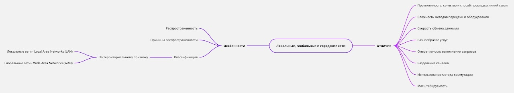

## [MainPage](../index.md)/[Rusian Language](README.md)/Homework 4

## Каталог

- [HomeWork Main](#homework-main)
  - [1 Влияние коммуникации в сети Интернет на личностные особенности пользователей // Интернет-зависимость](#1-влияние-коммуникации-в-сети-интернет-на-личностные-особенности-пользователей--интернет-зависимость)
  - [Объяснительная записка](#объяснительная-записка)
      - [Задание 38. Трансформируйте простые предложения в сложные.](#задание-38-трансформируйте-простые-предложения-в-сложные)
      - [Задание 39. Познакомьтесь с примерами оформления объяснительных записок и сообщите причины их написания. Найдите в документе кон­струкции со значением причины и запишите их в тетрадь.](#задание-39-познакомьтесь-с-примерами-оформления-объяснительных-записок-и-сообщите-причины-их-написания-найдите-в-документе-конструкции-со-значением-причины-и-запишите-их-в-тетрадь)
      - [Задание 41. Составьте объяснительную записку о неявке на зачёт по дисциплине «Деловой иностранный язык». Уважительную причину пропуска занятий укажите самостоятельно.](#задание-41-составьте-объяснительную-записку-о-неявке-на-зачёт-по-дисциплине-деловой-иностранный-язык-уважительную-причину-пропуска-занятий-укажите-самостоятельно)
  - [Особенности локальных, глобальных и городских сетей](#особенности-локальных-глобальных-и-городских-сетей)
      - [Задания 11 и 12](#задания-11-и-12)
  - [ДЗ 11.04.24](#дз-110424)
      - [Задание 17. Замените активные конструкции пассивными.](#задание-17-замените-активные-конструкции-пассивными)
      - [Задание 18. Прочитайте примеры благодарственных писем и скажите кому они адресованы и с какой целью. Какие клише помогают нам понять, что это письмо-благодарность?](#задание-18-прочитайте-примеры-благодарственных-писем-и-скажите-кому-они-адресованы-и-с-какой-целью-какие-клише-помогают-нам-понять-что-это-письмо-благодарность)
      - [Задание 19. Выделите в письме клишированные фразы, которые исполь­ зуются при написании письма-благодарности и запишите их в тет­ радь.](#задание-19-выделите-в-письме-клишированные-фразы-которые-исполь-зуются-при-написании-письма-благодарности-и-запишите-их-в-тет-радь)
      - [Задание 20. Определите, какому письму соответствует информация. Напротив предложений, указанных ниже, напишите букву А, если это письмо I, и букву Б, если это письмо 2.](#задание-20-определите-какому-письму-соответствует-информация-напротив-предложений-указанных-ниже-напишите-букву-а-если-это-письмо-i-и-букву-б-если-это-письмо-2)
      - [Задание 21. Объясните значение следующих фраз.](#задание-21-объясните-значение-следующих-фраз)
      - [Задание 22. Составьте словосочетания, соединив слова из левой и пра­ вой колонки.](#задание-22-составьте-словосочетания-соединив-слова-из-левой-и-пра-вой-колонки)
      - [Задание 1. Составьте библиографическое описание изданий. Соблюдайте знаки препинания.](#задание-1-составьте-библиографическое-описание-изданий-соблюдайте-знаки-препинания)
  - [ДЗ 24.04.30](#дз-240430)
      - [Задание 1. Составьте библиографическое описание изданий. Соблюдайте знаки препинания.](#задание-1-составьте-библиографическое-описание-изданий-соблюдайте-знаки-препинания-1)
      - [Задание 2. Прочитайте аннотацию. Выделите структурные части. Подчеркните конструкции, вводящие информацию.](#задание-2-прочитайте-аннотацию-выделите-структурные-части-подчеркните-конструкции-вводящие-информацию)
      - [Задание 3. Прочитайте аннотации. Выпишите из текстов аннотаций конструкции-клише, вводящие тему, проблематику, адресат, оценку аннотируемого произведения.](#задание-3-прочитайте-аннотации-выпишите-из-текстов-аннотаций-конструкции-клише-вводящие-тему-проблематику-адресат-оценку-аннотируемого-произведения)
      - [Задание 4. Прочитайте предложения. Найдите субъект и предикат. Составьте синонимичные предложения с предикатами, данными в словах для справок.](#задание-4-прочитайте-предложения-найдите-субъект-и-предикат-составьте-синонимичные-предложения-с-предикатами-данными-в-словах-для-справок)
      - [Задание 5. Прочитайте аннотацию научной статьи. Ответьте на](#задание-5-прочитайте-аннотацию-научной-статьи-ответьте-на)
      - [А) Какие структурные части можно выделить в аннотации?](#а-какие-структурные-части-можно-выделить-в-аннотации)
      - [Б) В чем отличие этой аннотации от аннотации книги/учебника/учебного пособия?](#б-в-чем-отличие-этой-аннотации-от-аннотации-книгиучебникаучебного-пособия)
      - [В) Оформите библиографическое описание статьи.](#в-оформите-библиографическое-описание-статьи)
  - [Аннотирование и Библиография\_ Продолжение](#аннотирование-и-библиография_-продолжение)

# HomeWork Main

## 1 Влияние коммуникации в сети Интернет на личностные особенности пользователей // Интернет-зависимость

ДЗ: 
1) Прочитать ещё раз статьи и информацию на слайдах по Презентации. Выписать и выучить новые слова. 

психологический
Выявить
психолога
зарубежной
навязчивое
модему
владельцы
подвергаются
подвигающая
неоправданно
патологического
пребывания
перегрузка
пристрастие
избыточность
собеседника
удовлетворяющего
вампиризм
ощущения
жалобы
чрезмерное
углубленностью
заглушить
вины
тревоги
подавленности
усталости
раздражительности
прекращении
непреодолимое
прогулки
удовольствие
приятелями
родственниками

1) Опираясь на информацию прочитанных статей и инф.со слайдов, провести своё исследование (опрос из 20 вопросов - не менее 10 чел.) об Интернет-зависимости. 

1. Ты замечаешь, что провел в Интернете больше времени, чем планировал.
2. Ты переносишь или откладываешь домашние дела из-за того, что находишься в Интернете.
3. Ты предпочитаешь побыть в Интернете, чем провести время со своей девушкой (своим парнем).
4. Люди, с которыми ты познакомился в Интернете, надолго становятся твоими интернет-друзьями (знакомыми).
5. Твои близкие (друзья, знакомые) жалуются на то, что ты проводишь слишком много времени в Интернете.
6. То, что ты много времени проводишь в Интернете, мешает тебе выполнять работу по дому.
7. Ты сначала проверяешь свою электронную почту (сообщения на одноклассниках, ВКонтакте или других социальных сетях) и только потом приступаешь к другим делам.
8. То, что ты много времени проводишь в Интернете, мешает тебе на работе (мешает в выполнении домашних заданий – если ты студент или школьник).
9. Когда кто-либо спрашивает, чем ты занимаешься в Интернете, ты отвечаешь неохотно или вообще уходишь от ответа.
10. Мысли о том, что ты сделаешь, когда снова окажешься в Интернете, позволяют тебя отвлечься от мыслей о твоих житейских трудностях и проблемах.
11. Ты бываешь недоволен собой из-за того, что снова выходишь в Интернет.
12. Ты думаешь о том, что без Интернета, твоя жизнь была бы скучной и неинтересной.
13. Если кто-либо отвлекает тебя, когда ты находишься в Интернете, ты становишься раздражительным, резким.
14. Ты не спишь из-за того, что до поздней ночи находишься в Интернете.
15. Ты думаешь о том, что сделаешь, когда снова окажешься в Интернете.
16. Ты снова и снова даешь себе «еще несколько минут», прежде чем выйти из Интернета.
17. Ты предпринимаешь неудачные попытки уменьшить время, которое проводишь в Интернете.
18. Ты пытаешься скрыть от других, сколько времени проводишь в Интернете.
19. Ты предпочитаешь побыть в Интернете, чем сходить куда-нибудь с друзьями или знакомыми.
20. Когда ты «выходишь» из Интернета у тебя портится настроение, ты нервничаешь, становишься вспыльчивым. Все это проходит, когда ты снова оказываешься в Интернете.

2) Оформить результаты исследования в виде графика/таблицы/ схемы или диаграммы.

## Объяснительная записка

уч.Черкашина, с.22-28 Задания 38, 39 и 41

#### Задание 38. Трансформируйте простые предложения в сложные.

***Модель**: По причине затопления квартиры я не смог быть на рабочем месте. — **По причине того, что квартира была затоплена**, я не смог быть на рабочем месте.*

1. Я отсутствовал на занятиях ввиду резкого ухудшения самочув­ствия.
Я отсутствовал на занятиях ввиду того, что самочув­ствие резко ухудшено.
2. Из-за повышенного давления и сильной головной боли я допу­ стила ошибку при написании письма.
Из-за того, что давления повышенны и голова сильно болит, я допу­ стила ошибку при написании письма.
3. В связи с дорожно-транспортным происшествием я опоздал на совещание.
В связи с тем, что было дорожно-транспортное происшествие, я опоздал на совещание.
4. Я не явился на занятия по причине посещения врача из-за внезап­ ного ухудшения состояния здоровья.
Я не явился на занятия по причине того, что было посещения врача из-за внезап­ ного ухудшения состояния здоровья.
5. В результате поломки автомобиля я не смог приехать на сделку в нужное время.
В результате того, что автомобиль было поломки, я не смог приехать на сделку в нужное время.

#### Задание 39. Познакомьтесь с примерами оформления объяснительных записок и сообщите причины их написания. Найдите в документе кон­струкции со значением причины и запишите их в тетрадь.

<b>Пример 1</b>

 

Директору Института  
строительства и архитектуры  
ФИО 
от студента группы ИСАм 1-43  
Салмон Али

      

Объяснительная записка о пропуске занятий

Я, Салмон Али, пропустил практические занятия 02.03.2021 года <b>по причине посещения</b> врача. <b>В связи с ухудшением самочувствия из-за обострения заболевания</b> я нуждался в медицинской помощи. <b>Ввиду того, что поликлиника находится далеко от моего дома</b>, я долго добирался до медицинского центра. После осмотра врача вре­ мени на посещение первой пары совсем не было. Копию заключения врача прилагаю. Прошу Вас учесть уважительную причину пропу­ ска занятий.

03.03.2021

Салмон Али

 
  

**кон­струкции со значением причины**
- Я пропустил практические занятия 02.03.2021 года по причине посещения врача.  
- В связи с ухудшением самочувствия из-за обострения заболевания я нуждался в медицинской помощи.  
- Ввиду того, что поликлиника находится далеко от моего дома, я долго добирался до медицинского центра.  

<b>Пример 2</b>

 

Директору по продажам  
ООО «Строймир»  
Петрову И.С  
от главного инженера  
Антонова Ю.П.

      

Объяснительная записка об опоздании на работу

Я опоздал на работу 1 марта 2020 года на один час <b>по причине поломки и дальнейшего ремонта собственного автомобиля.</b>

01.03.2020

 

Главный инженер

<i>Антонов</i>&nbsp &nbsp Антонов Ю.П.

 
  

**кон­струкции со значением причины**
- Я опоздал на работу по причине поломки и дальнейшего ремонта собственного автомобиля.  

#### Задание 41. Составьте объяснительную записку о неявке на зачёт по дисциплине «Деловой иностранный язык». Уважительную причину пропуска занятий укажите самостоятельно.

Преподавателю Института русского языка от студента группы P33131 Ваш ФИО

    

Объяснительная записка о пропуске занятий

 

Я, XXX, студент группы PXXXX, обращаюсь к вам с объяснением причины моей неявки на зачёт по дисциплине «Деловой иностранный язык».

По причине того, что самочув­ствие резко ухудшено, я был вынужден обратиться за медицинской помощью и не возможно присутствовать на занятиях и сдавать зачёт.

Прошу вас понять мою ситуацию и рассмотреть возможность сдачи экзамена в другой день.

Благодарю за понимание.

С уважением

Дата и Год

Ваш ФИО

 

## Особенности локальных, глобальных и городских сетей

Прочитайте ещё раз текст из Задания 10_с.17_ "Особенности локальных, глобальных и городских сетей"

Составьте подробные схемы (на компьютере), характеризующие разные типы сетей. 

#### Задания 11 и 12

**Задание 11. Прочитайте словосочетания. Найдите среди них прилагательные и причастия. Разделите словосочетания на две группы и запишите в таблицу.**

Прилагательные | Причастия
---------------|----------
делительная окружность | неделимое число
детальное описание | детализированный чертёж
дополнительное исследование | дополняющий исследование опыт
идеальные условия | идеализированный объект
исходное вещество | исходящие из точки лучи
летательные аппараты | летящий самолёт
литейное производство | залитый металл
механические инструменты | механизированные процессы
наклонные сечения | наклонённая плоскость
начертательная геометрия | начерченная диагональ
неподвижная ось | движущие силы
продолжительный период | продолженный перпендикуляр
производительный процесс | производящие функции
разливочный ковш | разливаемая сталь
характерные особенности | охарактеризованный выше пример

> 区分方式：
> 1. 看词尾是不是行动词词尾
> 2. 看词根的词性，形容词可以来自名词或动词，而行动词只能来自于动词
> 3. 形容词可以用近义词代替，行动词不行
> 4. 看结尾 н 的数量，一个 н 是形容词，两个 нн 是行动词

**Задание 12. Прочитайте предложения. Назовите причастия и причастные обороты. Поставьте к ним вопрос.**

1. **Студент, живущий** в России, часто приглашает нас в гости.
  Каков студент живёт в России, часто приглашает нас в гости?
2. **Контрольные работы, выполняемые** студентами, оцениваются по пятибалльной шкале.
  Каковы контрольные работы оцениваются по пятибалльной шкале?
3. **Студент, хорошо подготовившийся** к экзамену, чувствует себя уверенно.
  Каков студент чувствует себя уверенно?
4. Мы встретили **подругу, окончившую** университет два года назад.
  Какова подруги вы встретили?
5. На празднике выступали **студенты, приглашённые** из разных вузов.
  Каковы студенты выступали на празднике?
6. Все зрители громко аплодировали **выступающим артистам**.
  Каковы артисты громко аплодировали все зрители?
7. Мальчик учился в небольшом **городе, расположенном** на юге России. 8. 9.
  В каков небольшом городе мальчик учился?
8. **Уставший ребёнок** быстро уснул.
  Каков ребёнок быстро уснул?
9. Современные технологии основаны на **законах, открытых** учёными в разные эпохи.
  На каковы законах основаны современные технологии?

> причастие：行动词
> причастный оборот：行动词从句 或 定于从句（行动词 + 与行动词关联的从句部分），在句子中作定语，作用类似于形容词

## ДЗ 11.04.24

17,18,19,21,22

#### Задание 17. Замените активные конструкции пассивными.

1. Объект сдали своевременно.  
  Объект сдан своевременно.
2. Сроки выполнения ни разу не отодвигали.  
  Сроки выполнения ни разу не отодвигавшихся.
3. Стоимость услуг не завышали.
  Стоимость услуг не завышавшейся.
4. Перед вами поставили сложную задачу.
  Сложная задача поставлена перед вами.
5. Работу провели добросовестно.
  Работа проверена добросовестно.
6. Вы выполняете своевременно и качественно все сложные задания.
  Все сложные задания выполнены вами своевременно и качественно.

#### Задание 18. Прочитайте примеры благодарственных писем и скажите кому они адресованы и с какой целью. Какие клише помогают нам понять, что это письмо-благодарность?

<b>Пример 1</b>

Уважаемый Семён Семёнович!

Коллектив нашей компании «Прима» выражает благодарность Вам и вашей организации «Московская стройка» за успешно прове­дённые строительные работы. Объект был сдан своевременно. Сроки на всём протяжении нашей работы ни разу нс отодвигались.

Перед Вами была поставлена сложная задача, и Вы сделали невоз­ можное. Объект был сдан своевременно, его характеристики полно­ стью соответствовали плану.

Стоимость услуг не завышалась. Вы сэкономили не только наше время, но и средства. Объект получил высокие оценки со стороны всего коллектива нашей компании «Прима».

Желаем Вам дальнейших успехов. Надеемся на дальнейшее сотруд­ ничество. Если нам потребуются строительные услуги в дальней­ шем, мы обратимся именно к Вам.

С уважением, Алексей Юрьевич Аксёнов.

Получатель: Семён Семёнович
Цель: Выразить благодарность за успешно проведённые строительные работы.

<b>Пример 2</b>

Уважаемый Иван Иванович!

На протяжении 5 лет работы у нас Вы зарекомендовали себя в качестве квалифицированного и ответственного сотрудника. Все сложные задания выполняются Вами своевременно и качест­ венно.

Весь коллектив нашей компании отзывается о Вас положительно. И непосредственный руководитель, и рядовые сотрудники отме­ чают Вашу добросовестность, порядочность, ответственное отно­ шение к работе.

Нам сложно представить, что кто-то сможет вас заменить. Вы заслужили наше полное доверие. Только с Вами стало возможно то, чего достигла наша компания.

С уважением, Петр Петрович и коллектив компании «Каркас».

Получатель: Иван Иванович
Цель: Выразить признательности за его высокий профессионализм и преданность работе.

#### Задание 19. Выделите в письме клишированные фразы, которые исполь­ зуются при написании письма-благодарности и запишите их в тет­ радь.

#### Задание 20. Определите, какому письму соответствует информация. Напротив предложений, указанных ниже, напишите букву А, если это письмо I, и букву Б, если это письмо 2.

-|-
---|---
|1. В письме благодарят директора компании за отличное руководство. | Б |
|2. В письме поблагодарили директора компании за качественно ока­ занные строительные услуги. | А |
|3. В письме указано, что коллектив оценил работу компании. | А |
|4. В этом письме говорится о том, что все услуги были оказаны вовремя и стоимость не увеличивалась. | А |
|5. В этом письме пишется о том, что сотрудники доверяют своему руководителю. | Б |
|6. Компания добросовестно выполнила свою работу. |  |
|7. В письме надеются на дальнейшее сотрудничество с компанией. | А |

#### Задание 21. Объясните значение следующих фраз.

Международная конференция, Всероссийская конференция, приём заявок, тезисы докладов, входить в перечень ВАК (Высшей аттеста­ ционной комиссии), председатель, сопредседатель, КМК (Корпус младших курсов), УЛК (Учебно-лабораторный корпус), геоэколо­ гические проблемы, устойчивое развитие территорий, инженерные изыскания, техносферная безопасность, многообразие природных процессов, строительные конструкции, грунтовые основания, под­держка изыскателей и проектировщиков.

1. **Международная конференция**: Это мероприятие, на котором ученые, специалисты или представители различных стран собираются для обсуждения актуальных проблем, обмена знаниями и опытом в определенной области.

2. **Всероссийская конференция**: Подобно международной конференции, только в этом случае участники приглашаются из различных регионов Российской Федерации для обсуждения вопросов, затрагивающих всю страну.

3. **Приём заявок**: Это процесс, в рамках которого организаторы конференции или другого мероприятия принимают заявки от тех, кто желает принять участие в нем.

4. **Тезисы докладов**: Краткое изложение основных идей, результатов и выводов, которые будут представлены в докладах на конференции или научном семинаре.

5. **Входить в перечень ВАК (Высшей аттестационной комиссии)**: Означает, что статьи, доклады или публикации были включены в список рекомендованных для учета при оценке научной деятельности.

6. **Председатель, сопредседатель**: Лица, ответственные за руководство работой конференции или семинара.

7. **КМК (Корпус младших курсов)**: Возможно, это аббревиатура, обозначающая учебное здание или структуру, предназначенную для проживания или обучения младших курсов (обычно студентов первых курсов университета).

8. **УЛК (Учебно-лабораторный корпус)**: Здание или комплекс помещений, предназначенных для проведения учебных и лабораторных занятий.

9. **Геоэкологические проблемы, устойчивое развитие территорий**: Темы, связанные с взаимодействием между геологическими и экологическими процессами и вопросами, касающимися развития территорий с учетом их устойчивости и сохранения окружающей среды.

10. **Инженерные изыскания**: Это комплекс работ по исследованию природных и технических условий строительства для разработки проектных решений.

11. **Техносферная безопасность**: Область знаний и практик, направленных на обеспечение безопасности в техносфере, то есть в среде, преобразованной человеком в процессе его деятельности.

12. **Многообразие природных процессов**: Разнообразие и сложность взаимосвязанных процессов, происходящих в природной среде.

13. **Строительные конструкции**: Это элементы и системы, используемые в строительстве зданий и сооружений для передачи нагрузок и обеспечения их прочности и устойчивости.

14. **Грунтовые основания**: Подготовленная поверхность земли, на которой будет производиться строительство, или ее фундаментальная часть.

15. **Поддержка изыскателей и проектировщиков**: Обеспечение условий и ресурсов для тех, кто занимается исследованиями и разработкой проектов.

#### Задание 22. Составьте словосочетания, соединив слова из левой и пра­ вой колонки.

научный 
тематика 
приём 
научная 
оргкомитет 
телефон

заявок 
конференции 
докладов 
для справок 
конференция 
руководитель

      

научный руководитель
тематика докладов
приём заявок
научная конференция
оргкомитет конференции
телефон для справок

#### Задание 1. Составьте библиографическое описание изданий. Соблюдайте знаки препинания.

1. Статья Е. В. Маликова «Языки программирования и
управленческие навыки», опубликованная в журнале «Вестник ТГПУ (TSPU Bulletin)» в Томске в 2015, в первом номере, на страницах 55-61.

*Маликова Е. В. Языки программирования и управленческие навыки // Вестник ТГПУ (TSPU Bulletin). - 2015. - №1. - С.55-61.*

## ДЗ 24.04.30

#### Задание 1. Составьте библиографическое описание изданий. Соблюдайте знаки препинания.

1. Статья Е. В. Маликова «Языки программирования и управленческие навыки», опубликованная в журнале «Вестник ТГПУ (TSPU Bulletin)» в Томске в 2015, в первом номере, на страницах 55-61.
  > Маликова Е. В. Языки программирования и управленческие навыки // Вестник ТГПУ (TSPU Bulletin). - 2015. - №1. - С.55-61.
2. Книга Дж. Сомнеза, которая называется «Путь программиста. Человек эпохи IT», издана в Санкт-Петербурге в издательстве «Питер» на 448 страницах.
  > Сомнеза Дж. Путь программиста. Человек эпохи IT / Дж. Сомнеза. - СПб. : Изд-во Питер. - 448с.
3. Издание “Нормирование физической нагрузки в занятиях оздоровительной направленности” подготовлено коллективом автором, среди которых Гаврилов Д.Н., Потапчук А.Н., Утенко В.Н., Шашкин Г.А. Книга опубликована в Санкт-Петербурге, в издательстве СПбГАФК, в 1996 году, объем издания - 254 страницы.
  > Нормирование физической нагрузки в занятиях оздоровительной направленности / Д.Н. Гаврилов, А.Н. Потапчук, В.Н. Утенко [и др.] - СПб. : Изд-во СПбГАФК, 1996. - 254с.
4. Учебное пособие, которое называется «Имитационное моделирование», авторы М. С. Эльберг, Н. С. Цыганков, издано в Красноярске, в издательстве Сибирского федерального университета в 2017 году, объем 128 страниц.
  > Эльберг М. С. Имитационное моделирование / М. С. Эльберг, Н. С. Цыганков - КЯ. : Сибирский федеральный университет, 2017. - 128 с.
  

#### Задание 2. Прочитайте аннотацию. Выделите структурные части. Подчеркните конструкции, вводящие информацию.

Конюх В. Л. Основы робототехники: учебное пособие/В.Л. Конюх Основы робототехники. – Ростов н/Д: Феникс, 2008. – 281 с.

**Рассмотрены технические средства робототехники**: история и предпосылки развития роботов, классификация роботов, кинематика манипуляторов, конструкция захватных устройств, приводы звеньев, сбалансированные манипуляторы, транспортные роботы, виды датчиков и управляющих устройств. **Описаны способы человеко-машинного, программного, адаптивного и интеллектуального управления роботами**. **Заключительный раздел пособия посвящен приложениям промышленной робототехник**и в различных отраслях - от оценки подготовленности технологии к роботизации до обеспечения безопасности и практических примеров применения робототехники. **Предназначено для студентов**, обучающихся по направлениям 220300 - Автоматизация технологических процессов и производств и 220400 Мехатроника и робототехника.

#### Задание 3. Прочитайте аннотации. Выпишите из текстов аннотаций конструкции-клише, вводящие тему, проблематику, адресат, оценку аннотируемого произведения.

1. Грошев А.С. Информатика. Учебник для вузов. Архангельск: Арханг.гос.тех. ун-т, 2010. 470 с.

  Структура и содержание учебника полностью соответствуют примерной программе дисциплины «Информатика» для студентов вузов, рекомендованной Министерством образования. В главе 1 книги рассматриваются общие вопросы, глава 2 посвящена аппаратному, 3 – программному обеспечению персональных компьютеров, глава 4 содержит сведения об Интернете, глава 5 – основы программирования на языках VBS и VBA.

  Особенностью учебника является практическая направленность изложения материала, призванная помочь студенту в совершенстве овладеть навыками использования персонального компьютера в профессиональной деятельности и в быту для работы со всеми видами информации.

  1. Что соответствует чему
  2. Где рассматриваются что
  3. Что посвящена чему
  4. Что содержит что 
  5. Особенностью чего является что
  6. Что призванный помочь кому

1. Зубкова Т.М. Технология разработки программного обеспечения: Учебное пособие. Оренбург: ГОУ ОГУ, 2004. 101 с.

  В пособии кратко изложены основные теоретические положения предмета, даны рекомендации по выполнению лабораторных работ. В нем представлены требования к выполнению курсового проекта, даются указания по структуре и содержанию пояснительной записки, приводятся рекомендации по выполнению и оформлению отдельных частей курсового проекта. Учебное пособие предназначено для студентов, обучающихся по программам высшего профессионального образования по специальности 220400, при изучении дисциплины "Технология разработки программного обеспечения".  

  1. Где кратко изложены что
  2. Где представлены что
  3. Где даются что
  4. Где приводятся что
  5. Что предназначено для кого

#### Задание 4. Прочитайте предложения. Найдите субъект и предикат. Составьте синонимичные предложения с предикатами, данными в словах для справок.

1. В пособии кратко изложены основные теоретические положения, даны рекомендации по выполнению лабораторных работ.
2. Пособие предназначено для студентов, обучающихся по программам высшего профессионального образования по специальности 220400, при изучении дисциплины «Техническая разработка профессионального обеспечения».

Слова для справок: посвящено чему?, говорится о чем?, рассчитано на кого?, адресовано кому?

1. Пособие посвящено очновным теоретическим положениям, даны рекомендации по выполнению лабораторных работ.
2. В пособии говорится об основных теоретических положениях, даны рекомендации по выполнению лабораторных работ.

1. Пособие рассчитано на студентов, обучающихся по программам высшего профессионального образования по специальности 220400, при изучении дисциплины «Техническая разработка профессионального обеспечения».
2. Пособие адресовано студентам, обучающихся по программам высшего профессионального образования по специальности 220400, при изучении дисциплины «Техническая разработка профессионального обеспечения».

#### Задание 5. Прочитайте аннотацию научной статьи. Ответьте на 
#### А) Какие структурные части можно выделить в аннотации?

1. Кто пишет?
2. О чём писать
3. Для кого писать

#### Б) В чем отличие этой аннотации от аннотации книги/учебника/учебного пособия?
В отличие правилы оформления библиографического описания

#### В) Оформите библиографическое описание статьи.

Коршунов. А. В. 

Фамилия И.О. Название статьи // Название издания. – Год издания. – Номер издания. – С. ...-... .
Жичкина А. Е. Особенности социальной перцепции в Интернете //
Мир психологии. - 1999. - No3 .- С. 72-80.

## Аннотирование и Библиография_ Продолжение

Задания для самостоятельной работы_ по уч. РЯ в проф. деятельности, с.87_ 

Задание 1. Прочитайте статью «Интернет-пиратство: вчера и сегодня» Л.Н. Чевтаевой. Оформите библиографическое описание статьи. // 

Задание 3. Напишите тезисный план текста. 

Задание 4. Составьте аннотацию статьи. Для создания аннотации  пользуйтесь схемой, предложенной в задании 5. 

Задание 5. Проанализируйте аннотации, представленные в ваших учебных пособиях. Выпишите конструкции-клише, вводящие информацию. Соответствуют ли аннотации необходимой структуре?  Аргументируйте свой ответ.

Сегодня искусственный интеллект (ИИ) — верный помощник человека. Но многие — и фантасты, и учёные, и широкая общественность — задаются вопросом: если завтра он станет умнее человека, что тогда?  
如今，人工智能（AI）已成为人类忠实的助手。 但许多人——科幻小说作家、科学家和公众——都在问这样一个问题：如果明天他变得比一个人更聪明，然后呢？

А собственно говоря, ничего. Тут загвоздка в определении «умнее». Пока современные компьютеры принципиально ничем не отличаются от своих предков на перфокартах, где «ноль» — отсутствие сигнала, «единица» — наличие сигнала. Компьютер не способен решать несколько задач параллельно — только последовательно, через систему прерываний. В итоге, какие бы задачи ни ставились перед ЭВМ — от системы распознавания образов до игры в шахматы, — всё сводится к механическому перебору вариантов и выбору оптимального из них. И что особенно важно, оптимального с точки зрения алгоритма и целевой функции, которые задаёт человек. Конечно, нельзя сравнивать интеллект человека и машины. Это принципиально разные процессы.  
但实际上，什么也没有。 “更聪明”的定义有一个问题。 虽然现代计算机与穿孔卡上的祖先没有什么不同，其中“零”表示没有信号，“一”表示存在信号。 计算机无法并行解决多个问题 - 只能通过中断系统顺序解决。 因此，无论向计算机提出什么任务——从模式识别系统到下棋——这一切都归结为机械地枚举选项并选择最佳选项。 尤其重要的是，从人设定的算法和目标函数的角度来看是最佳的。 当然，你不能比较人和机器的智能。 这些是根本不同的过程。

Кстати, вычислительная мощь машины сильно преувеличена. Да, как арифмометр человек не может тягаться с компьютером. Но что более всего поглощает машинный ресурс? Любой геймер скажет — обработка видеоинформации. А вот у человека с этим никаких проблем нет. Обработка и анализ видеоинформации человеком пока на порядок превосходят возможности машины, а если учесть, что параллельно обрабатывается и слуховая информация, и обонятельная, и осязательная, и координация движений — и всё это в режиме онлайн...  
顺便说一句，机器的计算能力被大大夸大了。 是的，作为一台加法机，人无法与计算机竞争。 但什么最消耗机器资源呢？ 任何游戏玩家都会说——视频信息处理。 但一个人对此没有任何问题。 人类对视频信息的处理和分析仍然比机器的能力优越一个数量级，如果你考虑到听觉信息、嗅觉、触觉和运动协调是同时处理的——而且所有这些都是在线的。

Распознавание образов для машины — задача сложнейшая. Даже если речь идёт, например, об обыкновенном стакане. Непременно перепутает с горшком или просто с усечённым конусом, потому что связь образа с функциональным назначением предмета, стоящего за образом, - необычайно сложная для машины задача. Как же можно сравнивать тёплое с мягким?  
机器的模式识别是一项非常困难的任务。 例如，即使我们谈论的是普通玻璃。 它肯定会与锅或简单的截锥体混淆，因为将图像与图像背后物体的功能目的联系起来对于机器来说是一项异常困难的任务。 你怎么能比较温暖和柔软呢？

Тут следует затронуть важный момент. Говоря об ИИ, обыватель интуитивно подставляет в уме не «интеллект», а «разум». А это очень и очень разные вещи. Интеллект — умение опционально решать поставленные задачи. А разум? Внятного определения нет до сих пор. Для определения искусственного разума (которого, кстати, пока на горизонте нет) в информатике используют термин «сильный искусственный интеллект», тем самым благоразумно вынося за скобки термин «разум».  
这里应该提出一个重要的观点。 当谈论人工智能时，普通人直观地想到的不是“智能”，而是“理性”。 这些是非常非常不同的事情。 智力是有选择地解决指定问题的能力。 心灵呢？ 目前还没有明确的定义。 为了定义人工智能（顺便说一句，人工智能尚未出现），计算机科学使用“强人工智能”一词，从而明智地将“智能”一词排除在括号之外。

Считается, что признаки разума — сознание (ещё один неясный термин, чаще всего предполагающий наличие абстрактного мышления), самосознание (осознание себя как отдельного «Я», рефлексия), воля к самостоятельному целеполаганию, способность к обучению и самообучению, рациональное поведение, интуиция. Собственно, всё это вполне применимо, например, к домашней кошке: разумеется, мы не знаем, как она осознаёт себя (и рефлексирует ли), за отсутствием у оной речевого центра, но ведь и глухонемые люди прекрасно себя осознают, ни разу в жизни этот центр не задействовав. А ещё лучше дело обстоит с коллективными насекомыми: муравьями, термитами, пчёлами. Сложный язык (у пчелы мозга нет, одни ганглии, а она способна рассказать, где расположены лучшие цветоносы, и ещё много интересного), сложная иерархия, идеально подогнанная под условия окружающей среды система, а если рассматривать отдельный индивид как своего рода «транзистор» — коллективный разум улья, несомненно, имеет место. Только он не человеческий.  
人们相信，心灵的标志是意识（另一个不清楚的术语，最常暗示抽象思维的存在）、自我意识（意识到自己是一个独立的“我”，反思）、独立设定目标的意愿、学习和自学的能力、理性行为、直觉。 其实，这一切都非常适用，例如家猫：当然，我们不知道它是如何意识到自己的（以及是否反映），因为它缺乏言语中枢，但又聋又哑人们完全了解自己，一生中从未有过不使用中心的情况。 对于集体昆虫来说，情况甚至更好：蚂蚁、白蚁、蜜蜂。 一种复杂的语言（蜜蜂没有大脑，只有神经节，但她能够说出最好的花梗在哪里，以及许多其他有趣的东西），复杂的层次结构，理想地适应环境条件的系统，如果我们考虑将个体视为一种“晶体管”——蜂巢思维无疑在发挥作用。 只是他不是人。

Принято считать, что главное отличие человеческого разума — воля к иррациональным действиям. Например, покорение космоса - самый яркий пример. Попытка выйти за пределы среды обитания — что может быть неразумнее? Или поиск «братьев по разуму»...  
人们普遍认为，人类思维的主要区别在于非理性行为的意愿。 例如，征服太空就是最引人注目的例子。 试图超越一个人的栖息地的界限——还有什么比这更不合理的呢？ 或者寻找“心目中的兄弟”......

А теперь вернёмся к искусственному интеллекту. Это инструмент. Штука полезная. Сильный же искусственный интеллект (разум) пока весьма гипотетичен. Некоторые склонны усматривать возможность его возникновения с появлением квантовых компьютеров, но и тут не всё так однозначно. Будет ли разум условного человека воплощением рациональности? Ответа нет.  
现在让我们回到人工智能。 这是一个工具。 这是一个有用的东西。 强大的人工智能（心灵）仍然是非常假设的。 有些人倾向于认为随着量子计算机的出现，这种情况发生的可能性，但即使如此，事情也并非如此简单。 常人的心会是理性的体现吗？ 没有答案。

Ещё есть любители порассуждать о грядущем синтезе человеческого разума и искусственного интеллекта.  
还有一些人喜欢推测人类思维和人工智能的未来综合。

Так вот, пока никакого биологического синтеза не предвидится. Он возможен только в случае создания ИИ именно на биологической основе, то есть не на моделировании нейросетей, а именно на выращивании нейросетей на основе ДНК с одновременным программированием. Такие случаи уже были описаны в фантастической литературе. Это если говорить о биологическом синтезе. А социальный синтез уже произошёл.  
因此，到目前为止，预计还没有生物合成。 只有在生物学基础上创建人工智能，即不是基于神经网络建模，而是基于同时编程的基于 DNA 的神经网络的生长，才有可能实现这一点。 科幻小说中已经描述过此类案例。 这是如果我们谈论生物合成的话。 但社会综合已经发生。

Компьютеры вполне себе сочиняют музыку и играют в игры, занимаются рекрутингом (подбором персонала) и анализом наших томограмм с выдачей диагнозов и рекомендаций по лечению, прогнозированием поведения потребителя в интернете вплоть до создания точечной контекстной рекламы лично для вас... Рутина.  
计算机完全有能力创作音乐和玩游戏、进行招聘（人员选拔）和分析我们的断层扫描、发布诊断和治疗建议、预测互联网上的消费者行为，甚至为您个人创建有针对性的上下文广告……例行公事。

Поэтому тот ИИ, который нынче развивают, конечно, в каком-то смысле для человека соперник. На рынке труда он соперник. В автопроме (классический пример: роботизированная линия сборки автомобилей вытеснила с рынка труда миллионы человеческих рук), у медиков, у тех же клерков по подбору персонала; он теснит штатных психологов... Но более ему пока ничего не добиться. Вот появится сильный искусственный интеллект да пожелает чего-то странного.  
因此，目前正在开发的人工智能在某种意义上当然是人类的竞争对手。 他是劳动力市场上的竞争者。 在汽车行业（一个典型的例子：机器人汽车装配线已经取代了劳动力市场上数以百万计的人手），在医生中，在同样的人事选拔职员中； 他正在排挤全职心理学家……但到目前为止他无法取得更多成就。 一个强大的人工智能会出现并许愿一些奇怪的东西。

(По материалам статьи «Искусственный интеллект – не то, чем он кажется» // https://www.nkj.ru/archive/articles/33857/)
