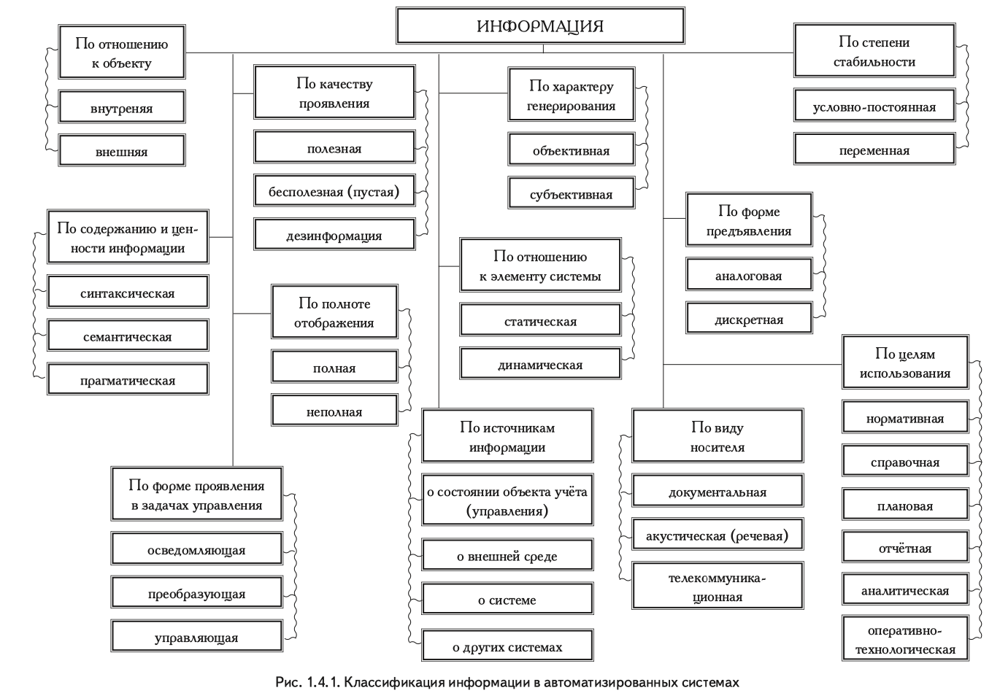
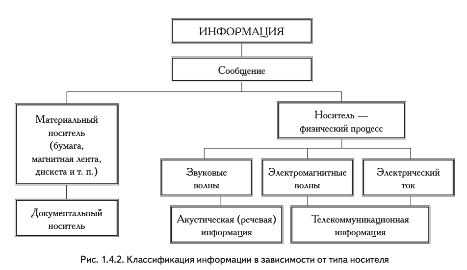

## [MainPage](../index.md)/[Rusian Language](README.md)/Texts

# Основный курс

## Тема 1.ЧАСТИ РЕЧИ

## ИЗ ЧЕГО ПОСТРОЕН ОКРУЖАЮЩИЙ НАС МИР?

## Технологии Будушего
В последнее время специалисты разных стран мира интенсивно занимаются развитием нанотехнологий. Нанотехнологии — это технологии, которые используют величины порядка нанометра. 
Один нанометр равен одной миллиардной доле метра ($1 нм = 1•10^{–9} м$). Эта величина сравнима с размерами атомов. 
Нанотехнологии имеют большие перспективы в различных областях. Вот некоторые из них. В промышленности будут разработаны и изготовлены наномашины, то есть механизмы и роботы размером с молекулу. Они будут собирать предметы потребления непосредственно из атомов и молекул — точно так же, как собирают здание из кирпичей. Используя, например, молекулы воды (Н2О) углекислого газа (СО2), нанороботы смогут «собирать» из них сахар (С12Н22О11). При такой «сборке» не остается промышленных отходов, не нужно применять металлоёмкие и энергоёмкие станки и машины. 
В сельском хозяйстве «естественные машины» для производства пищи, то есть растения и животные, будут заменены комплексами из нанороботов. Они будут воспроизводить те же химические процессы, которые происходят в живых организмах, только более коротким и эффективным путём1. Например, из цепи «почва — углекислый газ — фотосинтез2 — трава — корова — молоко» будут удалены все лишние звенья. Останется «почва — углекислый газ — молоко» (или творог, масло, мясо — всё что угодно). Таким образом будет ликвидирована зависимость сельского хозяйства от погоды и тяжёлого физического труда. Это решит продовольственную проблему, человечество забудет о голоде. По прогнозам специалистов, первые такие комплексы будут созданы во второй половине XXI века. Одной из важных областей применения нанотехнологий является медицина. Уже в первой половине нашего века могут быть созданы роботыврачи, которые будут «жить» внутри человеческого организма, удаляя все повреждения, в том числе повреждения наследственные. Нанотехнологии будут использоваться для решения экологических проблем. При помощи роботов-санитаров отходы деятельности человека будут превращаться в исходное сырьё. Кроме того, окружающая среда будет становиться чище за счёт перехода промышленности и сельского хозяйства на безотходные нанотехнологические методы. Срок реализации — середина XXI века.
## 未来技术
最近，来自世界各地的专家都在密集地从事纳米技术的发展。纳米技术是使用纳米量级数量的技术。
一纳米等于十亿分之一米（1 nm = 1×10-9 m）。这个值与原子的大小相当。
纳米技术在各个领域都有着广阔的前景。这里是其中的一些。该行业将开发和制造纳米机器，即分子大小的机制和机器人。他们将直接用原子和分子组装商品，就像用砖块组装建筑物一样。例如，使用水 (H2O) 和二氧化碳 (CO2) 分子，纳米机器人将能够从中“收集”糖 (C12H22O11)。有了这样的“组装”，就没有工业废料留下，不需要使用金属密集型和能源密集型的机器和机器。
在农业中，用于食品生产的“自然机器”，即植物和动物，将被纳米机器人的复合体所取代。它们将重现生物体中发生的相同化学过程，只是以更短、更有效的方式1。例如，从“土壤-二氧化碳-光合作用2-草-牛-牛奶”链中，所有不必要的链接都将被删除。会有“土壤 - 二氧化碳 - 牛奶”（或干酪、黄油、肉类 - 随便什么）。从而消除农业对天气和繁重体力劳动的依赖。这将解决粮食问题，人类将忘记饥饿。据专家介绍，第一个这样的综合体将在 21 世纪下半叶建成。纳米技术的重要应用领域之一是医学。早在本世纪上半叶，就可以创造出机器人医生，它们将“生活”在人体内，消除所有损伤，包括遗传性损伤。纳米技术将用于解决环境问题。在机器人勤务员的帮助下，人类的废物将被转化为原材料。此外，由于工业和农业向无废物纳米技术方法的转变，环境将变得更清洁。实施时期为21世纪中叶。

# Информатика

## ПОНЯТИЕ ИНФОРМАЦИИ

Вся жизнь человека так или иначе связана с накоплен ием и обработкой информации, которую он получает из окружающего мира, используя пять органов чувств: зрение, слух, вкус, обоняние и осязание. Как научная категория информация составляет предмет изучения для самых различных дисциплин: информатики, кибернетики, семантики, философии, физики, биологии, теории связи и т. д. Несмотря на это, строго научного определения, что же такое информация, до настоящего временини существует, а вместо него обычно используют понятие информации. Понятия отличаются от определений тем, что разные дисциплины в разных областях науки и техники вкладывают в него разный смысл, с тем чтобы оно в наибольшей степени соответствовало предмету и задачам конкретной дисциплины. Имеется множество определений понятия «информация» — от наиболее общего философского (информация есть отражение реального мира) до наиболее частного прикладного (информация есть сведения, являю щиеся объектом переработки).  
人类的所有生活都以某种方式与他从周围世界接收到的信息的积累和处理联系在一起，使用五种感官：视觉、听觉、味觉、嗅觉和触觉。作为一个科学范畴，信息是各种学科的研究主题：计算机科学、控制论、语义学、哲学、物理学、生物学、通信理论等。尽管如此，对于什么是信息并不存在严格的科学定义。日期，但通常使用信息的概念。概念与定义的不同在于，不同科学技术领域的不同学科赋予其不同的含义，使其最符合特定学科的主题和任务。 “信息”的概念有很多定义——从最普遍的哲学（信息是对现实世界的反映）到最具体的应用（信息是作为处理对象的信息）。

Многообразие таких определений свидетельствует о широте подхода к понятию информации и отражает становление концепции информации в современной науке. Первоначально смысл слова «информация» (от лат. informatio — разъяснение, изложение) трактовался как нечто, присущее только человеческому сознанию и общению: «...знания, сведения, сообщения, известия, передаваемые людьми устным, письменным или другим способом». Затем смысл этого слова начал расширяться и обобщаться.  
这种定义的多样性证明了对信息概念的研究方法的广度，反映了现代科学中信息概念的形成。 最初，“信息”一词的含义（来自拉丁文信息 - 解释、说明）被解释为仅在人类意识和交流中固有的东西：“......知识、信息、消息、人们口头、书面传播的消息或以任何其他方式。” 然后这个词的含义开始扩展和概括。

Информация не является ни материей, ни энергией. В отличие от них она может возникать и исчезать (например, письмо сгорит).  
信息既不是物质也不是能量。 与它们不同，它可以出现和消失（例如，一封信会燃烧）。

Особенность заключается в том, что проявляется информация только при взаимодействии объектов, причём обмен информацией может совершаться не вообще между любыми объектами, а только между теми из них, которые представляют собой организованную структуру (систему). Элементами этой системы могут быть не только люди: обмен информацией может происходить в животном и растительном мире, между живой и неживой природой, людьми и устройствами. Так, информация, заключённая в куске каменного угля, проявится лишь при взаимодействии с человеком, а растение, получая информацию о свете, днём раскрывает свои лепестки, а ночью закрывает их.  
其特殊性在于，信息仅在对象的交互过程中表现出来，信息的交换一般不能发生在任何对象之间，而只能发生在代表有组织结构（系统）的对象之间。这个系统的元素不仅可以是人：信息交换可以发生在动植物王国、有生命和无生命的自然、人和设备之间。因此，一块煤中所含的信息只有在与人互动时才会显现出来，而植物在接收到光的信息后，会在白天打开花瓣，在晚上关闭它们。

Понятие «информация» обычно предполагает наличие двух объектов — «источника» информации и «приёмника» (потребителя, адресата) информации.  
“信息”的概念通常意味着存在两个对象——信息的“来源”和信息的“接收者”（消费者、收件人）。

Информация передаётся от источника к приёмнику в материально-энергетической форме, в виде сигналов (например, электрических, световых, звуковых и т. д.), распространяющихся в определённой среде.  
信息以物质能量形式，以在特定介质中传播的信号（例如，电、光、声音等）的形式从源传输到接收器。

Информация может поступать непрерывно или дискретно, т. е. в виде последовательности отдельных сигналов. Соответственно, различают непрерывную и дискретную информацию.  
信息可以连续或离散地流动，即以一系列单个信号的形式。 因此，对连续信息和离散信息进行了区分。

Информация — специальный атрибут реального мира, представляющий собой его объективное отображение в виде совокупности сигналов и проявляющейся при взаимодействии с «приёмником» информации, позволяющим выделять, регистрировать эти сигналы из окружающего мира и идентифицировать их по тому или иному критерию.  
信息是现实世界的一种特殊属性，它以一组信号的形式客观地显示出来，并在与信息的“接收者”交互时表现出来，它允许你选择、记录来自外部世界的这些信号并识别他们通过一个或另一个标准。

Из этого определения следует, что:  
从这个定义可以得出：
- информация объективна, так как это свойство материи — отражение;  
信息是客观的，因为物质的这种特性是一种反映；
- информация проявляется в виде сигналов и лишь при взаимодействии объектов;  
信息以信号的形式出现，并且仅在对象交互期间出现；
- одна и та же информация различными получателями может быть интерпретирована по-разному, в зависимости от «настройки» «приёмника».  
相同的信息可以被不同的接收者以不同的方式解释，这取决于“接收者”的“设置”。

Человек воспринимает сигналы посредством органов чувств, эти сигналы «идентифицируются» мозгом. Поэтому, например, при наблюдении одного и того же объекта человек с лучшим зрением может получать больше информации об объекте, чем тот, у кого зрение хуже. В то же время при одинаковой остроте зрения в случае, например, прочтения текста на иностранном языке человек, не владеющий этим языком, вообще не получит никакой информации, так как его мозг не сможет его идентифицировать. Приёмники информации в технике воспринимают сигналы с помощью различной измерительной и регистрирующей аппаратуры. При этом приёмник, обладающий большой чувствительностью при регистрации сигналов и более совершенными алгоритмами их обработки, позволяет получить больше информации.  
一个人通过感官感知信号，这些信号被大脑“识别”。因此，例如，在观察同一物体时，视力较好的人比视力较差的人可以获得更多关于该物体的信息。同时，在同样的视力下，例如阅读外语文本，不会说这种语言的人根本不会收到任何信息，因为他的大脑无法来识别它。技术中的信息接收器使用各种测量和记录设备来感知信号。同时，接收器在注册信号时具有高灵敏度和更先进的处理算法，可让您获得更多信息。

Информация имеет определённые функции в обществе, основные из которых:  
信息在社会中具有一定的功能，主要有：

- познавательная, цель которой — получение новой информации. Функция реализуется в основном через такие этапы обращения информации, как:  
认知，其目的是获取新信息。 该功能主要通过以下信息流通阶段来实现：
  - её синтез (производство);  
  其合成（生产）；
  - представление;  
  表现;
  - хранение (передача во времени);  
  存储（及时转移）
  - восприятие (потребление);
  感知（消费）；

- коммуникативная — функция общения людей, реализуемая через такие этапы обращения информации, как:  
交流 - 人们交流的功能，通过信息流通的这些阶段实现，例如：
  - передача (в пространстве);
  传输（空间）；
  - распределение;
  分配;

- управленческая, цель которой — формирование целесообразного поведения управляемой системы, получающей информацию. Эта функция информации неразрывно связана с познавательной и коммуникативной и реализуется через все основные этапы обращения, включая обработку.  
管理，其目的是形成受控系统接收信息的权宜行为。 信息的这种功能与认知和交流密不可分，并通过包括加工在内的所有主要流通阶段来实现。

Без информации не может существовать жизнь в любой форме и не могут функционировать созданные человеком любые информационные системы. Без неё биологические и технические системы представляют груду химических элементов. Общение, коммуникация, обмен информацией присущи всем живым существам, но в особой степени — человеку. Будучи аккумулированной и обработанной с определённых позиций, информация даёт новые сведения, приходит к новому знанию. Получение информации из окружающего мира, её анализ и генерирование составляют одну из основных функций человека, отличающую его от остального живого мира.  
没有信息，任何形式的生命都无法存在，任何人类创造的信息系统都无法运行。没有它，生物和技术系统就是一堆化学元素。交流、交流、信息交换是所有生物固有的，但在特殊程度上——人类。信息从一定的位置积累和加工，提供新的信息，产生新的知识。从周围世界获取信息，对其进行分析和生成是一个人的主要功能之一，这使他与其他生物世界不同。

## ОСНОВНЫЕ ПОНЯТИЯ ИНФОРМАЦИИ

Информацию следует считать особым видом ресурса, при этом имеется в виду толкование ресурса как запаса неких знаний материальных предметов или энергетических, структурных или каких-либо других характеристик предмета. В отличие от ресурсов, связанных с материальными предметами, информационные ресурсы являются неистощимыми и предполагают существенно иные методы воспроизведения и обновления, чем материальные ресурсы. С этой точки зрения можно рассмотреть такие свойства информации:  
信息应被视为一种特殊类型的资源，这意味着将资源解释为存储有关物质对象或能量、结构或对象的任何其他特征的一些知识。 与与物质对象相关的资源不同，信息资源是取之不尽的，需要与物质资源截然不同的复制和更新方法。 从这个角度来看，我们可以考虑以下信息的属性：

1. **запоминаемость;**
记忆力；
2. **передаваемость;**
可转让性；
3. **воспроизводимость;**
再现性；
4. **преобразуемость;**
可兑换性；
5. **стираемость.**
可擦性。

> - полната 完整性
> - актуальность 相关性
> - достоверность 真实性
> - доступность 可用性

### Запоминаемость

— одно из самых важных свойств. Запоминаемую информацию будем называть макроскопической, имея в виду пространственные масштабы запоминающей ячейки и время запоминания. Именно с макроскопической информацией мы имеем дело в реальной практике.  
是最重要的属性之一。 存储的信息将被称为宏观，即存储单元的空间尺度和存储时间。 我们在实际实践中处理的是宏观信息。

### Передаваемость

информации с помощью каналов связи (в том числе с помехами) хорошо исследована в рамках теории информации К. Шеннона. В данном случае имеется в виду несколько иной аспект — способность информации к копированию, т. е. к тому, что она может быть «запомнена» другой макроскопической системой и при этом останется тождественной самой себе. Очевидно, что количество информации не должно возрастать при копировании.  
使用通信信道（包括干扰）的信息在 K. Shannon 的信息论框架下得到了很好的研究。 在这种情况下，我们想到了一个稍微不同的方面——信息被复制的能力，即它可以被另一个宏观系统“记住”，同时保持与自身相同的事实。 显然，复制时信息量不应该增加。

### Воспроизводимость

информации тесно связана с её передаваемостью и не является её независимым базовым свойством. Если передаваемость означает, что не следует считать существенными пространственные отношения между частями системы, между которыми передаётся информация, то воспроизводимость характеризует неиссякаемость и неистощимость информации, т. е. при копировании информация остаётся тождественной самой себе.  
信息与其可转移性密切相关，并非其独立的基本财产。 如果可转移性意味着信息传输的系统各部分之间的空间关系不应该被认为是重要的，那么可再现性则表征了信息的取之不尽和用之不竭的特征，即当复制信息与其自身保持相同时。

Фундаментальное свойство информации — преобразуемость. Оно означает, что информация может менять способ и форму своего существования. Копируемость есть разновидность преобразования информации, при котором её количество не меняется. В общем случае количество информации в процессах преобразования меняется, но возрастать не может.  
信息的基本属性是可转换性。 这意味着信息可以改变其存在的方式和形式。 可复制性是一种数量不变的信息转换。 在一般情况下，转换过程中的信息量会发生变化，但不会增加。

Свойство стираемости информации также не является независимым. Оно связано с таким преобразованием информации (передачей), при котором её количество уменьшается и становится равным нулю.  
信息擦除属性也不是独立的。 它与信息的这种转换（传输）相关，其中它的数量减少并变为零。

## Информационные процессы

Обмен, хранение и обработка информации присущи живой природе, человеку, обществу, техническим устройствам. В системах различной природы действия с информацией: обмен, хранение, обработка — одинаковы. Эти действия называют информационными процессами.

### Обмен информацией

Передачу и приём информации называют обменом информацией. Передача информации между автоматами выполняется с использованием технических средств связи. Ретрансляционная вышка передаёт информацию, которую воспринимает блок приёма телевизора. Радиостанция передаёт информацию, которую воспринимает блок приёма радиоприёмника. Видеомагнитофон передаёт информацию с видеокассеты на экран.
При обмене информацией нужны источник информации и приёмник информации. Передаваемая от источника информация достигает приёмника с помощью последовательности сигналов, которая называется сообщением. Сигналы могут быть звуковыми, электрическими, электромагнитными (непрерывными и дискретными) и т. д.

### Преобразование информации

Обработка информации — преобразование информации из одного вида в другой, осуществляемое по строгим формальным правилам.
Обработка информации по принципу «чёрного ящика» — процесс, в котором пользователю важна и необходима лишь входная и выходная информация, но правила, по которым происходит преобразование, его не интересуют и не принимаются во внимание.
Возможность автоматизированной обработки информации основывается на том, что обработка информации не подразумевает её осмысления.

### Хранение информации

Информация для магнитофона, видеомагнитофона, киноаппарата хранится на специальных носителях: аудиокассетах, видеокассетах, кинолентах. Устройство, предназначенное для хранения информации, называют носителем информации. Носитель информации может быть разной природы: механический, магнитный, электрический. Носители информации различаются по форме представления информации, по принципу считывания, по типам материала.
Информация запоминается в виде сигналов или знаков. С помощью микрофона и других устройств магнитофона звуковая информация записывается на магнитную ленту, т. е. на магнитной ленте хранится информация. С помощью магнитной головки магнитофона информация считывается с магнитной ленты. Информация записывается на носитель посредством изменения физических, химических или механических свойств окружающей среды. Запись и считывание информации осуществляются в результате физического воздействия с носителем информации записывающих и считывающих устройств.

## 信息处理

信息的交换、存储和处理是野生动物、人类、社会、技术设备所固有的。在不同性质的系统中，具有信息的行为：交换、存储、处理是相同的。这些活动称为信息过程。

### 信息交流

信息的发送和接收称为信息交换。机器之间的信息传输是使用通信技术手段进行的。中继塔传输电视接收单元感知的信息。无线电台发送由无线电接收单元接收的信息。 VCR 将信息从录像带传输到屏幕。
在交换信息时，需要信息的来源和信息的接收者。从源头传输的信息
消息通过称为消息的一系列信号到达接收者。信号可以是声音、电气、电磁（连续和离散）等。

### 信息转换

信息处理是将信息从一种类型转换为另一种类型，按照严格的正式规则进行。
根据“黑匣子”原则的信息处理是一个过程，其中只有输入和输出信息对用户来说是重要和必要的，但发生转换的规则对他不感兴趣，也没有考虑在内。
自动化信息处理的可能性是基于这样一个事实，即信息处理并不意味着它的理解。

### 数据存储

录音机、录像机、电影摄影机的信息存储在特殊媒体上：录音带、录像带、电影。用于存储信息的设备称为存储介质。信息的载体可以具有不同的性质：机械的、磁的、电的。信息载体根据阅读的原则，根据材料的类型，在信息的呈现形式上有所不同。
信息以信号或标志的形式存储。在麦克风和其他录音机设备的帮助下，声音信息被记录在磁带上，也就是信息被存储在磁带上。在磁带录音机磁头的帮助下，从磁带上读取信息。通过改变环境的物理、化学或机械特性，信息被写入媒体。信息的记录和读取是由于与记录和读取设备的信息载体的物理碰撞而进行的。

# Физмка

## Деформация
Под воздействием внешних сил в любом твёрдом теле происхо­ дит относительное смещение элементов тела, в результате чего тело меняет свою форму — деформируется. Во всех случаях, когда возникает движение частей тела относительно друг друга, про­ исходят изменения формы, размеров и объёма не только тела в целом, но и каждой егб отдельной части. Любые изменения формы, размеров и объёма тела называются деформациями. Де­ формация определяет собой конечный результат движения частей тела относительно друг друга. Деформации являются основной кинематической величиной при описании таких движений.

Деформировать тело можно самыми различными способами. При этом могут возникать сложные изменения формы тела, слож­ные виды деформаций: растяжение и сжатие, изгиб, сдвиг, кручение.

Деформация всестороннего сжатия (рас­тяжения) или объёмная деформация — это та­кая деформация, при которой происходит только изменение объёма тела, а форма его остаётся неизменной.

Такую деформацию можно наблюдать при погружении, например, шара с воздухом в воду на большую глубину (рис. 1). Под действием давления во­ды со всех сторон шар не изменит сво­ ей формы, но его начальный объём Уо уменьшится до некоторого объёма $V$. Изменение объёма шара будет равно

$$\Delta V=V-V_0$$

За количественную меру всестороннего сжатия (растяжения) принимают не абсолютное изменение объёма тела (не $\Delta V$), а его относительное изменение, т. е. отношение абсолютного изменения объёма тела $\Delta V=V-V_0$ к начальному объёму $V_0:E=\frac{\Delta V}{V_0}$.

Необходимо иметь в виду, что при всестороннем сжатии $V<V_0$ и $\Delta V=V_0<0$, т. е. деформация $Е$ отрицательна ($Е< 0$), а при всестороннем расширении деформация $Е$ положительна ($Е > 0$). Примером данного вида деформаций являются деформации тел, погружённых в жидкость на большую глубину.

Деформация одностороннего растяжения (сжатия) или линейная деформация — это такая деформация, при которой происходит изменение одного линейного размера тела. Эти деформации возникают, когда на тело дейст­ вуют две равные силы $F_1$ и $F_2$, направленные по одной прямой а) в противоположные стороны или 6) в одном направлении (рис. 2). Результатом движения частей тела относительно друг друга яв­ ляется изменение его длины. За количественную меру деформации одностороннего растяжения (сжатия) принимают относительное изменение длины тела, т. е. отношение абсолютного приращения длины $\Delta l=l-l_0$ к начальнои длине $\varepsilon=\frac{\Delta l}{l_0}$. Отметим при этом, что знание относи­ тельной величины позволяет определить изменение длины любой отдельно взятой части тела.

Примером деформаций ра­ стяжения может служить трос подъёмного крана, приме­ рами сжатия — колонны, фун­ даменты зданий и машин.

Деформация изгйба. Если закрепить один конец горизонтально распо­ ложенного стержня, а на свободный конец действовать силой $F$, направленной вер­тикально вниз (рис. 3), то происходит изгиб стержня. Если положить стержень на две опоры, а к середине стержня приложить силу $F$, направленную перпендику­ лярно к телу, то стержень прогнётся (рис. 3 б). Изгиб стержня под действием сил, перпендикулярных к его оси, называется деформацией поперечного изгиба.

Если сжимать с двух концов стальной стержень,
то он будет изгибаться (рис. 4). Изгиб стержня при продольном сжатии называется деформацией продольного изгиба.

В технике изгиб — одна из наиболее часто встре­ чающихся деформаций. Изгибу подвергаются железно­ дорожные рельсы, балки перекрытий в зданиях, раз­личные рычаги и т. д.

Деформация сдвига — это такая дефор­мация, которая возникает, если на тело действуют параллельные противоположно направленные силы, вызывающие смещение одних слоёв относительно дру­гих. Под действием приложенных сил происходит смещение верхних слоев тела от­ носительно нижних на некото­ рый угол (рис. 5). Величина деформации характеризуется уг­лом сдвига.

Деформация сдвига возника­ет во многих деталях машин при их работе. Сдвиг имеет место во всех трущихся телах, как при трении покоя, так и при трении скольжения. Например, если двигать по полу тело, то и тело и пол находятся в состоянии сдвига.

В разделах «Механики» не учитывают изменений объёма или формы тел, так как они малы и не влияют на решение задач, ка­ сающихся движения или равновесия тел. Так, рычаг рассматри­ вают в виде прямого стержня и не учитывают при этом, что при нагрузке он из прямого превращается в изогнутый. При рассмот­ рении механического движения тел считают, что определение дви­ жения одной’ точки тела даёт полную картину движения всех остальных точек этого тела. Но это справедливо только для дви­ жения абсолютно твёрдых тел, не меняющих во время движения своей формы и объёма.

При любых точных расчётах необходимо учитывать деформации тел. Особенно важно принимать во внимание дефор­ мации в строительной технике, во всех отраслях машиностроения при изготовлении всевозможных машин и механизмов, т. е. там, где исключительно важно знать, какие изменения происходят в материале под воздействием внешних сил. Учёт деформаций в различных частях построек и машин обеспечивает их надёжность и прочность.
在任何固体中的外力的影响下，都会发生物体元素的相对位移，结果物体会改变其形状 - 它会变形。在所有情况下，当身体各部分相对于彼此移动时，不仅整个身体的形状、大小和体积都会发生变化，而且每个单独的部分也会发生变化。身体的形状、大小和体积的任何变化都称为变形。变形决定了身体部位相对于彼此运动的最终结果。变形是描述这种运动的主要运动学量。

身体可以以多种方式变形。在这种情况下，车身形状会发生复杂的变化，可能会发生复杂类型的变形：拉伸和压缩、弯曲、剪切和扭转。

全方位压缩（拉伸）变形或体积变形是这样一种变形，其中仅发生物体体积的变化，其形状保持不变。

例如，当一个带有空气的球浸入水中很深时，​​就可以观察到这种变形（图 1）。在来自四面八方的水压的影响下，球不会改变其形状，但它的初始体积 V0 会减小到一定的体积 V。球的体积变化将等于

$$\Delta V=V-V_0$$

全方位压缩（拉伸）的量化度量不是身体体积的绝对变化（不是$\Delta V$），而是它的相对变化，即身体体积绝对变化的比例$ \Delta V=V-V_0$ 到初始体积 $ V_0:E=\frac{\Delta V}{V_0}$。

需要注意的是，全方位压缩$V<V_0$且$\Delta V=V_0<0$，即变形$E$为负（E<0），而全方位展开变形$E$ 为正（$E > 0$）。这种变形的一个例子是浸入液体中很深的物体的变形。

单侧拉伸变形（压缩和i）或线性变形是这样一种变形，其中物体的一个线性尺寸发生变化。当两个相等的力 $F_1$ 和 $F_2$ 作用在身体上时，就会发生这些变形，沿同一直线 a) 沿相反方向或 6) 沿相同方向（图 2）。身体部位相对于彼此运动的结果是其长度发生了变化。体长度的相对变化，即绝对长度增量$\Delta l=l-l_0$与初始长度$\varepsilon=\frac{\Delta l}{l_0}$的比值，取为单侧张力（压缩）变形的定量测量。让我们在这里注意，相对值的知识可以确定身体任何单独部分的长度变化。

拉伸变形的一个例子是起重机电缆，压缩的例子是柱子、建筑物和机器的基础。

弯曲变形。如果水平放置的杆的一端固定，而自由端受到垂直向下的力 $F$（图 3），则杆弯曲。如果将一根杆放在两个支撑上，并且垂直于身体的力 $F$ 施加到杆的中间，那么杆将弯曲（图 3b）。杆在垂直于其轴线的力作用下发生的弯曲称为横向弯曲变形。

如果一根钢棒两端都受压，然后它会弯曲（图 4）。杆在纵向压缩过程中的弯曲称为屈曲变形。

在工程中，弯曲是最常见的变形之一。铁路钢轨、建筑物中的楼板梁、各种杠杆等都受到弯曲。

剪切变形是这样一种变形，如果平行的相反方向的力作用在身体上，导致一些层相对于其他层发生位移。在所施加的力的作用下，身体的上层相对于下层发生一定角度的位移（图 5）。变形量以剪切角为特征。

机器的许多部件在运行过程中都会发生剪切变形。剪切发生在所有摩擦体中，包括静摩擦和滑动摩擦。例如，如果您沿地板移动身体，则身体和地板都处于移动状态。

“力学”部分没有考虑物体体积或形状的变化，因为它们很小，不会影响与物体运动或平衡有关的问题的解决。因此，杠杆被认为是一根直杆，并没有考虑到在负载下它会从直杆变成弯曲杆。在考虑物体的机械运动时，人们认为物体某一点运动的定义给出了该物体所有其他点运动的完整图景。但这仅适用于在运动过程中不改变其形状和体积的绝对刚体的运动。

在任何精确的计算中，都必须考虑物体的变形。在制造各种机器和机构的机械工程的所有分支中，特别重要的是要考虑建筑设备的变形，即了解在外力影响下材料发生的变化非常重要。考虑建筑物和机器各个部分的变形，确保它们的可靠性和强度。

### 复述

Деформация - изменение формы, размеров и объёма дела при действии внешних сил.

Деформация имеет следуюший разные виды: растяжение и сжатие, изгиб, сдвиг, кручение.

Деформация всестороннего сжатия (рас­тяжения) или объёмная деформация — происходит только изменение объёма, не форма.

Деформация одностороннего растяжения (сжатия) или линейная деформация — происходит изменение одного линейного размера тела

Изгиб стержня под действием сил, перпендикулярных к его оси, называется деформацией поперечного изгиба.  
Изгиб стержня при продольном сжатии называется деформацией продольного изгиба.

Деформация сдвига —  смещение на некото­рый угол верхних слоёв тела относительно нижних, которое происходит под действием параллельных противоположных направленных сил

变形——表壳在外力作用下的形状、大小和体积的变化。

变形有以下不同类型：拉伸和压缩、弯曲、剪切、扭转。

全方位压缩（拉伸）变形或体积变形——只有体积变化，形状没有变化。

一侧拉伸（压缩）或线性变形的变形——车身的一个线性尺寸发生变化

杆在垂直于其轴线的力作用下发生的弯曲称为横向弯曲变形。
杆在纵向压缩过程中的弯曲称为屈曲变形。

剪切变形是物体上层相对于下层在一定角度上的位移，这种位移是在平行相反方向的力的作用下发生的。

### Задание 6

1. Сильный ураган обусловен(мужской род) падением опоры ЛЭП1.
   Сильный ураган является причиной падения опоры ЛЭП1.
   Падение опоры ЛЭП1 зависит от сильного урагана.
2. Интенсивные поиски нетрадиционных источников энергии обусловлены(множественое число) нехваткой природных ресурсов.
   Интенсивные поиски нетрадиционных источников энергии являются причиной нехватки природных ресурсов.
   Нехватка природных ресурсов зависит от интенсивных поисков нетрадиционных источников энергии.
3. Отсутствие осадков обусловлено плохим урожаем сельскохозяйственных культур.
   Отсутствие осадков является причиной плохого урожая сельскохозяйственных культур.
   Плохой урожай сельскохозяйственных культур зависит от отсутствия осадков.
4. Наличие в атмосфере газов антропогенного происхождения обусловлено повышением температуры на нашей планете.
   Наличие в атмосфере газов антропогенного происхождения является причиной повышения температуры на нашей планете.
  Повышение температуры на нашей планете зависит от наличия в атмосфере газов антропогенного происхождения
5. Термоядерные цепные реакции на Солнце обусловлены существованием на Земле животных, растений и человека.
   Термоядерные цепные реакции на Солнце являются причиной существования на Земле животных, растений и человека.
   Существование на Земле животных, растений и человека зависит от термоядерных цепных реакциях на Солнце.

### текст о нанотехнологиях

В Институте проблем химической физики РАН (Российской академии наук) созданы уникальные фильтры с применением нанопроводников.

Ещё в 1980-х годах институт создал установку для получения нанопорошков неорганических материалов, таких как оксиды, нитриды, карбиды, металлы, а также смесевые композиции и сложные составы. При этом используется струя плазмы, в которой происходит химическая реакция, при которой получается нанопорошок. Имея такую установку, можно получать самые разные порошки, менять состав и дисперсность конечного продукта. Стоимость порошка от сотен до тысячи долларов за килограмм. Эти порошки используются для создания фильтров, позволяющих проводить тонкую молекулярную очистку газов и жидкостей.

Миллиарды людей живут в загрязнённых мегаполисах, и у всех возникает желание дышать у себя дома чистым воздухом. Фильтры, созданные в Институте РАН, может использовать каждый. Эффективность прибора, по сравнению с немецкими, японскими и китайскими аналогами, в несколько раз больше. Дело в том, что фильтрующий элемент создан на основе пористого стекла. Стекло — инертный с химической точки зрения материал, практически вечный. Пористость увеличивает поверхность соприкосновения очищающего элемента с воздухом. Нанопорошок, нанесённый на стекло, также нс имеет аналогов по эффективности. Самое важное: в фильтре происходит не улавливание примесей, а их полное разложение до углекислого газа и воды. В фильтре ничего не остаётся, он не загрязняется. Заменять придётся не фильтрующий элемент, а ультрафиолетовую лампу, срок службы которой велик.

Фильтр способен поддерживать чистоту воздуха в помещении площадью около двадцати квадратных метров, пропуская через себя около десяти кубических метров воздуха в час. Прибор бесшумен, воздух движется в нём за счёт конвекции, а энергопотребление прибора — около сорока ватт.

俄罗斯科学院（Russian Academy of Sciences）化学物理问题研究所使用纳米线创造了独特的过滤器。

早在 1980 年代，该研究所就创建了一个设施，用于获取无机材料的纳米粉末，例如氧化物、氮化物、碳化物、金属，以及混合成分和复杂成分。在这种情况下，使用等离子体射流，其中发生化学反应，其中获得纳米粉末。通过这样的装置，可以获得各种粉末，改变最终产品的组成和分散。粉末的成本从每公斤数百到数千美元不等。这些粉末用于制造过滤器，可以对气体和液体进行精细分子纯化。

数十亿人生活在污染严重的特大城市，每个人都渴望在家中呼吸干净的空气。俄罗斯科学院研究所创建的过滤器可供所有人使用。与德国、日本和中国的同类产品相比，该设备的效率要高出数倍。事实上，滤芯是基于多孔玻璃的。玻璃是一种化学惰性材料，几乎是永恒的。孔隙率增加了清洁元件与空气的接触表面。沉积在玻璃上的纳米粉末在效率方面也没有类似物。最重要的是，过滤器不会捕获杂质，而是将它们完全分解成二氧化碳和水。过滤器中没有任何残留物，它不会变脏。更换的不是滤芯，而是紫外线灯，使用寿命长。

过滤器能够保持一个大约二十平方米的房间内的空气清洁，每小时通过自己的空气大约十立方米。 该设备是无声的，空气由于对流而在其中移动，设备的功耗约为四十瓦。

Малые планеты, или астероиды, обращаются вокруг Солнца, главным образом между орбитами Марса и Юпитера. Первая малая планета была открыта в 1801 г. Вскоре были обнаружены и другие малые планеты. В настоящее время известно более 1700 астероидов. Суммарная масса астероидов менее 1/700 массы Земли. Самый крупный астероид — Церера, диаметр этого астероида около 1000 км.

Для большинства астероидов характерна шарообразная форма. Ряд астероидов имеет неправильную форму. Многие астероиды периодически изменяют свой блеск. Это может быть объяснено вращением тел неправильной формы. И действительно, в момент одного из самых близких подходов к Земле астероида Эрота было видно, что он имеет грушеобразную форму.

Отдельные астероиды имеют очень вытянутые орбиты. Такие астероиды могут пересекать орбиты соседних больших планет. Некоторые астероиды подходят очень близко к Земле. Один
из астероидов диаметром около 270 м, Апофис, в 2029 году пролетит на расстоянии всего 40 тысяч километров от центра Земли, а в 2036 году — ещё ближе. Когда Апофис подходит к Земле, его скорость относительно Земли достигает 60 км/с. Для сравнения: скорость искусственных спутников Земли — примерно 8 км/с. Учёные рассматривают возможные варианты коррекции орбиты Апофиса: термоядерный удар, слабое гравитационное воздействие с помощью специального космического аппарата. При этом астероид будет притягиваться к космическому аппарату, тем самым изменяя свою орбиту. Разумеется, реализация подобных планов возможна только при условии сотрудничества всего мирового сообщества.

### Классификации программного обеспечения ПК

Программное обеспечение (англ. software) – это совокупность программ, обеспечивающих функционирование компьютеров и решение с их помощью задач предметных областей. Программное обеспечение (ПО) представляет собой неотъемлемую часть компьютерной системы, являясь логическим продолжением технических средств и определяя сферу применения компьютера.  
软件（英语软件）是一组程序，可确保计算机的功能并在其帮助下解决学科领域的问题。 软件（SW）是计算机系统的组成部分，是技术手段的逻辑延续，决定了计算机的范围。

ПО современных компьютеров включает множество разнообразных программ, которое можно условно разделить на три группы (рис. 3.1):  
现代计算机的软件包括各种各样的程序，可分为三组（图 3.1）：
1. Системное программное обеспечение (системные программы); 系统软件（系统程序）；
2. Прикладное программное обеспечение (прикладные программы); 应用软件；
3. Инструментальное обеспечение (инструментальные системы) 工具软件

Системное программное обеспечение (СПО) – это программы, управляющие работой компьютера и выполняющие различные вспомогательные функции, например, управление ресурсами компьютера, создание копий информации, проверка работоспособности устройств компьютера, выдача справочной информации о компьютере и др. Они предназначены для всех категорий пользователей, используясь для эффективной работы компьютера и пользователя, а также эффективного выполнения прикладных программ.  
系统软件 (SW) 是控制计算机运行并执行各种辅助功能的程序，例如管理计算机资源、创建信息副本、检查计算机设备的性能、发布有关计算机的帮助信息等。它们是适用于所有类别的用户，用于计算机和用户的高效操作以及应用程序的高效执行。

Центральное место среди системных программ занимают операционные системы (англ. operating systems). Операционная система (ОС) – это комплекс программ, предназначенных для управления загрузкой, запуском и выполнением других пользовательских программ, а также для планирования и управления вычислительными ресурсами ЭВМ, т.е. управления работой ПЭВМ с момента включения до момента выключения питания. Она загружается автоматически при включении компьютера, ведя диалог с пользователем, осуществляет управление компьютером, его ресурсами (оперативной памятью, дисковым пространством и т.д.), запускает другие программы на выполнение и обеспечивает пользователю и программам удобный способ общения – интерфейс – с устройствами компьютера. Другими словами, операционная система, обеспечивающая функционирование и взаимосвязь всех компонентов компьютера, также предоставляет пользователю доступ к его аппаратным возможностям.  
系统程序中居于中心位置的是操作系统（英文操作系统）。 操作系统 (OS) 是一组程序，旨在管理其他用户程序的加载、启动和执行，以及规划和管理计算机计算资源，即 从打开电源的那一刻到关闭电源的那一刻，对 PC 操作的控制。 它在计算机开机时自动加载，与用户进行对话，管理计算机及其资源（RAM、磁盘空间等），启动其他程序执行，为用户和程序提供方便的方式与计算机设备进行通信接口。 换句话说，确保所有计算机组件的功能和互连的操作系统还为用户提供对其硬件功能的访问。

ОС определяет производительность системы, степень защиты данных, выбор программ, с которыми можно работать на компьютере, требования к аппаратным средствам. Примерами ОС являются MS DOS, OS/2, Unix, Windows 9х, Windows XP.  
操作系统决定了系统的性能、数据保护的程度、可以在计算机上工作的程序选择以及硬件要求。 操作系统的例子有 MS DOS、OS/2、Unix、Windows 9x、Windows XP。

Сервисные системы расширяют возможности ОС по обслуживанию системы, обеспечивают удобство работы пользователя. К этой категории относят системы технического обслуживания, программные оболочки и среды ОС, а также служебные программы.  
服务系统扩展了操作系统的系统维护能力，为用户提供便利。 此类别包括维护系统、软件外壳和操作系统环境，以及实用程序。

Системы технического обслуживания – это совокупность программно-аппаратных средств ПК, которые выполняют контроль, тестирование и диагностику и используются для проверки функционирования устройств компьютера и обнаружения неисправностей в процессе работы компьютера. Они являются инструментом специалистов по эксплуатации и ремонту технических средств компьютера.  
维护系统是一组执行监视、测试和诊断的PC软件和硬件工具，用于检查计算机设备的功能和检测计算机运行过程中的故障。 它们是计算机硬件操作和维修专家的工具。

Для организации более удобного и наглядного интерфейса пользователя с компьютером используются программные оболочки операционных систем – программы, которые позволяют пользователю отличными от предоставляемых ОС средствами (более понятными и эффективными) осуществлять действия по управлению ресурсами компьютера. К числу наиболее популярных оболочек относятся пакеты Norton Commander (Symantec), FAR (File and Archive manageR) (Е.Рошаль).  
为了组织一个更方便、更直观的计算机用户界面，使用了操作系统外壳——允许用户执行操作来管理计算机资源的程序，而不是操作系统提供的资源（更容易理解和更有效）。 最流行的 shell 包括 Norton Commander (Symantec)、FAR（文件和存档管理器）(E.Roshal)。

Служебные программы (утилиты, лат. utilitas – польза) – это вспомогательные программы, предоставляющие пользователю ряд дополнительных услуг по реализации часто выполняемых работ или же повышающие удобство и комфортность работы.  
实用程序 (utilities, lat. utilitas - benefit) 是辅助程序，为用户提供许多附加服务，用于执行经常执行的任务或增加工作的便利性和舒适性。

Прикладная программа пользователя – это любая программа, способствующая решению какой-либо задачи в пределах данной проблемной области. Прикладные программы могут использоваться либо автономно, либо в составе программных комплексов или пакетов  
用户应用程序是有助于解决给定问题领域内的问题的任何程序。 应用程序可以单独使用，也可以作为软件系统或软件包的一部分使用

Пакеты прикладных программ (ППП) – это специальным образом организованные программные комплексы, рассчитанные на общее применение в определенной проблемной области и дополненные соответствующей технической документацией.  
应用软件包 (APP) 是专门组织的软件系统，设计用于特定问题领域的一般用途，并辅以适当的技术文档。

К инструментальному программному обеспечению относят системы программирования – для разработки новых программ, например, Паскаль, Бейсик. Обычно они включают редактор текстов, обеспечивающий создание и редактирование программ на исходном языке программирования (исходных программ), транслятор, а также библиотеки подпрограмм; инструментальные среды для разработки приложений, например, C++, Delphi, Visual Basic, Java, которые включают средства визуального программирования; системы моделирования, например, система имитационного моделирования MatLab, системы моделирования бизнес-процессов BpWin и баз данных ErWin и другие.  
该工具软件包括编程系统——用于开发新程序，例如 Pascal、BASIC。 通常它们包括一个文本编辑器，它提供以原始编程语言（源程序）创建和编辑程序、一个翻译器以及子程序库； 应用程序开发工具，例如C++、Delphi、Visual Basic、Java，其中包括可视化编程工具； 建模系统，例如 MatLab 仿真系统、BpWin 业务流程建模系统和 ErWin 数据库等。

Транслятор (англ. translator – переводчик) – это программа- переводчик, которая преобразует программу с языка высокого уровня в программу, состоящую из машинных команд. Трансляторы реализуются в виде компиляторов или интерпретаторов, которые существенно различаются по принципам работы.  
翻译器是将程序从高级语言转换为由机器指令组成的程序的翻译器程序。 翻译器被实现为编译器或解释器，它们的工作方式有很大不同。

Компилятор (англ. compiler – составитель, собиратель) читает всю программу целиком, делая ее перевод и создавая законченный вариант программы на машинном языке, который затем и выполняется. После компилирования получается исполняемая программа, при выполнении которой не нужна ни исходная программа, ни компилятор.  
编译器（英语编译器——编译器、收集器）读取整个程序，进行翻译并创建机器语言程序的完整版本，然后执行。 编译生成一个既不需要源程序也不需要编译器来运行的可执行程序。

Интерпретатор (англ. interpreter – истолкователь, устный переводчик) переводит и выполняет программу строка за строкой. Программа, обрабатываемая интерпретатором, должна заново переводиться на машинный язык при каждом очередном ее запуске.  
解释器逐行翻译和执行程序。 解释器处理的程序每次运行都要重新翻译成机器语言。

Откомпилированные программы работают быстрее, но интерпретируемые проще исправлять и изменять.  
编译程序运行得更快，但解释程序更容易修复和更改。

### Информационные процессы

Получение информации тесно связано с информационными процессами. Под информационным понимается процесс, связанный с различными операциями над информацией, в ходе которого может измениться содержание информации или форма ее представления.  
获取信息与信息处理密切相关。 信息被理解为与对信息进行各种操作相关联的过程，在此过程中，信息的内容或表现形式可能会发生变化。

Информационные процессы, связанные с получением информации, могут быть разделены на несколько отдельных видов: поиск, сбор, хранение, передача, обработка, использование и защита данных.  
与获取信息相关的信息过程可以分为几种不同的类型：数据的搜索、收集、存储、传输、处理、使用和保护。

Поиск — это извлечение хранимой информации. Методы поиска: наблюдение, общение, чтение, просмотр, прослушивание; ручной и автоматизированный.  
搜索是对存储信息的检索。 搜索方法：观察、交流、阅读、观看、聆听； 手动和自动。

Сбор данных — это деятельность по накоплению достаточно полного объема данных. Для принятия того или иного решения необходима информация, которая может быть получена путем синтеза данных и адекватных методов. Например, интересуясь ценой компьютера,его производительностью и другими характеристиками, мы собираем информацию для того, чтобы решить, купить его или нет.  
数据收集是积累足够完整的数据量的活动。 为了做出决定，需要可以通过综合数据和适当的方法获得的信息。 例如，当我们对一台电脑的价格、性能和其他特性感兴趣时，我们会收集信息以决定是否购买。

Хранение данных — это поддержание данных в форме, готовой к выдаче их по запросу. Для многократного обращения к данным разрабатываются методы доступа к ним и способы хранения на материальных носителях.  
数据存储是以一种随时可以根据请求发布的形式维护数据。 为了重复访问数据，开发了访问它们的方法和在物质媒体上存储的方法。

Передача данных — это процесс обмена данными между источником и приемником информации по каналу связи. Между приемным и передающим устройством и каналом связи установлены соглашения о правилах обмена данными, которые именуются протоколами обмена.  
数据传输是信息的来源和接收者之间通过通信通道进行数据交换的过程。 在接收和发送设备与通信通道之间，已经就数据交换的规则建立了协议，这些协议称为交换协议。

Обработка данных — это процесс преобразования первичной информации в соответствии с поставленной задачей для достижения намеченного результата. Поиск, сбор, хранение, передача информации являются вспомогательными средствами, позволяющими из исходных данных путем их преобразования по строго определенным формальным правилам получить выходные данные, содержащие необходимую информацию. Наиболее общая схема обработки информации: входная информация – преобразователь информации – выходная информация.  
数据处理是根据任务对原始信息进行转换以达到预期结果的过程。 信息的搜索、收集、存储、传输是辅助手段，允许通过根据严格定义的形式规则转换它们，从源数据中获得包含必要信息的输出数据。 最一般的信息处理方案：输入信息-信息转换器-输出信息

Процесс изменения содержания информации может включать в себя, например, такие действия: численные расчеты, редактирование, упорядочивание, обобщение, систематизация, перевод с одного языка на другой, двоичное кодирование изображения и др. Использование — принятие решений на основе имеющейся информации.  
改变信息内容的过程可能包括，例如，这样的行动：数值计算、编辑、排序、概括、系统化、从一种语言到另一种语言的翻译、二进制图像编码等。使用——基于可用信息的决策。

Защита — это предотвращение несанкционированного или нелегального доступа к информации.  
安全是防止未经授权或非法访问信息

### ВИДЫ И ФОРМЫ ПРЕДСТАВЛЕНИЯ ИНФОРМАЦИИ В ИНФОРМАЦИОННЫХ СИСТЕМАХ

Всё многообразие окружающей нас информации можно классифицировать по различным признакам. Так, по признаку «область возникновения» информацию, отражающую процессы, явления неодушевлённой природы, называют элементарной или механической, процессы животного и растительного мира — биологической, человеческого общества — социальной. Информацию, создаваемую и используемую человеком, по общественному назначению можно разбить на три вида: личная, массовая и специальная. Личная информация предназначается для конкретного человека, массовая (общественно-политическая, научно-популярная и т. д.) — для любого желающего ею пользоваться, а специальная — для узкого круга лиц, занимающихся решением сложных специальных задач в области науки, техники, экономики и т. п. Информация отражает явления природы и человеческого общества. Субъективная информация создаётся людьми и отражает их взгляд на объективные явления.  
我们周围的各种信息都可以根据不同的标准进行分类。 因此，在“起源领域”的基础上，信息反映过程，无生命自然现象，被称为基本或机械，动植物世界 - 生物，人类社会 - 社会的过程。 个人为公共目的创建和使用的信息可分为三种类型：个人信息、大众信息和特殊信息。 个人信息适用于特定的人、大众（社会政治、科普等）——任何想要使用它的人，以及特殊的——适用于参与解决科学领域复杂特殊问题的一小部分人、技术、经济等信息反映了自然界和人类社会的现象。 主观信息是人创造的，反映了人对客观现象的看法。

В автоматизированных информационных системах выделяют:  
在自动化信息系统中，有：

• структурную (преобразующую) информацию объектов системы, заключённую в структурах системы, её элементов управления, алгоритмов и программ переработки информации;  
• 系统结构中包含的系统对象的结构（转换）信息，其控制、算法和信息处理程序；

• содержательную (специальную, главным образом осведомляющую, измерительную и управляющую, а также научно-техническую и др.) информацию, извлекаемую из информационных массивов (сообщений, команд и т. п.) относительно индивидуальной модели предметной области получателя (человека, подсистемы).  
• 从信息阵列（消息、命令等）中提取的关于接收方主题领域（人、子系统）的个体模型的有意义的（特殊的，主要是通知、测量和控制，以及科学和技术等）信息。

Первая связана с качеством информационных процессов в системе, с внутренними технологическими эффектами, затратами на переработку информации. Вторая, как правило, с внешним целевым (материальным) эффектом.  
第一个与系统中信息处理的质量、内部技术效应和信息处理成本有关。 第二，通常具有外部目标（材料）效果。

Один из возможных вариантов классификации информации в автоматизированных системах представлен на рис. 1.4.1.  
在自动化系统中对信息进行分类的可能选项之一如图 1 所示。 1.4.1.

При реализации информационных процессов передача информации (сообщения) от источника к приёмнику может осуществляться с помощью какого-либо материального носителя (бумаги, магнитной ленты и т. п.) или физического процесса (звуковых или электромагнитных волн).  
在实施信息过程时，信息（消息）从源头到接收者的传输可以使用任何物质载体（纸、磁带等）或物理过程（声波或电磁波）进行。

В зависимости от типа носителя различают следующие виды информации (рис. 1.4.2):  
根据媒体类型，可区分以下类型的信息（图 1.4.2）：

• документальную; 纪录片；
• акустическую (речевую); 声学（语音）；
• телекоммуникационную. 电信。

Документальная информация представляется в графическом или буквенноцифровом виде на бумаге, а также в электронном виде на магнитных и других носителях.  
文件信息以图形或字母数字形式呈现在纸上，以及以电子形式呈现在磁性和其他媒体上。

Речевая информация возникает в ходе ведения разговоров, а также при работе систем звукоусиления и звуковоспроизведения. Носителем речевой информации являются акустические колебания (механические колебания упругой среды, распространяющиеся от источника колебаний в окружающее пространство в виде волн различной длины) в диапазоне частот от 200...300 Гц до 4...6 Гц.  
语音信息出现在谈话过程中，以及声音放大和声音再现系统的操作过程中。 语音信息的载体是频率范围从 200...300 Hz 到 4... 6赫兹。

Телекоммуникационная информация циркулирует в технических средствах обработки и хранения информации, а также в каналах связи при её передаче. Носителем информации при её обработке техническими средствами и передаче по проводным каналам связи является электрический ток, а при передаче по радиои оптическим каналам — электромагнитные волны.  
电信信息在处理和存储信息的技术手段以及传输过程中的通信渠道中流通。 通过技术手段处理并通过有线通信渠道传输的信息载体是电流，而通过无线电和光渠道传输的则是电磁波。

Источник информации может вырабатывать непрерывное сообщение (сигнал) (в этом случае информация называется непрерывной) или дискретное (информация называется дискретной).  
信息源可以产生连续的消息（信号）（此时，信息称为连续的）或离散的（信息称为离散的）。

Например, сигналы, передаваемые по радио и телевидению, а также используемые в магнитной записи, имеют форму непрерывных, быстро изменяющихся во времени зависимостей. Такие сигналы называются непрерывными, или аналоговыми, сигналами. В противоположность этому в телеграфии и вычислительной технике сигналы имеют импульсную форму и называются дискретными сигналами.  
例如，无线电和电视传输的信号，以及磁记录中使用的信号，都具有连续的、快速变化的时间依赖性形式。 这样的信号称为连续信号或模拟信号。 与此相反，在电报和计算机技术中，信号具有脉冲形式，称为离散信号。

Непрерывная и дискретная формы представления информации имеют особое значение при рассмотрении вопросов создания, хранения, передачи и обработки с помощью средств вычислительной техники.  
在考虑使用计算机技术创建、存储、传输和处理的问题时，连续和离散形式的信息表示尤为重要。

Первая форма представления информации(спомощью сходной величины аналога) называется аналоговой, или непрерывной. Величины, представленные в такой форме, могут принимать принципиально любые значения в определённом диапазоне. Количество значений, которые может принимать такая величина, бесконечно велико. Отсюда названия «непрерывная величина» и «непрерывная информац ия». Слово «непрерывность» отчётливовыделяет основное свойство таких величин — отсутствие разрывов, промежутков между значениями, которые может принимать данная аналоговаявеличина.  
第一种信息表示形式（通过类似的模拟值）称为模拟或连续。 以这种形式呈现的值基本上可以取一定范围内的任何值。 这样的值可以取的值是无限的。 因此名称为“连续量”和“连续信息”。 “连续性”一词清楚地突出了此类数量的主要属性 - 没有间隙，给定模拟值可以采用的值之间的间隙。

Вторая форма представления информации называется дискретной (с помощью набора напряжений, каждое из которых соответствует одной из цифр представляемой величины). Такие величины, принимающие не все возможные, а лишь вполне определённые значения, называются дискретными (прерывистыми). В отличие от непрерывной величины количество значений у дискретной величины всегда будет конечным.  
第二种信息表示形式称为离散（使用一组电压，每个电压对应于表示值的一个数字）。 这样的数量，不采取所有可能的，但只有非常确定的值，被称为离散的（不连续的）。 与连续量不同，离散量将始终具有有限数量的值。

Сравнивая непрерывную и дискретную формы представления информации, нетрудно заметить, что при использовании непрерывной формы для создания вычислительной машины потребуется меньшее число устройств (каждая величина представляется одним, а не несколькими сигналами), но эти устройства будут сложнее (они должны различать значительно большее число состояний сигнала).  
比较信息表示的连续形式和离散形式，很容易看出，使用连续形式创建计算机时，需要的设备数量会更少（每个值由一个而不是几个信号表示），但这些设备会更复杂（他们必须区分大量的信号状态）。

Непрерывная форма представления используется в аналоговых вычислительных машинах (АВМ). Эти машины предназначены в основном для решения задач, описываемых системами дифференциальных уравнений: исследования поведения подвижных объектов, моделирования процессов и систем, решения задач параметрической оптимизации и оптимального управления. Устройства для обработки непрерывных сигналов обладают более высоким быстродействием, они могут интегрировать сигнал, выполнять любое его функциональное преобразование и т.п., однако из-за сложности технической реализации устройств выполнения логических операций с непрерывными сигналами, длительного хранения таких сигналов, их точного измерения АВМ не могут эффективно решать задачи, связанные с хранением и обработкой больших объёмов информации, которые легко решаются при использовании цифровой (дискретной) формы представления информации, реализуемой электронными вычислительными машинами (ЭВМ).  
连续表示形式用于模拟计算机 (AVM)。 这些机器主要用于解决微分方程系统描述的问题：研究运动物体的行为、建模过程和系统、解决参数优化和最优控制的问题。 处理连续信号的设备具有更高的速度，它们可以对信号进行整合，对其进行任何功能变换等，但是，由于对连续信号进行逻辑运算的设备技术实现的复杂性，长期存储此类信号，它们对 AVM 的准确测量无法有效解决与大量信息的存储和处理相关的问题，而这些问题使用电子计算机（计算机）实现的数字（离散）信息表示形式很容易解决。

### ИНФОРМАЦИОННЫЕ СЕТИ. КЛАССИФИКАЦИЯ ВЫЧИСЛИТЕЛЬНЫХ СЕТЕЙ

В общем случае под телекоммуникационной сетью понимают систему, состоящую из объектов, осуществляющих функции генерации, преобразования, хранения и потребления продукта, называемых пунктами (узлами), и каналов, осуществляющих передачу продукта между пунктами.  
通常，电信网络被理解为一个系统，由执行生成、转换、存储和消费产品功能的对象（称为点（节点））和在点之间传输产品的通道组成。

В зависимости от вида продукта — информация, энергия, масса — различают, соответственно, информационные, энергетические и вещественные сети. Так, среди вещественных сетей можно вы делить тран спортные, водопроводные сети и др.  
根据产品的类型——信息、能量、质量——分别有信息、能量和物质网络。 因此，在实际网络中，可以挑出运输、供水网络等。

Традиционно для передачи звуковой информации используются телефонные сети, изображений — телевидение, текста — телеграф (телетайп). В настоящее время всё большее распространение получают информационные сети интегрального обслуживания, позволяющие передавать в едином канале связи звук, изображение и данные.  
传统上，电话网络用于传输声音信息，电视用于图像，电报（电传打字机）用于文本。 目前，综合服务信息网络日益普及，声音、图像和数据可以在一个单一的通信通道中传输。

Компонентами вычислительной сети могут быть ЭВМ и периферийные устройства, являющиеся источниками и приёмниками данных, передаваемых по сети.  
计算机网络的组件可以是计算机和外围设备，它们是通过网络传输的数据的来源和接收器。

Вычислительные сети классифицируют по ряду признаков. В зависимости от расстояния между узлами вычислительные сети можно разделить на три класса:  
计算网络根据许多特征进行分类。 根据节点之间的距离，计算机网络可以分为三类：

- локал ьные (ЛВС, LAN — Local Area Network) — охват ывающие огранич енную территор ию (обыч но в предел ах удалённости стан ций не бол ее нес кольких десят ков ил и сот ен мет ров друг от друг а, реж е — на 1–2 км);  
  本地（LAN、LAN - 局域网）- 覆盖有限区域（通常在站点的偏远范围内，彼此之间的距离不超过几十或数百米，较少情况下 - 1 – 2 公里）；
- корпоративные (масштаба предприятия) — совокупность связанных между собой ЛВС, охватывающих территорию, на которой размещено одно предприятие или учреждение, в одном или нескольких близко расположенных зданиях;  
  corporate（企业规模）- 一组互连的 LAN，覆盖一个企业或机构所在的区域，位于一个或多个间隔较近的建筑物中；
- территориальные — охватывающие значительное географическое пространство; среди территориальных сетей можно выделить сети региональные и глобальные, имеющие, соответственно, региональные (MAN — Metropolitan Area Network).  
  领土 - 覆盖重要的地理区域； 在领土网络中，可以挑出区域和全球网络，分别具有区域性（MAN - 城域网）。
  
Особо выделяют глобальную сеть Интернет.  
特别要区分 Internet 的全球网络。

Важным признаком классификации вычислительных сетей является их топология, определяющая геометрическое расположение основных ресурсов вычислительной сети и связей между ними.  
计算机网络分类的一个重要特征是它们的拓扑结构，它决定了计算机网络主要资源的几何排列和它们之间的联系。

В зависимости от топологии соединений узлов различают сети шинной (магистральной), кольцевой, звёздной, иерархической, произвольной структуры.  
根据节点连接的拓扑结构，有总线（主干）、环形、星型、分级、任意结构网络。

Среди локальных вычислительных сетей (ЛВС) наиболее распространены (рис. 2.5.1):  
在局域网 (LAN) 中最常见的（图 2.5.1）：

- шинная (bus) — локальная сеть, в которой связь между любыми двумя станциями устанавливается через один общий путь и данные, передаваемые любой станцией, одновременно становятся доступными для всех других станций, подключённых к этой же среде передачи данных. Примером ЛВС с шинной структурой являются самые распространённые в настоящее время сети Ethernet;  
  总线（总线）- 一种本地网络，其中任何两个站之间的通信通过一条公共路径建立，并且任何站传输的数据同时可供连接到同一数据传输介质的所有其他站使用。 基于总线的 LAN 的一个例子是当前最常见的以太网网络；
- кольцевая (ring) — узлы связаны кольцевой линией передачи данных (к каждому узлу подходят только две линии). Данные, проходя по кольцу, поочерёдно становятся доступными всем узлам сети. Примером ЛВС кольцевой топологии является сеть Token Ring — вторая по степени распространённости после сетей Ethernet, а также высокоскоростная сеть FDDI (Fiber Distributed Data Interface);  
  环（ring）——节点通过环形数据线连接（每个节点只有两条线）。 通过环的数据一个接一个地可供网络的所有节点使用。 环形拓扑 LAN 的一个例子是令牌环网络——仅次于以太网以及高速 FDDI（光纤分布式数据接口）网络的第二常见网络；
- звёздная (star) — имеется центральный узел, от которого расходятся линии передачи данных к каждому из остальных узлов. Примером ЛВС звёздной топологии является сеть Arcnet.  
  恒星（星）- 有一个中央节点，数据线从该节点分叉到其他每个节点。 星形拓扑 LAN 的一个示例是 Arcnet 网络。

Топологическая структура сети оказывает значительное влияние на её пропускную способность, устойчивость сети к отказам её оборудования, на логические возможности и стоимость сети.  
网络的拓扑结构对其带宽、网络对其设备故障的抵抗力、网络的逻辑能力和成本具有显着影响。

В зависимости от способа управления различают сети:  
根据控制方法，网络被区分为：

- «клиент — сервер» — в них выделяется один ил и несколько узлов (их название — серверы), выполняю щих в сети управляющие или специальные обслуж ивающиефун кции, а остальные узлы (клиен ты) являются терминальными, в них работают пользователи. Сети «клиент — сервер» различаются по характеру распределения функций между серверами, т. е. по типам серверов (например, файл-серверы, серверы баз данных). При специализации серверов по специальным приложениям имеется сеть распределённых вычислений. Такие сети также отличаются от централизов анных систем , построенных на мейнфреймах;  
  “客户端-服务器”——它们有一个或多个节点（它们的名称是服务器）在网络上执行控制或特殊服务功能，其余节点（客户端）是终端，用户在其中工作。 客户端-服务器网络在服务器之间功能分配的性质上有所不同，即服务器类型不同（例如，文件服务器、数据库服务器）。 随着针对特殊应用的服务器的专业化，出现了分布式计算网络。 这种网络也不同于建立在大型机上的集中式系统；
- одноранговые — в них узлы равноправны. Поскольку в общем случае под клиентом понимается объект (устройство или программа), запрашивающий эти услуги, то каждый узел в одноранговых сетях может выполнять функции и клиента, и сервера.  
  点对点 - 在它们中，节点是相等的。 由于通常将客户端理解为请求这些服务的对象（设备或程序），因此对等网络中的每个节点都可以执行客户端和服务器的功能。

В зависимости от того, одинаковые или разные по типу ЭВМ применяют в сети, различают сети однотипных ЭВМ, называемые однородными, и разнотипных ЭВМ — неоднородные (гетерогенные). В крупных автоматизированных системах, как правило, сети оказываются неоднородными.  
根据网络中使用的是相同类型的计算机还是不同类型的计算机，区分相同类型计算机的网络，称为同质网络，和不同类型计算机的网络，称为异构（heterogeneous）。 通常，在大型自动化系统中，网络是异构的。

В зависимости от прав собственности на сети последние могут быть сетями общего пользования или частными. Среди сетей общего пользования выделяют телефонные сети (PSTN — Public Switched Telephone Network) и сети передачи данных (PSDN — Public Switched Data Network).  
根据网络的所有权，网络可以是公共网络或专用网络。 在公共网络中，有电话网络（PSTN - 公共交换电话网络）和数据网络（PSDN - 公共交换数据网络）。

Признаком различия сетей является также тип используемых в них протоколов обмена информацией.  
网络之间差异的一个标志也是其中使用的信息交换协议的类型。

По способам коммутации данных различают вычислительные сети с коммутацией каналов, сообщений и пакетов.  
根据数据交换的方式，计算机网络分为电路交换、消息交换和分组交换。

    Powered by
    <a href="https://html5up.net">HTML</a>, 
    <a href="https://markdown.com.cn/">markdown</a>, 
    <a href="https://www.latex-project.org/">LaTeX</a>
     
    Copyright © 2022 | 
    <a href="https://tolia-gh.github.io">Tolia</a>
     
    All Rights Reserved.
     

