# Сервис-ориентированная архитектура

## 1. Введение

### Контекст проблемы

Современные информационные системы:
- Сложные.
- Распределённые и
гетерогенные.
- Часто используют
“зоопарк” технологий.
- Имеют длительный
жизненный цикл.
- Бизнес-требования
часто меняются.

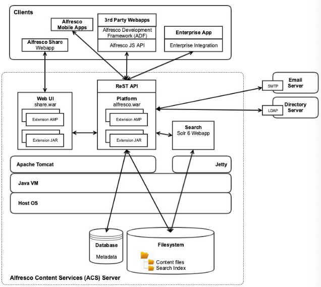

### “Монолитная” архитектура

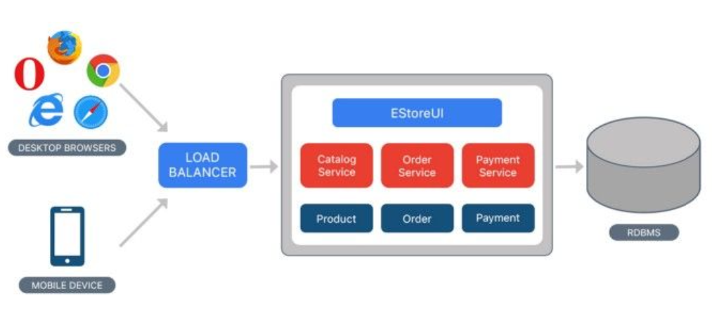

### Сервис-ориентированная архитектура

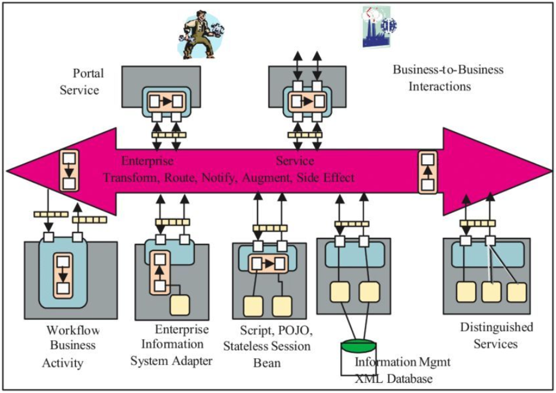

Приложение делится на модули – сервисы. Сервисы:
- Изолированы друг от друга.
- Обладают слабой связанностью (low coupling).
- Заменяемы.
- Общаются по стандартизированным протоколам.
- Нет никакого индустриального стандарта – можно использовать любые технологии.

### Принципы SOA

- Standardized Contract – интерфейсы взаимодействия должны быть чётко специфицированы.
- Reference Autonomy – взаимосвязи между сервисами должны быть сведены к минимуму.
- Location Transparency – то, где физически располагается сервис, не должно иметь значения при взаимодействии с ним.
- Longevity – сервисы должны разрабатываться с учётом возможности их длительного использования.
- Abstraction – внутренняя логика сервиса должна быть скрыта от клиента.
- Autonomy – сервисы должны самостоятельно контролировать собственную функциональность.
- Statelessness – сервис не должен сохранять состояние между обращениями к нему.
- Granularity – сервис должен реализовывать чётко специфицированный и логически обоснованный набор функций.
- Normalization – сервисы должны быть декомпозированы и нормализованы, чтобы минимизировать избыточность. 
- Composability – функциональность сервиса может строиться на базе функциональности других сервисов.
- Discovery – сервисы должны сопровождаться метаданными, позволяющими эффективно идентифицировать и использовать их.
- Reusability – логика приложения разбивается на локальные сервисы, что позволяет повторно использовать код.
- Encapsulation – в сервисы можно “оборачивать” функциональность приложений, построенных по принципам, отличным от SOA.

### Структура приложения

Любая SOA-система состоит из трёх видов “блоков”:

- Поставщик (service provider).
- Брокер (broker) / реестр (registry) / репозиторий (repository).
- Потребитель (requester / consumer).

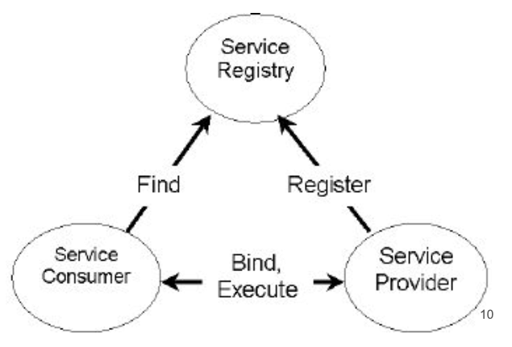

### Подходы к реализации, стандарты и протоколы

Тысячи их (SOA – это не только веб-сервисы!):
- Веб-сервисы на базе WSDL и SOAP.
- Системы обмена сообщениями (JMS, ActiveMQ / RabbitMQ).
- RESTful HTTP.
- WCF (by M$).
- Apache Thrift.
- gRPC (by Google).
- Микросервисы.

### Pros & Cons

Достоинства:
- Декомпозиция модулей.
- Можно использовать в разных модулях разные технологии.
- Можно модернизировать модули независимо друг от друга.
- (Теоретически) лучшая масштабируемость.
- Удобная интеграция “из коробки”.

Недостатки:
- Усложнение архитектуры.
- Система теряет целостность.
- Сложнее тестировать.
- Сложнее поддерживать.

## 2. Веб-сервисы

### Что такое веб-сервис

- Сервис, реализуемый одним устройством и используемый другими устройствами, взаимодействующими с первым через интернет.
- Приложение, запущенное на ЭВМ, “слушающее” запросы на определённом порту и возвращающее в ответ на них статический или динамический контент.

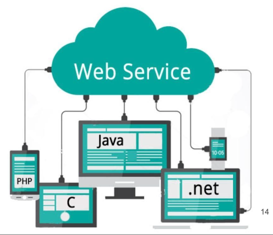

### Особенности веб-сервисов

- “Жёсткой” спецификации нет.
- Зато есть общие подходы к реализации.
- Практически любое веб-приложение подходит под определение веб-сервиса.
- В общем случае, веб-сервис более специализирован по сравнению с веб- приложением.

### Какие бывают веб-сервисы

- AJAX.
- RESTful.
- Использующие языки спецификации веб-
сервисов (WSDL, JSON-RPC etc).
- Стандартизированные W3C (на базе SOAP).
- Сервис может относиться сразу к нескольким категориям!

### AJAX

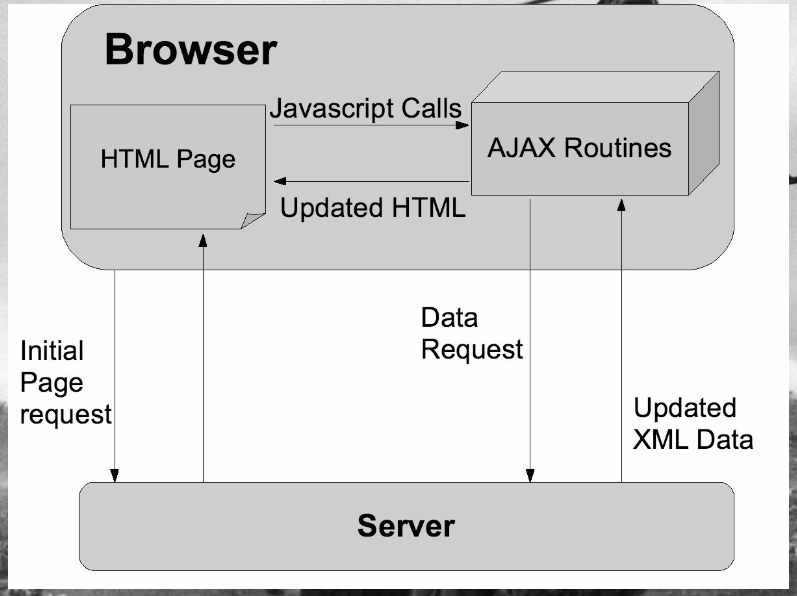

### RESTful Web Services

Веб-сервисы, построенные на основе идеологии REST: 
- Идеология предложена Роем Филдингом (Roy Fielding) в 2000 г. 
- Официального стандарта нет. 
- Обычно строится “поверх” протокола http.

Ключевая идея – каждый запрос клиента содержит в себе исчерпывающую информацию о желаемом ответе сервера.
Особенности: 
- Сервисы оперируют ресурсами (resource). 
- На ресурсы указывают URI. 
- Тип операции определяется методом http. 
- В ответ на запрос сервис может возвращать “полезную нагрузку” (payload). 
- Состояние не сохраняется (statelessness).

### Пример

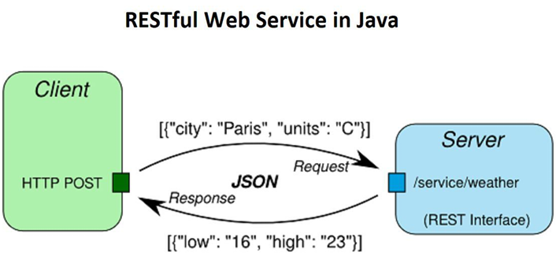

### Преимущества подхода

- Эффективное взаимодействие компонентов системы. 
- Масштабируемость. 
- Надёжность. 
- Простые и унифицированные интерфейсы. 
- Возможность ограничения доступа к отдельным сервисам без остановки всей системы.

### Языки спецификации веб-сервисов

- Их много. 
- Позволяют декларативно описать, что “умеет” веб-сервис. 
- Существуют как для RESTful, так и для SOAP. 
- Могут быть использованы для построения реестров веб-сервисов. 
- Могут быть использованы для автогенерации кода сервиса и / или клиента.

### Пример WSDL

```xml
<definitions name="HelloService"
    targetNamespace="http://www.examples.com/wsdl/HelloService.wsdl" xmlns="http://schemas.xmlsoap.org/wsdl/" xmlns:soap="http://schemas.xmlsoap.org/wsdl/soap/" xmlns:tns="http://www.examples.com/wsdl/HelloService.wsdl" xmlns:xsd="http://www.w3.org/2001/XMLSchema">

    <message name="getTermRequest">
        <part name="term" type="xs:string"/>
    </message>
    <message name="getTermResponse">
        <part name="value" type="xs:string"/>
    </message>
    
    <portType name="glossaryTerms"> 
        <operation name="getTerm"> 
            <input message="getTermRequest"/> 
            <output message="getTermResponse"/>
        </operation> 
    </portType>
    (...)
</definitions>
```

### SOAP

- Позволяет специфицировать интерфейсы веб-сервисов. 
- Предложен в 1998 г. для сервисов Microsoft. 
- Изначально расшифровывался как Simple Object Access Protocol, сейчас не расшифровывается никак. 
- Стандартизирован W3C в 2003 г.

### Особенности SOAP

- Основан на XML, является расширением стандарта XML-RPC. 
- Обычно работает “поверх” http. 
- Обычно используется совместно с дескрипторами веб-сервисов.

### SOAP vs RESTful

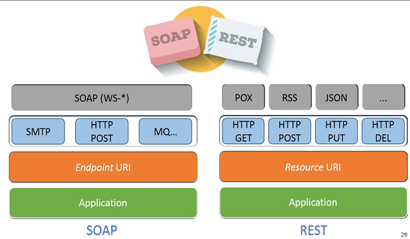

### SOAP: пример запроса

```xml
POST /Quotation HTTP/1.0
Host: www.xyz.org
Content-Type： text/xml; charset = utf-8
Content-Length: nnn

<?xml version = "1.0"?>
<SOAP-ENV:Envelope
    xmlns:SOAP-ENV = "http://www.w3.org/2001/12/soap-envelope"
    SOAP-ENV：encodingstyle = "http://wvzw.w3.org/2O01/12/soap-encoding">

    <SOAP-ENV：Body xmlns:m = "http://www.xyz.org/quotations">
        <m:GetQuotation>
            <m:QuotationsName>MiscroSoft</m:QuotationsName>
        </m：GetQuotation>
    </SOAP-ENV:Body>
</SOAP-ENV:Envelope>
```

### SOAP: пример ответа

```xml
HTTP/1.0 200 OK
Content-Type： text/xml； charset = utf-8
Content-Length： nnn

<?xml version ="1.0"?>
<SOAP-ENV:Envelope
    xmlns:SOAP-ENV = "http://www.w3.org/2001/12/soap-envelope"
    SOAP - ENV ： encodingStyle = " http ://\vw. w3.org/20Ol/12/soap-encoding ">

    <SOAP-ENV：Body xmlns:m = "http://www.xyz.org/quotation">
        <m:GetQuotationResponse>
            <m:Quotation>Here is the quotation</m:Quotation>
        </m:GetQuotationResponse>
    </SOAP-ENV:Body>
</SOAP-ENV:Envelope>
```

### Преимущества подхода

- Есть чёткая спецификация. 
- Есть готовые инфраструктурные решения. 
- Удобен для RPC-систем.

## 3. RESTful Web Services

### Особенности подхода

- RESTful – идеология, а не стандарт. 
- Любой обработчик запросов, соответствующий идеологии, можно считать RESTful веб-сервисом. 
- Можно использовать универсальные технологии (сервлеты, php-скрипты и т.д.). 
- Есть специально предназначенные фреймворки.

### Взаимодействие с ресурсом

- На ресурс указывает URI. 
- Два вида ресурсов: 
  - Осуществляющие манипуляции с данными. 
  - Выполняющие какие-либо операции.
  
### Интерпретация методов HTTP

| Метод | Ресурс, манипулирующий данными https://api.example.com/collec tion | Ресурс, выполняющий операции https://api.example.com/cluster s/1234/create-vm |
|---|---|---|
| POST |  | Вызывает операцию, интерфейс к которой предоставляет ресурс |
| GET | Возвращает объект в теле ответа | Возвращает статус асинхронной операции в теле ответа |
| PUT | Загружает объект из тела запроса на ресурс |  |
| PATCH | Обновляет какую-либо часть содержимого ресурса в соответствии с данными в теле запроса |  |
| DELETE | Удаляет содержимое ресурса. Последующий запрос GET вернёт HTTP 404. | Отменяет асинхронную операцию |

### RESTful Naming Conventions

Требований нет, есть рекомендации. 
- URL формируются иерархически. 
- Управляемые сущности именуются во множественном числе. 
- Обращение без параметра возвращает массив объектов. 
- Обращение с ИД возвращает конкретный объект.

- Получить список поставщиков:

  ```
  GET http://www.example.com/customers
  ```

- Добавить нового поставщика:

  ```
  POST http://www.example.com/customers
  ```

- Получить поставщика с ИД=12345:

  ```
  GET http://www.example.com/customers/12345
  ```

- Обновить данные о поставщике с ИД=12345:

  ```
  PUT http://www.example.com/customers/12345
  ```

- Получить все заказы поставщика с ИД=12345:

  ```
  GET http://www.example.com/customers/ 12345/orders
  ```

- Сложносоставные слова рекомендуется заменять иерархией. 
- Если без них всё-таки не обойтись, использовать snake-case (или hyphen-case, но не camel-case). 
- Семантика осуществляемого действия располагается в методе, а не в URL.

- Совсем плохо:

  ```
  GET http://www.example.com /getAllInvoicesForCustomer/12345
  ```

- Всё ещё плохо:

  ```
  GET http://www.example.com /get-all-invoices-for-customer/12345
  ```

- Уже лучше:

  ```
  GET http://www.example.com /customers/12345/get-all-invoices
  ```

- Совсем хорошо:

  ```
  GET http://www.example.com /customers/12345/invoices
  ```

### Веб-сервис на базе сервлета

```java
@WebServlet(value=”/customers”) public class Customerservice extends HttpServlet {
  // Return all customers @Override
  public void doGet(...) {...} // Create new customer @Override
  public void doPost(...) {...} // Update existing customer @Override
  public void doPut (...) {...} (...)
}
```

### OpenAPI

- Формализованная спецификация для описания и разработки REST API.
- Разрабатывается с 2010 г., раньше называлась Swagger Specification и была частью проекта Swagger Framework. 
- Разработка спонсируется Linux Foundation. 
- Не привязана к конкретной платформе и языку программирования. 
- Может быть использована вне протокола HTTP.

### Спецификация сервиса в OpenAPI

- Описание сервиса – файл JSON или YAML. 
- Набор доступных элементов определяется схемой. 
- Обязательные элементы описания сервиса – openapi, info и хотя бы один из элементов paths, components или webhooks.
- Также часто используются элементы
parameters, responses и security.

### Структура документа OpenAPI

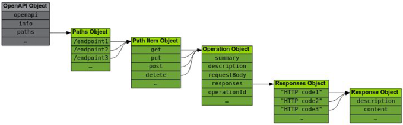

### Пример спецификации сервиса

```
paths:
    /pets:
        get:
            summary: List all pets 
            operationld: listPets 
            tags: 
                - pets 
            parameters: 
                - name: limit 
                  in: query 
                  description: How many items to return at one time (max 100) 
                  required: false 
                  schema:
                      type: integer 
                      format: int32 
            responses:
                '200': 
                description: An paged array of pets 
                headers: 
                    x-next:
                        description: A. link to the next page of responses 
                        schema: 
                            type: string 
                content:
                    application/json: 
                        schema:
                            $ref: "#/components/schemas/Pets" 
            
            default:
            description: unexpected error content:
            application/json: schema:
            $ref: "#/components/schemas/Error"
```

### Пример спецификации сервиса (продолжение)


- `/pets` – конечная точка (endpoint) path. 
- `get` – метод HTTP. 
- `parameters` – список параметров конечной точки. 
- `responses` – список ответов на запрос. 
- `200` – HTTP-код статуса. 
- `$ref` – ссылка на другую часть реализации, где определяется ответ.

### Swagger Framework

- После выделения OpenAPI в отдельный проект – набор инструментов для описания и разработки REST API. 
- По-прежнему тесно связан с OpenAPI на уровне спецификации и поддерживаемых форматов описания сервисов. 
- Может быть использован при разработке сервисов, взаимодействии с API и документировании сервисов.

### Использование Swagger

- Разработка сервисов – автоматическая генерация документов OpenAPI по коду сервисов или генерация стабов сервисов по спецификации API с помощью Swagger Codegen. 
- Взаимодействие с API – автоматическая генерация клиентских SDK по спецификации сервиса. 
- Документирование сервисов – возможность взаимодействия с сервисом с помощью Swagger UI.

### Утилиты в составе Swagger Framework

- Swagger Editor – редактор для создания спецификаций в формате OpenAPI. 
- Swagger UI – утилита для визуализации спецификации OpenAPI в виде интерактивного UI.
- Swagger Codegen – утилита, позволяющая сгенерировать стаб реализации сервиса по спецификации API.

### Swagger Editor

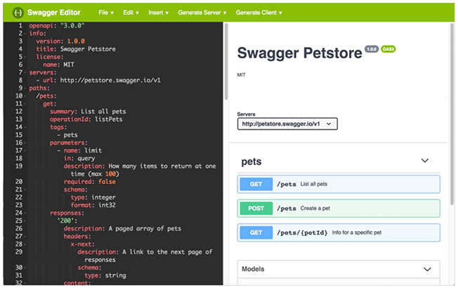

### Swagger UI

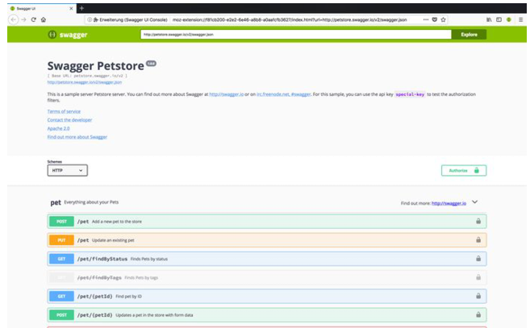

### Swagger Codegen

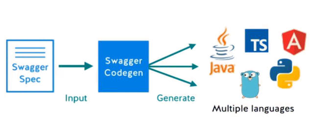

### HATEOAS

- Hypermedia as the Engine of Application State – архитектурный принцип, накладывающий ряд дополнительных ограничений на REST-приложения. 
- Основан на концепции гипермедиа. 
- Основной принцип – клиенту не требуется заранее знать, как взаимодействовать с сервисом за пределами гипермедиа. 
- В отличие от SOA, нет обязательного заранее определённого протокола взаимодействия клиента с сервисом.

### Алгоритм работы HATEOAS

1. REST-клиент обращается к фиксированному URL.
2. Все последующие действия определяются “по ходу работы” из возвращаемых сервисом ресурсов. 
3. Типы ресурсов, представления и их связи стандартизированы.

### Пример реализации HATEOAS

Запрос состояния счёта:

```
GET /accounts/12345 HTTP/1.1
Host: bank.example.com Accept: application/xml ...
```

Ответ сервера:

```xml
HTTP/1.1 200 OK
Content-Type: application/xml
Content-Length: ...

<?xml version="1.0"?>
<account>
    <caccount_number>12345</account_number>
    <balance currency="usd">100.00</balance>
    <link rel="deposit" href="https://bank.example.com/accounts/12345/deposit" />
    <link rel="withdraw" href="https://bank.example.com/accounts/12345/withdraw" />
    <link rel="transfer" href="https://bank.example.com/accounts/12345/transfer" />
    <link rel="close" href="https://bank.example.com/accounts/12345/close" />
</account>
```

Ответ сервера в случае отрицательного баланса:

```xml
HTTP/1.1 200 OK
Content-Type: application/xml
Content-Length: ...

<?xml versions"1.0"?>
<account>
    <account_number>12345</account_number>
    <balance currency="usd">-25.00</balance>
    <tink rel="deposit" href="https://bank.example.com/account/12345/deposit" />
</account>
```

## 4. JAX-RS

### JAX-RS

- Спецификация API для разработки веб- сервисов. 
- Аббревиатура от Jakarta RESTful Web Services. 
- Разработана в составе проекта Apache Jakarta. 
- Включена в специфика- ции Java SE 7+ и Java EE 6+. 
- Есть эталонная реализа- ция -- Jersey.

### Особенности JAX-RS

- Позволяет создавать REST API к компонентам с помощью аннотаций. 
- Часть Java EE – работает на любом сервере приложений. 
- Внутри сервисов доступны API всех компонентов Java EE. 
- Аннотации можно применять внутри любых компонентов.

### Аннотации JAX-RS

- `@Path` – путь (URL) к ресурсу или методу.
- `@GET`, `@PUT`, `@POST`, `@DELETE` и `@HEAD` – метод HTTP-запроса, который будет обработан ресурсом. 
- `@Produces` – тип возвращаемого контента
(`text/html` etc).
- `@Consumes` – тип обрабатываемого контента (`text/json` etc).

### Вспомогательные аннотации JAX-RS

- `@PathParam` – отображает элемент иерархии URL на параметр метода. 
- `@QueryParam` – отображает параметр из URL на параметр метода. 
- `@MatrixParam` – отображает матричный параметр HTTP-запроса на параметр метода. 
- `@HeaderParam` – отображает заголовок HTTP-запроса на параметр метода.
- `@CookieParam` – отображает cookie на параметр метода. 
- `@FormParam` – отображает параметр POST- запроса на параметр метода. 
- `@DefaultValue` – определяет значение по умолчанию для параметра метода. 
- `@Context` – позволяет получить контекстно- связанный объект (например, `@Context
HttpServletRequest request`).

### Пример сервиса JAX-RS

```java
import javax.ws.rs.core.MediaType;

@Path("/todo")
public class TodoResource {
    // This method is called if XML is requested
    @GET
    @Produces({MediaType.APPLICATION_XML})
    public Todo getXML() {
        Todo todo = new Todo();
        todo.setSummary("Application XML Todo Summary");
        todo.setDescription("Application XML Todo Description"); 
        return todo;
    }
// This method is celled if JSON is requested
    @GET
    @Produces({MediaType.APPLICATION_JSON})
    public Todo getJSON() {
        Todo todo = new Todo();
        todo.setSummary("Application JSON Todo Summary");
        todo.setDescription("Application JSON Todo Description"); 
        return todo;
    }

    // This can be used to test the integration with the browser
    @GET
    @Produces({ MediaType.TEXT_XML })
    public Todo getHTMLO {
        Todo todo = new Todo();
        todo.setSummary("XML Todo Summary");
        todo.setDescription("XML Todo Description");
        return todo;
    }
}
```

```java
public class TodoTest {
    public static void main(String[] args) {
        ClientConfig config = new ClientConfig();
        Client client = ClientBuilder.newClient(config);

        WebTarget target = client.target(getBaseURI());
        // Get XML
        String xmlResponse = target.path("rest").path("todo").request()
                .accept(MediaType.TEXT_XML).get(St ring.class);
        // Get XML for application
        String xmlAppResponse =target.path("rest").path("todo").request()
                .accept(MediaType.APPLICATION_XML).get(String.class);
        // Get JSON for application
        String jsonResponse = target.path("rest").path("todo").request()
                .accept(MediaType.APPLICATIONSSON).get(St ring.class);
        
        Systern.out.printIn(xmlResponse);
        System.out.printIn(xmlAppResponse);
        System.out.printIn(jsonResponse);
    }

    private static URI getBaseURI() {
        return UriBuilder.fromUri(
                "http://localhost:8080/com.vogella.jersey.jaxb").build();
    }
}
```

### JAX-RS: разработка сервиса

Порядок действий: 
1. Создаём проект (в случае Maven можно использовать архетип `maven-archetype-webapp`).
2. Добавляем зависимости JAX-RS (если версия JDK < 7).
3. Создаём описание представления ресурса (например, с помощью JAXB). 
4. Создаём ресурс REST (сам веб-сервис). 
5. Регистрируем ресурс.

### JAX-RS: описание представления ресурса

- Опционально – в принципе, можем передавать что угодно. 
- В каноничном варианте реализуется с помощью аннотаций JAXB – `@XmlRootElement`,
`@XmlAttribute`, `@XmlElement` и т.д.

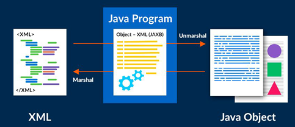

### Описание представления ресурса

```java
(...)
@XmlRootElement(name = "student") 
@XmlAccessorType(XmlAccessType.FIELD) 
public class Student { 
    @XmlAttribute 
    private Integer id;
    @XmlElement 
    private String name; 
    (...)
}
```

### Описание представления коллекции

```java
@XmlRootElement(name = "student") 
@XmlAccessorType(XmlAccessType.FIELD) 
public class Student { 
    @XmlAttribute 
    private Integer size;
    @XmlElement 
    private List<Student> students;
    (...)
}
```

### Ещё один пример сервиса

```java
@Path("/students") 
@Produces("application/xml") 
public class StudentResource {
    @GET
    public Students getStudents() { 
        List<Student> list = StudentDB.getAllStudents(); 
        Students s = new Students(); 
        students.setStudents(list); 
        return students;
    }

    @GET
    @Path("/{id}") 
    public Response getStudentById(@PathParam("id") Integer id) { 
        Student s = StudentDB.getStudent(id); 
        if(s == null) { 
            Return Response.status(NOT_FOUND).build();
        } else { 
            return Response.status(OK).entity(s).build();
        }
    }
    (...)
```

### Регистрация сервиса

