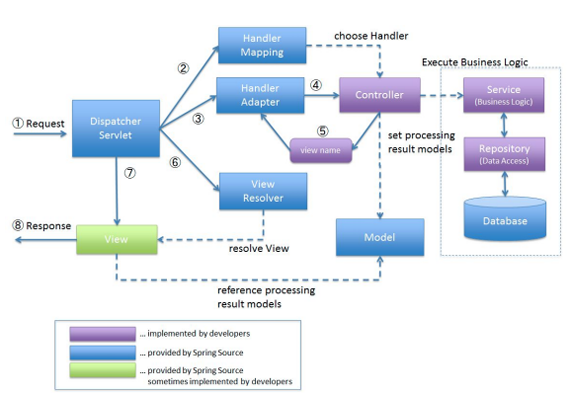

## [MainPage](../index.md)/[SOA](./README.md)/Rubiesh 1

- [MainPage/SOA/Rubiesh 1](#mainpagesoarubiesh-1)
  - [Вариант 1](#вариант-1)
    - [1. Все про SOAP  关于 SOAP 的一切](#1-все-про-soap--关于-soap-的一切)
    - [2. Все про самоподписанные сертификаты  关于自签名证书的所有信息](#2-все-про-самоподписанные-сертификаты--关于自签名证书的所有信息)
    - [3. Реализовать rest сервис на jaxrs для работы с корзиной покупок. Формат данных - xml  在 jaxrs 上实现REST服务以与购物车配合使用。数据格式-xml](#3-реализовать-rest-сервис-на-jaxrs-для-работы-с-корзиной-покупок-формат-данных---xml--在-jaxrs-上实现rest服务以与购物车配合使用数据格式-xml)
  - [Вариант 2](#вариант-2)
    - [1. Правила именования RESTful ресурсов  RESTful资源的命名规则](#1-правила-именования-restful-ресурсов--restful资源的命名规则)
    - [2. TLS/SSL в иерархии протоколов  协议层次结构中的 TLS/SSL](#2-tlsssl-в-иерархии-протоколов--协议层次结构中的-tlsssl)
    - [3. Открыть из репозитория спринг дата рест все не публичные методы  从 Spring Data Rest 存储库中打开所有非公共方法](#3-открыть-из-репозитория-спринг-дата-рест-все-не-публичные-методы--从-spring-data-rest-存储库中打开所有非公共方法)
  - [Вариант 3](#вариант-3)
    - [1. Монолитная архитектура: особенности, достоинства, недостатки  单体架构：特点、优点、缺点](#1-монолитная-архитектура-особенности-достоинства-недостатки--单体架构特点优点缺点)
    - [2. Стратегии экспорта в репозиториях Spring Data Rest.  Spring Data Rest 存储库中的导出策略。](#2-стратегии-экспорта-в-репозиториях-spring-data-rest--spring-data-rest-存储库中的导出策略)
    - [3. Дан Spring Data репозиторий с одним методом. Превратить его в Spring Data Rest и сделать так, чтобы в интернеты торчал только этот метод  给定一个带有一种方法的 Spring 数据存储库。将其转换为 Spring Data Rest 并确保只有此方法在互联网上脱颖而出](#3-дан-spring-data-репозиторий-с-одним-методом-превратить-его-в-spring-data-rest-и-сделать-так-чтобы-в-интернеты-торчал-только-этот-метод--给定一个带有一种方法的-spring-数据存储库将其转换为-spring-data-rest-并确保只有此方法在互联网上脱颖而出)
  - [Вариант 4](#вариант-4)
    - [1. Особенности разработки RESTful на Spring  Spring RESTful开发的特点](#1-особенности-разработки-restful-на-spring--spring-restful开发的特点)
    - [2. keytool, основные команды  keytool，基本命令](#2-keytool-основные-команды--keytool基本命令)
    - [3. На основе сервлетов сервис для создания резиновых уточек по 3д модели с управлением заказами, возможностью указать размеры утки и партии  基于 Servlet 的服务，用于从 3D 模型创建橡皮鸭，具有订单管理功能，能够指定鸭子和批量大小](#3-на-основе-сервлетов-сервис-для-создания-резиновых-уточек-по-3д-модели-с-управлением-заказами-возможностью-указать-размеры-утки-и-партии--基于-servlet-的服务用于从-3d-模型创建橡皮鸭具有订单管理功能能够指定鸭子和批量大小)
  - [Вариант 5](#вариант-5)
    - [1. основные принципы soa  soa的基本原理](#1-основные-принципы-soa--soa的基本原理)
    - [2. spring data rest - конфигурация, основные аннотации  spring data Rest - 配置、基本注释](#2-spring-data-rest---конфигурация-основные-аннотации--spring-data-rest---配置基本注释)
    - [3. спецификация (url'ы) веб-сервиса, реализующего домофон  实现对讲的 Web 服务的规范（url）](#3-спецификация-urlы-веб-сервиса-реализующего-домофон--实现对讲的-web-服务的规范url)
  - [Вариант 6](#вариант-6)
    - [1. что-то про soa  关于 soa 的一些事情](#1-что-то-про-soa--关于-soa-的一些事情)
    - [2. Особенности, схожесть и отличие ssl и tls  ssl和tls的特点、异同](#2-особенности-схожесть-и-отличие-ssl-и-tls--ssl和tls的特点异同)
    - [3. spring data rest сервис к репозиторию  spring data Rest服务到存储库](#3-spring-data-rest-сервис-к-репозиторию--spring-data-rest服务到存储库)
    - [4. (Alternative)  Дан Spring Data Rest репозиторий с 1 методом public, который наследует crudrepository. Сделать так, чтобы все методы паблик стали доступны  （替代方案）给定一个带有 1 个公共方法的 Spring Data Rest 存储库，该存储库继承 crudrepository。使所有公共方法可用](#4-alternative--дан-spring-data-rest-репозиторий-с-1-методом-public-который-наследует-crudrepository-сделать-так-чтобы-все-методы-паблик-стали-доступны--替代方案给定一个带有-1-个公共方法的-spring-data-rest-存储库该存储库继承-crudrepository使所有公共方法可用)
  - [Вариант 7](#вариант-7)
    - [1. Создание контроллера в спринг  在 Spring 中创建控制器](#1-создание-контроллера-в-спринг--在-spring-中创建控制器)
    - [2. Криптография в веб приложениях  Web 应用程序中的密码学](#2-криптография-в-веб-приложениях--web-应用程序中的密码学)
    - [3. Jax-rs казино Jax-rs](#3-jax-rs-казино-jax-rs)
  - [Вариант 8](#вариант-8)
    - [1. Jax-rs ключевые моменты  Jax-rs 要点](#1-jax-rs-ключевые-моменты--jax-rs-要点)
    - [2. Spring data rest особенности отличия от spring mvc rest  Spring Data Rest 与 Spring MVC Rest 的区别](#2-spring-data-rest-особенности-отличия-от-spring-mvc-rest--spring-data-rest-与-spring-mvc-rest-的区别)
    - [3. Управление банкоматом на сервлетах  使用 servlet 管理 ATM](#3-управление-банкоматом-на-сервлетах--使用-servlet-管理-atm)
  - [Вариант 9](#вариант-9)
    - [1. Понятие ресурса в RESTful. Виды ресурсов  RESTful 中资源的概念。资源类型](#1-понятие-ресурса-в-restful-виды-ресурсов--restful-中资源的概念资源类型)
    - [2. KeyStore и TrustStore в Java. Утилита keytool  Java 中的 KeyStore 和 TrustStore。密钥工具实用程序](#2-keystore-и-truststore-в-java-утилита-keytool--java-中的-keystore-和-truststore密钥工具实用程序)
    - [3. Написать веб-сервис на JAX-RS, который управляет шлагбаумом  在 JAX-RS 中编写一个控制屏障的 Web 服务](#3-написать-веб-сервис-на-jax-rs-который-управляет-шлагбаумом--在-jax-rs-中编写一个控制屏障的-web-服务)
  - [Вариант 10](#вариант-10)
    - [1. Языки спецификации веб-сервисов  Web 服务规范语言](#1-языки-спецификации-веб-сервисов--web-服务规范语言)
    - [2. Архитектура spring web mvc  Spring Web MVC架构](#2-архитектура-spring-web-mvc--spring-web-mvc架构)
    - [3. Последовательность команд для конфигурации двунаправленного взаимодействия двух серверов приложений WildFly путём взаимного вызова Restful веб-сервисов  通过相互调用 Restful Web 服务来配置两个 WildFly 应用程序服务器之间双向交互的命令序列](#3-последовательность-команд-для-конфигурации-двунаправленного-взаимодействия-двух-серверов-приложений-wildfly-путём-взаимного-вызова-restful-веб-сервисов--通过相互调用-restful-web-服务来配置两个-wildfly-应用程序服务器之间双向交互的命令序列)
  - [Вариант 11](#вариант-11)
    - [1. Структура SOA приложения  构建 SOA 应用程序](#1-структура-soa-приложения--构建-soa-应用程序)
    - [2. Виды ресурсов в Spring Data REST  Spring Data REST 中的资源类型](#2-виды-ресурсов-в-spring-data-rest--spring-data-rest-中的资源类型)
    - [3. Написать спецификацию (url'ы) сервиса по записи студентов на курсы.  为学生注册课程的服务编写规范 (url)。](#3-написать-спецификацию-urlы-сервиса-по-записи-студентов-на-курсы--为学生注册课程的服务编写规范-url)
  - [Вариант 12](#вариант-12)
    - [1. Описание представления ресурса JAX-RS  JAX-RS 资源视图的描述](#1-описание-представления-ресурса-jax-rs--jax-rs-资源视图的描述)
    - [2. Криптография в приложениях на Java: особенности, стандарты, протоколы  Java 应用程序中的密码学：特性、标准、协议](#2-криптография-в-приложениях-на-java-особенности-стандарты-протоколы--java-应用程序中的密码学特性标准协议)
    - [3. Restful-сервис на базе сервлета, реализующий механизм управления номеронабирателем телефонного аппарата. Номеронабиратель должен поддерживать функции локальных, междугородних и международных звонков, а также автодозвон  基于 Servlet 的 Restful 服务，实现管理电话拨号器的机制。拨号器必须支持本地、长途、国际电话以及自动拨号功能](#3-restful-сервис-на-базе-сервлета-реализующий-механизм-управления-номеронабирателем-телефонного-аппарата-номеронабиратель-должен-поддерживать-функции-локальных-междугородних-и-международных-звонков-а-также-автодозвон--基于-servlet-的-restful-服务实现管理电话拨号器的机制拨号器必须支持本地长途国际电话以及自动拨号功能)
  - [Вариант 13](#вариант-13)
    - [1. СОА - особенности, плюсы и минусы  SOA——特点、优点和缺点](#1-соа---особенности-плюсы-и-минусы--soa特点优点和缺点)
    - [2. SSL/TLS - особенности, отличия и сходства  SSL/TLS - 特性、差异和相似之处](#2-ssltls---особенности-отличия-и-сходства--ssltls---特性差异和相似之处)
    - [3. Дан Spring Data Rest репозиторий с 1 методом public, который наследует crudrepository. Сделать так, чтобы все методы паблик стали доступны  给定一个带有 1 个公共方法的 Spring Data Rest 存储库，该方法继承 crudrepository。使所有公共方法可用](#3-дан-spring-data-rest-репозиторий-с-1-методом-public-который-наследует-crudrepository-сделать-так-чтобы-все-методы-паблик-стали-доступны--给定一个带有-1-个公共方法的-spring-data-rest-存储库该方法继承-crudrepository使所有公共方法可用)


### Вариант 1

#### 1. Все про SOAP <br> 关于 SOAP 的一切

SOAP - формат обмена сообщениями  
SOAP——消息交换格式

- Протокол для разработки веб-сервисов.  
  用于开发网络服务的协议。
- Базируется на идеологии RPC.  
  基于RPC思想。
- Стандартизирован W3C.  
  由 W3C 标准化。
- Есть реализации “по умолчанию” для различных платформ.  
  各种平台都有“默认”实现。
- Предполагает использование инфраструктурного ПО – реестров и сервисных шин.  
  涉及基础设施软件的使用 - 注册表和服务总线。


Структура документа WSDL:  
WSDL文档结构：

- Types (определение типов данных) — определение вида отправляемых и получаемых сервисом XML-сообщений.  
  类型（数据类型的定义）- 服务发送和接收的 XML 消息类型的定义。
- Message (элементы данных) — сообщения, используемые web-сервисом  
  消息（数据元素）- Web 服务使用的消息
- PortType (абстрактные операции) — список операций, которые могут быть выполнены сообщениями.  
  PortType（抽象操作）- 可以由消息执行的操作列表。
- Binding (связывание сервисов) — способ, которым сообщение будет доставлено.  
  绑定（链接服务）- 消息传递的方式。

SOAP всегда содержит 3 уровня в структуре (+1 дополнительный):  
SOAP 在其结构中始终包含 3 个级别（+1 个额外级别）：
— Envelope (конверт) – корневой элемент, который определяет сообщение и пространство имен, использованное в документе,  
  Envelope（信封）——定义文档中使用的消息和命名空间的根元素，
— Header (заголовок) – содержит атрибуты сообщения, например: информация о безопасности или о сетевой маршрутизации,  
  标头（header）——包含消息属性，例如：安全或网络路由信息，
— Body (тело)   
  身体（身体）
– содержит сообщение, которым обмениваются приложения,  
  包含应用程序之间交换的消息，
— Fault – необязательный элемент, который предоставляет информацию об ошибках, которые произошли при обработке сообщений. И запрос, и ответ должны соответствовать структуре SOAP.  
  故障 – 可选元素，提供有关处理消息时发生的错误的信息。请求和响应都必须遵循 SOAP 结构。

SOAP: Позволяет специфицировать интерфейсы веб-сервисов.  
SOAP：允许 Web 服务接口规范。
Особенности:  
特点：

- Основан на XML, является расширением стандарта XML-RPC.  
  基于 XML，XML-RPC 标准的扩展。
- Обычно работает “поверх” http.  
  通常在http“之上”工作。
- Обычно используется совместно с дескрипторами веб-сервисов.  
  通常与 Web 服务描述符结合使用。


WSDL: Web Services Description Language – язык спецификации SOAP веб-сервисов.  
WSDL：Web 服务描述语言 – SOAP Web 服务规范语言。
- Базируется на XML.  
  基于 XML
- Описывает весь интерфейс сервиса:  
  描述整个服务接口：
  - функции;  
    功能； 
  - аргументы; 
    参数 
  - возвращаемые значения. 
    返回值 
- Может автогенерироваться по API сервиса, или, наоборот – API сервиса может автогенерироваться по WSDL.
  可以根据服务的 API 自动生成，或者反过来——服务的API可以根据 WSDL 自动生成。

Пример запроса и ответа:

```xml
POST /Quotation HTTP/1.0
Host: www.xyz.org
Content-Type： text/xml; charset = utf-8
Content-Length: nnn

<?xml version = "1.0"?>
<SOAP-ENV:Envelope
    xmlns:SOAP-ENV = "http://www.w3.org/2001/12/soap-envelope"
    SOAP-ENV：encodingstyle = "http://wvzw.w3.org/2O01/12/soap-encoding">

    <SOAP-ENV：Body xmlns:m = "http://www.xyz.org/quotations">
        <m:GetQuotation>
            <m:QuotationsName>MiscroSoft</m:QuotationsName>
        </m：GetQuotation>
    </SOAP-ENV:Body>
</SOAP-ENV:Envelope>
```

```xml
HTTP/1.0 200 OK
Content-Type： text/xml； charset = utf-8
Content-Length： nnn

<?xml version ="1.0"?>
<SOAP-ENV:Envelope
    xmlns:SOAP-ENV = "http://www.w3.org/2001/12/soap-envelope"
    SOAP - ENV ： encodingStyle = " http ://\vw. w3.org/20Ol/12/soap-encoding ">

    <SOAP-ENV：Body xmlns:m = "http://www.xyz.org/quotation">
        <m:GetQuotationResponse>
            <m:Quotation>Here is the quotation</m:Quotation>
        </m:GetQuotationResponse>
    </SOAP-ENV:Body>
</SOAP-ENV:Envelope>
```

Преимущества: 优点：

- Есть чёткая спецификация.  
  有明确的规范。
- Есть готовые инфраструктурные решения.  
  有现成的基础设施解决方案。
- Удобен для RPC-систем.  
  方便 RPC 系统。

Отличие от REST: SOAP ограничивает структуры ваших сообщений, тогда как REST — это архитектурный подход, ориентированный на использование HTTP в качестве транспортного протокола.  
与 REST 的区别：SOAP 限制消息的结构，而 REST 是一种专注于使用 HTTP 作为传输协议的架构方法。

#### 2. Все про самоподписанные сертификаты <br> 关于自签名证书的所有信息

В криптографии под самоподписанным SSL сертификатом понимают сертификат открытого ключа, изданный и подписанный тем же лицом, которое он
идентифицирует. Проще говоря, если Вы сами для своего домена или IP-адреса создали SSL сертификат он будет называться самоподписанным. Также существуют другие названия: «самоизданный» или «самозаверенный», что является одним и тем же.

- Сертификат, выданный самим его субъектом. 
- Не может быть отозван. 
- Технически, все сертификаты CA являются самоподписанными. 
- СА - Центр сертификации, удостоверяющий центр (Certification Authority, CA) -- организация, “чья честность неоспорима, а открытый ключ широко известен” (С). 
- Подтверждает подлинность ключей шифрования своим сертификатом. 
- Обычно сертификаты объединяются в цепочки.

#### 3. Реализовать rest сервис на jaxrs для работы с корзиной покупок. Формат данных - xml <br> 在 jaxrs 上实现REST服务以与购物车配合使用。数据格式-xml

```java
@Data 
@XmlRootElement(name="products")
@XmlAccessorType(XmlAccessType.FIELD)
public class Product {
    @XmlElement(required=true)
    protected int id;
    @XmlElement(required=true)
    protected String name;
    @XmlElement(required=true)
    protected String description;
    @XmlElement(required=true)
    protected int price;
}

@Data
@XmlRootElement(name="basket")
@XmlAccessorType(XmlAccessType.FIELD)
public class Basket {

    @XmlElement(required=true)
    protected int id;

    @XmlElement(required=true)
    protected List<Product> products;
}

@Path("/baskets")
public class BasketService {
    private Repository rep = new Repository();

    @POST
    @Consumes("application/xml")
    public Basket createBasket() { 
        return Mapper.mapBasket(rep.createBasket());;
    }

    @GET
    @Consumes("application/xml")
    public Basket getBasket() {
        return Mapper.mapBasket(rep.getBasket());
    }

    @PUT
    @Path("/{id}") @Consumes("application/xml")
    public Basket addProduct(@PathParam("id") Long id, Product prod) {
        rep.addProduct(id, Mapper.mapToEntityProduct(prod)); 
        return getProduct();
    }

    @POST
    @Path("{id}/products/{prodId}") @Consumes("application/xml")
    public void addProduct(@PathParam("id") Long id, @PathParam("prodId") Long prodId) {
        rep.addProduct(id, prodId);
    }
    @DELETE
    @Path("{id}/products/{prodId}") @Consumes("application/xml")
    public void deleteProduct(@PathParam("id") Long id, @PathParam("prodId") Long prodId) {
        rep.deleteProduct(id, prodId);
    }
    @DELETE
    @Path("{id}") @Consumes("application/xml")
    public void deleteBasket(@PathParam("id") Long id) {
        rep.deleteBasket(id);
    }
}
```

### Вариант 2

#### 1. Правила именования RESTful ресурсов <br> RESTful资源的命名规则

Требований нет, есть рекомендации. 
- URL формируются иерархически. 
- Управляемые сущности именуются во множественном числе. 
- Обращение без параметра возвращает массив объектов. 
- Обращение с ИД возвращает конкретный объект.

- Получить список поставщиков:

  ```
  GET http://www.example.com/customers
  ```

- Добавить нового поставщика:

  ```
  POST http://www.example.com/customers
  ```

- Получить поставщика с ИД=12345:

  ```
  GET http://www.example.com/customers/12345
  ```

- Обновить данные о поставщике с ИД=12345:

  ```
  PUT http://www.example.com/customers/12345
  ```

- Получить все заказы поставщика с ИД=12345:

  ```
  GET http://www.example.com/customers/ 12345/orders
  ```

- Сложносоставные слова рекомендуется заменять иерархией. 
- Если без них всё-таки не обойтись, использовать snake-case (или hyphen-case, но не camel-case). 
- Семантика осуществляемого действия располагается в методе, а не в URL.

- Совсем плохо:

  ```
  GET http://www.example.com /getAllInvoicesForCustomer/12345
  ```

- Всё ещё плохо:

  ```
  GET http://www.example.com /get-all-invoices-for-customer/12345
  ```

- Уже лучше:

  ```
  GET http://www.example.com /customers/12345/get-all-invoices
  ```

- Совсем хорошо:

  ```
  GET http://www.example.com /customers/12345/invoices
  ```

#### 2. TLS/SSL в иерархии протоколов <br> 协议层次结构中的 TLS/SSL


SSL (Secure Sockets Layer) и TLS (Transport Level Security)
Протокол SSL размещается между двумя протоколами (работает фильтром, защищая
данные): 

1. протоколом, который использует программа-клиент (напр., HTTP) и транспортным протоколом TCP/IP

Работу протокола SSL можно разделить на два уровня:
- Слой протокола подтверждения подключения (Handshake Protocol Layer), который состоит из трех подпротоколов:
  - Протокол подтверждения подключения (Handshake Protocol) - цепочка
  обмена данными, для начала аутентификации сторон и согласовывания шифрования
  - Протокол изменения параметров шифра (Cipher Spec Protocol) - для
  изменения данных ключа
  - Предупредительный протокол (Alert Protocol) - содержит сообщение, которое
  показывает сторонам изменение статуса или сообщает о возможной ошибке
- Слой протокола записи (Record Protocol Layer) - протокол:
  - принимает сообщения, которые нужно передать,
  - фрагментирует данные в управляемые блоки,
  - разумно сжимает данные, применяя MAC (message authentication code),
  - Шифрует
  - передаёт результат.

#### 3. Открыть из репозитория спринг дата рест все не публичные методы <br> 从 Spring Data Rest 存储库中打开所有非公共方法

```java
/*
* spring.data.rest.detection-strategy=annotation
*/
@Repository
public interface UserRepository extends Repository<User, Long> {
    @RestResource(exported = false)
    public User save(User user);
    @RestResource(exported = false)
    public Optional<User> findById(Long id);
    @RestResource
    Optional<User> findByUsername(String username);
    @RestResource
    void deleteByCityName(String cityName);
}
```

### Вариант 3

#### 1. Монолитная архитектура: особенности, достоинства, недостатки <br> 单体架构：特点、优点、缺点

Монолитное приложение состоит из базы данных, клиентского пользовательского интерфейса, серверного приложения

Плюсы:

Простое развертывание. Использование одного исполняемого файла или каталога упрощает развертывание.

Разработка. Приложение легче разрабатывать, когда оно создано с использованием одной базы кода.

Производительность. В централизованной базе кода и репозитории один интерфейс API часто может выполнять ту функцию, которую при работе с микросервисами выполняют многочисленные API.

Упрощенное тестирование. Монолитное приложение представляет собой единый централизованный модуль, поэтому сквозное тестирование можно проводить быстрее, чем при использовании распределенного приложения.

Удобная отладка. Весь код находится в одном месте, благодаря чему становится легче выполнять запросы и находить проблемы.

Минусы:

- Кодовая база со временем становится громоздкой
  
С течением времени большинство продуктов продолжают разрабатываться и
увеличиваются в объеме, а их структура становится размытой. В этот момент и
масштабирование становится сложным (так как нельзя масштабировать отдельные части
вашей системы)

- Сложно внедрять новые технологии

Добавление новой технологии означает переписывание всего приложения, что является
дорогостоящим и требует много времени.

+/- по SOA по сравнению с монолитной архитектурой:

Достоинства:

- Декомпозиция модулей.
- Можно использовать в разных модулях разные технологии.
- Можно модернизировать модули независимо друг от друга.
- (Теоретически) лучшая масштабируемость.
- Удобная интеграция “из коробки”.

Недостатки:

- Усложнение архитектуры.
- Система теряет целостность.
- Сложнее тестировать.
- Сложнее поддерживать

#### 2. Стратегии экспорта в репозиториях Spring Data Rest. <br> Spring Data Rest 存储库中的导出策略。

| Наименование | Описание                                                                                                                  |
|--------------|---------------------------------------------------------------------------------------------------------------------------|
| `DEFAULT`      | Открывает наружу все публичные интерфейсы репозитория, но учитывает флаг exported в аннотациях @(Repository)RestResource. |
| `ALL`          | Открывает наружу все интерфейсы репозитория без учёта модификаторов доступа и аннотаций.                                  |
| `ANNOTATION`   | Открывает наружу только ресурсы, помеченные аннотациями @ (Repository) RestResource с учётом значения флага exported.     |
| `VISIBILITY`   | Открывает наружу только публичные аннотированные ресурсы.                                                                 |

Для Spring Boot: 
Настройка происходит путём добавления строчки в application.properties: 

```
spring.data.rest.detection-strategy=visibility
```

P.S. флаг exported ставится в аннотации `@RestResource` над методом репозитория:

```java
@RestResource(exported = false)
void deleteById(Long aLong);
```
Или над самим репозиторием, если необходимо скрыть все его методы:

```java
@RepositoryRestResource(exported = false) was
interface PersonRepository extends CrudRepository<Person, Long> {}
```

#### 3. Дан Spring Data репозиторий с одним методом. Превратить его в Spring Data Rest и сделать так, чтобы в интернеты торчал только этот метод <br> 给定一个带有一种方法的 Spring 数据存储库。将其转换为 Spring Data Rest 并确保只有此方法在互联网上脱颖而出

Добавляем в  application.properties:
```java
spring.data.rest.detection-strategy=visibility
```

Далее пишем репозиторий:

```java
@RepositoryRestResource(collectionResourceRel = "car", path = "cars")
public interface CarRepository extends Repository<Car, Long> { 
    public Car save(Car car);
}
```

### Вариант 4

#### 1. Особенности разработки RESTful на Spring <br> Spring RESTful开发的特点

1. Особенности разработки RESTful на Spring
2. ключевых фреймворка:
- Spring Web MVC 
- Spring Data REST

Spring Web MVC:
- “базовый” фреймворк в составе Spring для разработки веб приложений. 
- Универсальный, на клиентской стороне интегрируется с популярными JS фреймворками. 
- Удобен для разработки веб сервисов Архитектура:


Состав приложения: 
- Model -- инкапсулирует данные приложения (состоят из POJO или бинов). 
- View -- отвечает за отображение данных модели. 
- Controller -- обрабатывает запрос пользователя, создаёт соответствующую модель и передаёт её для отображения в представление.

Dispatcher Servlet: 
- Обрабатывает все запросы и формирует ответы на них. 
- Связывает между собой все элементы архитектуры Spring MVC. 
- Обычный сервлет -- конфигурируется в web.xml.
Обработка запроса:



1. DispatcherServlet получает запрос. 
2. DispatcherServlet отправляет задачу выбора подходящего контроллера в HandlerMapping. HandlerMapping выбирает контроллер, который сопоставляется с URL-адресом входящего запроса, и возвращает (выбранный обработчик) и контроллер в DispatcherServlet. 
3. DispatcherServlet отправляет задачу выполнения бизнес-логики Controller на HandlerAdapter. 
4. HandlerAdapter вызывает процесс бизнес-логики контроллера. 
5. Controller выполняет бизнес-логику, устанавливает результат обработки в Модель и возвращает логическое имя представления в HandlerAdapter. 
6. DispatcherServlet отправляет задачу разрешения представления, соответствующего имени представления, в ViewResolver. ViewResolver возвращает представление, сопоставленное с именем представления. 
7. DispatcherServlet отправляет процесс рендеринга в возвращенное представление. 
8. Представление отображает данные модели и возвращает ответ.

Контроллер:

```java
@Controller
@RequestMapping("/hello")
public class HelloController {
    @RequestMapping(method = RequestMethod.GET)
    public String printHello(ModelMap model) {
        model.addAttribute("message", "Hello Spring MVC Framework!"); 
        // Атрибуты модели
        return "hello";
        //Возвращаемое представление
    }
}
```

```java
@Controller
@RequestMapping("/post")
public class ExamplePostController {
    @Autowired
    ExampleService exampleService;

    @PostMapping("/response")
    @ResponseBody
    // ResponseTransfer будет сериализован в JSON
    public ResponseTransfer postResponseController (@RequestBody LoginForm loginForm) { //LoginForm будет десериализован из JSON
        return new ResponseTransfer("Thanks for Posting!!!");
    }
}
```

```java
@GetMapping("/books")
public void book() {
    //
}

@RequestMapping(value = "/books", method = RequestMethod.GET)
public void book2() {

}
```

Есть аналогичные аннотации для Post, Put, Delete и Patch

```java
@PostMapping("/users") 
/* First Param is optional */ 
public User createUser(
    @RequestParam(required = false) 
    Integer age, 
    @RequestParam String name) {
    // does not matter
}

@PostMapping("/users")
/* Spring преобразует userDto  автоматически, если в классе есть getters and setters */ 
public User createUser (UserDto userDto) {
    //
}

@GetMapping(”/users/{userid}”) 
public User getUser (@PathVariable(required = false) String userid) {
    //
    return user;
}

@GetMapping("/users / {userid} /{userName}") 
public User getUser(UserDto userDto) {
    /* Will set "userid" & "userName" properties Automatically */ 
    return user;
}
```

Отображение методов на URL

```java
@RestController 
@RequestMapping("/api/usars") 
public class Usercontroller {
    @GetMapping (params = {"user_id"})
    public ResponseEntity<?> getUserById(@RequestParam(name = "user_id") String userId) {
        // Doesn't matter 
        return new ResponseEntity<> (user, HttpStatus.OK);
    }
    
    @GetMapping(params = {"email"})
    public ResponseEntity<?> getUserByEmail(@RequestParam(name = "email") String email) {
        // Doesn't matter 
        return new ResponseEntityO(dtos, HttpStatus.OK);
    }
}
```

`Controlller` + `ResponseBody` = `RestController`

```java
@Controller
@RequestMapping("books")
public class SimpleBookController {
    @GetMapping("/{id}", produces = "application/json")
    public @ResponseBody Book getBook(@PathVariable int id) {
        return findBookById(id);
    }

    private Book findBookById(int id) {
        // ...
    }
}
```

-> 

```java
@RestController
@RequestMapping("books")
public class SimpleBookController {
    @GetMapping("/{id}", produces = "application/json")
    public @ResponseBody Book getBook(@PathVariable int id) {
        return findBookById(id);
    }

    private Book findBookById(int id) {
        // ...
    }
}
```

HttpMessageConverter: 
- Spring сам не умеет в сериализацию / маршалинг. 
- Сериализация / маршалинг реализуются сторонними библиотеками. 
- HttpMessageConverter -- адаптер для сторонних библиотек. 
- Содержит 4 метода -- canRead(MediaType), canWrite(MediaType), read(Object, InputStream, MediaType) и write(Object, OutputStream, MediaType). 
- Есть готовые конвертеры “из коробки”

Spring Data REST:
Автоматически создаёт контроллеры, “открывая наружу” методы определённых репозиториев (учитывая стратегии экспорта).

#### 2. keytool, основные команды <br> keytool，基本命令

Keytool - это утилита командной строки, для управления ключами или сертификатами, а также хранилищами ключей.

Создать ключи вместе с keystore:

```
keytool -genkey -alias example.com -keyalg RSA -keystore keystore.jks -keysize 2048
```

Создать запрос сертификата (CSR) для существующего Java keystore:

```
keytool -certreq -alias example.com -keystore keystore.jks -file example.com.csr
```

Загрузить корневой или промежуточный CA сертификат:

```
keytool -import -trustcacerts -alias root -file Thawte.crt -keystore keystore.jks
```

Импортировать доверенный сертификат:

```
keytool -import -trustcacerts -alias example.com -file example.com.crt -keystore keystore.jks 
```

Экспортировать сертификат из keystore: 

```
keytool -export -alias example.com -file example.com.crt -keystore keystore.jks
```

Сгенерировать самоподписанный сертификат и keystore:

```
keytool -genkey -alias selfsigned -keyalg RSA -keystore keystore.jks -storepass password -validity 360 -keysize 2048 
```

Посмотреть сертификат: keytool -printcert -v -file example.com.crt Посмотреть список сертификатов: keytool -list -v -keystore keystore.jks Проверить конкретный сертификат по алиасу: keytool -list -v -keystore keystore.jks -alias example.com
Удалить сертификат: keytool -delete -alias example.com -keystore keystore.jks
Изменить пароль keystore:keytool -storepasswd -new new_storepass -keystore keystore.jks

#### 3. На основе сервлетов сервис для создания резиновых уточек по 3д модели с управлением заказами, возможностью указать размеры утки и партии <br> 基于 Servlet 的服务，用于从 3D 模型创建橡皮鸭，具有订单管理功能，能够指定鸭子和批量大小

```java
@WebServlet(name = "DuckServlet", urlPatterns = "/duck")
public class DuckServlet extends HttpServlet {
    private DuckService duckService = new DuckService();
    @Override protected void doGet(HttpServletRequest request, HttpServletResponse response) { List<Duck> ducks = duckService.getDucks();
    }
    @Override protected void doPost(HttpServletRequest request, HttpServletResponse response) {
    long width = request.getParameter("width");
    long height =
    .getParameter("height");
    long length = request.getParameter("length"); duckService.addDuck(width, height, length);
    }
    @Override protected void doPut(HttpServletRequest request, HttpServletResponse response) {
        long id = request.getParameter("id");
        duckService.updateDuck(id);
    }

    @Override protected void doDelete(HttpServletRequest request, HttpServletResponse response) {
        long id = request.getParameter("id");
        duckService.deleteDuck(id);
    }
}
```

### Вариант 5

#### 1. основные принципы soa <br> soa的基本原理

- Standartized Contract – интерфейсы взаимодействия должны быть четко специфицированы. 
- Reference Autonomy – взаимосвязи между сервисами должны быть сведены к минимуму. 
- Location Transparency – то, где физически располагается сервис, не должно иметь значения при взаимодействии с ним. 
- Longevity – сервисы должны разрабатываться с учётом возможности их длительного использования. 
- Abstraction – внутренняя логика сервиса должна быть скрыта от клиента. 
- Autonomy – сервисы должны самостоятельно контролировать собственную функциональность. 
- Statelessness – сервис не должен сохранять состояние между обращениями к нему. 
- Granularity – сервис должен реализовывать чётко специфицированный и логически обоснованный набор функций. 
- Normalization – сервисы должны быть декомпозированы и нормализованы, чтобы минимизировать избыточность. 
- Composability – функциональность сервиса может строиться на базе функциональности других сервисов. 
- Discovery – сервисы должны сопровождаться метаданными, позволяющими эффективно идентифицировать и использовать их. 
- Reusability – логика приложения разбивается на локальные сервисы, что позволяет повторно использовать код. 
- Encapsulation – в сервисы можно “оборачивать” функциональность приложений, построенных по принципам, отличным от SOA

#### 2. spring data rest - конфигурация, основные аннотации <br> spring data Rest - 配置、基本注释

1. Добавляем зависимость в Maven / Gradle.

- Зависимость в Maven:

```xml
<dependency>
<groupld>org.springframework.data</groupld>
<artifactId>spring-data-rest-webmvc</artifactId>
<version>3.3.4.RELEASE</version>
</dependency>
```

2. Конфигурируем. 

- Не требуется, если используем Spring Boot. 
- Задается в классе RepositoryRestMvcConfiguration, который необходимо импортировать в конфигурацию приложения. 
- Изменяется путем регистрации своего конфигуратора RepositoryRestConfigurer или наследования от класса адаптера RepositoryRestConfigurerAdapter. 

3. Выбираем стратегию экспорта репозитория.
Добавляем в application.properties:

```
spring.data.rest.detection-strategy=visibility/all/default/annotatiion
```

4. Выбираем базовый URI. 

- Задаётся в application.properties: spring.data.rest.basePath=/api 
- Может быть задано в RepositoryRestConfigurer:

```java
@Component public class CustomizedRestMvcConfiguration extends RepositoryRestConfigurerAdapter { 
    @Override public void configureRepositoryRestConfiguration( RepositoryRestConfiguration config) {   
        config.setBasePath("/api");
    }
}
```

#### 3. спецификация (url'ы) веб-сервиса, реализующего домофон <br> 实现对讲的 Web 服务的规范（url）

### Вариант 6 

#### 1. что-то про soa <br> 关于 soa 的一些事情

#### 2. Особенности, схожесть и отличие ssl и tls <br> ssl和tls的特点、异同

#### 3. spring data rest сервис к репозиторию <br> spring data Rest服务到存储库

#### 4. (Alternative)  Дан Spring Data Rest репозиторий с 1 методом public, который наследует crudrepository. Сделать так, чтобы все методы паблик стали доступны <br> （替代方案）给定一个带有 1 个公共方法的 Spring Data Rest 存储库，该存储库继承 crudrepository。使所有公共方法可用

### Вариант 7

#### 1. Создание контроллера в спринг <br> 在 Spring 中创建控制器

#### 2. Криптография в веб приложениях <br> Web 应用程序中的密码学

#### 3. Jax-rs казино Jax-rs

### Вариант 8

#### 1. Jax-rs ключевые моменты <br> Jax-rs 要点

#### 2. Spring data rest особенности отличия от spring mvc rest <br> Spring Data Rest 与 Spring MVC Rest 的区别

#### 3. Управление банкоматом на сервлетах <br> 使用 servlet 管理 ATM

### Вариант 9

#### 1. Понятие ресурса в RESTful. Виды ресурсов <br> RESTful 中资源的概念。资源类型

#### 2. KeyStore и TrustStore в Java. Утилита keytool <br> Java 中的 KeyStore 和 TrustStore。密钥工具实用程序

#### 3. Написать веб-сервис на JAX-RS, который управляет шлагбаумом <br> 在 JAX-RS 中编写一个控制屏障的 Web 服务

### Вариант 10

#### 1. Языки спецификации веб-сервисов <br> Web 服务规范语言

#### 2. Архитектура spring web mvc <br> Spring Web MVC架构

#### 3. Последовательность команд для конфигурации двунаправленного взаимодействия двух серверов приложений WildFly путём взаимного вызова Restful веб-сервисов <br> 通过相互调用 Restful Web 服务来配置两个 WildFly 应用程序服务器之间双向交互的命令序列

### Вариант 11

#### 1. Структура SOA приложения <br> 构建 SOA 应用程序

#### 2. Виды ресурсов в Spring Data REST <br> Spring Data REST 中的资源类型

#### 3. Написать спецификацию (url'ы) сервиса по записи студентов на курсы. <br> 为学生注册课程的服务编写规范 (url)。

### Вариант 12

#### 1. Описание представления ресурса JAX-RS <br> JAX-RS 资源视图的描述

#### 2. Криптография в приложениях на Java: особенности, стандарты, протоколы <br> Java 应用程序中的密码学：特性、标准、协议

#### 3. Restful-сервис на базе сервлета, реализующий механизм управления номеронабирателем телефонного аппарата. Номеронабиратель должен поддерживать функции локальных, междугородних и международных звонков, а также автодозвон <br> 基于 Servlet 的 Restful 服务，实现管理电话拨号器的机制。拨号器必须支持本地、长途、国际电话以及自动拨号功能

### Вариант 13

#### 1. СОА - особенности, плюсы и минусы <br> SOA——特点、优点和缺点

#### 2. SSL/TLS - особенности, отличия и сходства <br> SSL/TLS - 特性、差异和相似之处

#### 3. Дан Spring Data Rest репозиторий с 1 методом public, который наследует crudrepository. Сделать так, чтобы все методы паблик стали доступны <br> 给定一个带有 1 个公共方法的 Spring Data Rest 存储库，该方法继承 crudrepository。使所有公共方法可用