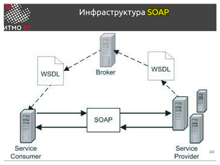
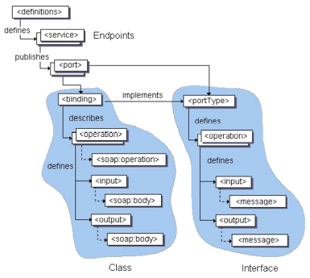
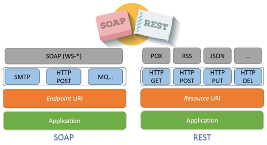
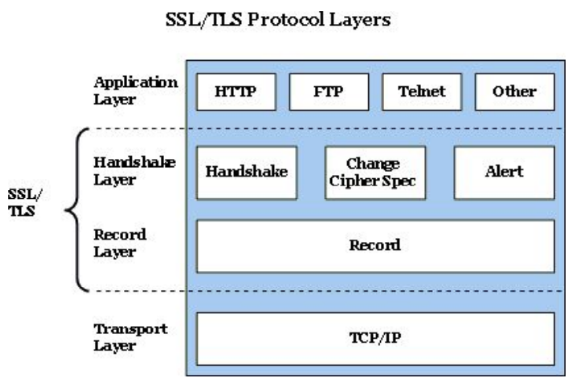
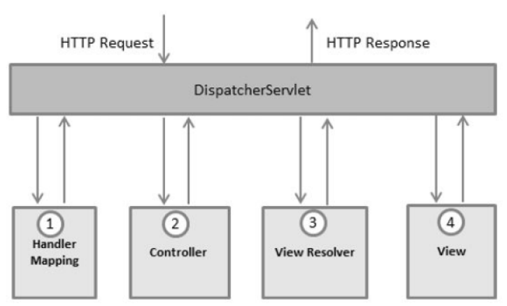
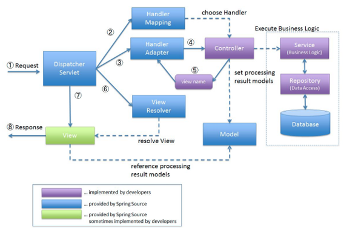
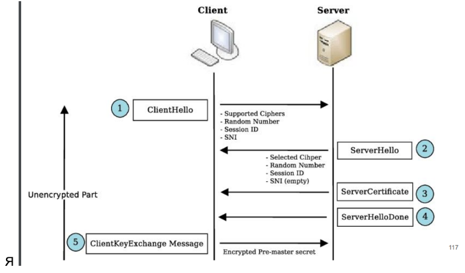
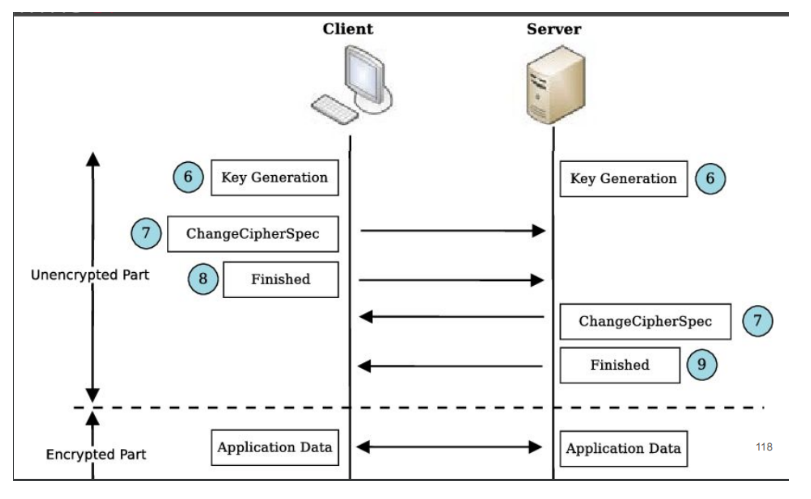
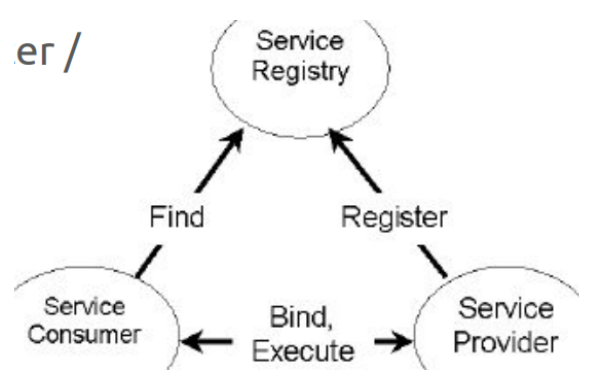

## [MainPage](../index.md)/[SOA](./README.md)/Rubiesh 1

- [MainPage/SOA/Rubiesh 1](#mainpagesoarubiesh-1)
  - [Вариант 1](#вариант-1)
    - [1. Все про SOAP  关于 SOAP 的一切](#1-все-про-soap--关于-soap-的一切)
    - [2. Все про самоподписанные сертификаты  关于自签名证书的所有信息](#2-все-про-самоподписанные-сертификаты--关于自签名证书的所有信息)
    - [3. Реализовать rest сервис на jaxrs для работы с корзиной покупок. Формат данных - xml  在 jaxrs 上实现REST服务以与购物车配合使用。数据格式-xml](#3-реализовать-rest-сервис-на-jaxrs-для-работы-с-корзиной-покупок-формат-данных---xml--在-jaxrs-上实现rest服务以与购物车配合使用数据格式-xml)
  - [Вариант 2](#вариант-2)
    - [1. Правила именования RESTful ресурсов  RESTful资源的命名规则](#1-правила-именования-restful-ресурсов--restful资源的命名规则)
    - [2. TLS/SSL в иерархии протоколов  协议层次结构中的 TLS/SSL](#2-tlsssl-в-иерархии-протоколов--协议层次结构中的-tlsssl)
    - [3. Открыть из репозитория спринг дата рест все не публичные методы  从 Spring Data Rest 存储库中打开所有非公共方法](#3-открыть-из-репозитория-спринг-дата-рест-все-не-публичные-методы--从-spring-data-rest-存储库中打开所有非公共方法)
  - [Вариант 3](#вариант-3)
    - [1. Монолитная архитектура: особенности, достоинства, недостатки  单体架构：特点、优点、缺点](#1-монолитная-архитектура-особенности-достоинства-недостатки--单体架构特点优点缺点)
    - [2. Стратегии экспорта в репозиториях Spring Data Rest.  Spring Data Rest 存储库中的导出策略。](#2-стратегии-экспорта-в-репозиториях-spring-data-rest--spring-data-rest-存储库中的导出策略)
    - [3. Дан Spring Data репозиторий с одним методом. Превратить его в Spring Data Rest и сделать так, чтобы в интернеты торчал только этот метод  给定一个带有单一方法的 Spring Data 存储库，将其转换为 Spring Data Rest，并确保只有该方法对外暴露：](#3-дан-spring-data-репозиторий-с-одним-методом-превратить-его-в-spring-data-rest-и-сделать-так-чтобы-в-интернеты-торчал-только-этот-метод--给定一个带有单一方法的-spring-data-存储库将其转换为-spring-data-rest并确保只有该方法对外暴露)
  - [Вариант 4](#вариант-4)
    - [1. Особенности разработки RESTful на Spring  Spring RESTful开发的特点](#1-особенности-разработки-restful-на-spring--spring-restful开发的特点)
    - [2. keytool, основные команды  keytool，基本命令](#2-keytool-основные-команды--keytool基本命令)
    - [3. На основе сервлетов сервис для создания резиновых уточек по 3д модели с управлением заказами, возможностью указать размеры утки и партии  基于 Servlet 的服务，用于从 3D 模型创建橡皮鸭，具有订单管理功能，能够指定鸭子和批量大小](#3-на-основе-сервлетов-сервис-для-создания-резиновых-уточек-по-3д-модели-с-управлением-заказами-возможностью-указать-размеры-утки-и-партии--基于-servlet-的服务用于从-3d-模型创建橡皮鸭具有订单管理功能能够指定鸭子和批量大小)
  - [Вариант 5](#вариант-5)
    - [1. основные принципы soa  soa的基本原理](#1-основные-принципы-soa--soa的基本原理)
    - [2. spring data rest - конфигурация, основные аннотации  spring data Rest - 配置、基本注释](#2-spring-data-rest---конфигурация-основные-аннотации--spring-data-rest---配置基本注释)
    - [3. спецификация (url'ы) веб-сервиса, реализующего домофон  实现对讲的 Web 服务的规范（url）](#3-спецификация-urlы-веб-сервиса-реализующего-домофон--实现对讲的-web-服务的规范url)
  - [Вариант 6](#вариант-6)
    - [1. что-то про soa  关于 soa 的一些事情](#1-что-то-про-soa--关于-soa-的一些事情)
    - [2. Особенности, схожесть и отличие ssl и tls  ssl和tls的特点、异同](#2-особенности-схожесть-и-отличие-ssl-и-tls--ssl和tls的特点异同)
    - [3. spring data rest сервис к репозиторию  spring data Rest服务到存储库](#3-spring-data-rest-сервис-к-репозиторию--spring-data-rest服务到存储库)
    - [4. (Alternative)  Дан Spring Data Rest репозиторий с 1 методом public, который наследует crudrepository. Сделать так, чтобы все методы паблик стали доступны  （替代方案）给定一个带有 1 个公共方法的 Spring Data Rest 存储库，该存储库继承 crudrepository。使所有公共方法可用](#4-alternative--дан-spring-data-rest-репозиторий-с-1-методом-public-который-наследует-crudrepository-сделать-так-чтобы-все-методы-паблик-стали-доступны--替代方案给定一个带有-1-个公共方法的-spring-data-rest-存储库该存储库继承-crudrepository使所有公共方法可用)
  - [Вариант 7](#вариант-7)
    - [1. Создание контроллера в спринг  在 Spring 中创建控制器](#1-создание-контроллера-в-спринг--在-spring-中创建控制器)
    - [2. Криптография в веб приложениях  Web 应用程序中的密码学](#2-криптография-в-веб-приложениях--web-应用程序中的密码学)
    - [3. Jax-rs казино Jax-rs Jax-rs 赌场 Jax-rs](#3-jax-rs-казино-jax-rs-jax-rs-赌场-jax-rs)
  - [Вариант 8](#вариант-8)
    - [1. Jax-rs ключевые моменты  Jax-rs 要点](#1-jax-rs-ключевые-моменты--jax-rs-要点)
    - [2. Spring data rest особенности отличия от spring mvc rest  Spring Data Rest 与 Spring MVC Rest 的区别](#2-spring-data-rest-особенности-отличия-от-spring-mvc-rest--spring-data-rest-与-spring-mvc-rest-的区别)
    - [3. Управление банкоматом на сервлетах  使用 servlet 管理 ATM](#3-управление-банкоматом-на-сервлетах--使用-servlet-管理-atm)
  - [Вариант 9](#вариант-9)
    - [1. Понятие ресурса в RESTful. Виды ресурсов  RESTful 中资源的概念。资源类型](#1-понятие-ресурса-в-restful-виды-ресурсов--restful-中资源的概念资源类型)
    - [2. KeyStore и TrustStore в Java. Утилита keytool  Java 中的 KeyStore 和 TrustStore。密钥工具实用程序](#2-keystore-и-truststore-в-java-утилита-keytool--java-中的-keystore-和-truststore密钥工具实用程序)
    - [3. Написать веб-сервис на JAX-RS, который управляет шлагбаумом  在 JAX-RS 中编写一个控制屏障的 Web 服务](#3-написать-веб-сервис-на-jax-rs-который-управляет-шлагбаумом--在-jax-rs-中编写一个控制屏障的-web-服务)
  - [Вариант 10](#вариант-10)
    - [1. Языки спецификации веб-сервисов  Web 服务规范语言](#1-языки-спецификации-веб-сервисов--web-服务规范语言)
    - [2. Архитектура spring web mvc  Spring Web MVC架构](#2-архитектура-spring-web-mvc--spring-web-mvc架构)
    - [3. Последовательность команд для конфигурации двунаправленного взаимодействия двух серверов приложений WildFly путём взаимного вызова Restful веб-сервисов  通过相互调用 Restful Web 服务来配置两个 WildFly 应用程序服务器之间双向交互的命令序列](#3-последовательность-команд-для-конфигурации-двунаправленного-взаимодействия-двух-серверов-приложений-wildfly-путём-взаимного-вызова-restful-веб-сервисов--通过相互调用-restful-web-服务来配置两个-wildfly-应用程序服务器之间双向交互的命令序列)
  - [Вариант 11](#вариант-11)
    - [1. Структура SOA приложения  构建 SOA 应用程序](#1-структура-soa-приложения--构建-soa-应用程序)
    - [2. Виды ресурсов в Spring Data REST  Spring Data REST 中的资源类型](#2-виды-ресурсов-в-spring-data-rest--spring-data-rest-中的资源类型)
    - [3. Написать спецификацию (url'ы) сервиса по записи студентов на курсы.  为学生注册课程的服务编写规范 (url)。](#3-написать-спецификацию-urlы-сервиса-по-записи-студентов-на-курсы--为学生注册课程的服务编写规范-url)
  - [Вариант 12](#вариант-12)
    - [1. Описание представления ресурса JAX-RS  JAX-RS 资源视图的描述](#1-описание-представления-ресурса-jax-rs--jax-rs-资源视图的描述)
    - [2. Криптография в приложениях на Java: особенности, стандарты, протоколы  Java 应用程序中的密码学：特性、标准、协议](#2-криптография-в-приложениях-на-java-особенности-стандарты-протоколы--java-应用程序中的密码学特性标准协议)
    - [3. Restful-сервис на базе сервлета, реализующий механизм управления номеронабирателем телефонного аппарата. Номеронабиратель должен поддерживать функции локальных, междугородних и международных звонков, а также автодозвон  基于 Servlet 的 Restful 服务，实现管理电话拨号器的机制。拨号器必须支持本地、长途、国际电话以及自动拨号功能](#3-restful-сервис-на-базе-сервлета-реализующий-механизм-управления-номеронабирателем-телефонного-аппарата-номеронабиратель-должен-поддерживать-функции-локальных-междугородних-и-международных-звонков-а-также-автодозвон--基于-servlet-的-restful-服务实现管理电话拨号器的机制拨号器必须支持本地长途国际电话以及自动拨号功能)
  - [Вариант 13](#вариант-13)
    - [1. СОА - особенности, плюсы и минусы  SOA——特点、优点和缺点](#1-соа---особенности-плюсы-и-минусы--soa特点优点和缺点)
    - [2. SSL/TLS - особенности, отличия и сходства  SSL/TLS - 特性、差异和相似之处](#2-ssltls---особенности-отличия-и-сходства--ssltls---特性差异和相似之处)
    - [3. Дан Spring Data Rest репозиторий с 1 методом public, который наследует crudrepository. Сделать так, чтобы все методы паблик стали доступны  给定一个带有 1 个公共方法的 Spring Data Rest 存储库，该方法继承 crudrepository。使所有公共方法可用](#3-дан-spring-data-rest-репозиторий-с-1-методом-public-который-наследует-crudrepository-сделать-так-чтобы-все-методы-паблик-стали-доступны--给定一个带有-1-个公共方法的-spring-data-rest-存储库该方法继承-crudrepository使所有公共方法可用)


### Вариант 1

#### 1. Все про SOAP <br> 关于 SOAP 的一切

SOAP - формат обмена сообщениями  
SOAP——消息交换格式

- Протокол для разработки веб-сервисов.  
  用于开发网络服务的协议。
- Базируется на идеологии RPC.  
  基于RPC思想。
- Стандартизирован W3C.  
  由 W3C 标准化。
- Есть реализации “по умолчанию” для различных платформ.  
  各种平台都有“默认”实现。
- Предполагает использование инфраструктурного ПО – реестров и сервисных шин.  
  涉及基础设施软件的使用 - 注册表和服务总线。





Структура документа WSDL:  
WSDL文档结构：

- Types (определение типов данных) — определение вида отправляемых и получаемых сервисом XML-сообщений.  
  类型（数据类型的定义）- 服务发送和接收的 XML 消息类型的定义。
- Message (элементы данных) — сообщения, используемые web-сервисом  
  消息（数据元素）- Web 服务使用的消息
- PortType (абстрактные операции) — список операций, которые могут быть выполнены сообщениями.  
  PortType（抽象操作）- 可以由消息执行的操作列表。
- Binding (связывание сервисов) — способ, которым сообщение будет доставлено.  
  绑定（链接服务）- 消息传递的方式。

SOAP всегда содержит 3 уровня в структуре (+1 дополнительный):  
SOAP 在其结构中始终包含 3 个级别（+1 个额外级别）：
- Envelope (конверт) – корневой элемент, который определяет сообщение и пространство имен, использованное в документе,  
  Envelope（信封）——定义文档中使用的消息和命名空间的根元素，
- Header (заголовок) – содержит атрибуты сообщения, например: информация о безопасности или о сетевой маршрутизации,  
  标头（header）——包含消息属性，例如：安全或网络路由信息，
- Body (тело)   
  身体（身体）
– содержит сообщение, которым обмениваются приложения,  
  包含应用程序之间交换的消息，
- Fault – необязательный элемент, который предоставляет информацию об ошибках, которые произошли при обработке сообщений. И запрос, и ответ должны соответствовать структуре SOAP.  
  故障 – 可选元素，提供有关处理消息时发生的错误的信息。请求和响应都必须遵循 SOAP 结构。

SOAP: Позволяет специфицировать интерфейсы веб-сервисов.  
SOAP：允许 Web 服务接口规范。
Особенности:  
特点：

- Основан на XML, является расширением стандарта XML-RPC.  
  基于 XML，XML-RPC 标准的扩展。
- Обычно работает “поверх” http.  
  通常在http“之上”工作。
- Обычно используется совместно с дескрипторами веб-сервисов.  
  通常与 Web 服务描述符结合使用。



WSDL: Web Services Description Language – язык спецификации SOAP веб-сервисов.  
WSDL：Web 服务描述语言 – SOAP Web 服务规范语言。
- Базируется на XML.  
  基于 XML
- Описывает весь интерфейс сервиса:  
  描述整个服务接口：
  - функции;  
    功能； 
  - аргументы; 
    参数 
  - возвращаемые значения. 
    返回值 
- Может автогенерироваться по API сервиса, или, наоборот – API сервиса может автогенерироваться по WSDL.
  可以根据服务的 API 自动生成，或者反过来——服务的API可以根据 WSDL 自动生成。

Пример запроса и ответа:

```xml
POST /Quotation HTTP/1.0
Host: www.xyz.org
Content-Type： text/xml; charset = utf-8
Content-Length: nnn

<?xml version = "1.0"?>
<SOAP-ENV:Envelope
    xmlns:SOAP-ENV = "http://www.w3.org/2001/12/soap-envelope"
    SOAP-ENV：encodingstyle = "http://wvzw.w3.org/2O01/12/soap-encoding">

    <SOAP-ENV：Body xmlns:m = "http://www.xyz.org/quotations">
        <m:GetQuotation>
            <m:QuotationsName>MiscroSoft</m:QuotationsName>
        </m：GetQuotation>
    </SOAP-ENV:Body>
</SOAP-ENV:Envelope>
```

```xml
HTTP/1.0 200 OK
Content-Type： text/xml； charset = utf-8
Content-Length： nnn

<?xml version ="1.0"?>
<SOAP-ENV:Envelope
    xmlns:SOAP-ENV = "http://www.w3.org/2001/12/soap-envelope"
    SOAP - ENV ： encodingStyle = " http ://\vw. w3.org/20Ol/12/soap-encoding ">

    <SOAP-ENV：Body xmlns:m = "http://www.xyz.org/quotation">
        <m:GetQuotationResponse>
            <m:Quotation>Here is the quotation</m:Quotation>
        </m:GetQuotationResponse>
    </SOAP-ENV:Body>
</SOAP-ENV:Envelope>
```

Преимущества: 优点：

- Есть чёткая спецификация.  
  有明确的规范。
- Есть готовые инфраструктурные решения.  
  有现成的基础设施解决方案。
- Удобен для RPC-систем.  
  方便 RPC 系统。

Отличие от REST: SOAP ограничивает структуры ваших сообщений, тогда как REST — это архитектурный подход, ориентированный на использование HTTP в качестве транспортного протокола.  
与 REST 的区别：SOAP 限制消息的结构，而 REST 是一种专注于使用 HTTP 作为传输协议的架构方法。

#### 2. Все про самоподписанные сертификаты <br> 关于自签名证书的所有信息

В криптографии под самоподписанным SSL сертификатом понимают сертификат открытого ключа, изданный и подписанный тем же лицом, которое он идентифицирует. Проще говоря, если Вы сами для своего домена или IP-адреса создали SSL сертификат он будет называться самоподписанным. Также существуют другие названия: «самоизданный» или «самозаверенный», что является одним и тем же.  
在密码学中，自签名 SSL 证书是由其所标识的同一个人颁发和签名的公钥证书。简单地说，如果您自己为域名或 IP 地址创建了 SSL 证书，则该证书被称为自签名证书。还有其他名称：“自出版”或“自我认证”，它们是同一件事。

- Сертификат, выданный самим его субъектом.  
  当事人本人出具的证明。 
- Не может быть отозван.  
  不可撤销。
- Технически, все сертификаты CA являются самоподписанными.  
  从技术上讲，所有 CA 证书都是自签名的。
- СА - Центр сертификации, удостоверяющий центр (Certification Authority, CA) -- организация, “чья честность неоспорима, а открытый ключ широко известен” (С).  
  CA - 认证机构、认证中心（Certification Authority，CA） - 一个“其完整性无可争议且其公钥广为人知”的组织（C）。
- Подтверждает подлинность ключей шифрования своим сертификатом.  
  使用其证书确认加密密钥的真实性。
- Обычно сертификаты объединяются в цепочки.  
  通常证书被组合成链。

#### 3. Реализовать rest сервис на jaxrs для работы с корзиной покупок. Формат данных - xml <br> 在 jaxrs 上实现REST服务以与购物车配合使用。数据格式-xml

```java
@Data 
@XmlRootElement(name="products")
@XmlAccessorType(XmlAccessType.FIELD)
public class Product {
    @XmlElement(required=true)
    protected int id;
    @XmlElement(required=true)
    protected String name;
    @XmlElement(required=true)
    protected String description;
    @XmlElement(required=true)
    protected int price;
}

@Data
@XmlRootElement(name="basket")
@XmlAccessorType(XmlAccessType.FIELD)
public class Basket {

    @XmlElement(required=true)
    protected int id;

    @XmlElement(required=true)
    protected List<Product> products;
}

@Path("/baskets")
public class BasketService {
    private Repository rep = new Repository();

    @POST
    @Consumes("application/xml")
    public Basket createBasket() { 
        return Mapper.mapBasket(rep.createBasket());;
    }

    @GET
    @Consumes("application/xml")
    public Basket getBasket() {
        return Mapper.mapBasket(rep.getBasket());
    }

    @PUT
    @Path("/{id}") @Consumes("application/xml")
    public Basket addProduct(@PathParam("id") Long id, Product prod) {
        rep.addProduct(id, Mapper.mapToEntityProduct(prod)); 
        return getProduct();
    }

    @POST
    @Path("{id}/products/{prodId}") @Consumes("application/xml")
    public void addProduct(@PathParam("id") Long id, @PathParam("prodId") Long prodId) {
        rep.addProduct(id, prodId);
    }
    @DELETE
    @Path("{id}/products/{prodId}") @Consumes("application/xml")
    public void deleteProduct(@PathParam("id") Long id, @PathParam("prodId") Long prodId) {
        rep.deleteProduct(id, prodId);
    }
    @DELETE
    @Path("{id}") @Consumes("application/xml")
    public void deleteBasket(@PathParam("id") Long id) {
        rep.deleteBasket(id);
    }
}
```

### Вариант 2

#### 1. Правила именования RESTful ресурсов <br> RESTful资源的命名规则

Требований нет, есть рекомендации.  
没有要求，只有建议。

- URL формируются иерархически.  
  URL 是按层次形成的。
- Управляемые сущности именуются во множественном числе.  
  管理实体以复数形式提及。
- Обращение без параметра возвращает массив объектов.  
  不带参数的调用将返回一个对象数组。
- Обращение с ИД возвращает конкретный объект.  
  使用 ID 调用返回特定对象。
- Получить список поставщиков:  
  获取供应商列表：

  ```
  GET http://www.example.com/customers
  ```

- Добавить нового поставщика:  
  添加新供应商：

  ```
  POST http://www.example.com/customers
  ```

- Получить поставщика с ИД=12345:  
  获取ID=12345的供应商：

  ```
  GET http://www.example.com/customers/12345
  ```

- Обновить данные о поставщике с ИД=12345:  
  更新 ID=12345 的供应商数据：

  ```
  PUT http://www.example.com/customers/12345
  ```

- Получить все заказы поставщика с ИД=12345:  
  获取所有ID=12345的供应商订单：

  ```
  GET http://www.example.com/customers/12345/orders
  ```

- Сложносоставные слова рекомендуется заменять иерархией.  
  建议用层次结构代替复杂的词语。
- Если без них всё-таки не обойтись, использовать snake-case (или hyphen-case, но не camel-case).  
  如果您仍然不能没有它们，请使用蛇形命名法（或连字符命名法，但不要使用驼峰命名法）。
- Семантика осуществляемого действия располагается в методе, а не в URL.  
  正在执行的操作的语义位于方法中，而不是 URL 中。

- Совсем плохо:

  ```
  GET http://www.example.com/getAllInvoicesForCustomer/12345
  ```

- Всё ещё плохо:

  ```
  GET http://www.example.com/get-all-invoices-for-customer/12345
  ```

- Уже лучше:

  ```
  GET http://www.example.com/customers/12345/get-all-invoices
  ```

- Совсем хорошо:

  ```
  GET http://www.example.com/customers/12345/invoices
  ```

#### 2. TLS/SSL в иерархии протоколов <br> 协议层次结构中的 TLS/SSL



SSL (Secure Sockets Layer) и TLS (Transport Level Security)  
SSL（安全套接字层）和 TLS（传输层安全性）

Протокол SSL размещается между двумя протоколами (работает фильтром, защищая
данные):  
SSL 协议位于两种协议之间（它充当过滤器，保护
数据）：

1. протоколом, который использует программа-клиент (напр., HTTP) и транспортным протоколом TCP/IP  
   1. 客户端程序使用的协议（例如HTTP）和TCP/IP传输协议

Работу протокола SSL можно разделить на два уровня:  
SSL协议的运行可以分为两个层次：

- Слой протокола подтверждения подключения (Handshake Protocol Layer), который состоит из трех подпротоколов:  
  握手协议层，由三个子协议组成：
  - Протокол подтверждения подключения (Handshake Protocol) - цепочка обмена данными, для начала аутентификации сторон и согласовывания шифрования  
    握手协议 - 一系列数据交换，用于开始各方的身份验证并协商加密 
  - Протокол изменения параметров шифра (Cipher Spec Protocol) - для изменения данных ключа  
    密码规范协议 - 更改密钥数据 
  - Предупредительный протокол (Alert Protocol) - содержит сообщение, которое показывает сторонам изменение статуса или сообщает о возможной ошибке  
    警报协议 - 包含一条消息，向各方指示状态变化或通知可能出现的错误
- Слой протокола записи (Record Protocol Layer) - протокол:  
  记录协议层 - 协议：
  - принимает сообщения, которые нужно передать,  
    接收需要传输的消息， 
  - фрагментирует данные в управляемые блоки,  
    将数据分割成可管理的块， 
  - разумно сжимает данные, применяя MAC (message authentication code),  
    使用 MAC（消息认证码）智能压缩数据， 
  - Шифрует  
    加密 
  - передаёт результат.  
    传输结果。 

#### 3. Открыть из репозитория спринг дата рест все не публичные методы <br> 从 Spring Data Rest 存储库中打开所有非公共方法

```java
/*
* spring.data.rest.detection-strategy=annotation
*/
@Repository
public interface UserRepository extends Repository<User, Long> {
    @RestResource(exported = false)
    public User save(User user);
    @RestResource(exported = false)
    public Optional<User> findById(Long id);
    @RestResource
    Optional<User> findByUsername(String username);
    @RestResource
    void deleteByCityName(String cityName);
}
```

### Вариант 3

#### 1. Монолитная архитектура: особенности, достоинства, недостатки <br> 单体架构：特点、优点、缺点

Монолитное приложение состоит из базы данных, клиентского пользовательского интерфейса, серверного приложения  
单体架构应用程序由数据库、客户端用户界面和服务器应用程序组成。

Плюсы:  
优点：

- Простое развертывание. Использование одного исполняемого файла или каталога упрощает развертывание.  
  简单部署。使用单个可执行文件或目录可以简化部署过程。

- Разработка. Приложение легче разрабатывать, когда оно создано с использованием одной базы кода.  
  开发。使用单一代码库创建的应用程序更易于开发。

- Производительность. В централизованной базе кода и репозитории один интерфейс API часто может выполнять ту функцию, которую при работе с микросервисами выполняют многочисленные API.  
  性能。在集中化的代码库和存储库中，一个 API 接口通常可以完成微服务架构中多个 API 的功能。

- Упрощенное тестирование. Монолитное приложение представляет собой единый централизованный модуль, поэтому сквозное тестирование можно проводить быстрее, чем при использовании распределенного приложения.  
  简化测试。单体应用是一个集中的模块，因此可以比分布式应用更快地进行端到端测试。

- Удобная отладка. Весь код находится в одном месте, благодаря чему становится легче выполнять запросы и находить проблемы.  
  方便调试。所有代码都集中在一个地方，因此更容易执行查询和发现问题。

Минусы:  
缺点：

- Кодовая база со временем становится громоздкой  
  代码库随着时间推移变得臃肿
  
С течением времени большинство продуктов продолжают разрабатываться и
увеличиваются в объеме, а их структура становится размытой. В этот момент и
масштабирование становится сложным (так как нельзя масштабировать отдельные части
вашей системы)  
随着时间的推移，大多数产品会不断开发并变得更加庞大，其结构也会逐渐变得模糊。在这种情况下，扩展系统变得困难（因为无法对系统的各个部分单独进行扩展）。

- Сложно внедрять новые технологии  
  引入新技术变得困难

Добавление новой технологии означает переписывание всего приложения, что является
дорогостоящим и требует много времени.  
添加新技术意味着需要重写整个应用程序，这既昂贵又耗时。

+/- по SOA по сравнению с монолитной архитектурой:  
SOA与单体架构对比的优劣势：

Достоинства:  
优点：

- Декомпозиция модулей.  
  模块分解更加清晰。
- Можно использовать в разных модулях разные технологии.  
  可以在不同模块中使用不同的技术。
- Можно модернизировать модули независимо друг от друга.  
  可以独立升级各个模块。
- (Теоретически) лучшая масштабируемость.  
  （理论上）具有更好的可扩展性。
- Удобная интеграция “из коробки”.  
  提供开箱即用的便捷集成能力。

Недостатки:

- Усложнение архитектуры.  
  架构复杂性增加。
- Система теряет целостность.  
  系统的整体性下降。
- Сложнее тестировать.  
  测试更加困难。
- Сложнее поддерживать  
  维护更加复杂。

#### 2. Стратегии экспорта в репозиториях Spring Data Rest. <br> Spring Data Rest 存储库中的导出策略。

| Наименование | Описание                                                                                                                  |
|--------------|---------------------------------------------------------------------------------------------------------------------------|
| `DEFAULT`      | Открывает наружу все публичные интерфейсы репозитория, но учитывает флаг `exported` в аннотациях `@(Repository)RestResource`.<br>对外开放存储库的所有公共接口，但会考虑注解 `@(Repository) RestResource` 中的 `exported` 标志。 |
| `ALL`          | Открывает наружу все интерфейсы репозитория без учёта модификаторов доступа и аннотаций. <br> 对外开放存储库的所有接口，不考虑访问修饰符和注解。                                 |
| `ANNOTATION`   | Открывает наружу только ресурсы, помеченные аннотациями `@(Repository)` RestResource с учётом значения флага exported. <br> 仅对外开放带有注解 `@(Repository) RestResource` 的资源，并且考虑 `exported` 标志的值。     |
| `VISIBILITY`   | Открывает наружу только публичные аннотированные ресурсы. <br> 仅对外开放带有注解的公共资源。                                                                 |

Для Spring Boot:  
对于 Spring Boot：
Настройка происходит путём добавления строчки в application.properties:  
可以通过在 `application.properties` 文件中添加以下行进行配置：

```
spring.data.rest.detection-strategy=visibility
```

P.S. флаг `exported` ставится в аннотации `@RestResource` над методом репозитория:  
附注：`exported` 标志通过在存储库方法上使用注解 `@RestResource` 设置：

```java
@RestResource(exported = false)
void deleteById(Long aLong);
```
Или над самим репозиторием, если необходимо скрыть все его методы:

```java
@RepositoryRestResource(exported = false) was
interface PersonRepository extends CrudRepository<Person, Long> {}
```

#### 3. Дан Spring Data репозиторий с одним методом. Превратить его в Spring Data Rest и сделать так, чтобы в интернеты торчал только этот метод <br> 给定一个带有单一方法的 Spring Data 存储库，将其转换为 Spring Data Rest，并确保只有该方法对外暴露：

Добавляем в application.properties:
```java
spring.data.rest.detection-strategy=visibility
```

Далее пишем репозиторий:

```java
@RepositoryRestResource(collectionResourceRel = "car", path = "cars")
public interface CarRepository extends Repository<Car, Long> { 
    public Car save(Car car);
}
```

### Вариант 4

#### 1. Особенности разработки RESTful на Spring <br> Spring RESTful开发的特点

ключевых фреймворка:  
框架的关键组成部分：
- Spring Web MVC 
- Spring Data REST

Spring Web MVC:
- “базовый” фреймворк в составе Spring для разработки веб приложений.  
  Spring框架中用于开发Web应用的“基础”框架。
- Универсальный, на клиентской стороне интегрируется с популярными JS фреймворками.  
  通用性强，可与客户端上的流行JS框架集成。
- Удобен для разработки веб сервисов Архитектура:  
  适合开发Web服务。



Состав приложения:  
应用组成部分：
- Model -- инкапсулирует данные приложения (состоят из POJO или бинов).  
  Model（模型）： 封装应用数据（由POJO或Bean组成）。
- View -- отвечает за отображение данных модели.  
  View（视图）： 负责显示模型中的数据。
- Controller -- обрабатывает запрос пользователя, создаёт соответствующую модель и передаёт её для отображения в представление.  
  Controller（控制器）： 处理用户请求，创建相应的模型，并将其传递给视图进行显示。

По определению HandlerMapping — интерфейс, который реализуется объектами, которые определяют отображение между запросами и объектами обработчиков.  
根据定义 HandlerMapping 是一个接口，由确定请求与处理对象之间映射的对象实现。

Dispatcher Servlet 调度器Servlet: 
- Обрабатывает все запросы и формирует ответы на них.  
  处理所有请求并生成响应。
- Связывает между собой все элементы архитектуры Spring MVC.  
  连接Spring MVC架构的所有元素。
- Обычный сервлет -- конфигурируется в web.xml.  
  是一个普通的Servlet，通过web.xml进行配置。


Обработка запроса:  
请求处理流程：



1. DispatcherServlet получает запрос.  
   DispatcherServlet 接收请求。
2. DispatcherServlet отправляет задачу выбора подходящего контроллера в HandlerMapping.  
   HandlerMapping выбирает контроллер, который сопоставляется с URL-адресом входящего запроса, и возвращает (выбранный обработчик) и контроллер в DispatcherServlet.  
   DispatcherServlet 将选择合适控制器的任务委派给 HandlerMapping。HandlerMapping 根据请求URL选择控制器，并返回所选处理器和控制器给 DispatcherServlet。

3. DispatcherServlet отправляет задачу выполнения бизнес-логики Controller на HandlerAdapter.  
   DispatcherServlet 将业务逻辑的执行任务交给 HandlerAdapter。
4. HandlerAdapter вызывает процесс бизнес-логики контроллера.  
   HandlerAdapter 调用控制器中的业务逻辑处理流程。
5. Controller выполняет бизнес-логику, устанавливает результат обработки в Модель и возвращает логическое имя представления в HandlerAdapter.  
   Controller 执行业务逻辑，将处理结果存储到模型中，并将逻辑视图名称返回给 HandlerAdapter。
6. DispatcherServlet отправляет задачу разрешения представления, соответствующего имени представления, в ViewResolver. ViewResolver возвращает представление, сопоставленное с именем представления.  
   DispatcherServlet 将解析视图名称的任务交给 ViewResolver。ViewResolver 返回与视图名称匹配的视图。
7. DispatcherServlet отправляет процесс рендеринга в возвращенное представление.  
   DispatcherServlet 将渲染任务交给返回的视图。
8. Представление отображает данные модели и возвращает ответ.  
   视图 显示模型数据并返回响应。

Контроллер:

```java
@Controller
@RequestMapping("/hello")
public class HelloController {
    @RequestMapping(method = RequestMethod.GET)
    public String printHello(ModelMap model) {
        model.addAttribute("message", "Hello Spring MVC Framework!"); 
        // Атрибуты модели
        return "hello";
        //Возвращаемое представление
    }
}
```

```java
@Controller
@RequestMapping("/post")
public class ExamplePostController {
    @Autowired
    ExampleService exampleService;

    @PostMapping("/response")
    @ResponseBody
    // ResponseTransfer будет сериализован в JSON
    public ResponseTransfer postResponseController (@RequestBody LoginForm loginForm) { //LoginForm будет десериализован из JSON
        return new ResponseTransfer("Thanks for Posting!!!");
    }
}
```

```java
@GetMapping("/books")
public void book() {
    //
}

@RequestMapping(value = "/books", method = RequestMethod.GET)
public void book2() {

}
```

Есть аналогичные аннотации для Post, Put, Delete и Patch  
Post、Put、Delete 和 Patch 有类似的注释

```java
@PostMapping("/users") 
/* First Param is optional */ 
public User createUser(
    @RequestParam(required = false) 
    Integer age, 
    @RequestParam String name) {
    // does not matter
}

@PostMapping("/users")
/* Spring преобразует userDto  автоматически, если в классе есть getters and setters */ 
public User createUser (UserDto userDto) {
    //
}

@GetMapping(”/users/{userid}”) 
public User getUser (@PathVariable(required = false) String userid) {
    //
    return user;
}

@GetMapping("/users / {userid} /{userName}") 
public User getUser(UserDto userDto) {
    /* Will set "userid" & "userName" properties Automatically */ 
    return user;
}
```

Отображение методов на URL  
将方法映射到 URL

```java
@RestController 
@RequestMapping("/api/usars") 
public class Usercontroller {
    @GetMapping (params = {"user_id"})
    public ResponseEntity<?> getUserById(@RequestParam(name = "user_id") String userId) {
        // Doesn't matter 
        return new ResponseEntity<> (user, HttpStatus.OK);
    }
    
    @GetMapping(params = {"email"})
    public ResponseEntity<?> getUserByEmail(@RequestParam(name = "email") String email) {
        // Doesn't matter 
        return new ResponseEntityO(dtos, HttpStatus.OK);
    }
}
```

`Controlller` + `ResponseBody` = `RestController`

```java
@Controller
@RequestMapping("books")
public class SimpleBookController {
    @GetMapping("/{id}", produces = "application/json")
    public @ResponseBody Book getBook(@PathVariable int id) {
        return findBookById(id);
    }

    private Book findBookById(int id) {
        // ...
    }
}
```

-> 

```java
@RestController
@RequestMapping("books-rest")
public class SimpleBookController {
    @GetMapping("/{id}", produces = "application/json")
    public Book getBook(@PathVariable int id) {
        return findBookById(id);
    }

    private Book findBookById(int id) {
        // ...
    }
}
```

HttpMessageConverter Http消息转换器: 
- Spring сам не умеет в сериализацию / маршалинг.  
  Spring 本身不知道如何序列化/编组。
- Сериализация / маршалинг реализуются сторонними библиотеками.  
  序列化/编组由第三方库实现。
- HttpMessageConverter -- адаптер для сторонних библиотек.  
  HttpMessageConverter——第三方库的适配器
- Содержит 4 метода -- canRead(MediaType), canWrite(MediaType), read(Object, InputStream, MediaType) и write(Object, OutputStream, MediaType).   
  包含 4 种方法 - canRead(MediaType)、canWrite(MediaType)、read(Object, InputStream, MediaType) 和 write(Object, OutputStream, MediaType)。
- Есть готовые конвертеры “из коробки”  
  有现成的“开箱即用”转换器

Spring Data REST Spring Data REST:

Автоматически создаёт контроллеры, “открывая наружу” методы определённых репозиториев (учитывая стратегии экспорта).  
通过“公开”某些存储库的方法（考虑到导出策略）自动创建控制器。

#### 2. keytool, основные команды <br> keytool，基本命令

Keytool - это утилита командной строки, для управления ключами или сертификатами, а также хранилищами ключей.  
Keytool 是一个命令行工具，用于管理密钥或证书以及密钥库。

Создать ключи вместе с keystore:  
创建密钥并生成 keystore：

```
keytool -genkey -alias example.com -keyalg RSA -keystore keystore.jks -keysize 2048
```

Создать запрос сертификата (CSR) для существующего Java keystore:  
为现有 Java keystore 创建证书请求 (CSR)：

```
keytool -certreq -alias example.com -keystore keystore.jks -file example.com.csr
```

Загрузить корневой или промежуточный CA сертификат:  
导入根或中间 CA 证书：

```
keytool -import -trustcacerts -alias root -file Thawte.crt -keystore keystore.jks
```

Импортировать доверенный сертификат:  
导入受信任的证书：

```
keytool -import -trustcacerts -alias example.com -file example.com.crt -keystore keystore.jks 
```

Экспортировать сертификат из keystore:  
从 keystore 中导出证书：

```
keytool -export -alias example.com -file example.com.crt -keystore keystore.jks
```

Сгенерировать самоподписанный сертификат и keystore:  
生成自签名证书和 keystore：

```
keytool -genkey -alias selfsigned -keyalg RSA -keystore keystore.jks -storepass password -validity 360 -keysize 2048 
```

Посмотреть сертификат:   
查看证书：

```
keytool -printcert -v -file example.com.crt 
```

Посмотреть список сертификатов:  
查看证书列表：

```
keytool -list -v -keystore keystore.jks
``` 

Проверить конкретный сертификат по алиасу:  
按别名检查特定证书：

```
keytool -list -v -keystore keystore.jks -alias example.com
```

Удалить сертификат:  
删除证书：

```
keytool -delete -alias example.com -keystore keystore.jks
```

Изменить пароль keystore:  
更改 keystore 的密码：

```
keytool -storepasswd -new new_storepass -keystore keystore.jks
```

#### 3. На основе сервлетов сервис для создания резиновых уточек по 3д модели с управлением заказами, возможностью указать размеры утки и партии <br> 基于 Servlet 的服务，用于从 3D 模型创建橡皮鸭，具有订单管理功能，能够指定鸭子和批量大小

```java
@WebServlet(name = "DuckServlet", urlPatterns = "/duck")
public class DuckServlet extends HttpServlet {
    private DuckService duckService = new DuckService();
    @Override 
    protected void doGet(HttpServletRequest request, HttpServletResponse response) { 
        List<Duck> ducks = duckService.getDucks();
    }
    @Override 
    protected void doPost(HttpServletRequest request, HttpServletResponse response) {
        long width = request.getParameter("width");
        long height = request.getParameter("height");
        long length = request.getParameter("length"); 
        duckService.addDuck(width, height, length);
    }
    @Override 
    protected void doPut(HttpServletRequest request, HttpServletResponse response) {
        long id = request.getParameter("id");
        duckService.updateDuck(id);
    }

    @Override 
    protected void doDelete(HttpServletRequest request, HttpServletResponse response) {
        long id = request.getParameter("id");
        duckService.deleteDuck(id);
    }
}
```

### Вариант 5

#### 1. основные принципы soa <br> soa的基本原理

- Standartized Contract – интерфейсы взаимодействия должны быть четко специфицированы.  
  Standartized Contract – 接口的交互必须被清晰地规范化。
- Reference Autonomy – взаимосвязи между сервисами должны быть сведены к минимуму.  
  Reference Autonomy – 服务之间的关联性应被降到最低。
- Location Transparency – то, где физически располагается сервис, не должно иметь значения при взаимодействии с ним.  
  Location Transparency – 服务的物理位置在交互中不应有任何影响。
- Longevity – сервисы должны разрабатываться с учётом возможности их длительного использования.  
  Longevity – 服务的设计应考虑到其长期使用的可能性。
- Abstraction – внутренняя логика сервиса должна быть скрыта от клиента.  
  Abstraction – 服务的内部逻辑应对客户端隐藏。
- Autonomy – сервисы должны самостоятельно контролировать собственную функциональность.  
  Autonomy – 服务应能够自主控制其功能。
- Statelessness – сервис не должен сохранять состояние между обращениями к нему.  
  Statelessness – 服务在调用之间不应保存状态。
- Granularity – сервис должен реализовывать чётко специфицированный и логически обоснованный набор функций.  
  Granularity – 服务应实现清晰规范且逻辑合理的一组功能。
- Normalization – сервисы должны быть декомпозированы и нормализованы, чтобы минимизировать избыточность.  
  Normalization – 服务应被分解和规范化，以最小化冗余。
- Composability – функциональность сервиса может строиться на базе функциональности других сервисов.  
  Composability – 服务的功能可以基于其他服务的功能进行构建。
- Discovery – сервисы должны сопровождаться метаданными, позволяющими эффективно идентифицировать и использовать их.  
  Discovery – 服务应附带元数据，以便高效地识别和使用它们。
- Reusability – логика приложения разбивается на локальные сервисы, что позволяет повторно использовать код.  
  Reusability – 应用逻辑分解为本地服务，从而实现代码的复用。
- Encapsulation – в сервисы можно “оборачивать” функциональность приложений, построенных по принципам, отличным от SOA  
  Encapsulation – 可以将应用程序功能“封装”到不同于SOA原则的服务中。

#### 2. spring data rest - конфигурация, основные аннотации <br> spring data Rest - 配置、基本注释

1. Добавляем зависимость в Maven / Gradle.  
   在 Maven / Gradle 中添加依赖项.

   Зависимость в Maven:  
   在 Maven 中添加依赖项：

   ```xml
   <dependency>
   <groupld>org.springframework.data</groupld>
   <artifactId>spring-data-rest-webmvc</artifactId>
   <version>3.3.4.RELEASE</version>
   </dependency>
   ```

1. Конфигурируем.  
   配置.

   - Не требуется, если используем Spring Boot.  
     如果使用 Spring Boot，则无需配置.
   - Задается в классе RepositoryRestMvcConfiguration, который необходимо импортировать в конфигурацию приложения.  
     如果不使用，则需要在应用程序配置中导入 RepositoryRestMvcConfiguration 类
   - Изменяется путем регистрации своего конфигуратора RepositoryRestConfigurer или наследования от класса адаптера RepositoryRestConfigurerAdapter.  
     通过注册自定义的 RepositoryRestConfigurer 或继承 RepositoryRestConfigurerAdapter 类来更改.

2. Выбираем стратегию экспорта репозитория.  
   选择存储库导出的策略.
    
   Добавляем в application.properties:  
   在 application.properties 文件中添加以下配置：

   ```
   spring.data.rest.detection-strategy=visibility/all/default/annotatiion
   ```

3. Выбираем базовый URI.  
   选择基础 URI.

   - Задаётся в application.properties: spring.data.rest.basePath=/api  
     在 application.properties 文件中设置：spring.data.rest.basePath=/api. 
   - Может быть задано в RepositoryRestConfigurer:  
     或者可以在 RepositoryRestConfigurer 中设置： 

   ```java
   @Component 
   public class CustomizedRestMvcConfiguration extends RepositoryRestConfigurerAdapter { 
       @Override public void configureRepositoryRestConfiguration(RepositoryRestConfiguration config) {   
           config.setBasePath("/api");
       }
   }
   ```

#### 3. спецификация (url'ы) веб-сервиса, реализующего домофон <br> 实现对讲的 Web 服务的规范（url）

```yml
paths:
    /code:
        get:
            description: Get current code
            responses:
                '200':
                        description: Current code
                        content:
                            application/json:
                                schema:
                                    $ref: '#/components/schemas/code'
                '500':
                        description: Server error, try again later.
        put:
            description: update current code (add new digit or execute symbol)
            parameters:
            - name: newDigit
                in: query
                description: new digit
                schema:
                    type: integer
                    format: int64
            - name: executeCode
                in: query
                description: symbol to start code execution
                schema:
                    type: char
            responses:
                '201':
                        description: Successful  command execution
                '404':
                        description: Unsuccessful command execution (command does not exist)
                '500':
                        description: Server error, try again later.
                delete:
                    description: delete last digit in code
                    responses:
                        '200':
                                description: Successful  deletion
                        '500':
                                description: Server error, try again later.
```

### Вариант 6 

#### 1. что-то про soa <br> 关于 soa 的一些事情

SOA— это стиль архитектуры программного обеспечения, который предполагает модульное приложение, состоящее из дискретных и слабосвязанных программных агентов, которые выполняют конкретные функции.  
SOA（面向服务架构）是一种软件架构风格，强调将应用程序模块化为独立且低耦合的软件代理，这些代理执行特定功能。

Концепция SOA заключается в следующем: приложение может быть спроектировано и построено таким образом, что его модули легко интегрируются и могут быть легко использованы повторно.  
SOA的理念在于：应用程序可以以一种易于集成和重用模块的方式设计和构建。

Сервис-ориентированная архитектура (SOA) – это метод разработки программного обеспечения, который использует программные компоненты, называемые сервисами, для создания бизнес-приложений. Каждый сервис предоставляет бизнес-возможности, и сервисы также могут взаимодействовать друг с другом на разных платформах и языках. Разработчики применяют SOA для многократного использования сервисов в различных системах или объединения нескольких независимых сервисов для выполнения сложных задач.  
面向服务架构（SOA）是一种软件开发方法，通过使用称为服务的软件组件来创建业务应用程序。每个服务都提供业务功能，并且服务之间可以在不同的平台和语言上交互。开发人员使用SOA来在各种系统中重复利用服务，或者将多个独立服务组合以完成复杂任务。

Плюсы SOA  
SOA的优点
- Повторное использование сервисов  
  服务的重用性  
  服务可以被多个应用程序重复使用，提高开发效率。
- Эффективное обслуживание  
  高效维护  
  Легче создавать, обновлять и отлаживать небольшие сервисы, чем большие блоки кода в монолитных приложениях  
  与在单体应用中维护大量代码相比，维护和调试小型服务更加容易。
- Более высокая надежность  
  更高的可靠性
  Службы легче отлаживать и тестировать, чем огромные куски кода, как в монолитах. Это, в свою очередь, делает продукты на основе SOA более надежными.  
  服务比单体应用中的大块代码更易于调试和测试，从而提高了基于SOA的产品的可靠性。

Минусы:
- Сложность в управлении 管理的复杂性
  Каждый сервис должен обеспечивать своевременную доставку сообщений. Количество этих сообщений может превышать миллион за один раз, что затрудняет управление всеми службами.  
  每个服务需要确保消息的及时传递，消息的数量可能一次超过数百万，这使得管理所有服务变得复杂。
- сложности с реализацией асинхронной связи между приложениями;  
  实现异步通信的难度  
  服务之间的异步通信可能面临技术挑战。
- большое время отклика, трудности организации обмена большими объемами данных, обусловленные тем, что XML дает надежность, но не скорость (существуют альтернативы XML — в частности, JSON);  
  响应时间长，难以组织大量数据的交换，因为 XML 提供可靠性但不提供速度（XML 有替代方案 - 特别是 JSON）；


#### 2. Особенности, схожесть и отличие ssl и tls <br> ssl和tls的特点、异同

SSL:
- Криптографический протокол.  
  加密协议。
- Использует асимметричную криптографию для аутентификации ключей обмена, симметричное шифрование для сохранения конфиденциальности, коды аутентификации сообщений для целостности сообщений.  
  使用非对称加密进行密钥交换的认证，使用对称加密保证数据的机密性，使用消息认证码（MAC）保证消息的完整性。
- Со временем должен быть исключен в пользу TLS.  
  最终应被TLS取代。

TLS:
- Основан на SSL 3.0.  
  基于SSL 3.0。
- Актуальная версия -- 1.3 (2018 г.).  
  最新版本是1.3（2018年发布）。
- Обратно совместим с SSL v3.  
  向后兼容SSL v3。

Безопасность транспортного уровня (TLS) является преемником протокола SSL. TLS — это улучшенная версия SSL. Он работает почти так же, как SSL, используя шифрование для защиты передачи данных и информации. Эти два термина часто взаимозаменяемы в отрасли, хотя SSL по-прежнему широко используется.  
传输层安全协议（TLS）是SSL协议的继任者。TLS是SSL的改进版本，其工作原理几乎与SSL相同，利用加密技术保护数据和信息的传输。这两个术语在行业中经常被互换使用，尽管SSL仍被广泛使用。

Самое фундаментальное различие между этими протоколами заключается в том, как они устанавливают соединения.  
这两个协议之间最根本的区别在于它们如何建立连接。

| TLS-сертификат                                                         | SSL-сертификат                                                                         |
|------------------------------------------------------------------------|----------------------------------------------------------------------------------------|
| Сертификаты TLS также известны как «безопасность уровня передачи».<br> TLS证书也称为“传输层安全”。     | SSL-сертификаты также известны как Secure Sockets Layer. <br> SSL证书也称为“安全套接层”。                               |
| По сравнению с SSL, TLS — более простой протокол. <br> 与SSL相比，TLS是一种更简单的协议。                      | SSL — более сложный для реализации протокол, чем TLS. <br> SSL是一种比TLS实现更复杂的协议。                                  |
| TLS имеет четыре версии, из которых версия TLS 1.3 является последней. <br>TLS有四个版本，其中TLS 1.3是最新版本。 | Принимая во внимание, что SSL имеет три версии, из которых SSL 3 0 является последней. <br>SSL有三个版本，其中SSL 3.0是最后一个版本。 |
| Протокол TLS обеспечивает более высокий уровень безопасности, чем SSL. <br>TLS协议提供比SSL更高的安全级别。 | Все версии протокола SSL сравнительно подвержены уязвимостям. <br> SSL的所有版本相比之下都更容易受到漏洞攻击。                         |
| Протокол TLS был выпущен в 1999 году. <br>TLS协议发布于1999年。                                   | Между тем, SSL v2.0 был выпущен в 1995 году и v3.0 в 1996 году. <br> 而SSL v2.0发布于1995年，SSL v3.0发布于1996年。                        |
| TLS поддерживает Fortezza (алгоритм) <br>TLS支持Fortezza算法。                                   | SSL не поддерживает алгоритм Fortezza. <br>SSL不支持Fortezza算法。                                                |
| Сертификаты TLS имеют сложный процесс проверки <br> TLS证书具有复杂的验证过程。                         | Сертификаты SSL предлагают простой процесс проверки. <br> SSL证书的验证过程较为简单。                                   |

TLS лучше, чем SSL.  
TLS优于SSL。

В значительной степени из-за известных уязвимостей безопасности протокол SSL устарел.  
由于已知的安全漏洞，SSL协议已被废弃。

Самые последние версии TLS также обеспечивают повышение производительности и другие улучшения.  
TLS的最新版本还提供了性能提升和其他改进。

TLS не только более безопасен и производителен, но и поддерживается большинством современных веб-браузеров. Например, Google Chrome давно прекратил поддержку SSL 3.0, а большинство основных браузеров планируют прекратить поддержку TLS 1.0 и TLS 1.1 к 2020 году.  
TLS不仅更加安全和高效，还得到了大多数现代网页浏览器的支持。例如，Google Chrome早已停止支持SSL 3.0，而大多数主流浏览器计划于2020年前后停止支持TLS 1.0和TLS 1.1。


#### 3. spring data rest сервис к репозиторию <br> spring data Rest服务到存储库

```java
@Entity
@Data
public class WebsiteUser {
    @Id
    @GeneratedValue(strategy = GenerationType.AUTO)
    private long id;
    private String name;
    private String email;
}
```

Репозиторий для доступа к бд:

```java
@RepositoryRestResource(collectionResourceRel = "users", path = "users")
public interface UserRepository extends PagingAndSortingRepository<WebsiteUser, Long> {
    List<WebsiteUser> findByName(@Param("name") String name);
}
```

Класс запуска приложения:

```java
@SpringBootApplication
public class SpringDataRestApplication {
    public static void main(String[] args) {
        SpringApplication.run(SpringDataRestApplication.class, args);
    }
}
```

#### 4. (Alternative)  Дан Spring Data Rest репозиторий с 1 методом public, который наследует crudrepository. Сделать так, чтобы все методы паблик стали доступны <br> （替代方案）给定一个带有 1 个公共方法的 Spring Data Rest 存储库，该存储库继承 crudrepository。使所有公共方法可用

Добавляем в application.properties:  
添加到application.properties：

```java
spring.data.rest.detected-stratagy=annotation
```

Далее навешиваем на все public методы аннотацию @RestResource  
接下来，我们将@RestResource注释添加到所有公共方法。

```java
@Repository
public interface CarRepository extends Repository<Car, Long> {
    @RestResource(exported = false)
    public Car save(Car car);
}
```

Или же можно просто в application.properties указать:  
或者您可以简单地在 application.properties 中指定：

```java
spring.data.rest.detected-stratagy=default
```

### Вариант 7

#### 1. Создание контроллера в спринг <br> 在 Spring 中创建控制器

См. [Вариант 4 Особенности разработки RESTful на Spring](#1-особенности-разработки-restful-на-spring--spring-restful开发的特点)

#### 2. Криптография в веб приложениях <br> Web 应用程序中的密码学

Сертификаты - Используются для проверки принадлежности открытого ключа его реальному владельцу.  
证书——用于验证公钥是否属于其真实所有者。

Сначала клиент устанавливает соединение с сервером и настраивает ключи для шифрования передаваемых данных. Он отправляет информацию о себе, какие поддерживает шифрования и случайное число.  
首先，客户端与服务器建立连接，并设置用于加密传输数据的密钥。客户端会发送自己的信息，包括支持的加密方式和一个随机数。

После чего сервер делает то же самое, только выбирает какое шифрование использовать.  
接着，服务器执行类似操作，但选择将要使用的加密方式。

Вся суть в том что это работает на открытом и закрытом ключе. Закрытый ключ хранится у клиента и сервера. А открытый доступен всем, даже злоумышленнику, если он его украдет. Через открытый ключ происходит шифрование, а через закрытый дешифровка.  
整个过程的核心在于使用公钥和私钥。私钥由客户端和服务器各自保管，而公钥是公开的，甚至可能被恶意攻击者获取。加密通过公钥进行，而解密则通过私钥完成。

То есть, как только Клиент и Сервер обмениваются своими ключами - это происходит не зашифровано. А уже данные, когда начинают обмениваться - уже происходит шифрование их.  
也就是说，当客户端和服务器交换各自的密钥时，这一过程并未加密。而之后开始交换的数据则会通过加密保护。

Так работает SSL/TSL поверх обычно http протокола. -> https  
这就是SSL/TSL在普通HTTP协议（http）上的工作方式 -> https





#### 3. Jax-rs казино Jax-rs Jax-rs 赌场 Jax-rs

```java
@Data
public class SlotMachine {
    private Long id;
    private Double winChanse;
    private Double getMany;
    private Double priceOneGame;
    private Double jackpot;
}
@Data
public class ResultGame {
    private Long id;
    private Long slotMachineId;
    private Boolean win;
    private Boolean jackpot;
    private Double bet;
    private Double winSum;
}

@Path("/slots")
public class SlotMachineService {
    
    private Repository rep = new Repository();
    
    private SlotMachineGameService game = new SlotMachineGameService();
    
    @POST
    @Consumes("application/json")
    public SlotMachine createSlotMachine(SlotMachine slotMachine) {
        return Mapper.mapSlotMachine(rep.createSlotMachine(Mapper.mapSlotMachineEntity(slotMachine)));
    }

    @GET
    @Produces("application/json")
    public List<SlotMachine> getSlotMachines() {
        return rep.getSlotMachines().stream().map(Mapper::mapSlotMachine).collect(Clollection.toList());
    }
    
    @GET
    @Path("{id}")
    @Produces("application/json")
    public SlotMachine getSlotMachine(@PathParam("id") Long id) {
        return Mapper.mapSlotMachine(rep.getSlotMachine(id));
    }

    @PUT
    @Path("{id}")
    @Consumes("application/json")
    public ResultGame betSlotMachine(@PathParam("id") Long id, @QueryParam("bet") Double bet) {
        return game.initGame(id, bet);
    }

    @GET
    @Path("{id}/games/{gameId}")
    @Produces("application/json")
    public ResultGame getSlotMachine(@PathParam("id") Long id, @PathParam("gameId") Long gameId) {
        return game.getGameInSlotMachine(id, gameId);
    }

    @DELETE
    @Path("{id}")
    @Consumes("application/json")
    public void deleteSlotMachine(@PathParam("id") Long id) {
        rep.deleteSlotMachine(id);
    }
}

```

### Вариант 8

#### 1. Jax-rs ключевые моменты <br> Jax-rs 要点

Jax-rs - Спецификация API для разработки веб сервисов Особенности:  
Jax-rs——Web 服务开发 API 规范特点：

- Позволяет создавать REST API к компонентам с помощью аннотаций  
  允许您使用注释为组件创建 REST API
- Часть Java EE – работает на любом сервере приложений.  
  Java EE 的一部分 – 可在任何应用程序服务器上运行。
- Внутри сервисов доступны API всех компонентов Java EE.  
  所有 Java EE 组件的 API 均可在服务中使用。
- Аннотации можно применять внутри любых компонентов  
  注释可应用于任何组件内

Основные аннотации:  
重点说明：

- `@Path` – путь (URL) к ресурсу или методу  
  `@Path` – 资源或方法的路径（URL）
- `@GET`, `@PUT`, `@POST`, `@DELETE` и `@HEAD` – метод HTTP-запроса, который будет обработан ресурсом.  
  `@GET`、`@PUT`、`@POST`、`@DELETE` 和 `@HEAD` – 资源将处理的 HTTP 请求方法。
- `@Produces` – тип возвращаемого контента (text/html etc)  
  `@Produces` – 返回内容的类型（text/html 等）
- `@Consumes` – тип обрабатываемого контента (text/json etc).  
  `@Consumes` – 正在处理的内容类型（text/json 等）。

Вспомогательные аннотации:  
辅助注解：
- `@PathParam` – отображает элемент иерархии URL на параметр метода.  
  `@PathParam` – 将 URL 层次结构的元素映射到方法参数。
- `@QueryParam` – отображает параметр из URL на параметр метода.  
  `@QueryParam` – 将参数从 URL 映射到方法参数。
- `@MatrixParam` – отображает матричный параметр HTTP-запроса на параметр метода.  
  `@MatrixParam` – 将 HTTP 请求矩阵参数映射到方法参数。
- `@HeaderParam` – отображает заголовок HTTP-запроса на параметр метода.  
  `@HeaderParam` – 将 HTTP 请求标头映射到方法参数。
- `@CookieParam` – отображает cookie на параметр метода.  
  `@CookieParam` – 将 cookie 映射到方法参数。
- `@FormParam` – отображает параметр POSTзапроса на параметр метода.  
  `@FormParam` – 将 POST 请求参数映射到方法参数。
- `@DefaultValue` – определяет значение по умолчанию для параметра метода.  
  `@DefaultValue` – 定义方法参数的默认值。
- `@Context` – позволяет получить контекстно связанный объект (например, `@Context HttpServletRequest request`)  
  `@Context` – 允许您获取上下文相关的对象（例如，`@Context HttpServletRequest request`）

Порядок разработки сервиса на JAX-RS:  
在JAX-RS上开发服务的顺序：
- Создаём проект (в случае Maven можно использовать архетип maven-archetype-webapp).  
  创建一个项目（如果是 Maven，您可以使用 maven-archetype-webapp 原型）。
- Добавляем зависимости JAX-RS (если версия JDK < 7).  
  添加 JAX-RS 依赖项（如果 JDK 版本 < 7）。
- Создаём описание представления ресурса (например, с помощью JAXB).  
  创建资源表示的描述（例如，使用 JAXB）。
- Создаём ресурс REST (сам веб-сервис).  
  我们创建一个 REST 资源（Web 服务本身）。
- Регистрируем ресурс.  
  我们注册该资源。

Описание представления ресурса.  
资源呈现的描述。
- Опционально - в принципе, может передавать что угодно  
  可选 - 原则上，它可以传输任何内容
- В каноническом варианте реализуется с помощью аннотаций JAXB – `@XmlRootElement`, `@XmlAttribute`, `@XmlElement` и т.д  
  在规范版本中，它是使用 JAXB 注释实现的 - `@XmlRootElement`、`@XmlAttribute`、`@XmlElement` 等。

#### 2. Spring data rest особенности отличия от spring mvc rest <br> Spring Data Rest 与 Spring MVC Rest 的区别

Основные особенности Spring Data Rest:

- Ресурсы описываются в формате HAL.  
  资源以 HAL 格式描述。
  - Hypertext Application Language (HAL)  
    超文本应用程序语言 (HAL) 
  - “Work-in-progress” стандарт для описания hypermedia-resources.  
    用于描述超媒体资源的“正在进行的”标准。 
  - Гипермедиа -- расширение гипертекста (+ графика, видео, звук и т.д.).  
    超媒体是超文本（+图形、视频、声音等）的扩展。 
  - Две нотации -- JSON и XML.  
    两种表示法——JSON 和 XML。 
- 3 основных вида ресурсов -- коллекция (collection), элемент (item - отдельные элементы коллекции) и ассоциация (association - взаимодействие с ресурсами вложенными в свойства основного).  
  3 种主要资源类型 - 集合，元素（集合中的单个元素）和关联（与嵌套在主要资源属性中的资源进行交互）。
- Поддерживается постраничный вывод.  
  支持分页输出。
- Для коллекций поддерживается динамическая фильтрация.  
  支持集合的动态过滤。
- Специальный вид ресурсов -- поисковый (search resources) для вызова методов, формирующих поисковые запросы  
  一种特殊类型的资源——用于调用生成搜索查询的方法的搜索资源
- Поддерживаются JPA, MongoDB, Neo4j, GemFire и Cassandra.  
  支持 JPA、MongoDB、Neo4j、GemFire 和 Cassandra。

Отличия от Spring MVC REST:  
与 Spring MVC REST 的区别：

- В отличие от Spring MVC Rest, где контроллеры реализуются самостоятельно, в Spring Data Rest достаточно описать ресурсы с помощью аннотаций в репозиториях (учитывая стратегии экспорта).  
  与 Spring MVC Rest（其中控制器是独立实现的）不同，在 Spring Data Rest 中，使用存储库中的注释来描述资源就足够了（考虑到导出策略）。

#### 3. Управление банкоматом на сервлетах <br> 使用 servlet 管理 ATM

```java
@WebServlet(name = "AtmServlet", urlPatterns = "/atm")
public class AtmServlet extends HttpServlet {

    private AtmService atmService = new AtmService();

    @Override
    protected void doGet(HttpServletRequest request, HttpServletResponse response) {
        long user_id = request.getParameter("user_id");
        long balance = atmService.getBalance(user_id); // узнать баланс
    }

    @Override
    protected void doPost(HttpServletRequest request, HttpServletResponse response) {
        long user_id = request.getParameter("user_id");
        long sum = request.getParameter("sum");
        atmService.addBanknotes(user_id, sum); // положить наличные
    }

    @Override
    protected void doDelete(HttpServletRequest request, HttpServletResponse response) {
        long user_id = request.getParameter("user_id");
        long sum = request.getParameter("sum");
        atmService.getCash(user_id); // снять наличные
    } 
}
```

### Вариант 9

#### 1. Понятие ресурса в RESTful. Виды ресурсов <br> RESTful 中资源的概念。资源类型

Ресурс — это ключевая абстракция, на которой концентрируется протокол HTTP: это объект с типом, связанными данными, отношениями с другими ресурсами и набором методов, которые с ним работают.  
资源是HTTP协议的关键抽象：它是一个具有类型、相关数据、与其他资源的关系以及一组操作这些资源的方法的对象。

Он похож на экземпляр объекта в ООП языке, с той разницей, что для ресурса определено только несколько стандартных методов (соответствующих стандартным методам HTTP: GET, POST, PUT и DELETE), а экземпляр объекта обычно имеет много методов.  
它类似于面向对象编程语言中的对象实例，区别在于资源只定义了少数几个标准方法（对应于HTTP的标准方法：GET、POST、PUT和DELETE），而对象实例通常有许多方法。

На ресурс указывает URI.  
资源由URI标识。

Два вида ресурсов:  
资源有两种类型：
- Осуществляющие манипуляции с данными.  
  进行数据操作的。
- Выполняющие какие-либо операции.  
  执行某些操作的。

| Метод <br>方法  | Ресурс, манипулирующий данными <br>操作数据的资源 <br> https://api.example.com/collection                     | Ресурс, выполняющий операции<br>执行操作的资源 <br> https://api.example.com/clusters/1234/create-vm |
|--------|-------|----|
| POST   | | Вызывает операцию, интерфейс к которой предоставляет ресурс <br>调用由资源提供的操作接口                   |
| GET    | Возвращает объект в теле ответа <br>返回响应体中的对象 | Возвращает статус асинхронной операции в теле ответа <br>返回响应体中的异步操作状态 |
| PUT    | Загружает объект из тела запроса на ресурс <br>从请求体中加载对象到资源 | |
| PATCH  | Обновляет какую-либо часть содержимого ресурса в соответствии с данными в теле запроса <br>根据请求体中的数据更新资源的部分内容 | |
| DELETE | Удаляет содержимое ресурса. <br>删除资源的内容 | Отменяет асинхронную операцию <br>取消异步操作 |
|        | Последующий запрос GET вернёт HTTP 404. <br>后续的GET请求将返回HTTP 404错误 | |

#### 2. KeyStore и TrustStore в Java. Утилита keytool <br> Java 中的 KeyStore 和 TrustStore。密钥工具实用程序

| Keystore | Truststore |
|---|---|
| Хранятся приватные ключи и сертификаты (клиентские или серверные) <br> 存储私钥和证书（客户端或服务器端） | Хранятся доверенные сертификаты (корневые самоподписанные СА root) <br> 存储信任的证书（根自签名的根证书颁发机构） |
| Необходим для настройки SSL на сервере <br> 用于配置服务器上的SSL | Необходим для успешного подключения к серверу на клиентской стороне <br> 用于客户端成功连接到服务器 |
| Клиент будет хранить свой приватный ключ и сертификат в keystore <br> 客户端将把私钥和证书存储在keystore中 | Сервер будет валидировать клиента при двусторонней аутентификации на основании сертификатов в truststore <br> 服务器将在双向认证时根据truststore中的证书验证客户端 |
| Используется API 使用API <br> `javax.net.ssl.keyStore` | Используется API 使用API <br> `javax.net.ssl.trustStore` |

- В JDK/JRE есть truststore “по умолчанию” -- `$JAVA_HOME/lib/security/cacerts`.  
  JDK/JRE中有一个“默认”的truststore -- `$JAVA_HOME/lib/security/cacerts`。
- Пароль -- changeit.  
  密码是 -- changeit。
- Сервер приложений обычно идёт в комплекте со своими keystore и truststore.  
  应用服务器通常会附带自己的keystore和truststore。

Keytool - утилита предназначена для работы с хранилищами JKS (Java KeyStore): может генерировать пары открытый ключ / закрытый ключ и сохранять их в хранилище ключей. Позволяет:  
Keytool是一个用于操作JKS（Java KeyStore）存储库的工具：可以生成公钥/私钥对并将其保存在密钥库中。它可以：

- Создавать ключи ( keytool -genkey ...)  
  创建密钥（keytool -genkey ...）
- Создать запрос сертификата (CSR) для существующего Java keystore ( keytool-certreq ...)  
  为现有Java keystore创建证书请求（CSR）（keytool -certreq ...）
- Загрузить корневой или промежуточный CA сертификат (keytool -import -trustcacerts ...)  
  导入根证书或中间证书（keytool -import -trustcacerts ...）
- Импортировать доверенный сертификат (keytool -import -trustcacerts ...)  
  导入信任的证书（keytool -import -trustcacerts ...）
- Сгенерировать самоподписанный сертификат и keystore (keytool -genkey ...)  
  生成自签名证书和keystore（keytool -genkey ...）
- Посмотреть список сертификатов (keytool -list ...) или конкретный сертификат (keytool -printcert ...)  
  查看证书列表（keytool -list ...）或具体证书（keytool -printcert ...）
- Удалить сертификат (keytool -delete ...)  
  删除证书（keytool -delete ...）

И многое другое (см -help)  
以及更多功能（请参见 -help）。


#### 3. Написать веб-сервис на JAX-RS, который управляет шлагбаумом <br> 在 JAX-RS 中编写一个控制屏障的 Web 服务

```java
@Data
public class Barrier {
    private String address;
    private Boolean status;
}

@Path("/barriers")
public class BarrierService {

    private Repository rep = new Repository();
    
    @POST
    @Consumes("application/json")
    public Barrier createBarrier(Barrier barrier) {
        return Mapper.mapBarrier(rep.createBarrier(Mapper.mapBarrierEntity(barrier)));
    }

    @GET
    @Produces("application/json")
    public List<Barrier> getBarriers() {
        return rep.getBarriers().stream().map(Mapper::mapBarrier).collect(Clollection.toList());
    }

    @GET
    @Path("{id}")
    @Produces("application/json")
    public Barrier getBarrier(@PathParam("id") Long id) {
        return Mapper.mapBarrier(rep.getBarrier(id));
    }

    @PUT
    @Path("{id}/open")
    @Consumes("application/json")
    public void open(@PathParam("id") Long id) {
        rep.openBarrier(id);
    }

    @PUT
    @Path("{id}/close")
    @Consumes("application/json")
    public void close(@PathParam("id") Long id) {
        rep.closeBarrier(id);
    }

    @DELETE
    @Path("{id}")
    @Consumes("application/json")
    public void deleteBarrier(@PathParam("id") Long id) {
        rep.deleteBarrier(id);
    }
```

### Вариант 10

#### 1. Языки спецификации веб-сервисов <br> Web 服务规范语言

- Их много.  
  它们很多。
- Позволяют декларативно описать, что “умеет” веб-сервис.  
  允许声明式地描述Web服务的功能。
- Существуют как для RESTful, так и для SOAP.  
  同时适用于RESTful和SOAP。
- Могут быть использованы для построения реестров веб-сервисов.  
  可用于构建Web服务注册表。
- Могут быть использованы для автогенерации кода сервиса и/или клиента.  
  可用于自动生成服务和/或客户端代码。

WSDL (англ. Web Services Description Language) — язык описания веб-сервисов и доступа к ним, основанный на языке XML.  
WSDL（Web Services Description Language，Web服务描述语言）是基于XML语言的Web服务描述和访问语言。

Каждый документ WSDL 1.1 можно разбить на следующие логические части:  
每个WSDL 1.1文档可以分为以下逻辑部分：
1. определение типов данных (types) — определение вида отправляемых и получаемых сервисом XML-сообщений  
   数据类型定义（types）— 定义Web服务发送和接收的XML消息的类型。
2. элементы данных (message) — сообщения, используемые web-сервисом  
   数据元素（message）— Web服务使用的消息。
3. абстрактные операции (portType) — список операций, которые могут быть выполнены с сообщениями  
   抽象操作（portType）— 列出可以对消息执行的操作。
4. связывание сервисов (binding) — способ, которым сообщение будет доставлено  
   服务绑定（binding）— 消息传递的方式。

Пример:

```xml
▼ <mesaage name- ExecuteDeliveryRequestResponse">
    <part name-"parameters" element-"tns:ExecuteDeliveryRequestReaponse"/> 
  </message>
▼ <portType name-"TurtlebotPublishersInterface">
  ► <operation name-"ExecuteCoffeeRequest">...</operation>
  ▼ <operation name-"ExecuteDeliveryRequest">
    <input
    waam:Action-"https//soap.turtlebot.mybot.org/TurtlebotPublishereInterface/Ex
    message-"tns:Exec uteDeliveryRequest"/>
    <output
    vsam:Action-"http://soap.turtlebot.mybot.org/TurtlebotPublishersInterface/Ex
    message-"tns:ExecuteDeliveryRequestReaponse"/>
    </operation>
  </portType>
► <binding name-"TurtlebotPublishersWebServicePortBinding"
  type-"tns : TurtlebotPublishersinterface">...</binding>
▼ <service name-"TurtlebotPublishers<eb8ervice8ervice">
  ▼ <port name-"TurtlebotPublishersWebServicePort”
    binding-"tns:TurtlebotPublishersWebServicePortBinding">
      <soap:address location-"http://192.168.100.11:5555/turtlesim_publisher_ws"/>
    </port>
  </service>
```

Также см. [2 часть Варианта 1. Всё про SOAP](#1-все-про-soap--关于-soap-的一切)

#### 2. Архитектура spring web mvc <br> Spring Web MVC架构

[MVC](#1-особенности-разработки-restful-на-spring--spring-restful开发的特点)

#### 3. Последовательность команд для конфигурации двунаправленного взаимодействия двух серверов приложений WildFly путём взаимного вызова Restful веб-сервисов <br> 通过相互调用 Restful Web 服务来配置两个 WildFly 应用程序服务器之间双向交互的命令序列

- Генерируем серверный сертификат:  
  生成服务器证书：

  ```
  keytool -genkeypair -alias localhost -keyalg RSA -keysize 2048 -validity 365 -keystore 
  server.keystore -dname "cn=Server Administrator,o=Acme,c=GB" -keypass secret
  -storepass secret
  ```

- Копируем keystore на сервер приложений:  
  将密钥库复制到应用服务器：
  
  ```
  cp server.keystore $JBOSS_HOME/standalone/configuration
  ```

- Генерируем клиентский сертификат:  
  生成客户端证书：
  
  ```
  keytool -genkeypair -alias client -keyalg RSA -keysize 2048 -validity 365 -keystore 
  client.keystore -dname "CN=client" -keypass secret -storepass secret
  ```
- Экспортируем содержимое клиентского и серверного keystore в файлы сертификатов:  
  我们将客户端和服务器密钥库的内容导出到证书文件中：
  
  ```
  keytool -exportcert -keystore server.keystore -alias localhost -keypass secret -storepass 
  secret -file server.crt
  ```
  
  ```
  keytool -exportcert -keystore client.keystore -alias client -keypass secret -storepass 
  secret -file client.crt
  ```

- Импортируем сертификаты в клиентский и серверный truststore:  
  我们将证书导入客户端和服务器信任库：
  
  ```
  keytool -importcert -keystore server.truststore -storepass secret -alias client -trustcacerts 
  -file client.crt -noprompt
  ```

  ```
  keytool -importcert -keystore client.truststore -storepass secret -alias localhost 
  -trustcacerts -file server.crt -noprompt
  ```
- Копируем клиентский truststore в конфигурацию сервера приложений:  
  将客户端信任库复制到应用程序服务器配置：
  
  ```
  cp client.truststore $JBOSS_HOME/standalone/configuration
  ```

### Вариант 11

#### 1. Структура SOA приложения <br> 构建 SOA 应用程序

Любая SOA-система состоит из трёх видов “блоков”:   
任何 SOA 系统都由三种类型的“块”组成：

- Поставщик (service provider):  
  供应商（服务提供商）：
  - создает веб-службу и предоставляет информацию о ней в реестр службы.  
    创建一个 Web 服务并向服务注册表提供有关它的信息。
  - Решает, какой сервис предоставлять  
    决定提供什么服务 
  - Решает вопросы безопасности и доступности  
    解决安全性和可访问性问题 
- Брокер (broker) / реестр (registry) / репозиторий (repository).  
  经纪人 (broker) / 注册表 (registry) / 存储库 (repository)。
  - Делает информацию о веб-сервисе доступной для любого потенциального запрашивающего.  
    使有关Web服务的信息对任何潜在的请求者可用。 
  - Есть публичные брокеры (доступны всем), и частные (доступные узкому кругу лиц)  
    有公共经纪人（可供所有人使用）和私人经纪人（可供有限范围的人使用） 
- Потребитель (requester / consumer).  
  消费者（请求者/消费者）。
  - находит записи в реестре брокера, используя различные операции поиска, а затем привязывается к поставщику услуг, чтобы вызвать одну из его веб-служб.  
    使用各种查找操作在代理的注册表中查找记录，然后绑定到服务提供商以调用其某个 Web 服务。 
  - Должен передать сервис, необходимый потребителям, брокерам, связать с соответствующим сервисом и затем использовать.  
    必须将消费者所需的服务传递给经纪人，链接到合适的服务然后使用。 



#### 2. Виды ресурсов в Spring Data REST <br> Spring Data REST 中的资源类型

- Ресурсы описываются в формате HAL.  
  资源以 HAL 格式描述。
  - Hypertext Application Language (HAL)  
    超文本应用程序语言 (HAL) 
  - “Work-in-progress” стандарт для описания hypermedia-resources.  
    用于描述超媒体资源的“正在进行的”标准。 
  - Гипермедиа -- расширение гипертекста (+ графика, видео, звук и т.д.).  
    超媒体是超文本（+图形、视频、声音等）的扩展。 
  - Две нотации -- JSON и XML.  
    两种表示法——JSON 和 XML。 
- 3 основных вида ресурсов -- коллекция (collection), элемент (item - отдельные элементы коллекции) и ассоциация (association - взаимодействие с ресурсами вложенными в свойства основного).  
  3 种主要资源类型 - 集合，元素（集合中的单个元素）和关联（与嵌套在主要资源属性中的资源进行交互）。
- Поддерживается постраничный вывод.  
  支持分页输出。
- Для коллекций поддерживается динамическая фильтрация.  
  支持集合的动态过滤。
- Специальный вид ресурсов -- поисковый (search resources) для вызова методов, формирующих поисковые запросы  
  一种特殊类型的资源——用于调用生成搜索查询的方法的搜索资源
- Поддерживаются JPA, MongoDB, Neo4j, GemFire и Cassandra.  
  支持 JPA、MongoDB、Neo4j、GemFire 和 Cassandra。

#### 3. Написать спецификацию (url'ы) сервиса по записи студентов на курсы. <br> 为学生注册课程的服务编写规范 (url)。

```
paths:
    /students/{student-id}/courses:
        get:
            description: Get all available courses for student with id ={student-id}
            responses:
                '200':
                        description: List of courses
                        content:
                            application/json:
                                schema:
                                    $ref: '#/components/schemas/courses'
                '500':
                        description: Server error, try again later.
    /students/{student-id}/courses/{course-id}:
        post:
            description: enroll a student with id = {student-id} in the course with id = {course-id}
            responses:
                 '201':
                        description: Successful  enrollment
                 '404':
                        description: Unsuccessful  enrollment (bad id)
                 '500':
                        description: Server error, try again later.
        delete:
            Description: remove a student with id = {student-id} from the course with id = {course-id}
            parameters:
            - name: reason
                in: query
                description: reason for unsubscription
                schema:
                    type: string
            responses:
                 '200':
                        description: Successful  unsubscription
                 '404':
                        description: Unsuccessful  unsubscription (bad id)
                 '500':
                        description: Server error, try again later.
```

### Вариант 12

#### 1. Описание представления ресурса JAX-RS <br> JAX-RS 资源视图的描述

Путь (URL) к ресурсу (или к методу) задается с помощью аннотации `@Path`  
使用 `@Path` 注释指定资源（或方法）的路径（URL）。

- `@GET`, `@PUT`, `@POST`, `@DELETE` и `@HEAD` – метод HTTP-запроса, который будет обработан ресурсом.  
  `@GET`、`@PUT`、`@POST`、`@DELETE` 和 `@HEAD` – 资源将处理的 HTTP 请求方法。

Описание представления ресурса:  
资源呈现说明：

- Опционально - в принципе, может передавать что угодно  
  可选 - 原则上，它可以传输任何内容
- В каноническом варианте реализуется с помощью аннотаций JAXB – `@XmlRootElement`, `@XmlAttribute`, `@XmlElement` и т.д   
  在规范版本中，它是使用 JAXB 注释实现的 - `@XmlRootElement`、`@XmlAttribute`、`@XmlElement` 等。 

Например:

```java
(...)
@XmlRootElement(name = "student")
@XmlAccessorType(XmlAccessType.FIELD)
public class Student {
    @XmlAttribute
    private Integer id;

    @XmlElement
    private String name;
    (...)
}
```

```java
(...)
@XmlRootElement(name = "student")
@XmlAccessorType(XmlAccessType.FIELD)
public class Configuration {
    @XmlAttribute
    private Integer size;

    @XmlElement
    private List<Student> students;
    (...)
}
```

#### 2. Криптография в приложениях на Java: особенности, стандарты, протоколы <br> Java 应用程序中的密码学：特性、标准、协议

Есть спецификация Java Cryptography Architecture (JCA, не путать с Java Connector Architecture!).  
有一个称为 Java 加密架构（JCA，不要与 Java 连接器架构混淆！）的规范。

Протоколы -- TLS / SSL.  
协议——TLS/SSL。

- Клиентом и сервером являются веб-сервисы.  
  客户端和服务器都是 Web 服务。
- Используется инфраструктура JRE / JDK и сервера приложений.  
  使用 JRE/JDK 和应用程序服务器基础设施。

См. [9.2](#2-keystore-и-truststore-в-java-утилита-keytool--java-中的-keystore-和-truststore密钥工具实用程序)

#### 3. Restful-сервис на базе сервлета, реализующий механизм управления номеронабирателем телефонного аппарата. Номеронабиратель должен поддерживать функции локальных, междугородних и международных звонков, а также автодозвон <br> 基于 Servlet 的 Restful 服务，实现管理电话拨号器的机制。拨号器必须支持本地、长途、国际电话以及自动拨号功能

```java
public class PhoneServlet extends HttpServlet {
    static final long serialVersionUID = 1L;

    private Phones phones; // back-end bean
    
    // Executed when servlet is first loaded into container.

    @Override
    public void init() {
        this.phones = new Phones();
        novels.setSevletContext(this.getServletContext());
    }

    // GET /phones
    // GET /phones?id=1
    @Override
    public void doGet(HttpServletRequest request, HttpServletResponse response) {
        //...
        sendResponse(response, phones.toXml(novel));
    }

    @Override
    public void doPost(HttpServletRequest request, HttpServletResponse
    response) {
        String phone = request.getParameter("phone");
        //...
    }
}

```

### Вариант 13

#### 1. СОА - особенности, плюсы и минусы <br> SOA——特点、优点和缺点

[](#1-что-то-про-soa--关于-soa-的一些事情)

#### 2. SSL/TLS - особенности, отличия и сходства <br> SSL/TLS - 特性、差异和相似之处

[](#2-особенности-схожесть-и-отличие-ssl-и-tls--ssl和tls的特点异同)

#### 3. Дан Spring Data Rest репозиторий с 1 методом public, который наследует crudrepository. Сделать так, чтобы все методы паблик стали доступны <br> 给定一个带有 1 个公共方法的 Spring Data Rest 存储库，该方法继承 crudrepository。使所有公共方法可用

[](#4-alternative--дан-spring-data-rest-репозиторий-с-1-методом-public-который-наследует-crudrepository-сделать-так-чтобы-все-методы-паблик-стали-доступны--替代方案给定一个带有-1-个公共方法的-spring-data-rest-存储库该存储库继承-crudrepository使所有公共方法可用)