## [MainPage](../index.md)/[SOA](./README.md)/Rubiesh 2

- [MainPage/SOA/Rubiesh 2](#mainpagesoarubiesh-2)
  - [Вариант 1](#вариант-1)
    - [1. Варианты реализации Service Discovery  服务发现实现方式](#1-варианты-реализации-service-discovery--服务发现实现方式)
    - [2. Структура реестра UDDI  UDDI 注册中心结构](#2-структура-реестра-uddi--uddi-注册中心结构)
    - [3. Сервис на JAX-WS реализующий DNS  实现 DNS 的 JAX-WS 服务](#3-сервис-на-jax-ws-реализующий-dns--实现-dns-的-jax-ws-服务)
  - [Вариант 2](#вариант-2)
    - [1. Service Discovery на Java EE и его реализации  Java EE 中的服务发现及其实现](#1-service-discovery-на-java-ee-и-его-реализации--java-ee-中的服务发现及其实现)
    - [2. Понятие микросервиса. Отличия и сходства от других сервисов.  微服务的概念。与其他服务的区别和相似之处。](#2-понятие-микросервиса-отличия-и-сходства-от-других-сервисов--微服务的概念与其他服务的区别和相似之处)
    - [3. Написать двухтарифный счётчик электроэнергии для интеграции его в ИС-предприятия на JAX-WS  编写双费率电表，以便将其集成到 JAX-WS 上的企业信息系统中](#3-написать-двухтарифный-счётчик-электроэнергии-для-интеграции-его-в-ис-предприятия-на-jax-ws--编写双费率电表以便将其集成到-jax-ws-上的企业信息系统中)
  - [Вариант 3](#вариант-3)
    - [1. Концепция Service Discovery.  服务发现的概念。](#1-концепция-service-discovery--服务发现的概念)
    - [2. Smart endpoints \& Dumb pipes в МСА.  微服务架构中的“智能端点\&愚蠢管道”](#2-smart-endpoints--dumb-pipes-в-мса--微服务架构中的智能端点愚蠢管道)
    - [3. Сервис Jax-ws по менеджменту учащихся.  Jax-ws 学生管理服务。](#3-сервис-jax-ws-по-менеджменту-учащихся--jax-ws-学生管理服务)
  - [Вариант 4](#вариант-4)
    - [1. Service Discovery в решениях на базе Spring Cloud Netflix  Spring Cloud Netflix 解决方案中的服务发现](#1-service-discovery-в-решениях-на-базе-spring-cloud-netflix--spring-cloud-netflix-解决方案中的服务发现)
    - [2. Технология JAX-WS и её использование для реализации веб-сервисов  JAX-WS 技术及其在实现 Web 服务中的应用](#2-технология-jax-ws-и-её-использование-для-реализации-веб-сервисов--jax-ws-技术及其在实现-web-服务中的应用)
    - [3. Набор микросервисов на Spring MVC, управляющий распределением по аудиториям и преподавателям студентов, ожидающих своей очереди на доп. Должна поддерживаться возможность добавления новых аудиторий и преподавателей и удаления существующих. В одной аудитории может находиться более одного преподавателя.  一组基于 Spring MVC 的微服务，用于管理排队等待加课的学生在教室和老师之间的分配。应该可以添加新的教室和教师，并删除现有的教室和教师。一个教室可能有多个老师。](#3-набор-микросервисов-на-spring-mvc-управляющий-распределением-по-аудиториям-и-преподавателям-студентов-ожидающих-своей-очереди-на-доп-должна-поддерживаться-возможность-добавления-новых-аудиторий-и-преподавателей-и-удаления-существующих-в-одной-аудитории-может-находиться-более-одного-преподавателя--一组基于-spring-mvc-的微服务用于管理排队等待加课的学生在教室和老师之间的分配应该可以添加新的教室和教师并删除现有的教室和教师一个教室可能有多个老师)
  - [Вариант 5](#вариант-5)
    - [1. Реализация микросервисов на Spring Cloud.  Spring Cloud 上的微服务的实现。](#1-реализация-микросервисов-на-spring-cloud--spring-cloud-上的微服务的实现)
    - [2. Service Discovery и Service Registry.](#2-service-discovery-и-service-registry)
    - [3. Веб-сервис на JAX-WS, управляющий процессом выпечки колобков. Выпечка пирожка состоит из последовательности взаимозависимых этапов, выполнение которых должен обеспечивать сервис - поскребание по сусекам, подготовка теста, лепка заготовки, термическая обработка.  管理烘焙 kolobok 过程的 JAX-WS Web 服务。烘烤馅饼包括一系列相互依赖的阶段，服务必须确保这些阶段的实施 - 刮擦桶底，准备面团，塑造坯料，热处理。](#3-веб-сервис-на-jax-ws-управляющий-процессом-выпечки-колобков-выпечка-пирожка-состоит-из-последовательности-взаимозависимых-этапов-выполнение-которых-должен-обеспечивать-сервис---поскребание-по-сусекам-подготовка-теста-лепка-заготовки-термическая-обработка--管理烘焙-kolobok-过程的-jax-ws-web-服务烘烤馅饼包括一系列相互依赖的阶段服务必须确保这些阶段的实施---刮擦桶底准备面团塑造坯料热处理)
  - [Вариант 6](#вариант-6)
    - [1. Реализация Service Discovery на уровне инфраструктурного ПО  在基础设施软件层面实现服务发现](#1-реализация-service-discovery-на-уровне-инфраструктурного-по--在基础设施软件层面实现服务发现)
    - [2. Реализация микросервисов на Java EE  在 Java EE 上实现微服务](#2-реализация-микросервисов-на-java-ee--在-java-ee-上实现微服务)
    - [3. Конфигурация в Consul сервиса по выпеканию пирожков с пулом экземпляров сервиса. Сервис реализован на Jakarta EE и развернут в контейнере приложений Wildfly на серверах helios, terra и aqua  在 Consul 中配置带有服务实例池的馅饼烘焙服务。该服务在 Jakarta EE 上实现，并部署在 helios、terra 和 aqua 服务器上的 Wildfly 应用程序容器中](#3-конфигурация-в-consul-сервиса-по-выпеканию-пирожков-с-пулом-экземпляров-сервиса-сервис-реализован-на-jakarta-ee-и-развернут-в-контейнере-приложений-wildfly-на-серверах-helios-terra-и-aqua--在-consul-中配置带有服务实例池的馅饼烘焙服务该服务在-jakarta-ee-上实现并部署在-heliosterra-和-aqua-服务器上的-wildfly-应用程序容器中)
  - [Вариант 7](#вариант-7)
    - [1. Consul. Назначение, архитектура, возможности  Consul：目的、架构、功能](#1-consul-назначение-архитектура-возможности--consul目的架构功能)
    - [2. Микросервисы на spring boot  Spring Boot 上的微服务](#2-микросервисы-на-spring-boot--spring-boot-上的微服务)
    - [3. Написать на JAX-WS сервис по управлению процессом изготовления резиновых уточек  使用 JAX-WS 编写一个服务来管理小黄鸭的制作过程](#3-написать-на-jax-ws-сервис-по-управлению-процессом-изготовления-резиновых-уточек--使用-jax-ws-编写一个服务来管理小黄鸭的制作过程)
  - [Вариант 8](#вариант-8)
    - [1. Service Discovery](#1-service-discovery)
    - [2. Smart Endpoints \& Dump pipes](#2-smart-endpoints--dump-pipes)
    - [3. Jax-ws сервис по управлению контингентом в университете  Jax-ws 大学学生人口管理服务](#3-jax-ws-сервис-по-управлению-контингентом-в-университете--jax-ws-大学学生人口管理服务)
  - [Вариант 9](#вариант-9)
    - [1. Основные проблема коммуникации микросервисов и способы их решения  微服务通信的主要问题及解决方法](#1-основные-проблема-коммуникации-микросервисов-и-способы-их-решения--微服务通信的主要问题及解决方法)
    - [2. Circuit Breaker. Принципы, реализация, примеры использования.  断路器。原理、实施、使用示例。](#2-circuit-breaker-принципы-реализация-примеры-использования--断路器原理实施使用示例)
    - [3. JAX-WS сервис по управлению авиаперелётами  JAX-WS 航空旅行管理服务](#3-jax-ws-сервис-по-управлению-авиаперелётами--jax-ws-航空旅行管理服务)
  - [Вариант 10](#вариант-10)
    - [1. Load Balancer в Spring Cloud.  Spring Cloud 中的负载均衡器。](#1-load-balancer-в-spring-cloud--spring-cloud-中的负载均衡器)
    - [2. Mule ESB, основные свойства и понятия.](#2-mule-esb-основные-свойства-и-понятия)
    - [3. Конфигурация на Consul пула серверов WildFly, на которых развёрнута Jakarta EE система по выпеканию пирожков.  在 Consul 上配置部署了 Jakarta EE 饼烘焙系统的 WildFly 服务器池。](#3-конфигурация-на-consul-пула-серверов-wildfly-на-которых-развёрнута-jakarta-ee-система-по-выпеканию-пирожков--在-consul-上配置部署了-jakarta-ee-饼烘焙系统的-wildfly-服务器池)
  - [Вариант 11](#вариант-11)
    - [1. Оркестровка и хореография микросервисов](#1-оркестровка-и-хореография-микросервисов)
    - [2. Top-down и bottom-up стратегии при использовании аннотаций wsdl  使用 wsdl 注释时的自上而下和自下而上的策略](#2-top-down-и-bottom-up-стратегии-при-использовании-аннотаций-wsdl--使用-wsdl-注释时的自上而下和自下而上的策略)
    - [3. Конфигурация Spring Boot сервиса для подключения Consul, он живет на localhost на 8500 порту  配置 Spring Boot 服务用于连接 Consul，它位于本地主机的 8500 端口上](#3-конфигурация-spring-boot-сервиса-для-подключения-consul-он-живет-на-localhost-на-8500-порту--配置-spring-boot-服务用于连接-consul它位于本地主机的-8500-端口上)
  - [Вариант 12](#вариант-12)
    - [1. Свойства и ключевые особенности микросервиса.  微服务的属性和主要特征。](#1-свойства-и-ключевые-особенности-микросервиса--微服务的属性和主要特征)
    - [2. Структура документа WSDL](#2-структура-документа-wsdl)
    - [3. Конфигурация, регистрирующая в Consul пул экземпляров СУБД MySQL. Сервисы расположены на машинах ra, helios и anubis, экземпляры занимают порт 3306 на каждой из машин. Конфигурация должна обеспечивать проверку того, запущены ли экземпляры каждого из сервисов.  在 Consul 中注册 MySQL DBMS 实例池的配置。服务位于机器ra、helios和anubis上，每台机器上的实例占用3306端口。配置必须确保每个服务的实例都在运行。](#3-конфигурация-регистрирующая-в-consul-пул-экземпляров-субд-mysql-сервисы-расположены-на-машинах-ra-helios-и-anubis-экземпляры-занимают-порт-3306-на-каждой-из-машин-конфигурация-должна-обеспечивать-проверку-того-запущены-ли-экземпляры-каждого-из-сервисов--在-consul-中注册-mysql-dbms-实例池的配置服务位于机器rahelios和anubis上每台机器上的实例占用3306端口配置必须确保每个服务的实例都在运行)
  - [Вариант 13](#вариант-13)
    - [1. Преимущества и недостатки MSA по сравнению с “обычной” SOA.](#1-преимущества-и-недостатки-msa-по-сравнению-с-обычной-soa)
    - [2. Аннотации JAX-WS](#2-аннотации-jax-ws)
    - [3. Конфигурация, регистрирующая в Consul пул сервисов libreoffice … обработкой документов. Сервисы расположены на машинах aqua, …, по пути /usr/bin/soffice. Конфигурация должна обеспечивать проверку запущены ли экземпляры сервисов.  在 Consul 中注册 libreoffice 服务池的配置，用于文档处理。服务位于机器 aqua、……上，沿着路径 /usr/bin/soffice。配置必须确保服务实例正在运行。](#3-конфигурация-регистрирующая-в-consul-пул-сервисов-libreoffice--обработкой-документов-сервисы-расположены-на-машинах-aqua--по-пути-usrbinsoffice-конфигурация-должна-обеспечивать-проверку-запущены-ли-экземпляры-сервисов--在-consul-中注册-libreoffice-服务池的配置用于文档处理服务位于机器-aqua上沿着路径-usrbinsoffice配置必须确保服务实例正在运行)
  - [Вариант 14](#вариант-14)
    - [1. UDDI](#1-uddi)
    - [2. Design for failure](#2-design-for-failure)
    - [3. конфиг для консула чтобы зарегать 3 бд](#3-конфиг-для-консула-чтобы-зарегать-3-бд)
  - [Вариант 15](#вариант-15)
    - [1. Service Discovery в решениях на базе Spring Cloud Netflix](#1-service-discovery-в-решениях-на-базе-spring-cloud-netflix)
    - [2. Сервисные шины особенности, преимущества и недостатки, использование в решениях на базе SOA](#2-сервисные-шины-особенности-преимущества-и-недостатки-использование-в-решениях-на-базе-soa)
    - [3. Набор микросервисов на Spring MVC, реализующий параллельную сортировку элементов массива. Алгоритм сортировки мож но выбрать любой подходящий.  一组实现数组元素并行排序的 Spring MVC 微服务。您可以选择任何合适的排序算法。](#3-набор-микросервисов-на-spring-mvc-реализующий-параллельную-сортировку-элементов-массива-алгоритм-сортировки-мож-но-выбрать-любой-подходящий--一组实现数组元素并行排序的-spring-mvc-微服务您可以选择任何合适的排序算法)


### Вариант 1

#### 1. Варианты реализации Service Discovery <br> 服务发现实现方式

Service Discovery (Обнаружение сервисов) — автоматическое обнаружение, отслеживание и контроль состояния устройств и сервисов в компьютерной сети.  
服务发现是自动发现、监视和控制计算机网络中设备和服务的状态。

Он создан для того, чтобы с минимальными затратами можно было подключить новое приложение/сервис в уже существующее окружение.  
它旨在使新的应用程序/服务能够以最低的成本连接到现有环境。

Основные функции Service Discovery  
服务发现的主要功能

- Регистрация сервисов 服务注册  
  Каждый новый экземпляр службы регистрирует свою собственную информацию в реестре при запуске.  
  每个新服务实例在启动时都会向 注册中心（Registry）登记自己的信息。
- Обнаружение сервисов 服务发现  
  Другие службы могут запрашивать реестр для поиска доступных экземпляров.  
  其他服务可以查询注册中心，找到可用的实例。
- Здоровье сервисов 健康检查    
  Отслеживает доступность услуг и автоматически обновляет данные в случае сбоя услуги.  
  监控服务的可用性，并在服务故障时自动更新。
- Балансировка нагрузки 负载均衡  
  Динамический выбор оптимального экземпляра сервиса на основе трафика.  
  根据流量动态选择最优的服务实例。

Решаемые задачи 需要解决的问题
- Реконфигурация системы  
  系统重新配置
- Упрощение администрирования  
  简化行政管理
- Горизонтальная масштабируемость  
  水平可扩展性

Варианты реализации:  
实施方案：

- Инфраструктурное ПО  
  基础设施软件
  - SD конфигурируется на уровне управления ВМ/контейнеров (e.g. docker, kubernetes)  
    SD 在 VM/容器管理层面进行配置（例如 docker、kubernetes）
- Прозрачно силами платформы (например напрямую в Java EE)  
  对平台透明（例如，直接在 Java EE 中）
- Используя фреймворки (e.g. Spring Cloud)  
  使用框架（例如 Spring Cloud）
- Специальное прикладное ПО (Consul, Zookeeper)  
  特殊应用软件（Consul、Zookeeper）

Это load balancer! (Или 2 способа использования SD load balancer-ом)  
这是一个负载均衡器！ （或者使用 SD 负载均衡器的两种方法）

Существует два типа SD:  
SD 有两种类型：

- client-side discovery - В модели клиентского обнаружения сервисов потребитель услуги (client) напрямую запрашивает реестр сервисов, чтобы получить адрес целевого экземпляра сервиса, и вызывает этот экземпляр напрямую.
  客户端发现 - 在客户端服务发现模型中，服务消费者（client） 直接查询服务注册中心以获取目标服务实例的地址，并且直接调用该实例。  

  Процесс:
  - Поставщик услуги (Provider) после запуска регистрирует свой адрес в реестре сервисов (Service Registry). 
    服务提供者（Provider）启动后，向服务注册中心（Service Registry）注册自己的地址。
  - Клиент (Consumer) перед вызовом сервиса сначала запрашивает список доступных экземпляров в реестре сервисов. 
    客户端（Consumer）在调用服务时，首先向服务注册中心查询可用的服务实例列表。
  - Клиент выбирает один экземпляр на основе определенной стратегии балансировки нагрузки (например, циклическое распределение, случайный выбор, взвешенный алгоритм) и вызывает его напрямую. 
    客户端根据某种负载均衡策略（如轮询、随机、权重等）选择一个实例，并直接调用。

- server-side discovery - В модели серверного обнаружения сервисов клиент не запрашивает реестр сервисов напрямую, а отправляет запрос балансировщику нагрузки (Load Balancer), который запрашивает реестр и перенаправляет запрос на целевой экземпляр. 
  在服务器端服务发现模式中，客户端不会直接查询服务注册中心，而是将请求发送到一个 负载均衡器（Load Balancer），由负载均衡器来查询注册中心并转发请求到目标实例。  

  Процесс:
  - Поставщик услуги (Provider) после запуска регистрирует свой адрес в реестре сервисов.  
    服务提供者（Provider）启动后，向服务注册中心注册自己的地址。 
  - Клиент (Consumer) отправляет запрос напрямую балансировщику нагрузки, не заботясь о конкретном адресе экземпляра сервиса.  
    客户端（Consumer）直接将请求发送给负载均衡器，而不需要关心服务实例的具体地址。 
  - Балансировщик нагрузки получает список доступных экземпляров из реестра сервисов и перенаправляет запрос на подходящий экземпляр.  
    负载均衡器从注册中心获取可用的服务实例，并将请求转发给合适的实例。 

Примеры реализации:
- ZooKeeper
  - написан на Java,
  - крепок и стабилен, но тяжеловат в настройке.  
    坚固而稳定，但难以设置。  
  - устарел, почти не используется (в т.ч. требует понижение версии спринга, чтобы все заработало)  
    已过时，几乎未使用（包括需要降级 spring 版本才能使所有内容正常运行） 
- Consul
  - Server-side
  - чуть более тяжелый и медленный, чем ZooKeeper  
    比 ZooKeeper 稍重且慢 
  - Распределенный Service Discovery (ПО ставится на каждый комп)  
    分布式服务发现（软件安装在每台计算机上） 
  - работает по принципу ключ-значение  
    按照键值原则运作 
  - предлагает веб-интерфейс для работы со списками сервисов  
    提供一个用于处理服务列表的 Web 界面 
- Eureka Server
  - Clients-side
  - Обязанность — давать имена каждому микросервису.  
    职责是给每个微服务命名。 
  - Каждый сервис регистрируется в Eureka и отправляет эхо-запрос серверу Eureka, чтобы сообщить, что он активен.  
    每个服务向 Eureka 注册，并向 Eureka 服务器发送 ping 以表明它处于活动状态。  
  - Для этого сервис должен быть помечен как  `@EnableEurekaClient` (или общее - `@EnableDiscoveryClient`), а сервер `@EnableEurekaServer`.  
    为此，服务必须标记为 `@EnableEurekaClient`（或通用的 - `@EnableDiscoveryClient`），服务器必须标记为 `@EnableEurekaServer`。 


#### 2. Структура реестра UDDI <br> UDDI 注册中心结构

UDDI: Universal Description, Discovery and Integration — централизованное хранилище дескрипторов WSDL со стандартизированным API. Спецификация UDDI задает способ публикации Web-служб и поиска информации о них.  
UDDI (Universal Description, Discovery, and Integration) 是具有标准化 API 的 WSDL 描述符的集中存储库。UDDI 规范定义了一种发布 Web 服务和查找有关它们的信息的方法。

Спецификация UDDI выполняет две функции:  
UDDI 规范有两个功能：
- Она представляет собой протокол на основе SOAP, описывающий способ взаимодействия клиентов с реестрами UDDI.  
  它是一种基于 SOAP 的协议，描述客户端如何与 UDDI 注册中心交互。
- Она выполняет роль набора реестров с глобальной репликацией.  
  它充当一组具有全局复制功能的注册表。

Структура состоит из:  
其结构包括：

- Белые страницы - адрес, контакты и известные идентификаторы;  
  白页——地址、联系方式和已知标识符；
  - Основная информация о компании и ее бизнесе,  
    公司及其业务的基本信息，   
  - Основная контактная информация, включая название компании, адрес, контактный телефон,  
    基本联系信息，包括公司名称、地址、联系电话、   
  - Уникальные идентификаторы для налоговых идентификаторов компании  
    公司税务识别符的唯一标识符  
- Желтые страницы - категоризация;  
  黄页 - 分类；
  - Содержат информацию о классификации бизнеса, основанную на стандартах (NAICS, UNSPSC).  
    存储业务分类信息，基于标准分类系统（如 NAICS、UNSPSC）。  
  - более подробная информация о компании (описания электронных возможностей, которые компания может предложить любому, кто хочет иметь с ней дело)  
    有关公司的更多详细信息（描述公司可以向任何想要与其做生意的人提供的电子机会）   
  - Желтые страницы используют общепринятые схемы промышленной классификации, отраслевые коды, коды идентификации предприятий  
    黄页使用行业分类方案、行业代码和企业识别码  
  - Позволяют искать сервисы по отраслям, географии и типу бизнеса. 
    允许按行业、地理位置、业务类型查找服务。  
- Зеленые страницы - техническая информация о сервисе.  
  绿页——有关该服务的技术信息。  
  - Различные интерфейсы  
    多种接口  
  - API
  - Информация об обнаружении и аналогичные данные, необходимые для поиска, связи и запуска веб-службы  
    发现定位、通信和启动网络服务所需的信息和类似数据  

Белые страницы <br> 白页 | Жёлтые страницы <br> 黄页 | Зелёные страницы <br> 绿页
---------------|-----------------|-----------------
Наименование компании. <br> 公司名称 | Список предоставляемых сервисов. <br> 所提供服务列表 | Техническая информация о сервисах. <br> 有关服务的技术信息
Контактная информация. <br> 联系信息 | Индустриальные коды (а-ля ОКВЭД). <br> 工业代码（根据 ОКВЭД） | Спецификация API. <br> API 规范
Краткое описание. <br>  | Почтовые и географические индексы. <br> 简要描述 | Связывающие шаблоны. <br> 链接模板
Идентификаторы (ИНН / КПП и тд и тп). <br> 标识符（ИНН / КПП 等）

Помимо этого, имеют место четыре типа записей:  
此外，还有四种类型的记录：

- Business Entity — описывает бизнес, предоставивший данный сервис, эта запись включает информацию о категории, помогающую поисковым системам выполнять поиск для определенного типа бизнеса.  
  商业实体 - 描述提供服务的企业，此记录包含类别信息，以帮助搜索引擎搜索特定类型的企业。
- Business Service — класс сервисов внутри бизнеса. Каждый бизнес-сервис принадлежит нескольким бизнес-записям Business Entity.  
  商业服务 — 商业内的一类服务。每个业务服务属于多个业务实体业务记录。
- Binding Template (шаблон связывания) и Technology Model (технологическая модель) совместно определяют веб-сервис, как это описано в WSDL. Технологическая модель соответствует абстрактному описанию, а шаблон связывания соответствует протоколу.  
  绑定模板和技术模型一起定义 WSDL 中描述的 Web 服务。技术模型对应抽象描述，绑定模式对应协议。

В состав UDDI входит схема XML для сообщений SOAP, в которой задан набор документов с описанием бизнес-записей и служб, общий набор API для поиска и публикации информации в каталогах, а также API для репликации записей каталогов между равноправными узлами UDDI.  
UDDI 包含一个用于 SOAP 消息的 XML 模式，该模式指定了一组描述业务记录和服务的文档、一组用于在目录中搜索和发布信息的通用 API，以及一个用于在 UDDI 对等体之间复制目录记录的 API。  

UDDI управляет поиском Web-служб в распределенном реестре бизнес-записей и связанных описаний служб в общем формате XML. Перед публикацией бизнес-объекта и Web-службы в общедоступном реестре необходимо зарегистрировать бизнес-объект в реестре UDDI.  
UDDI 在一个分布式业务记录注册表和相关服务描述（采用通用 XML 格式）中管理 Web 服务的发现。将业务对象和 Web 服务发布到公共注册中心之前，必须先在 UDDI 注册中心注册该业务对象。

#### 3. Сервис на JAX-WS реализующий DNS <br> 实现 DNS 的 JAX-WS 服务

```java
package dnsservice.endpoint;

import javax.jws.WebService;
import javax.jws.WebMethod;
import javax.jws.WebParam;

@WebService(name = "DNS")
public class DNS {

    private Map<String, String> dnsRecords = new HashMap<>();

    public void DNS () {};

    @WebMethod
    public String getIPAddress(@WebParam(name = "domain") String domain) {
        return dnsRecords.get(domain);
    }

    @WebMethod
    public String updateIPAddress(@WebParam(name = "domain") String domain,
                                  @WebParam(name = "ip") String ip) {
        dnsRecord.put(domain, ip);
        return dnsRecords.get(domain);
    }
    
    @WebMethod
    public String deleteIPAddress(@WebParam(name = "domain") String domain) {
        //…if contains, .remove(domain)…, else, …
    }
    
    @WebMethod
    public String addIPAddress(@WebParam(name = "domain") String domain,
                               @WebParam(name = "ip") String ip) {
        //…
    }
}
```

Публикуем сервис:

```java
public class DNSServicePublisher {
    public static void main(String[] args) {
        Endpoint.publish(
                "http://localhost:8080/dns",
                new DNS()
        );
    }
}
```

### Вариант 2

#### 1. Service Discovery на Java EE и его реализации <br> Java EE 中的服务发现及其实现

JNDI (Java Naming and Directory Interface) — это механизм Service Discovery в Java EE (Jakarta EE), который позволяет находить и получать доступ к распределенным ресурсам, таким как базы данных, EJB-компоненты, очереди сообщений (JMS), удаленные объекты (RMI) и другие.  
JNDI（Java Naming and Directory Interface） 是 Java EE（Jakarta EE） 提供的 服务发现机制，用于查找和访问分布式环境中的资源，如 数据库、EJB 组件、消息队列（JMS）、远程对象（RMI） 等。

Все сервисы “by design” регистрируются в JNDI и доступны через CDI  
所有“按设计”的服务均在 JNDI 中注册并可通过 CDI 访问

Поиск DataSource через JNDI  
通过 JNDI 查找 DataSource

1. Конфигурация DataSource на сервере (например, WildFly)  
   在服务器（如 WildFly）中配置 DataSource

   ```xml
   <subsystem xmlns="urn:jboss:domain:datasources:5.0">
       <datasources>
           <datasource jndi-name="java:/jdbc/MyDS" pool-name="MyDS">
               <connection-url>jdbc:mysql://localhost:3306/mydb</connection-url>
               <driver>postgresql</driver>
               <security>
                   <user-name>postgres</user-name>
                   <password>password</password>
               </security>
           </datasource>
       </datasources>
   </subsystem>
   ```
2. Использование JNDI для поиска DataSource в Java  
   在 Java 代码中使用 JNDI 查找 DataSource

   ```java
   public class JNDIDataSourceExample {
       public static void main(String[] args) {
           try {
               Context ctx = new InitialContext();
               DataSource ds = (DataSource) ctx.lookup("java:/jdbc/MyDS"); // 查找 JNDI 绑定的数据源
               Connection conn = ds.getConnection();
               System.out.println("成功连接数据库！");
               conn.close();
           } catch (Exception e) {
               e.printStackTrace();
           }
       }
   }
   ```

Поиск компонентов EJB через JNDI  
通过 JNDI 查找 EJB 组件

1. Регистрация EJB на сервере  
   在 EJB 服务器端注册 EJB

   ```java
   @Stateless
   public class HelloServiceBean implements HelloService {
       public String sayHello(String name) {
           return "Hello, " + name;
       }
   }
   ```

2. Поиск и вызов EJB через JNDI на клиенте
   在客户端通过 JNDI 查找并调用 EJB

   ```java
   public class EJBClient {
       public static void main(String[] args) {
           try {
               Context ctx = new InitialContext();
               HelloService helloService = (HelloService) ctx.lookup("java:global/MyApp/HelloServiceBean");
               System.out.println(helloService.sayHello("Tolia"));
           } catch (NamingException e) {
               e.printStackTrace();
           }
       }
   }
   ```

Поиск очереди JMS через JNDI  
通过 JNDI 查找 JMS 队列

1. Определение JMS-ресурса на сервере  
   在服务器端定义 JMS 资源

   ```xml
   <jms-destinations>
       <jms-queue name="MyQueue">
           <entry name="java:/jms/queue/MyQueue"/>
       </jms-queue>
   </jms-destinations>
   ```
2. Поиск JMS-очереди через JNDI в Java  
   在 Java 代码中通过 JNDI 查找 JMS 队列

   ```java
   public class JNDIJMSExample {
       public static void main(String[] args) {
           try {
               Context ctx = new InitialContext();
               Queue queue = (Queue) ctx.lookup("java:/jms/queue/MyQueue");
               System.out.println("成功找到 JMS 队列：" + queue.getQueueName());
           } catch (Exception e) {
               e.printStackTrace();
           }
       }
   }
   ```


- JNDI (Java Naming and Directory Interface) - Java API, которое предоставляет единообразный механизм взаимодействия Java-программы с различными службами имен и каталогов.  
  JNDI（Java 命名和目录接口）- 为 Java 程序和各种命名和目录服务之间的交互提供统一机制的 Java API。  
  “Под капотом” интеграция между JNDI и любой конкретной службой осуществляется с помощью интерфейса поставщика услуг.   
  在底层，JNDI 与任何给定服务之间的集成是通过服务提供者接口完成的。  
  JNDI нужен для того, чтобы мы могли из Java-кода получить Java-объект из некоторого "Registry" объектов (как раз JNDI) по имени объекта, привязанного к этому объекту.  
  需要 JNDI，以便我们可以通过绑定到该对象的对象名称从 Java 代码中的某个对象“注册表”（仅 JNDI）中获取该 Java 对象。  
  То есть в JNDI зарегистрированы все микросервисы, и зная “логическое имя”, можно достать физический URI, и дополнительную метаинформацию  
  也就是说，所有微服务都在 JNDI 中注册，知道“逻辑名称”，就可以获取物理 URI 和附加元信息
- CDI — это Contexts and Dependency Injection. Это спецификация Java EE, описывающая внедрение зависимостей (Dependency Injection) и контексты.  
  CDI 是上下文和依赖注入。这是描述依赖注入和上下文的 Java EE 规范。

Конфигурация сервера приложений может быть распределённой:  
应用服务器配置可以分布式：
- В виде пула экземпляров сервера.  
  以服务器实例池的形式。
- В виде кластера.  
  以集群的形式。

Если логику “под капотом” реализуют EJB, их можно масштабировать.  
如果“底层”逻辑由 EJB 实现，那么它们就可以扩展。

<По идее надо бы раскрыть, но хз че можно вписать>

Различные реализации Java EE предоставляют дополнительные механизмы для реализации Service Discovery. Например, Apache Tomcat имеет свой механизм обнаружения служб, а JBoss предлагает JMX для обнаружения служб. Также есть несколько реализаций Service Discovery на основе JAX-WS.  
各种 Java EE 实现提供了用于实现服务发现的附加机制。例如，Apache Tomcat 有自己的服务发现机制，JBoss 提供 JMX 用于服务发现。还有几个基于 JAX-WS 的服务发现实现。

#### 2. Понятие микросервиса. Отличия и сходства от других сервисов. <br> 微服务的概念。与其他服务的区别和相似之处。

Микросервисы – это шаблон сервис-ориентированной архитектуры, в котором приложения создаются как совокупность различных наименьших независимых (или слабо связанных), легко изменяемых модулей - микросервисов.  
微服务是一种面向服务的架构模式，其中应用程序构建为不同、较小、独立（或松散耦合）、易于更改的模块集合，称为微服务。

Нет четкой спецификации и стандартна, это больше “идеология”.  
没有明确的规范和标准，它更像是一种“意识形态”。

Микросервис - разновидность SOA, но есть различия:  
微服务是 SOA 的一种，但有区别：
- SOA ориентирована на повторное использование сервисов приложений, а микросервисы – на разъединение.  
  SOA注重应用服务的重用，而微服务注重解耦。
- SOA является полнофункциональным по своей природе, а Microservices – монолитным (поэтому MSA не предоставляет явной поддержки для разработки распределенных приложений)  
  SOA 本质上是全栈的，而微服务是单片的（因此 MSA 不提供对开发分布式应用程序的明确支持）
- SOA-приложения созданы для выполнения многочисленных бизнес-задач, а в MSA выполняет одну бизнес-задачу. Поэтому SOA лучше для крупномасштабных интеграций, а MSA для небольших веб-приложений.  
  SOA应用程序旨在执行多项业务任务，而MSA则执行一项业务任务。因此，SOA 更适合大规模集成，而 MSA 更适合小型 Web 应用程序。
- SOA предполагает совместное хранение данных между службами, тогда как в микросервисах каждая служба может иметь независимое хранилище данных.  
  SOA 假设服务之间共享数据存储，而在微服务中，每个服务可以拥有独立的数据存储。
- SOA предназначен для совместного использования ресурсов между службами, а микросервисы – для размещения служб, которые могут функционировать независимо (или хотя бы ограниченный контекст для связи).  
  SOA 用于在服务之间共享资源，而微服务用于托管可以独立运行的服务（或至少具有有限的通信环境）。
- В архитектуре SOA DevOps и Непрерывная доставка становятся популярными, но еще не стали массовыми, в то время как микросервисы уделяют большое внимание DevOps и Непрерывной доставке.  
  在SOA架构中，DevOps和持续交付正在逐渐流行但尚未成为主流，而微服务则重点关注DevOps和持续交付。
- SOA – это менее масштабируемая архитектура, а Microservices – очень масштабируемая архитектура.  
  SOA 是一种可扩展性较差的架构，而微服务是一种可扩展性很好的架构。

Критерий <br> |	Монолит <br> 单体架构 |	SOA <br> |	Микросервисы <br> 微服务
---------|---------|-----|-------------
Разделение <br> 模块划分 |	Всё в одном приложении <br> 所有功能集中在一个应用中	| Сервисы с общей шиной (ESB) 通过企业服务总线（ESB）连接的多个服务 <br>	| Независимые сервисы <br> 独立的微服务
Связность<br> 耦合度		| Жёсткая зависимость <br> 高度耦合	| Средняя (ESB) <br> 中等耦合（ESB）	| Слабая (REST, gRPC) <br> 低耦合（REST, gRPC）
Масштабируемость <br> 可扩展性	| Трудно масштабировать частично <br> 难以进行局部扩展		| Частично масштабируемо <br> 可以部分扩展	| Горизонтально масштабируемо <br> 水平扩展
Развертывание <br> 部署方式	| Обновление всего приложения <br> 需要整体更新应用		| Отдельные сервисы, но зависят от ESB <br> 单独部署服务，但依赖 ESB	| Полностью независимо <br> 完全独立部署
Технологическая зависимость <br> 技术栈	| Единый стек технологий <br> 统一的技术栈	| Общий стек внутри SOA <br> 共享 SOA 内部的技术栈		| Разные технологии для разных сервисов <br> 每个微服务可以使用不同的技术
Фрагментация данных <br> 数据存储	| Одна общая БД <br> 使用一个统一的数据库	| Централизованная БД или шина данных <br> 采用集中式数据库或数据总线		| У каждого сервиса своя БД <br> 每个服务拥有独立的数据库

Сходства микросервисов с другими сервисами  
微服务与其他架构的相似之处

- Как SOA (Service-Oriented Architecture)  
  SOA（面向服务架构）
  - Оба разделяют систему на отдельные сервисы.  
    都将系统划分为独立的服务。 
  - Оба используют API для связи между сервисами.  
    两者都使用 API 在服务之间进行通信。 
  - Оба могут использовать разные технологии.  
    两者可以使用不同的技术。 
- Как веб-сервисы (REST, SOAP)  
  作为 Web 服务（REST、SOAP）
  - Микросервисы часто используют REST API или gRPC для взаимодействия.  
    微服务通常使用 REST API 或 gRPC 进行通信。 
  - Каждый сервис предоставляет определённую функциональность, как и веб-сервис.  
    每项服务都提供特定的功能，就像 Web 服务一样。 

- Как контейнеризированные сервисы (Docker, Kubernetes)  
  作为容器化服务（Docker、Kubernetes）
  - Микросервисы обычно работают в контейнерах и масштабируются динамически.  
    微服务通常在容器中运行并动态扩展。 
  - Используют оркестраторы (Kubernetes, Docker Swarm) для управления.  
    使用编排器（Kubernetes、Docker Swarm）进行管理。 
  
Основные характеристики микросервисов  
微服务的主要特点

- Разделение на независимые сервисы  
  独立的服务拆分
  Каждый сервис решает одну бизнес-задачу.  
  每项服务解决一个业务问题。  
  - Аутентификация 验证
  - Заказы 订单
  - Оплата 支付

- Своя база данных у каждого сервиса  
  每个服务有自己的数据库  
  Микросервисы не используют общую базу данных (в отличие от монолита).  
  微服务不共享公共数据库（与整体式架构不同）。

- Независимое развертывание  
  独立部署  
  Можно обновлять один сервис без остановки всего приложения.  
  您可以更新一项服务而无需停止整个应用程序。

- Горизонтальное масштабирование  
  水平扩展  
  Можно увеличить количество экземпляров конкретного сервиса.  
  可以增加特定服务的实例数量。

- Использование API  
  API 通信  
  Связь между сервисами идёт через REST, gRPC, AMQP (Kafka, RabbitMQ).  
  服务之间的通信通过 REST、gRPC、AMQP（Kafka、RabbitMQ）进行。

- Автоматизация CI/CD  
  自动化 CI/CD  
  Каждый микросервис разрабатывается и разворачивается независимо с помощью Jenkins, GitHub Actions, ArgoCD.  
  每个微服务都使用 Jenkins、GitHub Actions、ArgoCD 独立开发和部署。

#### 3. Написать двухтарифный счётчик электроэнергии для интеграции его в ИС-предприятия на JAX-WS <br> 编写双费率电表，以便将其集成到 JAX-WS 上的企业信息系统中

```java
import javax.jws.WebService;
import javax.jws.WebMethod;
import javax.jws.WebParam;

@WebService(name = "ElectricityMeterService")
public class ElectricityMeterService {
    
    @WebMethod
    public double getCurrentPowerConsumption(@WebParam(name = "tariff") int tariff) {
        // Реализация метода
    }
    
    @WebMethod
    public double getTotalPowerConsumption(@WebParam(name = "tariff") int tariff) {
        // Реализация метода
    }
    
    @WebMethod
    public String setTariff(@WebParam(name = "tariff") int tariff) {
        // Реализация метода
    }
    
    @WebMethod
    public String getCurrentTariff(@WebParam(name = "tariff") int tariff) {
        // Реализация метода
    }
    
    @WebMethod
    public GetInformationAboutTariffsRes getInformationAboutTariffs() {
        // Реализация метода
    }
}
```

### Вариант 3

#### 1. Концепция Service Discovery. <br> 服务发现的概念。

Service Discovery (Обнаружение сервисов) — автоматическое обнаружение, отслеживание и контроль состояния устройств и сервисов в компьютерной сети.  
服务发现是自动发现、监视和控制计算机网络中设备和服务的状态。

Он создан для того, чтобы с минимальными затратами можно было подключить новое приложение/сервис в уже существующее окружение.  
它旨在使新的应用程序/服务能够以最低的成本连接到现有环境。

Основные функции Service Discovery  
服务发现的主要功能

- Регистрация сервисов 服务注册  
  Каждый новый экземпляр службы регистрирует свою собственную информацию в реестре при запуске.  
  每个新服务实例在启动时都会向 注册中心（Registry）登记自己的信息。
- Обнаружение сервисов 服务发现  
  Другие службы могут запрашивать реестр для поиска доступных экземпляров.  
  其他服务可以查询注册中心，找到可用的实例。
- Здоровье сервисов 健康检查    
  Отслеживает доступность услуг и автоматически обновляет данные в случае сбоя услуги.  
  监控服务的可用性，并在服务故障时自动更新。
- Балансировка нагрузки 负载均衡  
  Динамический выбор оптимального экземпляра сервиса на основе трафика.  
  根据流量动态选择最优的服务实例。

Решаемые задачи  
需要解决的问题
- Реконфигурация системы.  
  系统重新配置。
- Упрощение администрирования.  
  简化行政管理。
- Горизонтальная масштабируемость.  
  水平可扩展性。
- Общая концепция универсальна (искать можно не только веб-сервисы!)  
  一般概念是通用的（您不仅可以搜索网络服务！）
- Варианты реализации (не являются прямыми альтернативами!):  
  实施方案（不是直接替代方案！）：
  - Инфраструктурное ПО (Kubernetes, nginx...).  
    基础设施软件（Kubernetes、nginx……）。  
  - Специальное прикладное ПО (Consul, ZooKeeper, Etcd...).  
    特殊应用软件（Consul，ZooKeeper，Etcd...）。  
  - “Прозрачно” силами платформы (Java EE).  
    通过平台 (Java EE) “透明” 地实现。  
  - Фреймворк (Spring Cloud [Netflix]).  
    框架（Spring Cloud [Netflix]）。  

Два типа SD и варианты реализации см. [Вариант 1. Вопрос 1](#1-варианты-реализации-service-discovery)  
两种类型的 SD 和实施选项参见 [Вариант 1. Вопрос 1](#1-варианты-реализации-service-discovery)  

#### 2. Smart endpoints & Dumb pipes в МСА. <br> 微服务架构中的“智能端点&愚蠢管道”

Smart Endpoints & Dumb Pipes（智能端点 & 愚蠢管道）是微服务架构（MSA，Microservices Architecture）的核心原则之一。它强调业务逻辑应该集中在微服务中（智能端点），而通信管道应尽可能简单（愚蠢管道）。

Smart Endpoints – 智能端点

Умные конечные точки — это сами микросервисы, которые должны:  
智能端点指的是微服务自身，它们应该：

- Самостоятельно обрабатывать данные 自主处理数据 
  每个微服务都有独立的业务逻辑。
- Общаться напрямую друг с другом 直接通信
  使用 API（如 REST, gRPC）进行交互。
- Минимально зависеть от централизованных решений 尽量减少对中央组件的依赖。

Dumb Pipes – 愚蠢管道

Глупые трубы относятся к максимально возможному упрощению каналов связи между службами. Его характеристики:  
愚蠢管道指的是尽量简化服务之间的通信通道，其特点：

- Передача сообщений без сложной логики  
  不包含复杂的逻辑，仅负责传输数据。
- Легковесные протоколы: HTTP (REST), AMQP, Kafka, gRPC. 
  轻量级协议：HTTP (REST), AMQP, Kafka, gRPC。
- Отсутствие централизованного контроля, Предотвращение единой точки отказа (SPOF)  
  避免中央控制点，防止单点故障（SPOF）。

Традиционный SOA (умные каналы, немые конечные точки)  
传统 SOA（智能管道，愚蠢端点）

В архитектуре SOA ESB обрабатывает такие функции, как маршрутизация данных, преобразование, бизнес-логика и аутентификация личности, что делает ESB сложным и трудным для расширения.  
在 SOA 架构 中，ESB 处理 数据路由、转换、业务逻辑、身份认证 等功能，导致 ESB 变得复杂且难以扩展。

Пример 示例：

1. Служба заказов отправляет запрос в ESB.  
   订单服务发送请求到 ESB。
2. ESB анализирует запрос и вызывает службу инвентаризации для проверки инвентаря.  
   ESB 解析请求，调用 库存服务 检查库存。
3. ESB вызывает платежный сервис для обработки логики платежа.  
   ESB 调用 支付服务 处理支付逻辑。
4. После того, как ESB обработает всю бизнес-логику, он возвращает результат заказа.  
   ESB 处理完所有业务逻辑后，返回订单结果。

проблемы 问题：

- ESB перегружена и становится узким местом.  
  ESB 过载，成为瓶颈。
- Единая точка отказа (SPOF): если ESB выходит из строя, вся система перестает функционировать.  
  单点故障（SPOF），如果 ESB 崩溃，整个系统无法运行。
- Услуги тесно связаны, и изменение одного процесса может повлиять на несколько услуг.  
  服务之间高度耦合，修改一个流程可能影响多个服务。

Архитектура микросервисов (умные конечные точки, глупые каналы)  
微服务架构（智能端点，愚蠢管道）

В архитектуре микросервисов каждый микросервис обрабатывает собственную бизнес-логику, а коммуникационные конвейеры (такие как REST, gRPC, Kafka) используются только для передачи данных.
在 微服务架构 中，每个微服务自己处理业务逻辑，通信管道（如 REST、gRPC、Kafka）仅用于数据传输。

Пример 示例：

1. Служба заказов напрямую обращается в Службу инвентаризации для проверки наличия товара на складе.  
   订单服务 直接调用 库存服务 检查库存。
2. Служба заказа напрямую обращается к платежной службе для осуществления платежа.  
   订单服务 直接调用 支付服务 进行支付。
3. Платежный сервис асинхронно уведомляет через Kafka об оплате заказа.  
   支付服务 通过 Kafka 异步通知 订单已支付。
4. Заказать услугу Обновить статус заказа.  
   订单服务 更新订单状态。

преимущество 优点：

- Каждый микросервис автономен и не нуждается в центральной ESB.  
  各个微服务自主，无须依赖中央 ESB。
- Уменьшить сложность коммуникационного уровня и избежать дополнительных накладных расходов.  
  降低通信层复杂度，避免额外开销。
- Более высокая эластичность и масштабируемость, каждый микросервис можно независимо расширять или заменять.  
  更高的弹性和可扩展性，各个微服务可以独立扩展或替换。

#### 3. Сервис Jax-ws по менеджменту учащихся. <br> Jax-ws 学生管理服务。

```java
@WebService(endpointInterface = "shit.soa.StudentManagmentService")
public class StudentManagmentServiceImpl implements StudentManagmentService {
    
    @Inject
    private StudentManagmentRepository rep;
    
    @WebMehtod(operationName = "getAllStudents")
    @WebResult(name="student_list_dto")
    public StudentsListDTO getAllStudents(@WebParam(name="get_students_req_dto")
                                          GetAllStudentsReqDTO req) {
        return new StudentsListDTO().getStudents().addAll(rep.getStudents());
    }
    
    @WebMehtod(operationName = "getStudent")
    @WebResult(name="student")
    public Student getStudent(@WebParam(name="get_student_req_dto") GetStudentReqDTO req) {
        return rep.getStudent(req.getId)
    }
    
    @WebMehtod(operationName = "addStudent")
    @WebResult(name="student")
    public Student addStudent(@WebParam(name="add_student_req_dto") AddStudentReqDTO req) {
        return rep.addStudent(req.getName, req.getGroup, ...);
    }
    
    @WebMehtod(operationName = "updateStudent")
    @WebResult(name="student")
    public Student updateStudent(@WebParam(name="update_student_req_dto") UpdateStudentReqDTO req) {
        return rep.updateStudent(req.getId, req.getName, req.getGroup, ...);
    }
    
    //...
}
```

### Вариант 4

#### 1. Service Discovery в решениях на базе Spring Cloud Netflix <br> Spring Cloud Netflix 解决方案中的服务发现

Spring Cloud Netflix - Бандл для построения SOA-систем на базе Spring Cloud и стека Netflix OSS:  
Spring Cloud Netflix - 基于 Spring Cloud 和 Netflix OSS 堆栈构建 SOA 系统的软件包：
- Eureka Server для SD.
- Балансировщик нагрузки Ribbon.  
  Ribbon 负载均衡器。
- Hystrix Circuit Breaker

В экосистеме Spring Cloud Netflix обнаружение сервисов является основной частью архитектуры микросервисов. Он позволяет экземплярам служб динамически регистрироваться и находить друг друга во время выполнения без жесткого кодирования адресов служб.  
在 Spring Cloud Netflix 生态系统中，服务发现（Service Discovery） 是微服务架构的核心部分。它允许服务实例在运行时 动态注册 和 查找 彼此，而无需硬编码服务的地址。

Spring Cloud Netflix предоставляет client-side SD - Eureka.  
Spring Cloud Netflix 提供客户端 SD - Eureka。

Основные компоненты Service Discovery  
服务发现的核心组件
- Eureka Server   
  Eureka Server - Выступает в качестве центра регистрации микросервисов и отвечает за ведение всех зарегистрированных экземпляров сервисов. При запуске экземпляра службы он регистрируется на сервере Eureka и периодически отправляет тактовые импульсы, чтобы указать, что он все еще доступен.  
  Eureka Server 充当微服务的 注册中心，负责维护所有注册的服务实例。服务实例启动时会向 Eureka Server 进行注册，并定期发送心跳来表明自己仍然可用。
- Eureka Client  
  Eureka Client — поставщик микросервисов. Он регистрируется на Eureka Server при запуске и регулярно отправляет сигналы heartbeat, чтобы указать, что он доступен.  
  Eureka Client 是微服务的 提供者，它会在启动时向 Eureka Server 进行注册，并定期发送心跳信号，表明自己可用。
- Eureka Consumer  
  Eureka Consumer — потребитель микросервисов. Он обнаруживает адреса других микросервисов через Eureka Server и вызывает их.  
  Eureka Consumer 是微服务的 消费者，它通过 Eureka Server 发现其他微服务的地址，并调用它们。

Напомним, что client-side discovery - клиент запрашивает информацию о доступе к доступным экземплярам у SD, а дальше сам распределяет нагрузку между ними. В Client-side SD единственной «фиксированной точкой» в архитектуре является Service Registry, в котором должна регистрироваться каждая служба. Клиент сам имплементирует логику для взаимодействия со службой.  
让我们回想一下，客户端发现是指客户端从 SD 请求有关访问可用实例的信息，然后在它们之间分配负载。在客户端 SD 中，架构中唯一的“固定点”是服务注册表，每个服务都必须在此注册。客户端实现与服务本身交互的逻辑。

Каждый микросервис регистрируется на сервере Eureka, и Eureka знает все клиентские приложения, работающие на каждом порту и IP-адресе. Eureka Server также известен как Discovery Server.  
每个微服务都会注册到Eureka服务器上，Eureka知道每个端口和IP地址上运行的所有客户端应用程序。 Eureka 服务器也称为发现服务器。

С Netflix Eureka каждый клиент действует как “сервер” при подключении к сервису: клиент извлекает список всех подключенных экземпляров в service registry и отправляет все дальнейшие запросы к службам с помощью алгоритма балансировки нагрузки.  
使用 Netflix Eureka，每个客户端在连接到服务时都充当“服务器”：客户端从服务注册表中检索所有连接实例的列表，并使用负载平衡算法将所有进一步的请求发送到服务。

Обязанность Eureka — давать имена каждому микросервису. Эврика регистрирует микросервисы и отдает их ip другим микросервисам. Таким образом, каждый сервис регистрируется в Eureka и отправляет эхо-запрос серверу Eureka, чтобы сообщить, что он активен. Для этого сервис должен быть помечен как `@EnableEurekaClient`, а сервер `@EnableEurekaServer`.  
Eureka的职责是对每一个微服务进行命名。 Eureka 注册微服务并将其 IP 提供给其他微服务。因此，每个服务都会向 Eureka 注册并 ping Eureka 服务器以让其知道它处于活动状态。为此，必须将服务标记为“@EnableEurekaClient”，将服务器标记为“@EnableEurekaServer”。

#### 2. Технология JAX-WS и её использование для реализации веб-сервисов <br> JAX-WS 技术及其在实现 Web 服务中的应用

Java API for XML Web Services (JAX-WS) — это прикладной программный интерфейс языка Java для создания веб-служб, входит в спецификацию Java EE.  
Java API for XML Web Services (JAX-WS) 是用于创建 Web 服务的 Java API，是 Java EE 规范的一部分。

JAX-WS является заменой технологии JAX-RPC, предоставляя более документо-ориентированную модель сообщений и упрощая разработку веб-служб за счёт использования аннотаций. Основан на разметке класса аннотациями (метапрограммировании), хорошо совместим с EJB.  
JAX-WS 是 JAX-RPC 技术的替代品，它提供了更加面向文档的消息传递模型，并通过使用注释简化了 Web 服务开发。基于带有注释的类标记（元编程），它与 EJB 具有良好的兼容性。

В JAX-WS вызов операции веб-сервиса представлен протоколом SOAP — протоколом на основе XML. Спецификация SOAP определяет:  
在 JAX-WS 中，Web 服务操作调用由 SOAP 协议（​​一种基于 XML 的协议）表示。 SOAP 规范定义：

- структуру сообщения, 消息结构，
- правила кодирования 编码规则
- соглашения для представления вызовов и ответов веб-сервиса.  
  表示 Web 服务调用和响应的约定。

Эти вызовы и ответы передаются как сообщения SOAP (файлы XML) по HTTP.  
这些调用和响应通过 HTTP 以 SOAP 消息（XML 文件）的形式传输。

На стороне сервера разработчик:  
在服务器端，开发人员：

- специфицирует операции веб-сервиса, определяя методы в интерфейсе, написанном на Java.  
  通过在用 Java 编写的接口中定义方法来指定 Web 服务的操作。
- Пишет классы с реализацией этих методов.  
  编写实现这些方法的类。

Для реализации клиентских классов, рахработчик:  
为了实现客户端类，开发人员需要：

- создает прокси (локальный объект, представляющий сервис),  
  创建代理（代表服务的本地对象），
- затем просто вызывает методы на прокси.  
  然后只需调用代理上的方法。

Кроме того, JAX-WS не ограничивает ни одну из сторон в используемых технологиях: клиент JAX-WS может получить доступ к веб-сервису, который не работает в платформе Java, и наоборот. Эта гибкость возможна благодаря использованию в JAX-WS технологий, определённых W3C: HTTP, SOAP и WSDL. WSDL определяет формат XML для описания сервиса как набора конечных точек, работающих с сообщениями.  
此外，JAX-WS 不限制任何一方所使用的技术：JAX-WS 客户端可以访问不在 Java 平台上运行的 Web 服务，反之亦然。这种灵活性是可能的，因为 JAX-WS 使用了 W3C 定义的技术：HTTP、SOAP 和 WSDL。 WSDL 定义了一种 XML 格式，用于将服务描述为一组消息处理端点。

Можно генерировать: WSDL <-> code (в обе стороны).  
可以生成：WSDL <-> 代码（双向）。

Аннотации JAX-WS  
JAX-WS 注释

- `@WebService` — указывает на то, что Java класс (или интерфейс) является веб-сервисом.  
  `@WebService` - 表示 Java 类（或接口）是一个 Web 服务。
- `@WebMethod` — позволяет настроить то, как будет отображаться метод класса на операцию сервиса.  
  `@WebMethod` - 允许您自定义如何将类方法映射到服务操作。
- @WebParam — позволяет настроить то, как будет отображаться конкретный параметр операции на WSDL-часть (part) и XML элемент.  
  @WebParam - 允许您自定义如何在 WSDL 部分和 XML 元素上显示特定的操作参数。
- `@WebResult` — позволяет настроить то, как будет отображаться возвращаемое значение операции на WSDL-часть (part) и XML элемент.  
  `@WebResult` - 允许您自定义操作的返回值在 WSDL 部分和 XML 元素上的显示方式。
- `@Oneway` — указывает на то, что операция является односторонней, то есть не имеет выходных параметров.  
  `@Oneway` - 表示操作是单向的，即没有输出参数。
- `@SOAPBinding` — позволяет настроить то, как будет отображаться сервис на протокол SOAP.  
  `@SOAPBinding` - 允许您配置服务如何映射到 SOAP 协议。

Пример сервиса на JAX-WS: интерфейс  
示例 JAX-WS 服务：接口

```java
@WebService
public interface EmployeeService {
    @WebMethod
    Employee getEmployee(int id);
    
    @WebMethod
    Employee updateEmployee(int id, String name);
    
    @WebMethod
    boolean deleteEmployee(int id);
    
    @WebMethod
    Employee addEmployee(int id, String name);
    //...
}
```

Пример сервиса на JAX-WS: реализация  
JAX-WS 服务示例：实现

```java
@WebService(endpointInterface = "com.example.EmployeeService")
public class EmployeeServiceImpl implements EmployeeService {
    @Inject
    private EmployeeRepository employeeRepositoryImpl;

    @WebMethod
    public Employee getEmployee(int id) {
        return employeeRepositoryImpl.getEmployee(id);
    }

    @WebMethod
    public Employee updateEmployee(int id, String name) {
        return employeeRepositoryImpl.updateEmployee(id, name);
    }
    // ...
}
```

Пример сервиса на JAX-WS: публикация  
示例 JAX-WS 服务：发布

```java
public class EmployeeServicePublisher {
    public static void main(String[] args) {
        Endpoint.publish(
                "http://localhost:8080/employeeservice",
                new EmployeeServiceImpl());
    }
}
```


#### 3. Набор микросервисов на Spring MVC, управляющий распределением по аудиториям и преподавателям студентов, ожидающих своей очереди на доп. Должна поддерживаться возможность добавления новых аудиторий и преподавателей и удаления существующих. В одной аудитории может находиться более одного преподавателя. <br> 一组基于 Spring MVC 的微服务，用于管理排队等待加课的学生在教室和老师之间的分配。应该可以添加新的教室和教师，并删除现有的教室和教师。一个教室可能有多个老师。

Пишем CRUD для аудиторий, это отдельный микросервис.  
我们为观众编写 CRUD，这是一个单独的微服务。

Controller:

```java
@RestController
public class AudienceController {
    private final AudienceService audienceService;
    @Autowired
    public AudienceController(AudienceService audienceService) {
    }
    
    @GetMapping("/audiences")
    public List<Audience> getAudiences() {
        return audienceService.getAudiences();
    }
    
    @PostMapping("/audiences")
    public Audience addAudience(@RequestBody Audience audience) {
        return audienceService.addAudience(audience);
    }
    
    @DeleteMapping("/audiences/{id}")
    public void deleteAudience(@PathVariable Long id) {
        audienceService.deleteAudience(id);
    }
}
```

Application:

```java
import org.springframework.boot.SpringApplication;
import org.springframework.boot.autoconfigure.SpringBootApplication;

@SpringBootApplication
public class AudienceServiceApplication {
    public static void main(String[] args)
    {
        SpringApplication.run(
                AudienceServiceApplication.class,
                args);
    }
}
```

Controller:

```java
@RestController
public class TeacherController {
    //...
}
```

Application:

```java
@SpringBootApplication
public class TeacherServiceApplication {
    // ...
}
```

АНАЛОГИЧНО пишем микросервис для студентов  
就像我们为学生编写微服务一样
//...

Последний шаг - микросервис, добавляющий студентов и преподавателей в аудитории (создает класс)  
最后一步是将学生和老师添加到教室的微服务（创建班级）

```java
@RestController(path = "/class")
public class ClassController {
    
    private final ClassService classService;
    
    @Autowired
    public ClassController(ClassService ClassService) {
    }
    
    @GetMapping("/student")
    public boolean applyStudent(
            @RequestParam(name = "student_id") Long studentId,
            @RequestParam(name = "audience_id") Long audienceId) {
        return classService.applyStudent(studentId, audienceId);
    }

    //Ну...И так же препода добавляем
}
```

### Вариант 5

#### 1. Реализация микросервисов на Spring Cloud. <br> Spring Cloud 上的微服务的实现。

Spring Cloud
- Инструментарий на базе Spring для построения распределенных систем (а не облако от Spring!)  
  基于 Spring 的用于构建分布式系统的工具包
- Следующий уровень инфраструктурной иерархии (Spring -> Spring Boot -> Spring Cloud).  
  基础设施层次结构的下一级（Spring -> Spring Boot -> Spring Cloud）。
- Ключевые возможности:  
  主要特点：
  - Распределённая конфигурация с версионированием.  
    具有版本控制的分布式配置。  
  - Регистрация и автообнаружение сервисов.  
    服务的注册和自动发现。  
  - Маршрутизация вызовов.  
    呼叫路由。  
  - Организация взаимного вызова сервисов.  
    组织相互服务呼叫。  

Архитектура Spring Cloud

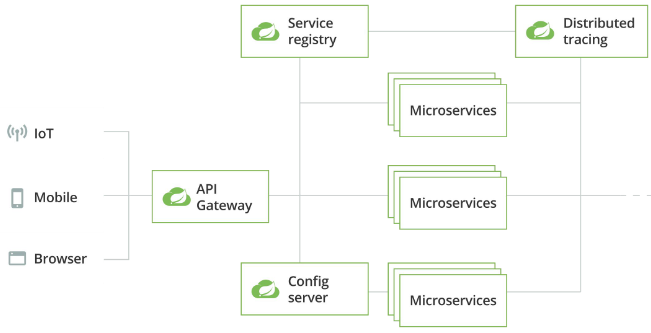

Микросервисы на Spring Cloud  
Spring Cloud 上的微服务
- Решение “из коробки” для реализации MSA.  
  用于 MSA 实施的开箱即用解决方案。
- Расширяет возможности Spring Boot.  
  扩展 Spring Boot 的功能。
- Включает в себя следующий набор компонентов:  
  包括以下组件：
  - Spring Cloud Config Server.  
    Spring Cloud配置服务器。  
  - Auth Server. 认证服务器。
  - API Gateway. API网关。
  - Service Discovery. 服务发现。
  - Клиентский балансировщик, Circuit Breaker и HTTP-клиент.  
    客户端负载均衡器、断路器和 HTTP 客户端。  
  - Панель мониторинга. 监控面板。

#### 2. Service Discovery и Service Registry.

Service Discovery — см [Вариант 1 вопрос 1](#1-варианты-реализации-service-discovery--服务发现实现方式)

Service Discovery – это процесс, позволяющий клиентам автоматически найти и использовать доступные службы. Примерами Service Discovery могут быть DNS, различные протоколы динамической конфигурации или протоколы обнаружения служб, такие как SLP или UPnP.  
服务发现是一个使客户端能够自动查找和使用可用服务的过程。服务发现的示例包括 DNS、各种动态配置协议或服务发现协议（如 SLP 或 UPnP）。

Решаемые задачи:  
需要解决的任务：
- реконфигурация системы  
  系统重新配置
- упрощение администрирования  
  简化行政管理
- горизонтальная масштабируемость  
  水平可扩展性

Service Registry – Ключевой компонент, SD. Это хранилище данных, используемое для хранения информации об услугах, доступных для других систем. Оно может содержать информацию о местоположении служб, метаданные и обнаруженные атрибуты, протоколы доступа и другую полезную информацию. Поэтому его необходимо обновлять и регулярно поддерживать.  
服务注册表 — 关键组件，SD。它是一个数据仓库，用于存储有关其他系统可用的服务的信息。它可能包含有关服务位置、元数据和发现的属性、访问协议和其他有用信息。因此，需要定期更新和维护。

Service Registry  
服务注册中心
- API для взаимодействия с реестром сервисов.  
  用于与服务注册表交互的API。
- Есть имплементации для популярных реестров (Eureka, Consul, ZooKeeper, Kubernetes...)  
  有流行注册中心的实现（Eureka、Consul、ZooKeeper、Kubernetes……）
- Базовый интерфейс – DiscoveryClient.  
  基本接口 – DiscoveryClient。

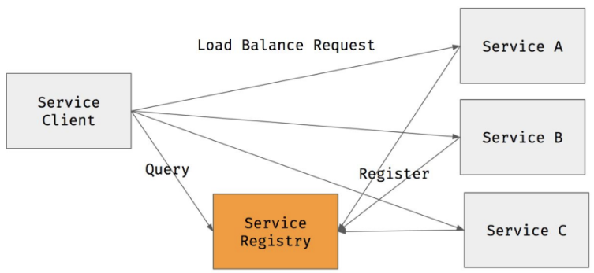

#### 3. Веб-сервис на JAX-WS, управляющий процессом выпечки колобков. Выпечка пирожка состоит из последовательности взаимозависимых этапов, выполнение которых должен обеспечивать сервис - поскребание по сусекам, подготовка теста, лепка заготовки, термическая обработка. <br> 管理烘焙 kolobok 过程的 JAX-WS Web 服务。烘烤馅饼包括一系列相互依赖的阶段，服务必须确保这些阶段的实施 - 刮擦桶底，准备面团，塑造坯料，热处理。

```java
@WebService(endpointInterface = "shit.soa.BakeryService")
public class BakeryServiceImpl extends BakeryService {
    @Inject
    private DoBakeryService doService;

    @WebMehtod(operationName = "poskrebanie")
    @WebResult(name = "poskrebanie_res_dto")
    public PoskrebanieResDto poskrebanie(@WebParam(name = "poskrebanie_req_dto")
                                         PoskrebanieReqDto req) {
        return new doService.doPoskrebanie(req); //delaet poskrebanie
    }

    @WebMehtod(operationName = "test_preparing")
    @WebResult(name = "test_preparing_res_dto")
    public TestPreparingResDto test_preparing(@WebParam(name = "poskrebanie_req_dto")
                                              TestPreparingReqDto req) {
        return new doService.doTestPreparing(req); //delaet testa preparing
    }

    @WebMehtod(operationName = "lepka")
    @WebResult(name = "lepka_res_dto")
    public LepkagResDto lepka(@WebParam(name = "lepka_req_dto") LepkaReqDto req) {
        return new doService.doLepka(req); //delaet lepka ZagotoVki
    }

    @WebMehtod(operationName = "term_handling")
    @WebResult(name = "term_handling_res_dto")
    public TermHandlingResDto termHandling(@WebParam(name = "term_handling_req_dto")
                                           TermHandlingReqDto req) {
        return new doService.doTermHandling(req); //delaet term handling
    }
}
```

### Вариант 6

#### 1. Реализация Service Discovery на уровне инфраструктурного ПО <br> 在基础设施软件层面实现服务发现

Это один из способов реализации SD в MSA и SOA. Service Discovery на уровне инфраструктурного ПО по сравнению со специальным ПО (по типу Consula) поддерживает не только Client-side SD, но и Server-Side*.  
这是在MSA和SOA中实现SD的方法之一。基础设施软件级别的服务发现，与专用软件（如 Consula）相比，不仅支持客户端 SD，还支持服务器端*。

Реализация SD происходит на уровне инфраструктурного ПО происходит с помощью конфигурирования и управления контейнерами и виртуальными машинами.  
SD 的实现发生在基础设施软件层面，通过容器和虚拟机的配置和管理。

Контейнеризация.  
容器化。

- Docker: ПО для автоматизации развёртывания и управления приложениями в средах с поддержкой контейнеризации. В отличие от развертывания виртуалок, достаточно только запустить одно Ядро и докер движок, и все контейнеры ставятся на них.  
  Docker：用于在支持容器的环境中自动部署和管理应用程序的软件。与部署虚拟机不同，您只需启动一个 Kernel 和 Docker 引擎，所有容器都安装在其上。
- Kubernetes: ПО для автоматизации развертывания, масштабирования и управления контейнеризованными приложениями. Он умеет делать Service Discovery.  
  Kubernetes。用于自动部署、扩展和管理容器化应用程序的软件。他可以进行服务发现。
  - Под — один или несколько контейнеров, гарантированно запущенные на одном узле (VM с контейнерами приложений), с разделением ресурсов, межпроцессным взаимодействием и уникальным IP-адресом.  
    Pod - 保证在单个节点（带有应用程序容器的 VM）上运行的一个或多个容器，具有资源共享、进程间通信和唯一的 IP 地址。
  - Service в kubernetes: совокупность логически связанных наборов подов и политик доступа к ним.  
    kubernetes 中的服务：逻辑相关的 pod 集合及其访问策略。 

При такой реализации возможностей гораздо больше, чем в прозрачном Java EE и специальном ПО том же.  
通过这种实现，比透明 Java EE 和特殊软件有更多可能性。

\* Что же такое Client side и server-side?  
\* 什么是客户端和服务器端？
- client-side discovery - клиент запрашивает информацию о доступе к доступным экземплярам у SD, а дальше сам распределяет нагрузку между ними  
  客户端发现 - 客户端从 SD 请求有关访问可用实例的信息，然后在它们之间分配负载
- server-side discovery - клиент использует посредника (SD) для запроса каталога услуг и выполнения запросов к ним  
  服务器端发现 - 客户端使用代理（SD）来请求服务目录并向其发出请求

#### 2. Реализация микросервисов на Java EE <br> 在 Java EE 上实现微服务

- Все сервисы “by design” регистрируются в JNDI и доступны через CDI.  
  所有“按设计”的服务均在 JNDI 中注册并可通过 CDI 访问。
- Если логику “под капотом” реализуют EJB, их можно масштабировать.  
  如果“底层”逻辑由 EJB 实现，则它们可以扩展。
- Конфигурация сервера приложений может быть распределённой:  
  应用服务器配置可以分布式：
  - В виде пула экземпляров сервера.  
    以服务器实例池的形式。 
  - В виде кластера  
    以集群形式 

Java EE: EJB Pool @ GlassFish Cluster

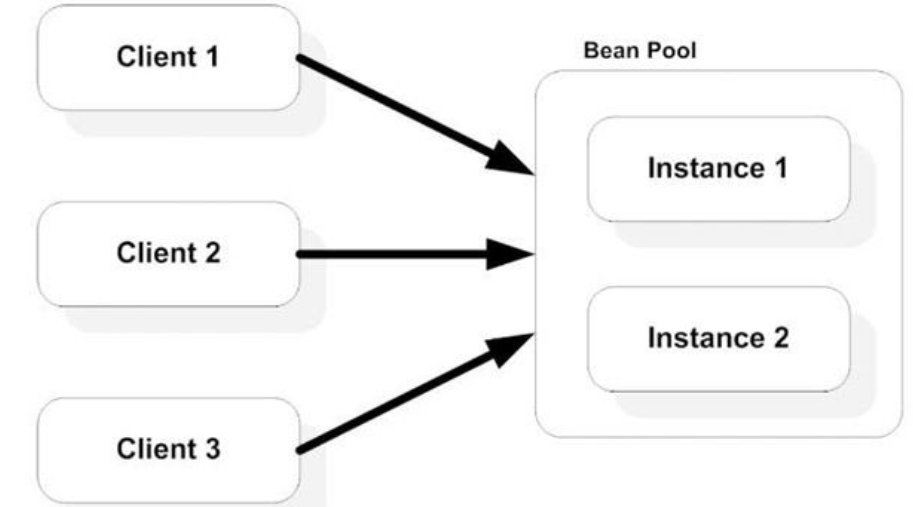

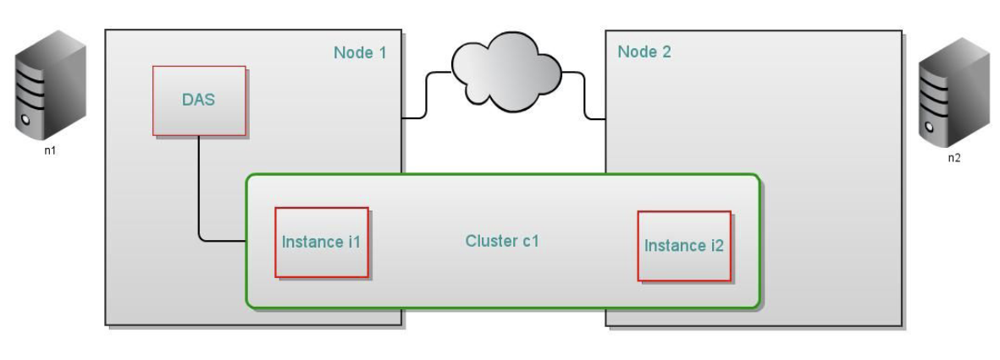

Компонент в пуле представляет состояние пула в жизненном цикле EJB. Это означает, что у bean-компонента нет идентификатора. Преимущество наличия bean-компонентов в пуле заключается в том, что время на создание bean-компонента можно сэкономить для запроса. Контейнер имеет механизмы, которые создают объекты пула в фоновом режиме, чтобы сэкономить время создания bean-компонента на пути запроса.  
池中的组件表示 EJB 生命周期中池的状态。这意味着该 bean 没有标识符。将 bean 放在池中的好处是可以节省每个请求创建 bean 所需的时间。容器具有在后台创建池对象的机制，以节省请求路径上的 bean 创建时间。

Компоненты сеанса без сохранения состояния и компоненты управления данными используют пул EJB. Помня о том, как вы используете сеансовые компоненты без сохранения состояния и объем трафика, который обрабатывает ваш сервер, настройте размер пула, чтобы предотвратить чрезмерное создание и удаление компонентов.  
无状态会话 Bean 和实体 Bean 使用 EJB 池。记住您如何使用无状态会话 Bean 以及服务器处理的流量量，调整池大小以防止过多地创建和删除 Bean。

- Подход используется относительно редко  
  该方法很少使用
- Стандартный вариант -- EJB + JAX-RS.  
  标准选项--EJB+JAX-RS。
- “Из коробки” есть Service Discovery с помощью JNDI.  
  可以使用 JNDI 进行开箱即用的服务发现。
- Можно выбирать между масштабированием на уровне экземпляров бинов и серверов приложений.  
  您可以在 Bean 实例级别和应用程序服务器级别进行扩展之间进行选择。
- Нужно выбирать максимально “лёгкие” серверы приложений (Jetty, Payara Micro etc).  
  您需要选择最“轻”的应用服务器（Jetty、Payara Micro 等）。

#### 3. Конфигурация в Consul сервиса по выпеканию пирожков с пулом экземпляров сервиса. Сервис реализован на Jakarta EE и развернут в контейнере приложений Wildfly на серверах helios, terra и aqua <br> 在 Consul 中配置带有服务实例池的馅饼烘焙服务。该服务在 Jakarta EE 上实现，并部署在 helios、terra 和 aqua 服务器上的 Wildfly 应用程序容器中

```json
{
  "services": [{
    "name": "wildfly-bakery-1",
    "address": "helios.se.ifmo.ru",
    "port": "41050",
    "checks": [{
      "id": "bakery-1-check",
      "name": "Bakery 1 Helios check",
      "http": "http://helios.se.ifmo.ru:41050/health",
      "method": "GET",
      "interval": "13s"
    }]
  },{
    "name": "wildfly-bakery-2",
    "address": "aqua",
    "port": "41050",
    "checks": [{
      "id": "bakery-2-check",
      "name": "Bakery 1 Aqua check",
      "http": "http://aqua:41050/health",
      "method": "GET",
      "interval": "13s"
    }]
  },{
    "name": "wildfly-bakery-3",
    "address": "terra",
    "port": "41050",
    "checks": [{
      "id": "bakery-2-check",
      "name": "Bakery 1 Terra check",
      "http": "http://terra:41050/health",
      "method": "GET",
      "interval": "13s"
    }]
  }]
}

```

### Вариант 7

#### 1. Consul. Назначение, архитектура, возможности <br> Consul：目的、架构、功能

Consul - server-side Система обнаружения сервисов (Service Discovery) с распределенным хранилищем “ключ-значение”. Так как является распределенным, то (ПО ставится на каждый комп). Регистрируются путём создания файлов в формате json  
Consul - 具有分布式键值存储的服务器端服务发现系统。由于它是分布式的，（该软件安装在每台计算机上）。通过创建json格式的文件进行注册

Предлагает веб-интерфейс для работы со списками сервисов.  
提供用于处理服务列表的 Web 界面。

Архитектура Consul

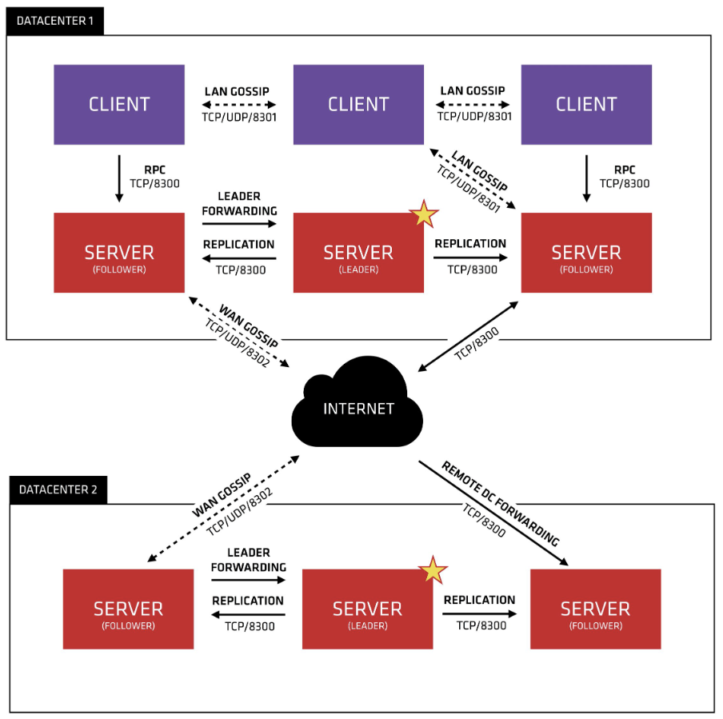

- Agent（代理）: 运行在每个节点上，负责服务注册、健康检查、通信
- Client：轻量级代理，向服务器发送请求，不存储数据
- Server：负责管理集群、存储数据、选举 Leader
- Gossip 协议：用于节点之间的状态同步和健康检查
- Raft 共识算法：服务器间数据同步，保证一致性
- Key-Value 存储：允许应用程序存储和获取配置信息

Преимущества Consul для микросервисов  
Consul 对微服务的好处

1. Обнаружение сервисов: эта функция покрывается Consul и полезна для интеграции новых технологий в ваши микросервисы.  
   服务发现：此功能由 Consul 涵盖，对于将新技术集成到您的微服务中很有用。
2. Повышенная прозрачность: Consul полностью прозрачен и может использоваться без каких-либо зависимостей кода.  
   提高透明度：Consul 完全透明，无需任何代码依赖即可使用。
3. Конфигурация: Consul можно использовать для настройки микросервисов. Могут быть реализованы как обнаружение сервисов, так и их настройка.  
   配置：可以使用Consul来配置微服务。它既可以实现服务发现，也可以进行服务配置。
4. Балансировка нагрузки: с помощью Consul DNS Consul прозрачно реализует балансировку нагрузки с помощью DNS-сервера.  
   负载均衡：通过Consul DNS，Consul透明地使用DNS服务器实现负载均衡。

Регистрация сервисов в консуле производится с помощью функции Consul Connect. Также регистрируются политики взаимодействия, например, мы можем указать, что сервис 1 может взаимодействовать с сервисом 2, но не может взаимодействовать с сервисом 3. Также для регистрации своего приложения доступна HTTP API или конфигурационные файлы самого консула (при наличии поддержки со стороны приложения).  
使用 Consul Connect 功能在 Consul 中注册服务。交互策略也被注册，例如，我们可以指定服务1可以与服务2交互，但不能与服务3交互。此外，HTTP API或consul本身的配置文件（如果应用程序支持）也可用于注册您的应用程序。

Принцип работы server side SD: клиент использует посредника (SD - Consul’a) для запроса каталога услуг и выполнения запросов к ним.  
服务器端 SD 的运行原理：客户端使用中介（SD - Consul）请求服务目录并对其执行请求。

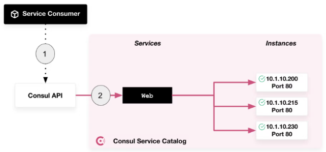

#### 2. Микросервисы на spring boot <br> Spring Boot 上的微服务

Микросервисы на Spring Boot  
Spring Boot 上的微服务
- Де-факто – обычные веб-сервисы (Spring Web MVC REST/ Spring Data REST).  
  事实上的 – 常规 Web 服务（Spring Web MVC REST/Spring Data REST）。
- Технология интеграции – на выбор программиста.  
  集成技术由程序员自行决定。
- Для того, чтобы управлять пулами микросервисов, нужно интегрироваться с сервером имён (например, Eureka).  
  为了管理微服务池，您需要与名称服务器（例如，Eureka）集成。
- Для того, чтобы распределять нагрузку, нужно интегрироваться с балансировщиком (например, Ribbon).  
  为了分配负载，您需要与平衡器（例如，Ribbon）集成。
- Интеграция осуществляется “вручную”.  
  集成以“手动”方式进行。

Spring Boot 微服务架构（Архитектура микросервисов на Spring Boot）

- Spring Boot	构建微服务的基础框架
- Spring Cloud Netflix Eureka	服务注册与发现（Service Discovery）
- Spring Cloud Config	分布式配置中心
- Spring Cloud Gateway	API 网关，管理微服务的访问
- Spring Cloud OpenFeign	声明式 REST 客户端，简化服务间调用
- Spring Cloud Circuit Breaker（Resilience4j）	熔断器，防止雪崩效应
- Spring Cloud Sleuth + Zipkin	分布式链路追踪
- Spring Boot Actuator	监控微服务状态

Пример архитектуры

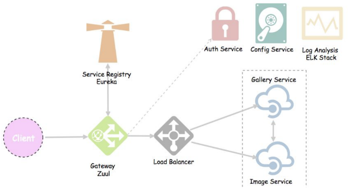

Балансировка нагрузки и использование индекса

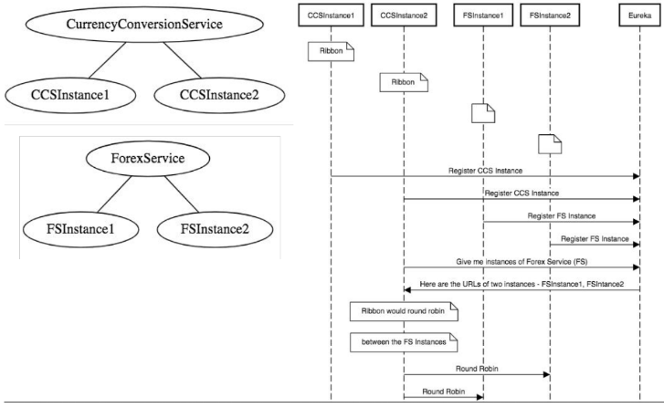

#### 3. Написать на JAX-WS сервис по управлению процессом изготовления резиновых уточек <br> 使用 JAX-WS 编写一个服务来管理小黄鸭的制作过程

```java
@WebService(endpointInterface = "shit.soa.DuckService")
public class DuckServiceImpl extends DuckService {

    @Inject
    private DoDuckService makingService;

    @WebMehtod(operationName = "makeNewDuck")
    public MakeNewDuckResDto makeNewDuck(MakeNewDuckReqDto req) {
        return new makingService.makeNewDuck(req.getDuckParams());
        //delat' utka po params
    }

    @WebMehtod(operationName = "remakeOldDuck")
    public TestPreparingResDto remakeOldDuck(TestPreparingReqDto req) {
        return new makingService.remakeOldDuck(req.getOldDuck(). req.getDuckParams());
        //peredelat' old utka with new params
    }
    
    @WebMehtod(operationName = "destroyBadDuck")
    public DestroyBadDuckResDto destroyBadDuck(DestroyBadDuckReqDto req) {
        return new makingService.destroyBadDuck(req.getDeffectiveDuck());
        //ubit' utka with wrong params
    }
    //... fantasize!
}
```

### Вариант 8

#### 1. Service Discovery

Описание подхода
- Обнаружение сервисов (Service Discovery) — автоматическое определение устройств и сервисов, предоставляемых этими устройствами в компьютерной сети.  
  服务发现 - 自动检测计算机网络中的设备以及这些设备提供的服务。
- Протоколы обнаружения сервисов (Service Discovery Protocol) — сетевые протоколы, реализующие SD.  
  服务发现协议是实现 SD 的网络协议。
- Таких протоколов много: DNS SD , Dynamic Host Configuration Protocol (DHCP), Service Location Protocol (SLP), Universal Description Discovery and Integration (UDDI) для веб-сервисов, Web Proxy Autodiscovery Protocol (WPAD)...  
  有很多这样的协议：DNS SD，动态主机配置协议（DHCP），服务定位协议（SLP），用于Web服务的通用描述发现和集成（UDDI），Web代理自动发现协议（WPAD）......

SD создан для того, чтобы с минимальными затратами можно подключить новое приложение в уже существующее наше окружение. Используя Service Discovery, мы можем максимально разделить либо контейнер в виде докера, либо виртуальный сервис от того окружения, в котором он запущен.  
SD 的设计目标是使新的应用程序能够以最低的成本连接到我们现有的环境。使用服务发现，我们可以最大限度地将 Docker 容器或虚拟服务与其运行环境分离。

Решаемые задачи 需要解决的问题
- Реконфигурация системы  
  系统重新配置
- Упрощение администрирования  
  简化行政管理
- Горизонтальная масштабируемость  
  水平可扩展性

Варианты реализации:  
实施方案：

- Инфраструктурное ПО  
  基础设施软件
  - SD конфигурируется на уровне управления ВМ/контейнеров (e.g. docker, kubernetes)  
    SD 在 VM/容器管理层面进行配置（例如 docker、kubernetes）
- Прозрачно силами платформы (например напрямую в Java EE)  
  对平台透明（例如，直接在 Java EE 中）
- Используя фреймворки (e.g. Spring Cloud)  
  使用框架（例如 Spring Cloud）
- Специальное прикладное ПО (Consul, Zookeeper)  
  特殊应用软件（Consul、Zookeeper）
  
Два типа SD и варианты реализации см. [Вариант 1. Вопрос 1](#1-варианты-реализации-service-discovery--服务发现实现方式)

#### 2. Smart Endpoints & Dump pipes

смотрите [Вариант 3. Вопрос 2](#2-smart-endpoints--dumb-pipes-в-мса--微服务架构中的智能端点愚蠢管道)

#### 3. Jax-ws сервис по управлению контингентом в университете <br> Jax-ws 大学学生人口管理服务

```java
@WebService(endpointInterface = "shit.soa.StudentManagmentService")
public class StudentManagmentServiceImpl extends StudentManagmentService {
    
    @Inject
    private StudentManagmentRepository rep;
    
    @WebMehtod(operationName = "getAllStudents")
    @WebResult(name="student_list_dto")
    public StudentsListDTO getAllStudents(@WebParam(name="get_students_req_dto")
                                          GetAllStudentsReqDTO req) {
        return new StudentsListDTO().getStudents().addAll(rep.getStudents());
    }
    
    @WebMehtod(operationName = "getStudent")
    @WebResult(name="student")
    public Student getStudent(@WebParam(name="get_student_req_dto") GetStudentReqDTO req) {
        return rep.getStudent(req.getId)
    }
    
    @WebMehtod(operationName = "addStudent")
    @WebResult(name="student")
    public Student addStudent(@WebParam(name="add_student_req_dto") AddStudentReqDTO req) {
        return rep.addStudent(req.getName, req.getGroup, ...);
    }
    @WebMehtod(operationName = "updateStudent")
    @WebResult(name="student")
    public Student updateStudent(@WebParam(name="update_student_req_dto") UpdateStudentReqDTO
                                         req) {
        return rep.updateStudent(req.getId, req.getName, req.getGroup, ...);
    }
    //... 
}
```

### Вариант 9

#### 1. Основные проблема коммуникации микросервисов и способы их решения <br> 微服务通信的主要问题及解决方法

Проблемы:

- Проблема доступности. Мы не знаем, какой из микросервисов сейчас доступен для общения, а какой упал или потерял коннект.  
  可访问性问题。我们不知道哪些微服务当前可以进行通信，哪些微服务已经崩溃或失去连接。
- Задержка передачи, потери, дублирование пакетов. Мы думаем, что отправили пакет, но получатель его не принял или получил в двойном экземпляре, и нам об этом неизвестно.  
  传输延迟、丢失、数据包重复。我们认为我们发送了一个包裹，但收件人没有接受或收到了两份，而我们对此一无所知。
- Нагрузка на трафик и память. Сервисы бывают нагруженные, поэтому общение приходится оптимизировать. От этого все становится сложнее. Если использовать какие-то асинхронные системы общения, придется хранить информацию какое-то время, а значит появляется вопрос к утилизации памяти или диска.  
  增加流量和内存负载。服务可能很繁忙，因此需要优化沟通。这使得事情变得更加复杂。如果你使用一些异步通信系统，你将不得不存储信息一段时间，这意味着出现内存或磁盘利用率的问题。
- Отказоустойчивость. Часто бывает, что сервисы падают каскадом - один упал, запросы не обрабатывает. Вслед за ним валятся другие сервисы, которые его вызывали - все от того, что они не могут получить ответ на свой запрос.  
  容错。经常会发生这样的情况：服务连续崩溃——一个服务崩溃了，就无法处理请求了。随后，调用它的其他服务也崩溃了 - 都是因为它们无法得到对其请求的响应。

Решения:

- Асинхронные способы общения - мы отправляем сообщение, а ответ придет когда-нибудь потом или он в принципе не предусмотрен:  
  异步通信方法——我们发送一条消息，但答案会在一段时间后出现，或者根本不提供：

- Месседжинг - RabbitMQ, ZeroMQ, ActiveMQ, Kafka. По сути берут на себя ответственность за доставку сообщения. Также Мессенджинги могут быть с балансировкой нагрузки.  
  消息传递——RabbitMQ、ZeroMQ、ActiveMQ、Kafka。本质上，他们承担着传递信息的责任。消息传递也可以实现负载平衡。

- Синхронные способы общения - мы делаем вызов и ждем получения ответа:  
  同步通信方法——我们发出呼叫并等待响应：

- REST API - неплохое решение, когда нет высоких нагрузок и получается хорошо контролировать доступность микросервисов. Взаимодействия по REST API проще отслеживать, чем асинхронный обмен, - сразу видно, что ответ не приходит или приходит не в том формате.  
  当没有高负载且能够很好地控制微服务的可用性时，REST API 是一个很好的解决方案。 REST API 交互比异步交换更容易跟踪 - 您可以立即看到是否未收到响应或以错误的格式收到响应。

Минусы: Если какой-то простой batch должен передать сообщение и завершиться, но получатель лежит, будут проблемы  
缺点：如果某个简单的批处理需要传输消息并完成，但接收方却宕机了，就会出现问题

#### 2. Circuit Breaker. Принципы, реализация, примеры использования. <br> 断路器。原理、实施、使用示例。

- ПО, предотвращающее “заведомо обречённые” запросы к сервисам.  
  阻止“明显注定失败”的服务请求的软件。
- “Каноничный” вариант -- Hystrix из стека Netflix.  
  规范”选项是来自 Netflix 堆栈的 Hystrix。
- Конфигурируется аннотациями (пример для Hystrix):  
  通过注释配置（Hystrix的示例）：
  - @EnableCircuitBreaker - разрешить имплементацию CircuitBreaker  
    @EnableCircuitBreaker - 启用 CircuitBreaker 的实现  
  - @EnableHystrix enables Hystrix capabilities in your Spring Boot application  
    @EnableHystrix 在你的 Spring Boot 应用程序中启用 Hystrix 功能  
  - @EnableHystrixDashboard - will give a dashboard view of Hystrix stream.  
    @EnableHystrixDashboard - 将提供 Hystrix 流的仪表板视图。  
  - @HystrixCommand(fallbackMethod = "myFallbackMethod").  
    @HystrixCommand（fallbackMethod =“myFallbackMethod”）。  

В отличии от Retry (когда если маленький шанс, что ошибка возникнет снова - мы не выбрасываем ошибку) паттерна, паттерн Circuit Breaker рассчитан на менее ожидаемые ошибки, которые могут длиться намного дольше: обрыв сети, отказ сервиса, оборудования. В этих ситуациях при повторной попытке отправить аналогичный запрос с большой долей вероятности мы получим аналогичную ошибку.  
与重试模式不同（如果错误再次发生的可能性很小，我们就不会抛出错误），断路器模式是为不太常见的、可能持续时间更长的错误而设计的：网络中断、服务故障、设备故障。在这些情况下，当我们尝试再次发送类似的请求时，我们很可能会收到类似的错误。

Например, приложение взаимодействует с неким сервисом, и в рамках реализации запросов и ответов предусмотрен некоторый тайм-аут, по истечении которого, если от сервиса не получен ответ, то операция считается неуспешной. В случае проблем с этим сервисом, во время ожидания ответа и до достижения тайм-аута приложение может потреблять какие- критически важные ресурсы (память, процессорное время), которые скорее всего нужны другим частям приложения. В такой ситуации, для приложения будет предпочтительнее завершить операцию с ошибкой сразу, не дожидаясь тайм-аута от сервиса и повторять попытку только тогда, когда вероятность успешного завершения будет достаточно высока.  
例如，一个应用程序与某个服务进行交互，在请求和响应的实现框架内，规定了一个一定的超时时间，如果在此时间之后没有收到服务的响应，则认为该操作不成功。如果此服务出现问题，则在等待响应并直到达到超时时，应用程序可能会消耗一些关键资源（内存，处理器时间），而这些资源很可能是应用程序的其他部分所需要的。在这种情况下，应用程序最好立即完成出现错误的操作，而无需等待服务超时，并且仅当成功完成的概率足够高时才重试。

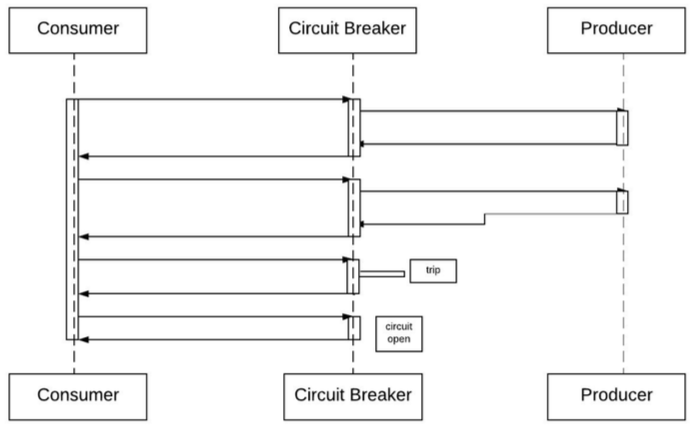

#### 3. JAX-WS сервис по управлению авиаперелётами <br> JAX-WS 航空旅行管理服务

```java
import javax.jws.WebService;
import javax.jws.WebMethod;
import javax.jws.WebParam;

@WebService(name = "FlightService")
public class FlightService {
    @WebMethod
    public List<Flight> getFlights() {
        // Реализация метода
    }

    @WebMethod
    public void addFlight(@WebParam(name = "flight") Flight flight) {
        // Реализация метода
    }

    @WebMethod
    public void deleteFlight(@WebParam(name = "flight") Flight flight) {
        // Реализация метода
    }

    @WebMethod
    public List<Airport> getAirports() {
        // Реализация метода
    }

    @WebMethod
    public void addAirport(@WebParam(name = "airport") Airport airport) {
        // Реализация метода
    }
    
    @WebMethod
    public void deleteAirport(@WebParam(name = "airport") Airport airport) {
        // Реализация метода
    }
}
```

### Вариант 10

#### 1. Load Balancer в Spring Cloud. <br> Spring Cloud 中的负载均衡器。

Spring Cloud LoadBalancer является официальной заменой Ribbon и поддерживает:  
Spring Cloud LoadBalancer 是 Ribbon 的官方替代品，它支持： 
- Динамическое получение экземпляров микросервисов (через механизм обнаружения сервисов)  
  动态获取微服务实例（通过服务发现机制）
- Встроенные стратегии балансировки нагрузки (циклическая, случайная, индивидуальная)  
  内置负载均衡策略（轮询、随机、自定义）
- Интеграция Spring Boot и Spring Cloud  
  集成 Spring Boot & Spring Cloud

Библиотека Spring Cloud Load Balancer позволяет нам создавать приложения, которые взаимодействуют с другими приложениями с балансировкой нагрузки . Используя любой алгоритм, который мы хотим, мы можем легко реализовать балансировку нагрузки при выполнении удаленных вызовов службы.  
Spring Cloud Load Balancer 库允许我们构建与其他负载平衡应用程序通信的应用程序。使用任何我们想要的算法，我们都可以在进行远程服务调用时轻松实现负载平衡。

Load Balancer в Spring Cloud предоставляет возможность распределения нагрузки между несколькими экземплярами служб или приложений.  
Spring Cloud 中的负载均衡器提供了在服务或应用程序的多个实例之间分配负载的能力。 

Он поддерживает различные алгоритмы балансировки, включая балансировку по нагрузке, балансировку по расстоянию и балансировку рандомом. Он может использоваться для маршрутизации трафика в микросервисных архитектурах. Это помогает избежать перегрузки одного экземпляра, а также снизить время отклика. Он также предлагает маршрутизацию по меткам (применяемым к отдельным экземплярам служб) и равномерное распределение нагрузки между ними.  
它支持各种平衡算法，包括负载平衡、距离平衡和随机平衡。它可用于在微服务架构中路由流量。这有助于避免一个实例过载并减少响应时间。它还提供基于标签的路由（应用于单个服务实例）和它们之间的负载平衡。

Для использования Load Balancer в Spring Cloud необходимо иметь следующие компоненты:  
要在 Spring Cloud 中使用负载均衡器，您需要具有以下组件：
1. Клиентское приложение, использующее балансировщик нагрузки для отправки запросов на сервер.  
   使用负载均衡器向服务器发送请求的客户端应用程序。
2. Сервер, который принимает запросы и отправляет ответы клиентскому приложению.  
   接受请求并向客户端应用程序发送响应的服务器。
3. Фронт-контроллер, который отвечает за обработку запросов и управляет потоком трафика между клиентом и сервером.  
   前端控制器，负责处理请求和管理客户端与服务器之间的流量。
4. Алгоритм балансировки, который определяет, какие серверы будут использоваться для обработки запросов и каким образом будет происходить маршрутизация трафика.  
   平衡算法，确定使用哪些服务器来处理请求以及如何路由流量。

Spring Cloud предоставляет Load Balancer:  
Spring Cloud 提供负载均衡器：
1. Ribbon – это клиентский Load Balancer, который помогает приложениям маршрутизировать запросы к доступным службам.  
   Ribbon 是一个客户端负载均衡器，可帮助应用程序将请求路由到可用的服务。


#### 2. Mule ESB, основные свойства и понятия.

Сервисная шина предприятия (Enterprise Service Bus, ESB) — ПО, обеспечивающее обмен сообщениями между различными ИС на принципах СОА.  
企业服务总线（ESB）是一种基于SOA原则提供不同信息系统之间消息交换的软件。

Основным направлением архитектуры ESB является разделение систем друг от друга и обеспечение их устойчивой и управляемой связи.  
ESB 架构的主要重点是将系统彼此分离并确保它们的通信稳定且易于管理。

Cостав ESB :
- Брокер сообщений — обеспечивает управление очередностью сообщений и выступает посредником между приложением-источником и приложением-приемником;  
  消息代理 - 提供消息队列管理并充当源应用程序和接收应用程序之间的中介；
- Комплект адаптеров — программных компонентов, которые служат для связи приложений с ESB и преобразуют один интерфейс в другой. Чем больше различных адаптеров заложено в интеграционную шину, тем шире ее функционал;  
  一组适配器 - 用于将应用程序连接到 ESB 并将一个接口转换为另一个接口的软件组件。集成总线包含的不同适配器越多，其功能就越广泛；
- В современных ESB-решениях реализованы принципы микросервисной архитектуры. В соответствии с ними весь функционал системы распределяется между микросервисами, каждый из которых может работать независимо от других;  
  现代 ESB 解决方案实现了微服务架构的原则。根据它们，系统的所有功能都分布在微服务之间，每个微服务都可以独立于其他服务运行；
- Средства для контроля и мониторинга.  
  控制和监测手段。

Возможности ESB  
ESB 功能
- Синхронный и асинхронный вызов сервисов.  
  同步和异步服务调用。
- Использование защищённого транспорта, с гарантированной доставкой сообщений, поддерживающего транзакционную модель.  
  使用安全传输，保证消息传递，支持交易模型。
- Маршрутизация сообщений.  
  消息路由。
- Доступ к данным из сторонних ИС с помощью адаптеров.  
  使用适配器访问第三方信息系统的数据。
- Обработка и преобразование сообщений.  
  消息的处理和转换。
- Оркестровка и хореография сервисов.  
  服务的编排与协作
- Разнообразные механизмы контроля и управления (аудиты, протоколирование).  
  各种控制和管理机制（审计、日志记录）。

Преимущества: 优点：
- Через интеграционный шлюз происходит быстрый обмен данными с использованием разных форматов и протоколов.  
  集成网关支持使用不同格式和协议进行快速数据交换。
- ESB позволяет преобразовать сообщения в нужный формат, контролировать транзакции, проводить маршрутизацию с учетом смысла, равномерно распределять нагрузку на отдельные сервисы и гарантировать безопасность обмена данными  
  ESB 允许您将消息转换为所需的格式、控制事务、根据含义进行路由、均匀分配各个服务的负载并保证数据交换的安全性

Недостатки: 缺陷：
- Сложность реализации  
  实施难度
- Требует больших ресурсов.  
  需要大量资源。

Mule ESB - реализация сервисной шины.  
Mule ESB 是一种服务总线实现。

Mule ESB - платформа, одна из реализаций ESB, дающая возможность объединять различные информационные системы на основе принципов обмена сообщениями, контроля надежности, сопоставления данных, оркестровки, а также масштабированием между узлами.  
Mule ESB 是一个平台，是 ESB 实现之一，它基于消息交换、可靠性控制、数据比较、编排和节点间扩展的原则实现各种信息系统的统一。

Mule ESB

- Платформа ESB и фреймворк для интеграции сервисов от MuleSoft.  
  MuleSoft 的 ESB 平台和服务集成框架。
- Написана на Java, может выступать в качестве брокера и для сервисов на других платформах.  
  用 Ja​​va 编写，可以作为其他平台上服务的代理。
- Есть открытая и коммерческая версии.  
  有开放版本和商业版本。
- Есть адаптеры для разных видов сервисов.  
  有适用于不同类型服务的适配器。
- Есть Anypoint Studio – IDE на базе Eclipse для разработки проектов на базе Mule.  
  有 Anypoint Studio – 一个基于 Eclipse 的 IDE，用于开发基于 Mule 的项目。

Mule: основные понятия  
Mule：基本概念

- Каждое сообщение (message) делится на две части – заголовок (header) и полезную нагрузку (payload).  
  每条消息分为两部分 - 标头和有效负载。
- Обмен сообщениями реализуется через потоки (flows). Каждое приложение содержит один или несколько потоков.  
  通过流实现消息交换。每个应用程序包含一个或多个线程。
- Есть два способа конфигурации потоков:  
  有两种方式可以配置流：
  - Через дескрипторы XML.  
    通过 XML 描述符。  
  - Графический – с помощью Anypoint Studio.  
    图形 – 使用 Anypoint Studio。  


#### 3. Конфигурация на Consul пула серверов WildFly, на которых развёрнута Jakarta EE система по выпеканию пирожков. <br> 在 Consul 上配置部署了 Jakarta EE 饼烘焙系统的 WildFly 服务器池。

```json
{
  "services": [{
    "name": "wildfly-bakery-1",
    "address": "14.88.228.42",
    "port": "14141",
    "checks": [{
      "id": "bakery-1-check",
      "name": "Bakery 1 HTTP check",
      "http": "http://14.88.228.42/14141",
      "method": "GET",
      "interval": "14s"
    }]
  },{
    "name": "wildfly-bakery-2",
    "address": "14.88.228.24",
    "port": "14141",
    "checks": [{
      "id": "bakery-2-check",
      "name": "Bakery 2 script check",
      "script": "/petuxon.py --host 14.88.228.24 -- port 14141",
      "interval": "88s"
    }]
  }]
}
```

### Вариант 11

#### 1. Оркестровка и хореография микросервисов

Оба термина описывают два аспекта разработки бизнес-процессов на основе объединения Web-сервисов.  
这两个术语描述了基于 Web 服务组合的业务流程开发的两个方面。

**Оркестровка микросервисов** – добавление подсистемы (дирижер - orchestrator), которая будет координировать взаимодействие между сервисами:  
**微服务编排**——添加一个子系统（指挥者 - orchestrator），用于协调服务之间的交互：

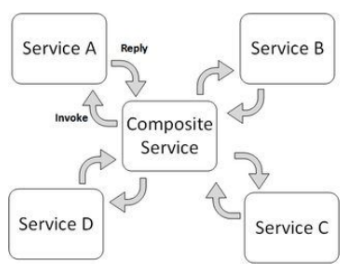

При оркестровке мы настраиваем и интегрируем существующие микросервисы для реализации бизнес-целей (в т.ч. планирование распределенной системы, интеграцию существующих микросервисов, обновление микросервисов и мониторинг производительности).  
在编排中，我们配置并集成现有的微服务，以实现业务目标（包括分布式系统的规划、现有微服务的集成、微服务的更新以及性能监控）。

- Добавляется подсистема, которая координирует взаимодействие между сервисами (“дирижёр” – Orchestrator).  
  通过添加一个子系统来协调服务之间的交互（“指挥者” - Orchestrator）。
- Есть готовые решения для оркестровки микросервисов:  
  现有的微服务编排解决方案包括：
  - Kubernetes;
  - Azure Kubernetes Service (ACS);
  - Apache Mesos;
  - Amazon Elastic Container Service (ECS).

Хореография микросервисов – это процесс проектирования связи между микросервисами и их взаимодействий. Она может включать в себя проектирование архитектуры, создание мостов между микросервисами, планирование взаимодействия между микросервисами и мониторинг и анализ межсервисной связи. В отличие от оркестровки “центрального” сервиса нет: Административная логика “размазана” по сервисам:  
微服务编舞——设计微服务之间的连接及其交互方式。编舞可能包括架构设计、微服务间桥接、微服务交互规划，以及跨服务连接的监控和分析。与编排不同，编舞没有“中央”服务：管理逻辑分布在各个服务中：

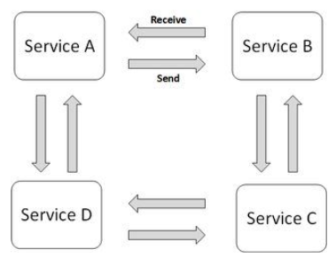

- Описывает взаимодействие между несколькими сервисами.  
  描述多个服务之间的交互方式。
- В отличие от оркестровки, “центрального” сервиса нет.  
  与编排不同，编舞没有“中央”服务。
- Административная логика “размазана” по сервисам.  
  管理逻辑分布在各个服务中。
- Более “честно” ложится на МСА, но сложнее в реализации.  
  更符合微服务架构（MSA）的理念，但实现起来更复杂。
- Могут использоваться брокеры событий (Event Broker).  
  可能使用事件代理（Event Broker）进行通信。

Хореография более честно ложится на Микросервисную архитектуру, но сложнее в реализации. Для имплементации могут использоваться брокеры событий  
编舞更符合微服务架构的理念，但实现起来更复杂。为了实现编舞，可以使用事件代理（Event Broker）。

#### 2. Top-down и bottom-up стратегии при использовании аннотаций wsdl <br> 使用 wsdl 注释时的自上而下和自下而上的策略

При разработке веб-сервисов с использованием WSDL (Web Services Description Language) существуют две основные стратегии:  
在使用 WSDL（Web 服务描述语言） 开发 Web 服务时，有两种主要策略：

- Top-down (сверху вниз, контракт-ориентированный подход)  
  自上而下（Top-down，基于契约的方法）
- Bottom-up (снизу вверх, код-ориентированный подход)  
  自下而上（Bottom-up，基于代码的方法）

Top-down (сверху вниз) — 基于 WSDL 的契约优先方法

Суть подхода:
- Сначала разрабатывается WSDL-контракт, описывающий веб-сервис (методы, параметры, типы данных)  
  首先编写 WSDL 契约，定义 Web 服务的接口、方法、参数和数据类型
- Затем на основе WSDL автоматически генерируется серверная реализация  
  然后根据 WSDL 自动生成服务器端代码

Шаги реализации 实现步骤
1. Создание WSDL-файла вручную или с помощью инструментов (например, Eclipse, SoapUI)  
   手动编写 WSDL 文件 或使用工具（如 Eclipse、SoapUI）生成
2. Генерация Java-классов с помощью wsimport (JAX-WS) или других инструментов  
   使用 wsimport（JAX-WS）或其他工具生成 Java 代码
3. Реализация бизнес-логики сервиса  
   编写服务逻辑，实现生成的接口
4. Развертывание сервиса  
   部署 Web 服务

Bottom-up (снизу вверх) — Код-ориентированный подход

Суть подхода:
- Сначала разрабатывается Java-класс с аннотациями JAX-WS  
  先编写 Java 代码（使用 JAX-WS 注解）
- Затем автоматически генерируется WSDL  
  然后自动生成 WSDL

Шаги реализации (实现步骤)
1. Написание Java-класса с аннотациями JAX-WS  
   使用 JAX-WS 注释编写 Java 类
2. Деплой в контейнер (например, Apache Tomcat, WildFly)  
   部署到容器（例如 Apache Tomcat、WildFly）
3. Автоматическая генерация WSDL  
   自动 WSDL 生成
4. Клиенты могут использовать этот WSDL для взаимодействия с сервисом  
   客户端可以使用此 WSDL 与服务进行交互。

#### 3. Конфигурация Spring Boot сервиса для подключения Consul, он живет на localhost на 8500 порту <br> 配置 Spring Boot 服务用于连接 Consul，它位于本地主机的 8500 端口上

```properties
spring.application.name=main-service
spring.cloud.consul.host=localhost
spring.cloud.consul.port=8500
spring.cloud.consul.config.enabled=true
#health check
spring.cloud.consul.config.import-check.enabled=false
spring.cloud.consul.discovery.health-check-path=/health
spring.cloud.consul.discovery.health-check-interval=8s
#if tls cert self-signed
spring.cloud.consul.discovery.health-check-tls-skip-verify=true
#if https needed
spring.cloud.consul.discovery.scheme=https
```

### Вариант 12

#### 1. Свойства и ключевые особенности микросервиса. <br> 微服务的属性和主要特征。

Это архитектурный стиль разработки, который позволяет создавать приложения в виде набора небольших автономных микросервисов, разработанных для бизнес-сферы.  
它是一种架构开发风格，允许将应用程序构建为一组为业务目的而设计的小型、自主的微服务。

Особенности MSA  
MSA 的功能

- Модули легко заменить в любое время: акцент на простоту, независимость развёртывания и обновления.  
  模块易于随时更换：强调简单性、部署和更新的独立性。
- Микросервис [по возможности] выполняет только одну элементарную функцию.  
  微服务（如果可能）只执行一项基本功能。
- Модули могут быть реализованы с использованием разных стеков технологий и работать на разных платформах.  
  模块可以使用不同的技术栈实现并在不同的平台上运行。
- Архитектура симметричная, а не иерархическая: зависимости между микросервисами одноранговые.  
  架构是对称的，而不是分层的：微服务之间的依赖关系是对等的。

Свойства микросервиса  
微服务属性

1. Небольшой  
   小
2. Независимый.  
   独立。
3. Строится вокруг бизнес-потребности и использует ограниченный контекст (Bounded Context).  
   围绕业务需求构建并使用有界上下文。
4. Взаимодействует с другими микросервисами по сети на основе паттерна Smart endpoints & dumb pipes.  
   基于智能端点和哑管道模式通过网络与其他微服务进行交互。
5. Его распределенная суть обязывает использовать подход Design for failure.  
   它的分布式特性要求使用故障设计方法。
6. Централизация ограничена сверху на минимуме.  
   集中化​​至少受到来自上层的限制。
7. Процессы его разработки и поддержки требуют автоматизации.  
   其开发和支持过程需要自动化。
8. Его развитие итерационное.  
   其发展是迭代的。

Что значит “небольшой”?  
“小”是什么意思？

- Один сервис может развивать одна команда не более чем из дюжины человек.  
  一个服务可以由一个不超过十几个人的团队来开发。
- Команда из полудюжины человек может развивать полдюжины сервисов.  
  一个由六个人组成的团队可以开发六项服务。
- Контекст (не только бизнеса, но и разработки) одного сервиса помещается в голове одного человека.  
  一项服务的背景（不仅是业务背景，还有开发背景）适合一个人的头脑。
- Один сервис может быть полностью переписан одной командой за одну Agile-итерацию.  
  一个团队可以在一次敏捷迭代中完全重写一项服务。

Что значит “независимый”?  
“独立”是什么意思？

- Использует свой контекст.  
  使用其自己的上下文。
- Не использует [общие] библиотеки.  
  不使用[共享]库。
- Использует своё хранилище данных (!).  
  使用自己的数据存储（！）。
- Следствие независимости – при большом числе сервисов требуются продвинутые инструменты CI и CD.  
  独立的后果 - 当有大量服务时，需要高级 CI 和 CD 工具。

#### 2. Структура документа WSDL

- WSDL - Язык спецификации SOAP веб-сервисов, который Базируется на XML.  
  WSDL - SOAP Web 服务规范语言，基于 XML。
- Описывает весь интерфейс сервиса:  
  描述整个服务接口：
  - функции;  
    功能；  
  - аргументы;  
    参数  
  - возвращаемые значения.  
    返回值  
- Может автогенерироваться по API сервиса, или, наоборот – API сервиса может автогенерироваться по WSDL.  
  可以由服务 API 自动生成，或者相反，服务 API 可以由 WSDL 自动生成。

Структура версии 1.1:  
1.1版结构：

Abstract Definition of Service  
服务的抽象定义

- Types: Данный раздел содержит определения типов данных для описания входных/выходных параметров службы: вида отправляемых и получаемых сервисом XML-сообщений  
  类型：本节包含用于描述服务输入/输出参数的数据类型定义：服务发送和接收的 XML 消息的类型
- Messages: Данный раздел содержит определения сообщений, которые будут отправляться и получаться в рамках вызова службы. То есть это описание элементов данных.  
  消息：此部分包含作为服务调用的一部分发送和接收的消息的定义。也就是说，它是对数据元素的描述。
- Port Types - абстрактные операции: Данный раздел содержит определения интерфейсов служб, содержащие информацию об операциях, принимаемых службой над сообщениями, и о последовательности, в которой должны быть вызваны эти операции. Protocol and physical locations  
  端口类型 - 抽象操作：本节包含服务接口的定义，其中包含有关服务在消息上接受的操作以及调用这些操作的顺序的信息。协议和物理位置
- Bindings (связывание сервисов) — способ, которым сообщение будет доставлено.  
  绑定（服务绑定）——消息传递的方式。
- Service ports - где сервис расположен  
  服务端口 - 服务所在的位置

Структура документа WSDL 1.1, пример:  
WSDL 1.1 文档结构，示例：

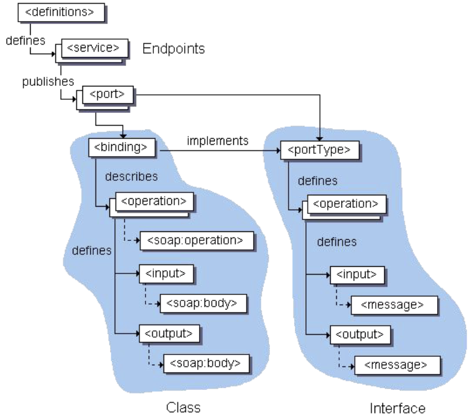

Отличия WSDL 2.0 от 1.1:  
WSDL 2.0 和 1.1 之间的区别：
- Типы портов переименованы в интерфейсы. Поддержка наследования интерфейса достигается за счет использования атрибута extends в элементе интерфейса.  
  端口类型已重命名为接口。对接口继承的支持是通过使用接口元素上的 extends 属性来实现的。
- Порты переименованы в конечные точки  
  端口重命名为端点

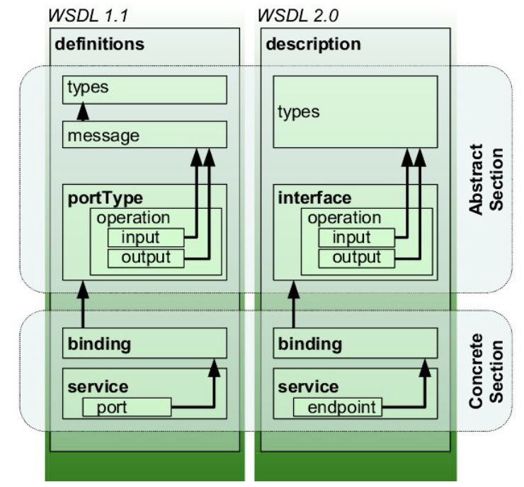

#### 3. Конфигурация, регистрирующая в Consul пул экземпляров СУБД MySQL. Сервисы расположены на машинах ra, helios и anubis, экземпляры занимают порт 3306 на каждой из машин. Конфигурация должна обеспечивать проверку того, запущены ли экземпляры каждого из сервисов. <br> 在 Consul 中注册 MySQL DBMS 实例池的配置。服务位于机器ra、helios和anubis上，每台机器上的实例占用3306端口。配置必须确保每个服务的实例都在运行。

```json
{
  "services": [{
    "name": "mysql-ra",
    "address": "ra-address",
    "port": "3306",
    "checks": [{
      "name": "RA MySQL check",
      "script": "/mysql-check-script.py --host ra-address -- port 3306",
      "interval": "88s"
    }]
  },{
    "name": "mysql-helios",
    "address": "helios.se.ifmo.ru",
    "port": "3306",
    "checks": [{
      "name": "Helios MySQL check",
      "script": "/mysql-check-script.py --host helios.se.ifmo.ru -- port 3306",
      "interval": "88s"
    }]
  }, {
    "name": "mysql-anubis",
    "address": "anubis-address",
    "port": "3306",
    "checks": [{
      "name": "Anubis MySQL check",
      "script": "/mysql-check-script.py --host anubis-address -- port 3306",
      "interval": "88s"
    }]
  }]
}
```

### Вариант 13

#### 1. Преимущества и недостатки MSA по сравнению с “обычной” SOA.

Преимущества МСА по сравнению с СОА:  
MSA 相对于 SOA 的优势：
- Уменьшение размера кода: МСА может быть более легкой и модульной архитектурой, поскольку она может быть ориентирована на компоненты и более маленькие микросервисы.  
  减少代码大小：MCA 可以是更轻、更模块化的架构，因为它可以面向组件并成为更小的微服务。
- Легче реализовывать масштабирование: МСА может быть легко масштабируемой архитектурой, поскольку она может быть разделена на множество маленьких и модульных компонентов.  
  更容易实现可扩展性：MSA 可以是一个易于扩展的架构，因为它可以分成许多小的模块化组件。
- Ускорение разработки: Для создания и поддержания приложений в рамках МСА можно использовать более легкие инструменты и фреймворки.  
  加快开发速度：可以使用更轻的工具和框架在 MSA 内创建和维护应用程序。

Недостатки МСА по сравнению с СОА:  
与 SOA 相比，MSA 的缺点：
- Потенциальные проблемы с согласованностью данных: В некоторых случаях возникает проблема установления согласованности данных по всем микросервисам.  
  潜在的数据一致性问题：在某些情况下，在所有微服务中建立数据一致性存在问题。
- Отсутствие поддержки для платформы: В некоторых случаях микросервисы могут быть сложно портировать на новые платформы.  
  缺乏平台支持：在某些情况下，微服务可能难以移植到新平台。
- Потенциальные проблемы с безопасностью: В некоторых случаях возникают проблемы с безопасностью, поскольку для некоторых приложений требуется более высокий уровень безопасности, чем тот, который предоставляется в рамках МСА.  
  潜在的安全问题：在某些情况下，出现安全问题是因为某些应用程序需要比 MSA 提供的更高级别的安全。

Преимущества микросервисов  
微服务的好处
- Более простой шаблон архитектуры, который легко понять разработчикам  
  更简单的架构模式，方便开发人员理解
- IDE быстрее делает разработчиков быстрее и продуктивнее  
  IDE 使开发人员更快、更高效
- Веб-контейнер запускается быстрее; это помогает ускорить процесс развертывания и разработки.  
  Web容器启动速度更快；这有助于加快部署和开发过程。
- Это позволяет команде разрабатывать, развертывать и масштабировать свой сервис независимо от всех других команд.  
  这使得团队能够独立于所有其他团队开发、部署和扩展其服务。

Недостатки микросервисов  
微服务的缺点
- Он разработан для построения монолитных приложений, поэтому он не предоставляет явной поддержки для разработки распределенных приложений.  
  它是为构建单片应用程序而设计的，因此它不提供对开发分布式应用程序的明确支持。
- Тестирование сложнее  
  测试更加困难
- Разработчики должны реализовать механизм  
  开发人员必须实现该机制
- межсервисных коммуникаций.  
  服务间通信。
- Реализация вариантов использования, охватывающих несколько служб, требует координации между командами.  
  实施跨多项服务的用例需要跨团队的协调。
- Микросервис стоит дорого, так как вам всегда нужно поддерживать различное серверное пространство для разных бизнес-задач  
  微服务很昂贵，因为你总是需要为不同的业务任务维护不同的服务器空间

#### 2. Аннотации JAX-WS

Аннотации JAX-WS  
JAX-WS 注释

- `@WebService` — указывает на то, что Java класс (или интерфейс) является веб-сервисом.  
  `@WebService` - 表示 Java 类（或接口）是一个 Web 服务。
- `@WebMethod` — позволяет настроить то, как будет отображаться метод класса на операцию сервиса.  
  `@WebMethod` - 允许您自定义如何将类方法映射到服务操作。
- @WebParam — позволяет настроить то, как будет отображаться конкретный параметр операции на WSDL-часть (part) и XML элемент.  
  @WebParam - 允许您自定义如何在 WSDL 部分和 XML 元素上显示特定的操作参数。
- `@WebResult` — позволяет настроить то, как будет отображаться возвращаемое значение операции на WSDL-часть (part) и XML элемент.  
  `@WebResult` - 允许您自定义操作的返回值在 WSDL 部分和 XML 元素上的显示方式。
- `@Oneway` — указывает на то, что операция является односторонней, то есть не имеет выходных параметров.  
  `@Oneway` - 表示操作是单向的，即没有输出参数。
- `@SOAPBinding` — позволяет настроить то, как будет отображаться сервис на протокол SOAP.  
  `@SOAPBinding` - 允许您配置服务如何映射到 SOAP 协议。

#### 3. Конфигурация, регистрирующая в Consul пул сервисов libreoffice … обработкой документов. Сервисы расположены на машинах aqua, …, по пути /usr/bin/soffice. Конфигурация должна обеспечивать проверку запущены ли экземпляры сервисов. <br> 在 Consul 中注册 libreoffice 服务池的配置，用于文档处理。服务位于机器 aqua、……上，沿着路径 /usr/bin/soffice。配置必须确保服务实例正在运行。

```json
{
  "service": {
    "name": "libreoffice-service",
    "port": 8080,
    "check": {
      "script": "curl helios:8080/health",
      "interval": "10s"
    },
    "tags": ["libreoffice", "documents"],
    "enable_tag_override": false
  },
  "checks": [
    {
      "id": "libreoffice-service-1",
      "name": "Libreoffice service on aqua",
      "command": "/usr/bin/soffice",
      "args": ["--listen",
        "--accept=socket,host=aqua,port=8080"],
      "interval": "10s"
    },
    {
      "id": "libreoffice-service-2",
      "name": "Libreoffice service on terra",
      "command": "/usr/bin/soffice",
      "args": ["--listen",
        "--accept=socket,host=terra,port=8080"],
      "interval": "10s"
    }
  ]
}
```

### Вариант 14

#### 1. UDDI

смотрите [Вариает1. Вопрос 2](#2-структура-реестра-uddi--uddi-注册中心结构)

#### 2. Design for failure

Design for Failure - Одно из ключевых свойств микросервисной архитектуры. У MSA есть ряд проблем:  
针对故障进行设计——微服务架构的关键属性之一。 MSA 存在许多问题：

- Ненадёжность сети (а практически все вызовы -- удалённые!).  
  网络不可靠（而且几乎所有呼叫都是远程的！）。
- Сложность реализации событийной архитектуры.  
  实现事件架构的复杂性。

Эти проблемы сложно и дорого устранять, поэтому мы считаем, что наличие некритичных ошибок при работе -- нормальная ситуация. Свойство же design for failure заключается в том, что с самого первого этапа, начиная строить микросервисную архитектуру, вы должны исходить из предположения, что ваши сервисы не работают. Другими словами, ваш сервис должен понимать, что ему могут не ответить никогда, если он ожидает каких-то данных. Таким образом, вы сразу должны исходить из ситуации, что что-то у вас может не работать.  
这些问题修复起来很困难而且成本很高，所以我们认为运行过程中出现非严重错误是正常情况。失败属性的设计是，从最初阶段开始构建微服务架构时，就必须从服务无法正常工作的假设出发。换句话说，您的服务必须明白，如果它正在等待某些数据，它可能永远不会收到响应。因此，您必须立即假设某些事情可能不适合您。

При этом повышаются требования к инфраструктуре: мы должны уметь оперативно выявлять и исправлять проблемы.  
与此同时，对基础设施的要求也日益提高：我们必须能够快速发现并纠正问题。

Например, для этого компания Netflix разработала Chaos Monkey — инструмент, который ломает сервисы, хаотически их выключает и рвет соединения. Этот нужно, чтобы оценить надежность системы.  
例如，为了这个目的，Netflix 开发了 Chaos Monkey，这是一种破坏服务、随机关闭服务并断开连接的工具。这对于评估系统的可靠性是必要的。

#### 3. конфиг для консула чтобы зарегать 3 бд

```json
{
  "services": [
    {
      "name": "mysql-service",
      "address": "mysql-address",
      "port": "1010",
      "checks": [
        {
          "name": "check is mysql alive",
          "script": "/check-is-alive.py --host mysql-address --port 1010",
          "interval": "20s"
        }
      ]
    },
    {
      "name": "postgresql-service",
      "address": "postgresql-address",
      "port": "1010",
      "checks": [
        {
          "name": "check is postgresql alive",
          "script": "/check-is-alive.py --host postgresql-address --port 1010",
          "interval": "20s"
        }
      ]
    },
    {
      "name": "redis-service",
      "address": "redis-address",
      "port": "1010",
      "checks": [
        {
          "name": "check is redis alive",
          "script": "/check-is-alive.py --host redis-address --port 1010",
          "interval": "20s"
        }
      ]
    }
  ]
}

```

### Вариант 15

#### 1. Service Discovery в решениях на базе Spring Cloud Netflix

смотрите [Вариает4. Вопрос 1](#1-service-discovery-в-решениях-на-базе-spring-cloud-netflix--spring-cloud-netflix-解决方案中的服务发现)

#### 2. Сервисные шины особенности, преимущества и недостатки, использование в решениях на базе SOA

Основным направлением архитектуры ESB является разделение систем друг от друга и обеспечение их устойчивой и управляемой связи.

Cостав ESB:
- Брокер сообщений — обеспечивает управление очередностью сообщений и выступает посредником между приложением-источником и приложением-приемником;
- Комплект адаптеров — программных компонентов, которые служат для связи приложений с ESB и преобразуют один интерфейс в другой. Чем больше различных адаптеров заложено в интеграционную шину, тем шире ее функционал;
- В современных ESB-решениях реализованы принципы микросервисной архитектуры. В соответствии с ними весь функционал системы распределяется между микросервисами, каждый из которых может работать независимо от других;
- Средства для контроля и мониторинга.

Преимущества:
- Через интеграционный шлюз происходит быстрый обмен данными с использованием разных форматов и протоколов.
- ESB позволяет преобразовать сообщения в нужный формат, контролировать транзакции, проводить маршрутизацию с учетом смысла, равномерно распределять нагрузку на отдельные сервисы и гарантировать безопасность обмена данными

Недостатки:
- Сложность реализации
- Требует больших ресурсов.

Mule(см. [Вариант 10 вопрос 2](#2-mule-esb-основные-свойства-и-понятия))

#### 3. Набор микросервисов на Spring MVC, реализующий параллельную сортировку элементов массива. Алгоритм сортировки мож но выбрать любой подходящий. <br> 一组实现数组元素并行排序的 Spring MVC 微服务。您可以选择任何合适的排序算法。

Похоже на [вариант 4. Вопрос 3](#3-набор-микросервисов-на-spring-mvc-управляющий-распределением-по-аудиториям-и-преподавателям-студентов-ожидающих-своей-очереди-на-доп-должна-поддерживаться-возможность-добавления-новых-аудиторий-и-преподавателей-и-удаления-существующих-в-одной-аудитории-может-находиться-более-одного-преподавателя--一组基于-spring-mvc-的微服务用于管理排队等待加课的学生在教室和老师之间的分配应该可以添加新的教室和教师并删除现有的教室和教师一个教室可能有多个老师) (потому что тоже именно набор микросервисов, а не 1 микр.,/осервис)