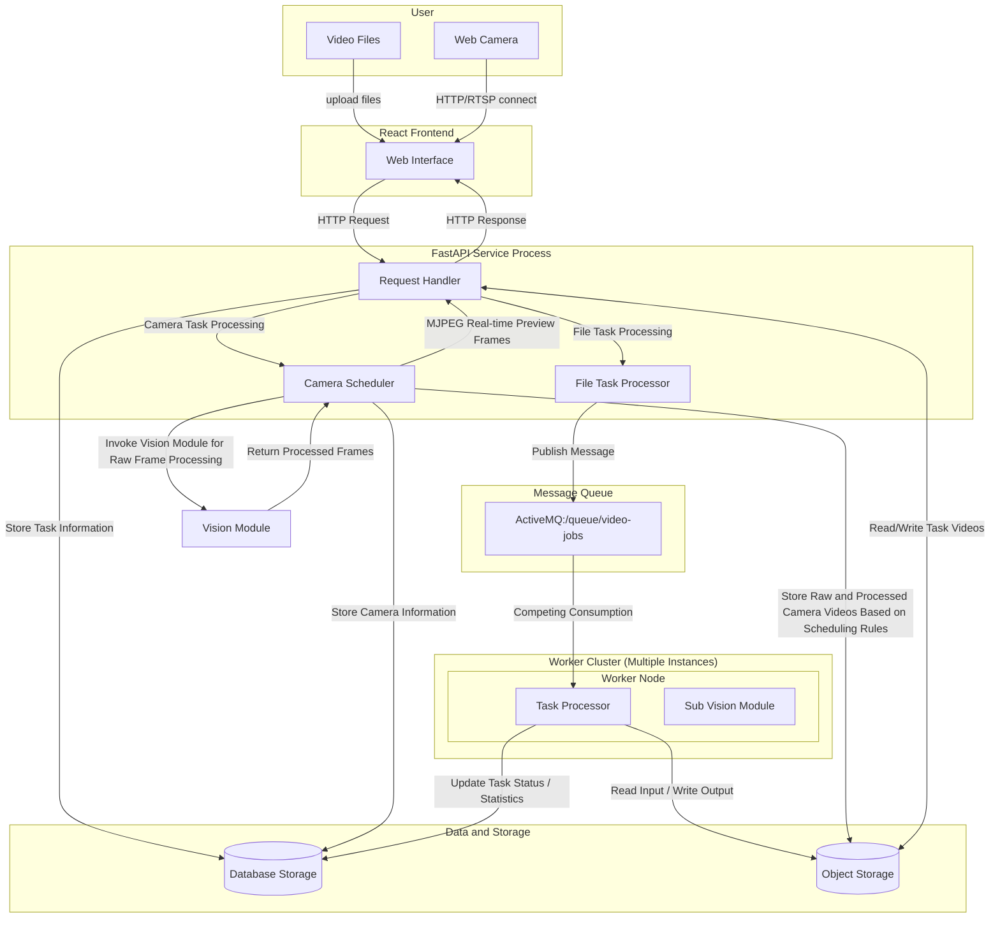
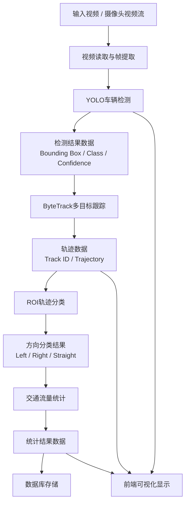
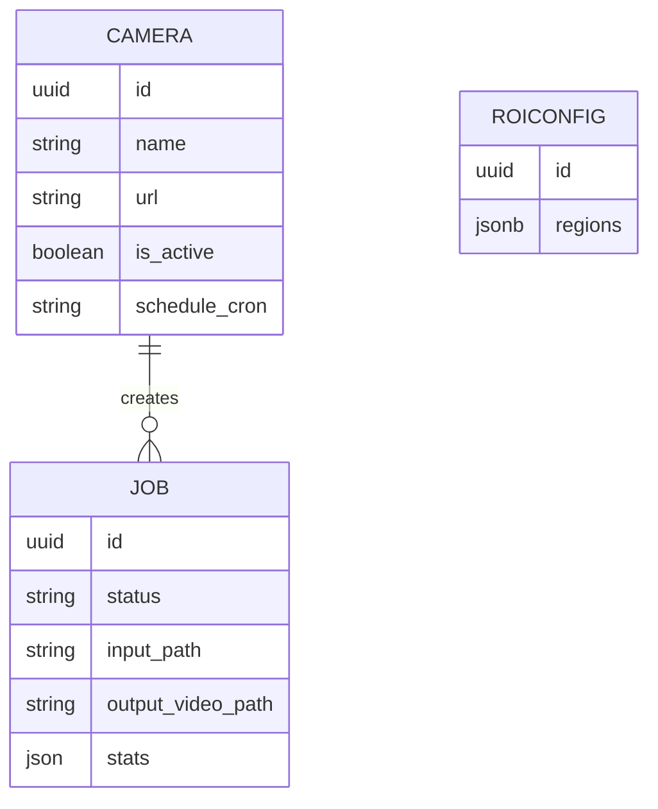

# Разработка приложения для детекции транспортных потоков с помощью компьютерного зрения

## Введение

随着全球城市化进程的加快以及汽车工业的持续发展，城市机动车保有量不断攀升，给城市道路交通系统带来的压力与日俱增。与此同时，城市道路路网的承载能力难以同步提升，导致道路交通拥堵日益频繁，尤其在交叉路口区域，车辆排队与拥堵问题尤为突出，已成为城市交通拥堵的主要诱因之一。据统计，城市路网中的交通拥堵大多集中在交叉路口附近，严重制约通行效率，加剧能源消耗，并对环境质量造成不利影响。在此背景下，路口车流量检测作为交通状态认知的重要组成部分，对实现自适应信号控制、缓解道路拥堵具有重要意义。传统的车流量检测方法主要依赖地磁线圈、红外/雷达传感器等设备，这些方法存在安装成本高、维护复杂、监测范围有限等不足。近年来，随着计算机视觉和深度学习技术的发展，基于道路监控视频的车辆检测与计数方法成为新的研究热点，通过目标检测算法和跟踪技术可以从视频中实时提取车辆位置信息和运动轨迹，获取更丰富的交通流数据，为路口交通状态分析提供可靠依据。

本研究的主要目标是基于道路监控视频信息，利用计算机视觉方法实现针对复杂交通场景下的自动化路口车流量检测。具体而言，通过构建车辆检测与跟踪算法框架，对多车道、不同光照和交通状态下的车辆视频进行分析，实现准确的车辆检测、跟踪和流量统计。研究旨在克服现有车流量检测方法的局限性，提高检测的准确性和实时性，并为后续信号灯自适应控制策略的设计提供高质量的数据支持。

本研究具有重要的理论与工程意义。一方面，该研究探索了基于视觉感知的车流量检测技术，有助于拓展智能交通系统在复杂交通场景下的数据感知能力，为交通科学研究提供新的方法参考。另一方面，该技术能够为交通管理部门提供更全面的交通数据采集和分析手段，有助于辅助城市智慧交通管理和决策，同时作为智慧城市建设的重要组成部分，为未来交通系统的智能优化和自动控制奠定技术基础。

为实现上述目标，本研究拟完成以下主要任务：

1. 开展交通流量检测相关背景调研，分析现有方法及其局限性；
2. 收集与整理路口交通视频数据，构建训练与测试数据集；
3. 设计并训练车辆检测与跟踪模型，确保多方向流量统计的准确性；
4. 完成车流量检测系统的程序设计与实现，包括数据处理、检测、跟踪和统计模块；
5. 对系统进行性能评估与测试，分析检测精度、实时性及适用性。

通过上述任务的完成，本论文将构建一套面向复杂路口场景的自动化车流量检测系统，为智慧交通管理提供数据支持，同时为未来进一步研究智能交通优化和信号灯自适应控制奠定基础。

## 1. ТЕОРЕТИЧЕСКИЙ ОБЗОР СИСТЕМЫ ДЕТЕКЦИИ ТРАНСПОРТНЫХ ПОТОКОВ И УПРАВЛЕНИЯ СВЕТОФОРАМИ

### 1.1 Актуальность исследования транспортных потоков

随着城市化进程的不断加快，城市人口和机动车数量呈现快速增长趋势。据统计，全球主要城市的机动车保有量在过去十年内平均增长了30%以上（United Nations, 2022）。大量机动车的增加使城市道路网络面临前所未有的压力，尤其是在交通路口和关键干道，常出现严重的交通拥堵现象。研究表明，交通拥堵不仅会降低道路通行效率，还会带来能源浪费、环境污染和经济损失等多重社会问题（Qadri et al., 2020）。

在城市交通系统中，交通路口是交通流交汇的关键节点。信号灯配时的不合理会导致车辆长时间等待、排队长度增加，从而严重降低路口的通行能力（Li et al., 2019）。此外，传统交通管理方法往往依赖人工观测或简单传感器，这些方法难以实现实时、动态的交通流监测，尤其是在多方向、复杂交通场景下存在明显局限性。

为了缓解交通拥堵，提高道路通行效率，获取精确、实时的交通流信息显得尤为重要。基于视频监控的交通流量检测方法，结合计算机视觉与深度学习技术，可以实现对车辆的自动检测、跟踪与计数，为信号灯优化配时和交通管理决策提供科学依据。这不仅能够弥补传统传感器在动态信息获取方面的不足，还为智慧城市下智能交通系统的发展提供了重要的数据支持（Manguri & Mohammed, 2023）。

综上所述，针对复杂交通路口的自动化交通流量检测研究具有重要的理论价值与实际应用意义。通过建立可靠的检测与分析系统，可以有效支撑交通管理部门进行数据收集与分析，为信号灯智能优化和城市道路交通调度提供基础支撑，从而改善城市交通环境，提高交通效率。

### 1.2 Обзор существующих методов детекции транспортных потоков

交通流量检测作为智能交通系统的重要组成部分，其研究与应用已有较长历史。根据技术手段的不同，现有方法主要可分为基于传感器的检测方法和基于计算机视觉的检测方法两类。

#### 1.2.1 基于传感器的交通流量检测方法

基于传感器的交通流量检测方法包括感应线圈检测、雷达检测、激光（LiDAR）检测以及红外检测等。

- 感应线圈检测是一种成熟的电磁感应技术，其通过埋设在路面下的导线线圈检测车辆对磁场的扰动，从而判断车辆存在及计算车流量、占有率和速度。该方法具有精度高、实时性强和对光照、天气不敏感的优点，但安装和维护成本高，信息维度有限，难以扩展至复杂多车道场景。

- 雷达检测利用多普勒效应，通过发射电磁波并接收反射信号，计算车辆的速度与位置，实现非接触式检测。雷达检测全天候、精度较高，但在车辆密集或遮挡严重情况下容易出现误检或漏检，同时难以获取车辆轨迹信息。

- 激光（LiDAR）检测通过测量激光脉冲的飞行时间获取车辆的距离和空间结构，可生成高精度的三维点云，实现精细化交通信息采集。该方法精度高，但成本昂贵，对恶劣天气敏感，且数据处理复杂。

- 红外传感器检测通过检测车辆热辐射或红外光反射判断车辆存在，结构简单且成本较低，但精度受光照、环境温度影响大，难以满足复杂场景下的高精度检测需求。

总体来看，基于传感器的交通流量检测方法在固定路口、高速公路等环境中具有可靠性和稳定性，但在多车道、复杂场景以及轨迹分析需求上存在局限性。

#### 1.2.2 基于计算机视觉的交通流量检测方法

随着计算机视觉技术的发展，基于视觉的交通流量检测方法逐渐成为研究热点。其核心优势在于非接触式检测、信息丰富且可扩展性强。

- 传统计算机视觉方法主要包括背景减除、光流法和轮廓/形态学分析等。背景减除法通过建立静态背景模型提取前景车辆，计算流量和占有率，但对光照变化敏感，遮挡严重时易漏检；光流法通过计算像素运动矢量捕捉车辆运动信息，但计算复杂度高，密集场景适应性差；轮廓分析方法适合低车流量场景，对复杂交通场景效果有限。

- 基于机器学习的方法如 HOG+SVM、Haar 特征 + Adaboost 等，通过人工设计特征提取车辆信息并进行分类，相较传统方法具有更强鲁棒性，但依赖特征设计且泛化能力有限。

针对上述问题，近年来基于深度学习的目标检测与多目标跟踪方法逐渐成为研究热点。本研究采用基于深度学习的交通流量检测方法，通过结合目标检测算法与多目标跟踪技术，实现对车辆的精确识别与连续跟踪。

具体而言，本研究采用目标检测算法 YOLO 对视频中的车辆进行检测，并结合多目标跟踪算法 ByteTrack 实现车辆在连续帧中的身份关联，从而获得稳定的车辆轨迹。在此基础上，通过流量统计算法（如虚拟检测线或区域统计）实现对不同方向车流量的自动化分析。

与传统方法相比，该方法具有以下优势：

- 检测精度高：深度学习模型能够自动提取多层次特征，提高对复杂背景的适应能力；
- 跟踪稳定性强：通过多目标跟踪算法保持车辆ID一致性，有效减少重复计数与漏计问题；
- 适应复杂场景：能够处理多车道、多方向以及高密度交通环境；
- 信息丰富：不仅可获取车流量，还可获得车辆轨迹及运动特征；
- 可扩展性强：可为后续交通信号优化和智能交通系统提供数据支持。

因此，基于深度学习的交通流量检测方法能够有效克服传统方法的不足，为复杂交通环境下的高精度流量分析提供可靠解决方案。

### 1.3 Технологический стек системы

#### 1.3.1 Языки программирования

为了实现基于深度学习的视频交通流量检测系统，本研究的软件系统对编程语言提出了特定要求。系统需要具备以下几个方面的能力：

- 高效的数据处理能力：交通视频数据量大，需要对视频帧进行实时读取、处理和分析，因此所选语言必须支持高效的矩阵运算、图像处理以及大规模数据处理功能。
- 丰富的计算机视觉与深度学习库支持：系统核心依赖YOLO目标检测算法和ByteTrack多目标跟踪算法，因此编程语言应具备成熟的深度学习框架（如PyTorch、TensorFlow）和计算机视觉库（如OpenCV）的支持，以方便模型训练、推理和结果可视化。
- 良好的可扩展性与跨平台性：考虑到系统可能部署于不同的服务器或嵌入式设备上，语言应支持跨平台运行，能够方便地与数据库、图形界面、网络通信模块以及流量统计模块进行集成。
- 开发效率与社区支持：交通流量检测涉及复杂算法的实现与调试，因此语言应具备高开发效率、良好的可读性，并拥有活跃的开发社区以便获取技术支持和开源资源。

综合考虑上述需求，本研究选择Python作为主要编程语言。

#### 1.3.2 Методы детекция транспортных средств

在交通流量检测系统中，多目标检测是实现车辆识别与后续跟踪分析的基础模块。系统需要在视频序列中对多个车辆目标进行实时检测，并输出其空间位置信息（如边界框）及类别信息。因此，本研究对目标检测技术提出如下要求：

高检测精度：能够准确识别不同类型车辆，并在复杂背景下保持较低的误检率和漏检率；
实时性要求高：系统需对视频流进行实时处理，因此检测算法应具备较高的推理速度；
鲁棒性强：在光照变化、遮挡以及多车道密集交通等复杂场景下仍能稳定工作；
良好的扩展性：能够方便地与后续多目标跟踪算法及流量统计模块进行集成。

在实际工程实现中，本研究采用计算机视觉库OpenCV与深度学习目标检测算法 YOLO 相结合的方式完成车辆检测任务。

OpenCV（Open Source Computer Vision Library）是一个开源计算机视觉库，提供了丰富的图像处理与视频处理功能，包括视频读取、图像预处理、目标框绘制以及结果可视化等。通过OpenCV，可以实现视频流的逐帧读取，并对检测结果进行实时显示和后处理操作，是连接深度学习模型与实际应用的重要工具。同时，OpenCV具备良好的跨平台能力，可在不同操作系统环境下稳定运行。

在目标检测算法方面，本研究选用YOLO（You Only Look Once）系列算法。YOLO是一种典型的单阶段目标检测方法，其核心思想是将目标检测问题转化为回归问题，通过单个神经网络直接预测图像中目标的位置和类别。相比于传统的两阶段检测算法（如Faster R-CNN），YOLO在保持较高检测精度的同时，显著提升了检测速度，能够满足实时处理的需求。

YOLO算法具有以下特点：

1. 检测速度快：单阶段结构避免了区域候选生成过程，适合实时视频处理；
2. 整体感知能力强：通过全图训练，能够利用上下文信息减少误检；
3. 适用于多目标检测：可同时检测图像中的多个目标，适合交通场景中多车辆检测；
4. 易于部署：模型结构统一，便于在不同平台上进行部署与优化。

在交通场景中，YOLO能够有效检测不同类型的车辆（如小汽车、卡车、公交车等），并在多车道、复杂背景下保持较高的检测性能。同时，其输出的边界框信息可以直接作为多目标跟踪算法的输入，实现后续的轨迹分析与流量统计。

综上所述，本研究选择OpenCV作为视频处理与系统集成工具，选择YOLO作为核心目标检测算法。该组合不仅能够满足实时性与精度的要求，还具备良好的工程实现能力，为后续多目标跟踪与交通流量分析提供了可靠基础。

#### 1.3.3 Методы отслеживания нескольких целей

在交通流量检测系统中，多目标检测仅能获取单帧图像中车辆的位置信息，而无法描述车辆在时间维度上的连续运动状态。因此，需要引入多目标轨迹追踪算法，对检测到的车辆进行跨帧关联，从而实现车辆身份的持续标识与运动轨迹的构建。该过程对于后续的车流量统计、路径分析以及交通行为研究具有重要意义。

针对交通场景，本研究对多目标轨迹追踪算法提出如下要求：

1. 身份一致性：在连续视频帧中保持同一车辆的唯一标识（ID），避免频繁发生ID切换；
2. 遮挡鲁棒性：在车辆发生部分或短时遮挡的情况下，仍能够正确恢复目标轨迹；
3. 实时处理能力：算法需具备较高的运行效率，以满足视频流实时处理需求；
4. 适应高密度场景：能够在多车道、车辆密集的复杂交通环境中稳定运行；
5. 与检测算法的兼容性：能够直接利用目标检测算法（如YOLO）输出的边界框结果进行关联。

为满足上述需求，本研究选用多目标跟踪算法 ByteTrack 进行车辆轨迹追踪。

ByteTrack是一种基于“检测结果关联”的多目标跟踪算法，其核心思想是在传统数据关联方法的基础上，充分利用检测结果中的高置信度与低置信度目标信息，从而提高跟踪的完整性与稳定性。该算法主要由以下几个关键步骤组成：

首先，在每一帧中，目标检测算法（如YOLO）输出一组带有置信度的目标边界框；
其次，ByteTrack将检测结果划分为高置信度目标与低置信度目标两部分；
然后，利用卡尔曼滤波预测目标在当前帧中的位置，并通过匈牙利算法实现目标之间的最优匹配；
最后，对于未匹配的低置信度检测结果，算法进一步尝试与已有轨迹进行关联，从而减少漏检带来的跟踪中断问题。

与传统多目标跟踪方法相比，ByteTrack在处理遮挡和检测不稳定问题方面具有显著优势。传统方法（如SORT）通常仅依赖高置信度检测结果进行关联，容易在目标被遮挡或检测置信度降低时丢失轨迹；而ByteTrack通过引入低置信度检测信息，有效提升了目标的持续跟踪能力。

此外，与基于外观特征的跟踪方法（如DeepSORT）相比，ByteTrack无需额外的特征提取网络，避免了高计算开销，在保证较高精度的同时显著提升了运行效率，更适用于实时交通流量检测场景。

综上所述，本研究选择ByteTrack作为多目标轨迹追踪算法。，以获得稳定的车辆轨迹信息，为后续交通流量统计与信号灯优化提供可靠的数据基础。

#### 1.3.4 Алгоритм классификации траекторий

在完成车辆检测与多目标跟踪后，系统能够获取车辆在连续视频帧中的位置信息以及完整运动轨迹。然而，仅获得车辆轨迹并不能直接满足交通流量统计需求。对于十字路口等复杂交通场景，交通管理部门通常更加关注不同方向的车辆通行数量，例如直行车辆数量、左转车辆数量以及右转车辆数量。因此，系统需要进一步对车辆轨迹进行分类，并统计不同方向的交通流量。

基于上述需求，本研究对轨迹分类算法提出以下要求：

1. 能够适应多方向交通场景：路口通常存在多个入口与出口方向，车辆可能具有直行、左转、右转等多种运动路径，算法需要能够适应不同类型与方向的的路口。
2. 较低计算复杂度：轨迹分类模块需要与目标检测和目标跟踪模块协同运行，因此算法不能具有过高的计算复杂度，以保证系统整体的实时处理能力。
3. 结果可解释性：分类结果应具备良好的可解释性

综合考虑系统实时性、可扩展性以及工程实现难度，本研究采用基于用户自定义感兴趣区域（Region of Interest, ROI）的方法进行轨迹分类与流量统计。

该方法的核心思想是在交通监控画面中，由用户根据实际路口结构手动划定多个ROI区域，用于表示不同的车辆通行方向。例如东、西、南、北，系统通过分析车辆轨迹与ROI区域之间的空间关系，判断车辆的运动方向。当车辆轨迹进入指定ROI区域并完成通行后，系统将其归类到对应方向，并更新交通流量统计结果。

尽管该方法在复杂交通行为识别方面存在一定局限性，用户手动绘制的ROI区域无法解决对于摄像机画面移动的情况，但对于本研究所关注的十字路口多方向车流量检测任务而言，基于用户自定义ROI的轨迹分类方法能够在准确性、实时性与工程可实施性之间取得较好的平衡。

### 1.4 Вывод

本章对交通流量检测系统的相关理论基础、现有研究方法以及系统技术栈进行了分析。

首先，结合城市交通拥堵问题的发展现状，分析了交通流量检测在智能交通系统中的重要作用，并说明了复杂路口场景下自动化交通流量统计的现实需求。

其次，对现有交通流量检测方法进行了综述。研究表明，传统基于传感器的检测方法虽然具有较高的稳定性，但存在设备部署成本高、维护困难以及信息维度有限等问题；传统计算机视觉方法和基于机器学习的方法虽然降低了硬件成本，但在复杂交通环境下仍然存在检测精度不足、鲁棒性较差以及难以处理多目标遮挡等问题。

随后，针对本研究的系统需求，对相关技术栈进行了分析与选择。在编程语言方面，选择Python作为系统开发语言，以满足快速开发和丰富算法库支持的需求；在目标检测方面，选择OpenCV作为视频处理工具，并采用YOLO算法实现高精度实时车辆检测；在多目标跟踪方面，采用ByteTrack算法实现车辆身份关联与轨迹生成；在轨迹分类与流量统计方面，采用基于用户自定义ROI的方法实现多方向交通流量统计。

综合分析表明，基于深度学习的交通流量检测方案能够有效克服传统方法在复杂交通场景中的局限性，并能够满足本研究对实时性、准确性和可扩展性的要求。

因此，本文最终确定采用基于 Python、OpenCV、YOLO、ByteTrack以及ROI流量统计方法 的技术方案，为后续系统设计、功能实现以及实验测试奠定了理论基础和技术基础。
 
## 2. ТРЕБОВАНИЯ К СИСТЕМЕ ДЕТЕКЦИИ ТРАНСПОРТНЫХ ПОТОКОВ

在完成交通流量检测相关理论研究与技术选型分析后，为保证系统能够满足复杂交通场景下的实际应用需求，需要进一步明确系统应具备的功能以及性能要求。本章将从功能需求和非功能需求两个方面对基于计算机视觉的交通流量检测系统进行分析，为后续系统设计与实现提供依据。

### 2.1 Функциональные требования

功能需求用于描述系统必须实现的核心业务功能。结合本研究的应用场景，系统主要面向城市十字路口交通监控视频，实现车辆检测、跟踪、轨迹分类以及流量统计等功能。因此，本系统应具备以下功能模块。

1. 视频输入功能

系统应能够接收交通监控视频作为输入数据源，并支持对视频进行读取与解析。为了适应不同的数据来源，系统应支持常见视频格式（如 MP4、AVI 等），并能够按照帧的形式对视频数据进行处理，为后续目标检测模块提供输入。

2. 车辆目标检测功能

系统应能够对视频中的车辆目标进行自动识别，并输出车辆的位置与类别信息。系统需要能够识别常见交通参与车辆类型，例如小型汽车、公交车、卡车和摩托车等，并通过边界框的形式标记车辆位置，为后续目标跟踪提供检测结果。

3. 多目标跟踪功能

由于车辆会在连续视频帧中持续移动，系统需要具备多目标跟踪功能。该模块应能够为每辆车辆分配唯一标识符，并在连续帧中保持身份一致性，从而生成完整的车辆运动轨迹。

4. ROI区域配置功能

不同路口的道路结构和车辆通行方向存在差异，因此系统应允许用户根据实际场景自定义感兴趣区域（Region of Interest, ROI）。用户可以根据道路结构划定不同的区域，用于表示不同的车辆行驶方向。

5. 轨迹分类功能

系统应能够根据车辆轨迹与ROI区域之间的关系，对车辆行驶方向进行分类，例如左转、右转和直行等。该功能能够为后续交通流量统计提供方向信息支持。

6. 交通流量统计功能

系统应能够对不同方向的车辆数量进行自动统计，并避免同一车辆被重复计数。统计结果应包括总体车流量以及各方向的车流量数据。

7. 结果可视化功能

为了便于用户观察系统运行结果，系统应能够将检测框、目标轨迹以及流量统计结果实时显示在视频画面中，提高系统的可解释性和可用性。

综上所述，本系统需要完成从视频输入、目标检测、多目标跟踪到轨迹分类与流量统计的完整业务流程，实现复杂交通场景下的自动化车流量分析。

### 2.2 Нефункциональные требования

除核心业务功能外，交通流量检测系统还需要满足系统性能、稳定性以及用户体验等方面的要求。非功能需求直接影响系统在实际交通场景中的应用效果，因此本研究从处理速度、检测准确性、系统稳定性、环境适应能力以及系统易用性等方面对系统进行分析。

#### 2.2.1 Скорость

交通流量检测系统需要对交通监控视频进行连续分析，因此系统应具备较高的数据处理效率，以满足实时或准实时交通分析需求。

在系统运行过程中，需要同时完成视频读取、车辆检测、多目标跟踪以及流量统计的等多个任务，需要尽可能降低单帧处理延迟，确保目标检测算法应能够快速完成车辆识别，多目标跟踪算法应能够在连续帧之间快速完成目标匹配，以保证系统整体运行效率。

此外，系统还应具备良好的资源利用能力，能够在普通GPU或高性能CPU环境下稳定运行，以降低系统部署成本。

#### 2.2.2 Точность

交通流量统计结果的准确性是系统性能的重要评价指标，直接影响系统输出结果的可靠性。

首席按，系统需要保证目标检测模块结果具有较高准确率，尽可能减少误检和漏检现象；同时，多目标跟踪模块应能够保持车辆身份的连续性，避免由于目标ID丢失导致重复计数或统计错误。；并且，在轨迹分类与流量统计过程中，系统还需要准确判断车辆运动方向，并正确统计不同方向的交通流量，以保证交通数据分析结果的有效性。

高准确性是系统后续用于交通流量分析以及交通信号管理决策优化的重要前提。

#### 2.2.3 Стабильность

交通流量检测系统通常需要长时间连续运行，因此系统需要具备长期稳定运行能力，以适应实际交通监控场景中的持续工作需求。

在长时间视频处理过程中，系统应避免出现如程序崩溃,内存泄漏,视频读取异常,模型推理中断等问题

当输入视频存在异常帧或部分数据缺失时，系统应能够继续运行或进行异常处理，保证整体任务能够顺利完成。

此外，系统各模块之间应具备良好的协同能力，确保视频处理、目标检测、目标跟踪以及流量统计流程能够稳定运行。

#### 2.2.4 Устойчивость

由于实际交通环境通常较为复杂，因此系统需要具备较强的环境适应能力与鲁棒性。

在实际应用中，交通监控视频可能存在分辨率变化、帧率波动以及短时数据异常等情况。系统应能够在不同输入条件下保持正常运行，避免出现程序崩溃或检测中断的问题。

并且，交通监控场景中可能存在车辆遮挡、光照变化、阴影干扰以及交通密度变化等问题，这些因素都会对目标检测与跟踪结果产生影响。因此，系统应能够在复杂交通场景下保持较好的检测性能，并尽可能降低环境因素对系统结果的影响。

此外，系统还应能够适应不同道路结构与摄像头视角，通过用户自定义ROI区域的方式提高系统在不同场景下的适用性。

#### 2.2.5 Удобство

为了提高系统的实际应用价值，系统应具备良好的用户交互体验。

用户应能够方便地完成视频导入、ROI区域配置以及系统运行等操作。同时，系统应能够直观显示车辆检测框、运动轨迹以及流量统计结果，便于用户观察和分析交通状态。

此外系统界面应尽可能简单直观，使用户无需具备复杂的技术背景即可完成基本操作。

良好的易用性能够降低系统部署和使用成本，提高系统的实际推广价值。

### 2.3 Вывод

本章对交通流量检测系统的需求进行了分析，并从功能需求和非功能需求两个方面明确了系统设计目标。

在功能需求方面，系统需要实现视频输入、车辆检测、多目标跟踪、轨迹分类、流量统计以及结果可视化等核心功能，形成完整的交通流量分析流程。

在非功能需求方面，系统需要满足处理速度、检测准确性、运行稳定性、环境鲁棒性以及用户易用性等方面的要求，以保证系统能够在实际交通场景中稳定运行。

综合需求分析结果可知，交通流量检测系统不仅需要具备较高的算法性能，还需要具备良好的工程可实施性和实际应用能力。

基于上述需求分析，下一章将进一步对系统的整体架构、核心模块以及具体实现方案进行设计与说明，为系统开发提供技术基础。

## 3 ПРОЕКТИРОВАНИЕ И РЕАЛИЗАЦИЯ СИСТЕМЫ

### 3.1 Проектирование системы

#### 3.1.1 Архитектура системы

为实现复杂交通场景下的自动化车流量检测与分析，本研究采用模块化设计思想，对系统进行分层架构设计。系统整体由前端模块（Frontend）、后端模块（Backend）、视觉分析模块（Vision Module）以及数据存储模块（Data Storage）四部分组成。各模块之间通过接口进行通信与数据交互，共同完成视频采集、车辆检测、多目标跟踪、轨迹分类以及交通流量统计等功能。


系统总体架构组成如图3-1所示，包含以下模块：

1. 前端模块（Frontend）

前端模块主要负责用户交互与结果展示，是系统与用户之间的主要交互接口。该模块主要包括以下功能：

- 视频上传（Upload Video）：用户可上传本地交通监控视频作为系统输入，用于离线交通流量分析。
- 网络摄像头接入（Network Cam）：系统支持通过HTTP或RTSP协议接入网络摄像头，实现实时交通视频采集。
- 数据可视化界面（Dashboard Display）：系统能够实时显示车辆检测结果、目标轨迹以及交通流量统计信息，便于用户观察交通运行状态。

前端模块通过HTTP接口与后端模块进行通信，并接收后端返回的检测结果与统计数据。

2. 后端模块（Backend）

后端模块是系统的核心控制部分，主要负责业务逻辑处理、任务调度以及系统通信。

本研究采用Python结合FastAPI框架实现后端服务。FastAPI具有轻量化、高性能以及良好的异步处理能力，能够满足视频分析系统对高并发与实时性的需求。

后端模块主要包括以下组件：

- Python + FastAPI：负责系统接口管理、任务控制以及前后端通信。
- 消息队列（Message Queue）：由于交通视频分析任务具有较高计算开销，系统采用异步分布式处理方式，通过消息队列实现任务解耦与异步执行，提高系统吞吐能力。
- 任务调度器（Task Scheduler）：用于管理视频分析任务与交通视频录制任务，实现定时任务调度与任务状态管理。

后端模块负责协调视觉分析模块与数据存储模块之间的数据交互，并控制整个系统的运行流程。

3. 视觉分析模块（Vision Module）

视觉分析模块是本研究交通流量检测系统的核心功能模块，负责完成交通视频中的车辆检测、目标跟踪以及交通流量分析。

该模块主要包括以下功能：

- 车辆检测（Vehicle Detection）：系统采用YOLO目标检测算法对交通视频中的车辆进行识别，并输出车辆边界框与类别信息。
- 多目标跟踪（Multi-Object Tracking）：系统采用ByteTrack算法对车辆进行连续跟踪，为每个目标分配唯一ID，并生成车辆运动轨迹。
- 方向分析与交通统计（Direction & Traffic Analysis）：系统基于车辆轨迹与用户定义ROI区域之间的关系，对车辆行驶方向进行分类，并完成交通流量统计。

视觉分析模块能够实现复杂交通场景下的自动化交通分析，并为后续交通管理与信号灯优化提供数据支持。

4. 数据存储模块（Data Storage）

数据存储模块主要负责系统运行过程中相关数据的保存与管理。

系统采用分层数据存储方式，包括：

- PostgreSQL数据库：用于存储车辆检测结果、轨迹数据以及交通统计结果等结构化数据。
- 对象存储（Object Storage）：用于保存交通监控视频文件以及分析结果视频等非结构化数据。

通过数据分离存储方式，可以提高系统的数据管理能力与后续数据分析能力。

在上述系统总体模块内容的基础上，为进一步说明系统内部各模块之间的数据交互与协同工作关系，本研究设计了系统运行流程架构，如图3-2所示。



在系统运行过程中，用户可通过前端模块上传本地交通监控视频，或接入网络摄像头视频流（HTTP/RTSP）。视频数据随后传输至后端模块，由后端完成任务调度与异步处理，并将视频数据发送至视觉分析模块进行交通目标分析。分析完成后，系统将检测结果与统计数据保存至数据存储模块，并最终通过前端界面向用户展示交通流量分析结果。

#### 3.1.2 Диаграммы последовательности

为进一步描述系统内部各模块之间的交互流程，本研究采用时序图（Sequence Diagram）对系统运行过程中的消息传递、任务调度以及数据流转过程进行建模。系统主要包含两类核心工作流程：基于本地视频文件的离线交通分析流程，以及基于网络摄像头的视频流实时分析流程。

通过时序图可以清晰展示用户、前端系统、后端服务、消息队列、Worker节点以及数据存储模块之间的协同关系，从而进一步说明系统的运行机制。

（1）视频上传分析流程

视频上传分析流程主要用于处理用户上传的本地交通监控视频。系统通过异步任务处理机制，实现视频分析任务的解耦与分布式执行，其流程如图3-3所示。

在该流程中，用户首先通过React前端上传交通监控视频。前端随后向FastAPI后端发送HTTP请求，请求创建新的交通分析任务。

后端接收到请求后，会首先将原始视频文件保存至本地存储系统，并在PostgreSQL数据库中创建任务记录，任务初始状态设置为“created”。随后，后端将任务信息（包括任务ID与视频路径）发送至ActiveMQ消息队列。

系统中的Worker节点会持续监听消息队列，并通过竞争消费机制获取待处理任务。当某个Worker获取任务后，会将任务状态更新为“running”，随后从存储系统读取输入视频，并调用视觉分析模块执行车辆检测、多目标跟踪以及交通流量统计等操作。

视觉分析完成后，Worker会生成处理后的视频结果，并将结果视频转码为浏览器兼容的MP4格式。同时，系统会将交通统计结果与任务状态写入数据库。

在任务执行过程中，前端会周期性调用后端接口查询任务状态、统计结果以及输出视频。当任务完成后，后端将处理结果返回给前端界面进行展示。

该设计通过消息队列实现任务异步化处理，从而避免长时间视频分析任务阻塞Web服务，提高系统整体并发能力与稳定性。

（2）实时摄像头分析流程

除离线视频分析外，系统还支持基于网络摄像头的视频流定时分析。该流程主要用于持续交通监控与实时交通流量统计，其运行流程如图3-4所示。

在定时分析模式下，用户首先通过前端界面启动网络摄像头。后端系统接收到请求后，会将摄像头状态更新为“active”，并启动摄像头调度器。

调度器会根据预设规则周期性创建交通分析任务，并异步录制摄像头视频流。录制得到的原始视频文件会保存至本地存储系统，同时任务信息会发送至消息队列。

随后，Worker节点从消息队列中获取待处理任务，并执行交通视频分析流程，包括车辆检测、多目标跟踪以及交通流量统计等操作。分析结果最终保存至数据库与本地存储系统。

与此同时，前端会周期性向后端请求任务状态与统计结果，实现交通分析结果的实时展示。

当用户停止摄像头任务时，后端会将摄像头状态更新为“inactive”，并停止调度器继续创建新的分析任务。

相比传统同步处理方式，本研究引入了基于消息队列与分布式Worker节点的异步机制，能够有效提高交通视频处理效率，并支持多个交通监控任务的并发运行，从而满足复杂交通场景下的大规模交通流量分析需求。

#### 3.1.3 Поток данных

为进一步描述交通流量检测系统内部的数据处理过程，本研究对系统的数据流与数据存储结构进行分析。数据流设计主要用于描述数据在系统各模块之间的传递、处理与转换过程，而数据存储设计则用于描述系统如何对交通分析过程中产生的数据进行持久化管理。

本系统的数据处理流程主要包括视频输入、视频帧提取、车辆检测、多目标跟踪、ROI轨迹分类、交通流量统计以及结果输出等阶段。系统首先接收用户上传的视频文件或网络摄像头视频流，并通过OpenCV提取视频帧；随后利用YOLO算法完成车辆检测，使用ByteTrack算法实现多目标跟踪与轨迹生成；在此基础上，系统结合用户定义的ROI区域对车辆运动方向进行分类，并完成交通流量统计；最终，分析结果保存至数据库与本地存储系统，并通过前端界面进行可视化展示。系统整体数据流如图3-5所示。



为持久化保存程序运行产生的各类数据，系统采用PostgreSQL作为系统数据库交通分析任务、摄像头配置以及ROI区域配置等结构化数据，使用服务器本地化存储视频文件数据。

其中系统数据库主要包含以下数据表，实体关系如图3-7所示：



其中，Job 数据表用于保存交通分析任务相关信息，包括任务状态、输入输出视频路径、任务执行时间以及交通统计结果等。其中，统计结果采用JSON格式存储，以便保存不同方向的动态交通统计数据。

Camera 数据表用于保存网络摄像头配置与调度信息，包括摄像头地址、运行状态以及定时录制规则。系统通过Cron表达式实现定时交通视频录制任务调度。

RoiConfig 数据表用于保存用户绘制的ROI区域配置。由于ROI区域属于动态多边形结构，不同区域可能包含不同数量的顶点，因此本研究采用PostgreSQL中的JSONB类型存储区域坐标数据，从而提高系统对复杂ROI结构的适应能力。

通过上述数据流与数据存储设计，系统能够实现从原始交通视频输入到交通流量统计结果输出的完整自动化处理流程，并保证各模块之间的数据传输与存储过程具有良好的协同性、稳定性与可扩展性。

### 3.2 Реализация системы

本章旨在对系统的实现过程进行规范化描述。

本章在第三章系统设计的基础上，进一步给出系统在工程层面的落地实现。系统围绕“路口视频获取—车辆检测—多目标跟踪—轨迹语义分类—流量统计与可视化展示”的处理链路展开，通过前后端分离与异步任务机制将高计算量的视频分析与 Web 交互解耦：前端负责任务创建、视频预览、ROI 标注与统计展示；后端负责视频文件管理、任务生命周期管理、调度与接口服务；视觉模块负责逐帧推理、轨迹生成与结果视频输出；消息队列用于在 Web 服务与视觉计算之间传递任务，实现多实例 Worker 的竞争消费与横向扩展。最终实现面向十字路口的多方向交通流分析系统

#### 3.2.1 Реализация обработки видео

视频处理是整个系统的数据输入和预处理环节，负责从不同来源获取视频数据并进行标准化处理。系统支持两种视频输入方式：

系统支持两种视频输入方式：
1. 用户在浏览器端上传本地视频文件；
2. 其二为用户配置网络摄像头后，由后端调度器按设定的 Cron 规则定时采集视频片段。

两种输入方式在“进入视觉分析前”的处理目标一致，即将视频统一落地为本地 MP4 文件，并为后续逐帧处理提供稳定、可随机访问的数据源，从而避免直接在 Web 请求生命周期内进行长耗时推理。

对于本地视频上传方式，后端通过 /api/jobs 接口接收 multipart/form-data 视频文件，先将原始文件保存至本地输入目录，再在数据库中创建任务记录并将任务投递到消息队列。该过程的核心在于将“文件上传成功”与“视频分析完成”解耦：上传请求只负责落盘与入队，实际推理由后台 Worker 异步完成，从而保证接口响应及时且系统可扩展（实现见 `main.py:create_job` ）。

对于摄像头调度采集方式，后端在 scheduler.py 中基于 APScheduler 创建后台调度器，按 schedule_cron 触发录制任务。录制过程中系统使用 OpenCV VideoCapture 拉流，按录制时长计算目标帧数并写入本地临时视频文件，录制结束后将该片段同样作为标准任务入队处理（实现见 scheduler.py:execute_camera_recording 与 scheduler.py:_record_stream_clip ）。这种实现使两种输入方式在后续视觉模块中完全复用同一条流水线：只要产生“输入视频文件路径”，就可进入统一的逐帧检测与跟踪流程。

在视频分析阶段，系统采用“逐帧读取—推理—叠加绘制—写入结果视频—汇总统计”的典型流水线。视频读取与写入由 VideoHandler 对 OpenCV 的 VideoCapture/VideoWriter 进行封装，便于统一获取视频分辨率、帧率与总帧数，并提供 read_frame()/write_frame() 的简化接口（见 video_handler.py ）。视频逐帧处理入口为 process_video() ，其内部循环持续读取帧图像、调用检测跟踪器获取本帧结果，并将检测框与轨迹信息绘制后写入输出视频，同时累积统计信息（见 pipeline.py:process_video ）。

同时，为保证生成视频能够在不同浏览器中稳定播放，系统在输出阶段引入了统一转码步骤。实践中不同浏览器对 MP4 封装与编码参数的兼容性存在差异，尤其在 H.264 编码配置不一致或 moov 元数据不在文件头部时可能出现“无法播放/无法拖动进度条”等问题。为此，系统在写入临时视频后调用 FFmpeg 将结果转码为 H.264，并开启 faststart 将元数据前置，以提升在线播放兼容性（实现见 pipeline.py:transcode_video ）。同样地，摄像头录制片段也在录制结束后执行一次转码（见 scheduler.py:_record_stream_clip ），从源头减少后续处理链路的编解码不确定性。

#### 3.2.2 Детекция транспортных средств

系统的车辆检测采用 YOLOv8 方法实现。YOLO（You Only Look Once）系列属于单阶段检测器，将目标定位与类别预测统一在一个前向推理过程中完成，具有推理速度快、端到端部署便利等特点。YOLOv8 在工程实现上通常包含主干网络（Backbone）用于特征提取，颈部网络（Neck）用于多尺度特征融合，以及检测头（Head）输出不同尺度上的边界框回归与分类概率。对于路口场景，车辆目标在尺度上变化明显（远处小车与近处大车同时存在），多尺度检测能力对提升整体召回率具有关键作用。

YOLOv8 提供多种模型规模以适配不同算力与精度需求。常见规格包括 yolov8n/s/m/l/x ，其区别主要体现在网络宽度/深度与参数量：模型越大，通常精度更高但推理耗时与显存占用也更大。路口车辆识别属于“相对密集目标 + 需要较稳定的跨帧跟踪”的场景，模型选择往往需要在实时性与精度之间折中。本项目实际采用 yolov8m.pt （见 config.py ），在具备 GPU 的部署环境下能提供更稳健的检测质量，同时仍具有可接受的处理速度。若部署环境仅有 CPU 或需要更高实时性，可将模型替换为 yolov8s.pt 或 yolov8n.pt 以降低单帧推理开销。

[表3-1 YOLOv8 不同规模模型对比（占位）]表注：列出 n/s/m/l/x 的相对参数量、速度与精度趋势，并给出本系统在路口场景下的选型依据（建议以官方 COCO 指标或实验测得指标为参考填写）。

在工程实现上，系统将检测能力封装为 VehicleDetector 类，统一管理设备选择、半精度推理、输入尺寸与阈值配置等推理细节（见 detector.py:VehicleDetector ）。同时，为减少重复加载模型带来的额外开销，Worker 进程启动时会进行模型预热并将检测器实例缓存为全局对象，后续任务复用该实例，从而提升任务吞吐（见 worker.py ）。

下列代码展示了检测器的核心调用方式：系统通过设置 conf 与 iou 控制低置信度误检与非极大值抑制强度，并通过 classes 仅关注车辆相关类别。本项目默认类别列表为 [2, 3, 5, 7] （COCO 中分别对应 car、motorcycle、bus、truck），从而将检测范围聚焦于交通参与者，提高统计结果的针对性（见 config.py ）。

```python
# 文件：backend/vision/detector.py（核心接口节选）
def detect(self, frame, conf=0.5, iou=0.5, classes=None):
    kwargs = {
        "conf": conf,
        "iou": iou,
        "classes": classes,
        "device": self.device,
        "half": self.half,
        "imgsz": self.imgsz,
        "verbose": False,
    }
    return self.model(frame, **kwargs)
```

为了保证多 Worker 并发时模型文件的可用性，系统在启动阶段通过文件锁机制保护模型加载与下载过程，并对常见模型文件缺失、损坏异常进行检测与恢复（实现见 detector.py:ensure_model_available ）。该设计提升了在多进程、多实例部署场景下的稳定性。

在检测效果评估方面，本文建议采用“定量指标 + 定性可视化”的组合方式：定量部分可通过抽取测试视频中的若干关键帧进行人工标注，计算 Precision、Recall 与 F1；或以车辆计数为目标，统计“人工计数 vs 系统计数”的误差率。定性部分则展示典型场景（遮挡、逆光、密集车流、小目标远距车辆）下的检测框效果，用于分析误检/漏检原因。

[图3-3 车辆检测结果示例（占位）]图注：测试视频中典型帧的检测结果截图，展示车辆边界框与类别标签。
[表3-2 车辆检测效果评估（占位）]表注：在测试集/样例视频上统计 Precision、Recall、F1 或计数误差率，并讨论误差来源（遮挡、运动模糊、光照变化等）。

#### 3.2.3 Отслеживание транспортных средств

在取得视频帧的车辆检测结果后，系统引入多目标跟踪（MOT）模块，将连续帧中的同一车辆关联起来并赋予稳定的 track_id 。本项目采用 ByteTrack 跟踪算法，其核心思想是在每帧检测结果基础上进行数据关联：首先利用高置信度检测框进行匹配以获得稳定关联，再利用低置信度检测框补充被遮挡或置信度较低但真实存在的目标，从而在复杂场景中保持更高的轨迹连续性。与仅使用高置信度框关联的策略相比，该方法在密集交通与遮挡场景下更不容易产生轨迹断裂或 ID Switch。

工程实现上，系统直接使用 YOLOv8 提供的 track() 接口并指定 tracker="bytetrack.yaml" ，在推理时同时获得检测框与跟踪 ID。 persist=True 的配置使得跟踪状态在连续帧中保持，从而可在视频分析循环中连续生成轨迹序列（见 detector.py:track ）。在结果视频可视化方面，系统通过 Visualizer 维护每个 track_id 的中心点队列，并在输出帧上绘制轨迹折线，用于直观验证跟踪效果（见 visualizer.py ）。

下列代码体现了本项目“检测-跟踪一体化调用”的关键入口，即在逐帧处理时调用 detector.track() 获取含 ID 的结果，并将其用于统计与可视化（节选自 pipeline.py ）：

```python
# 文件：backend/vision/pipeline.py（核心调用节选）
results = detector.track(
    frame,
    conf=conf,
    iou=iou,
    classes=classes,
    persist=persist,
    tracker=tracker,
)
annotated_frame = visualizer.draw_detections(frame, results)
video_handler.write_frame(annotated_frame)
```

跟踪效果的展示建议同样采用“定性截图 + 定量统计”的方式：定性部分可选取车辆交汇与遮挡明显的片段，展示同一车辆跨帧 ID 的一致性；定量部分可统计轨迹断裂次数、ID Switch 次数或有效轨迹长度分布，用于说明算法在路口场景下的稳定性。

[图3-4 车辆跟踪轨迹可视化示例（占位）]图注：同一车辆在连续帧中保持一致的跟踪 ID，轨迹线连续；遮挡结束后仍可恢复跟踪的典型案例说明。
[表3-3 跟踪效果统计（占位）]表注：统计轨迹断裂次数、ID Switch 或平均轨迹长度等，用于量化跟踪稳定性。

#### 3.2.4 Классификация траекторий и подсчёт трафика

系统的流量统计分为两个层次：后端生成“可复用、可落库”的轨迹与计数基础数据，前端基于用户定义的 ROI 对轨迹进行语义分类并完成分方向统计展示。这样的分层设计一方面降低了后端计算复杂度（避免与场景强绑定的规则频繁变更），另一方面使得用户能够在不同路口、不同摄像机视角下通过重新绘制 ROI 快速得到新的分类统计结果。

在后端统计层面，系统利用跟踪 ID 实现唯一车辆计数：对每个 class_id 维护一个 set(track_id) ，视频结束时集合大小即为该类别的“唯一目标数”，从而避免同一车辆在多帧重复计数。与此同时，为支持前端轨迹可视化与分类计算，系统将每个目标的中心点轨迹按固定步长采样并设置最大点数上限，以控制存储开销与前端渲染压力（采样逻辑见 pipeline.py:_append_trajectory_point ）。最终统计结果以 JSON 形式写入任务 job.stats 并通过 /api/jobs/{job_id}/stats 提供查询（见 worker.py 与 main.py:get_job_stats ）。

在前端分类层面，系统提供 ROI（多边形区域）绘制与编辑界面，并以“点是否落入 ROI”作为轨迹事件判定依据。对于每条轨迹，系统遍历其采样点序列，并对每个 ROI 维护进入/离开状态：当轨迹点从 ROI 外部首次进入 ROI 时记录 enter 事件，并将该 ROI 名称加入进入序列；最终以进入序列拼接得到该轨迹的路径标签，例如 ROI_W→ROI_E 。若轨迹未进入任何 ROI，则标记为“未分类”。该分类逻辑集中实现于前端统计组件 TrafficStats.js ，其中点在多边形内判断函数为分类的几何基础（见 TrafficStats.js ）。下列代码节选展示了分类过程中“进入事件与进入顺序”的核心思想（仅保留关键部分）：

```javascript
// 文件：frontend/src/components/TrafficStats.js（轨迹分类核心节选）
for (const [frame, x, y] of points) {
  for (let ri = 0; ri < rois.length; ri++) {
    const inside = pointInPolygon(x, y, rois[ri].points);
    if (!roiStates[ri] && inside) {
      if (!entered.has(rois[ri].name)) enterOrder.push(rois[ri].name);
      entered.add(rois[ri].name);
    }
    roiStates[ri] = inside;
  }
}
const label = enterOrder.length ? enterOrder.join('→') : t('roi.unclassified');
```

ROI 的管理逻辑与任务绑定：每个任务拥有独立的 ROI 配置，可从摄像头默认 ROI 克隆得到初始区域，从而减少用户重复标注成本。后端对 ROI 名称合法性（字母/数字/下划线）与点集合法性（至少 3 点）进行校验，并将 ROI 列表以 JSON 存储在 roi_configs.regions 字段中（见 models.py:RoiConfig 以及 main.py:_validate_roi_name/_validate_roi_points ）。前端通过 /api/rois 完成 ROI 的增删改查，并在统计页面中即时反映 ROI 的变化，完成“标注—分类—统计”闭环（接口封装见 api/index.js ）。

在统计展示方面，前端按轨迹标签聚合计数生成柱状图与饼图，并支持隐藏某些类别进行对比分析，便于用户从不同角度理解路口通行结构与车流分布（实现见 TrafficStats.js:flowData ）。

[图3-5 ROI 绘制与管理界面（占位）]
图注：用户在视频帧上绘制多边形 ROI，并进行命名、编辑与删除操作；界面同时显示轨迹叠加效果。
[图3-6 轨迹分类与流量统计展示（占位）]
图注：按 ROI_A→ROI_B 等路径标签统计车辆数，并以柱状图/饼图展示分布。
[表3-4 分类统计结果（占位）]
表注：列出若干主要路径类别的车辆计数，并与人工统计或预期通行方向进行对比分析。

#### 3.2.5 Реализация бэкэнда

后端采用 FastAPI 构建统一 API 服务进程，并以“应用层（app）—视觉层（vision）—Worker（worker）”的目录结构组织代码，使接口逻辑、调度与推理模块边界清晰。项目后端目录结构如下： backend/app 存放数据库、接口与调度逻辑； backend/vision 存放检测器、视频处理流水线、可视化与编解码工具； backend/worker 存放消息队列消费者与任务处理入口（目录结构见 backend ）。

在应用生命周期管理方面，后端在启动阶段自动创建数据库表结构，并对 PostgreSQL 枚举类型与 ROI 配置表进行兼容性处理，确保在不同部署环境下均能完成初始化；同时启动摄像头调度器，以加载已启用摄像头的定时任务（见 main.py:lifespan ）。该实现对应系统设计阶段的数据流与部署流程，使“服务启动即恢复任务调度”成为可重复的运行特性。

后端 API 设计遵循资源化思路，围绕三类核心资源展开：任务（jobs）、摄像头（cameras）与 ROI（rois）。其中任务接口覆盖创建、列表、详情、统计、输入/结果视频获取以及删除等操作；摄像头接口覆盖增删改查、手动触发录制、实时预览与快照；ROI 接口覆盖任务 ROI 的增删改查与摄像头默认 ROI 的维护。项目同时启用 FastAPI 的自动 OpenAPI 文档，前端在顶部导航提供 /docs 入口以便联调与验收（见 App.js ）。为了在论文中更规范呈现，可将接口整理为表格并标注请求方法、路径、入参与返回结构。

[表3-5 后端 API 接口列表（占位）]
 表注：建议包含 /api/jobs 、 /api/jobs/{id}/stats 、 /api/cameras 、 /api/cameras/{id}/trigger 、 /api/rois 等核心接口，并说明返回字段与异常码。

在异步任务处理方面，系统采用 ActiveMQ 作为消息队列，通过 STOMP 协议在 Web 服务与 Worker 之间传递任务。Web 服务在创建任务后调用 send_job(job_id, input_path) 发送 JSON 消息至队列（见 mq.py ），消息内容仅包含任务标识与输入视频路径，降低队列传输开销并便于扩展。Worker 进程订阅同一队列后竞争消费消息，在回调函数中更新任务状态为 running ，调用视觉流水线 process_video() 完成推理与结果生成，并将统计结果写回数据库，最后将状态置为 done 或 failed （见 worker.py:JobListener.on_message ）。竞争消费机制保证了当存在多个 Worker 实例时任务可自动分摊，提高并行处理能力，也与系统设计阶段的可扩展性目标一致。

此外，为提升前端体验，后端实现了基于 SSE（Server-Sent Events）的任务状态流接口 /api/jobs/stream ：服务端按 updated_at 增量轮询数据库，将状态变化实时推送给前端，从而减少前端轮询频率并提高界面响应性（见 main.py:stream_jobs ）。

[图3-7 后端异步任务与竞争消费机制（占位）]
 图注：Web 服务入队任务后，多 Worker 竞争消费队列消息，分别执行视觉处理并回写数据库；前端通过 SSE 接收状态变更。

#### 3.2.6 Реализация Пользовательского интерфейса

前端采用 React 构建单页应用，目录结构遵循“API 封装—组件—样式—国际化”分层组织： src/api 负责与后端接口通信的统一封装； src/components 存放业务组件； src/styles 存放全局与页面样式； src/i18n.js 提供多语言词典与上下文管理（目录结构见 frontend/src ）。这种组织方式使得业务逻辑能够以组件为粒度复用与维护，同时保持网络请求与界面渲染职责分离。

主界面由 App.js 负责组装，页面以网格布局将“任务创建/摄像头管理、视频预览、历史任务、统计分析”等区域组合呈现（见 App.js ）。在交互逻辑上，前端通过两种机制获取任务状态变化：一方面使用 SSE 的 EventSource 订阅 /api/jobs/stream ，实时更新任务列表与当前任务状态；另一方面保留定时轮询作为补充，以防网络环境或浏览器限制导致 SSE 不可用，从而提升系统鲁棒性（见 App.js ）。视频预览模块支持本地上传视频的 Blob 预览，以及摄像头模式下的 MJPEG 实时预览，二者在 UI 层以统一组件呈现，从而降低用户学习成本（见 VideoPreview.js ）。

国际化方面，系统在 i18n.js 中维护 zh/en/ru 多语言词典，并通过上下文向全局组件提供 t() 翻译函数与语言切换能力。 App.js 顶部栏提供 CN/EN/RU 切换入口，使界面文本与状态标签能够随语言动态变化（见 App.js 与 i18n.js ）。多语言设计不仅提升了项目的可展示性，也便于在论文撰写中对俄文章节标题与界面文本形成一致表达。

在统计分析页面中，前端结合后端返回的轨迹点序列提供 ROI 绘制、轨迹可视化与分类统计图表，形成“分析即交互”的使用方式。由于该部分与论文核心创新点（ROI 驱动的流向分类统计）关联最紧密，建议在论文中配合截图说明 ROI 绘制、分类结果列表与统计图表的对应关系，以增强可读性与说服力。

[图3-8 前端主界面布局（占位）]
 图注：任务创建与摄像头管理、视频预览、历史记录与统计分析等区域的整体布局。
 [图3-9 摄像头管理与实时预览界面（占位）]
 图注：摄像头增删改查、Cron 调度配置、实时预览与快照功能展示。
 [图3-10 统计分析与 ROI 标注界面（占位）]
 图注：轨迹可视化、ROI 绘制/编辑与分类统计图表展示。

#### 3.2.7 Оптимизация производительности

#### 3.3 Вывод

本章从工程实现角度对系统关键模块进行了细化说明，并与 3.1 节的系统架构、时序与数据流设计形成对应关系。首先，在视频处理层面，系统同时支持本地上传与摄像头调度采集两种输入方式，并通过统一的文件落盘与转码策略保证后续逐帧处理的稳定性与跨浏览器播放兼容性。其次，在视觉分析层面，系统基于 YOLOv8 实现车辆检测，并结合 ByteTrack 完成多目标跟踪，从而在路口复杂场景下获得可用于统计与分析的稳定轨迹。再次，在统计分析层面，系统将后端基础统计与前端 ROI 语义分类分层实现：后端输出可复用的轨迹与计数数据，前端通过 ROI 标注完成路径标签生成与分类流量统计展示，使系统能够适配不同路口与不同视角的应用需求。最后，在系统工程层面，后端通过消息队列与 Worker 竞争消费机制完成异步任务处理，并通过 SSE 提升前端状态更新体验；前端采用 React 组件化实现多模块界面与多语言本地化，完成从任务创建到结果展示的完整交互闭环。综合而言，本章实现内容验证了系统设计方案的可行性，并为后续系统测试与性能评估章节提供了实现基础与评测对象。

## 4 ТЕСТИРОВАНИЕ И ЭКСПЕРИМЕНТЫ

### 4.1 Тестирование модули детекции транспортных средств

### 4.2 Тестирование модули отслеживания нескольких целей

### 4.3 Тестирование классификации траекторий

## Заключение
