# Разработка приложения для детекции транспортных потоков с помощью компьютерного зрения <!-- omit from toc -->

- [СПИСОК СОКРАЩЕНИЙ И УСЛОВНЫХ ОБОЗНАЧЕНИЙ](#список-сокращений-и-условных-обозначений)
- [ТЕРМИНЫ И ОПРЕДЕЛЕНИЯ](#термины-и-определения)
- [Введение](#введение)
- [1. ТЕОРЕТИЧЕСКИЙ ОБЗОР СИСТЕМЫ ДЕТЕКЦИИ ТРАНСПОРТНЫХ ПОТОКОВ И УПРАВЛЕНИЯ СВЕТОФОРАМИ](#1-теоретический-обзор-системы-детекции-транспортных-потоков-и-управления-светофорами)
  - [1.1 Актуальность исследования транспортных потоков](#11-актуальность-исследования-транспортных-потоков)
  - [1.2 Обзор существующих методов детекции транспортных потоков](#12-обзор-существующих-методов-детекции-транспортных-потоков)
    - [1.2.1 Методы детекции транспортных потоков на основе датчиков](#121-методы-детекции-транспортных-потоков-на-основе-датчиков)
    - [1.2.2 Методы детекции транспортных потоков на основе компьютерного зрения](#122-методы-детекции-транспортных-потоков-на-основе-компьютерного-зрения)
  - [1.3 Технологический стек системы](#13-технологический-стек-системы)
    - [1.3.1 Языки программирования](#131-языки-программирования)
    - [1.3.2 Методы детекция транспортных средств](#132-методы-детекция-транспортных-средств)
    - [1.3.3 Методы отслеживания нескольких объектов](#133-методы-отслеживания-нескольких-объектов)
    - [1.3.4 Алгоритм классификации траекторий](#134-алгоритм-классификации-траекторий)
  - [1.4 Вывод](#14-вывод)
- [2. ТРЕБОВАНИЯ К СИСТЕМЕ ДЕТЕКЦИИ ТРАНСПОРТНЫХ ПОТОКОВ](#2-требования-к-системе-детекции-транспортных-потоков)
  - [2.1 Функциональные требования](#21-функциональные-требования)
  - [2.2 Нефункциональные требования](#22-нефункциональные-требования)
    - [2.2.1 Скорость](#221-скорость)
    - [2.2.2 Точность](#222-точность)
    - [2.2.3 Стабильность](#223-стабильность)
    - [2.2.4 Устойчивость](#224-устойчивость)
    - [2.2.5 Удобство](#225-удобство)
  - [2.3 Вывод](#23-вывод)
- [3 ПРОЕКТИРОВАНИЕ И РЕАЛИЗАЦИЯ СИСТЕМЫ](#3-проектирование-и-реализация-системы)
  - [3.1 Проектирование системы](#31-проектирование-системы)
    - [3.1.1 Архитектура системы](#311-архитектура-системы)
    - [3.1.2 Диаграммы последовательности](#312-диаграммы-последовательности)
    - [3.1.3 Поток данных](#313-поток-данных)
  - [3.2 Реализация системы](#32-реализация-системы)
    - [3.2.1 Реализация обработки видео](#321-реализация-обработки-видео)
    - [3.2.2 Детекция и отслеживание транспортных средств](#322-детекция-и-отслеживание-транспортных-средств)
    - [3.2.3 Классификация траекторий и подсчёт трафика](#323-классификация-траекторий-и-подсчёт-трафика)
    - [3.2.4 Реализация бэкэнда](#324-реализация-бэкэнда)
    - [3.2.5 Реализация Пользовательского интерфейса](#325-реализация-пользовательского-интерфейса)
    - [3.2.6 Оптимизация производительности](#326-оптимизация-производительности)
  - [3.3 Вывод](#33-вывод)
- [4 ТЕСТИРОВАНИЕ И ЭКСПЕРИМЕНТЫ](#4-тестирование-и-эксперименты)
  - [4.1 Тестовое окружение и набор данных](#41-тестовое-окружение-и-набор-данных)
  - [4.2 Функциональное тестирование](#42-функциональное-тестирование)
  - [4.3 Оценка детекции объектов](#43-оценка-детекции-объектов)
  - [4.4 Оценка подсчёта потоков](#44-оценка-подсчёта-потоков)
  - [4.5 Тестирование производительности](#45-тестирование-производительности)
  - [4.6 Вывод](#46-вывод)
- [ЗАКЛЮЧЕНИЕ](#заключение)
- [СПИСОК ИСПОЛЬЗОВАННЫХ ИСТОЧНИКОВ](#список-использованных-источников)

## СПИСОК СОКРАЩЕНИЙ И УСЛОВНЫХ ОБОЗНАЧЕНИЙ

БД — База данных
ОС — Операционная система
ИТС — Интеллектуальная транспортная система
API — Application Programming Interface, интерфейс прикладного программирования
HTTP — HyperText Transfer Protocol, протокол передачи гипертекста
RTSP — Real Time Streaming Protocol, протокол потоковой передачи в реальном времени
SSE — Server-Sent Events, события, отправляемые сервером
FPS — Frames Per Second, кадров в секунду
CPU — Central Processing Unit, центральный процессор
GPU — Graphics Processing Unit, графический процессор
RAM — Random access memory, оперативное запоминающее устройство
VRAM — Video Random Access Memory, видеопамять
CRUD — Create, Read, Update, Delete, операции создания/чтения/обновления/удаления
SPA — Single Page Application, одностраничное веб-приложение
MOT — Multi-Object Tracking, отслеживания нескольких объектов
NMS — Non-Maximum Suppression, подавление немаксимумов
ROI — Region of Interest, область интереса
ID — Identity, идентификатор
IoU — Intersection over Union, метрика перекрытия ограничивающих рамок
TP — True Positive, истинно положительные
FP — False Positive, ложно положительные
FN — False Negative, ложно отрицательные
TN — True Negative, истинно отрицательные
mAP — Mean Average Precision, средняя точность обнаружения
OPE — Overall Percentage Error, общая процентная ошибка
MAPE — Mean Absolute Percentage Error, средняя абсолютная процентная ошибка

## ТЕРМИНЫ И ОПРЕДЕЛЕНИЯ

Диаграмма последовательности — UML-диаграмма, на которой для заданного набора объектов на единой временной оси показаны жизненные циклы объектов и их взаимодействие в рамках сценария (прецедента).
Детекция объектов — задача обнаружения объектов на изображении с оценкой положения (ограничивающая рамка), класса и уверенности распознавания.
Ограничивающая рамка (Bounding Box) — прямоугольник, описывающий положение объекта на изображении.
Отслеживание нескольких объектов(MOT) — задача межкадровой ассоциации детекций и присвоения объектам устойчивых ID для формирования траекторий.
Идентификатор трека (Track ID) — уникальный ID, назначаемый трекером объекту и сохраняемый в последовательности кадров.
Траектория — последовательность координат объекта во времени, полученная по результатам отслеживания.
Область интереса (ROI, Region of Interest) — заданная пользователем область кадра, используемая для ограничения анализа и/или семантической классификации движения по направлениям.
Классификация траекторий по ROI — отнесение траектории к направлению движения на основе порядка входа объекта в заданные ROI.
Коэффициент реального времени — отношение длительности видео к времени его обработки; значение больше 1 означает обработку быстрее реального времени.
Очередь сообщений — программный компонент, обеспечивающий асинхронную передачу задач между сервисами и развязку этапов «постановка задачи» и «выполнение».
Конкурентное потребление — режим работы очереди, при котором несколько исполнителей получают задания из одной очереди по принципу распределения нагрузки между ними.
SSE — механизм доставки событий от сервера к клиенту по одному HTTP-соединению в режиме потоковой передачи (однонаправленно от сервера).
Cron‑расписание — строковое описание периодичности выполнения задач в формате cron (минуты/часы/дни/месяцы/дни недели).

## Введение

С ускорением процессов глобальной урбанизации и непрерывным развитием автомобильной промышленности количество транспортных средств в городах постоянно увеличивается, что приводит к росту нагрузки на городские дорожные транспортные системы. Однако пропускная способность городской дорожной сети не успевает увеличиваться соответствующими темпами, вследствие чего дорожные заторы становятся всё более частым явлением. Особенно остро проблема проявляется на перекрёстках, где скопление и очереди транспортных средств являются одной из основных причин возникновения городских заторов. Данное явление приводит к снижению эффективности дорожного движения, увеличению энергопотребления и негативному воздействию на окружающую среду. существенно снижает эффективность движения, увеличивает расход энергии и оказывает негативное влияние на состояние окружающей среды. В этих условиях детекция транспортных потоков на перекрёстках, как важная составляющая анализа транспортной обстановки, имеет большое значение для реализации адаптивного управления светофорами и снижения уровня дорожных заторов. Традиционные методы детекции транспортных потоков в основном основаны на использовании индукционных петель, инфракрасных и радиолокационных датчиков. Однако такие методы обладают рядом недостатков, включая высокую стоимость установки, сложность технического обслуживания и ограниченную область мониторинга. В последние годы, благодаря развитию технологий компьютерного зрения и глубокого обучения, методы детекции и подсчёта транспортных средств на основе видеонаблюдения стали новым актуальным направлением исследований. Использование алгоритмов детекции объектов и отслеживания позволяет в реальном времени извлекать из видеопотока информацию о положении транспортных средств и их траекториях движения, получать более полные данные о транспортных потоках и обеспечивать надёжную основу для анализа состояния дорожного движения на перекрёстках.

Основной целью данного исследования является упрощение процесса детекции транспортных потоков на перекрёстках в сложных дорожных условиях на основе данных дорожного видеонаблюдения с использованием методов компьютерного зрения. В частности, путём построения алгоритмической системы детекции и отслеживания транспортных средств выполняется анализ видеопотока для транспортных средств, движущихся в различных направлениях, с целью обеспечения точной детекции транспортных средств, отслеживания их траекторий и подсчёта транспортного потока. Это позволяет преодолеть ограничения традиционных методов анализа транспортных потоков, повысить эффективность детекции, а также предоставить надёжную и удобную информационную поддержку для последующей разработки адаптивных систем управления светофорами и интеллектуальных транспортных систем.

Для достижения поставленной цели планируется решить следующие основные задачи:

1. Провести исследование предметной области детекции транспортных потоков и выполнить анализ существующих решений;
2. Выбрать и реализовать алгоритмы детекции и отслеживания транспортных средств;
3. Разработать алгоритм подсчёта транспортного потока по направлениям движения;
4. Спроектировать и реализовать программную систему;
5. Собрать и подготовить видеоданные для тестирования и экспериментальной оценки;
6. Провести оценку производительности и тестирование системы.

В результате выполнения указанных задач в рамках данной работы будет разработана автоматизированная система детекции транспортных потоков для сложных перекрёстков, предназначенная для предоставления данных системам интеллектуального управления дорожным движением, а также для создания основы дальнейших исследований в области оптимизации транспортных потоков и адаптивного управления светофорами.

## 1. ТЕОРЕТИЧЕСКИЙ ОБЗОР СИСТЕМЫ ДЕТЕКЦИИ ТРАНСПОРТНЫХ ПОТОКОВ И УПРАВЛЕНИЯ СВЕТОФОРАМИ

### 1.1 Актуальность исследования транспортных потоков

С ускорением урбанизации количество транспортных средств в городах демонстрирует быстрый рост. Увеличение числа автомобилей создаёт беспрецедентную нагрузку на городские дорожные сети, а проблемы заторов наиболее выражены в районах перекрёстков и на магистральных улицах, одновременно приводя к перерасходу энергии, ухудшению экологической обстановки и экономическим потерям[^2].

В городской транспортной системе перекрёсток является ключевым узлом слияния потоков, поэтому эффективность его работы напрямую определяет пропускную способность сети в целом[^3]. Нерациональные планы светофорного регулирования приводят к длительным задержкам, росту длины очередей и, как следствие, к снижению пропускной способности[^4]. Кроме того, традиционные методы измерения потоков часто опираются на ручные наблюдения или простые датчики, что затрудняет получение данных в реальном времени и динамическое мониторирование, особенно в условиях сложных транспортных сцен[^5].

Для снижения заторов и повышения эффективности движения особенно важно получать точную и оперативную информацию о транспортных потоках. Методы измерения на основе видеонаблюдения в сочетании с компьютерным зрением и глубоким обучением позволяют автоматически обнаруживать, отслеживать и подсчитывать транспортные средства, предоставляя научно обоснованные данные для оптимизации фаз светофоров и принятия управленческих решений[^6]. Такой подход компенсирует ограничения датчиков в части получения динамической информации и является важной опорой для развития интеллектуальных транспортных систем в рамках концепции «умного города»[^7].

Таким образом, исследования, направленные на автоматизированную детекцию транспортных потоков на сложных перекрёстках, обладают значимой теоретической и практической ценностью. Создание надёжной системы детекции и анализа, с одной стороны, упрощает сбор и обработку данных для органов управления дорожным движением, а с другой — может служить сенсорным уровнем интеллектуальной транспортной системы, обеспечивая технологическую базу для последующей реализации адаптивного светофорного регулирования, динамического распределения потоков на уровне района и других функций интеллектуальной оптимизации, повышающих эффективность движения и улучшающих городскую среду[^9].

### 1.2 Обзор существующих методов детекции транспортных потоков

Детекция транспортных потоков является важной составляющей интеллектуальных транспортных систем и имеет длительную историю исследований и практического применения. В зависимости от используемых технических средств существующие методы в основном делятся на две категории: методы на основе датчиков и методы на основе компьютерного зрения.

#### 1.2.1 Методы детекции транспортных потоков на основе датчиков

К методам на основе датчиков относятся индукционные петли, радарные системы, лазерные (LiDAR) системы и инфракрасные датчики[^10].

- Индукционные петли — зрелая технология электромагнитной индукции, при которой проводниковая петля, уложенная в дорожное покрытие, регистрирует возмущения магнитного поля, вызываемые проезжающими автомобилями[10]. Это позволяет определять наличие транспорта и оценивать интенсивность, занятость и скорость. Достоинства: высокая точность, высокая оперативность и низкая чувствительность к освещённости и погоде. Недостатки: высокая стоимость установки и обслуживания, ограниченная информационная насыщенность и сложности масштабирования на сложные транспортные сцены.
- Радарная детекция использует эффект Доплера: излучая электромагнитные волны и анализируя отражённый сигнал, система оценивает скорость и положение, обеспечивая бесконтактное измерение. Радар работает круглосуточно и может обеспечивать высокую точность, однако в условиях высокой плотности транспорта и выраженных взаимных перекрытий возможны ложные срабатывания и пропуски; кроме того, затруднено получение полноценной информации о траекториях.
- Лазерная (LiDAR) детекция определяет расстояния и пространственную структуру объектов по времени пролёта лазерных импульсов, формируя высокоточные 3D облака точек и позволяя детально собирать транспортную информацию. Метод отличается высокой точностью, но требует дорогостоящего оборудования, чувствителен к неблагоприятным погодным условиям, а обработка данных сложна.
- Инфракрасные датчики определяют присутствие транспорта по тепловому излучению или отражению инфракрасного света. Их конструкция относительно проста, а стоимость невысока, однако точность сильно зависит от освещённости и температуры окружающей среды, что ограничивает применимость в сложных сценах.

В целом, методы детекции транспортного потока на основе датчиков обладают высокой стабильностью и высокой производительностью в реальном времени и широко применяются в реальных транспортных системах. Однако из-за ограниченного диапазона восприятия и низкой размерности получаемой информации они не в полной мере удовлетворяют требованиям современных интеллектуальных транспортных систем к анализу сложного транспортного поведения и интеллектуальному восприятию дорожной обстановки[^12].

#### 1.2.2 Методы детекции транспортных потоков на основе компьютерного зрения

С развитием компьютерного зрения методы детекции на основе видеоданных стали одной из наиболее активных областей исследований[^13]. Их ключевые преимущества — бесконтактность, богатство извлекаемой информации и высокая масштабируемость.

- Классические методы компьютерного зрения включают вычитание фона[^14], оптический поток[^15] и контурный/морфологический анализ[^16]. Вычитание фона строит модель статического фона и выделяет движущиеся объекты, позволяя оценивать интенсивность и занятость, но чувствительно к изменениям освещения и склонно к пропускам при сильных перекрытиях[^17]. Методы оптического потока вычисляют поля движения пикселей, однако обладают высокой вычислительной сложностью и хуже подходят для плотных сцен[^18]. Контурные методы эффективны при низкой интенсивности, но имеют ограниченную применимость в сложных дорожных условиях.
- Подходы машинного обучения, такие как HOG+SVM[^19], Haar-признаки + AdaBoost[^20], используют вручную спроектированные признаки и классификацию, повышая устойчивость по сравнению с классическими методами, но зависят от качества признаков и обычно обладают ограниченной обобщающей способностью.

В последние годы методы обнаружения объектов[^21] и отслеживание нескольких объектов[^22] (MOT) на основе глубокого обучения постепенно становятся основным направлением исследований[^24]. В отличие от традиционных методов, подходы глубокого обучения способны автоматически извлекать многослойные признаки посредством сквозного обучения[^25], демонстрируя более высокую устойчивость в условиях сложного фона и сцен с множественными объектами.

В рамках данного исследования на основе указанного подхода была разработана система анализа транспортного потока, объединяющая детекцию и отслеживание объектов. В частности, для обнаружения транспортных средств в видеокадрах используется семейство алгоритмов YOLO[^26], а для межкадровой ассоциации объектов применяется алгоритм ByteTrack[^27], что позволяет получать непрерывные и стабильные траектории движения транспортных средств. На этой основе, путём анализа направления движения траекторий, выполняется автоматизированная классификация и подсчёт транспортного потока по направлениям.

По сравнению с традиционными решениями данный подход имеет следующие преимущества:

- Высокая точность обнаружения: модели глубокого обучения способны автоматически извлекать многослойные признаки, повышая устойчивость к сложному фону;
- Высокая стабильность отслеживания: использование алгоритмов MOT позволяет поддерживать стабильную идентификацию движущихся объектов, снижая количество повторных подсчётов и пропусков детекции;
- Адаптация к сложным сценам: метод способен эффективно работать в условиях многополосного движения, различных направлений и высокой плотности трафика;
- Богатство информации: позволяет получать не только данные о транспортном потоке, но и траектории движения и другие пространственно-временные характеристики транспортных средств.

Таким образом, методы анализа транспортных потоков на основе глубокого обучения обладают высокой точностью, устойчивостью и адаптивностью к сложным дорожным условиям, что делает их эффективным решением для современных интеллектуальных транспортных систем.

### 1.3 Технологический стек системы

В данном разделе представлен технологический стек и ключевые алгоритмические модули, используемые при реализации системы. Цель — показать соответствие выбранных технологий требованиям системы. Далее последовательно рассматриваются четыре аспекта: язык программирования, методы детекции транспортных средств, методы MOT и алгоритм классификации траекторий.

#### 1.3.1 Языки программирования

Для реализации видеосистемы детекции транспортных потоков на основе глубокого обучения к языку программирования предъявляются следующие требования:

- Эффективная обработка данных: видеоданные имеют большой объём; требуется чтение, обработка и анализ кадров в реальном времени, поэтому язык должен поддерживать эффективные матричные вычисления, обработку изображений и работу с большими объёмами данных[^28].
- Богатая экосистема библиотек компьютерного зрения и глубокого обучения: ключевые модули системы основаны на YOLO и ByteTrack, поэтому важна поддержка зрелых фреймворков глубокого обучения (PyTorch, TensorFlow) и библиотек компьютерного зрения (OpenCV) для обучения, инференса и визуализации[^30].
- Расширяемость и кроссплатформенность: с учётом возможного развёртывания на разных серверах или встраиваемых устройствах необходима поддержка нескольких ОС и удобная интеграция с базами данных, графическим интерфейсом, сетевыми модулями и модулем статистики.
- Скорость разработки и поддержка сообщества: задача включает реализацию и отладку сложных алгоритмов, поэтому важны высокая продуктивность разработки, читаемость и активное сообщество.

С учётом указанных требований в качестве основного языка разработки выбран Python.

#### 1.3.2 Методы детекция транспортных средств

В системе детекции транспортного потока обнаружение нескольких объектов является базовым модулем для идентификации транспортных средств и последующего отслеживания и анализа их движения. Система должна выполнять детекцию множества транспортных средств в видеопоследовательности в режиме реального времени и выдавать информацию об их пространственном положении (например, ограничивающие рамки) и классе. В связи с этим в рамках данного исследования к методам детекции объектов предъявляются следующие требования:

- Точность: способность корректно распознавать различные типы транспортных средств при низком уровне ложных срабатываний и пропусков детекции;
- Реальное время: система должна эффективно обрабатывать видеопоток для удовлетворения требований анализа транспортной ситуации в реальном времени;
- Робастность: устойчивость работы в сложных условиях, таких как изменение освещения, перекрытия объектов и плотный многополосный трафик;
- Масштабируемость: возможность бесшовной интеграции с алгоритмами MOT и последующими модулями анализа транспортного потока.

В рамках реализации системы в данном исследовании используется сочетание библиотеки OpenCV и алгоритма детекции объектов YOLO. OpenCV применяется для чтения видеоданных, покадровой предобработки, визуализации результатов детекции, а также управления системным потоком данных, обеспечивая программную поддержку и интерфейс взаимодействия с моделями глубокого обучения[^31].

В области алгоритмов детекции объектов в качестве основного метода выбрано семейство алгоритмов YOLO. YOLO относится к одноэтапным методам детекции объектов, позволяющим за один проход прямого распространения одновременно выполнять регрессию координат объектов и классификацию[^26]. По сравнению с традиционными двухэтапными методами детекции (например, Faster R-CNN[^32]), YOLO обеспечивает значительно более высокую скорость инференса при сохранении высокой точности, что делает его более подходящим для сцен с плотным трафиком и требованиями к обработке в реальном времени.

После инференса модуля YOLO система способна стабильно выдавать пространственные координаты и классы транспортных средств, которые далее используются в качестве входных данных для последующего отслеживания и анализа транспортного потока.

#### 1.3.3 Методы отслеживания нескольких объектов

После получения позиций транспортных средств на каждом кадре требуется многoобъектный трекер, который выполняет межкадровое связывание детекций, поддерживает постоянные ID и формирует траектории движения транспортных средств для дальнейшего подсчёта потоков и анализа поведения.

Для условий дорожного перекрёстка в рамках данного исследования к трекеру предъявляются следующие требования:

1. Согласованность идентичности: сохранение уникального ID одного и того же автомобиля в последовательности кадров, минимизация переключений ID;
2. Непрерывность траектории: сохранение траектории при перекрытиях или падении уверенности детектора, предотвращение разрывов;
3. Высокая эффективность: снижение общего времени обработки видео;
4. Совместимость с детектором: использование результатов детекции YOLO, для межкадровой ассоциации объектов.

С учётом указанных требований в работе используется алгоритм ByteTrack.

По сравнению с традиционными трекерами ByteTrack лучше работает при перекрытиях и нестабильной детекции. Многие методы (например, SORT[^33]) связывают только высокоуверенные детекции и часто теряют цель при перекрытии или снижении уверенности. ByteTrack дополнительно учитывает низкоуверенные детекции, повышая устойчивость продолжения трека[^27].

Кроме того, по сравнению с методами, использующими признаки внешнего вида (например, DeepSORT[^34]), ByteTrack не требует отдельной сети извлечения признаков и избегает существенных вычислительных затрат, обеспечивая высокую скорость при хорошей точности, что соответствует требованиям дорожного мониторинга.

Таким образом, ByteTrack выбран в качестве многoобъектного трекера для получения устойчивых траекторий транспортных средств, служащих основой для последующей статистики и оптимизации управления движением.

#### 1.3.4 Алгоритм классификации траекторий

После выполнения детекции и отслеживания транспортных средств, с получением информации о траекториях движения система должна дополнительно выполнять семантический анализ траекторий для классификации направлений движения транспортных средств и подсчёта транспортного потока по различным направлениям.

В рамках данного исследования к алгоритму классификации предъявляются следующие требования:

1. Адаптивность к многим направлениям движения: алгоритм должен быть способен работать с перекрёстками различной структуры и поддерживать распознавание различных типов движения для каждого направления, включая прямое движение, левый и правый поворот и т. п.;
2. Низкая вычислительная сложность: модуль классификации траекторий должен функционировать совместно с модулями детекции и отслеживания объектов, поэтому алгоритм должен сохранять низкую вычислительную сложность для обеспечения работы системы в режиме реального времени;
3. Интерпретируемость результатов: результаты классификации траекторий должны иметь чёткие критерии принятия решений и логически обоснованный механизм классификации, удобный для анализа и верификации.

С учётом указанных требований и практической реализуемости в данном исследовании используется метод классификации траекторий и подсчёта транспортного потока на основе пользовательских областей интереса (Region of Interest, ROI).

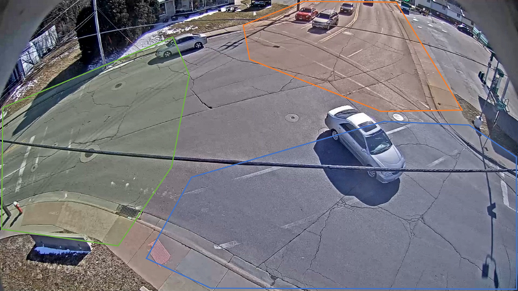
Рисунок 1.1 – Пример разбиения ROI-областей

В частности, в видеокадре системы мониторинга в соответствии с геометрической структурой перекрёстка выделяется несколько ROI-областей, как показано на Рисунке 1.1. Каждая ROI-область соответствует определённому направлению движения на перекрёстке (например, восточному, западному, южному или северному направлению). Пусть траектория транспортного средства представлена последовательностью точек:

$$
T=\{p_1, p_2, \cdots, p_n\}
$$

где $p_i$ обозначает пространственные координаты транспортного средства в $i$-м кадре. ROI-область представляется как множество в двумерном пространстве и обозначается как $R_i$.

В процессе классификации траекторий система фиксирует последовательность посещения ROI-областей траекторией $T$. Если траектория транспортного средства $T_A$ последовательно проходит через ROI-области $R_A$ и $R_B$, то существует следующая последовательность пространственного перехода:

$$
T_A:R_A\rightarrow R_B
$$

На основании этого направление движения транспортного средства определяется как $A\rightarrow B$, то есть транспортное средство движется от входного направления, соответствующего $R_A$, к выходному направлению, соответствующему $R_B$, что позволяет завершить классификацию траектории.

В практической реализации система определяет пространственное включение точек траектории в ROI-области и последовательно фиксирует события входа в ROI-области, формируя последовательность посещения ROI для каждого транспортного средства. На основе этой последовательности выполняются классификация направлений движения и статистический подсчёт транспортного потока.

Следует отметить, что данный метод зависит от пространственной согласованности между ROI-областями и изображением с камеры наблюдения. Метод не способен компенсировать ошибки, возникающие при смещении камеры, дрожании изображения или изменении угла обзора, что может негативно влиять на стабильность классификации. Тем не менее в условиях фиксированного положения камеры данный подход обеспечивает хороший баланс между вычислительной сложностью, производительностью в реальном времени и практической реализуемостью, что делает его пригодным для задач анализа транспортного потока на перекрёстках.

### 1.4 Вывод

В данной главе рассмотрены теоретические основы системы детекции транспортных потоков, существующие методы и выбранный технологический стек.

Во-первых, на основе актуальности проблемы городских заторов обоснована практическая потребность в автоматизированном подсчёте потоков на сложных перекрёстках. Во-вторых, с учётом требований системы выполнен анализ и выбор технологий. В итоге определено следующее решение:

В качестве языка программирования выбран Python, что обеспечивает быструю разработку и доступ к богатой экосистеме алгоритмических библиотек. В качестве инструмента обработки видео используется OpenCV, а высокоточная и быстрая детекция транспортных средств реализуется алгоритмом YOLO. Для отслеживания применяется ByteTrack, обеспечивающий устойчивую ассоциацию идентичности и построение траекторий. Классификация траекторий и подсчёт потоков выполняются на основе пользовательских ROI для получения статистики по направлениям.

Выбранные решения формируют теоретическую и технологическую основу для последующего проектирования, реализации и экспериментальной проверки системы.

## 2. ТРЕБОВАНИЯ К СИСТЕМЕ ДЕТЕКЦИИ ТРАНСПОРТНЫХ ПОТОКОВ

После анализа теоретических основ и выбора технологий необходимо сформулировать функциональные и нефункциональные требования, чтобы система удовлетворяла практическим потребностям сложных дорожных сценариев. В данной главе рассматриваются функциональные и нефункциональные требования к системе детекции транспортных потоков на основе компьютерного зрения, что служит базой для последующего проектирования и реализации.

### 2.1 Функциональные требования

Функциональные требования описывают ключевые бизнес-функции, которые система должна реализовывать. В рамках рассматриваемого сценария система ориентирована на анализ видео с городских перекрёстков и должна выполнять детекцию и отслеживание транспортных средств, классификация траекторий и статистический анализ транспортного потока. Таким образом, система должна включать следующие функциональные модули.

Таблица 2.1 – Функциональные требования ПО

| № | Функциональный модуль                                           | Описание                                                                                                                                                                                                                                                                                                                                                                                                                                                                           |
| -- | ----------------------------------------------------------------------------------- | ------------------------------------------------------------------------------------------------------------------------------------------------------------------------------------------------------------------------------------------------------------------------------------------------------------------------------------------------------------------------------------------------------------------------------------------------------------------------------------------ |
| 1  | Ввод видео                                                                 | Система должна поддерживать получение видеофайлов дорожного мониторинга или видеопотока с камер в реальном времени в качестве источника входных данных, выполнять чтение и покадровый анализ видео для последующей передачи данных в модуль детекции объектов. |
| 2  | Детекция транспортных средств                            | Система должна автоматически обнаруживать транспортные средства на видео и выдавать информацию об их местоположении и классе для последующего использования в модуле MOT.                                                                                                                                                                  |
| 3  | Отслеживание транспортных средств                    | Система должна присваивать каждому транспортному средству уникальный ID и сохранять согласованность идентификации между последовательными кадрами, формируя непрерывные траектории движения транспортных средств.                                                                                 |
| 4  | Конфигурация ROI                                                        | Система должна предоставлять пользователю возможность настройки ROI-областей в соответствии со структурой конкретного перекрёстка для обозначения различных направлений движения.                                                                                                                                               |
| 5  | Классификация траекторий                                     | Система должна классифицировать направления движения транспортных средств на основе временной последовательности взаимодействия траекторий с ROI-областями, обеспечивая распознавание различных типов транспортного поведения.                                                         |
| 6  | Статистический подсчёт транспортного потока | Система должна автоматически подсчитывать количество транспортных средств по различным направлениям движения и формировать информацию об общем транспортном потоке и потоках по отдельным направлениям.                                                                                                    |
| 7  | Визуализация результатов                                     | Система должна обеспечивать визуализацию результатов статистического анализа транспортного потока в виде интерактивных графиков на пользовательском интерфейсе, обеспечивая интерпретируемость и удобство использования системы.                                                  |

Таким образом, система должна обеспечивать полный цикл обработки данных — от ввода видеопотока, детекции и отслежиапния объектов до классификации траекторий и статистического анализа транспортного потока, реализуя автоматизированный анализ транспортной ситуации в сложных дорожных условиях.

### 2.2 Нефункциональные требования

Помимо реализации основных бизнес-функций, система детекции транспортного потока должна удовлетворять требованиям к производительности, стабильности и пользовательскому взаимодействию. Нефункциональные требования напрямую влияют на эффективность применения системы в реальных транспортных условиях, поэтому в данном исследовании система анализируется с точки зрения скорости обработки, точности детекции, стабильности работы, устойчивости к внешним условиям и удобства использования.

#### 2.2.1 Скорость

Система детекции транспортного потока должна обеспечивать непрерывную обработку последовательности видеозаписей дорожного наблюдения, поэтому система должна обладать высокой производительностью обработки и минимизировать время ожидания выполнения задач детекции.

В процессе работы системе необходимо в порядке выполнять чтение видео, детекцию и отслживание транспортных средств, классификацию траекторий и статистический анализ транспортного потока. В связи с этим система должна по возможности минимизировать задержку обработки одного кадра для обеспечения общей эффективности работы системы.

Кроме того, система должна эффективно использовать вычислительные ресурсы и стабильно функционировать в среде потребительских CPU и GPU, что позволит снизить стоимость развертывания и повысить практическую применимость системы.

#### 2.2.2 Точность

Точность результатов статистического анализа транспортного потока является одним из ключевых показателей эффективности системы и напрямую влияет на достоверность анализа транспортных данных.

Прежде всего, система должна обеспечивать высокую точность модуля детекции объектов, минимизируя количество ложных срабатываний и пропусков объектов. Одновременно модуль MOT должен сохранять согласованность ID транспортных средств между последовательными кадрами, предотвращая повторный подсчёт и статистические ошибки, вызванные потерей ID объектов. Кроме того, в процессе классификации траекторий и подсчёта транспортного потока система должна корректно определять типы траекторий движения транспортных средств и выполнять статистический анализ транспортного потока по различным направлениям, обеспечивая достоверность результатов транспортного анализа.

Высокая точность является важной предпосылкой для последующего использования системы в задачах анализа транспортного потока и оптимизации управления дорожными сигналами.

#### 2.2.3 Стабильность

Система детекции транспортного потока обычно должна функционировать в непрерывном режиме в течение длительного времени, поэтому система должна обладать высокой стабильностью работы для соответствия требованиям реальных транспортных сценариев мониторинга.

В процессе длительной обработки видеоданных могут возникать изменения разрешения видео, колебания частоты кадров или кратковременные перебои сетевого соединения. В таких ситуациях система должна обеспечивать продолжение работы либо выполнять обработку исключительных ситуаций, предотвращая возникновение сбоев программы, утечек памяти, ошибок чтения видео или прерывания инференса модели, чтобы гарантировать успешное завершение общей задачи обработки.

Кроме того, различные модули системы должны обладать хорошей согласованностью взаимодействия, обеспечивая стабильное выполнение процессов анализа транспортного потока.

#### 2.2.4 Устойчивость

Поскольку реальные транспортные условия обычно являются достаточно сложными, система должна обладать высокой адаптивностью к внешним условиям и устойчивостью к помехам.

В реальных условиях дорожного наблюдения видеоданные могут содержать окклюзии транспортных средств, изменения освещения и теневые помехи, что оказывает влияние на результаты детекции и отслеживание объектов. Поэтому система должна сохранять стабильную производительность детекции в сложных транспортных сценах и по возможности снижать влияние факторов окружающей среды на результаты анализа.

Также система должна поддерживать работу с различными типами дорожной инфраструктуры и различными углами обзора камер наблюдения, а также обеспечивать возможность настройки ROI-областей пользователем для повышения адаптивности системы к различным сценариям.

#### 2.2.5 Удобство

Для повышения практической ценности системы необходимо обеспечить удобное пользовательское взаимодействие.

Пользователь должен иметь возможность удобно выполнять импорт видео, настройку ROI-областей и запуск системы. Кроме того, система должна наглядно отображать ограничивающие рамки объектов, траектории движения транспортных средств и результаты статистического анализа транспортного потока, что позволит пользователю эффективно анализировать дорожную ситуацию.

Также интерфейс системы должен быть максимально простым и интуитивно понятным, что позволит снизить затраты на обучение и использование системы, а также повысить её практическую ценность при внедрении и эксплуатации.

### 2.3 Вывод

В данной главе выполнен анализ требований к системе детекции транспортных потоков и сформулированы цели проектирования с точки зрения функциональных и нефункциональных требований.

По функциональным требованиям система должна обеспечивать ввод видео, детекцию, отслеживание, классификацию траекторий, подсчёт потоков и визуализацию, формируя полный цикл анализа транспортной ситуации.

По нефункциональным требованиям система должна соответствовать требованиям скорости обработки, точности детекции и статистики, стабильности работы, устойчивости к сложным условиям и удобству взаимодействия.

На основе сформулированных требований в следующей главе будет рассмотрено проектирование архитектуры, ключевых модулей и конкретного плана реализации системы.

## 3 ПРОЕКТИРОВАНИЕ И РЕАЛИЗАЦИЯ СИСТЕМЫ

Опираясь на теоретический обзор, выбор технологий и анализ требований, в данной главе рассматриваются проектирование и инженерная реализация системы детекции транспортных потоков. Глава последовательно описывает полный процесс — от построения архитектуры до реализации ключевых функций. Сначала рассматривается многослойная архитектура, логика взаимодействия модулей и поток данных, включая разделение ответственности между фронтендом, бэкендом, модулем компьютерного зрения и системой хранения. Далее подробно описываются реализации основных модулей: обработка входного видео, инженерная интеграция детекции и отслеживание, логика классификации и подсчёта на основе ROI, а также реализация взаимодействия между фронтендом и бэкендом. В завершение приводится обзор применённых методов оптимизации производительности.

### 3.1 Проектирование системы

Далее описывается общий замысел проектирования системы: формируется техническая архитектура и логика выполнения, которые служат основой для дальнейшего выделения функциональных модулей и инженерной реализации. Проектирование представлено в трёх аспектах: многослойная архитектура системы, диаграммы последовательности взаимодействия модулей и логика потоков данных. Это обеспечивает полноту функциональности, расширяемость и практическую реализуемость системы для сложных перекрёстков.

#### 3.1.1 Архитектура системы

Для реализации автоматизированной детекции и анализа транспортных потоков на сложных дорожных сценах используется модульный подход и многослойная архитектура. Система состоит из четырёх основных частей: фронтенд (Frontend), бэкенд (Backend), модуль компьютерного зрения (Vision Module) и подсистема хранения данных (Data Storage). Модули взаимодействуют через интерфейсы и совместно обеспечивают сбор видео, детекцию, отслеживание, классификацию траекторий и подсчёт потоков.

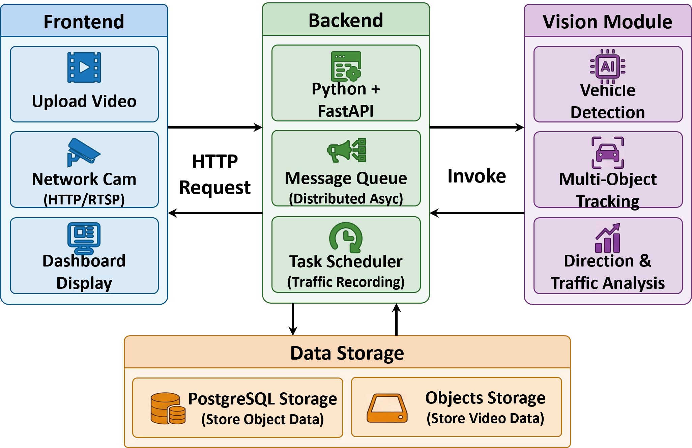
Рисунок 3.1 – Общая архитектура системы

Состав архитектуры включает следующие модули:

1. Фронтенд (Frontend)

   Фронтенд отвечает за взаимодействие с пользователем и отображение результатов, являясь основным интерфейсом системы. Он включает:

   - Загрузка видео (Upload Video): пользователь загружает локальный видеоролик для офлайн-анализа.
   - Подключение сетевой камеры (Network Cam): поддерживается подключение сетевых камер по протоколам HTTP или RTSP для получения видеопотока в реальном времени.
   - Панель визуализации (Dashboard Display): отображение результатов детекции, траекторий и статистики потоков.
     Фронтенд взаимодействует с бэкендом по HTTP и получает результаты детекции и статистические данные.
2. Бэкенд (Backend)

Бэкенд является центральной управляющей частью системы: реализует бизнес-логику, планирование задач и коммуникацию между компонентами.

В работе бэкенд реализован на Python с использованием FastAPI. FastAPI отличается лёгкостью, высокой производительностью и хорошей поддержкой асинхронной обработки, что соответствует требованиям к высокой параллельности и близкой к реальному времени обработке.

Бэкенд включает:

- Python + FastAPI: управление API, контроль задач и взаимодействие фронтенда и бэкенда.
- Очередь сообщений (Message Queue): поскольку анализ видео вычислительно затратен, используется асинхронная распределённая обработка; очередь сообщений обеспечивает развязку и асинхронное выполнение, повышая пропускную способность.
- Планировщик задач (Task Scheduler): управляет заданиями анализа и заданиями записи с камер, обеспечивая расписание и контроль состояния.

Бэкенд координирует обмен данными между модулем компьютерного зрения и подсистемой хранения и управляет общим ходом работы системы.

3. Модуль компьютерного зрения (Vision Module)

Модуль компьютерного зрения — ключевой функциональный компонент системы, выполняющий детекцию транспортных средств, отслеживание и анализ потоков.

Он включает:

- Детекция транспортных средств (Vehicle Detection): детекция транспортных средств с помощью YOLO и выдача рамок и классов.
- Отслеживание нескольких объектов (Multi-Object Tracking): отслеживание с ByteTrack, назначение уникальных ID и построение траекторий.
- Анализ направлений и подсчёт трафика (Direction & Traffic Analysis): классификация направлений по траекториям и ROI и статистический подсчёт.

Модуль обеспечивает автоматизированный анализ сложных дорожных сцен и предоставляет данные для управления движением и оптимизации светофорного регулирования.

4. Подсистема хранения данных (Data Storage)

Подсистема хранения отвечает за сохранение и управление данными, формируемыми в ходе работы.

Применяется многоуровневый подход:

- PostgreSQL: хранение структурированных данных (задачи, конфигурации камер, конфигурации ROI, статистика).
- Локальное файловое хранилище (Local Storage): хранение исходных и результирующих видеоданных; текущая реализация использует локальные директории сервера с возможностью замены на объектное хранилище (S3/MinIO).

Разделение хранения повышает управляемость данных и возможности последующего анализа.

Для иллюстрации взаимодействия модулей спроектирована схема процесса работы (Рисунок 3.2).

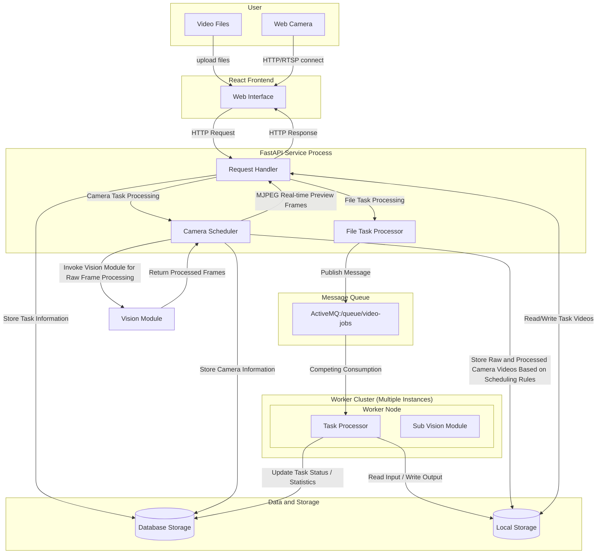

Рисунок 3.2 – Схема выполнения (workflow) системы

В ходе работы пользователь загружает видеофайлы через фронтенд или подключает сетевую камеру (HTTP/RTSP). Затем видеоданные передаются на бэкенд, который выполняет диспетчеризацию и асинхронную обработку, после чего отправляет задачу в модуль компьютерного зрения. По завершении анализа результаты детекции и статистики сохраняются в подсистеме хранения и отображаются пользователю во фронтенде.

#### 3.1.2 Диаграммы последовательности

Для описания взаимодействия модулей используются диаграммы последовательности, моделирующие передачу сообщений, диспетчеризацию и потоки данных. Рассматриваются два основных процесса: офлайн-анализ на основе загруженного файла и анализ видеопотока с сетевой камеры.

Диаграммы позволяют явно показать взаимодействие между пользователем, фронтендом, сервисом FastAPI, очередью сообщений, узлом Worker и подсистемой хранения, тем самым раскрывая механизм работы системы.

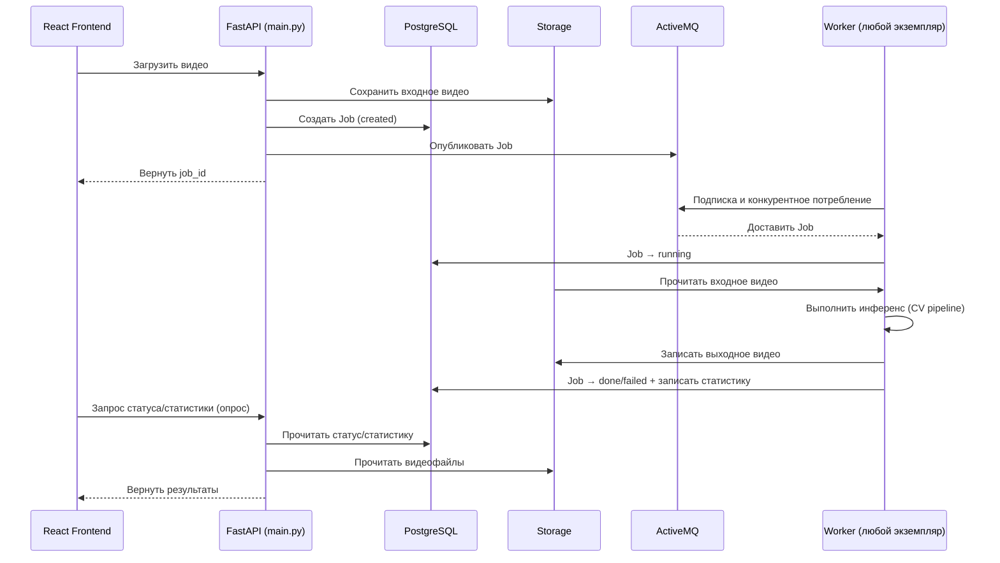

Рисунок 3.3 – Процесс анализа загруженного видео

1. Процесс анализа загруженного видео

   Данный процесс предназначен для обработки локальных видеороликов, загружаемых пользователем. Используется асинхронный механизм выполнения, развязывающий создание задачи и фактический анализ видео, а также позволяющий распределённо выполнять задачи (Рисунок 3.3).

   Пользователь загружает видео через фронтенд React, после чего фронтенд отправляет HTTP-запрос на FastAPI для создания задачи анализа.

   После получения запроса бэкенд сохраняет исходный видеоролик в локальном хранилище и создаёт запись задачи в PostgreSQL со статусом «created». Далее информация о задаче (ID и путь к файлу) публикуется в очередь ActiveMQ.

   Worker постоянно прослушивает очередь и, используя конкурентное потребление, получает задачу. Получив задачу, Worker обновляет статус на «running», читает входное видео и вызывает модуль компьютерного зрения для выполнения детекции, отслеживания и подсчёта потоков.

   После завершения обработки Worker формирует выходное видео, затем транскодирует его в браузерно-совместимый формат MP4. Статистика и статус задачи записываются в базу данных.

   Во время выполнения фронтенд периодически обращается к API для получения статуса, статистики и выходного видео. После завершения задачи результаты отображаются в интерфейсе.

   Данный подход с очередью сообщений обеспечивает асинхронность, предотвращает блокировку Web-сервиса длительными вычислениями и повышает общую пропускную способность и устойчивость системы.

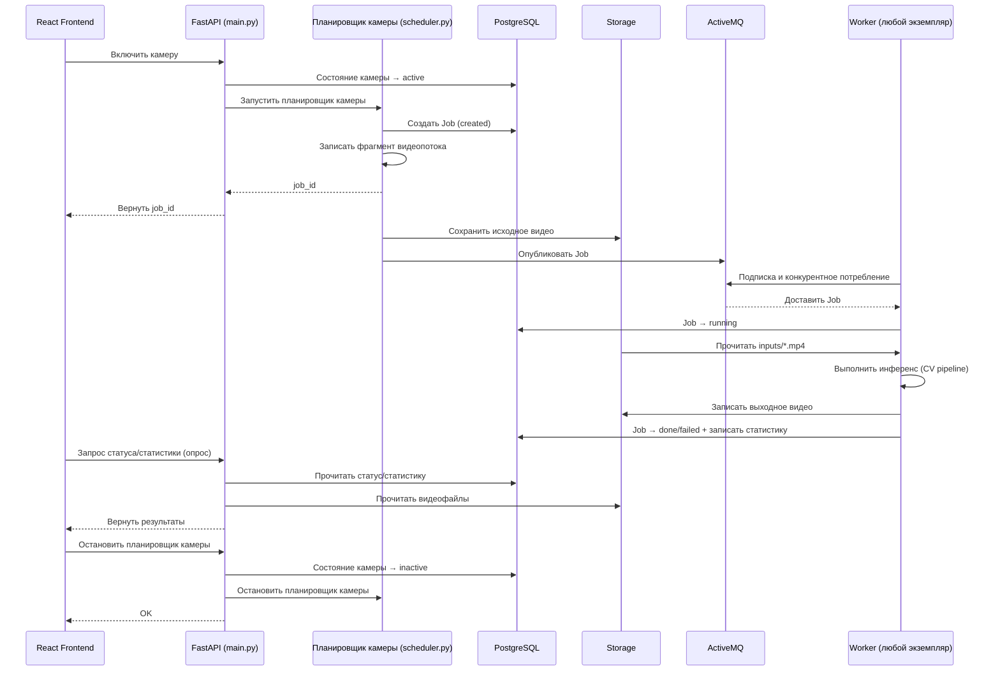

Рисунок 3.4 – Процесс анализа видеопотока сетевой камеры

2. Процесс анализа в режиме сетевой камеры

Помимо офлайн-анализа система поддерживает периодический анализ видеопотока с сетевой камеры, предназначенный для непрерывного мониторинга и статистики в реальном времени (Рисунок 3.4).

Пользователь активирует камеру через фронтенд. Бэкенд обновляет состояние камеры на «active» и запускает планировщик.

Планировщик по заданным правилам периодически создаёт задачи анализа и асинхронно записывает видеопоток. Записанные фрагменты сохраняются в локальном хранилище, а информация о задачах публикуется в очередь.

Worker получает задачи из очереди и выполняет анализ, включая детекцию, отслеживание и подсчёт потоков. Результаты сохраняются в базе и локальном хранилище.

Фронтенд периодически запрашивает статус и статистику, обеспечивая обновление данных для пользователя в близком к реальному времени режиме.

При остановке камеры бэкенд переводит состояние на «inactive» и прекращает создание новых задач.

По сравнению с синхронной обработкой асинхронный механизм на основе очереди и кластера Worker повышает эффективность обработки видео и поддерживает параллельное выполнение нескольких задач, что важно для масштабного анализа в сложных дорожных условиях.

#### 3.1.3 Поток данных

Для описания внутренней обработки анализируется поток данных и структура хранения. Проектирование потока данных описывает передачу, обработку и преобразование информации между модулями, а проектирование хранения — способы долговременного сохранения данных, возникающих при анализе.

Процесс обработки включает этапы: ввод видео, извлечение кадров, детекция, отслеживание, классификация траекторий по ROI, подсчёт потоков и выдача результатов. Система принимает видео или поток камеры, извлекает кадры с OpenCV, выполняет детекцию YOLO, отслеживание ByteTrack, классифицирует направления по ROI, выполняет статистический подсчёт и сохраняет результаты в базу и локальное хранилище, после чего отображает их на фронтенде. Общая схема показана на Рисунке 3.5.

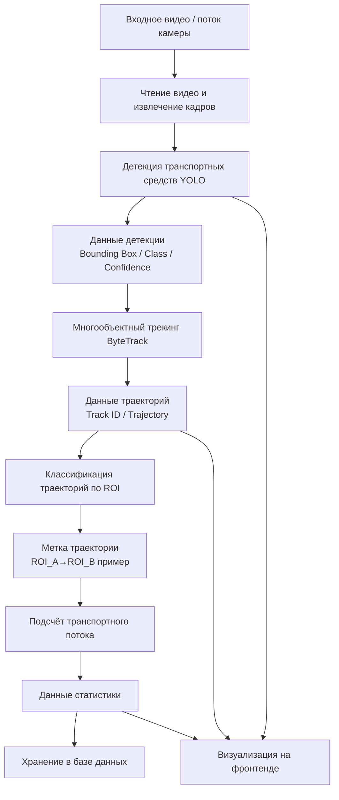

Рисунок 3.5 – Схема потока данных системы

Для долговременного хранения данных используется PostgreSQL для структурированных данных (задачи, камеры, конфигурации ROI), а видеофайлы хранятся в локальной директории сервера.

Основные таблицы БД и связи показаны на Рисунке 3.6.

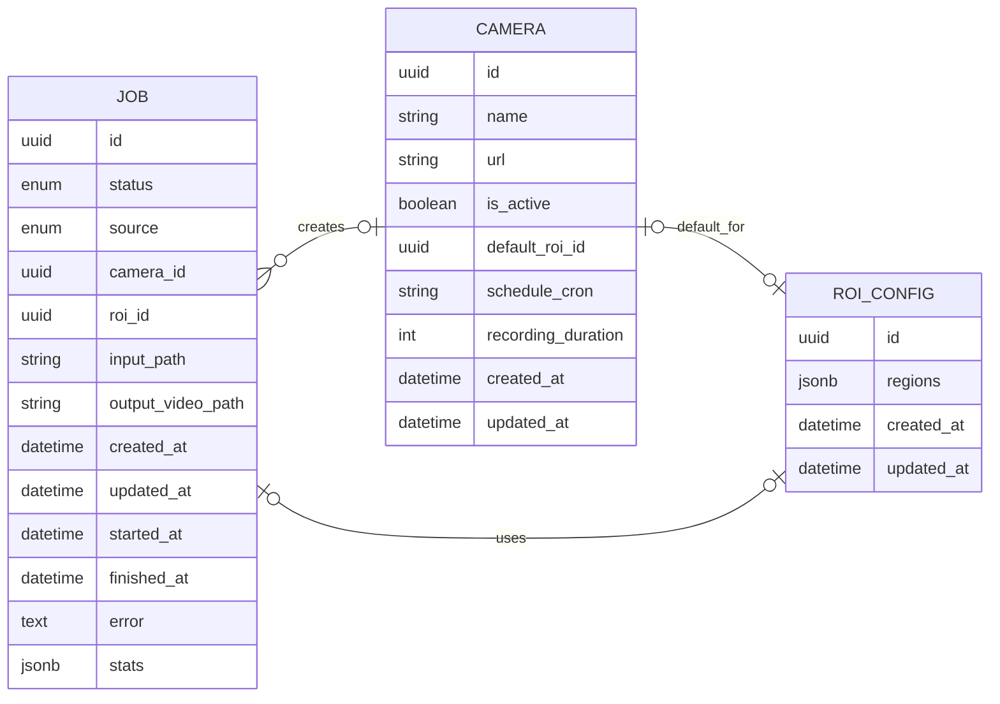

Рисунок 3.6 – ER-диаграмма базы данных системы

Таблица Job хранит данные задач анализа: статус, пути к входным/выходным видео, временные отметки выполнения и статистику. Статистика хранится в JSON для поддержки динамической структуры данных по направлениям.

Таблица Camera хранит конфигурации камер и информацию планировщика: адрес, состояние и расписание записи. Для планирования используется Cron-выражение.

Таблица RoiConfig хранит конфигурацию ROI, заданную пользователем. Поскольку ROI представляет собой динамическую многоугольную структуру, используется тип JSONB PostgreSQL для хранения координат, что повышает адаптивность к сложным ROI.

Таким образом, описанные поток данных и схема хранения обеспечивают полный автоматизированный цикл от входного видео до выдачи статистики, а также согласованность, стабильность и расширяемость передачи и сохранения данных между модулями.

### 3.2 Реализация системы

На основе проектирования из раздела 3.1 далее приводятся детали реализации на инженерном уровне. Система построена вокруг цепочки обработки «получение видео — детекция — отслеживание — семантическая классификация траектории — подсчёт и визуализация статистики» и использует разделение фронтенда и бэкенда и асинхронный механизм задач для развязки вычислительно затратного анализа видео и Web-взаимодействия: фронтенд отвечает за создание задач, предпросмотр, разметку ROI и отображение статистики; бэкенд — за управление файлами, жизненным циклом задач, планирование и API; модуль зрения — за покадровый инференс, генерацию траекторий и выходного видео; очередь сообщений — за передачу задач между Web-сервисом и вычислительными воркерами, обеспечивая конкурентное потребление и горизонтальное масштабирование. В результате реализован анализ потоков по направлениям для перекрёстков и визуализация результатов.

#### 3.2.1 Реализация обработки видео

Обработка видео является входным и предобрабатывающим этапом, обеспечивающим получение видеоданных из разных источников и приведение их к единому виду. Система поддерживает два способа ввода:

1. загрузка локального видеофайла пользователем через браузер;
2. сбор видеосегментов с сетевой камеры по расписанию (Cron), выполняемый серверным планировщиком.

Обе схемы имеют единый инженерный результат до начала анализа: видео сохраняется как локальный MP4-файл и становится стабильным источником для покадровой обработки, что позволяет избежать выполнения длительного инференса в жизненном цикле Web-запроса.

Для загрузки локального видео бэкенд через /`api/jobs` принимает `multipart/form-data`, сохраняет файл во входной директории, создаёт запись в базе и отправляет задачу в очередь. Ключевая идея — развязать «загрузку видео» и «обработку задачи»: запрос загрузки выполняет только сохранение и постановку в очередь, а инференс выполняется асинхронно Worker’ом, что обеспечивает быстрый ответ API и расширяемость.

Для режима камеры используется `APScheduler`: по `schedule_cron` запускается запись, OpenCV `VideoCapture` читает поток, по длительности рассчитывается число кадров и формируется временный файл; по завершении запись также становится стандартной задачей для очереди. Это позволяет обеим схемам полностью переиспользовать один и тот же конвейер анализа: при наличии пути к входному видео можно запускать единый процесс детекции и отслеживания.

На этапе анализа применяется типичный конвейер «покадровое чтение — инференс — отрисовка — запись результата — агрегация статистики». Для удобства сопровождения `VideoCapture/VideoWriter` OpenCV инкапсулированы в единый обработчик, а основной цикл по кадрам выполняет детекцию и отслеживание, записывая визуализированный результат в выходной файл. Ниже приведён фрагмент кода, демонстрирующий ключевую логику:

```python
def process_video(input_video_path: str, output_video_path: str, model_path: str, detector=None, conf=0.5, iou=0.5, classes=None):
    video_handler = VideoHandler(input_video_path)
    out_tmp_path = output_video_path.replace(".mp4", "_tmp.mp4")
    video_handler.setup_writer(out_tmp_path)
    if detector is None:
        detector = VehicleDetector(model_path)
    visualizer = Visualizer(max_history=30, auto_clear=True)

    frame_count = 0
    ids_by_class = {}
    trajectories = {}
    while True:
        ret, frame = video_handler.read_frame()
        if not ret:
            break
        frame_count += 1
        results = detector.track(frame, conf=conf, iou=iou, classes=classes, persist=True, tracker="bytetrack.yaml")
        if results and results[0].boxes.id is not None:
            track_ids = results[0].boxes.id.int().cpu().tolist()
            class_ids = results[0].boxes.cls.int().cpu().tolist()
            centers = results[0].boxes.xywh.cpu().tolist()
            for tid, cid, center in zip(track_ids, class_ids, centers):
                ids_by_class.setdefault(cid, set()).add(tid)
                _append_trajectory_point(trajectories, tid, cid, center[0], center[1], frame_count, sample_step=3, max_points=400)
        annotated = visualizer.draw_detections(frame, results)
        video_handler.write_frame(annotated)

    video_handler.release(destroy_windows=False)
    transcode_video(out_tmp_path, output_video_path)
    unique_ids_by_class = {int(k): len(v) for k, v in ids_by_class.items()}
    return frame_count, unique_ids_by_class, trajectories
```

Для обеспечения стабильного воспроизведения результата в разных браузерах введён единый шаг транскодирования. На практике совместимость MP4 зависит от параметров контейнера и кодирования, в частности при различиях конфигураций H.264 или при отсутствии `moov`-метаданных в начале файла могут возникать проблемы воспроизведения и перемотки. Поэтому после записи временного файла система вызывает FFmpeg для транскодирования в H.264 и включения `faststart` для переноса метаданных в начало файла, что повышает совместимость онлайн-воспроизведения. Аналогичный шаг выполняется и для сегментов, записанных с камеры, снижая неопределённость кодеков в дальнейшем конвейере.

#### 3.2.2 Детекция и отслеживание транспортных средств

Детекция транспортных средств реализована на основе YOLOv8[^35]. Данный метод объединяет локализацию объектов и предсказание их классов в рамках одного процесса прямого распространения (forward inference), что обеспечивает высокую скорость вывода и удобство сквозного развертывания. Для типичных задач дорожных перекрёстков, связанных с наличием малоразмерных транспортных средств, окклюзий и изменений масштаба объектов, способность YOLOv8 к многомасштабному объединению признаков позволяет эффективно повышать полноту детекции транспортных средств различных размеров, обеспечивая тем самым стабильность работы системы в сложных транспортных сценах.

YOLOv8 предоставляет несколько вариантов моделей для различных требований к вычислительным ресурсам и точности. Наиболее распространённые версии включают n/s/m/l/x, различающиеся глубиной и шириной сети, а также количеством параметров: чем больше размер модели, тем выше обычно точность детекции, однако одновременно возрастают время вывода и потребление видеопамяти. Для задач распознавания транспортных средств на перекрёстках выбор модели требует компромисса между производительностью в реальном времени и точностью детекции.

Таблица 3.1 – Сравнение параметров и производительности моделей YOLOv8

| Масштаб модели | Параметры (M) | FLOPs (B) | COCO mAP`<sup>`val`<br>`0.5:0.95 | FPS на Tesla T4 |
| --------------------------- | ---------------------- | --------- | ------------------------------------ | ----------------- |
| YOLOv8n                     | 3.2                    | 4.5       | 37.3                                 | 161               |
| YOLOv8s                     | 11.2                   | 28.6      | 44.9                                 | 88                |
| YOLOv8m                     | 25.9                   | 78.9      | 50.2                                 | 39                |
| YOLOv8l                     | 43.7                   | 165.1     | 52.9                                 | 23                |
| YOLOv8x                     | 68.2                   | 258.5     | 53.9                                 | 16                |

Примечание: значения числа параметров, объём вычислений FLOPs, показатели COCO mAP и скорости инференса приведены по официальным бенчмаркам YOLOv8 при размере входного изображения 640×640.

С учётом требований к точности детекции, скорости инференса и потреблению вычислительных ресурсов для сцен дорожных перекрёстков, в данной системе в качестве основной модели была выбрана YOLOv8m. Следует отметить, что основное внимание в работе уделяется инженерной реализации и проверке работоспособности системы анализа транспортных потоков, а не оптимизации модели детекции для конкретного набора данных. В связи с ограничениями, связанными со сбором данных, разметкой и временными затратами, дополнительное обучение или дообучение модели не проводилось, поэтому во всех последующих реализации системы и экспериментах использовались предварительно обученные веса `yolov8m.pt`.

После выполнения детекции транспортных средств система дополнительно использует модуль MOT для межкадрового сопоставления целей и формирования непрерывных траекторий движения транспортных средств. В качестве алгоритма MOT используется ByteTrack. Данный метод сначала выполняет сопоставление объектов по детекциям с высокой степенью уверенности, а затем использует низкоуверенные детекции для восстановления временно перекрытых либо частично потерянных объектов, что позволяет сохранять непрерывность траекторий в сложных сценах. По сравнению со стратегиями, использующими только высокоуверенные детекции, данный подход позволяет эффективно уменьшить количество разрывов траекторий и случаев смены ID в условиях плотного транспортного потока и перекрытия объектов.

В инженерной реализации интерфейс `model.track()`, предоставляемый YOLOv8, был дополнительно инкапсулирован в классе VehicleDetector для централизованного управления загрузкой модели и параметрами вывода. Для уменьшения накладных расходов, связанных с повторной загрузкой модели, Worker-процесс на этапе запуска выполняет предварительный прогрев модели и кэширует экземпляр детектора для повторного использования в последующих задачах, что повышает общую пропускную способность системы.

В процессе покадровой обработки система считывает видеокадры и вызывает метод `track()` для совместного выполнения детекции и отслеживания: после получения детекций YOLOv8 передаёт результаты алгоритму ByteTrack для межкадрового сопоставления объектов. Ниже приведена ключевая реализация метода track():

```python
class VehicleDetector:

    def track(self, frame, conf=0.5, iou=0.5, classes=None, persist=True, tracker="bytetrack.yaml"):
        kwargs = {
            "conf": conf,
            "iou": iou,
            "classes": classes,
            "device": self.device,
            "half": self.half,
            "imgsz": self.imgsz,
            "persist": persist,
            "tracker": tracker,
            "verbose": False,
        }
        results = self.model.track(frame, **kwargs)
        return results
```

Параметры `conf` и `iou` используются для задания порога уверенности и регулирования интенсивности подавления немаксимумов (NMS), а параметр classes определяет классы объектов, подлежащих детекции. Параметр `persist=True` обеспечивает сохранение состояния отслеживания между последовательными кадрами, а `tracker` задаёт конфигурационный файл используемого алгоритма отслеживания.

За счёт совместного выполнения детекции и отслеживания система получает ограничивающие рамки объектов и стабильные межкадровые ID `track_id`. На этапе визуализации ограничивающие рамки, метки классов и ID отслеживания накладываются на выходное видео, формируя результат детекции, показанный на Рисунке 3.7.

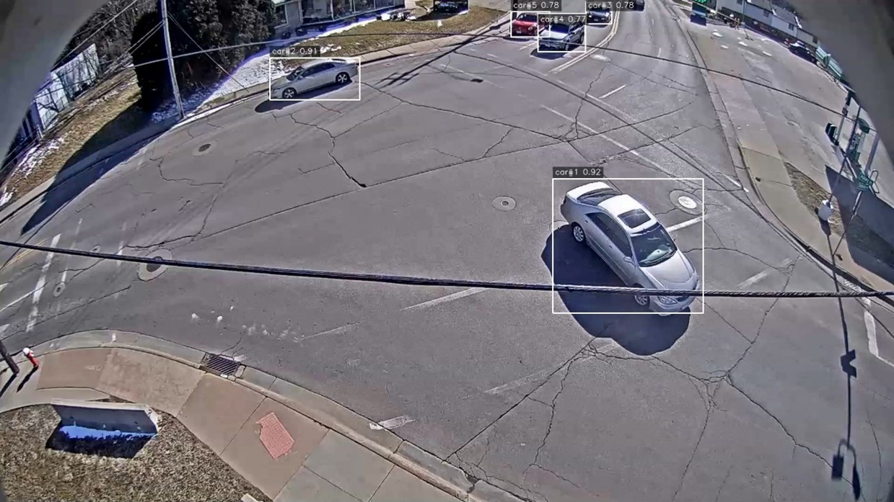

Рисунок 3.7 – Пример результата детекции.

Примечание: на типичном кадре тестового видео показаны ограничивающие рамки, метки классов и ID объектов.

После получения устойчивых траекторий транспортных средств система выполняет их долговременное хранение. В качестве точек траектории используются координаты центра транспортного средства, а сама траектория дискретизируется с фиксированным шагом по кадрам, при этом ограничивается максимальное количество точек для уменьшения избыточности данных и снижения нагрузки на визуализацию на стороне клиента.

Ниже приведена реализация логики сохранения точек траектории:

```python
def _append_trajectory_point(
    trajectories: Dict[str, Dict[str, Any]],
    track_id: int,
    class_id: int,
    center_x: float,
    center_y: float,
    frame_index: int,
    sample_step: int,
    max_points: int,
) -> None:
    if frame_index % sample_step != 0:
        return
    key = str(track_id)
    if key not in trajectories:
        trajectories[key] = {"class_id": int(class_id), "points": []}
    item = trajectories[key]
    item["class_id"] = int(class_id)
    item["points"].append([int(frame_index), round(float(center_x), 2), round(float(center_y), 2)])
    if len(item["points"]) > max_points:
        item["points"] = item["points"][-max_points:]
```

Каждая точка траектории хранится в формате `[frame_index, center_x, center_y]`, где указаны номер кадра и координаты центра объекта.

Таким образом, система формирует структурированные данные траекторий и сохраняет их в формате JSON, обеспечивая основу для последующего анализа, визуализации и классификации транспортного потока.

#### 3.2.3 Классификация траекторий и подсчёт трафика

После завершения этапов детекции, отслеживания и сохранения траекторий система выполняет семантический анализ движения транспортных средств на основе областей интереса (ROI — Region of Interest) для классификации направлений движения и подсчёта трафика.

На стороне клиента данные траекторий запрашиваются через API `/api/jobs/{job_id}/stats`, после чего нормализуются и отображаются в виде списка траекторий. Далее с использованием Canvas/SVG траектории накладываются на видеокадры, формируя визуализацию траекторий транспортных средств.

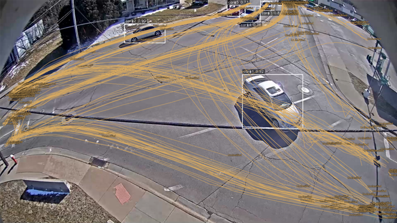

Рисунок 3.8 – Пример визуализации наложенных траекторий

Примечание: наложение траекторий на видеоизображение; сохранение идентичности `track_id` между кадрами; поддержка фильтрации и отображения ROI.

Для реализации классификации направлений система поддерживает функциональность построения и управления ROI. Пользователь может вручную задавать несколько областей ROI, соответствующих направлениям движения на перекрёстке. ROI привязываются к конкретной задаче, при этом каждая задача имеет собственную конфигурацию ROI. Дополнительно система поддерживает шаблоны ROI для IP-камер: при создании задачи из камеры используется копия её стандартной конфигурации ROI, что снижает трудозатраты на разметку.

После задания ROI система выполняет проверку корректности конфигурации и сохраняет данные в формате JSON в поле regions таблицы `roi_configs` , как данный пример:

```json
[
  {
    "id": "2e0a7e1c-0f22-4e1b-8a4c-1f6b0b4b2c9d",
    "name": "ROI_N",
    "points": [[312, 128], [510, 140], [548, 260], [290, 248]]
  },
  ... другие ROI
]
```

На этапе классификации траекторий используется критерий принадлежности точек траектории к ROI. Для каждой траектории система проверяет последовательность попадания её точек в различные ROI с использованием функции `pointInPolygon()`. При первом входе траектории в ROI фиксируется событие входа (enter), а название ROI добавляется в последовательность посещений. Итоговая метка формируется как последовательность посещённых ROI, например ROI_W→ROI_E. Если траектория не попадает ни в одну область ROI, она помечается как «не классифицирована».

Пример логики классификации:

```javascript
for (const [frame, x, y] of points) {
  for (let ri = 0; ri < rois.length; ri++) {
    const inside = pointInPolygon(x, y, rois[ri].points);
    if (!roiStates[ri] && inside) {
      if (!entered.has(rois[ri].name)) enterOrder.push(rois[ri].name);
      entered.add(rois[ri].name);
    }
    roiStates[ri] = inside;
  }
}
const label = enterOrder.length ? enterOrder.join('→') : t('roi.unclassified');
```

Здесь `roiStates` хранит информацию о том, находится ли текущая точка траектории внутри соответствующего ROI, а `enterOrder` фиксирует последовательность входа траектории в области интереса.

После завершения классификации траекторий система агрегирует результаты по полученным меткам и выполняет подсчёт количества транспортных средств в каждом направлении, обеспечивая автоматизированный анализ и визуализацию транспортного потока в сложных дорожных условиях.

#### 3.2.4 Реализация бэкэнда

Бэкенд построен на FastAPI как единый процесс API и организован по трёхуровневой структуре директорий «app (уровень приложения) — vision (уровень компьютерного зрения) — worker (рабочие процессы)», что строго разделяет интерфейсную логику, бизнес-оркестрацию и алгоритмический инференс. Структура проекта:

```text
backend/
├─ app/
│  ├─ __init__.py
│  ├─ db.py
│  ├─ main.py
│  ├─ models.py
│  ├─ mq.py
│  ├─ scheduler.py
│  ├─ schemas.py
│  ├─ settings.py
│  └─ storage.py
├─ vision/
│  ├─ openh264/
│  │  └─ openh264-1.8.0-win64.dll
│  ├─ __init__.py
│  ├─ detector.py
│  ├─ openh264_loader.py
│  ├─ pipeline.py
│  ├─ recorder.py
│  ├─ video_handler.py
│  └─ visualizer.py
├─ worker/
│  ├─ __init__.py
│  └─ worker.py
└─ requirements.txt
```

В части управления жизненным циклом приложения при старте автоматически создаются таблицы, выполняется обработка совместимости перечислимых типов PostgreSQL и таблицы конфигураций ROI для корректной инициализации в разных окружениях; одновременно запускается планировщик камер для загрузки расписаний активных камер.

Проектирование API следует ресурсной модели и охватывает три ключевых ресурса: задачи (`jobs`), камеры (`cameras`) и ROI (`rois`). Интерфейсы задач включают создание, список, детали, статистику, доступ к входному и результатному видео и удаление; интерфейсы камер — CRUD, ручной запуск записи, предпросмотр и снимок; интерфейсы ROI — CRUD для ROI задач и поддержка ROI по умолчанию для камер. Проект использует автоматическую документацию OpenAPI FastAPI; фронтенд предоставляет вход на `/docs` для интеграции и проверки. Основные интерфейсы суммированы в табл. 3-5.

Таблица 3-5. Список API интерфейсов бэкенда  

| Endpoint                                           | Метод | Описание                                                                          |
| -------------------------------------------------- | ---------- | ----------------------------------------------------------------------------------------- |
| `/api/jobs`                                      | POST       | Создание задачи анализа (загрузка видеофайла).     |
| `/api/jobs`                                      | GET        | Получение списка задач (с пагинацией).                     |
| `/api/jobs/stream`                               | GET        | Поток обновлений статусов задач (SSE).                        |
| `/api/jobs/{job_id}`                             | GET        | Получение деталей задачи по идентификатору.         |
| `/api/jobs/{job_id}/stats`                       | GET        | Получение статистики задачи (в т. ч. траектории).   |
| `/api/jobs/{job_id}/input`                       | GET        | Получение входного видео задачи.                              |
| `/api/jobs/{job_id}/result`                      | GET        | Получение обработанного видео (результата).          |
| `/api/jobs/{job_id}/frame`                       | GET        | Получение кадра задачи по номеру (изображение).    |
| `/api/jobs/{job_id}`                             | DELETE     | Удаление задачи и связанных файлов.                         |
| `/api/jobs`                                      | DELETE     | Очистка списка задач (удаление всех).                       |
| `/api/cameras`                                   | POST       | Создание конфигурации камеры.                                   |
| `/api/cameras`                                   | GET        | Получение списка камер.                                               |
| `/api/cameras/{camera_id}`                       | PUT        | Обновление конфигурации камеры.                               |
| `/api/cameras/{camera_id}`                       | DELETE     | Удаление камеры.                                                            |
| `/api/cameras/{camera_id}/trigger`               | POST       | Ручной запуск записи/создания задачи для камеры. |
| `/api/cameras/{camera_id}/preview/{stream_type}` | GET        | Предпросмотр потока камеры (MJPEG).                               |
| `/api/cameras/{camera_id}/snapshot`              | GET        | Получение снимка (один кадр) с камеры.                      |
| `/api/cameras/{camera_id}/default-roi`           | GET        | Получение ROI по умолчанию для камеры.                       |
| `/api/cameras/{camera_id}/default-roi`           | POST       | Создание ROI по умолчанию для камеры.                         |
| `/api/cameras/{camera_id}/default-roi/{roi_id}`  | PUT        | Обновление ROI по умолчанию для камеры.                     |
| `/api/cameras/{camera_id}/default-roi/{roi_id}`  | DELETE     | Удаление ROI по умолчанию для камеры.                         |
| `/api/rois`                                      | GET        | Получение списка ROI для задачи (по `job_id`).                |
| `/api/rois`                                      | POST       | Создание ROI для задачи.                                                 |
| `/api/rois/{roi_id}`                             | PUT        | Обновление ROI для задачи.                                             |
| `/api/rois/{roi_id}`                             | DELETE     | Удаление ROI для задачи.                                                 |

Примечание: `job_id/camera_id/roi_id` — UUID; полная схема запросов/ответов доступна в OpenAPI FastAPI на `/docs`.

В асинхронной обработке используется ActiveMQ как очередь сообщений; через STOMP Web-сервис и Worker передают задания. Web-сервис после создания задачи отправляет в очередь JSON-сообщение (только `job_id` и `input_path`), уменьшая нагрузку на очередь и упрощая расширение. Worker подписывается на ту же очередь и конкурирует за сообщения; в обработчике обновляет статус, запускает конвейер зрения, сохраняет статистику и переводит задачу в `done` или `failed`. Ниже приведены фрагменты «формат сообщения» и «обработка Worker»:

```python
def send_job(job_id: str, input_path: str) -> None:
    conn = stomp.Connection12([(settings.activemq_host, settings.activemq_port)])
    conn.connect(settings.activemq_user, settings.activemq_password, wait=True)
    try:
        conn.send(
            destination=settings.activemq_queue,
            body=json.dumps({"job_id": job_id, "input_path": input_path}),
            content_type="application/json",
        )
    finally:
        conn.disconnect()
```

```python
def on_message(self, frame):
    payload = json.loads(frame.body)
    job_uuid = UUID(payload["job_id"])
    input_path = payload["input_path"]
    job = db.get(Job, job_uuid)
    job.status = JobStatus.running
    job.started_at = datetime.now(timezone.utc)
    db.add(job); db.commit()

    result = process_video(
        input_video_path=input_path,
        output_video_path=output_path_for_job(str(job_uuid)),
        model_path=MODEL_PATH,
        detector=DETECTOR,
        conf=CONF_THRESHOLD,
        iou=IOU_THRESHOLD,
        classes=CLASSES,
    )

    job.stats = {"frame_count": result.frame_count, "unique_ids_by_class": result.unique_ids_by_class, "trajectories": result.trajectories}
    job.status = JobStatus.done
    job.finished_at = datetime.now(timezone.utc)
    db.add(job); db.commit()
```

Для повышения удобства фронтенда реализован SSE-интерфейс `/api/jobs/stream`, который по `updated_at` инкрементально опрашивает базу и отправляет изменения статуса, уменьшая частоту опроса и повышая отзывчивость интерфейса.

#### 3.2.5 Реализация Пользовательского интерфейса

Фронтенд реализован на React в формате одностраничного приложения (SPA). Структура каталогов организована по принципу «API-обёртки — компоненты — стили — интернационализация».

Основная структура frontend/src выглядит следующим образом:

```text
frontend/src/
├─ api/
│  └─ index.js
├─ assets/
│  └─ logo.svg
├─ components/
│  ├─ CameraManager.js
│  ├─ HistoryRecords.js
│  ├─ TaskCreation.js
│  ├─ TrafficLightSuggestion.js
│  ├─ TrafficStats.js
│  └─ VideoPreview.js
├─ styles/
│  ├─ App.css
│  └─ index.css
├─ App.js
├─ App.test.js
├─ i18n.js
├─ index.js
├─ reportWebVitals.js
└─ setupTests.js
```

Интерфейс фронтенда организован как показано на Рисунке 3.9: верхний компонент topBar отображает название системы, документацию API, количество задач и опцию смены языка, а на главной странице выделены четыре функциональные области: создание задач, история задач, просмотр видео и аналитика. Все четыре области используют единый источник данных (API задач и статистики) и общий механизм обновления состояния (SSE push + при необходимости опрос), что гарантирует синхронное отображение изменений, внесённых пользователем в любой из разделов, во всех остальных областях.

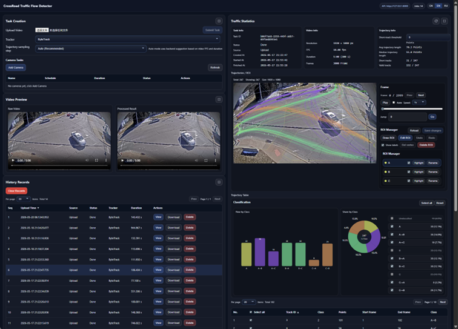

Рисунок 3.9 – главного интерфейса фронтенда

Примечание: Общая компоновка зон создания задач и управления камерами, превью видео, истории задач и аналитики статистики.

Область создания задач поддерживает два типа создания задач:

1. Офлайн-задачи с видео: пользователь загружает локальный видеофайл, компонент отправляет объект File на API создания задачи на сервере. После успешного ответа обновляется список исторических задач и начинается отслеживание состояния новой задачи.
2. Задачи с реальной камерой: пользователь настраивает имя камеры, поток RTSP/HTTP, длительность записи и расписание (выражение Cron), после чего система периодически создаёт задачи анализа согласно настройкам. Фронтенд подписывается на поток состояния задач через SSE для синхронного обновления состояния камерных задач; все задачи объединяются в список истории задач для управления.

Область истории задач отображает задачи в виде таблицы, поддерживая постраничный просмотр, сортировку, удаление отдельных задач и очистку всех записей. При клике на “Просмотр” задача становится текущей выбранной, что позволяет переключать области просмотра видео и аналитики на соответствующую задачу. После завершения задачи предоставляется возможность скачать результат видео. Для снижения риска случайных действий операции удаления и очистки снабжены подтверждением. Для минимизации нагрузки фронтенда обновление состояния задач преимущественно осуществляется через SSE: фронтенд подписывается на поток изменений, получаемых с сервера, и интегрирует их в локальный массив задач; если SSE недоступен, используется периодический опрос для сохранения устойчивости.

```javascript
useEffect(() => {
  loadJobs();
  const es = new EventSource('${apiBase}/api/jobs/stream');
  es.onmessage = (event) => {
    const updatedJob = JSON.parse(event.data);
    setJobs((prev) => {
      const next = [...prev];
      const idx = next.findIndex((j) => j.id === updatedJob.id);
      if (idx !== -1) next[idx] = { ...next[idx], ...updatedJob };
      return next;
    });
    setSelectedJob((prev) => (prev && prev.id === updatedJob.id ? { ...prev, ...updatedJob } : prev));
  };
  return () => es.close();
}, [loadJobs]);
```

Область просмотра видео организована в горизонтальном (бок о бок) макете: слева отображается исходное видео (предпросмотр локального Blob файла или MJPEG поток с камеры), справа — обработанное видео. Пока задача не завершена, правая область показывает текущий статус; после завершения автоматически включается плеер с результатом.

Область аналитики построена по вертикальному макету: сначала на основе данных, возвращаемых API сервера, отображаются карточки с базовой информацией о задаче, видео и траекториях. Далее в разделе визуализации траекторий фронтенд по API сервера получает изображения отдельных кадров по запросу и с помощью координат точек траектории накладывает линии траекторий, обеспечивая “покадровое воспроизведение + позиционирование траекторий”. Редактор ROI загружает список ROI текущей задачи с сервера и поддерживает добавление, редактирование и удаление. В разделе деталей траекторий выводятся таблицы с конкретной информацией о траекториях и диаграммы классификации, позволяя интерактивно анализировать поток транспорта на перекрёстке.

Кроме того, система поддерживает словари на трёх языках (zh/en/ru) и через React Context предоставляет глобально функцию перевода `t(key)` и возможность смены языка; выбранный язык сохраняется в localStorage, что позволяет сохранять предпочтения пользователя при обновлении страницы.

#### 3.2.6 Оптимизация производительности

Для обеспечения эффективности обработки и отзывчивости интерфейса применены инженерные оптимизации. Во-первых, Worker при запуске предварительно загружает и «разогревает» модель YOLO и переиспользует глобальный экземпляр детектора, исключая повторные загрузки. Во-вторых, траектории дискретизируются по шагу и ограничиваются по числу точек, снижая объём хранения и нагрузку рендеринга. В-третьих, выходное видео унифицируется транскодированием в H.264 с `faststart`, что уменьшает различия воспроизведения в браузерах. Кроме того, фронтенд использует SSE для инкрементальных обновлений статуса, снижая частоту опросов и повышая отзывчивость.

### 3.3 Вывод

В данной главе по двум основным линиям — «проектирование» и «реализация» — представлен полный цикл разработки системы детекции транспортных потоков на перекрёстках, от архитектуры до инженерного воплощения.

В первом разделе сформулированы общая архитектура, разделение модулей, диаграммы последовательности и поток данных, а также определены границы ответственности между компонентами: Web-сервис отвечает за оркестрацию задач и управление данными, Worker — за асинхронные вычисления компьютерного зрения, фронтенд — за взаимодействие и визуализацию. Это сформировало исполнимый инженерный план реализации.

Во втором разделе проект детализирован в набор реализуемых модулей: на уровне обработки видео система поддерживает загрузку и сбор с камер и использует унифицированную схему сохранения и транскодирования для стабильной покадровой обработки и совместимости воспроизведения; на уровне компьютерного зрения реализованы детекция на YOLOv8 и отслеживание ByteTrack, обеспечивающие устойчивые траектории; на уровне статистики реализовано разделение бэкенд-статистики и фронтенд-семантической классификации по ROI для адаптации к разным перекрёсткам и ракурсам; на уровне инженерной инфраструктуры задействованы очередь сообщений и конкурентное потребление Worker’ами, а SSE повышает качество обновления статуса на фронтенде, который реализован компонентно на React и поддерживает многоязычную локализацию. В совокупности проектирование и реализация подтверждают реализуемость предложенного решения и формируют основу для экспериментов и оценки производительности в главе 4.

## 4 ТЕСТИРОВАНИЕ И ЭКСПЕРИМЕНТЫ

В данной главе описываются тестирование и экспериментальная проверка системы. Цели тестирования включают: проверку корректности и устойчивости функциональной цепочки; оценку качества детекции, отслеживания и подсчёта потоков на реальных дорожных видео; анализ эффективности обработки, ресурсопотребления и стабильности при длительной работе в условиях локального развёртывания на одной машине и с одним Worker. Для обеспечения воспроизводимости сначала описывается тестовое окружение и источники данных, затем выполняются функциональные тесты, поэтапные эксперименты по алгоритмам и тесты производительности, после чего формулируются выводы.

### 4.1 Тестовое окружение и набор данных

Эксперименты выполнялись в фиксированном программно-аппаратном окружении. Аппаратная платформа — мобильная рабочая станция с дискретной видеокартой, что соответствует типичному сценарию «одна машина + GPU-инференс». Конфигурация приведена в таблице:

Таблица 4.1 – Аппаратная конфигурация экспериментальной платформы

| Аппаратный компонент | Параметры                                          |
| --------------------------------------- | ----------------------------------------------------------- |
| CPU                                     | 13th Gen Intel(R) Core(TM) i9-13980HX (2.20 GHz)            |
| GPU                                     | Nvidia GeForce RTX 4080 Laptop, видеопамять 12GB |
| ОЗУ                                  | 2×16GB                                                     |
| Операционная система | Windows 11 Pro                                              |

В программной части Python 3.10 используется для бэкенда и модуля компьютерного зрения; фронтенд реализован на React 5.0.1 и обращается к локально развёрнутому сервису FastAPI через браузер. Ключевые зависимости и версии определены в конфигурации проекта; основные зависимости приведены ниже:

Таблица 4.2 – Основные программные библиотеки и версии зависимостей

| Категория                    | Пакет      | Ограничение/версия |
| ------------------------------------- | --------------- | ----------------------------------- |
| Бэкенд                          | FastAPI         | >=0.110,<1.0                        |
| Бэкенд                          | Uvicorn         | >=0.27,<1.0                         |
| Бэкенд                          | SQLAlchemy      | >=2.0,<3.0                          |
| Бэкенд                          | psycopg         | >=3.1,<4.0                          |
| Бэкенд                          | APScheduler     | >=3.10,<4.0                         |
| Бэкенд                          | stomp.py        | >=8.1,<9.0                          |
| Компьютерное зрение | opencv-python   | >=4.10,<5.0                         |
| Фреймворк DL                 | torch (Windows) | 2.4.1+cu121                         |
| Детекция                      | ultralytics     | >=8.4,<9.0                          |

Развёртывание выполнялось локально: сервис FastAPI, БД и очередь сообщений работают на одной машине; обработка выполнялась одним экземпляром Worker для точного измерения времени обработки. В этом режиме ключевые временные точки жизненного цикла задачи фиксируются в базе (created_at, started_at, finished_at), что позволяет разделять время ожидания в очереди и фактическое время обработки.

В части данных офлайн-эксперименты выполнены на публичных видео из 2020 AI City Challenge Dataset[^36] Track 1, представляющих различные городские сцены. Дополнительно для функциональных тестов использованы два публичных потока JPEG с сетевых камер для проверки цепочки подключения, предпросмотра и записи[^38].

Таблица 4.3 – Сводная информация о тестовых видеоданных

| Видео                                | Тип перекрёстка | Разрешение | FPS | Длительность (с) | Примечание                                                                                                           |
| ----------------------------------------- | ----------------------------- | -------------------- | --- | ----------------------------- | ------------------------------------------------------------------------------------------------------------------------------ |
| cam_1.mp4                                 | Т                            | 1280×960            | 10  | 300                           | частичное перекрытие деревьями                                                                     |
| cam_1_dawn.mp4                            | Т                            | 1280×960            | 10  | 300                           | частичное перекрытие деревьями, слабая освещённость, контровой свет |
| cam_1_rain.mp4                            | Т                            | 1280×960            | 10  | 296                           | частичное перекрытие деревьями, блики на дороге                                       |
| cam_2.mp4                                 | X                             | 1280×960            | 15  | 1800                          | утренний пик, выраженные перекрытия, дальние малые цели                         |
| cam_2_dawn.mp4                            | X                             | 1280×960            | 15  | 300                           | мало света, дальние малые цели                                                                        |
| cam_2_rain.mp4                            | X                             | 1280×960            | 10  | 300                           | дальние малые цели, блики на дороге                                                               |
| cam_3.mp4                                 | X                             | 1280×960            | 10  | 1800                          | обычное качество, без сильных помех                                                              |
| Продолжение таблицы 4.3 |                               |                      |     |                               |                                                                                                                                |
| cam_3_snow.mp4                            | X                             | 1280×960            | 10  | 300                           | снег на дороге                                                                                                     |
| cam_4.mp4                                 | Y                             | 1920×1080           | 10  | 300                           | равномерные потоки, мало перекрытий                                                             |
| cam_5.mp4                                 | X                             | 1920×1080           | 10  | 300                           | без аномалий, стандартная сцена                                                                     |

Примечание: тип перекрёстка обозначает геометрию дорожного перекрёстка: «Т» — Т-образный перекрёсток; «X» — четырёхсторонний крестообразный перекрёсток; «Y» — Y-образный перекрёсток с разветвлением направлений движения.

### 4.2 Функциональное тестирование

Цель функционального тестирования — проверить соответствие требованиям главы 2 и корректность поведения ключевых цепочек при нормальных и аномальных входных условиях. Поскольку система построена на асинхронной архитектуре «Web-сервис + очередь сообщений + Worker», тестирование охватывает не только пользовательский интерфейс, но и REST API, переходы состояний задач и корректность формирования выходных данных.

Для обеспечения воспроизводимости сценариев тестирование проводилось как через веб-интерфейс, так и через автоматически сгенерированную документацию OpenAPI FastAPI (`/docs`).

Функциональные тесты разделены на пять категорий:

1. Цепочка загрузки видео (создание задачи, переходы статусов, получение статистики и воспроизведение результата);
2. Цепочка камер (создание камеры, Cron-планирование, статусы задач записи и постановка в очередь анализа);
3. Управление ROI (CRUD и проверка корректности);
4. Предпросмотр в реальном времени (MJPEG) и получение снимков;
5. Ошибки и отказоустойчивость (недоступность очереди, отсутствие входного файла, отсутствие результата и т. п.).

Ожидаемое поведение системы при обработке задач видеозагрузки заключается в последовательном переходе статусов (`created → running → done`). После завершения обработки API `/api/jobs/{id}/stats` должен возвращать структурированный JSON-объект, включающий `frame_count`, `unique_ids_by_class` и `trajectories`, а `/api/jobs/{id}/result` — корректно воспроизводимый видеофайл формата MP4.

В сценарии работы с камерами после создания сущности через `/api/cameras` и активации планировщика Cron система автоматически формирует задачу записи со статусом recording. После завершения записи задача преобразуется в стандартную задачу обработки и проходит полный конвейер обработки (`created → running → done`).

В части управления ROI система накладывает ограничения на корректность входных данных: имя ROI должно соответствовать формату (буквы, цифры, подчёркивание), а полигон должен содержать не менее трёх точек. Любые изменения ROI немедленно отражаются в результатах классификации на фронтенде.
Для режима предпросмотра `/api/cameras/{id}/preview/raw` должен обеспечивать непрерывную передачу MJPEG-потока, тогда как `/api/cameras/{id}/snapshot` возвращает одиночный JPEG-кадр, используемый для разметки и настройки ROI.

При проверке устойчивости системы при возникновении ошибок установлено, что при недоступности очереди сообщений API возвращает код `503`, а при отсутствии файлов данных — код `404` с поясняющим сообщением. При этом система сохраняет работоспособность остальных модулей и не допускает критических сбоев.

Результаты тестирования зафиксированы в таблице тест-кейсов, включающей идентификатор теста, проверяемый модуль, входные данные, последовательность шагов и ожидаемый результат.

Таблица 4.4 – Тест‑кейсы функционального тестирования

| ID теста | Модуль                                                         | Входные данные                               | Шаги                                                                                                                                                                                                                                        | Ожидаемый результат                                                                                                                                    |
| ------------- | -------------------------------------------------------------------- | --------------------------------------------------------- | ----------------------------------------------------------------------------------------------------------------------------------------------------------------------------------------------------------------------------------------------- | ------------------------------------------------------------------------------------------------------------------------------------------------------------------------ |
| FT-01         | Цепочка загрузки задачи                         | Локальное MP4 видео                         | 1) вызвать `/api/jobs` для загрузки; 2) в списке задач наблюдать статус; 3) дождаться завершения; 4) запросить `/api/jobs/{id}/stats` и `/api/jobs/{id}/result` | Статус `created→running→done`; `stats` возвращает JSON; `result` (MP4) воспроизводится                                            |
| FT-02         | Цепочка загрузки (удаление)                   | Завершённая задача                       | 1) вызвать `/api/jobs/{id}` (DELETE); 2) обновить список                                                                                                                                                                 | Запись задачи удалена; входной/выходной файлы очищены; повторный доступ возвращает 404            |
| FT-03         | Цепочка камеры (создание и включение) | URL камеры + cron                                   | 1) создать и включить через `/api/cameras`; 2) дождаться срабатывания cron или вызвать `/api/cameras/{id}/trigger`                                                                      | Создаётся задача записи; появляется статус `recording`; по завершении запись ставится в очередь |
| FT-04         | Цепочка камеры (от записи к анализу)    | Активная камера                             | 1) дождаться завершения записи; 2) наблюдать смену статусов                                                                                                                                      | Статус `recording→created→running→done`; выходное видео и `stats` доступны                                                            |
| FT-05         | Управление ROI (создание)                          | Имя ROI и вершины многоугольника | 1) нарисовать ROI в статистическом интерфейсе; 2) сохранить; 3) обновить список ROI                                                                                                   | ROI создаётся; имя/точки валидируются; метки классификации обновляются                                         |
| FT-06         | Управление ROI (некорректный ввод)         | Некорректное имя ROI / < 3 вершин    | 1) ввести некорректное имя или < 3 точек; 2) попытаться сохранить                                                                                                                               | Возвращается 400; фронтенд показывает ошибку; ROI не записывается                                                      |
| FT-07         | Предпросмотр в реальном времени          | raw‑поток камеры                              | 1) открыть `/api/cameras/{id}/preview/raw`; 2) наблюдать обновление                                                                                                                                                 | Браузер непрерывно показывает MJPEG; без явных зависаний                                                                     |
| FT-08         | Снимок                                                         | snapshot камеры                                     | 1) открыть `/api/cameras/{id}/snapshot`                                                                                                                                                                                                | Возвращается JPEG; может использоваться для разметки ROI                                                                       |
| FT-09         | Ошибка (MQ недоступна)                               | Остановить ActiveMQ                             | 1) остановить очередь; 2) создать задачу через `/api/jobs`                                                                                                                                                 | Возвращается 503; задача помечается как неуспешная и фиксируется причина                                     |
| FT-10         | Ошибка (файл отсутствует)                       | Удалить вход/выход                        | 1) удалить файлы задачи; 2) открыть `/api/jobs/{id}/input` или `/result`                                                                                                                                        | Возвращается 404 (`input_missing_on_disk` / `result_missing`)                                                                                            |

После выполнения серии функциональных тестов установлено, что система корректно реализует все требования, сформулированные в главе 2. Все ключевые сценарии — обработка видео, работа с камерами, управление ROI, визуализация результатов и получение статистики — функционируют стабильно. В условиях отказов внешних компонентов система корректно возвращает диагностические коды ошибок и сохраняет работоспособность остальных модулей, что подтверждает её устойчивость и готовность к эксплуатации в реальных условиях.

### 4.3 Оценка детекции объектов

В этом разделе оценивается качество детекции транспортных средств на видеозаписях перекрёстков. Процедура тестирования соответствует инженерному сценарию последующего подсчёта потоков: для 10 тестовых видеороликов выполняется равномерная выборка фиксированного числа кадров с заданным шагом по времени/кадрам, а также задаётся постоянная область интереса ROI. На этапе разметки вручную аннотируются только объекты внутри ROI; при оценке учитываются только предсказанные рамки внутри ROI (по критерию попадания центра рамки внутрь ROI), что исключает фоновые помехи и согласует метрики детекции с пространственным охватом, релевантным итоговой статистике потоков. По выборке кадров вычисляются TP, FP, FN и производные метрики Precision, Recall и F1-score для сравнения качества детекции в разных условиях (структура перекрёстка, плотность потока, освещение/погода).

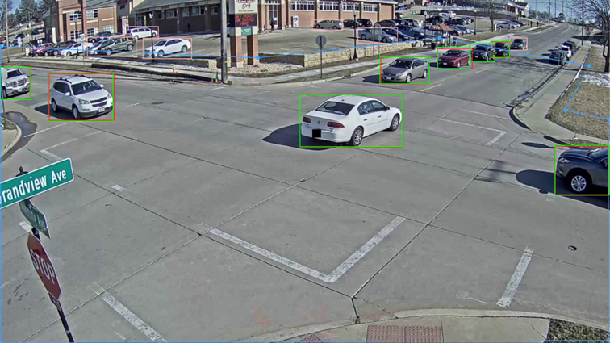

Рисунок 4.1 – Визуализация результатов детекции

Примечание: красные рамки — детекции системы, зелёные рамки — ручная разметка GT, синим выделена фиксированная область ROI. При расчёте метрик учитываются только объекты внутри ROI.

Таблица 4.5 – Оценка качества детекции

| Видео/сцена | Число кадров | TP  | FP | FN | Precision % | Recall% | F1 %  |
| --------------------- | ----------------------- | --- | -- | -- | ----------- | ------- | ----- |
| cam_1.mp4             | 30                      | 121 | 2  | 32 | 98.37       | 79.08   | 87.68 |
| cam_1_dawn.mp4        | 30                      | 68  | 0  | 23 | 100.00      | 74.73   | 85.53 |
| cam_1_rain.mp4        | 30                      | 76  | 1  | 34 | 98.70       | 69.09   | 81.28 |
| cam_2.mp4             | 30                      | 202 | 4  | 61 | 98.06       | 76.81   | 86.14 |
| cam_2_dawn.mp4        | 30                      | 227 | 2  | 19 | 99.13       | 92.28   | 95.58 |
| cam_2_rain.mp4        | 30                      | 184 | 2  | 43 | 98.92       | 81.06   | 89.10 |
| cam_3.mp4             | 30                      | 188 | 2  | 29 | 98.95       | 86.64   | 92.38 |
| cam_3_snow.mp4        | 30                      | 71  | 1  | 7  | 98.61       | 91.03   | 94.67 |
| cam_4.mp4             | 30                      | 182 | 1  | 22 | 99.45       | 89.22   | 94.06 |
| cam_5.mp4             | 30                      | 178 | 8  | 5  | 95.70       | 92.27   | 96.48 |
| Среднее        |                         |     |    |    | 98.59       | 83.22   | 90.29 |

Поскольку обучение модели, ориентированное на сценарии видеонаблюдения на перекрёстках, не проводилось, в некоторых случаях наблюдаются ложные срабатывания и пропуски объектов — особенно на краях кадра, для удалённых объектов с низким разрешением, а также в условиях высокой плотности и сильных перекрытий. Однако в целом результаты детекции объектов являются приемлемыми. В дальнейшем точность детекции и подсчёта может быть повышена за счёт сбора и разметки данных целевой области, а также применения дообучения или методов адаптации домена.

### 4.4 Оценка подсчёта потоков

В данном разделе в качестве тестового образца используется 30-минутное видео для оценки точности системы при подсчёте транспортных потоков по направлениям в условиях непрерывного временного интервала. Для согласования правил ручного подсчёта с логикой формирования направлений системой используется схема нумерации направлений, представленная слева на Рисунке 4.2. После выполнения детекции и последующей визуализации с наложением траекторий были получены результаты, представленные справа на Рисунке 4.2.

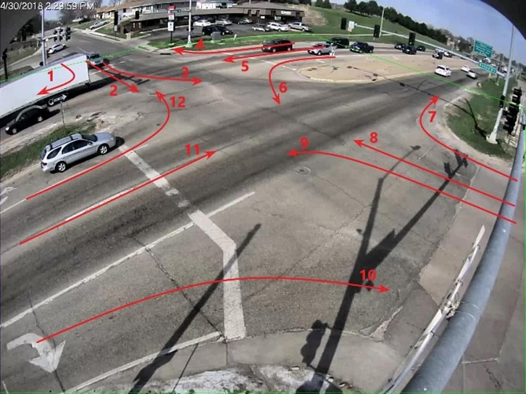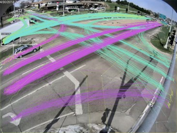

Рисунок 4.2 – Схема направлений и визуализация результата

Примечание: слева показаны пронумерованные направления на перекрёстке; справа отображены рамки детекции транспортных средств, идентификаторы отслеживания (ID) и траектории на кадре, демонстрирующие результат работы системы после этапов детекции и трекинга.

Для каждого направления фиксируются значения ручного подсчёта $GT_i$ и значения, полученные системой, $Pred_i$. Далее по каждому направлению рассчитываются абсолютная ошибка

$$
E_i=\lvert Pred_i-GT_i\rvert
$$

и относительная ошибка

$$
PE_i=\frac{\lvert Pred_i-GT_i\rvert}{GT_i}\times 100\%
$$

На уровне суммарного потока вводятся $Pred=\sum Pred_i$ и $GT=\sum GT_i$, после чего вычисляется общий коэффициент ошибки (Overall Percentage Error, OPE)

$$
OPE=\frac{1}{GT}\sum_i^N\lvert Pred_i-GT_i\rvert\times100\%
$$

и средняя ошибка по направлениям(Mean Absolute Percentage Error, MAPE)

$$
MAPE=\frac{1}{N}\sum_i^N\frac{\lvert Pred_i-GT_i\rvert}{GT_i}\times100\%
$$

где $N$ — количество направлений. Эти показатели позволяют оценить как распределение ошибок по отдельным направлениям, так и общий системный сдвиг в итоговом подсчёте.

Таблица 4.6 – Ошибки подсчёта по направлениям для cam_4
Примечание: приводятся $GT_i$, $Pred_i$, абсолютная и относительная ошибки; дополнительно указываются итоговые $OE$ и $MAPE$.

| Направление | $GT_i$              | $Pred_i$ | $E_i$ | $PE_i$ |
| ---------------------- | --------------------- | ---------- | ------- | -------- |
| 1                      | 64                    | 42         | 22      | 34.75%   |
| 2                      | 21                    | 19         | 2       | 9.52%    |
| 3                      | 40                    | 38         | 2       | 5.00%    |
| 4                      | 61                    | 60         | 1       | 1.39%    |
| 5                      | 826                   | 738        | 88      | 10.65%   |
| 6                      | 27                    | 27         | 0       | 0.00%    |
| 7                      | 21                    | 21         | 0       | 0.00%    |
| 8                      | 24                    | 22         | 2       | 8.33%    |
| 9                      | 43                    | 42         | 1       | 2.33%    |
| 10                     | 43                    | 42         | 1       | 2.33%    |
| 11                     | 628                   | 627        | 1       | 0.16%    |
| 12                     | 32                    | 32         | 0       | 3.13%    |
| Итого             | 1830                  | 1691       | 139     | -        |
| $OPE\approx 6.56\%$  | $MAPE\approx6.19\%$ |            |         |          |

Из результата следует, что при использовании предобученных весов система демонстрирует отличия от результатов ручного подсчёта. Наибольшие расхождения, как правило, возникают на границах кадра, для дальних целей с низким разрешением, а также в сценах с сильными перекрытиями и окклюзиями (например, направления 1 и 5). Вместе с тем система уже способна стабильно выдавать достаточно точные значения потоков по направлениям, а суммарная ошибка остаётся в приемлемых пределах, что указывает на начальную возможность инженерного применения.

### 4.5 Тестирование производительности

Тестирование производительности предназначено для оценки эффективности обработки, ресурсопотребления и долговременной стабильности работы системы в условиях локального развёртывания на одной машине и с одним Worker, а также анализа поведения при непрерывном поступлении задач (например, от планировщика камер) или при высоком потоке входных задач (быстрая загрузка нескольких видео). Результаты важны не только для подтверждения пригодности системы, но и для обоснования архитектурных решений по асинхронной развязке и расширяемости, представленных в главе 3.

В тестах эффективности выбраны 10 видеороликов из тестового набора (Таблица 4.3), различающихся по длительности, разрешению и частоте кадров. Для каждой задачи фиксируются фактическое время обработки и «коэффициент реального времени». Время обработки определяется как разница между моментами завершения и начала обработки (`finished_at` - `started_at`), а коэффициент реального времени — как отношение длительности видео к времени обработки (`video_duration / (finished_at - started_at`)), что позволяет оценить возможность квазиреального времени при текущей конфигурации.

Таблица 4.7 – Результаты тестирования производительности

Примечание: для 10 видеороликов приведены разрешение, FPS, длительность/число кадров, фактическое время обработки и коэффициент реального времени

| Видео     | Разрешение | FPS | Длительность (с) | Обработка (с) | Реал тайм (длит./обр.) |
| -------------- | -------------------- | --- | ----------------------------- | ----------------------- | ------------------------------------- |
| cam_1.mp4      | 1280×960            | 10  | 300                           | 112.255                 | 2.67×                                |
| cam_1_dawn.mp4 | 1280×960            | 10  | 300                           | 85.529                  | 3.51×                                |
| cam_1_rain.mp4 | 1280×960            | 10  | 296                           | 81.626                  | 3.63×                                |
| cam_2.mp4      | 1280×960            | 15  | 1800                          | 746.022                 | 2.41×                                |
| cam_2_dawn.mp4 | 1280×960            | 15  | 300                           | 148.368                 | 2.02×                                |
| cam_2_rain.mp4 | 1280×960            | 10  | 300                           | 100.001                 | 3.00×                                |
| cam_3.mp4      | 1280×960            | 10  | 1800                          | 551.306                 | 3.26×                                |
| cam_3_snow.mp4 | 1280×960            | 10  | 300                           | 77.100                  | 3.89×                                |
| cam_4.mp4      | 1920×1080           | 10  | 300                           | 106.404                 | 2.82×                                |
| cam_5.mp4      | 1920×1080           | 10  | 300                           | 111.930                 | 2.68×                                |
| Среднее | -                    | -   | -                             | -                       | 2.99×                                |

Согласно приведённым выше результатам, средний коэффициент обработки в реальном времени для 10 видеозаписей различных сцен составил 2,99×, то есть время обработки составило примерно одну треть от фактической длительности видео. Данный результат показывает, что даже при развертывании на одном вычислительном узле система сохраняет высокую эффективность.

По сравнению с трудоёмким процессом ручного просмотра видеозаписей и подсчёта транспортных потоков по различным направлениям, предложенная система способна автоматически выполнять задачи детекции, отслеживания и статистического анализа со скоростью, значительно превышающей человеческие возможности. Это существенно снижает временные затраты и трудоёмкость ручного подсчёта, что в полной мере подтверждает высокую эффективность и практическую ценность системы в задачах сбора транспортных данных.

В тесте ресурсопотребления выполняется количественная фиксация загрузки CPU, памяти и GPU в процессе выполнения задач инференса, чтобы оценить, насколько «управляемыми» остаются ресурсы при развёртывании на одной машине с одним Worker. Поскольку конвейер включает декодирование видео, инференс модели, наложение визуализации и запись результатов на диск, временные ряды ресурсов также помогают интерпретировать возможные узкие места. Использовались следующие инструменты и настройки:

Во‑первых, системные метрики CPU и памяти собирались средствами Windows Performance Monitor (PerfMon) с периодом дискретизации 1 с. Для CPU фиксировались показатели на двух уровнях:

- Общесистемный: `Processor(_Total)\% Processor Time`
- Процессный: `Process(python*)\% Processor Time`, а также показатели памяти `Working Set` для процессов Worker/бэкенда.

На этапе анализа значения нескольких python‑процессов агрегировались, что позволило получить временные ряды:

- Суммарная загрузка CPU процессами системы
- Суммарное потребление памяти процессами системы.

Во‑вторых, метрики GPU собирались с помощью `nvidia-smi` с периодом 1s . Фиксировались: загрузка GPU, использование VRAM (используемое/общее). Использовалась команда:

```bash
nvidia-smi --query-gpu=timestamp,name,utilization.gpu,utilization.memory,memory.used,memory.total,power.draw,temperature.gpu --format=csv -l 1 > gpu_log.csv
```

Чтобы наглядно представить полный сценарий тестирования и унифицировать шкалу времени, в качестве 00:00 принимался момент начала записи, а анализ выполнялся на интервале 00:00–20:05. На графиках отмечались ключевые действия в ходе теста: в 01:16 запускалась и начинала обрабатываться задача инференса cam_5; после завершения обработки cam_5 в 04:20 запускалась и начинала обрабатываться задача инференса cam_2; после завершения обработки cam_2 запись останавливалась. Далее логи выгружались, временная ось выравнивалась, и строились графики скриптом; в итоге получены графики CPU & RAM и GPU, показанные ниже.

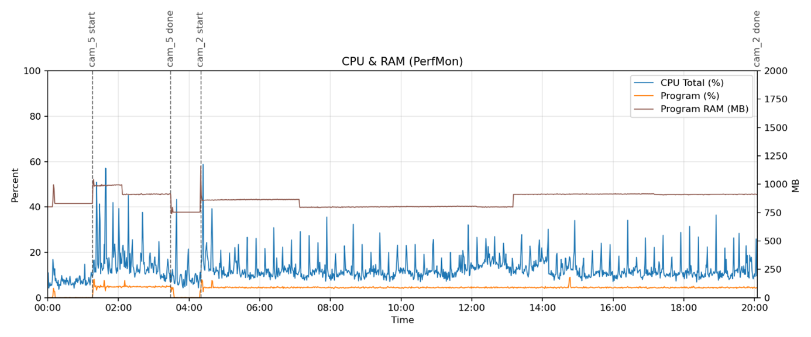

Рисунок 4.4 – График ресурсов CPU & RAM

Примечание: по оси X — относительное время; по левой оси — загрузка CPU (общая система и суммарная по процессам ПО), по правой оси — суммарный RAM (by Woking set) процессов системы (MB). Серые пунктирные линии обозначают ключевые временные отметки обработки задач.

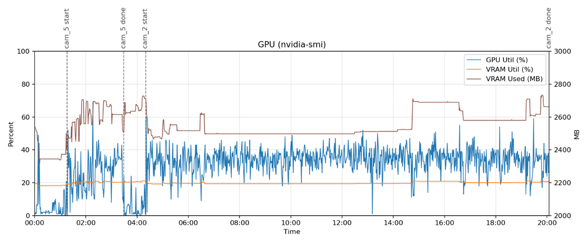

Рисунок 4.5 – График ресурсов GPU

Примечание: по оси X — относительное время; показаны общая загрузка GPU, суммарное потребление видеопамяти (MB) и доля занятой видеопамяти. Серые пунктирные линии обозначают ключевые временные отметки обработки задач.

По характеру изменения временных рядов видно, что нагрузка CPU/GPU и потребление памяти возрастают при запуске обработки и возвращаются к более низким значениям после завершения задач; при этом признаки аномального монотонного роста памяти не наблюдаются. Это указывает, что при выбранном сценарии непрерывной подачи задач ресурсоёмкость системы в целом контролируема и система пригодна для базового инженерного использования.

В длительном тестировании стабильности в качестве основного источника нагрузки используется сценарий «Cron‑планирование камер»: заранее настраивается набор камерных задач (с различными периодами запуска и длительностью записи), после чего система непрерывно работает в течение продолжительного времени, регулярно создавая и обрабатывая задания анализа. В ходе теста контролируются корректность переходов статусов (`recording→created→running→done/failed`), отсутствие устойчивого роста очереди задач, непрерывная доступность API, а также доступность выходного видео и статистики после завершения задач. Дополнительно наблюдаются признаки деградации по ресурсам (например, непрерывный рост потребления памяти или аномальное увеличение числа потоков) и проверяется восстановление цепочки записи/обработки при кратковременных сетевых сбоях источника.

По совокупности наблюдений сделан вывод, что при длительной непрерывной работе планирование и асинхронная обработка остаются стабильными, задачи корректно завершаются и сервис сохраняет работоспособность, что подтверждает способность системы к длительному стабильному функционированию.

### 4.6 Вывод

В данной главе выполнено проектирование и проведение тестов и экспериментов, направленных на оценку пригодности и надёжности системы. Сначала описаны условия окружения и режим локального развёртывания с одним Worker, обеспечивающие воспроизводимость результатов. Затем функциональные тесты, охватывающие цепочки загрузки, камер, управления ROI, предпросмотра и обработки ошибок, подтвердили корректность полного бизнес-цикла от ввода видео до выдачи результата. Далее эксперименты разделены на оценку детекции и оценку подсчёта потоков: качество детекции оценивается на выборке кадров из 10 видеороликов с фиксированным ROI и расчётом TP/FP/FN и Precision/Recall/F1-score; точность подсчёта потоков проверяется на длительной записи cam_4 (30 минут) путём сопоставления значений по направлениям и расчёта $OE$ и $MAPE$. Наконец, тесты эффективности, ресурсопотребления и долгосрочной стабильности обеспечили количественную основу для дальнейшей оптимизации и расширения. В перспективе целесообразно расширить оценку на более крупные наборы данных и более сложные погодные/ночные сцены, а также проверить масштабирование пропускной способности при многопроцессном развёртывании нескольких Worker.

## ЗАКЛЮЧЕНИЕ

Для задач управления дорожным движением на перекрёстках получение точных и своевременных данных о транспортных потоках является ключевым условием оптимизации светофорного регулирования. В отличие от традиционных датчиков (индукционные петли, радар и т. п.), подход на основе видеонаблюдения и методов компьютерного зрения позволяет извлекать более богатую информацию без вмешательства в дорожную инфраструктуру. В рамках работы решена задача детекции и анализа транспортных средств на перекрёстках: выполнен анализ требований, спроектирована архитектура, реализована программная система и проведена экспериментальная проверка.

С методической точки зрения система опирается на YOLOv8 для детекции транспортных средств и ByteTrack для MOT, что обеспечивает устойчивую межкадровую ассоциацию и формирование траекторий в сложных сценах. Для получения статистики по направлениям реализован интерпретируемый механизм семантической классификации на основе пользовательских ROI: по порядку входа траектории в области ROI формируется метка маршрута, после чего выполняется агрегация и подсчёт потоков. Такой подход позволяет адаптировать систему к различным типам перекрёстков и ракурсам камер за счёт перенастройки ROI, сохраняя прозрачность логики подсчёта.

С инженерной точки зрения система реализована в архитектуре разделённого фронтенда и бэкенда с асинхронной обработкой задач. Фронтенд на React обеспечивает создание задач, предпросмотр видео, разметку ROI и визуализацию статистики, включая многоязычный интерфейс. Бэкенд на FastAPI предоставляет API для управления задачами, камерами и ROI, а также отдачи видео и статистики; для повышения отзывчивости используется SSE. Вычислительно затратный анализ видео развязан с Web‑взаимодействием через очередь ActiveMQ и Worker‑процесс, который выполняет инференс, генерацию выходного видео, запись статистики и обновление статусов. Единая стратегия транскодирования обеспечивает совместимость воспроизведения результатов в браузере.

Экспериментальная часть включает проверку функциональной корректности, оценку эффективности детекции транспортного потока и оценку производительности системы. Функциональные тесты подтвердили корректность полного цикла «ввод → обработка → выдача результата» для сценариев загрузки видео, планирования камер, управления ROI и обработки ошибок. Эксперименты по детекции потока включали проверку качества детекции транспортных средств и итоговой статистики по направлениям; путём сопоставления с ручным подсчётом оценивалась применимость результатов системы. Тестирование производительности проводилось по трём направлениям: эффективность обработки, ресурсопотребление и долговременная стабильность, что подтверждает высокую скорость обработки, контролируемые ресурсы и способность системы к продолжительной стабильной работе в конфигурации «одна машина, один Worker».

Перспективы дальнейшего развития включают повышение робастности в ночных и неблагоприятных погодных условиях за счёт расширения тренировочных данных и усиления моделей детекции/отслеживание; снижение зависимости от ручной разметки ROI с помощью детекции полос, перспективной нормализации координат и более автоматизированного моделирования направлений; а также масштабирование инженерной части (несколько Worker, приоритизация задач, расширение хранения) для сценариев массового подключения источников. В целом получена работоспособная и расширяемая система детекции транспортных потоков, реализующая полный конвейер от видео до визуализируемой статистики по направлениям и также вносит вклад в дальнейшие исследования в области оптимизации светофорного регулирования и развития интеллектуальных транспортных систем.

## СПИСОК ИСПОЛЬЗОВАННЫХ ИСТОЧНИКОВ

[^1]: Zhang K., Batterman S. Air pollution and health risks due to vehicle traffic // Sci. Total Environ. 2013. Т. 450–451. С. 307–316.
    
[^2]: Schrank D., Eisele B., Lomax T. Urban Mobility Report 2019. 2019.
    
[^3]: Systematics C. Traffic congestion and reliability: Trends and advanced strategies for congestion mitigation // Fed. Highw. Adm. 2005. Т. 6.
    
[^4]: Elefteriadou L. The Highway Capacity Manual (HCM) and Its Methods // An Introduction to Traffic Flow Theory / под ред. Elefteriadou L. Cham: Springer International Publishing, 2024. С. 143–152.
    
[^5]: Leduc G. Road Traffic Data: Collection Methods and Applications. 2008.
    
[^6]: Buch N., Velastin S. A., Orwell J. A Review of Computer Vision Techniques for the Analysis of Urban Traffic // IEEE Trans. Intell. Transp. Syst. 2011. Т. 12, № 3. С. 920–939.
    
[^7]: Neirotti P. и др. Current trends in Smart City initiatives: Some stylised facts // Cities. 2014. Т. 38. С. 25–36.
    
[^8]: Guerrero-Ibáñez J., Zeadally S., Contreras-Castillo J. Sensor Technologies for Intelligent Transportation Systems // Sensors. Multidisciplinary Digital Publishing Institute, 2018. Т. 18, № 4. С. 1212.
    
[^9]: Peeta S., Ziliaskopoulos A. K. Foundations of Dynamic Traffic Assignment: The Past, the Present and the Future // Netw. Spat. Econ. 2001. Т. 1, № 3. С. 233–265.
    
[^10]: Klein L. A., Mills M. K., Gibson D. R. P. Traffic Detector Handbook: Third Edition - Volume I: FHWA-HRT-06-108. 2006.
    
[^11]: Yu X., Prevedouros P. D. Performance and Challenges in Utilizing Non-Intrusive Sensors for Traffic Data Collection // Adv. Remote Sens. Scientific Research Publishing, 2013. Т. 2, № 2. С. 45–50.
    
[^12]: Mir F. и др. The Sensor Dilemma in Intelligent Transportation Systems: Evaluating Radar, Lidar, and Camera. American Society of Civil Engineers, 2025. С. 610–621.
    
[^13]: Chen J. и др. A Review of Vision-Based Traffic Semantic Understanding in ITSs // IEEE Trans. Intell. Transp. Syst. 2022. Т. 23, № 11. С. 19954–19979.
    
[^14]: Stauffer C., Grimson W. E. L. Adaptive background mixture models for real-time tracking // Proceedings. 1999 IEEE Computer Society Conference on Computer Vision and Pattern Recognition (Cat. No PR00149). 1999. Т. 2. С. 246-252 Vol. 2.
    
[^15]: Sun D., Roth S., Black M. J. Secrets of optical flow estimation and their principles // 2010 IEEE Computer Society Conference on Computer Vision and Pattern Recognition. 2010. С. 2432–2439.
    
[^16]: Cucchiara R. и др. Detecting moving objects, ghosts, and shadows in video streams // IEEE Trans. Pattern Anal. Mach. Intell. 2003. Т. 25, № 10. С. 1337–1342.
    
[^17]: Piccardi M. Background subtraction techniques: a review // 2004 IEEE international conference on systems, man and cybernetics (IEEE Cat. No. 04CH37583). IEEE, 2004. Т. 4. С. 3099–3104.
    
[^18]: Barron J. L., Fleet D. J., Beauchemin S. S. Performance of optical flow techniques // Int. J. Comput. Vis. 1994. Т. 12, № 1. С. 43–77.
    
[^19]: Dalal N., Triggs B. Histograms of oriented gradients for human detection // 2005 IEEE Computer Society Conference on Computer Vision and Pattern Recognition (CVPR’05). 2005. Т. 1. С. 886–893 т. 1.
    
[^20]: Viola P., Jones M. Rapid object detection using a boosted cascade of simple features // Proceedings of the 2001 IEEE Computer Society Conference on Computer Vision and Pattern Recognition. CVPR 2001. 2001. Т. 1. С. I–I.
    
[^21]: Zou Z. и др. Object Detection in 20 Years: A Survey // Proc. IEEE. 2023. Т. 111, № 3. С. 257–276.
    
[^22]: Luo W. и др. Multiple object tracking: A literature review // Artif. Intell. 2021. Т. 293. С. 103448.
    
[^23]: Pal S. K. и др. Deep learning in multi-object detection and tracking: state of the art // Appl. Intell. 2021. Т. 51, № 9. С. 6400–6429.
    
[^24]: Ciaparrone G. и др. Deep learning in video multi-object tracking: A survey // Neurocomputing. 2020. Т. 381. С. 61–88.
    
[^25]: Deep learning | Nature [Электронный ресурс]. URL: https://www.nature.com/articles/nature14539 (дата обращения: 20.05.2026).
    
[^26]: Redmon J. и др. You Only Look Once: Unified, Real-Time Object Detection. 2016. С. 779–788.
    
[^27]: Zhang Y. и др. ByteTrack: Multi-object Tracking by Associating Every Detection Box // Computer Vision – ECCV 2022 / под ред. Avidan S. и др. Cham: Springer Nature Switzerland, 2022. С. 1–21.
    
[^28]: Harris C. R. и др. Array programming with NumPy // Nature. Nature Publishing Group, 2020. Т. 585, № 7825. С. 357–362.
    
[^29]: Paszke A. и др. PyTorch: An Imperative Style, High-Performance Deep Learning Library // Advances in Neural Information Processing Systems. Curran Associates, Inc., 2019. Т. 32.
    
[^30]: Abadi M. и др. TensorFlow: A System for Large-Scale Machine Learning. 2016. С. 265–283.
    
[^31]: Bradski G. The OpenCV Library. // Dr Dobbs J. Softw. Tools Prof. Program. 2000. Т. 25, № 11. С. 120–123.
    
[^32]: Ren S. и др. Faster R-CNN: Towards Real-Time Object Detection with Region Proposal Networks // Advances in Neural Information Processing Systems. Curran Associates, Inc., 2015. Т. 28.
    
[^33]: Bewley A. и др. Simple online and realtime tracking // 2016 IEEE International Conference on Image Processing (ICIP). 2016. С. 3464–3468.
    
[^34]: Wojke N., Bewley A., Paulus D. Simple online and realtime tracking with a deep association metric // 2017 IEEE International Conference on Image Processing (ICIP). 2017. С. 3645–3649.
    
[^35]: Jocher G., Chaurasia A., Qiu J. Ultralytics YOLO (version 8.0. 0)[computer software]. 2023.
    
[^36]: 2020 Data and Evaluation – AI CITY CHALLENGE [Электронный ресурс]. URL: https://www.aicitychallenge.org/2020-data-and-evaluation/ (дата обращения: 20.05.2026).
    
[^37]: Public online webcam 1 [Электронный ресурс]. URL: http://86.127.212.219/cgi-bin/faststream.jpg?stream=half&fps=15&rand=COUNTER (дата обращения: 21.05.2026).
    
[^38]: Public online webcam 2 [Электронный ресурс]. URL: http://5.185.125.147:8080/cgi-bin/viewer/video.jpg?r=1778747012 (дата обращения: 21.05.2026).
