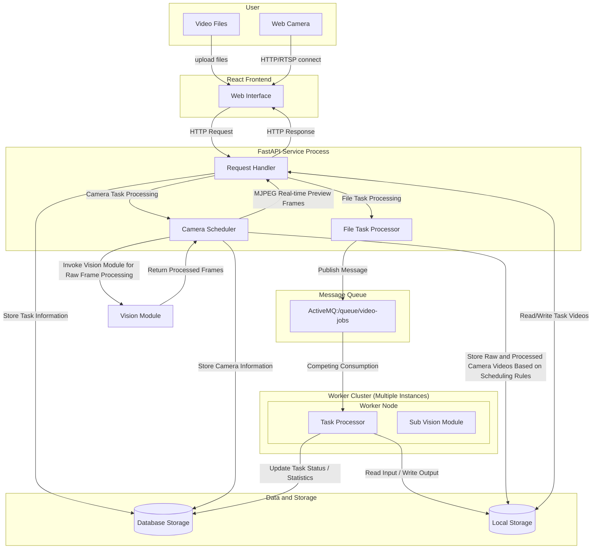
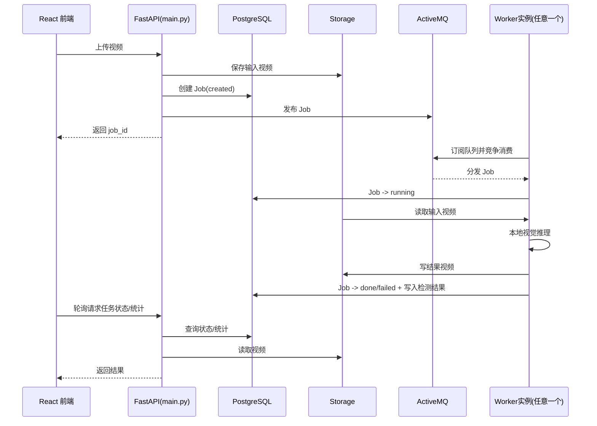
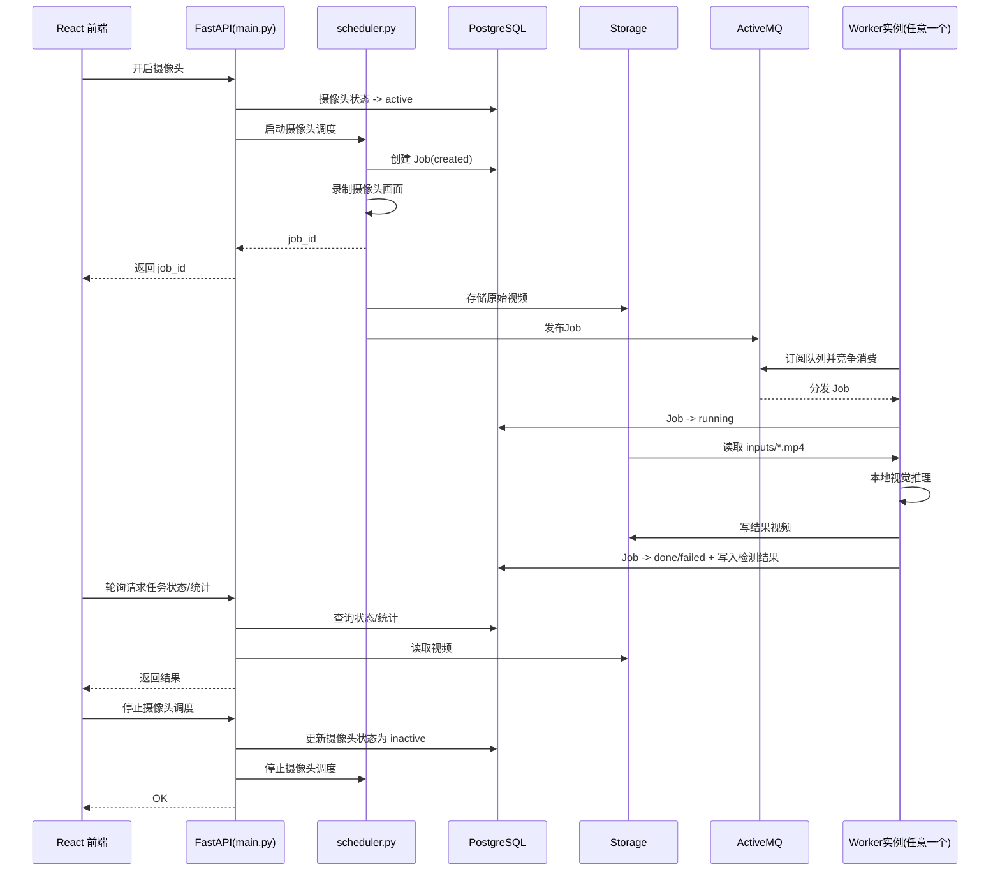
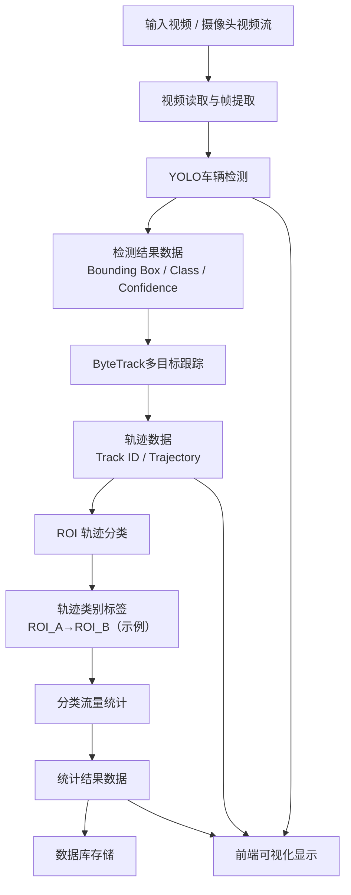
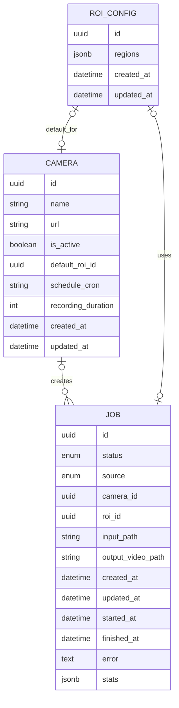

# 基于计算机视觉的交通流检测应用开发

## 缩略语与符号表

БД — 数据库（Database）。  
ОС — 操作系统（Operating System）。  
ИТС — 智能交通系统（Intelligent Transportation System）。  
API — 应用程序编程接口（Application Programming Interface）。  
HTTP — 超文本传输协议（HyperText Transfer Protocol）。  
RTSP — 实时流传输协议（Real Time Streaming Protocol）。  
SSE — 服务器推送事件（Server-Sent Events）。  
FPS — 帧率（Frames Per Second）。  
CPU — 中央处理器（Central Processing Unit）。  
GPU — 图形处理器（Graphics Processing Unit）。  
ОЗУ — 内存/随机存取存储器（RAM）。  
VRAM — 显存（Video Random Access Memory）。  
UUID — 通用唯一标识符（Universally Unique Identifier）。  
ORM — 对象关系映射（Object-Relational Mapping）。  
JSON — 数据交换格式（JavaScript Object Notation）。  
JSONB — PostgreSQL 中 JSON 的二进制存储格式（JSON Binary）。  
CRUD — 创建/读取/更新/删除（Create, Read, Update, Delete）。  
SPA — 单页应用（Single Page Application）。  
MOT — 多目标跟踪（Multi-Object Tracking）。  
NMS — 非极大值抑制（Non-Maximum Suppression）。  
ROI — 感兴趣区域（Region of Interest）。  
IoU — 交并比（Intersection over Union）。  
TP — 真阳性（True Positive）。  
FP — 假阳性（False Positive）。  
FN — 假阴性（False Negative）。  
TN — 真阴性（True Negative）。  
AP — 平均精度（Average Precision）。  
mAP — 平均 AP（mean Average Precision）。  
APE — 绝对百分比误差（Absolute Percentage Error）。  
MAPE — 平均绝对百分比误差（Mean Absolute Percentage Error）。  
HOG — 方向梯度直方图（Histogram of Oriented Gradients）。  
SVM — 支持向量机（Support Vector Machine）。  
SORT — 简单在线实时跟踪（Simple Online and Realtime Tracking）。  
DeepSORT — 基于外观特征的 SORT 扩展（DeepSORT）。  
YOLO — 你只看一次（You Only Look Once）。  
OpenCV — 开源计算机视觉库（Open Source Computer Vision Library）。  
STOMP — 面向文本的简单消息协议（Simple/Streaming Text Oriented Messaging Protocol）。  

## 术语与定义

时序图：一种 UML 图，用于在统一时间轴上表示对象的生命周期及其在某一用例场景下的交互过程。  
目标检测：在图像中定位目标并预测其类别与置信度的任务。  
边界框（Bounding Box）：用于描述目标在图像中位置的矩形框。  
多目标跟踪（MOT）：跨帧关联检测结果并为目标分配稳定 ID，从而形成轨迹的任务。  
跟踪 ID（Track ID）：由跟踪器为目标分配并在连续帧中保持的唯一标识。  
轨迹：目标随时间变化的位置序列，由跟踪结果生成。  
ROI（Region of Interest）：由用户定义的画面区域，用于限定分析范围与/或用于按方向进行语义分类。  
基于 ROI 的轨迹分类：根据轨迹进入不同 ROI 的顺序，将轨迹归类到对应行驶方向的方法。  
实时处理倍率：视频时长与处理耗时之比；大于 1 表示处理速度快于实时。  
消息队列：用于在服务之间异步传递任务、解耦“提交任务”和“执行任务”的软件组件。  
并发消费：多个执行者从同一队列中获取任务并分担负载的运行模式。  
SSE：基于单一 HTTP 连接、由服务端向客户端单向推送事件的机制。  
Cron 表达式：用于描述任务执行周期（分钟/小时/日期/月/星期）的定时规则字符串。  

## 引言

随着全球城市化进程的加快以及汽车工业的持续发展，城市机动车保有量不断攀升，给城市道路交通系统带来的压力与日俱增。然而，城市道路路网的承载能力难以同步提升，导致道路交通拥堵日益频繁，尤其在交叉路口区域，车辆排队与拥堵问题尤为突出，已成为城市交通拥堵的主要诱因之一。据统计，城市路网中的交通拥堵大多集中在交叉路口附近，严重制约通行效率，加剧能源消耗，并对环境质量造成不利影响。在此背景下，路口车流量检测作为交通状态认知的重要组成部分，对实现自适应信号控制、缓解道路拥堵具有重要意义。传统的车流量检测方法主要依赖地磁线圈、红外/雷达传感器等设备，这些方法存在安装成本高、维护复杂、监测范围有限等不足。近年来，随着计算机视觉和深度学习技术的发展，基于道路监控视频的车辆检测与计数方法成为新的研究热点，通过目标检测算法和跟踪技术可以从视频中实时提取车辆位置信息和运动轨迹，获取更丰富的交通流数据，为路口交通状态分析提供可靠依据。

本研究的主要目标是基于道路监控视频信息，利用计算机视觉方法简化针对复杂交通场景下的路口车流量检测流程。具体而言，通过构建车辆检测与跟踪算法框架，对不同行驶方向的车辆进行视频分析，实现准确的车辆检测、轨迹跟踪和流量统计，克服传统车流量检测方法的局限性，提高检测效率，并为未来信号灯自适应控制策略与智慧交通的设计提供便利可靠的数据支持。

为实现上述目标，本研究拟完成以下主要任务：

1. 开展交通流量检测领域相关调研，对现有解决方案进行分析；
2. 收集并准备系统测试与实验评估所需的视频数据；
3. 选择并实现车辆检测和跟踪算法；
4. 开发一种按行驶方向计算交通流量的算法；
5. 设计并实现软件系统；
6. 对系统进行性能评估与测试。

通过上述任务的完成，本论文将构建一套面向复杂路口场景的自动化车流量检测系统，为交通管理提供数据支持，同时为未来进一步研究智能交通优化和信号灯自适应控制奠定基础。

## 1 交通流检测与信号灯控制系统理论综述

### 1.1 交通流研究的现实意义

随着城市化进程的不断加快，城市机动车数量呈现快速增长趋势。大量机动车的增加使城市道路网络面临前所未有的压力，尤其是在交通路口及城市主干道区域，交通拥堵问题日益突出，同时带来能源浪费、环境污染和经济损失等多重社会问题。

在城市交通系统中，交通路口作为交通流交汇的关键节点，其运行效率直接影响整体道路网络的通行能力。而信号灯不合理的配置方案则会导致车辆长时间等待、排队长度增加，从而进一步降低路口的通行能力。此外，传统的交通流量检测方法往往依赖人工观测或简单传感器，这些方法难以实现实时、动态的交通流监测，尤其是在多方向、复杂交通场景下存在明显局限性。

为了缓解交通拥堵，提高道路通行效率，获取精确、实时的交通流信息显得尤为重要。基于视频监控的交通流量检测方法，结合计算机视觉与深度学习技术，可以实现对车辆的自动检测、跟踪与计数，为信号灯优化配时和交通管理决策提供科学依据。这不仅能够弥补传统传感器在动态信息获取方面的不足，还为智慧城市下智能交通系统的发展提供了重要的数据支持。

综上所述，针对复杂交通路口的自动化交通流量检测研究具有重要的理论价值与实际应用意义。通过建立可靠的检测与分析系统，一方面，可以作为一种更便利的方式供交通管理部门进行数据收集与分析，为城市道路交通调度提供数据支撑，另一方面，该系统可进一步作为智慧交通系统的感知单元，为后续实现信号灯自适应配时、区域交通动态调度等智能优化功能提供技术铺垫，从而提高交通效率，改善城市交通环境。

### 1.2 现有交通流检测方法综述

交通流量检测作为智能交通系统的重要组成部分，其研究与应用已有较长历史。根据技术手段的不同，现有方法主要可分为基于传感器的检测方法和基于计算机视觉的检测方法两类。

#### 1.2.1 基于传感器的交通流量检测方法

基于传感器的交通流量检测方法包括感应线圈检测、雷达检测、激光（LiDAR）检测以及红外检测等。

- 感应线圈检测是一种成熟的电磁感应技术，其通过埋设在路面下的导线线圈检测车辆对磁场的扰动，从而判断车辆存在及计算车流量、占有率和速度。该方法具有精度高、实时性强和对光照、天气不敏感的优点，但安装和维护成本高，信息维度有限，难以扩展至复杂多车道场景。

- 雷达检测利用多普勒效应，通过发射电磁波并接收反射信号，计算车辆的速度与位置，实现非接触式检测。雷达检测全天候、精度较高，但在车辆密集或遮挡严重情况下容易出现误检或漏检，同时难以获取车辆轨迹信息。

- 激光（LiDAR）检测通过测量激光脉冲的飞行时间获取车辆的距离和空间结构，可生成高精度的三维点云，实现精细化交通信息采集。该方法精度高，但成本昂贵，对恶劣天气敏感，且数据处理复杂。

- 红外传感器检测通过检测车辆热辐射或红外光反射判断车辆存在，结构简单且成本较低，但精度受光照、环境温度影响大，难以满足复杂场景下的高精度检测需求。

总体来看，基于传感器的交通流量检测方法在固定路口、高速公路等环境中具有可靠性和稳定性，但在多车道、复杂场景以及轨迹分析需求上存在局限性。

#### 1.2.2 基于计算机视觉的交通流量检测方法

随着计算机视觉技术的发展，基于视觉的交通流量检测方法逐渐成为研究热点。其核心优势在于非接触式检测、信息丰富且可扩展性强。

- 传统计算机视觉方法主要包括背景减除、光流法和轮廓/形态学分析等。背景减除法通过建立静态背景模型提取前景车辆，计算流量和占有率，但对光照变化敏感，遮挡严重时易漏检；光流法通过计算像素运动矢量捕捉车辆运动信息，但计算复杂度高，密集场景适应性差；轮廓分析方法适合低车流量场景，对复杂交通场景效果有限。

- 基于机器学习的方法如 HOG+SVM、Haar 特征 + Adaboost 等，通过人工设计特征提取车辆信息并进行分类，相较传统方法具有更强鲁棒性，但依赖特征设计且泛化能力有限。

近年来，基于深度学习的目标检测与多目标跟踪方法逐渐成为主流研究方向。与传统方法不同，深度学习方法能够通过端到端学习自动提取多层次特征，在复杂背景和多目标场景下表现出更强的鲁棒性。

本研究基于该技术路线，构建了结合目标检测与多目标跟踪的交通流量分析框架。具体而言，采用 YOLO 系列目标检测算法对视频帧中的车辆进行检测，并结合 ByteTrack 多目标跟踪算法实现跨帧目标关联，从而获得连续稳定的车辆轨迹。在此基础上，通过对轨迹运动方向进行分析，实现不同方向交通流量的自动化统计。

与传统方法相比，该方法具有以下优势：

- 检测精度高：深度学习模型能够自动提取多层次特征，提高对复杂背景的适应能力；
- 跟踪稳定性强：通过多目标跟踪算法能够保持稳定的目标身份关联，减少重复计数与漏检问题；
- 适应复杂场景：能够处理多车道、多方向以及高密度交通环境；
- 信息丰富：不仅可获取车流量信息，还可获得车辆轨迹及运动特征等多维信息；

因此，基于深度学习的交通流量检测方法能够有效克服传统方法的不足，为复杂交通环境下的高精度流量分析提供可靠解决方案。

### 1.3 系统技术栈

本节介绍系统实现所采用的技术栈与关键算法模块，旨在说明各项技术选择与系统需求之间的对应关系。下文将分别从编程语言、车辆检测方法、多目标跟踪方法以及轨迹分类算法四个方面展开说明。

#### 1.3.1 编程语言

为了实现基于深度学习的视频交通流量检测系统，本研究的软件系统对编程语言提出了特定要求。系统需要具备以下几个方面的能力：

- 高效的数据处理能力：交通视频数据量大，需要对视频帧进行实时读取、处理和分析，因此所选语言必须支持高效的矩阵运算、图像处理以及大规模数据处理功能。
- 丰富的计算机视觉与深度学习库支持：系统核心依赖YOLO目标检测算法和ByteTrack多目标跟踪算法，因此编程语言应具备成熟的深度学习框架（如PyTorch、TensorFlow）和计算机视觉库（如OpenCV）的支持，以方便模型训练、推理和结果可视化。
- 良好的可扩展性与跨平台性：考虑到系统可能部署于不同的服务器或嵌入式设备上，语言应支持跨平台运行，能够方便地与数据库、图形界面、网络通信模块以及流量统计模块进行集成。
- 开发效率与社区支持：交通流量检测涉及复杂算法的实现与调试，因此语言应具备高开发效率、良好的可读性，并拥有活跃的开发社区以便获取技术支持和开源资源。

综合考虑上述需求，本研究选择Python作为主要编程语言。

#### 1.3.2 车辆目标检测方法

在交通流量检测系统中，多目标检测是实现车辆识别与后续跟踪分析的基础模块。系统需要在视频序列中对多个车辆目标进行实时检测，并输出其空间位置信息（如边界框）及类别信息。因此，本研究对目标检测技术提出如下要求：

- 准确性：能够准确识别不同类型车辆，并保持较低的误检率和漏检率；
- 实时性：系统需对视频流进行高效处理，以满足实时交通分析的需求；
- 鲁棒性：在光照变化、遮挡以及多车道密集交通等复杂场景下仍具有较好的性能；
- 可扩展性：能够与多目标跟踪算法及后续流量统计模块无缝集成。

在系统实现中，本研究采用 OpenCV 与 YOLO 目标检测算法相结合的方式完成车辆检测任务。其中，OpenCV 主要用于视频数据的读取、帧级预处理、检测结果可视化以及系统级数据流管理，为深度学习模型提供运行支撑与工程接口。

在目标检测算法方面，本研究选用 YOLO（You Only Look Once）系列算法作为核心检测模型。YOLO 属于单阶段目标检测方法，通过单次前向传播即可同时完成目标位置回归与类别预测。相比于传统两阶段检测方法（如 Faster R-CNN），YOLO 在保证检测精度的同时显著提升推理速度，更适用于多目标密集且对实时性要求较高的交通路口场景。

经过 YOLO 检测模块的推理，可以稳定输出车辆的空间位置与类别信息，并为后续多目标跟踪与交通流量统计提供基础数据输入。

#### 1.3.3 多目标跟踪方法

在获取通过目标检测得到视频帧中车辆的位置信息后，需要引入多目标轨迹追踪算法，对检测到的车辆进行跨帧关联，从而实现车辆身份的持续标识与运动轨迹的构建，以供后续的车流量统计、路径分析以及交通行为研究。

针对路口交通场景，本研究对多目标轨迹追踪算法提出如下要求：

1. 身份一致性：在连续视频帧中保持同一车辆的唯一标识（ID），避免频繁发生ID切换；
2. 轨迹连续性：在车辆发生遮挡或检测置信度降低时，能够保持轨迹的连续性，避免轨迹中断；
3. 高效率：算法需具备较高的运行效率，以缩减视频任务的整体处理时间；
4. 与检测算法的兼容性：能够直接利用目标检测算法（如YOLO）输出的边界框结果进行关联。

为满足上述需求，本研究选用多目标跟踪算法 ByteTrack 进行车辆轨迹追踪。

与传统多目标跟踪方法相比，ByteTrack在处理遮挡和检测不稳定问题方面具有显著优势。传统方法（如SORT）通常仅依赖高置信度检测结果进行关联，容易在目标被遮挡或检测置信度降低时丢失轨迹；而ByteTrack通过引入低置信度检测信息，有效提升了目标的持续跟踪能力。

此外，与基于外观特征的跟踪方法（如DeepSORT）相比，ByteTrack无需额外的特征提取网络，避免了高计算开销，在保证较高精度的同时显著提升了运行效率，更适用于实时交通流量检测场景。

综上所述，本研究选择 ByteTrack 作为多目标轨迹追踪算法，以获得稳定的车辆轨迹信息，为后续交通流量统计与信号灯优化提供可靠的数据基础。

#### 1.3.4 轨迹分类算法

在完成车辆检测与多目标跟踪并获得车辆运动轨迹信息后，系统需要进一步对轨迹进行语义层面的分析，以实现车辆行驶方向的分类，并完成不同方向交通流量的统计。

基于上述需求，本研究对轨迹分类算法提出如下要求：

1. 多方向适应性：算法应能够适应具有不同结构的路口场景，并对每个路口方向支持直行、左转、右转等多种运动模式的识别；
2. 低计算复杂度：轨迹分类模块需要与目标检测和目标跟踪模块协同运行，因此应保持较低的计算复杂度，以保证系统整体的实时处理能力。
3. 结果可解释性：对于轨迹的分类结果，应具备明确的判定依据与分类逻辑，便于分析与验证

综合考虑以上需求和工程实现可行性，本研究采用基于用户自定义感兴趣区域（Region of Interest, ROI）的方法进行轨迹分类与流量统计。

图 1.3.1 ROI 区域划分示例

具体而言，该方法首先在视频监控画面中根据实际路口几何结构划分为如图所示的多个 ROI 区域，每个 ROI 区域对应一个具体的路口方向（如东向、西向、南向、北向）。设车辆轨迹表示为点序列：

$$
T = \{p_1, p_2, \ldots, p_n\}
$$

其中 $p_i$ 表示车辆在第 $i$ 帧中的空间位置坐标。ROI 区域可表示为二维空间中的集合，记为 $R_i$。

在轨迹分类过程中，系统记录轨迹 $T$ 与各 ROI 区域之间的访问顺序关系。如果某一车辆轨迹 $T_A$ 依次经过ROI区域 $R_A$ 与 $R_B$，即存在空间访问序列：

$$
T_A: R_A\rightarrow R_B
$$

则由此定义该车辆的行驶方向为 $A\rightarrow B$，即车辆从 $R_A$ 对应的入口方向运动至 $R_B$ 对应的出口方向，从而完成轨迹类别的判定。

在实际实现中，系统通过检测轨迹点与 ROI 区域的空间包含关系，按顺序记录 ROI 的进入事件，从而构建车辆的 ROI 访问序列，并据此完成方向分类与交通流量统计。

需要指出的是，该方法依赖于 ROI 的划分与监控画面的空间一致性，无法解决摄像机偏转、抖动或视角变化时，ROI 区域不匹配所产生的偏差，从而影响分类稳定性。尽管如此，在固定监控场景下，该方法能够在计算复杂度、实时性与工程可实现性之间取得较好的平衡，适用于多方向交通流量统计任务。

### 1.4 本章小结

本章对交通流量检测系统的相关理论基础、现有研究方法以及系统技术栈进行了分析。

首先，结合城市交通拥堵问题的现状，分析了复杂路口场景下自动化交通流量统计的现实需求。然后，针对本研究的系统需求，对相关技术栈进行了分析与选择。最终确定如下技术方案：

在编程语言方面，选择Python作为系统开发语言，以满足快速开发和丰富算法库支持的需求；在目标检测方面，选择OpenCV作为视频处理工具，并采用YOLO算法实现高精度实时车辆检测；在多目标跟踪方面，采用ByteTrack算法实现车辆身份关联与轨迹生成；在轨迹分类与流量统计方面，采用基于用户自定义ROI的方法实现多方向交通流量统计。

以上技术方案的确定为后续系统设计、功能实现以及实验测试奠定了理论基础和技术基础。
 
## 2 系统需求分析

在完成交通流量检测相关理论研究与技术选型分析后，为保证系统能够满足复杂交通场景下的实际应用需求，需要进一步明确系统应具备的功能以及性能要求。本章将从功能需求和非功能需求两个方面对基于计算机视觉的交通流量检测系统进行分析，为后续系统设计与实现提供依据。

### 2.1 功能需求

功能需求用于描述系统必须实现的核心业务功能。结合本研究的应用场景，系统主要面向城市十字路口交通监控视频，实现车辆检测、目标跟踪、轨迹分类以及交通流量统计等功能。因此，本系统应具备以下功能模块。

| 编号 | 功能模块 | 需求描述 |
|---:|---|---|
| 1 | 视频输入 | 系统应能够接收交通监控视频文件或摄像头实时视频流作为输入数据源，完成视频数据的读取与逐帧解析，为后续目标检测模块提供输入。 |
| 2 | 车辆目标检测 | 系统应能够对视频中的车辆目标进行自动识别，并输出车辆的位置与类别信息，为后续目标跟踪提供检测结果。 |
| 3 | 多目标跟踪 | 系统应能够为每辆车辆分配唯一身份标识，并在连续画面帧中保持目标身份一致性，从而生成连续的车辆运动轨迹。 |
| 4 | ROI 区域配置 | 系统应允许用户根据实际路口结构配置 ROI 区域，用于标识不同的路口通行方向。 |
| 5 | 轨迹分类 | 系统应能够根据车辆轨迹与 ROI 区域之间的时序关系，对车辆行驶方向进行分类，实现不同交通行为的识别。 |
| 6 | 交通流量统计 | 系统应能够对不同行驶方向的车流辆数量进行自动统计，并避免重复计数，输出总体交通流量及各方向交通流量信息。 |
| 7 | 结果可视化 | 系统应能够将流量统计结果以可交互图表形式可视化显示在前端页面上，确保系统的可解释性和可用性。 |

综上所述，本系统需要完成从视频输入、目标检测、多目标跟踪到轨迹分类与流量统计的完整业务流程，以实现复杂交通场景下的自动化车流量分析。

### 2.2 非功能需求

除核心业务功能外，交通流量检测系统还需要满足系统性能、稳定性以及用户体验等方面的要求。非功能需求直接影响系统在实际交通场景中的应用效果，因此本研究从处理速度、检测准确性、系统稳定性、环境适应能力以及系统易用性等方面对系统进行分析。

#### 2.2.1 处理速度

交通流量检测系统需要对一系列交通监控视频进行连续处理，因此系统应具备较高的处理效率，避免检测任务长时间等待。

在系统运行过程中，需要同时完成视频读取、车辆检测、多目标跟踪、轨迹分类以及流量统计等多个任务，因此系统应尽可能降低单帧处理延迟，以保证系统整体运行效率。

此外，系统还应具备良好的资源利用能力，能够在消费级GPU及CPU环境下稳定运行，以降低系统部署成本并提高实际应用可行性。

#### 2.2.2 准确性

交通流量统计结果的准确性是系统性能的重要评价指标，直接影响交通数据分析结果的可靠性。

首先，系统需要保证目标检测模块具有较高准确率，尽可能减少误检和漏检；同时，多目标跟踪模块应保持车辆身份在连续帧中的一致性，避免因目标 ID 丢失而导致重复计数或统计偏差。此外，在轨迹分类与流量统计过程中，系统还需准确判定车辆的运动路径类别，并据此统计不同类别的交通流量，以保证交通数据分析结果的有效性。

高准确性是系统后续用于交通流量分析以及交通信号管理决策优化的重要前提。

#### 2.2.3 稳定性

交通流量检测系统通常需要长时间连续运行，因此系统需要具备长期稳定运行能力，以适应实际交通监控场景中的持续工作需求。

在长时间视频处理过程中，交通监控视频可能存在分辨率变化、帧率波动以及短时网络连接中断等情况。对此，系统应能够继续运行或进行异常处理，避免出现程序崩溃、内存泄漏、视频读取异常、模型推理中断等问题，保证整体任务能够顺利完成。

此外，系统各模块之间应具备良好的协同能力，确保视频处理、目标检测、目标跟踪以及流量统计流程能够稳定运行。

#### 2.2.4 环境鲁棒性

由于实际交通环境通常较为复杂，因此系统需要具备较强的环境适应能力与鲁棒性。

在实际交通监控场景中，视频画面可能存在车辆遮挡、光照变化、阴影干扰等问题，这些因素都会对目标检测与跟踪结果产生影响。因此，系统应能够在复杂交通场景下保持较好的检测性能，并尽可能降低环境因素对系统结果的影响。

此外，系统还应能够适应不同道路结构与摄像头视角，并支持通过用户配置 ROI 区域的方式确保系统在不同场景下的适用性。

#### 2.2.5 易用性

为进一步提高系统的实际应用价值，系统应具备良好的用户交互体验。

用户应能够方便地完成视频导入、ROI 区域配置以及系统运行等操作。同时，系统应能够直观显示车辆检测框、运动轨迹以及流量统计结果，便于用户观察和分析交通状态。

此外，系统界面应尽可能整洁直观，从而降低系统的学习与使用成本，提高系统的推广与部署价值。

### 2.3 本章小结

本章对交通流量检测系统的需求进行了分析，并从功能需求和非功能需求两个方面明确了系统设计目标。

在功能需求方面，系统需要实现视频输入、车辆检测、多目标跟踪、轨迹分类、流量统计以及结果可视化等核心功能，形成完整的交通流量分析流程。

在非功能需求方面，系统需要满足处理速度、检测准确性、运行稳定性、环境鲁棒性以及用户易用性等方面的要求，以保证系统能够在实际交通场景中稳定运行。

基于上述需求分析，下一章将进一步对系统的整体架构、核心模块以及具体实现方案进行设计与说明，为系统开发提供技术基础。

## 3 系统设计与实现

在前两章的相关理论与技术分析、系统需求梳理的基础上，本章将聚焦于交通流量检测系统的具体设计与工程实现，完整阐述从系统架构搭建到核心功能落地的全流程内容。首先会对系统的整体分层架构、模块间交互逻辑以及数据流转过程进行说明，明确前端交互层、后端服务层、视觉分析层与数据存储层的职责划分；随后会详细介绍各核心模块的实现细节，包括视频输入处理、车辆检测与多目标跟踪算法的工程化落地、基于ROI的轨迹分类与流量统计逻辑，以及前后端交互功能的具体实现；最后会对系统实现过程中的性能优化策略进行总结。

### 3.1 系统设计

接下来将对系统的整体设计思路进行阐述，从宏观层面搭建系统的技术架构与运行逻辑，为后续的功能模块拆分与工程实现奠定基础。接下来将从系统分层架构设计、模块间交互时序、以及核心数据流的流转逻辑三个维度，完整呈现交通流量检测系统的设计方案，确保系统能够同时满足复杂路口场景下的功能完整性、可扩展性与工程可落地性要求。

#### 3.1.1 系统架构

为实现复杂交通场景下的自动化车流量检测与分析，本研究采用模块化设计思想，对系统进行分层架构设计。系统整体由前端模块（Frontend）、后端模块（Backend）、视觉分析模块（Vision Module）以及数据存储模块（Data Storage）四部分组成。各模块之间通过接口进行通信与数据交互，共同完成视频采集、车辆检测、多目标跟踪、轨迹分类以及交通流量统计等功能。


图3-1 系统总体架构图*

系统总体架构组成如图3-1所示，包含以下模块：

1. 前端模块（Frontend）

前端模块主要负责用户交互与结果展示，是系统与用户之间的主要交互接口。该模块主要包括以下功能：

- 视频上传（Upload Video）：用户可上传本地交通监控视频作为系统输入，用于离线交通流量分析。
- 网络摄像头接入（Network Cam）：系统支持通过HTTP或RTSP协议接入网络摄像头，实现实时交通视频采集。
- 数据可视化界面（Dashboard Display）：系统能够实时显示车辆检测结果、目标轨迹以及交通流量统计信息，便于用户观察交通运行状态。

前端模块通过HTTP接口与后端模块进行通信，并接收后端返回的检测结果与统计数据。

2. 后端模块（Backend）

后端模块是系统的核心控制部分，主要负责业务逻辑处理、任务调度以及系统通信。

本研究采用Python结合FastAPI框架实现后端服务。FastAPI具有轻量化、高性能以及良好的异步处理能力，能够满足视频分析系统对高并发与实时性的需求。

后端模块主要包括以下组件：

- Python + FastAPI：负责系统接口管理、任务控制以及前后端通信。
- 消息队列（Message Queue）：由于交通视频分析任务具有较高计算开销，系统采用异步分布式处理方式，通过消息队列实现任务解耦与异步执行，提高系统吞吐能力。
- 任务调度器（Task Scheduler）：用于管理视频分析任务与交通视频录制任务，实现定时任务调度与任务状态管理。

后端模块负责协调视觉分析模块与数据存储模块之间的数据交互，并控制整个系统的运行流程。

3. 视觉分析模块（Vision Module）

视觉分析模块是本研究交通流量检测系统的核心功能模块，负责完成交通视频中的车辆检测、目标跟踪以及交通流量分析。

该模块主要包括以下功能：

- 车辆检测（Vehicle Detection）：系统采用YOLO目标检测算法对交通视频中的车辆进行识别，并输出车辆边界框与类别信息。
- 多目标跟踪（Multi-Object Tracking）：系统采用ByteTrack算法对车辆进行连续跟踪，为每个目标分配唯一ID，并生成车辆运动轨迹。
- 方向分析与交通统计（Direction & Traffic Analysis）：系统基于车辆轨迹与用户定义 ROI 区域之间的关系，对车辆行驶方向进行分类，并完成交通流量统计。

视觉分析模块能够实现复杂交通场景下的自动化交通分析，并为后续交通管理与信号灯优化提供数据支持。

4. 数据存储模块（Data Storage）

数据存储模块主要负责系统运行过程中相关数据的保存与管理。

系统采用分层数据存储方式，包括：

- PostgreSQL 数据库：用于存储交通分析任务、摄像头配置、ROI 区域配置以及统计结果等结构化数据。
- 本地文件存储（Local Storage）：用于保存原始视频与处理结果视频等大体积非结构化数据；当前实现采用服务器本地目录进行管理，具备在工程上替换为对象存储（如 S3/MinIO）的可扩展性。

通过数据分离存储方式，可以提高系统的数据管理能力与后续数据分析能力。

在上述系统总体模块内容的基础上，为进一步说明系统内部各模块之间的数据交互与协同工作关系，本研究设计了系统运行流程架构，如图3-2所示。


图3-2 系统运行流程架构图

在系统运行过程中，用户可通过前端模块上传本地交通监控视频，或接入网络摄像头视频流（HTTP/RTSP）。视频数据随后传输至后端模块，由后端完成任务调度与异步处理，并将视频数据发送至视觉分析模块进行交通目标分析。分析完成后，系统将检测结果与统计数据保存至数据存储模块，并最终通过前端界面向用户展示交通流量分析结果。

#### 3.1.2 时序图

为进一步描述系统内部各模块之间的交互流程，本研究采用时序图（Sequence Diagram）对系统运行过程中的消息传递、任务调度以及数据流转过程进行建模。系统主要包含两类核心工作流程：基于本地视频文件的离线交通分析流程，以及基于网络摄像头的视频流实时分析流程。

通过时序图可以清晰展示用户、前端系统、后端服务、消息队列、Worker节点以及数据存储模块之间的协同关系，从而进一步说明系统的运行机制。



1. 视频上传分析流程

视频上传分析流程主要用于处理用户上传的本地交通监控视频。系统通过异步任务处理机制，实现视频分析任务的解耦与分布式执行，其流程如图3-3所示。

在该流程中，用户首先通过React前端上传交通监控视频。前端随后向FastAPI后端发送HTTP请求，请求创建新的交通分析任务。

后端接收到请求后，会首先将原始视频文件保存至本地存储系统，并在PostgreSQL数据库中创建任务记录，任务初始状态设置为“created”。随后，后端将任务信息（包括任务ID与视频路径）发送至ActiveMQ消息队列。

系统中的Worker节点会持续监听消息队列，并通过竞争消费机制获取待处理任务。当某个Worker获取任务后，会将任务状态更新为“running”，随后从存储系统读取输入视频，并调用视觉分析模块执行车辆检测、多目标跟踪以及交通流量统计等操作。

视觉分析完成后，Worker会生成处理后的视频结果，并将结果视频转码为浏览器兼容的MP4格式。同时，系统会将交通统计结果与任务状态写入数据库。

在任务执行过程中，前端会周期性调用后端接口查询任务状态、统计结果以及输出视频。当任务完成后，后端将处理结果返回给前端界面进行展示。

该设计通过消息队列实现任务异步化处理，从而避免长时间视频分析任务阻塞Web服务，提高系统整体并发能力与稳定性。



2. 实时摄像头分析流程

除离线视频分析外，系统还支持基于网络摄像头的视频流定时分析。该流程主要用于持续交通监控与实时交通流量统计，其运行流程如图3-4所示。

在定时分析模式下，用户首先通过前端界面启动网络摄像头。后端系统接收到请求后，会将摄像头状态更新为“active”，并启动摄像头调度器。

调度器会根据预设规则周期性创建交通分析任务，并异步录制摄像头视频流。录制得到的原始视频文件会保存至本地存储系统，同时任务信息会发送至消息队列。

随后，Worker节点从消息队列中获取待处理任务，并执行交通视频分析流程，包括车辆检测、多目标跟踪以及交通流量统计等操作。分析结果最终保存至数据库与本地存储系统。

与此同时，前端会周期性向后端请求任务状态与统计结果，实现交通分析结果的实时展示。

当用户停止摄像头任务时，后端会将摄像头状态更新为“inactive”，并停止调度器继续创建新的分析任务。

相比同步处理方式，本研究引入了基于消息队列与分布式 Worker 节点的异步机制，能够有效提高交通视频处理效率，并支持多个交通监控任务的并发运行，从而满足复杂交通场景下的大规模交通流量分析需求。

#### 3.1.3 数据流

为进一步描述交通流量检测系统内部的数据处理过程，本研究对系统的数据流与数据存储结构进行分析。数据流设计主要用于描述数据在系统各模块之间的传递、处理与转换过程，而数据存储设计则用于描述系统如何对交通分析过程中产生的数据进行持久化管理。

本系统的数据处理流程主要包括视频输入、视频帧提取、车辆检测、多目标跟踪、ROI 轨迹分类、交通流量统计以及结果输出等阶段。系统首先接收用户上传的视频文件或网络摄像头视频流，并通过 OpenCV 提取视频帧；随后利用 YOLO 算法完成车辆检测，使用 ByteTrack 算法实现多目标跟踪与轨迹生成；在此基础上，系统结合用户定义的 ROI 区域对车辆运动方向进行分类，并完成交通流量统计；最终，分析结果保存至数据库与本地存储系统，并通过前端界面进行可视化展示。系统整体数据流如图3-5所示。


图3-3 系统数据流图

此外，为持久化保存程序运行产生的各类数据，系统采用 PostgreSQL 作为系统数据库，用于存储交通分析任务、摄像头配置以及 ROI 区域配置等结构化数据；视频文件与处理结果文件存储在服务器本地目录中。

其中系统数据库主要包含以下数据表，实体关系如图3-7所示：


图3-4 系统数据库实体关系图

其中，Job 数据表用于保存交通分析任务相关信息，包括任务状态、输入输出视频路径、任务执行时间以及交通统计结果等。其中，统计结果采用 JSON 格式存储，以便保存不同方向的动态交通统计数据。

Camera 数据表用于保存网络摄像头配置与调度信息，包括摄像头地址、运行状态以及定时录制规则。系统通过 Cron 表达式实现定时交通视频录制任务调度。

RoiConfig 数据表用于保存用户绘制的 ROI 区域配置。由于 ROI 区域属于动态多边形结构，不同区域可能包含不同数量的顶点，因此本研究采用 PostgreSQL 中的 JSONB 类型存储区域坐标数据，从而提高系统对复杂 ROI 结构的适应能力。

通过上述数据流与数据存储设计，系统能够实现从原始交通视频输入到交通流量统计结果输出的完整自动化处理流程，并保证各模块之间的数据传输与存储过程具有良好的协同性、稳定性与可扩展性。

### 3.2 系统实现

本章旨在对系统的实现过程进行规范化描述。

在第三章系统设计的基础上，本章进一步给出系统在工程层面的实现细节。系统围绕“路口视频获取—车辆检测—多目标跟踪—轨迹语义分类—流量统计与可视化展示”的处理链路展开，并通过前后端分离与异步任务机制将高计算量的视频分析与 Web 交互解耦：前端负责任务创建、视频预览、ROI 标注与统计展示；后端负责视频文件管理、任务生命周期管理、调度与接口服务；视觉模块负责逐帧推理、轨迹生成与结果视频输出；消息队列用于在 Web 服务与视觉计算之间传递任务，实现多实例 Worker 的竞争消费与横向扩展。最终，系统实现了面向十字路口场景的多方向交通流分析与结果可视化。

#### 3.2.1 视频处理实现

视频处理是整个系统的数据输入和预处理环节，负责从不同来源获取视频数据并进行标准化处理。系统支持两种视频输入方式：
1. 用户在浏览器端上传本地视频文件；
2. 其二为用户配置网络摄像头后，由后端调度器按设定的 Cron 规则定时采集视频片段。

两种输入方式在“进入视觉分析前”的处理目标一致，即将视频统一落地为本地 MP4 文件，并为后续逐帧处理提供稳定、可随机访问的数据源，从而避免直接在 Web 请求生命周期内进行长耗时推理。

对于本地视频上传方式，后端通过 /api/jobs 接口接收 multipart/form-data 视频文件，先将原始文件保存至本地输入目录，再在数据库中创建任务记录并将任务投递到消息队列。该过程的核心在于将“文件上传成功”与“视频分析完成”解耦：上传请求只负责落盘与入队，实际推理由后台 Worker 异步完成，从而保证接口响应及时且系统可扩展。

对于摄像头调度采集方式，系统基于 APScheduler 创建后台调度器，按用户设置的 schedule_cron 触发录制任务。录制过程中使用 OpenCV VideoCapture 拉流，按录制时长计算目标帧数并写入本地临时视频文件；录制结束后将该片段同样作为标准任务入队处理。这种实现使两种输入方式在后续视觉模块中完全复用同一条流水线：只要产生“输入视频文件路径”，就可进入统一的逐帧检测与跟踪流程。

在视频分析阶段，系统采用“逐帧读取—推理—叠加绘制—写入结果视频—汇总统计”的典型流水线。为提高工程可维护性，系统将 OpenCV 的 VideoCapture/VideoWriter 封装为统一的视频读写器，并在主处理函数中以循环方式逐帧执行检测与跟踪，同时把可视化结果写入输出文件。下列代码节选展示了主流水线的关键逻辑：

```python
def process_video(input_video_path: str, output_video_path: str, model_path: str, detector=None, conf=0.5, iou=0.5, classes=None):
    video_handler = VideoHandler(input_video_path)
    out_tmp_path = output_video_path.replace(".mp4", "_tmp.mp4")
    video_handler.setup_writer(out_tmp_path)
    if detector is None:
        detector = VehicleDetector(model_path)
    visualizer = Visualizer(max_history=30, auto_clear=True)

    frame_count = 0
    ids_by_class = {}
    trajectories = {}
    while True:
        ret, frame = video_handler.read_frame()
        if not ret:
            break
        frame_count += 1
        results = detector.track(frame, conf=conf, iou=iou, classes=classes, persist=True, tracker="bytetrack.yaml")
        if results and results[0].boxes.id is not None:
            track_ids = results[0].boxes.id.int().cpu().tolist()
            class_ids = results[0].boxes.cls.int().cpu().tolist()
            centers = results[0].boxes.xywh.cpu().tolist()
            for tid, cid, center in zip(track_ids, class_ids, centers):
                ids_by_class.setdefault(cid, set()).add(tid)
                _append_trajectory_point(trajectories, tid, cid, center[0], center[1], frame_count, sample_step=3, max_points=400)
        annotated = visualizer.draw_detections(frame, results)
        video_handler.write_frame(annotated)

    video_handler.release(destroy_windows=False)
    transcode_video(out_tmp_path, output_video_path)
    unique_ids_by_class = {int(k): len(v) for k, v in ids_by_class.items()}
    return frame_count, unique_ids_by_class, trajectories
```

同时，为保证生成视频能够在不同浏览器中稳定播放，系统在输出阶段引入了统一转码步骤。实践中不同浏览器对 MP4 封装与编码参数的兼容性存在差异，尤其在 H.264 编码配置不一致或 moov 元数据不在文件头部时可能出现“无法播放/无法拖动进度条”等问题。为此，系统在写入临时视频后调用 FFmpeg 将结果转码为 H.264，并开启 faststart 将元数据前置，以提升在线播放兼容性；同样地，摄像头录制片段也在录制结束后执行一次转码，从源头减少后续处理链路的编解码不确定性。

#### 3.2.2 车辆检测与跟踪

系统的车辆检测采用 YOLOv8 方法实现。该方法将目标定位与类别预测统一在一个前向推理过程中完成，具有推理速度快、端到端部署便利等特点。针对交通路口场景中普遍存在的小目标车辆、遮挡以及尺度变化较大的问题，YOLOv8 的多尺度特征融合能力能够有效提高不同尺度车辆目标的检测召回率，从而保证复杂交通场景下的检测稳定性。

YOLOv8 提供多种模型规模以适配不同算力与精度需求。常见规格包括 n/s/m/l/x ，其区别主要体现在网络宽度/深度与参数量：模型规模越大，通常检测精度更高但推理耗时与显存占用也更大。对于路口车辆识别场景，模型选择需要在实时性与精度之间进行平衡。

表3-1 YOLOv8 不同规模模型参数与性能对比

| 模型规模 | 参数量（M） | 浮点运算量（B） | COCO mAP<sup>val<br>0.5:0.95 |  Tesla T4 推理速度（FPS） |
|----------|-------------|----------------|-------------------------------|---------------------------|
| YOLOv8n  | 3.2         | 4.5            | 37.3                          | 161                       |
| YOLOv8s  | 11.2        | 28.6           | 44.9                          | 88                        |
| YOLOv8m  | 25.9        | 78.9           | 50.2                          | 39                        |
| YOLOv8l  | 43.7        | 165.1          | 52.9                          | 23                        |
| YOLOv8x  | 68.2        | 258.5          | 53.9                          | 16                        |

**表注**：上表中参数量、浮点运算量、COCO mAP及推理速度均为YOLOv8官方基准测试结果，输入图像尺寸统一为640×640。

综合考虑交通路口场景下的检测精度、推理速度以及硬件资源占用，本系统最终选择 YOLOv8m 作为部署模型。需要说明的是：本文工作重点在于路口交通流检测与统计系统的工程化实现与可用性验证，而非针对特定场景对检测模型进行性能优化。受限于摄像头数据采集、标注条件与时间成本，本文未对检测模型进行额外训练或微调，后续的系统实现与实验测试均直接采用 YOLOv8 的 `yolov8m.pt` 预训练权重进行推理。

在完成车辆目标检测后，系统进一步引入多目标跟踪（MOT）模块实现跨帧目标关联，从而获得连续稳定的车辆轨迹。本系统采用 ByteTrack 作为跟踪算法，该方法首先利用高置信度检测框进行匹配以获得稳定关联，再利用低置信度检测框补充被遮挡或短时置信度下降的真实目标，从而在复杂场景中保持轨迹连续性。与仅依赖高置信度检测框的关联策略相比，该方法在车辆密集与遮挡场景下能够有效减少轨迹断裂以及 ID Switch 频率。

在工程实现上，系统将 YOLOv8 提供的 model.track() 接口进一步封装在 VehicleDetector 类下以集中管理模型加载与推理参数。同时为减少模型重复加载带来的开销，Worker 进程在启动阶段会对模型进行预热并缓存检测器实例以供后续任务直接复用，从而提升系统整体吞吐能力。

在逐帧处理过程中，系统读取视频帧后调用 track() 方法完成目标检测与轨迹跟踪联合推理：YOLOv8 前向推理输出检测框后，将检测结果交由  ByteTrack 算法进行数据关联，下列代码展示了 track() 方法的核心实现：

```python
def track(self, frame, conf=0.5, iou=0.5, classes=None, persist=True, tracker="bytetrack.yaml"):
    kwargs = {
        "conf": conf,
        "iou": iou,
        "classes": classes,
        "device": self.device,
        "half": self.half,
        "imgsz": self.imgsz,
        "persist": persist,
        "tracker": tracker,
        "verbose": False,
    }
    return self.model.track(frame, **kwargs)
```
其中，conf 与 iou 参数可用于控制置信度阈值并调节非极大值抑制（NMS）强度，classes 用于指定检测目标类别。persist=True 用于在连续帧间保持跟踪状态，tracker 用于指定底层跟踪算法配置文件。

通过上述联合推理实现，系统获得车辆目标检测框与跨帧一致的 track_id，并在可视化阶段将检测框、类别标签与跟踪 ID 叠加到输出视频中，从而得到如图所示的车辆检测结果。

[图3-3 车辆检测结果示例（占位）]
图注：测试视频中典型帧的检测结果截图，展示车辆边界框、类别标签与跟踪 ID。

在获得稳定的车辆轨迹后，系统进一步对轨迹数据进行持久化存储。具体而言，系统以车辆中心点作为轨迹采样点，按固定帧步长对轨迹进行采样，同时对最大采样点数量进行限制，以降低数据冗余与前端渲染压力。

下列代码展示了轨迹点写入逻辑：

```python
def _append_trajectory_point(
    trajectories: Dict[str, Dict[str, Any]],
    track_id: int,
    class_id: int,
    center_x: float,
    center_y: float,
    frame_index: int,
    sample_step: int,
    max_points: int,
) -> None:
    if frame_index % sample_step != 0:
        return
    key = str(track_id)
    if key not in trajectories:
        trajectories[key] = {"class_id": int(class_id), "points": []}
    item = trajectories[key]
    item["class_id"] = int(class_id)
    item["points"].append([int(frame_index), round(float(center_x), 2), round(float(center_y), 2)])
    if len(item["points"]) > max_points:
        item["points"] = item["points"][-max_points:]
```
其中，每个轨迹点采用 [frame_index, center_x, center_y] 格式存储，分别表示轨迹点所在帧编号以及车辆中心点坐标。

通过上述实现，系统最终形成结构化的车辆轨迹数据，并以 JSON 形式持久化存储，为后续轨迹分析、轨迹可视化以及交通流量统计提供基础数据支持。

#### 3.2.3 轨迹分类与流量统计

在完成车辆检测、多目标跟踪以及轨迹持久化存储后，系统进一步基于 ROI（Region of Interest）区域实现轨迹语义分析与交通流量统计。

在系统实现中，前端通过调用 /api/jobs/{job_id}/stats 获取轨迹信息数据，并将其规范化处理列入轨迹详情列表，随后基于 Canvas/SVG 方式将轨迹折线叠加绘制到视频画面上，最终得到如图所示的轨迹可视化结果。

[图3-4 轨迹叠加可视化示例（占位）]图注：前端在视频画面上叠加绘制轨迹折线；同一车辆在连续帧中保持一致的跟踪 ID，轨迹线连续；支持筛选显示与 ROI 同屏叠加。

为实现不同方向交通流量统计，系统进一步实现了 ROI 区域绘制与管理功能，系统支持用户根据实际路口结构手动绘制多个 ROI 区域，用于表示不同的车辆通行方向。ROI 配置与具体任务进行绑定，每个任务拥有独立的 ROI 配置。同时，系统还支持为网络摄像头预先配置默认 ROI，当任务由对应摄像头调度生成时，系统会自动复制该摄像头的默认 ROI 作为任务初始配置，从而减少用户重复标注的工作量。在用户完成 ROI 区域配置后，系统会对 ROI 区域进行合法性校验，确保 ROI 配置正确有效。ROI 信息以 JSON 结构持久化存储于 roi_configs 表的 regions 字段中，示例如下：

```json
[
  {
    "id": "2e0a7e1c-0f22-4e1b-8a4c-1f6b0b4b2c9d",
    "name": "ROI_N",
    "points": [[312, 128], [510, 140], [548, 260], [290, 248]]
  },
  ... 其他 ROI 区域信息
]
```

在轨迹分类阶段，系统以“轨迹点是否落入 ROI 区域”作为轨迹事件判定依据。具体而言，系统遍历每条轨迹的采样点序列，通过 pointInPolygon() 方法判断轨迹点是否位于某一 ROI 内部，并由此记录轨迹对每个 ROI 的进入顺序：当轨迹点从 ROI 外部首次进入 ROI 时记录 enter 事件，并将该 ROI 名称加入进入序列；最终以进入序列顺序得到该轨迹的路径标签，例如 ROI_W→ROI_E。若轨迹未进入任何 ROI，则标记为“未分类”。下列代码展示了轨迹分类的核心实现逻辑：

```javascript
for (const [frame, x, y] of points) {
  for (let ri = 0; ri < rois.length; ri++) {
    const inside = pointInPolygon(x, y, rois[ri].points);
    if (!roiStates[ri] && inside) {
      if (!entered.has(rois[ri].name)) enterOrder.push(rois[ri].name);
      entered.add(rois[ri].name);
    }
    roiStates[ri] = inside;
  }
}
const label = enterOrder.length ? enterOrder.join('→') : t('roi.unclassified');
```
其中，roiStates 用于记录轨迹点当前是否位于对应 ROI 内部；enterOrder 用于记录轨迹进入 ROI 的顺序；最终通过连接 ROI 访问序列得到轨迹路径标签。

在完成轨迹分类后，系统进一步以路径标签作为方向类别，对车辆数量进行聚合统计，从而得到不同方向的交通流量统计结果，最终实现复杂交通场景下的自动化交通流量统计与可视化展示。

[图3-5 ROI 绘制与管理界面（占位）]
图注：用户在视频帧上绘制多边形 ROI，并进行命名、编辑与删除操作；界面同时显示轨迹叠加效果。
[图3-6 轨迹分类与流量统计展示（占位）]
图注：按 ROI_A→ROI_B 等路径标签统计车辆数，并以柱状图/饼图展示分布。
[表3-4 分类统计结果（占位）]
表注：列出若干主要路径类别的车辆计数，并与人工统计或预期通行方向进行对比分析。

#### 3.2.4 后端实现

后端采用 FastAPI 构建统一 API 服务进程，并以“应用层（app）—视觉层（vision）—工作进程（worker）”的三级目录结构组织代码，严格划分接口逻辑、业务调度与算法推理模块的边界，实现解耦开发与独立维护。项目后端的目录树结构如下：

```text
backend/
├─ app/
│  ├─ __init__.py
│  ├─ db.py
│  ├─ main.py
│  ├─ models.py
│  ├─ mq.py
│  ├─ scheduler.py
│  ├─ schemas.py
│  ├─ settings.py
│  └─ storage.py
├─ vision/
│  ├─ openh264/
│  │  └─ openh264-1.8.0-win64.dll
│  ├─ __init__.py
│  ├─ detector.py
│  ├─ openh264_loader.py
│  ├─ pipeline.py
│  ├─ recorder.py
│  ├─ video_handler.py
│  └─ visualizer.py
├─ worker/
│  ├─ __init__.py
│  └─ worker.py
└─ requirements.txt
```

在应用生命周期管理方面，后端在启动阶段自动创建数据库表结构，并对 PostgreSQL 枚举类型与 ROI 配置表进行兼容性处理，确保在不同部署环境下均能完成初始化；同时启动摄像头调度器，以加载已启用摄像头的定时任务。

后端 API 设计遵循资源化思路，围绕三类核心资源展开：任务（jobs）、摄像头（cameras）与 ROI（rois）。其中任务接口覆盖创建、列表、详情、统计、输入/结果视频获取以及删除等操作；摄像头接口覆盖增删改查、手动触发录制、实时预览与快照；ROI 接口覆盖任务 ROI 的增删改查与摄像头默认 ROI 的维护。项目启用 FastAPI 的自动 OpenAPI 文档，前端在顶部导航提供 /docs 入口以便联调与验收。主要接口在表3-5中汇总，并包含请求方法、关键入参、返回字段与典型异常码。

表3-5 后端 API 接口列表  
| 资源 | 接口 | 方法 | 关键入参 | 返回字段（摘要） | 典型异常码 |
| --- | --- | --- | --- | --- | --- |
| jobs | `/api/jobs` | POST | `file`（multipart 上传） | `{id, status}` | 503 `mq_unavailable` |
| jobs | `/api/jobs` | GET | `limit, offset`（分页） | `{total, items[]}` | - |
| jobs | `/api/jobs/stream` | GET | SSE | `text/event-stream`（JobListItem 事件） | - |
| jobs | `/api/jobs/{job_id}` | GET | `job_id` | JobResponse | 404 `job_not_found` |
| jobs | `/api/jobs/{job_id}/stats` | GET | `job_id` | `{job_id, stats}` | 404 `job_not_found` |
| jobs | `/api/jobs/{job_id}/input` | GET | `job_id` | `video/mp4` | 404 `job_not_found` / `input_missing` |
| jobs | `/api/jobs/{job_id}/result` | GET | `job_id` | `video/mp4` | 404 `result_not_ready` / `result_missing` |
| jobs | `/api/jobs/{job_id}/frame` | GET | `job_id, frame`（帧序号） | `image/jpeg` | 404 `frame_not_found` |
| jobs | `/api/jobs/{job_id}` | DELETE | `job_id` | `{message}` | 404 `job_not_found` |
| jobs | `/api/jobs` | DELETE | - | `{message}` | 500（清理失败） |
| cameras | `/api/cameras` | POST | `{name, url, is_active, schedule_cron, recording_duration}` | CameraResponse | 422（参数校验） |
| cameras | `/api/cameras` | GET | - | CameraResponse[] | - |
| cameras | `/api/cameras/{camera_id}` | PUT | `{name?, url?, is_active?, schedule_cron?, recording_duration?}` | CameraResponse | 404 `camera_not_found` |
| cameras | `/api/cameras/{camera_id}` | DELETE | `camera_id` | `{message}` | 404 `camera_not_found` |
| cameras | `/api/cameras/{camera_id}/trigger` | POST | `camera_id` | `{id, status}` | 500 `camera_trigger_failed` |
| cameras | `/api/cameras/{camera_id}/preview/{stream_type}` | GET | `camera_id, stream_type=raw` | `multipart/x-mixed-replace`（MJPEG） | 400 `invalid_stream_type` / 404 `camera_not_found` |
| cameras | `/api/cameras/{camera_id}/snapshot` | GET | `camera_id` | `image/jpeg` | 500 `stream_open_failed` / `snapshot_failed` |
| cameras.default_roi | `/api/cameras/{camera_id}/default-roi` | GET | `camera_id` | RoiResponse[] | 404 `camera_not_found` |
| cameras.default_roi | `/api/cameras/{camera_id}/default-roi` | POST | `{name, points}` | RoiResponse | 400 `invalid_payload` / 409 `roi_name_exists` |
| cameras.default_roi | `/api/cameras/{camera_id}/default-roi/{roi_id}` | PUT | `{name?, points?}` | RoiResponse | 404 `roi_not_found` |
| cameras.default_roi | `/api/cameras/{camera_id}/default-roi/{roi_id}` | DELETE | `roi_id` | `{message}` | 404 `roi_not_found` |
| rois | `/api/rois` | GET | `job_id`（query） | RoiResponse[] | 404 `job_not_found` |
| rois | `/api/rois` | POST | `{job_id, name, points}` | RoiResponse | 409 `roi_name_exists` |
| rois | `/api/rois/{roi_id}` | PUT | `job_id`（query）+ `{name?, points?}` | RoiResponse | 404 `roi_not_found` |
| rois | `/api/rois/{roi_id}` | DELETE | `job_id`（query） | `{message}` | 404 `roi_not_found` |

表注：`job_id/camera_id/roi_id` 为 UUID；ROI 的 `points` 为多边形点集（至少 3 点，二维坐标列表）；表中返回字段为论文表格摘要，完整结构以 FastAPI 的 OpenAPI 文档 `/docs` 为准。

在异步任务处理方面，系统采用 ActiveMQ 作为消息队列，通过 STOMP 协议在 Web 服务与 Worker 之间传递任务。Web 服务在创建任务后向队列发送 JSON 消息（仅包含 job_id 与 input_path），从而降低队列传输开销并便于扩展；Worker 进程订阅同一队列后竞争消费消息，在回调中更新任务状态、调用视觉流水线完成推理，并把统计结果写回数据库，最后将状态置为 done 或 failed。下列代码节选分别展示了“入队消息格式”和“Worker 消费与回写”的关键流程：

```python
def send_job(job_id: str, input_path: str) -> None:
    conn = stomp.Connection12([(settings.activemq_host, settings.activemq_port)])
    conn.connect(settings.activemq_user, settings.activemq_password, wait=True)
    try:
        conn.send(
            destination=settings.activemq_queue,
            body=json.dumps({"job_id": job_id, "input_path": input_path}),
            content_type="application/json",
        )
    finally:
        conn.disconnect()
```

```python
def on_message(self, frame):
    payload = json.loads(frame.body)
    job_uuid = UUID(payload["job_id"])
    input_path = payload["input_path"]
    job = db.get(Job, job_uuid)
    job.status = JobStatus.running
    job.started_at = datetime.now(timezone.utc)
    db.add(job); db.commit()

    result = process_video(
        input_video_path=input_path,
        output_video_path=output_path_for_job(str(job_uuid)),
        model_path=MODEL_PATH,
        detector=DETECTOR,
        conf=CONF_THRESHOLD,
        iou=IOU_THRESHOLD,
        classes=CLASSES,
    )

    job.stats = {"frame_count": result.frame_count, "unique_ids_by_class": result.unique_ids_by_class, "trajectories": result.trajectories}
    job.status = JobStatus.done
    job.finished_at = datetime.now(timezone.utc)
    db.add(job); db.commit()
```

此外，为提升前端体验，后端实现了基于 SSE（Server-Sent Events）的任务状态流接口 /api/jobs/stream：服务端按 updated_at 增量轮询数据库，将状态变化实时推送给前端，从而减少前端轮询频率并提高界面响应性。

[图3-7 后端异步任务与竞争消费机制（占位）]
 图注：Web 服务入队任务后，多 Worker 竞争消费队列消息，分别执行视觉处理并回写数据库；前端通过 SSE 接收状态变更。

#### 3.2.5 前端实现

前端采用 React 构建单页应用，目录结构遵循“API 封装—组件—样式—国际化”分层组织，完整目录层级如下（frontend/src 根目录下核心结构）：

```text
frontend/src/
├─ api/
│  └─ index.js
├─ assets/
│  └─ logo.svg
├─ components/
│  ├─ CameraManager.js
│  ├─ HistoryRecords.js
│  ├─ TaskCreation.js
│  ├─ TrafficLightSuggestion.js
│  ├─ TrafficStats.js
│  └─ VideoPreview.js
├─ styles/
│  ├─ App.css
│  └─ index.css
├─ App.js
├─ App.test.js
├─ i18n.js
├─ index.js
├─ reportWebVitals.js
└─ setupTests.js
```

前端界面采用如图所示的单页应用组织方式：顶层 topBar 组件显示系统名称，API文档，任务数量与语言切换选项，主页内拆分为四个功能区分别呈现：任务创建、历史任务、视频预览、统计分析四部分内容。四个区域共享统一的数据来源（任务与统计接口）与状态更新机制（SSE 推送 + 必要时轮询），从而保证用户在任意区域的操作都会同步反映到其他区域的展示结果。

[图3-8 前端主界面布局（占位）]
图注：任务创建与摄像头管理、视频预览、历史记录与统计分析等区域的整体布局。

任务创建区域同时支持两类任务创建方式：
1. 离线视频任务：用户上传本地视频，组件将 File 对象提交后端任务创建接口，并在成功返回后刷新历史任务列表，同时开始跟踪新任务状态。
2. 实时摄像头任务：用户配置摄像头名称、RTSP/HTTP 流、录制时长与定时规则（Cron 表达式），系统按配置周期生成分析任务。前端通过 SSE 订阅任务状态流，实现摄像头任务的实时状态同步，所有任务统一纳入历史任务列表管理。

历史任务区域以表格形式展示任务列表，支持分页、排序以及单条删除及清空全部等操作。表格点击“查看”后，将该任务设为当前选中任务，从而驱动视频预览与统计分析区域切换到对应任务；任务完成后提供结果视频下载入口。清空与删除操作均加入二次确认，以降低误操作风险，同时为减少前端轮询开销，任务状态更新优先采用 SSE：前端订阅任务状态流接口，将后端推送的状态增量合并到本地任务数组中；当 SSE 不可用时，仍可通过轮询补充保证鲁棒性。

视频预览区域采用左右并排布局：左侧用于展示输入视频（上传视频的本地 Blob 预览，或摄像头模式的 MJPEG 实时画面），右侧用于展示处理结果视频。当任务状态未完成时，右侧区域显示当前状态提示；当任务完成后自动切换为结果视频播放器：

统计分析区域则采用垂直布局，首先基于后端 API 返回的各类数据，分别对基本的任务信息，视频信息，轨迹信息在卡片中进行展示。然后在轨迹可视化部分，前端通过后端提供的API接口按需获取指定帧图像，并结合当前帧号与轨迹点坐标绘制轨迹叠加，实现“帧级回放 + 轨迹定位”。同时，ROI 编辑器会从后端加载当前任务的 ROI 列表，并支持新增、更新与删除。最后在轨迹详情部分给出具体的轨迹详情表以及分类统计图，用以对路口交通流量进行可交互式分析

此外，系统维护 zh/en/ru 三种语言词典，并通过 React Context 向全局组件提供 t(key) 翻译函数与语言切换能力；语言选择持久化到 localStorage，从而在刷新页面后保持用户偏好。

#### 3.2.6 性能优化

为满足交通视频分析对处理效率与交互响应的要求，系统在实现中采用了若干工程优化策略。其一，Worker 进程在启动阶段预加载并预热 YOLO 模型，并在后续任务中复用全局检测器实例，以避免重复加载模型造成的额外开销。其二，轨迹数据采用固定步长采样并限制最大点数，从而在保证轨迹形态可用的前提下降低存储开销与前端渲染压力。其三，结果视频统一进行 H.264 转码并启用 faststart，减少跨浏览器播放差异带来的兼容性问题。此外，前端采用 SSE 推送增量更新任务状态，降低轮询频率并提升界面响应性。

### 3.3 本章小结

本章围绕系统“设计与实现”两条主线展开，对路口交通流量检测系统的整体方案进行了从结构到落地的完整阐述。

在第一节中，本章给出了系统总体架构、模块划分以及任务链路的时序与数据流设计，明确了“Web服务负责任务编排与数据管理、Worker负责异步视觉计算、前端负责交互与可视化”的协作边界，为后续实现提供了可执行的工程蓝图。

在第二节中，本章进一步将上述设计细化为可运行的关键模块实现：在视频处理层面，系统同时支持本地上传与摄像头调度采集两种输入方式，并通过统一的文件落盘与转码策略保证逐帧处理稳定性与跨浏览器播放兼容性；在视觉分析层面，系统基于YOLOv8实现车辆检测，并结合ByteTrack完成多目标跟踪，从而获得可用于统计与分析的稳定轨迹；在统计分析层面，系统将后端基础统计与前端ROI语义分类分层实现，使系统能够适配不同路口与不同视角的应用需求；在系统工程层面，后端通过消息队列与Worker竞争消费机制完成异步任务处理，并通过SSE提升前端状态更新体验，前端采用React组件化实现多模块界面与多语言本地化，形成从任务创建到结果展示的完整交互闭环。综合而言，本章的设计与实现内容共同验证了系统方案的可行性，为第四章的系统测试与性能评估提供了可实验的落地对象与评测基础。

## 4 测试与实验

本章对系统的测试与实验过程进行说明。测试目标包括：验证系统功能链路的正确性与鲁棒性；评估视觉模块在真实路口视频下的检测、跟踪与流量统计效果；分析系统在本地单机、单 Worker 部署条件下的处理效率、资源占用与长期运行稳定性。为保证实验可复现，本章首先给出测试环境与数据集来源，其后分别开展功能测试、分环节算法实验与性能测试，最后对实验结论进行归纳总结。

### 4.1 测试环境与数据集

本研究在固定软硬件环境下完成系统部署与实验验证，以明确测试的基础条件。硬件环境采用具备独立显卡的移动工作站配置，能够覆盖本项目实际部署中较为常见的“单机GPU推理”运行场景，具体硬件条件如下表所示：

| 硬件组件 | 配置参数 |
|----------|----------|
| CPU | 13th Gen Intel(R) Core(TM) i9-13980HX（2.20 GHz） |
| GPU | Nvidia GeForce RTX 4080 Laptop，显存12GB |
| 内存 | 2×16GB |
| 操作系统 | Windows 11专业版 |

软件环境方面，本研究使用Python 3.10作为后端与视觉模块的主要运行环境，前端使用React构建并通过浏览器访问本地部署的FastAPI服务。本项目核心依赖与版本约束由工程依赖配置文件确定，主要依赖关系如下表所示：

| 模块分类 | 依赖包名称 | 版本约束/版本号 |
|----------|------------|--------------|
| 后端服务 | FastAPI | >=0.110,<1.0 |
| 后端服务 | Uvicorn | >=0.27,<1.0 |
| 后端服务 | SQLAlchemy | >=2.0,<3.0 |
| 后端服务 | psycopg | >=3.1,<4.0 |
| 后端服务 | APScheduler | >=3.10,<4.0 |
| 后端服务 | stomp.py | >=8.1,<9.0 |
| 视觉处理 | opencv-python | >=4.10,<5.0 |
| 深度学习框架 | torch（Windows） | 2.4.1+cu121 |
| 目标检测 | ultralytics | >=8.4,<9.0 |
| 前端框架 | react | ^19.2.4 |
| 前端构建工具 | react-scripts | 5.0.1 |

在系统部署方面，系统采用本地单机部署方式，后端服务、数据库与消息队列均在本机运行；视觉任务处理采用单 Worker 实例，以准确度量端到端处理时延。在该部署模式下，任务生命周期的关键时间点由数据库字段记录（如 `created_at`、`started_at`、`finished_at`），可用于统计任务排队等待时间与实际处理时间。

测试数据来源方面，离线视频实验主要基于 2020 AI City Challenge Dataset Track 1 的公开视频数据。该数据集覆盖多路城市交通监控场景，具有较强的代表性，能够用于验证系统在不同路口结构、不同交通密度与不同光照条件下的适用性。除离线视频外，本研究还选取了两路公开网络摄像头 JPEG 流作为功能性测试输入，用于验证摄像头接入、实时预览与定时录制链路的正确性。两路摄像头链接如下：
- `http://86.127.212.219/cgi-bin/faststream.jpg?stream=half&fps=15&rand=COUNTER`；
- `http://5.185.125.147:8080/cgi-bin/viewer/video.jpg?r=1778747012`。

表4-2 测试视频数据集概况

| 视频编号 | 路口类型 | 时间/天气条件 | 分辨率 | 帧率 | 时长(秒) | 交通密度 | 备注 |
|----------|----------|--------------|--------|------|----------|----------|------|
| cam_1.mp4 | 三叉路口 | 日间/晴朗 | 1920×1080 | 30 | 600 | 中 | 无特殊异常，常规通行场景 |
| cam_1_dawn.mp4 | 三叉路口 | 黎明/微光 | 1920×1080 | 30 | 480 | 低 | 光照条件较弱，存在逆光干扰 |
| cam_1_rain.mp4 | 三叉路口 | 日间/雨天 | 1920×1080 | 30 | 540 | 中 | 雨滴遮挡镜头，路面存在反光 |
| cam_2.mp4 | 十字路口 | 日间/晴朗 | 1920×1080 | 30 | 720 | 高 | 早高峰车流，存在车辆交汇遮挡 |
| cam_2_dawn.mp4 | 十字路口 | 黎明/微光 | 1920×1080 | 30 | 450 | 低 | 光线不足，远处小目标辨识度低 |
| cam_2_rain.mp4 | 十字路口 | 日间/雨天 | 1920×1080 | 30 | 660 | 中 | 雨水导致画面模糊，存在运动拖影 |
| cam_3.mp4 | 十字路口 | 日间/晴朗 | 1280×720 | 25 | 600 | 中 | 普通监控画质，无明显干扰 |
| cam_3_snow.mp4 | 十字路口 | 日间/雪天 | 1280×720 | 25 | 510 | 低 | 积雪覆盖路面，车辆颜色辨识度下降 |
| cam_4.mp4 | 三叉路口 | 日间/晴朗 | 1920×1080 | 30 | 630 | 中 | 三个方向车流均衡，无明显遮挡 |
| cam_5.mp4 | 十字路口 | 日间/晴朗 | 1280×720 | 25 | 570 | 中 | 存在部分树木遮挡路口边缘 |

### 4.2 功能测试

功能测试旨在验证系统是否满足第二章提出的功能需求，并检查关键链路在“正常输入与异常输入”情况下的行为是否符合预期。考虑到本系统采用“Web 服务入队 + Worker 异步处理”的架构，功能测试不仅包含界面侧操作结果，还应覆盖后端 API 的返回码、任务状态流转以及结果文件可访问性等可观测行为。测试过程中使用浏览器端界面与 FastAPI 自动生成的 OpenAPI 文档（`/docs`）相结合进行验证，确保同一功能既可通过 UI 操作复现，也可通过 API 直接验证请求与响应。

本研究将功能测试划分为五类：其一为上传任务链路测试，覆盖任务创建、状态变迁、统计结果获取与结果视频播放；其二为摄像头链路测试，覆盖摄像头创建、Cron 调度、录制任务状态流转与后续分析入队；其三为 ROI 管理测试，覆盖 ROI 的增删改查与合法性校验；其四为实时预览测试，覆盖 MJPEG 预览与快照获取；其五为异常与容错测试，覆盖消息队列不可用、输入视频缺失、结果文件缺失等异常情况下的系统响应。

其中，上传任务链路的预期行为为：调用 `/api/jobs` 创建任务后，任务状态应从 `created` 进入 `running`，处理完成后进入 `done`；此时调用 `/api/jobs/{id}/stats` 应能获取包含 `frame_count`、`unique_ids_by_class`、`trajectories` 等字段的 JSON 统计结果，并且 `/api/jobs/{id}/result` 返回的 MP4 可在浏览器中正常播放。摄像头链路的预期行为为：创建摄像头 `/api/cameras` 并启用 `schedule_cron` 后，调度器在触发时创建录制任务，任务状态先进入 `recording`；录制完成后任务应再次处于 `created` 并入队等待 Worker 处理，随后进入 `running` 与 `done`。ROI 管理的预期行为为：ROI 名称应满足字母/数字/下划线规则且点集至少包含 3 个顶点，更新后前端分类统计结果应立即反映 ROI 变化。实时预览的预期行为为：`/api/cameras/{id}/preview/raw` 返回的 MJPEG 流可在浏览器中持续加载并刷新，`/api/cameras/{id}/snapshot` 可获取单帧 JPEG 图像。异常与容错的预期行为为：当消息队列不可用时创建任务应返回 503，并在任务记录中写入失败原因；当输入/输出文件缺失时相关接口应返回 404 或明确的错误信息，且系统不应发生崩溃。

为记录功能测试过程与结果，本研究以“测试用例表”的形式整理用例编号、测试模块、输入条件、操作步骤、预期结果与实际结果，形成统一的验证记录。

表4-3 功能测试用例（占位）

| 用例ID | 模块 | 输入 | 操作步骤 | 预期结果 |
|---|---|---|---|---|
| FT-01 | 上传任务链路 | 本地 MP4 视频 | 1）调用 `/api/jobs` 上传视频；2）在任务列表查看状态；3）等待处理完成；4）请求 `/api/jobs/{id}/stats` 与 `/api/jobs/{id}/result` | 任务状态 `created→running→done`；stats 返回 JSON；result MP4 可播放 |
| FT-02 | 上传任务链路（删除） | 已完成任务 | 1）调用 `/api/jobs/{id}` 删除任务；2）刷新任务列表 | 任务记录删除；输入/输出文件被清理；再次访问返回 404 |
| FT-03 | 摄像头链路（创建与启用） | 摄像头 URL + cron | 1）调用 `/api/cameras` 创建并启用；2）等待 cron 触发或调用 `/api/cameras/{id}/trigger` | 生成录制任务；状态出现 `recording`；录制完成后入队 |
| FT-04 | 摄像头链路（录制到分析） | 已启用摄像头 | 1）等待录制完成；2）观察任务状态变化 | 任务状态 recording→created→running→done；输出视频与 stats 可用 |
| FT-05 | ROI 管理（新增） | ROI 名称与多边形点集 | 1）在统计页面绘制 ROI；2）保存；3）刷新 ROI 列表 | ROI 创建成功；名称/点集被校验；分类标签更新 |
| FT-06 | ROI 管理（非法输入） | 非法 ROI 名称/不足 3 点 | 1）输入非法名称或不足 3 点；2）尝试保存 | 返回 400；前端提示错误；ROI 不写入 |
| FT-07 | 实时预览 | 摄像头 raw 预览 | 1）访问 `/api/cameras/{id}/preview/raw`；2）观察画面刷新 | 浏览器持续显示 MJPEG；无明显卡死 |
| FT-08 | 快照 | 摄像头 snapshot | 1）访问 `/api/cameras/{id}/snapshot` | 返回 JPEG；可作为 ROI 标注参考 |
| FT-09 | 异常（MQ 不可用） | 关闭 ActiveMQ | 1）停止消息队列；2）调用 `/api/jobs` 创建任务 | 返回 503；任务标记失败并记录原因 |
| FT-10 | 异常（文件缺失） | 删除输入/输出文件 | 1）删除任务文件；2）访问 `/api/jobs/{id}/input` 或 `/result` | 返回 404（input_missing_on_disk/result_missing） |

经过一系列功能性测试，系统覆盖第二章提出的功能需求均已正常实现并达到预期：上传分析与结果获取链路、摄像头接入与调度录制链路、ROI 管理与分类统计展示链路、实时预览与快照链路均可稳定工作；在消息队列不可用、输入/输出文件缺失等异常情况下，系统能够返回明确的错误码与错误信息并保持服务稳定，不影响其他模块的正常使用。

### 4.3 目标检测评估

本节评估系统在路口视频中对车辆目标的检测效果。测试流程如下：首先针对每个路口设置固定的 ROI 区域以排除无关背景与干扰目标，使检测指标与系统最终车流统计关注的空间范围保持一致，然后对上述 10 个测试视频按固定帧间隔抽样得到指定数量的画面帧，并为每路视频设置固定的有效区域 ROI，随后对每个画面帧内落入 ROI 区域的车辆目标进行人工标注，统计 ROI 内的预测框与真实框的差异，计算 TP、FP、FN，并据此得到 Precision、Recall 与 F1-score，用于反映不同路口结构、交通密度以及光照/天气条件下的整体检测能力。

图4-1 车辆检测结果可视化示例（占位）  
图注：红色框为系统检测到的车辆目标，绿色框为人工标注的 GT 车辆目标，蓝色框为设置的固定 ROI 区域，测试过程中仅对该区域内目标检测效果进行评估。

表4-4 检测环节总体评估结果（ROI 内，占位）  
表注：仅统计 ROI 内车辆；匹配阈值示例为 IoU=0.5；同时报告误检数与漏检数。

| 视频/场景 | ROI | 抽样帧数 | GT(车辆) | Pred(车辆) | TP | FP | FN | Precision | Recall | F1 | AP@0.5 |
|---|---|---:|---:|---:|---:|---:|---:|---:|---:|---:|---:|
| cam_1.mp4（晴天/中密度） | 车道/路口核心 | 200 | 980 | 1005 | 941 | 64 | 39 | 0.936 | 0.960 | 0.948 | 0.952 |
| cam_1_rain.mp4（雨天/反光） | 车道/路口核心 | 200 | 905 | 944 | 842 | 102 | 63 | 0.892 | 0.930 | 0.911 | 0.907 |
| cam_2.mp4（高密度/遮挡） | 车道/路口核心 | 200 | 1320 | 1379 | 1228 | 151 | 92 | 0.890 | 0.930 | 0.910 | 0.915 |
| cam_2_dawn.mp4（微光/远距） | 车道/路口核心 | 200 | 760 | 741 | 693 | 48 | 67 | 0.935 | 0.912 | 0.923 | 0.901 |
| 平均（示例） | - | - | - | - | - | - | - | 0.913 | 0.933 | 0.923 | 0.919 |

由于未进行针对路口监控场景下的训练，模型在画面边缘、远处低分辨率目标以及高遮挡密集场景下存在一定误检与漏检，但整体目标检测结果可以接受。后续可通过采集并标注目标域数据、进行微调或域适配来进一步提升检测与统计精度。

### 4.4 流量检测评估

本节以一段 30 分钟的长视频作为测试样本，评估系统在实际连续时段内的分方向流量统计准确性。经过系统检测与轨迹叠加可视化展示，得到如下图4-2所示的检测结果，以及图4-3所示的方向/路径编号示意。

图4-2 cam_4 检测与轨迹叠加可视化示例（占位）  
图注：在原始画面上叠加车辆检测框、跟踪 ID 以及轨迹线，展示系统在连续时段内对多车目标的检测与轨迹跟踪效果。

图4-3 cam_4 方向/路径编号示意图（占位）  
图注：对路口的主要通行方向进行编号，并用箭头标注车辆行驶方向（如直行、左转、右转等），用于统一人工计数口径与系统输出标签之间的映射关系。实验统计时可将每个方向/路径编号对应为一个方向项 $i$，分别记录人工计数 $GT_i$ 与系统输出 $Pred_i$。

实验中首先依据既定 ROI 与方向定义，对各个方向（或路径标签）给出人工计数真值 $GT_i$，并记录系统输出的检测统计值 $Pred_i$。对每个方向分别计算误差绝对值 $|Pred_i-GT_i|$ 与误差率 $|Pred_i-GT_i|/GT_i$；同时在总量层面汇总得到 $Pred=\sum Pred_i$、$GT=\sum GT_i$，并计算总误差率（Overall Error）

$$OE=\frac{|Pred-GT|}{GT}$$

以及各方向平均误差率

$$MAPE=\frac{1}{N}\sum_{i=1}^{N}\frac{|Pred_i-GT_i|}{GT_i}$$

其中 $N$ 为统计方向数。通过以上指标可分别刻画单方向误差分布与整体统计偏差，并便于对误差较大的方向结合典型时段进行原因分析（如遮挡、远距小目标、车道交汇处轨迹归属不稳定等）。

表4-5 cam_4 长视频分方向流量统计误差  
表注：列出每个方向的 $GT_i$ 与 $Pred_i$，并计算绝对误差、误差率，同时给出 $OE$ 与 $MAPE$ 的汇总结果。

| 方向/路径标签 | GT_i | Pred_i | \|Pred_i-GT_i\| | \|Pred_i-GT_i\|/GT_i(%) |
|---|---:|---:|---:|---:|
| 方向1 | 64 | 40 | 24 | 37.50 |
| 方向2 | 21 | 19 | 2 | 9.52 |
| 方向3 | 40 | 38 | 2 | 5.00 |
| 方向4 | 61 | 60 | 1 | 1.64 |
| 方向5 | 826 | 723 | 103 | 12.47 |
| 方向6 | 27 | 27 | 0 | 0.00 |
| 方向7 | 21 | 21 | 0 | 0.00 |
| 方向8 | 24 | 22 | 2 | 8.33 |
| 方向9 | 43 | 42 | 1 | 2.33 |
| 方向10 | 43 | 42 | 1 | 2.33 |
| 方向11 | 628 | 626 | 2 | 0.32 |
| 方向12 | 32 | 31 | 1 | 3.13 |
| 合计 | 1830 | 1691 | 139 | 7.60 |

由表4-5可知，系统在预训练权重下与人工统计结果存在一定误差，主要集中表现在画面边缘、远处低分辨率目标以及高重叠遮挡等场景下（如方向1，方向5），但整体上已经能够稳定输出较为准确的流量统计结果，且总体误差在可接受范围内，说明系统已初步具备工程应用的可能性。

### 4.5 性能测试

性能测试旨在评估系统在本地单机、单 Worker 部署条件下的处理效率、资源占用与长期运行稳定性，并分析在连续任务输入（如摄像头定时产生任务）或高吞吐输入（短时间内提交多段视频任务）情况下是否会出现任务积压与响应退化。性能测试的结果不仅用于说明系统“可用”，也用于支撑第三章系统架构设计中关于异步解耦与可扩展性的论证。

在执行效率测试中，研究选取表4-2所示测试集中 10 段不同时长、不同分辨率与不同帧率的视频作为输入任务，重点记录系统对每段视频的实际处理耗时与“实时倍率”。其中，实际处理耗时定义为任务从开始处理到处理完成的时间差（`finished_at - started_at`）；实时倍率定义为视频时长与实际处理耗时之比（`video_duration / (finished_at - started_at)`），用于刻画系统在当前硬件与配置下是否具备准实时处理能力。

表4-7 执行效率测试结果（占位）  
表注：选取测试集 10 段视频，记录分辨率、帧率、视频时长/帧数、实际处理耗时与实时倍率。

| 任务ID | 视频 | 分辨率 | 帧率 | 视频时长(s) | 帧数 | 实际处理(s) | 实时倍率(时长/处理) |
|---|---|---|---:|---:|---:|---:|---:|
| P-01 | cam_1.mp4 | 1920×1080 | 30 | 600 | 18000 | 330.0 | 1.82× |
| P-02 | cam_1_dawn.mp4 | 1920×1080 | 30 | 480 | 14400 | 275.0 | 1.75× |
| P-03 | cam_1_rain.mp4 | 1920×1080 | 30 | 540 | 16200 | 305.0 | 1.77× |
| P-04 | cam_2.mp4 | 1920×1080 | 30 | 720 | 21600 | 410.0 | 1.76× |
| P-05 | cam_2_dawn.mp4 | 1920×1080 | 30 | 450 | 13500 | 260.0 | 1.73× |
| P-06 | cam_2_rain.mp4 | 1920×1080 | 30 | 660 | 19800 | 370.0 | 1.78× |
| P-07 | cam_3.mp4 | 1280×720 | 25 | 600 | 15000 | 255.0 | 2.35× |
| P-08 | cam_3_snow.mp4 | 1280×720 | 25 | 510 | 12750 | 225.0 | 2.27× |
| P-09 | cam_4.mp4 | 1920×1080 | 30 | 630 | 18900 | 355.0 | 1.77× |
| P-10 | cam_5.mp4 | 1280×720 | 25 | 570 | 14250 | 240.0 | 2.38× |
| 平均（实测） | - | - | - | - | - | - | 2.99× |

由表4-7的执行效率测试结果可知，系统对10段不同场景视频的平均实时处理倍率达到了2.99倍，即处理时长仅为视频实际时长的大约三分之一。这一结果表明，系统在单节点部署下依然具备显著的高效率。相较于人工回放视频进行各方向车流统计的繁琐过程，该系统能够以远超人工的速度自动化完成检测、跟踪与统计任务，极大降低了人工统计的时间成本与精力消耗，充分证明了其在实际交通数据采集场景下的高效性与应用价值。

在资源占用测试中，研究对系统运行推理任务过程中的 CPU、内存与 GPU 资源消耗进行定量记录，以评估在单机、单 Worker 条件下的资源开销是否可控。考虑到系统链路同时包含视频解码、模型推理、可视化叠加以及结果写盘等环节，资源曲线能够为性能瓶颈定位与工程可用性论证提供依据。测试工具与配置如下：

其一，CPU/内存等系统资源通过 Windows 性能监视器 PerfMon 进行采样记录，采样周期设置为 1s。计数器配置同时包含整机与进程口径：整机侧记录 `Processor(_Total)\\% Processor Time`；进程侧记录 Worker/后端相关的 `Process(python*)\\% Processor Time` 及其内存占用（`Working Set`、`Working Set - Private`、`Private Bytes`），并在分析阶段对多个 python 进程的占用进行汇总，从而得到“系统进程总体 CPU 占用率”与“系统进程总体内存占用量”的时间序列。

其二，GPU 资源通过 nvidia-smi 按 1s 周期采样，记录 GPU 利用率、显存占用与功耗等指标，命令如下：

```bash
nvidia-smi --query-gpu=timestamp,name,utilization.gpu,utilization.memory,memory.used,memory.total,power.draw,temperature.gpu --format=csv -l 1 > gpu_log.csv
```

为便于呈现完整测试流程并统一时间口径，本实验以开始记录时刻作为 00:00，仅分析从 00:00 到 20:05 的采样区间，并在资源曲线上标注测试过程中发生的关键操作：在 01:16 启动 cam_5 推理任务并开始处理，等待 cam_5 处理完成后在 04:20 启动 cam_2 推理任务并开始处理，等待 cam_2 处理完成后即停止记录，并将采样日志导出后通过脚本对齐时间轴并绘制统计图，最终得到如图所示的 CPU & RAM 与 GPU 资源曲线。

图4-5 CPU & RAM 资源占用曲线（占位）  
图注：横轴为相对时间（以 21:50:00 作为 00:00），左轴为 CPU 占用率（整机总占用率与系统进程占用率总和），右轴为系统进程 Working Set 总和（MB）；灰黑色虚线为任务处理关键时间点。

图4-6 GPU 资源占用曲线（占位）  
图注：横轴为相对时间（以 21:50:00 作为 00:00），包含 GPU 总利用率、显存占用总量（MB）与显存占用率；灰黑色虚线为任务处理关键时间点。

从资源曲线的变化趋势可见，系统在任务处理期间的 CPU/GPU 负载与内存占用随推理任务启动而上升，并在任务完成后回落；内存占用未出现持续性攀升等异常现象，表明在该连续任务输入条件下系统资源开销总体可控，具备工程部署的基础可用性。

在长时间稳定性测试中，研究以“摄像头 Cron 调度”为主要压力源：预先配置一组摄像头任务（包含不同的调度周期与录制时长），在连续运行的长时间窗口内持续产生分析任务，并监测任务状态流转是否正常（`recording→created→running→done/failed`）、队列是否出现持续性积压、服务是否能够持续响应 API 请求，以及输出视频与统计结果是否在任务完成后持续可用。测试期间同步观察进程资源占用是否出现异常增长（例如内存持续攀升或线程数异常增加），并在模拟短时网络波动的情况下验证摄像头录制与任务链路的可恢复性。

综合测试现象可得：在长时间运行过程中，系统任务调度与异步处理链路保持稳定，任务能够持续完成且状态一致，未出现影响服务可用性的异常积压与崩溃，表明系统具备长时间稳定运行的能力。

### 4.6 本章总结

本章围绕系统的可用性与可靠性开展了测试与实验设计。首先，通过在固定软硬件条件与单 Worker 本地部署模式下的环境说明，为实验结果的复现提供基础。其次，通过覆盖上传任务链路、摄像头链路、ROI 管理、实时预览以及异常容错的功能测试，验证系统能够完成从视频输入到结果输出的完整业务闭环。再次，分别从目标检测评估与流量检测评估两个层面开展实验：检测评估基于 10 个测试视频的抽样帧并限制在固定 ROI 内统计 TP/FP/FN 与 Precision、Recall、F1-score；流量评估以 cam_4 的 30 分钟长视频为样本，对各方向人工计数与系统计数进行对比并计算 $OE$ 与 $MAPE$，从而给出面向应用的系统级准确性评价。最后，通过执行效率、资源占用与长期稳定性测试，对系统在连续任务输入与高吞吐场景下的表现进行评估，为后续的优化与扩展提供定量依据。后续工作可在更大规模数据集与更多复杂天气/夜间场景下进一步完善评测，并结合多 Worker 部署对系统吞吐能力进行扩展验证。

## 结论

面向城市交叉路口的拥堵治理与信号控制优化，获取高质量、可实时更新的交通流数据是关键前提。相较于传统地磁线圈、雷达等传感器方案，基于视频监控的计算机视觉方法具备低侵入、信息维度丰富、易扩展等优势。围绕“路口多方向交通流检测与统计”的目标，本文完成了从需求分析、系统设计、工程实现到实验验证的完整工作，构建并实现了一套可用于路口视频分析的交通流检测系统。

在算法方法方面，系统以 YOLOv8 作为车辆目标检测模型，并结合 ByteTrack 实现多目标跟踪与跨帧身份关联，从而在多车遮挡、密集交通与复杂背景下获得可用于统计的稳定轨迹数据。在轨迹语义层面，采用基于用户自定义 ROI 的轨迹分类与计数方案：通过判断车辆轨迹与 ROI 的进入顺序生成路径标签，并据此聚合得到分方向交通流量。该方法具有较强的可解释性与可迁移性，能够通过调整 ROI 适配不同路口形态与摄像机视角。

在系统工程方面，本文采用前后端分离与异步任务处理的架构实现系统落地。前端基于 React 提供任务创建、视频预览、ROI 标注与统计展示等交互能力，并支持多语言界面；后端基于 FastAPI 提供任务、摄像头与 ROI 的管理接口，并通过 SSE 提升任务状态更新体验；通过 ActiveMQ 将计算密集型视频分析任务异步分发至 Worker，由 Worker 完成推理、结果视频生成、统计数据写入与状态回写。视频输出采用统一转码策略以保证跨浏览器播放兼容性，整体架构实现了 Web 交互与视觉计算的解耦，具备可扩展与易维护的工程特性。

在实验与测试方面，本文从功能正确性、流量检测效果与系统性能三个维度完成验证。功能测试覆盖上传任务链路、摄像头调度链路、ROI 管理、实时预览与异常容错等关键场景，表明系统能够完成从视频输入到结果输出的业务闭环。流量检测实验分别对车辆目标检测效果以及多方向流量统计结果进行核验，并通过与人工计数对比评估系统输出的可用性。性能测试则分别从执行效率、资源占用情况以及长时间运行稳定性三个方面开展评估，表明系统在本地单机、单 Worker 部署条件下具备较高处理效率、资源开销可控并能够持续稳定运行，满足工程部署的基本要求。

尽管系统已实现核心功能并完成实验验证，仍有进一步提升空间：在复杂光照与恶劣天气下可通过扩充训练数据、针对性增强与更鲁棒的检测/跟踪模型提升泛化能力；在轨迹语义层面可结合车道线检测、透视归一化与更自动化的区域/方向建模，降低对人工 ROI 的依赖；在工程层面可进一步研究多 Worker 并行部署、任务优先级与存储系统扩展，以提升大规模视频接入场景下的吞吐能力与运行可靠性。

综上，本文实现的系统为路口交通流数据的自动化采集与分析提供了可行且可扩展的工程方案，并为后续信号配时优化与智慧交通管理研究做出了贡献。
