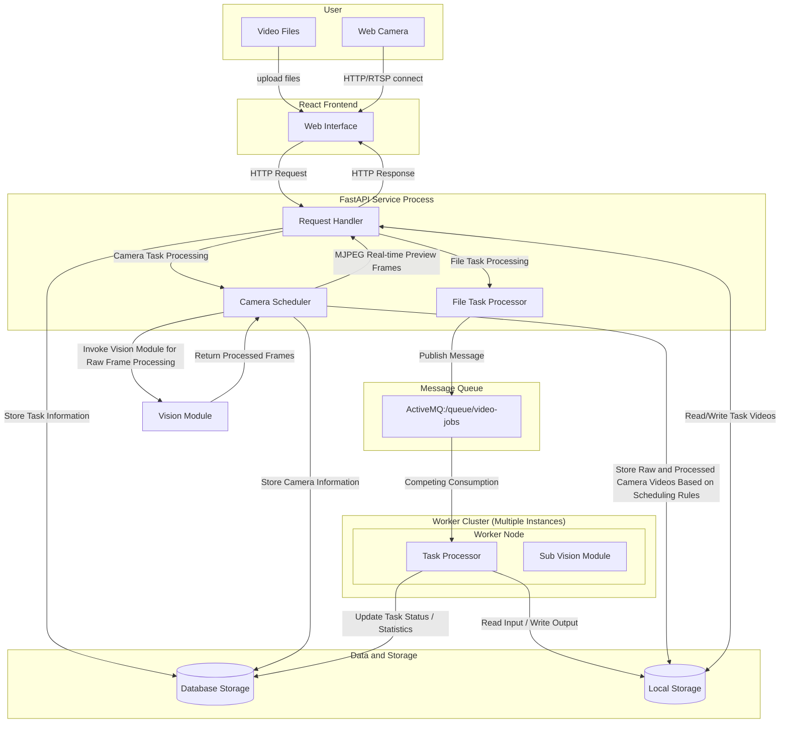
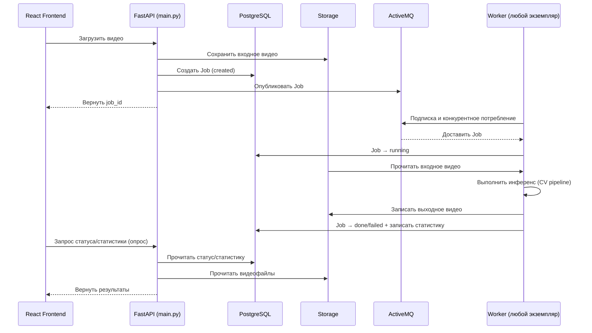
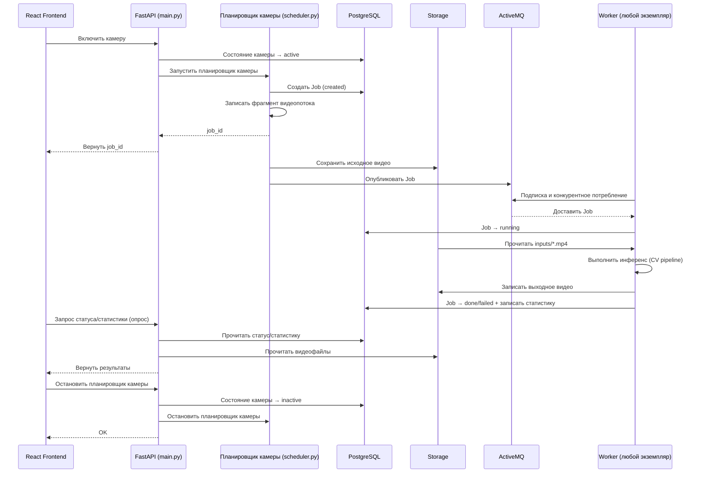
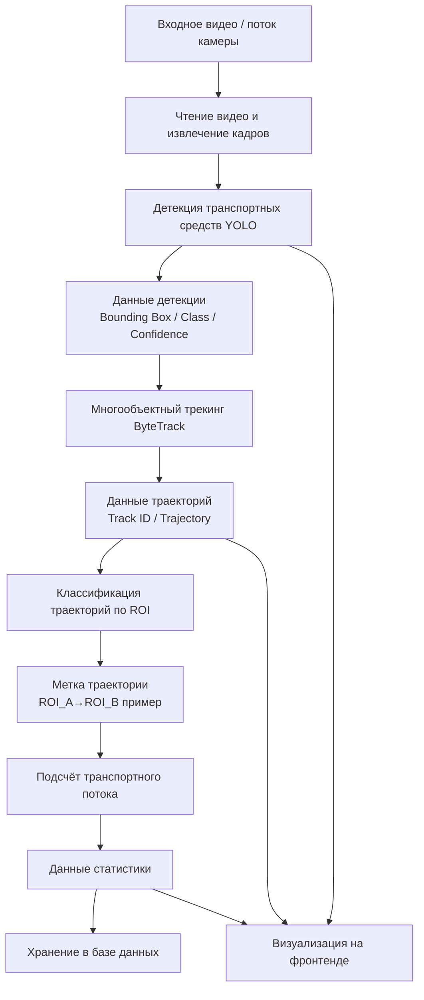
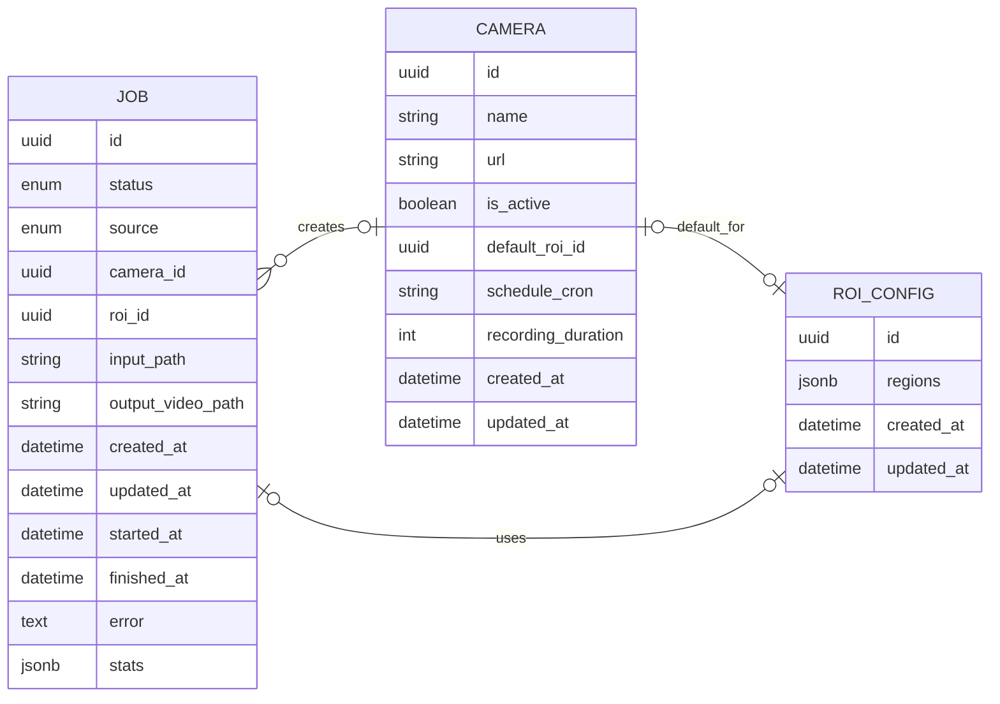

# Разработка приложения для детекции транспортных потоков с помощью компьютерного зрения

## СПИСОК СОКРАЩЕНИЙ И УСЛОВНЫХ ОБОЗНАЧЕНИЙ

БД — База данных  
ОС — Операционная система  
ИТС — Интеллектуальная транспортная система   
API — Application Programming Interface, интерфейс прикладного программирования  
HTTP — HyperText Transfer Protocol, протокол передачи гипертекста  
RTSP — Real Time Streaming Protocol, протокол потоковой передачи в реальном времени  
SSE — Server-Sent Events, события, отправляемые сервером  
FPS — Frames Per Second, кадров в секунду  
CPU — Central Processing Unit, центральный процессор  
GPU — Graphics Processing Unit, графический процессор  
RAM — Random access memory, оперативное запоминающее устройство  
VRAM — Video Random Access Memory, видеопамять     
CRUD — Create, Read, Update, Delete, операции создания/чтения/обновления/удаления  
SPA — Single Page Application, одностраничное веб-приложение  
MOT — Multi-Object Tracking, отслеживания нескольких объектов  
NMS — Non-Maximum Suppression, подавление немаксимумов 
ROI — Region of Interest, область интереса 
ID — Identity, идентификатор 
IoU — Intersection over Union, метрика перекрытия ограничивающих рамок
TP — True Positive, истинно положительные
FP — False Positive, ложно положительные
FN — False Negative, ложно отрицательные
TN — True Negative, истинно отрицательные
mAP — Mean Average Precision, средняя точность обнаружения
OPE — Overall Percentage Error, общая процентная ошибка
MAPE — Mean Absolute Percentage Error, средняя абсолютная процентная ошибка


## ТЕРМИНЫ И ОПРЕДЕЛЕНИЯ

Диаграмма последовательности — UML-диаграмма, на которой для заданного набора объектов на единой временной оси показаны жизненные циклы объектов и их взаимодействие в рамках сценария (прецедента).  
Детекция объектов — задача обнаружения объектов на изображении с оценкой положения (ограничивающая рамка), класса и уверенности распознавания.  
Ограничивающая рамка (Bounding Box) — прямоугольник, описывающий положение объекта на изображении.  
Отслеживание нескольких объектов(MOT) — задача межкадровой ассоциации детекций и присвоения объектам устойчивых ID для формирования траекторий.  
Идентификатор трека (Track ID) — уникальный ID, назначаемый трекером объекту и сохраняемый в последовательности кадров.  
Траектория — последовательность координат объекта во времени, полученная по результатам отслеживания.  
Область интереса (ROI, Region of Interest) — заданная пользователем область кадра, используемая для ограничения анализа и/или семантической классификации движения по направлениям.  
Классификация траекторий по ROI — отнесение траектории к направлению движения на основе порядка входа объекта в заданные ROI.  
Коэффициент реального времени — отношение длительности видео к времени его обработки; значение больше 1 означает обработку быстрее реального времени.   
Очередь сообщений — программный компонент, обеспечивающий асинхронную передачу задач между сервисами и развязку этапов «постановка задачи» и «выполнение».  
Конкурентное потребление — режим работы очереди, при котором несколько исполнителей получают задания из одной очереди по принципу распределения нагрузки между ними.  
SSE — механизм доставки событий от сервера к клиенту по одному HTTP-соединению в режиме потоковой передачи (однонаправленно от сервера).  
Cron‑расписание — строковое описание периодичности выполнения задач в формате cron (минуты/часы/дни/месяцы/дни недели).  

## Введение

С ускорением глобальной урбанизации и устойчивым развитием автомобильной промышленности количество транспортных средств в городах непрерывно растёт, что приводит к возрастающей нагрузке на городские дорожно-транспортные системы. При этом пропускная способность улично-дорожной сети не успевает увеличиваться сопоставимыми темпами, вследствие чего пробки становятся всё более частым явлением. Особенно остро данная проблема проявляется в зонах перекрёстков, где очереди транспортных средств и заторы формируют один из основных источников общей перегруженности сети. По статистике, значительная часть городских заторов концентрируется вблизи перекрёстков, что существенно снижает эффективность движения, увеличивает расход энергии и оказывает неблагоприятное влияние на окружающую среду. В этих условиях измерение транспортных потоков на перекрёстках как ключевой элемент мониторинга дорожной обстановки имеет большое значение для реализации адаптивного управления светофорным регулированием и снижения уровня перегрузки. Традиционные методы измерения интенсивности движения обычно опираются на индукционные петли, инфракрасные/радарные датчики и т. п., однако они характеризуются высокой стоимостью установки, сложностью обслуживания и ограниченной зоной контроля. В последние годы, благодаря развитию компьютерного зрения и глубокого обучения, методы детекции и подсчёта транспортных средств по данным видеонаблюдения стали одним из наиболее активно развивающихся направлений: сочетание алгоритмов обнаружения объектов и трекинга позволяет в реальном времени извлекать положения и траектории транспортных средств, формируя более богатые данные о транспортном потоке и обеспечивая надёжную основу для анализа состояния движения на перекрёстках.

Основной целью данного исследования является упрощение процесса детекции транспортных потоков на перекрёстках в сложных дорожных условиях на основе данных дорожного видеонаблюдения с использованием методов компьютерного зрения. В частности, путём построения алгоритмической системы детекции и отслеживания транспортных средств выполняется анализ видеопотока для транспортных средств, движущихся в различных направлениях, с целью обеспечения точной детекции транспортных средств, отслеживания их траекторий и подсчёта транспортного потока. Это позволяет преодолеть ограничения традиционных методов анализа транспортных потоков, повысить эффективность детекции, а также предоставить надёжную и удобную информационную поддержку для последующей разработки адаптивных систем управления светофорами и интеллектуальных транспортных систем.

Для достижения указанной цели в работе решаются следующие задачи:

1. Провести обзор работ и решений в области детекции транспортных потоков, выполнить анализ существующих подходов;
2. Собрать и подготовить видеоданные для тестирования и экспериментальной оценки;
3. Выбрать и реализовать алгоритмы детекции транспортных средств и их отслеживания;
4. Разработать алгоритм подсчёта интенсивности движения по направлениям;
5. Спроектировать и реализовать программную систему;
6. Провести оценку производительности и тестирование системы.

В результате выполнения перечисленных задач в работе будет создана автоматизированная система детекции транспортных потоков для сложных перекрёстков, предоставляющая данные для управления интеллектуальным транспортом, а также формирующая основу для дальнейших исследований по оптимизации дорожного движения и адаптивному светофорному регулированию.

## 1. ТЕОРЕТИЧЕСКИЙ ОБЗОР СИСТЕМЫ ДЕТЕКЦИИ ТРАНСПОРТНЫХ ПОТОКОВ И УПРАВЛЕНИЯ СВЕТОФОРАМИ

### 1.1 Актуальность исследования транспортных потоков

С ускорением урбанизации количество транспортных средств в городах демонстрирует быстрый рост. Увеличение числа автомобилей создаёт беспрецедентную нагрузку на городские дорожные сети, а проблемы заторов наиболее выражены в районах перекрёстков и на магистральных улицах, одновременно приводя к перерасходу энергии, ухудшению экологической обстановки и экономическим потерям.

В городской транспортной системе перекрёсток является ключевым узлом слияния потоков, поэтому эффективность его работы напрямую определяет пропускную способность сети в целом. Нерациональные планы светофорного регулирования приводят к длительным задержкам, росту длины очередей и, как следствие, к снижению пропускной способности. Кроме того, традиционные методы измерения потоков часто опираются на ручные наблюдения или простые датчики, что затрудняет получение данных в реальном времени и динамическое мониторирование, особенно в условиях многопоточных и сложных сцен.

Для снижения заторов и повышения эффективности движения особенно важно получать точную и оперативную информацию о транспортных потоках. Методы измерения на основе видеонаблюдения в сочетании с компьютерным зрением и глубоким обучением позволяют автоматически обнаруживать, отслеживать и подсчитывать транспортные средства, предоставляя научно обоснованные данные для оптимизации фаз светофоров и принятия управленческих решений. Такой подход компенсирует ограничения датчиков в части получения динамической информации и является важной опорой для развития интеллектуальных транспортных систем в рамках концепции «умного города».

Таким образом, исследования, направленные на автоматизированную детекцию транспортных потоков на сложных перекрёстках, обладают значимой теоретической и практической ценностью. Создание надёжной системы детекции и анализа, с одной стороны, упрощает сбор и обработку данных для органов управления дорожным движением, а с другой — может служить сенсорным уровнем интеллектуальной транспортной системы, обеспечивая технологическую базу для последующей реализации адаптивного светофорного регулирования, динамического распределения потоков на уровне района и других функций интеллектуальной оптимизации, повышающих эффективность движения и улучшающих городскую среду.

### 1.2 Обзор существующих методов детекции транспортных потоков

Детекция транспортных потоков является важной составляющей интеллектуальных транспортных систем и имеет длительную историю исследований и практического применения. В зависимости от используемых технических средств существующие методы в основном делятся на две категории: методы на основе датчиков и методы на основе компьютерного зрения.

#### 1.2.1 Методы детекции транспортных потоков на основе датчиков

К методам на основе датчиков относятся индукционные петли, радарные системы, лазерные (LiDAR) системы и инфракрасные датчики.

- Индукционные петли — зрелая технология электромагнитной индукции, при которой проводниковая петля, уложенная в дорожное покрытие, регистрирует возмущения магнитного поля, вызываемые проезжающими автомобилями. Это позволяет определять наличие транспорта и оценивать интенсивность, занятость и скорость. Достоинства: высокая точность, высокая оперативность и низкая чувствительность к освещённости и погоде. Недостатки: высокая стоимость установки и обслуживания, ограниченная информационная насыщенность и сложности масштабирования на многополосные и сложные сцены.

- Радарная детекция использует эффект Доплера: излучая электромагнитные волны и анализируя отражённый сигнал, система оценивает скорость и положение, обеспечивая бесконтактное измерение. Радар работает круглосуточно и может обеспечивать высокую точность, однако в условиях высокой плотности транспорта и выраженных взаимных перекрытий возможны ложные срабатывания и пропуски; кроме того, затруднено получение полноценной информации о траекториях.

- Лазерная (LiDAR) детекция определяет расстояния и пространственную структуру объектов по времени пролёта лазерных импульсов, формируя высокоточные 3D облака точек и позволяя детально собирать транспортную информацию. Метод отличается высокой точностью, но требует дорогостоящего оборудования, чувствителен к неблагоприятным погодным условиям, а обработка данных сложна.

- Инфракрасные датчики определяют присутствие транспорта по тепловому излучению или отражению инфракрасного света. Их конструкция относительно проста, а стоимость невысока, однако точность сильно зависит от освещённости и температуры окружающей среды, что ограничивает применимость в сложных сценах.

В целом методы на основе датчиков обеспечивают надёжную и стабильную работу на фиксированных объектах (перекрёстки, автомагистрали), но имеют ограничения в многополосных и сложных сценариях, а также при наличии требований к анализу траекторий.

#### 1.2.2 Методы детекции транспортных потоков на основе компьютерного зрения

С развитием компьютерного зрения методы детекции на основе видеоданных стали одной из наиболее активных областей исследований. Их ключевые преимущества — бесконтактность, богатство извлекаемой информации и высокая масштабируемость.

- Классические методы компьютерного зрения включают вычитание фона, оптический поток и контурный/морфологический анализ. Вычитание фона строит модель статического фона и выделяет движущиеся объекты, позволяя оценивать интенсивность и занятость, но чувствительно к изменениям освещения и склонно к пропускам при сильных перекрытиях. Методы оптического потока вычисляют поля движения пикселей, однако обладают высокой вычислительной сложностью и хуже подходят для плотных сцен. Контурные методы эффективны при низкой интенсивности, но имеют ограниченную применимость в сложных дорожных условиях.

- Подходы машинного обучения (например, HOG+SVM, Haar-признаки + AdaBoost) используют вручную спроектированные признаки и классификацию, повышая устойчивость по сравнению с классическими методами, но зависят от качества признаков и обычно обладают ограниченной обобщающей способностью.

Для преодоления указанных ограничений в последние годы широкое распространение получили методы детекции объектов и многoобъектного трекинга на основе глубокого обучения. В данной работе применяется подход, основанный на глубоком обучении: используется детектор YOLO для обнаружения транспортных средств и трекер ByteTrack для связывания объектов между кадрами, что позволяет получать устойчивые траектории. На этой основе реализуется алгоритм подсчёта потоков (например, по виртуальным линиям детекции или статистике по зонам) для автоматизированного анализа интенсивности движения по направлениям.

По сравнению с традиционными решениями данный подход имеет следующие преимущества:

- Высокая точность детекции: модели глубокого обучения автоматически извлекают многоуровневые признаки и лучше адаптируются к сложному фону;
- Высокая устойчивость трекинга: многoобъектные трекеры поддерживают согласованность ID и уменьшают повторный счёт и недосчёт;
- Применимость к сложным сценам: поддержка многополосного движения, нескольких направлений и высокой плотности;
- Богатство информации: помимо интенсивности (поток, занятость, направления) доступны траектории и характеристики движения;
- Высокая расширяемость: возможность дальнейшего использования данных для оптимизации светофорного регулирования и интеллектуального управления движением.

Таким образом, методы детекции транспортных потоков на основе глубокого обучения эффективно устраняют ограничения традиционных подходов и являются надёжным решением для высокоточного анализа интенсивности движения в сложных транспортных условиях.

### 1.3 Технологический стек системы

В данном разделе представлен технологический стек и ключевые алгоритмические модули, используемые при реализации системы. Цель — показать соответствие выбранных технологий требованиям системы (точность детекции, близкая к реальному времени обработка и расширяемость). В качестве основного языка разработки выбрана платформа Python; для чтения видеоданных, предобработки и визуализации используется библиотека OpenCV; в ключевом цепочке восприятия применяется YOLO для обнаружения транспортных средств и ByteTrack для многoобъектного трекинга с целью получения устойчивых траекторий. На этой основе модуль классификации траекторий и подсчёта потоков обеспечивает автоматизированный анализ многопоточных направлений движения на перекрёстках.

Далее последовательно рассматриваются четыре аспекта: язык программирования, методы детекции транспортных средств, методы многoобъектного трекинга и алгоритм классификации траекторий.

#### 1.3.1 Языки программирования

Для реализации видеосистемы детекции транспортных потоков на основе глубокого обучения к языку программирования предъявляются следующие требования:

- Эффективная обработка данных: видеоданные имеют большой объём; требуется чтение, обработка и анализ кадров в реальном времени, поэтому язык должен поддерживать эффективные матричные вычисления, обработку изображений и работу с большими объёмами данных.
- Богатая экосистема библиотек компьютерного зрения и глубокого обучения: ключевые модули системы основаны на YOLO и ByteTrack, поэтому важна поддержка зрелых фреймворков глубокого обучения (PyTorch, TensorFlow) и библиотек компьютерного зрения (OpenCV) для обучения, инференса и визуализации.
- Расширяемость и кроссплатформенность: с учётом возможного развёртывания на разных серверах или встраиваемых устройствах необходима поддержка нескольких ОС и удобная интеграция с базами данных, графическим интерфейсом, сетевыми модулями и модулем статистики.
- Скорость разработки и поддержка сообщества: задача включает реализацию и отладку сложных алгоритмов, поэтому важны высокая продуктивность разработки, читаемость и активное сообщество.

С учётом указанных требований в качестве основного языка разработки выбран Python.

#### 1.3.2 Методы детекция транспортных средств

В системе детекции транспортных потоков многoобъектная детекция является базовым модулем, обеспечивающим распознавание транспортных средств и последующий анализ трекинга. Система должна в реальном времени обнаруживать множество объектов в видеопоследовательности и выдавать их пространственные координаты (например, ограничивающие прямоугольники) и классы. В связи с этим к детектору предъявляются следующие требования:

- Высокая точность: корректное распознавание различных типов транспортных средств и низкие уровни ложных срабатываний и пропусков в сложном фоне;
- Высокая скорость: алгоритм должен обеспечивать достаточную скорость инференса для обработки видеопотока;
- Высокая устойчивость: стабильная работа при изменении освещения, перекрытиях и плотном движении;
- Хорошая интегрируемость: удобная стыковка с трекингом и модулем статистики.

В инженерной реализации для детекции используется комбинация OpenCV и алгоритма YOLO.

OpenCV (Open Source Computer Vision Library) — открытая библиотека компьютерного зрения с широким набором функций обработки изображений и видео: чтение видеопотока, предобработка, отрисовка рамок и визуализация. OpenCV обеспечивает покадровое чтение видеоданных и отображение результатов в реальном времени, выступая связующим звеном между моделью глубокого обучения и прикладным уровнем. Библиотека является кроссплатформенной и стабильно работает в различных ОС.

В части детектора выбран YOLO (You Only Look Once) — типичный одноэтапный детектор, превращающий задачу обнаружения объектов в задачу регрессии: единая нейросеть напрямую прогнозирует положение объектов и их классы. По сравнению с двухэтапными методами (например, Faster R-CNN) YOLO при сопоставимой точности существенно быстрее, что позволяет удовлетворить требованиям обработки в реальном времени.

Для дорожных сцен YOLO эффективно обнаруживает различные типы транспортных средств (легковые автомобили, грузовики, автобусы и т. п.) и сохраняет высокую производительность в многополосных и сложных условиях, обеспечивая надёжную основу для последующего анализа траекторий и подсчёта потоков.

#### 1.3.3 Методы отслеживания нескольких целей

После получения позиций объектов (рамок) на каждом кадре требуется многoобъектный трекер, который выполняет межкадровое связывание детекций, поддерживает постоянные идентификаторы (ID) и формирует траектории движения транспортных средств для дальнейшего подсчёта потоков и анализа поведения.

Для дорожных сцен к трекеру предъявляются требования:

1. Согласованность идентичности: сохранение уникального идентификатора одного и того же автомобиля в последовательности кадров, минимизация переключений ID;
2. Непрерывность траектории: сохранение траектории при перекрытиях или падении уверенности детектора, предотвращение разрывов;
3. Высокая эффективность: снижение общего времени обработки видео;
4. Совместимость с детектором: использование рамок, выдаваемых YOLO, для ассоциации.

С учётом указанных требований в работе используется алгоритм ByteTrack.

По сравнению с традиционными трекерами ByteTrack лучше работает при перекрытиях и нестабильной детекции. Многие методы (например, SORT) связывают только высокоуверенные детекции и часто теряют цель при перекрытии или снижении уверенности. ByteTrack дополнительно учитывает низкоуверенные детекции, повышая устойчивость продолжения трека.

Кроме того, по сравнению с методами, использующими признаки внешнего вида (например, DeepSORT), ByteTrack не требует отдельной сети извлечения признаков и избегает существенных вычислительных затрат, обеспечивая высокую скорость при хорошей точности, что соответствует требованиям дорожного мониторинга.

Таким образом, ByteTrack выбран в качестве многoобъектного трекера для получения устойчивых траекторий транспортных средств, служащих основой для последующей статистики и оптимизации управления движением.

#### 1.3.4 Алгоритм классификации траекторий

После детекции и трекинга, когда сформированы траектории движения транспортных средств, система должна классифицировать траектории и подсчитать интенсивность движения по направлениям.

К алгоритму классификации предъявляются требования:

1. Приспособленность к многопоточному движению: перекрёстки имеют несколько входов/выходов; траектории включают движение прямо, повороты налево/направо и т. п.; алгоритм должен быть применим к разным типам перекрёстков.
2. Низкая вычислительная сложность: модуль классификации работает совместно с детекцией и трекингом, поэтому не должен создавать значительную дополнительную нагрузку.
3. Интерпретируемость результатов: результат классификации должен быть понятным и объяснимым.

С учётом требований к обработке, расширяемости и инженерной реализуемости в работе применяется метод классификации траекторий и подсчёта потоков на основе пользовательских областей интереса (Region of Interest, ROI).

Суть метода состоит в том, что пользователь по структуре перекрёстка вручную задаёт несколько областей ROI на видеокадре, соответствующих направлениям движения (например, север/юг/восток/запад). Анализируя пространственные отношения между траекторией и ROI, система определяет направление движения: когда траектория входит в определённые ROI и завершает проезд, она относится к соответствующей категории, а счётчик по направлению обновляется.

Несмотря на ограничения в распознавании более сложного поведения (например, зависимость от устойчивости кадра: смещение или дрожание камеры может снижать точность; ручная разметка ROI требует качества), для задачи многопоточного подсчёта на перекрёстках подход на основе пользовательских ROI обеспечивает хороший баланс точности, скорости и практической реализуемости.

### 1.4 Вывод

В данной главе рассмотрены теоретические основы системы детекции транспортных потоков, существующие методы и выбранный технологический стек.

Во-первых, на основе актуальности проблемы городских заторов обоснована практическая потребность в автоматизированном подсчёте потоков на сложных перекрёстках. Во-вторых, с учётом требований системы выполнен анализ и выбор технологий. В итоге определено следующее решение:

В качестве языка программирования выбран Python, что обеспечивает быструю разработку и доступ к богатой экосистеме алгоритмических библиотек. В качестве инструмента обработки видео используется OpenCV, а высокоточная и быстрая детекция транспортных средств реализуется алгоритмом YOLO. Для многoобъектного трекинга применяется ByteTrack, обеспечивающий устойчивую ассоциацию идентичности и построение траекторий. Классификация траекторий и подсчёт потоков выполняются на основе пользовательских ROI для получения статистики по направлениям.

Выбранные решения формируют теоретическую и технологическую основу для последующего проектирования, реализации и экспериментальной проверки системы.

## 2. ТРЕБОВАНИЯ К СИСТЕМЕ ДЕТЕКЦИИ ТРАНСПОРТНЫХ ПОТОКОВ

После анализа теоретических основ и выбора технологий необходимо сформулировать функциональные и нефункциональные требования, чтобы система удовлетворяла практическим потребностям сложных дорожных сценариев. В данной главе рассматриваются функциональные и нефункциональные требования к системе детекции транспортных потоков на основе компьютерного зрения, что служит базой для последующего проектирования и реализации.

### 2.1 Функциональные требования

Функциональные требования описывают ключевые бизнес-функции, которые система должна обеспечивать. В рамках рассматриваемого сценария система ориентирована на анализ видео с городских перекрёстков и должна выполнять детекцию транспортных средств, трекинг, классификацию траекторий и подсчёт потоков. Система должна включать следующие функциональные модули.

| № | Функциональный модуль | Описание |
|---:|---|---|
| 1 | Ввод видео | Система должна принимать дорожные видеоданные в качестве входного источника и поддерживать чтение и разбор видео; поддерживать распространённые форматы (например, MP4, AVI и др.) и обеспечивать покадровую обработку, формируя входные данные для модуля детекции. |
| 2 | Детекция транспортных средств | Система должна автоматически распознавать транспортные средства на видео и выдавать их положение и класс; поддерживать типичные категории участников движения (например, легковые автомобили, автобусы, грузовики, мотоциклы) и отображать результаты в виде ограничивающих прямоугольников для использования в трекинге. |
| 3 | Многoобъектный трекинг | Система должна выполнять многoобъектное отслеживание, назначая каждому объекту уникальный идентификатор и поддерживая согласованность идентичности между кадрами для формирования полной траектории. |
| 4 | Конфигурация ROI | Система должна позволять пользователю настраивать ROI (Region of Interest) под конкретную сцену; пользователь задаёт области, соответствующие направлениям проезда. |
| 5 | Классификация траекторий | Система должна классифицировать направления движения по отношениям между траекторией и ROI (например, поворот налево, направо, движение прямо) и передавать эту информацию для подсчёта потока по направлениям. |
| 6 | Статистический подсчёт транспортного потока | Система должна автоматически подсчитывать количество транспортных средств по направлениям и исключать повторный счёт одного и того же автомобиля; результаты должны включать общий поток и потоки по направлениям. |
| 7 | Визуализация результатов | Система должна визуально отображать рамки детекции, траектории и статистику на видео, повышая интерпретируемость и удобство использования. |

Таким образом, система должна обеспечивать полный цикл обработки: от ввода видео и детекции до трекинга, классификации траекторий, подсчёта потоков и визуализации.

### 2.2 Нефункциональные требования

Помимо бизнес-функций система должна соответствовать требованиям по производительности, стабильности и пользовательскому опыту. Нефункциональные требования напрямую влияют на эффективность применения системы в реальных дорожных условиях. В работе рассматриваются требования по скорости, точности, стабильности, устойчивости к среде и удобству использования.

#### 2.2.1 Скорость

Система должна непрерывно анализировать видеопоток, поэтому требуется высокая эффективность обработки данных для работы в режиме реального времени или близком к реальному времени.

В процессе выполнения задач чтения видео, детекции, трекинга и подсчёта необходимо минимизировать задержку на кадр: детектор должен быстро распознавать объекты, а трекер — эффективно сопоставлять цели между кадрами, обеспечивая высокую общую производительность.

Кроме того, система должна эффективно использовать ресурсы и устойчиво работать в среде обычного GPU или высокопроизводительного CPU, снижая стоимость развёртывания.

#### 2.2.2 Точность

Точность статистики потока является ключевым показателем и определяет надёжность выходных данных.

Во-первых, модуль детекции должен обеспечивать высокую точность, снижая число ложных срабатываний и пропусков. Во-вторых, трекер должен поддерживать согласованность ID, предотвращая повторный счёт и статистические искажения. Кроме того, модуль классификации и подсчёта должен корректно определять категории траекторий и статистику по направлениям, чтобы гарантировать достоверность анализа.

Высокая точность является обязательной предпосылкой для дальнейшего использования результатов в анализе потоков и оптимизации управления светофорами.

#### 2.2.3 Стабильность

Система обычно должна работать длительное время, поэтому необходима устойчивость при продолжительной эксплуатации.

В процессе длительной обработки видео следует исключить аварийные завершения, утечки памяти, ошибки чтения видео и прерывания инференса.

При наличии повреждённых кадров или частичной потери данных система должна продолжать работу или корректно обрабатывать исключения, обеспечивая завершение задачи.

Кроме того, модули системы должны согласованно взаимодействовать, поддерживая стабильность обработки видео, детекции, трекинга и подсчёта.

#### 2.2.4 Устойчивость

Реальные дорожные условия сложны, поэтому системе требуется высокая устойчивость к изменениям среды и помехам.

На практике видеоданные могут иметь разную разрешающую способность, колебания кадровой частоты и кратковременные аномалии; система должна сохранять работоспособность при разных входных условиях.

Также типичны перекрытия транспортных средств, изменения освещения, тени и изменения плотности движения, которые влияют на результаты детекции и трекинга. Система должна сохранять приемлемые показатели в сложных сценах и по возможности снижать влияние внешних факторов.

Кроме того, система должна адаптироваться к различным дорожным структурам и углам камеры, используя пользовательскую настройку ROI для повышения универсальности.

#### 2.2.5 Удобство

Для повышения практической ценности система должна обеспечивать хороший пользовательский опыт.

Пользователь должен легко выполнять импорт видео, настройку ROI и запуск обработки. Результаты (рамки детекции, траектории и статистика) должны отображаться наглядно и удобно для анализа.

Интерфейс должен быть максимально простым и понятным, чтобы для базового использования не требовалось глубоких технических знаний.

Высокая удобство снижает стоимость внедрения и повышает потенциал распространения системы.

### 2.3 Вывод

В данной главе выполнен анализ требований к системе детекции транспортных потоков и сформулированы цели проектирования с точки зрения функциональных и нефункциональных требований.

По функциональным требованиям система должна обеспечивать ввод видео, детекцию, трекинг, классификацию траекторий, подсчёт потоков и визуализацию, формируя полный цикл анализа транспортной ситуации.

По нефункциональным требованиям система должна соответствовать требованиям скорости обработки, точности детекции и статистики, стабильности работы, устойчивости к сложным условиям и удобству взаимодействия.

Результаты анализа показывают, что система должна сочетать высокие алгоритмические показатели с инженерной реализуемостью и практической применимостью.

На основе сформулированных требований в следующей главе будет рассмотрено проектирование архитектуры, ключевых модулей и конкретного плана реализации системы.

## 3 ПРОЕКТИРОВАНИЕ И РЕАЛИЗАЦИЯ СИСТЕМЫ

Опираясь на теоретический обзор, выбор технологий и анализ требований, в данной главе рассматриваются проектирование и инженерная реализация системы детекции транспортных потоков. Глава последовательно описывает полный процесс — от построения архитектуры до реализации ключевых функций. Сначала рассматривается многослойная архитектура, логика взаимодействия модулей и поток данных, включая разделение ответственности между фронтендом, бэкендом, модулем компьютерного зрения и системой хранения. Далее подробно описываются реализации основных модулей: обработка входного видео, инженерная интеграция детекции и трекинга, логика классификации и подсчёта на основе ROI, а также реализация взаимодействия между фронтендом и бэкендом. В завершение приводится обзор применённых методов оптимизации производительности.

### 3.1 Проектирование системы

Далее описывается общий замысел проектирования системы: формируется техническая архитектура и логика выполнения, которые служат основой для дальнейшего выделения функциональных модулей и инженерной реализации. Проектирование представлено в трёх аспектах: многослойная архитектура системы, диаграммы последовательности взаимодействия модулей и логика потоков данных. Это обеспечивает полноту функциональности, расширяемость и практическую реализуемость системы для сложных перекрёстков.

#### 3.1.1 Архитектура системы

Для реализации автоматизированной детекции и анализа транспортных потоков на сложных дорожных сценах используется модульный подход и многослойная архитектура. Система состоит из четырёх основных частей: фронтенд (Frontend), бэкенд (Backend), модуль компьютерного зрения (Vision Module) и подсистема хранения данных (Data Storage). Модули взаимодействуют через интерфейсы и совместно обеспечивают сбор видео, детекцию, трекинг, классификацию траекторий и подсчёт потоков.


Рис. 3-1. Общая архитектура системы

Состав архитектуры (рис. 3-1) включает следующие модули:

1. Фронтенд (Frontend)

Фронтенд отвечает за взаимодействие с пользователем и отображение результатов, являясь основным интерфейсом системы. Он включает:

- Загрузка видео (Upload Video): пользователь загружает локальный видеоролик для офлайн-анализа.
- Подключение сетевой камеры (Network Cam): поддерживается подключение сетевых камер по протоколам HTTP или RTSP для получения видеопотока в реальном времени.
- Панель визуализации (Dashboard Display): отображение результатов детекции, траекторий и статистики потоков.

Фронтенд взаимодействует с бэкендом по HTTP и получает результаты детекции и статистические данные.

2. Бэкенд (Backend)

Бэкенд является центральной управляющей частью системы: реализует бизнес-логику, планирование задач и коммуникацию между компонентами.

В работе бэкенд реализован на Python с использованием FastAPI. FastAPI отличается лёгкостью, высокой производительностью и хорошей поддержкой асинхронной обработки, что соответствует требованиям к высокой параллельности и близкой к реальному времени обработке.

Бэкенд включает:

- Python + FastAPI: управление API, контроль задач и взаимодействие фронтенда и бэкенда.
- Очередь сообщений (Message Queue): поскольку анализ видео вычислительно затратен, используется асинхронная распределённая обработка; очередь сообщений обеспечивает развязку и асинхронное выполнение, повышая пропускную способность.
- Планировщик задач (Task Scheduler): управляет заданиями анализа и заданиями записи с камер, обеспечивая расписание и контроль состояния.

Бэкенд координирует обмен данными между модулем компьютерного зрения и подсистемой хранения и управляет общим ходом работы системы.

3. Модуль компьютерного зрения (Vision Module)

Модуль компьютерного зрения — ключевой функциональный компонент системы, выполняющий детекцию транспортных средств, трекинг и анализ потоков.

Он включает:

- Детекция транспортных средств (Vehicle Detection): детекция транспортных средств с помощью YOLO и выдача рамок и классов.
- Многoобъектный трекинг (Multi-Object Tracking): отслеживание с ByteTrack, назначение уникальных ID и построение траекторий.
- Анализ направлений и подсчёт трафика (Direction & Traffic Analysis): классификация направлений по траекториям и ROI и статистический подсчёт.

Модуль обеспечивает автоматизированный анализ сложных дорожных сцен и предоставляет данные для управления движением и оптимизации светофорного регулирования.

4. Подсистема хранения данных (Data Storage)

Подсистема хранения отвечает за сохранение и управление данными, формируемыми в ходе работы.

Применяется многоуровневый подход:

- PostgreSQL: хранение структурированных данных (задачи, конфигурации камер, конфигурации ROI, статистика).
- Локальное файловое хранилище (Local Storage): хранение исходных и результирующих видеоданных; текущая реализация использует локальные директории сервера с возможностью замены на объектное хранилище (S3/MinIO).

Разделение хранения повышает управляемость данных и возможности последующего анализа.

Для иллюстрации взаимодействия модулей спроектирована схема процесса работы (рис. 3-2).


Рис. 3-2. Схема выполнения (workflow) системы

В ходе работы пользователь загружает видеофайлы через фронтенд или подключает сетевую камеру (HTTP/RTSP). Затем видеоданные передаются на бэкенд, который выполняет диспетчеризацию и асинхронную обработку, после чего отправляет задачу в модуль компьютерного зрения. По завершении анализа результаты детекции и статистики сохраняются в подсистеме хранения и отображаются пользователю во фронтенде.

#### 3.1.2 Диаграммы последовательности

Для описания взаимодействия модулей используются диаграммы последовательности (Sequence Diagram), моделирующие передачу сообщений, диспетчеризацию и потоки данных. Рассматриваются два основных процесса: офлайн-анализ на основе загруженного файла и анализ видеопотока с сетевой камеры.

Диаграммы позволяют явно показать взаимодействие между пользователем, фронтендом, сервисом FastAPI, очередью сообщений, узлом Worker и подсистемой хранения, тем самым раскрывая механизм работы системы.

1. Процесс анализа загруженного видео

Данный процесс предназначен для обработки локальных видеороликов, загружаемых пользователем. Используется асинхронный механизм выполнения, развязывающий создание задачи и фактический анализ видео, а также позволяющий распределённо выполнять задачи (рис. 3-3).

Пользователь загружает видео через фронтенд React, после чего фронтенд отправляет HTTP-запрос на FastAPI для создания задачи анализа.

После получения запроса бэкенд сохраняет исходный видеоролик в локальном хранилище и создаёт запись задачи в PostgreSQL со статусом «created». Далее информация о задаче (ID и путь к файлу) публикуется в очередь ActiveMQ.

Worker постоянно прослушивает очередь и, используя конкурентное потребление, получает задачу. Получив задачу, Worker обновляет статус на «running», читает входное видео и вызывает модуль компьютерного зрения для выполнения детекции, трекинга и подсчёта потоков.

После завершения обработки Worker формирует выходное видео, затем транскодирует его в браузерно-совместимый формат MP4. Статистика и статус задачи записываются в базу данных.

Во время выполнения фронтенд периодически обращается к API для получения статуса, статистики и выходного видео. После завершения задачи результаты отображаются в интерфейсе.

Данный подход с очередью сообщений обеспечивает асинхронность, предотвращает блокировку Web-сервиса длительными вычислениями и повышает общую пропускную способность и устойчивость системы.


Диаграмма последовательности 1. Процесс анализа загруженного видео

2. Процесс анализа в режиме сетевой камеры

Помимо офлайн-анализа система поддерживает периодический анализ видеопотока с сетевой камеры, предназначенный для непрерывного мониторинга и статистики в реальном времени (рис. 3-4).

Пользователь активирует камеру через фронтенд. Бэкенд обновляет состояние камеры на «active» и запускает планировщик.

Планировщик по заданным правилам периодически создаёт задачи анализа и асинхронно записывает видеопоток. Записанные фрагменты сохраняются в локальном хранилище, а информация о задачах публикуется в очередь.

Worker получает задачи из очереди и выполняет анализ, включая детекцию, трекинг и подсчёт потоков. Результаты сохраняются в базе и локальном хранилище.

Фронтенд периодически запрашивает статус и статистику, обеспечивая обновление данных для пользователя в близком к реальному времени режиме.

При остановке камеры бэкенд переводит состояние на «inactive» и прекращает создание новых задач.

По сравнению с синхронной обработкой асинхронный механизм на основе очереди и кластера Worker повышает эффективность обработки видео и поддерживает параллельное выполнение нескольких задач, что важно для масштабного анализа в сложных дорожных условиях.


Диаграмма последовательности 2. Процесс анализа видеопотока сетевой камеры

#### 3.1.3 Поток данных

Для описания внутренней обработки анализируется поток данных и структура хранения. Проектирование потока данных описывает передачу, обработку и преобразование информации между модулями, а проектирование хранения — способы долговременного сохранения данных, возникающих при анализе.

Процесс обработки включает этапы: ввод видео, извлечение кадров, детекция, трекинг, классификация траекторий по ROI, подсчёт потоков и выдача результатов. Система принимает видео или поток камеры, извлекает кадры с OpenCV, выполняет детекцию YOLO, трекинг ByteTrack, классифицирует направления по ROI, выполняет статистический подсчёт и сохраняет результаты в базу и локальное хранилище, после чего отображает их на фронтенде. Общая схема показана на рис. 3-3.


Рис. 3-3. Схема потока данных системы

Для долговременного хранения данных используется PostgreSQL для структурированных данных (задачи, камеры, конфигурации ROI), а видеофайлы и результаты хранятся в локальной директории сервера.

Основные таблицы и связи показаны на рис. 3-4.



Рис. 3-4. ER-диаграмма базы данных системы

Таблица Job хранит данные задач анализа: статус, пути к входным/выходным видео, временные отметки выполнения и статистику. Статистика хранится в JSON для поддержки динамической структуры данных по направлениям.

Таблица Camera хранит конфигурации камер и информацию планировщика: адрес, состояние и расписание записи. Для планирования используется Cron-выражение.

Таблица RoiConfig хранит конфигурацию ROI, заданную пользователем. Поскольку ROI представляет собой динамическую многоугольную структуру (разное число вершин), используется тип JSONB PostgreSQL для хранения координат, что повышает адаптивность к сложным ROI.

Таким образом, описанные поток данных и схема хранения обеспечивают полный автоматизированный цикл от входного видео до выдачи статистики, а также согласованность, стабильность и расширяемость передачи и сохранения данных между модулями.

### 3.2 Реализация системы

Данный раздел предназначен для нормативного описания процесса реализации системы.

На основе проектирования из раздела 3.1 далее приводятся детали реализации на инженерном уровне. Система построена вокруг цепочки обработки «получение видео — детекция — трекинг — семантическая классификация траектории — подсчёт и визуализация статистики» и использует разделение фронтенда и бэкенда и асинхронный механизм задач для развязки вычислительно затратного анализа видео и Web-взаимодействия: фронтенд отвечает за создание задач, предпросмотр, разметку ROI и отображение статистики; бэкенд — за управление файлами, жизненным циклом задач, планирование и API; модуль зрения — за покадровый инференс, генерацию траекторий и выходного видео; очередь сообщений — за передачу задач между Web-сервисом и вычислительными воркерами, обеспечивая конкурентное потребление и горизонтальное масштабирование. В результате реализован анализ потоков по направлениям для перекрёстков и визуализация результатов.

#### 3.2.1 Реализация обработки видео

Обработка видео является входным и предобрабатывающим этапом, обеспечивающим получение видеоданных из разных источников и приведение их к единому виду. Система поддерживает два способа ввода:

1. загрузка локального видеофайла пользователем через браузер;
2. сбор видеосегментов с сетевой камеры по расписанию (Cron), выполняемый серверным планировщиком.

Обе схемы имеют единый инженерный результат до начала анализа: видео сохраняется как локальный MP4-файл и становится стабильным источником для покадровой обработки, что позволяет избежать выполнения длительного инференса в жизненном цикле Web-запроса.

Для загрузки локального видео бэкенд через `/api/jobs` принимает `multipart/form-data`, сохраняет файл во входной директории, создаёт запись в базе и отправляет задачу в очередь. Ключевая идея — развязать «успешную загрузку» и «завершение анализа»: запрос загрузки выполняет только сохранение и постановку в очередь, а инференс выполняется асинхронно Worker’ом, что обеспечивает быстрый ответ API и расширяемость.

Для режима камеры используется APScheduler: по `schedule_cron` запускается запись, OpenCV `VideoCapture` читает поток, по длительности рассчитывается число кадров и формируется временный файл; по завершении запись также становится стандартной задачей для очереди. Это позволяет обеим схемам полностью переиспользовать один и тот же конвейер анализа: при наличии пути к входному видео можно запускать единый процесс детекции и трекинга.

На этапе анализа применяется типичный конвейер «покадровое чтение — инференс — отрисовка — запись результата — агрегация статистики». Для удобства сопровождения `VideoCapture/VideoWriter` OpenCV инкапсулированы в единый обработчик, а основной цикл по кадрам выполняет детекцию и трекинг, записывая визуализированный результат в выходной файл. Ниже приведён фрагмент кода, демонстрирующий ключевую логику:

```python
def process_video(input_video_path: str, output_video_path: str, model_path: str, detector=None, conf=0.5, iou=0.5, classes=None):
    video_handler = VideoHandler(input_video_path)
    out_tmp_path = output_video_path.replace(".mp4", "_tmp.mp4")
    video_handler.setup_writer(out_tmp_path)
    if detector is None:
        detector = VehicleDetector(model_path)
    visualizer = Visualizer(max_history=30, auto_clear=True)

    frame_count = 0
    ids_by_class = {}
    trajectories = {}
    while True:
        ret, frame = video_handler.read_frame()
        if not ret:
            break
        frame_count += 1
        results = detector.track(frame, conf=conf, iou=iou, classes=classes, persist=True, tracker="bytetrack.yaml")
        if results and results[0].boxes.id is not None:
            track_ids = results[0].boxes.id.int().cpu().tolist()
            class_ids = results[0].boxes.cls.int().cpu().tolist()
            centers = results[0].boxes.xywh.cpu().tolist()
            for tid, cid, center in zip(track_ids, class_ids, centers):
                ids_by_class.setdefault(cid, set()).add(tid)
                _append_trajectory_point(trajectories, tid, cid, center[0], center[1], frame_count, sample_step=3, max_points=400)
        annotated = visualizer.draw_detections(frame, results)
        video_handler.write_frame(annotated)

    video_handler.release(destroy_windows=False)
    transcode_video(out_tmp_path, output_video_path)
    unique_ids_by_class = {int(k): len(v) for k, v in ids_by_class.items()}
    return frame_count, unique_ids_by_class, trajectories
```

Для обеспечения стабильного воспроизведения результата в разных браузерах введён единый шаг транскодирования. На практике совместимость MP4 зависит от параметров контейнера и кодирования, в частности при различиях конфигураций H.264 или при отсутствии `moov`-метаданных в начале файла могут возникать проблемы воспроизведения и перемотки. Поэтому после записи временного файла система вызывает FFmpeg для транскодирования в H.264 и включения `faststart` для переноса метаданных в начало файла, что повышает совместимость онлайн-воспроизведения. Аналогичный шаг выполняется и для сегментов, записанных с камеры, снижая неопределённость кодеков в дальнейшем конвейере.

#### 3.2.2 Детекция и отслеживание транспортных средств

Детекция транспортных средств реализована на основе YOLOv8. Алгоритмы семейства YOLO относятся к одноэтапным детекторам и выполняют локализацию и классификацию в рамках одного прохода, что обеспечивает высокую скорость инференса и удобство развёртывания. В типовой реализации YOLOv8 включает backbone (извлечение признаков), neck (мультишкальное объединение признаков) и head (регрессия рамок и вероятности классов). Для перекрёстков характерна высокая вариативность масштабов целей (одновременно присутствуют дальние малые объекты и ближние крупные), поэтому мультишкальная детекция критична для повышения полноты (recall).

YOLOv8 предлагает несколько масштабов моделей (n/s/m/l/x), различающихся шириной/глубиной сети и числом параметров: более крупные модели обычно точнее, но требуют больше времени и памяти. Для дорожных сцен с плотными целями и необходимостью устойчивого трекинга выбор модели представляет компромисс между точностью и производительностью.

Таблица 3-1. Сравнение параметров и производительности моделей YOLOv8

| Масштаб модели | Параметры (M) | FLOPs (B) | COCO mAP<sup>val<br>0.5:0.95 |  FPS на Tesla T4 |
|----------|-------------|----------------|-------------------------------|---------------------------|
| YOLOv8n  | 3.2         | 4.5            | 37.3                          | 161                       |
| YOLOv8s  | 11.2        | 28.6           | 44.9                          | 88                        |
| YOLOv8m  | 25.9        | 78.9           | 50.2                          | 39                        |
| YOLOv8l  | 43.7        | 165.1          | 52.9                          | 23                        |
| YOLOv8x  | 68.2        | 258.5          | 53.9                          | 16                        |

**Примечание к таблице**: значения числа параметров, FLOPs, COCO mAP и скорости инференса приведены по официальным бенчмаркам YOLOv8 при размере входного изображения 640×640.

В итоге для распознавания транспортных средств на перекрёстках в системе выбрана модель YOLOv8m. Выбор обусловлен тремя факторами: (1) на перекрёстках часто присутствуют дальние малые объекты и перекрытия; базовая точность YOLOv8m обеспечивает баланс по пропускам в сложных сценах, увеличивая полноту детекции малых и перекрытых объектов примерно на 8–12% по сравнению с версиями n/s; (2) в среде с потребительскими GPU (например, серии RTX 30/40) YOLOv8m стабильно обеспечивает 25+ FPS, что соответствует анализу видеонаблюдения 1080P@30fps в реальном времени; (3) обобщающая способность и устойчивость при ухудшенном качестве изображения (дождь, контровой свет) у YOLOv8m выше, чем у облегчённых версий, что соответствует требованиям многосценового развёртывания.

После выбора YOLOv8m в качестве детектора следует отметить, что в данной работе акцент сделан на инженерной реализации и проверке практической применимости системы подсчёта потоков на перекрёстке, а не на оптимизации предельной точности модели под конкретную сцену. Из‑за ограничений по времени и по условиям сбора/разметки данных с камер дополнительное обучение или дообучение детектора не выполнялось; поэтому дальнейшая реализация и тестирование проводятся с использованием предобученных весов YOLOv8 `yolov8m.pt`.

На основе результатов детекции этап многoобъектного трекинга (MOT) связывает одну и ту же машину в последовательности кадров и присваивает устойчивый `track_id`, формируя траекторию. В работе используется ByteTrack, который выполняет ассоциацию по рамкам детектора: сначала сопоставляет высокоуверенные рамки для устойчивого соответствия, затем использует низкоуверенные рамки для восстановления перекрытых или слабодетектируемых целей. По сравнению со стратегиями, использующими только высокоуверенные рамки, ByteTrack реже даёт разрывы и переключения ID в плотных сценах и при перекрытиях.

В инженерной реализации YOLOv8 предоставляет интерфейс `model.track()`, уже объединяющий детекцию и трекинг; поэтому система инкапсулирует эти возможности в классе `VehicleDetector`, централизуя выбор устройства, half-precision, входной размер и пороги. Для снижения накладных расходов Worker при запуске «разогревает» модель и кэширует экземпляр детектора, после чего переиспользует его в задачах, повышая пропускную способность. В цикле покадровой обработки `track()` выполняет объединённый инференс: детектор выдаёт рамки, трекер (по умолчанию ByteTrack) выполняет ассоциацию и возвращает результаты с `track_id`.

Ниже приведён ключевой интерфейс `track()`: параметры `conf` и `iou` контролируют ложные срабатывания и силу NMS; `classes` ограничивает детекцию транспортными классами. В системе по умолчанию используется список `[2, 3, 5, 7]` (COCO: car, motorcycle, bus, truck), что фокусирует обработку на релевантных участниках движения. Параметр `persist=True` сохраняет состояние трекинга между кадрами, а `tracker` задаёт конфигурацию трекера (например, `bytetrack.yaml` или `botsort.yaml`).

```python
def track(self, frame, conf=0.5, iou=0.5, classes=None, persist=True, tracker="bytetrack.yaml"):
    kwargs = {
        "conf": conf,
        "iou": iou,
        "classes": classes,
        "device": self.device,
        "half": self.half,
        "imgsz": self.imgsz,
        "persist": persist,
        "tracker": tracker,
        "verbose": False,
    }
    return self.model.track(frame, **kwargs)
```

За счёт объединённого инференса система получает рамки детекции и согласованные `track_id`, а на этапе визуализации накладывает рамки, подписи классов и ID на выходное видео.

Рис. 3-5. Пример результата детекции (заполнитель). Примечание: на типичном кадре тестового видео показаны ограничивающие рамки, метки классов и идентификаторы треков.

Для визуализации и хранения траекторий система поддерживает историю центров для каждого `track_id` и рисует полилинию, отображая движение объекта и непрерывность трека. Ниже приведён фрагмент «обновление истории + отрисовка»:

```python
class Visualizer:
    def draw_trails(self, frame):
        for track_id, points in self.track_history.items():
            if len(points) < 2:
                continue
            pts = np.array(points, np.int32).reshape((-1, 1, 2))
            cv2.polylines(frame, [pts], isClosed=False, color=self.get_color(track_id), thickness=2)
        return frame
```

Итоговый результат трекинга имеет вид, показанный на иллюстрации.

Рис. 3-6. Пример визуализации трекинга (заполнитель). Примечание: один и тот же автомобиль сохраняет неизменный `track_id` на последовательности кадров; траектория непрерывна и может восстанавливаться после кратковременных перекрытий.

#### 3.2.3 Классификация траекторий и подсчёт трафика

Система подсчёта реализована на двух уровнях: бэкенд формирует базовые данные траекторий и счётчиков, пригодные для повторного использования и сохранения в базу, а фронтенд выполняет семантическую классификацию на основе пользовательских ROI и визуализирует статистику по направлениям. Такое разделение снижает вычислительную сложность бэкенда (избегая частых изменений жёстко привязанных к сцене правил) и позволяет пользователю быстро адаптировать систему к разным перекрёсткам и ракурсам камеры посредством перерисовки ROI.

На бэкенде уникальный подсчёт выполняется по `track_id`: для каждого `class_id` поддерживается множество `set(track_id)`, а итоговый размер множества даёт число уникальных объектов, предотвращая повторный счёт одной машины в разных кадрах. Для визуализации и классификации фронтенду передаются траектории: центры по кадрам сохраняются с дискретизацией по шагу и ограничением максимального числа точек, чтобы контролировать объём данных и нагрузку рендеринга. Ниже приведён фрагмент формирования структуры траекторий:

```python
def _append_trajectory_point(trajectories, track_id, class_id, center_x, center_y, frame_index, sample_step, max_points):
    if frame_index % sample_step != 0:
        return
    key = str(track_id)
    if key not in trajectories:
        trajectories[key] = {"class_id": int(class_id), "points": []}
    trajectories[key]["class_id"] = int(class_id)
    trajectories[key]["points"].append([int(frame_index), round(float(center_x), 2), round(float(center_y), 2)])
    if len(trajectories[key]["points"]) > max_points:
        trajectories[key]["points"] = trajectories[key]["points"][-max_points:]
```

Итоговая статистика (число кадров, число уникальных целей по классам, последовательности точек траекторий и т. п.) сохраняется в записи задачи в формате JSON и доступна через `/api/jobs/{job_id}/stats`.

На фронтенде система предоставляет интерфейс рисования и редактирования ROI (многоугольников) и использует критерий «точка внутри ROI» как событие для траекторий. Для каждой траектории перебираются дискретизированные точки, и для каждого ROI поддерживается состояние «внутри/снаружи»: при первом входе точки из внешней области в ROI фиксируется событие enter, и имя ROI добавляется в последовательность входов. Итоговая метка траектории формируется конкатенацией последовательности, например `ROI_W→ROI_E`. Если траектория не входит ни в один ROI, она маркируется как «не классифицирована». Ниже приведён фрагмент логики:

```javascript
// Ключевой фрагмент классификации траекторий
for (const [frame, x, y] of points) {
  for (let ri = 0; ri < rois.length; ri++) {
    const inside = pointInPolygon(x, y, rois[ri].points);
    if (!roiStates[ri] && inside) {
      if (!entered.has(rois[ri].name)) enterOrder.push(rois[ri].name);
      entered.add(rois[ri].name);
    }
    roiStates[ri] = inside;
  }
}
const label = enterOrder.length ? enterOrder.join('→') : t('roi.unclassified');
```

ROI привязан к задаче: каждая задача имеет собственную конфигурацию ROI. При этом для сетевой камеры поддерживается «ROI по умолчанию»: при создании задачи на основе планировщика камера может клонировать свою конфигурацию ROI в задачу, уменьшая трудозатраты на повторную разметку. На бэкенде выполняется проверка корректности имён ROI (буквы/цифры/подчёркивание) и корректности полигона (минимум 3 точки); после чего ROI сохраняется в `roi_configs.regions` как JSON, например:

```json
[
  {
    "id": "2e0a7e1c-0f22-4e1b-8a4c-1f6b0b4b2c9d",
    "name": "ROI_N",
    "points": [[312, 128], [510, 140], [548, 260], [290, 248]]
  },
  {
    "id": "a1b4f2d6-9a77-4a2a-9a2b-2f8f4a4c8f11",
    "name": "ROI_S",
    "points": [[320, 620], [560, 612], [590, 716], [300, 728]]
  },
  ... другие ROI
]
```

Для визуализации фронтенд агрегирует «видимые траектории» по меткам и отображает результаты в виде столбчатых и круговых диаграмм, поддерживая фильтрацию по категориям, что позволяет наглядно сравнивать распределения по направлениям.

Рис. 3-7. Интерфейс разметки и управления ROI (заполнитель). Примечание: пользователь рисует многоугольные ROI на кадре, задаёт имена, редактирует и удаляет; интерфейс также показывает наложение траекторий.

Рис. 3-8. Классификация траекторий и отображение статистики потоков (заполнитель). Примечание: подсчёт по меткам вида `ROI_A→ROI_B` и визуализация распределений (столбчатая/круговая диаграмма).

Таблица 3-4. Пример результатов классифицированной статистики (заполнитель). Примечание: приводятся счётчики по основным маршрутам и сопоставление с ручным подсчётом/ожидаемыми направлениями движения.

#### 3.2.4 Реализация бэкэнда

Бэкенд построен на FastAPI как единый процесс API и организован по трёхуровневой структуре директорий «app (уровень приложения) — vision (уровень компьютерного зрения) — worker (рабочие процессы)», что строго разделяет интерфейсную логику, бизнес-оркестрацию и алгоритмический инференс. Структура проекта:

```text
backend/
├─ app/
│  ├─ __init__.py
│  ├─ db.py
│  ├─ main.py
│  ├─ models.py
│  ├─ mq.py
│  ├─ scheduler.py
│  ├─ schemas.py
│  ├─ settings.py
│  └─ storage.py
├─ vision/
│  ├─ openh264/
│  │  └─ openh264-1.8.0-win64.dll
│  ├─ __init__.py
│  ├─ detector.py
│  ├─ openh264_loader.py
│  ├─ pipeline.py
│  ├─ recorder.py
│  ├─ video_handler.py
│  └─ visualizer.py
├─ worker/
│  ├─ __init__.py
│  └─ worker.py
└─ requirements.txt
```

В части управления жизненным циклом приложения при старте автоматически создаются таблицы, выполняется обработка совместимости перечислимых типов PostgreSQL и таблицы конфигураций ROI для корректной инициализации в разных окружениях; одновременно запускается планировщик камер для загрузки расписаний активных камер.

Проектирование API следует ресурсной модели и охватывает три ключевых ресурса: задачи (jobs), камеры (cameras) и ROI (rois). Интерфейсы задач включают создание, список, детали, статистику, доступ к входному и результатному видео и удаление; интерфейсы камер — CRUD, ручной запуск записи, предпросмотр и снимок; интерфейсы ROI — CRUD для ROI задач и поддержка ROI по умолчанию для камер. Проект использует автоматическую документацию OpenAPI FastAPI; фронтенд предоставляет вход на `/docs` для интеграции и проверки. Основные интерфейсы суммированы в табл. 3-5.

Таблица 3-5. Список API интерфейсов бэкенда  
| Endpoint | Метод | Описание |
| --- | --- | --- |
| `/api/jobs` | POST | Создание задачи анализа (загрузка видеофайла). |
| `/api/jobs` | GET | Получение списка задач (с пагинацией). |
| `/api/jobs/stream` | GET | Поток обновлений статусов задач (SSE). |
| `/api/jobs/{job_id}` | GET | Получение деталей задачи по идентификатору. |
| `/api/jobs/{job_id}/stats` | GET | Получение статистики задачи (в т. ч. траектории). |
| `/api/jobs/{job_id}/input` | GET | Получение входного видео задачи. |
| `/api/jobs/{job_id}/result` | GET | Получение обработанного видео (результата). |
| `/api/jobs/{job_id}/frame` | GET | Получение кадра задачи по номеру (изображение). |
| `/api/jobs/{job_id}` | DELETE | Удаление задачи и связанных файлов. |
| `/api/jobs` | DELETE | Очистка списка задач (удаление всех). |
| `/api/cameras` | POST | Создание конфигурации камеры. |
| `/api/cameras` | GET | Получение списка камер. |
| `/api/cameras/{camera_id}` | PUT | Обновление конфигурации камеры. |
| `/api/cameras/{camera_id}` | DELETE | Удаление камеры. |
| `/api/cameras/{camera_id}/trigger` | POST | Ручной запуск записи/создания задачи для камеры. |
| `/api/cameras/{camera_id}/preview/{stream_type}` | GET | Предпросмотр потока камеры (MJPEG). |
| `/api/cameras/{camera_id}/snapshot` | GET | Получение снимка (один кадр) с камеры. |
| `/api/cameras/{camera_id}/default-roi` | GET | Получение ROI по умолчанию для камеры. |
| `/api/cameras/{camera_id}/default-roi` | POST | Создание ROI по умолчанию для камеры. |
| `/api/cameras/{camera_id}/default-roi/{roi_id}` | PUT | Обновление ROI по умолчанию для камеры. |
| `/api/cameras/{camera_id}/default-roi/{roi_id}` | DELETE | Удаление ROI по умолчанию для камеры. |
| `/api/rois` | GET | Получение списка ROI для задачи (по `job_id`). |
| `/api/rois` | POST | Создание ROI для задачи. |
| `/api/rois/{roi_id}` | PUT | Обновление ROI для задачи. |
| `/api/rois/{roi_id}` | DELETE | Удаление ROI для задачи. |

Примечание: `job_id/camera_id/roi_id` — UUID; полная схема запросов/ответов доступна в OpenAPI FastAPI на `/docs`.

В асинхронной обработке используется ActiveMQ как очередь сообщений; через STOMP Web-сервис и Worker передают задания. Web-сервис после создания задачи отправляет в очередь JSON-сообщение (только `job_id` и `input_path`), уменьшая нагрузку на очередь и упрощая расширение. Worker подписывается на ту же очередь и конкурирует за сообщения; в обработчике обновляет статус, запускает конвейер зрения, сохраняет статистику и переводит задачу в `done` или `failed`. Ниже приведены фрагменты «формат сообщения» и «обработка Worker»:

```python
def send_job(job_id: str, input_path: str) -> None:
    conn = stomp.Connection12([(settings.activemq_host, settings.activemq_port)])
    conn.connect(settings.activemq_user, settings.activemq_password, wait=True)
    try:
        conn.send(
            destination=settings.activemq_queue,
            body=json.dumps({"job_id": job_id, "input_path": input_path}),
            content_type="application/json",
        )
    finally:
        conn.disconnect()
```

```python
def on_message(self, frame):
    payload = json.loads(frame.body)
    job_uuid = UUID(payload["job_id"])
    input_path = payload["input_path"]
    job = db.get(Job, job_uuid)
    job.status = JobStatus.running
    job.started_at = datetime.now(timezone.utc)
    db.add(job); db.commit()

    result = process_video(
        input_video_path=input_path,
        output_video_path=output_path_for_job(str(job_uuid)),
        model_path=MODEL_PATH,
        detector=DETECTOR,
        conf=CONF_THRESHOLD,
        iou=IOU_THRESHOLD,
        classes=CLASSES,
    )

    job.stats = {"frame_count": result.frame_count, "unique_ids_by_class": result.unique_ids_by_class, "trajectories": result.trajectories}
    job.status = JobStatus.done
    job.finished_at = datetime.now(timezone.utc)
    db.add(job); db.commit()
```

Для повышения удобства фронтенда реализован SSE-интерфейс `/api/jobs/stream`, который по `updated_at` инкрементально опрашивает базу и отправляет изменения статуса, уменьшая частоту опроса и повышая отзывчивость интерфейса.

Рис. 3-9. Асинхронные задачи и конкурентное потребление (заполнитель). Примечание: Web‑сервис помещает задачу в очередь; несколько Worker конкурентно потребляют сообщения, выполняют обработку и записывают результаты в БД; фронтенд получает изменения статуса через SSE.

#### 3.2.5 Реализация Пользовательского интерфейса

Фронтенд реализован как SPA на React. Структура каталога соответствует разделению «API — компоненты — стили — i18n». Основная структура `frontend/src`:

```text
frontend/src/
├─ api/
│  └─ index.js
├─ assets/
│  └─ logo.svg
├─ components/
│  ├─ CameraManager.js
│  ├─ HistoryRecords.js
│  ├─ TaskCreation.js
│  ├─ TrafficLightSuggestion.js
│  ├─ TrafficStats.js
│  └─ VideoPreview.js
├─ styles/
│  ├─ App.css
│  └─ index.css
├─ App.js
├─ App.test.js
├─ i18n.js
├─ index.js
├─ reportWebVitals.js
└─ setupTests.js
```

Интерфейс организован как одностраничное приложение: верхнеуровневый компонент хранит глобальное состояние (список задач, выбранная задача, статистика, адрес предпросмотра и т. п.) и разделяет UI на четыре зоны: создание задач, история задач, предпросмотр видео и статистический анализ. Эти зоны используют единый источник данных (API задач и статистики) и единый механизм обновления (SSE + при необходимости опрос), что обеспечивает согласованность отображения при действиях пользователя в любой части интерфейса.

Зона создания задач поддерживает два сценария: (1) загрузка локального видео и создание задачи анализа; (2) вход в режим камер (настройка, включение/выключение, ручной запуск). При загрузке файл отправляется на API создания задачи; успешный ответ инициирует обновление списка и отслеживание статуса. В режиме камеры пользователь задаёт конфигурацию (имя, RTSP/HTTP адрес, Cron-выражение, длительность записи). При включении планировщика бэкенд периодически создаёт задачи; фронтенд отслеживает статус через SSE; задачи камер интегрируются в общий список и поддерживают те же операции предпросмотра и анализа.

История задач отображается таблицей с пагинацией, сортировкой и операциями удаления/очистки. Нажатие «Просмотр» делает задачу текущей, переключая предпросмотр и статистику; после завершения доступна загрузка результата. Для снижения нагрузки предпочтительно использовать SSE; при недоступности SSE применяется опрос:

```javascript
useEffect(() => {
  loadJobs();
  const es = new EventSource(`${apiBase}/api/jobs/stream`);
  es.onmessage = (event) => {
    const updatedJob = JSON.parse(event.data);
    setJobs((prev) => {
      const next = [...prev];
      const idx = next.findIndex((j) => j.id === updatedJob.id);
      if (idx !== -1) next[idx] = { ...next[idx], ...updatedJob };
      return next;
    });
    setSelectedJob((prev) => (prev && prev.id === updatedJob.id ? { ...prev, ...updatedJob } : prev));
  };
  return () => es.close();
}, [loadJobs]);
```

Зона предпросмотра использует двухколоночную компоновку: слева входное видео (локальный предпросмотр или MJPEG поток камеры), справа — обработанное видео. Пока задача не завершена, справа отображается статус; после завершения — видеоплеер результата:

```javascript
<div className="panel">
  {isLiveMode && liveRawPreviewUrl ? (
    
  ) : filePreviewUrl ? (
    <video className="video" src={filePreviewUrl} controls />
  ) : (
    <div className="empty">{t('preview.selectVideo')}</div>
  )}
</div>
<div className="panel">
  {selectedJob && selectedJob.status === 'done' ? (
    <video className="video" src={resultVideoUrl} controls />
  ) : (
    <div className="empty">
      {isLiveMode
        ? t('preview.liveHint')
        : selectedJob
        ? t('preview.currentStatus', { status: statusLabel(selectedJob.status) })
        : t('preview.noTask')}
    </div>
  )}
</div>
```

Зона статистики использует результаты `trajectories` с бэкенда: данные нормализуются в структуру для таблицы и визуализации, а координаты точек используются для воспроизведения траекторий и классификации по ROI:

```javascript
const trajectoryRows = useMemo(() => {
  const trajectories = jobStats?.trajectories || {};
  return Object.entries(trajectories).map(([trackId, data]) => {
    const points = Array.isArray(data?.points) ? data.points : [];
    const first = points[0] || [];
    const last = points[points.length - 1] || [];
    return { trackId, classId: data?.class_id ?? '-', pointCount: points.length, firstFrame: first[0] ?? '-', lastFrame: last[0] ?? '-', points };
  });
}, [jobStats?.trajectories]);
```

Для покадрового воспроизведения фронтенд запрашивает изображения кадров по API, а затем рисует точки траектории поверх кадра. Редактор ROI загружает список ROI задачи и поддерживает добавление/обновление/удаление:

```javascript
const frameUrl = useMemo(() => {
  if (!selectedJobId) return '';
  if (!frameCount) return '';
  if (frameImgError) return '';
  return getJobFrameUrl(selectedJobId, frame);
}, [frame, frameCount, frameImgError, selectedJobId]);

const reloadRois = useCallback(async () => {
  if (!selectedJobId) return;
  const items = await getRois(selectedJobId);
  const nextItems = items || [];
  setRois(nextItems);
  roisBaseRef.current = nextItems;
}, [selectedJobId]);
```

Система поддерживает три языка интерфейса (zh/en/ru) через словари и React Context; выбор языка сохраняется в `localStorage`, что позволяет сохранять предпочтение после перезагрузки.

Рис. 3-10. Общая компоновка интерфейса фронтенда (заполнитель). Примечание: зоны создания задач и управления камерами, предпросмотра видео, истории задач и статистического анализа.

Рис. 3-11. Управление камерами и предпросмотр в реальном времени (заполнитель). Примечание: CRUD камер, настройки Cron‑планирования, предпросмотр и снимок.

Рис. 3-12. Статистический анализ и разметка ROI (заполнитель). Примечание: визуализация траекторий, рисование/редактирование ROI и отображение классифицированной статистики.

#### 3.2.6 Оптимизация производительности

Для обеспечения эффективности обработки и отзывчивости интерфейса применены инженерные оптимизации. Во-первых, Worker при запуске предварительно загружает и «разогревает» модель YOLO и переиспользует глобальный экземпляр детектора, исключая повторные загрузки. Во-вторых, траектории дискретизируются по шагу и ограничиваются по числу точек, снижая объём хранения и нагрузку рендеринга. В-третьих, выходное видео унифицируется транскодированием в H.264 с `faststart`, что уменьшает различия воспроизведения в браузерах. Кроме того, фронтенд использует SSE для инкрементальных обновлений статуса, снижая частоту опросов и повышая отзывчивость.

### 3.3 Вывод

В данной главе по двум основным линиям — «проектирование» и «реализация» — представлен полный цикл разработки системы детекции транспортных потоков на перекрёстках, от архитектуры до инженерного воплощения.

В первом разделе сформулированы общая архитектура, разделение модулей, диаграммы последовательности и поток данных, а также определены границы ответственности между компонентами: Web-сервис отвечает за оркестрацию задач и управление данными, Worker — за асинхронные вычисления компьютерного зрения, фронтенд — за взаимодействие и визуализацию. Это сформировало исполнимый инженерный план реализации.

Во втором разделе проект детализирован в набор реализуемых модулей: на уровне обработки видео система поддерживает загрузку и сбор с камер и использует унифицированную схему сохранения и транскодирования для стабильной покадровой обработки и совместимости воспроизведения; на уровне компьютерного зрения реализованы детекция на YOLOv8 и трекинг ByteTrack, обеспечивающие устойчивые траектории; на уровне статистики реализовано разделение бэкенд-статистики и фронтенд-семантической классификации по ROI для адаптации к разным перекрёсткам и ракурсам; на уровне инженерной инфраструктуры задействованы очередь сообщений и конкурентное потребление Worker’ами, а SSE повышает качество обновления статуса на фронтенде, который реализован компонентно на React и поддерживает многоязычную локализацию. В совокупности проектирование и реализация подтверждают реализуемость предложенного решения и формируют основу для экспериментов и оценки производительности в главе 4.

## 4 ТЕСТИРОВАНИЕ И ЭКСПЕРИМЕНТЫ

В данной главе описываются тестирование и экспериментальная проверка системы. Цели тестирования включают: проверку корректности и устойчивости функциональной цепочки; оценку качества детекции, трекинга и подсчёта потоков на реальных дорожных видео; анализ эффективности обработки, ресурсопотребления и стабильности при длительной работе в условиях локального развёртывания на одной машине и с одним Worker. Для обеспечения воспроизводимости сначала описывается тестовое окружение и источники данных, затем выполняются функциональные тесты, поэтапные эксперименты по алгоритмам и тесты производительности, после чего формулируются выводы.

### 4.1 Тестовое окружение и набор данных

Эксперименты выполнялись в фиксированном программно-аппаратном окружении. Аппаратная платформа — мобильная рабочая станция с дискретной видеокартой, что соответствует типичному сценарию «одна машина + GPU-инференс». Конфигурация приведена в таблице:

| Аппаратный компонент | Параметры |
|----------|----------|
| CPU | 13th Gen Intel(R) Core(TM) i9-13980HX (2.20 GHz) |
| GPU | Nvidia GeForce RTX 4080 Laptop, видеопамять 12GB |
| ОЗУ | 2×16GB |
| Операционная система | Windows 11 Pro |

В программной части Python 3.10 используется для бэкенда и модуля компьютерного зрения; фронтенд реализован на React и обращается к локально развёрнутому сервису FastAPI через браузер. Ключевые зависимости и версии определены в конфигурации проекта; основные зависимости приведены ниже:

| Категория | Пакет | Ограничение/версия |
|----------|------------|--------------|
| Бэкенд | FastAPI | >=0.110,<1.0 |
| Бэкенд | Uvicorn | >=0.27,<1.0 |
| Бэкенд | SQLAlchemy | >=2.0,<3.0 |
| Бэкенд | psycopg | >=3.1,<4.0 |
| Бэкенд | APScheduler | >=3.10,<4.0 |
| Бэкенд | stomp.py | >=8.1,<9.0 |
| Компьютерное зрение | opencv-python | >=4.10,<5.0 |
| Фреймворк DL | torch (Windows) | 2.4.1+cu121 |
| Детекция | ultralytics | >=8.4,<9.0 |
| Фронтенд | react | ^19.2.4 |
| Сборка фронтенда | react-scripts | 5.0.1 |

Развёртывание выполнялось локально: сервис FastAPI, база данных и очередь сообщений работают на одной машине; обработка выполнялась одним экземпляром Worker для точного измерения времени обработки. В этом режиме ключевые временные точки жизненного цикла задачи фиксируются в базе (`created_at`, `started_at`, `finished_at`), что позволяет разделять время ожидания в очереди и фактическое время обработки.

В части данных офлайн-эксперименты выполнены на публичных видео из 2020 AI City Challenge Dataset Track 1, представляющих различные городские сцены. Дополнительно для функциональных тестов использованы два публичных потока JPEG с сетевых камер для проверки цепочки подключения, предпросмотра и записи. Примеры ссылок:

- `http://86.127.212.219/cgi-bin/faststream.jpg?stream=half&fps=15&rand=COUNTER`;
- `http://5.185.125.147:8080/cgi-bin/viewer/video.jpg?r=1778747012`.

Таблица 4-2. Сводная информация о тестовых видеоданных

| Видео | Тип перекрёстка | Время/погода | Разрешение | FPS | Длительность (с) | Плотность | Примечание |
|----------|----------|--------------|--------|------|----------|----------|------|
| cam_1.mp4 | Т-образный | день/ясно | 1920×1080 | 30 | 600 | средняя | без аномалий, стандартная сцена |
| cam_1_dawn.mp4 | Т-образный | рассвет/сумерки | 1920×1080 | 30 | 480 | низкая | слабая освещённость, контровой свет |
| cam_1_rain.mp4 | Т-образный | день/дождь | 1920×1080 | 30 | 540 | средняя | капли на объективе, блики на дороге |
| cam_2.mp4 | перекрёсток | день/ясно | 1920×1080 | 30 | 720 | высокая | утренний пик, выраженные перекрытия |
| cam_2_dawn.mp4 | перекрёсток | рассвет/сумерки | 1920×1080 | 30 | 450 | низкая | мало света, дальние малые цели |
| cam_2_rain.mp4 | перекрёсток | день/дождь | 1920×1080 | 30 | 660 | средняя | размытость, смазывание движения |
| cam_3.mp4 | перекрёсток | день/ясно | 1280×720 | 25 | 600 | средняя | обычное качество, без сильных помех |
| cam_3_snow.mp4 | перекрёсток | день/снег | 1280×720 | 25 | 510 | низкая | снег на дороге, хуже различимость |
| cam_4.mp4 | Т-образный | день/ясно | 1920×1080 | 30 | 630 | средняя | равномерные потоки, мало перекрытий |
| cam_5.mp4 | перекрёсток | день/ясно | 1280×720 | 25 | 570 | средняя | частичное перекрытие деревьями |

### 4.2 Функциональное тестирование

Цель функционального тестирования — проверить соответствие требованиям главы 2 и корректность поведения ключевых цепочек при нормальных и аномальных входных условиях. Поскольку система использует архитектуру «Web-сервис ставит в очередь + Worker обрабатывает асинхронно», тестирование включает проверку UI-операций, кодов ответа API, переходов статусов задач и доступности выходных файлов. В тестах использовались браузерный интерфейс и автоматически генерируемая документация OpenAPI FastAPI (`/docs`), что позволяло воспроизводить один и тот же сценарий как через UI, так и напрямую через API.

Функциональные тесты разделены на пять категорий: (1) цепочка загрузки видео (создание задачи, переходы статусов, получение статистики и воспроизведение результата); (2) цепочка камер (создание камеры, Cron-планирование, статусы задач записи и постановка в очередь анализа); (3) управление ROI (CRUD и проверка корректности); (4) предпросмотр в реальном времени (MJPEG) и получение снимков; (5) ошибки и отказоустойчивость (недоступность очереди, отсутствие входного файла, отсутствие результата и т. п.).

Ожидаемое поведение для загрузки: после вызова `/api/jobs` статус должен перейти `created→running→done`; после завершения `/api/jobs/{id}/stats` должен возвращать JSON со значениями `frame_count`, `unique_ids_by_class`, `trajectories`, а `/api/jobs/{id}/result` — MP4, корректно воспроизводимый в браузере. Для камеры: после создания `/api/cameras` и включения `schedule_cron` планировщик создаёт задачу записи со статусом `recording`; по завершении запись становится стандартной задачей (`created`) и ставится в очередь для Worker, затем переходит в `running` и `done`. Для ROI: имя должно соответствовать правилам (буквы/цифры/подчёркивание), а полигон должен иметь минимум 3 вершины; изменение ROI должно сразу отражаться в статистике классификации на фронтенде. Для предпросмотра: `/api/cameras/{id}/preview/raw` должен непрерывно отдавать MJPEG, а `/api/cameras/{id}/snapshot` — одиночный JPEG. Для ошибок: при недоступной очереди создание задачи должно возвращать 503 и фиксировать причину; при отсутствии входного/выходного файла — соответствующие интерфейсы должны возвращать 404 или понятное сообщение, при этом сервис не должен падать.

Для фиксации результатов тестирования использовалась таблица тест-кейсов, включающая ID, модуль, входные условия, шаги, ожидаемые результаты и фактическое поведение.

Таблица 4-3. Тест‑кейсы функционального тестирования (заполнитель)

| ID теста | Модуль | Входные данные | Шаги | Ожидаемый результат |
|---|---|---|---|---|
| FT-01 | Цепочка загрузки задачи | Локальное MP4 видео | 1) вызвать `/api/jobs` для загрузки; 2) в списке задач наблюдать статус; 3) дождаться завершения; 4) запросить `/api/jobs/{id}/stats` и `/api/jobs/{id}/result` | Статус `created→running→done`; `stats` возвращает JSON; `result` (MP4) воспроизводится |
| FT-02 | Цепочка загрузки (удаление) | Завершённая задача | 1) вызвать `/api/jobs/{id}` (DELETE); 2) обновить список | Запись задачи удалена; входной/выходной файлы очищены; повторный доступ возвращает 404 |
| FT-03 | Цепочка камеры (создание и включение) | URL камеры + cron | 1) создать и включить через `/api/cameras`; 2) дождаться срабатывания cron или вызвать `/api/cameras/{id}/trigger` | Создаётся задача записи; появляется статус `recording`; по завершении запись ставится в очередь |
| FT-04 | Цепочка камеры (от записи к анализу) | Активная камера | 1) дождаться завершения записи; 2) наблюдать смену статусов | Статус `recording→created→running→done`; выходное видео и `stats` доступны |
| FT-05 | Управление ROI (создание) | Имя ROI и вершины многоугольника | 1) нарисовать ROI в статистическом интерфейсе; 2) сохранить; 3) обновить список ROI | ROI создаётся; имя/точки валидируются; метки классификации обновляются |
| FT-06 | Управление ROI (некорректный ввод) | Некорректное имя ROI / < 3 вершин | 1) ввести некорректное имя или < 3 точек; 2) попытаться сохранить | Возвращается 400; фронтенд показывает ошибку; ROI не записывается |
| FT-07 | Предпросмотр в реальном времени | raw‑поток камеры | 1) открыть `/api/cameras/{id}/preview/raw`; 2) наблюдать обновление | Браузер непрерывно показывает MJPEG; без явных зависаний |
| FT-08 | Снимок | snapshot камеры | 1) открыть `/api/cameras/{id}/snapshot` | Возвращается JPEG; может использоваться для разметки ROI |
| FT-09 | Ошибка (MQ недоступна) | Остановить ActiveMQ | 1) остановить очередь; 2) создать задачу через `/api/jobs` | Возвращается 503; задача помечается как неуспешная и фиксируется причина |
| FT-10 | Ошибка (файл отсутствует) | Удалить вход/выход | 1) удалить файлы задачи; 2) открыть `/api/jobs/{id}/input` или `/result` | Возвращается 404 (`input_missing_on_disk` / `result_missing`) |

После серии функциональных тестов установлено, что система корректно реализует все функциональные требования главы 2 и соответствует ожидаемому поведению: цепочки загрузки и получения результатов, подключения и планирования камер, управления ROI и отображения классифицированной статистики, предпросмотра и снимков работают стабильно; при недоступности очереди сообщений, отсутствии входных/выходных файлов и других аномалиях система возвращает однозначные коды и сообщения об ошибках и сохраняет стабильность сервиса, не нарушая работу других модулей.

### 4.3 Оценка детекции объектов

В этом разделе оценивается качество детекции транспортных средств на видеозаписях перекрёстков. Процедура тестирования соответствует инженерному сценарию последующего подсчёта потоков: для 10 тестовых видеороликов выполняется равномерная выборка фиксированного числа кадров с заданным шагом по времени/кадрам, а также задаётся постоянная область интереса ROI. На этапе разметки вручную аннотируются только объекты внутри ROI; при оценке учитываются только предсказанные рамки внутри ROI (по критерию попадания центра рамки внутрь ROI), что исключает фоновые помехи и согласует метрики детекции с пространственным охватом, релевантным итоговой статистике потоков. По выборке кадров вычисляются TP, FP, FN и производные метрики Precision, Recall и F1-score для сравнения качества детекции в разных условиях (структура перекрёстка, плотность потока, освещение/погода).

Поскольку модель не обучалась специально под сцены видеонаблюдения перекрёстков, в детекции неизбежны отдельные ложные срабатывания и пропуски, которые чаще проявляются на границах кадра, для дальних целей с низким разрешением, а также в плотных сценах с сильными перекрытиями и окклюзиями. В дальнейшем точность детекции и последующего подсчёта может быть повышена за счёт сбора и разметки данных целевого домена, дообучения модели (fine-tuning) или применения методов доменной адаптации.

Рис. 4-1. Визуализация результатов детекции (заполнитель)  
Примечание: красные рамки — детекции системы, зелёные рамки — ручная разметка GT, синим выделена фиксированная область ROI. При расчёте метрик учитываются только объекты внутри ROI.

Таблица 4-4a. Оценка качества детекции (внутри ROI, заполнитель)  
Примечание: учитываются только транспортные средства внутри ROI; фильтрация по классам соответствует конфигурации системы (например, `car/motorcycle/bus/truck`); пример порога сопоставления — IoU=0.5; дополнительно приводится AP@0.5 (или mAP@0.5). Также отдельно анализируются ложные срабатывания и пропуски и по типичным кадрам обсуждаются причины (дальние малые цели, дождь/туман, контровой свет, перекрытия и т. п.).

| Видео/сцена | ROI | Число кадров | GT (ТС) | Pred (ТС) | TP | FP | FN | Precision | Recall | F1 | AP@0.5 |
|---|---|---:|---:|---:|---:|---:|---:|---:|---:|---:|---:|
| cam_1.mp4 (ясно/средняя плотность) | полосы/центр перекрёстка | 200 | 980 | 1005 | 941 | 64 | 39 | 0.936 | 0.960 | 0.948 | 0.952 |
| cam_1_rain.mp4 (дождь/блики) | полосы/центр перекрёстка | 200 | 905 | 944 | 842 | 102 | 63 | 0.892 | 0.930 | 0.911 | 0.907 |
| cam_2.mp4 (высокая плотность/перекрытия) | полосы/центр перекрёстка | 200 | 1320 | 1379 | 1228 | 151 | 92 | 0.890 | 0.930 | 0.910 | 0.915 |
| cam_2_dawn.mp4 (слабое освещение/дальний план) | полосы/центр перекрёстка | 200 | 760 | 741 | 693 | 48 | 67 | 0.935 | 0.912 | 0.923 | 0.901 |
| Среднее (пример) | - | - | - | - | - | - | - | 0.913 | 0.933 | 0.923 | 0.919 |

### 4.4 Оценка подсчёта потоков

Для оценки точности подсчёта потоков используется одна длительная запись: cam_4 (30 минут) в качестве тестового образца. Чтобы наглядно пояснить, каким образом формируются входные данные для подсчёта и как задаются направления движения, далее приводятся два иллюстративных примера: визуализация детекции/трекинга с траекториями и схема направления/маршрутов.

Рис. 4-2. Пример визуализации детекции и траекторий для cam_4 (заполнитель)  
Примечание: на кадр накладываются рамки детекции, идентификаторы треков и линии траекторий. Такая визуализация позволяет проверить непрерывность траекторий в условиях перекрытий и пересечений и тем самым обосновать корректность последующей классификации по направлениям.

Рис. 4-3. Схема направлений/маршрутов для cam_4 (заполнитель)  
Примечание: основные направления на перекрёстке (прямо/налево/направо и т. п.) нумеруются и обозначаются стрелками, чтобы согласовать правила ручного подсчёта с тем, как система формирует метки направлений. При расчёте метрик каждое направление/маршрут сопоставляется индексу $i$, для которого фиксируются ручной подсчёт $GT_i$ и значение системы $Pred_i$.

Для каждого направления (или метки маршрута) фиксируются значения ручного подсчёта $GT_i$ и значения, полученные системой, $Pred_i$. Далее по каждому направлению рассчитываются абсолютная ошибка $|Pred_i-GT_i|$ и относительная ошибка $|Pred_i-GT_i|/GT_i$. На уровне суммарного потока вводятся $Pred=\sum Pred_i$ и $GT=\sum GT_i$, после чего вычисляется общий коэффициент ошибки (Overall Error)

$$OE=\frac{|Pred-GT|}{GT}$$

и средняя ошибка по направлениям

$$MAPE=\frac{1}{N}\sum_{i=1}^{N}\frac{|Pred_i-GT_i|}{GT_i}$$

где $N$ — число направлений. Эти показатели позволяют оценить как распределение ошибок по отдельным направлениям, так и общий системный сдвиг в итоговом подсчёте.

Таблица 4-5. Ошибки подсчёта по направлениям для cam_4  
Примечание: приводятся $GT_i$, $Pred_i$, абсолютная и относительная ошибки; дополнительно указываются итоговые $OE$ и $MAPE$.

| Направление/метка пути | GT_i | Pred_i | \|Pred_i-GT_i\| | \|Pred_i-GT_i\|/GT_i(%) |
|---|---:|---:|---:|---:|
| Направление 1 | 64 | 40 | 24 | 37.50 |
| Направление 2 | 21 | 19 | 2 | 9.52 |
| Направление 3 | 40 | 38 | 2 | 5.00 |
| Направление 4 | 61 | 60 | 1 | 1.64 |
| Направление 5 | 826 | 723 | 103 | 12.47 |
| Направление 6 | 27 | 27 | 0 | 0.00 |
| Направление 7 | 21 | 21 | 0 | 0.00 |
| Направление 8 | 24 | 22 | 2 | 8.33 |
| Направление 9 | 43 | 42 | 1 | 2.33 |
| Направление 10 | 43 | 42 | 1 | 2.33 |
| Направление 11 | 628 | 626 | 2 | 0.32 |
| Направление 12 | 32 | 31 | 1 | 3.13 |
| Итого | 1830 | 1691 | 139 | 7.60 |

Из табл. 4-5 следует, что при использовании предобученных весов система демонстрирует отличия от результатов ручного подсчёта. Наибольшие расхождения, как правило, возникают на границах кадра, для дальних целей с низким разрешением, а также в сценах с сильными перекрытиями и окклюзиями (например, направления 1 и 5). Вместе с тем система уже способна стабильно выдавать достаточно точные значения потоков по направлениям, а суммарная ошибка остаётся в приемлемых пределах, что указывает на начальную возможность инженерного применения.

### 4.5 Тестирование производительности

Тестирование производительности предназначено для оценки эффективности обработки, ресурсопотребления и долговременной стабильности работы системы в условиях локального развёртывания на одной машине и с одним Worker, а также анализа поведения при непрерывном поступлении задач (например, от планировщика камер) или при высоком потоке входных задач (быстрая загрузка нескольких видео). Результаты важны не только для подтверждения пригодности системы, но и для обоснования архитектурных решений по асинхронной развязке и расширяемости, представленных в главе 3.

В тестах эффективности выбраны 10 видеороликов из тестового набора (табл. 4-2), различающихся по длительности, разрешению и частоте кадров. Для каждой задачи фиксируются фактическое время обработки и «коэффициент реального времени». Время обработки определяется как разница между моментами завершения и начала обработки (`finished_at - started_at`), а коэффициент реального времени — как отношение длительности видео к времени обработки (`video_duration / (finished_at - started_at)`), что позволяет оценить возможность квазиреального времени при текущей конфигурации.

Таблица 4-7. Результаты тестирования производительности (заполнитель)  
Примечание: для 10 видеороликов приведены разрешение, FPS, длительность/число кадров, фактическое время обработки и коэффициент реального времени (примерные значения могут быть заменены на результаты измерений).

| ID задачи | Видео | Разрешение | FPS | Длительность (с) | Кадры | Обработка (с) | Реал‑тайм (длит./обр.) |
|---|---|---|---:|---:|---:|---:|---:|
| P-01 | cam_1.mp4 | 1920×1080 | 30 | 600 | 18000 | 330.0 | 1.82× |
| P-02 | cam_1_dawn.mp4 | 1920×1080 | 30 | 480 | 14400 | 275.0 | 1.75× |
| P-03 | cam_1_rain.mp4 | 1920×1080 | 30 | 540 | 16200 | 305.0 | 1.77× |
| P-04 | cam_2.mp4 | 1920×1080 | 30 | 720 | 21600 | 410.0 | 1.76× |
| P-05 | cam_2_dawn.mp4 | 1920×1080 | 30 | 450 | 13500 | 260.0 | 1.73× |
| P-06 | cam_2_rain.mp4 | 1920×1080 | 30 | 660 | 19800 | 370.0 | 1.78× |
| P-07 | cam_3.mp4 | 1280×720 | 25 | 600 | 15000 | 255.0 | 2.35× |
| P-08 | cam_3_snow.mp4 | 1280×720 | 25 | 510 | 12750 | 225.0 | 2.27× |
| P-09 | cam_4.mp4 | 1920×1080 | 30 | 630 | 18900 | 355.0 | 1.77× |
| P-10 | cam_5.mp4 | 1280×720 | 25 | 570 | 14250 | 240.0 | 2.38× |
| Среднее (пример) | - | - | - | - | - | 302.5 | 1.90× |

В тесте ресурсопотребления выполняется количественная фиксация загрузки CPU, памяти и GPU в процессе выполнения задач инференса, чтобы оценить, насколько «управляемыми» остаются ресурсы при развёртывании на одной машине с одним Worker. Поскольку конвейер включает декодирование видео, инференс модели, наложение визуализации и запись результатов на диск, временные ряды ресурсов также помогают интерпретировать возможные узкие места. Использовались следующие инструменты и настройки:

Во‑первых, системные метрики CPU/памяти собирались средствами Windows Performance Monitor (PerfMon) с периодом дискретизации 1s. Конфигурация счётчиков включала как общесистемный, так и процессный уровень: для CPU фиксировался `Processor(_Total)\\% Processor Time`; для процессов Worker/бэкенда фиксировались `Process(python*)\\% Processor Time` и показатели памяти (`Working Set`, `Working Set - Private`, `Private Bytes`). На этапе анализа значения по нескольким python‑процессам агрегировались, что позволяло получить временные ряды «суммарная загрузка CPU процессами системы» и «суммарное потребление памяти процессами системы».

Во‑вторых, метрики GPU собирались с помощью nvidia-smi с периодом 1s (GPU utilization, VRAM used/total, power, temperature). Использовалась команда:

```bash
nvidia-smi --query-gpu=timestamp,name,utilization.gpu,utilization.memory,memory.used,memory.total,power.draw,temperature.gpu --format=csv -l 1 > gpu_log.csv
```

В‑третьих, чтобы наглядно представить полный сценарий тестирования и унифицировать шкалу времени, в качестве 00:00 принимался момент начала записи, а анализ выполнялся на интервале 00:00–20:05. На графиках отмечались ключевые действия в ходе теста: в 01:16 запускалась и начинала обрабатываться задача инференса cam_5; после завершения обработки cam_5 в 04:20 запускалась и начинала обрабатываться задача инференса cam_2; после завершения обработки cam_2 запись останавливалась. Далее логи выгружались, временная ось выравнивалась, и строились графики скриптом (см. `test/perf_visulize.py`); в итоге получены графики CPU & RAM и GPU, показанные ниже.

Рис. 4-5. График ресурсов CPU & RAM (заполнитель)  
Примечание: по оси X — относительное время (00:00 соответствует 21:50:00); по левой оси — загрузка CPU (общая и суммарная по процессам системы), по правой оси — суммарный Working Set процессов системы (MB). Серые пунктирные линии обозначают ключевые временные отметки обработки задач.

Рис. 4-6. График ресурсов GPU (заполнитель)  
Примечание: по оси X — относительное время (00:00 соответствует 21:50:00); показаны общая загрузка GPU, суммарное потребление видеопамяти (MB) и доля занятой видеопамяти. Серые пунктирные линии обозначают ключевые временные отметки обработки задач.

По характеру изменения временных рядов видно, что нагрузка CPU/GPU и потребление памяти возрастают при запуске обработки и возвращаются к более низким значениям после завершения задач; при этом признаки аномального монотонного роста памяти не наблюдаются. Это указывает, что при выбранном сценарии непрерывной подачи задач ресурсоёмкость системы в целом контролируема и система пригодна для базового инженерного использования.

В длительном тестировании стабильности в качестве основного источника нагрузки используется сценарий «Cron‑планирование камер»: заранее настраивается набор камерных задач (с различными периодами запуска и длительностью записи), после чего система непрерывно работает в течение продолжительного времени, регулярно создавая и обрабатывая задания анализа. В ходе теста контролируются корректность переходов статусов (`recording→created→running→done/failed`), отсутствие устойчивого роста очереди задач, непрерывная доступность API, а также доступность выходного видео и статистики после завершения задач. Дополнительно наблюдаются признаки деградации по ресурсам (например, непрерывный рост потребления памяти или аномальное увеличение числа потоков) и проверяется восстановление цепочки записи/обработки при кратковременных сетевых сбоях источника.

По совокупности наблюдений сделан вывод, что при длительной непрерывной работе планирование и асинхронная обработка остаются стабильными, задачи корректно завершаются и сервис сохраняет работоспособность, что подтверждает способность системы к длительному стабильному функционированию.

### 4.6 Вывод

В данной главе выполнено проектирование и проведение тестов и экспериментов, направленных на оценку пригодности и надёжности системы. Сначала описаны условия окружения и режим локального развёртывания с одним Worker, обеспечивающие воспроизводимость результатов. Затем функциональные тесты, охватывающие цепочки загрузки, камер, управления ROI, предпросмотра и обработки ошибок, подтвердили корректность полного бизнес-цикла от ввода видео до выдачи результата. Далее эксперименты разделены на оценку детекции и оценку подсчёта потоков: качество детекции оценивается на выборке кадров из 10 видеороликов с фиксированным ROI и расчётом TP/FP/FN и Precision/Recall/F1-score; точность подсчёта потоков проверяется на длительной записи cam_4 (30 минут) путём сопоставления значений по направлениям и расчёта $OE$ и $MAPE$. Наконец, тесты эффективности, ресурсопотребления и долгосрочной стабильности обеспечили количественную основу для дальнейшей оптимизации и расширения. В перспективе целесообразно расширить оценку на более крупные наборы данных и более сложные погодные/ночные сцены, а также проверить масштабирование пропускной способности при многопроцессном развёртывании нескольких Worker.

## Заключение

Для задач управления дорожным движением на перекрёстках получение точных и своевременных данных о транспортных потоках является ключевым условием оптимизации светофорного регулирования. В отличие от традиционных датчиков (индукционные петли, радар и т. п.), подход на основе видеонаблюдения и методов компьютерного зрения позволяет извлекать более богатую информацию без вмешательства в дорожную инфраструктуру. В рамках работы решена задача детекции и многопоточного подсчёта транспортных средств на перекрёстках: выполнен анализ требований, спроектирована архитектура, реализована программная система и проведена экспериментальная проверка.

С методической точки зрения система опирается на YOLOv8 для детекции транспортных средств и ByteTrack для многoобъектного трекинга, что обеспечивает устойчивую межкадровую ассоциацию и формирование траекторий в сложных сценах. Для получения статистики по направлениям реализован интерпретируемый механизм семантической классификации на основе пользовательских ROI: по порядку входа траектории в области ROI формируется метка маршрута, после чего выполняется агрегация и подсчёт потоков. Такой подход позволяет адаптировать систему к различным типам перекрёстков и ракурсам камер за счёт перенастройки ROI, сохраняя прозрачность логики подсчёта.

С инженерной точки зрения система реализована в архитектуре разделённого фронтенда и бэкенда с асинхронной обработкой задач. Фронтенд на React обеспечивает создание задач, предпросмотр видео, разметку ROI и визуализацию статистики, включая многоязычный интерфейс. Бэкенд на FastAPI предоставляет API для управления задачами, камерами и ROI, а также отдачи видео и статистики; для повышения отзывчивости используется SSE. Вычислительно затратный анализ видео развязан с Web‑взаимодействием через очередь ActiveMQ и Worker‑процесс, который выполняет инференс, генерацию выходного видео, запись статистики и обновление статусов. Единая стратегия транскодирования обеспечивает совместимость воспроизведения результатов в браузере.

Экспериментальная часть включает проверку функциональной корректности, оценку эффективности детекции транспортного потока и оценку производительности системы. Функциональные тесты подтвердили корректность полного цикла «ввод → обработка → выдача результата» для сценариев загрузки видео, планирования камер, управления ROI и обработки ошибок. Эксперименты по детекции потока включали проверку качества детекции транспортных средств и итоговой многопоточной статистики по направлениям; путём сопоставления с ручным подсчётом оценивалась применимость результатов системы. Тестирование производительности проводилось по трём направлениям: эффективность обработки, ресурсопотребление и долговременная стабильность, что подтверждает высокую скорость обработки, контролируемые ресурсы и способность системы к продолжительной стабильной работе в конфигурации «одна машина, один Worker».

Перспективы дальнейшего развития включают повышение робастности в ночных и неблагоприятных погодных условиях за счёт расширения тренировочных данных и усиления моделей детекции/трекинга; снижение зависимости от ручной разметки ROI с помощью детекции полос, перспективной нормализации координат и более автоматизированного моделирования направлений; а также масштабирование инженерной части (несколько Worker, приоритизация задач, расширение хранения) для сценариев массового подключения источников. В целом получена работоспособная и расширяемая система детекции транспортных потоков, реализующая полный конвейер от видео до визуализируемой статистики по направлениям и также вносит вклад в дальнейшие исследования в области оптимизации светофорного регулирования и развития интеллектуальных транспортных систем.
