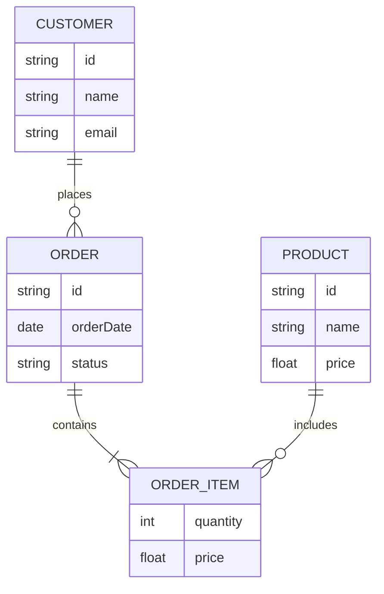

我找的是我大一的信息技术（Информатика）课老师，该老师的信息如下：
Балакшин Павел Валерьевич 125598
кандидат технических наук

Должности
 доцент (квалификационная категория "ординарный доцент"), [762] факультет программной инженерии и компьютерной техники
Полномочия
 выпускник, ITMO FAMILY 

Родился в г. Снежинск Челябинской области. Закончил среднюю общеобразовательную школу №121 г. Снежинска с золотой медалью.

В 2002 г. поступил в Санкт-Петербургский государственный институт точной механики и оптики (технический университет) на кафедру вычислительной техники. В 2006 г. получил степень бакалавра техники и технологий (диплом с отличием) по специальности 230100 «Информатика и вычислительная техника» (образовательная программа «Вычислительные машины, комплексы, системы и сети»). Научный руководитель - Тропченко А.Ю. Тема: «Развитие методов цифрового кодирования аудио и видеоинформации». В 2006 г. был назначен на стипендию Учёного совета университета. В 2008 г. получил степень магистра техники и технологий (диплом с отличием). Научный руководитель - Тропченко А.Ю. Тема: «Развитие и модификация алгоритмов распознавания речи, основанных на скрытых марковских моделях». В 2008-2011 и 2014-2015 гг. обучался в очной аспирантуре. В 2010 г. стал победителем конкурса грантов Правительства Санкт-Петербурга для аспирантов и был утверждён на стипендию Президента Российской Федерации на 2010–2011 учебный год.

В 2015 г. защитил диссертацию на соискание учёной степени кандидата технических наук по специальности 05.13.11 «Математическое и программное обеспечение вычислительных машин, комплексов и компьютерных сетей». Научный руководитель - Тропченко А.Ю. Тема: «Алгоритмические и программные средства распознавания речи на основе скрытых марковских моделей для телефонных служб поддержки клиентов».

C 2005 г. работает в ряде коммерческих компаний в должностях программиста, инженера, ведущего инженера, кооперационного менеджера.

C 2009 г. является сотрудником кафедры вычислительной техники/факультета программной инженерии и компьютерной техники, с 2011 г. - ассистент, с 2017 г. - доцент. В разные годы принимал участие в становлении курсов и проведении лекционных, лабораторных и практических занятий по дисциплинам:

- "Информатика";
- "Языки системного программирования", "Низкоуровневое программирование";
- "Параллельные вычисления", "Параллельное программирование", "Многоядерное программирование", "Распределённые вычисления", "Параллельная и распределённая обработка данных";
- "Основы системного программирования";
- "Обработка звука и речи".

Руководит выпускными квалификационными работами бакалавров, магистерскими и аспирантскими диссертациями.

В 2011-2018 гг. являлся контактным лицом кафедры вычислительной техники по приёму в бакалавриат.

В 2016 г. являлся ответственным за приём в бакалавриат факультета ПИиКТ. С 2020 г. является ответственным за аспирантуру по факультету ПИиКТ.

他所教授的课程分为讲座与实践课形式，需要学生在每一次讲座前在网络上查找并阅读相关的技术文章，并撰写文章摘要作为课堂作业提交，以锻炼学生的文献查找与阅读能力，在实践课上，针对每一个讲座章节的内容设置了七项不同的实践任务：

实验1要求学生掌握不同进制间的转换
实验2要求学生理解信息编码，并编程实现汉明码的校验
实验3要求学生学习使用Python编程与正则表达式完成一系列编程任务
实验4要求学生研究信息交换协议，格式与文档标记语言（YAML, XML, JSON），使用文档标记语言描述对象信息，并使用Python编写程序，实现文档在YAML, XML, JSON语言之间的自动转换
实验5要求学生熟练掌握电子文档的使用，要求学生使用Word文档撰写包含各种样式的专业技术文档，并在文档末尾使用Visual Basic语言实现一个电子调查问卷
实验6要求学生熟练掌握电子表格的使用，要求学生使用电子表格的公式与宏编程工具，实现一个12位任意二进制数字的计算器
实验7要求学生学习并掌握TeX文档排版语言，根据给出的学术文档页面，使用TeX语言进行1:1排版还原

以上实验工作均需要学生撰写规范的实验报告，并在实践课中跟老师进行一对一答辩

我在大一的第一个学期由于疫情延迟了半个学期入学，即便在这样的情况下，我依然顺利完成了全部的课程内容，并取得成绩为4C Хорошо，同时作为大一的外国新生，在实验工作答辩的过程中基本能够完全使用俄语完成工作答辩，虽然在

我申请的项目是CSC硕士研究生